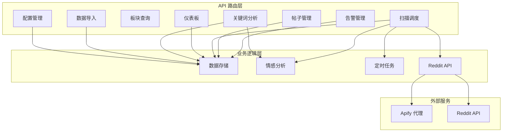
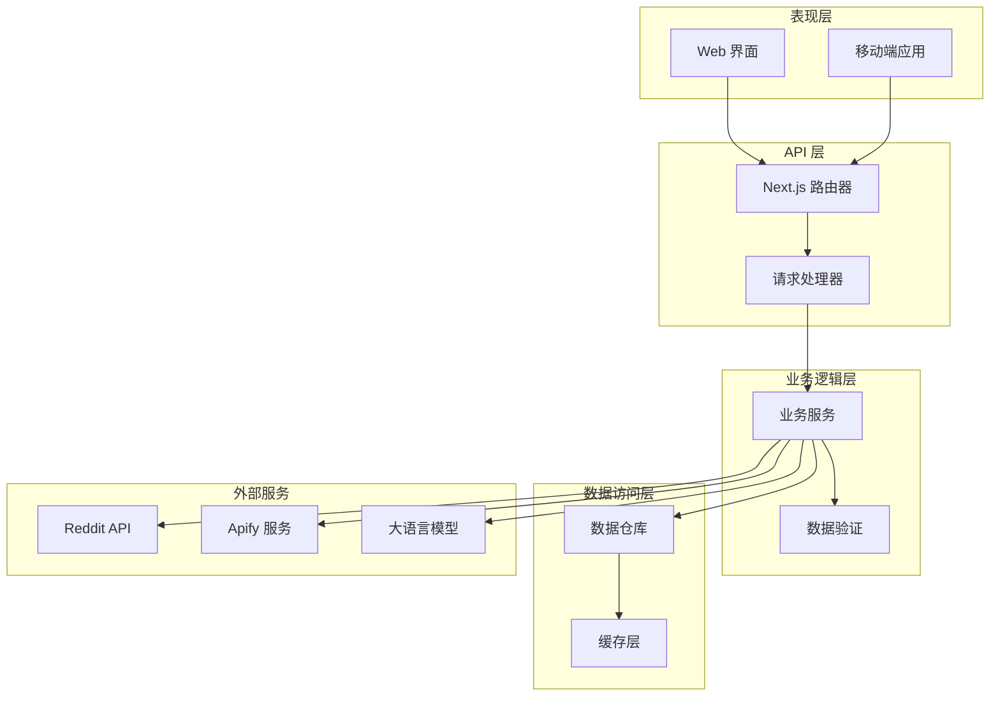
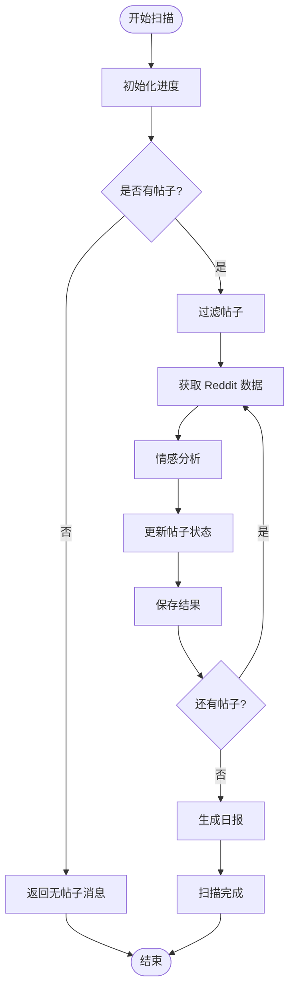
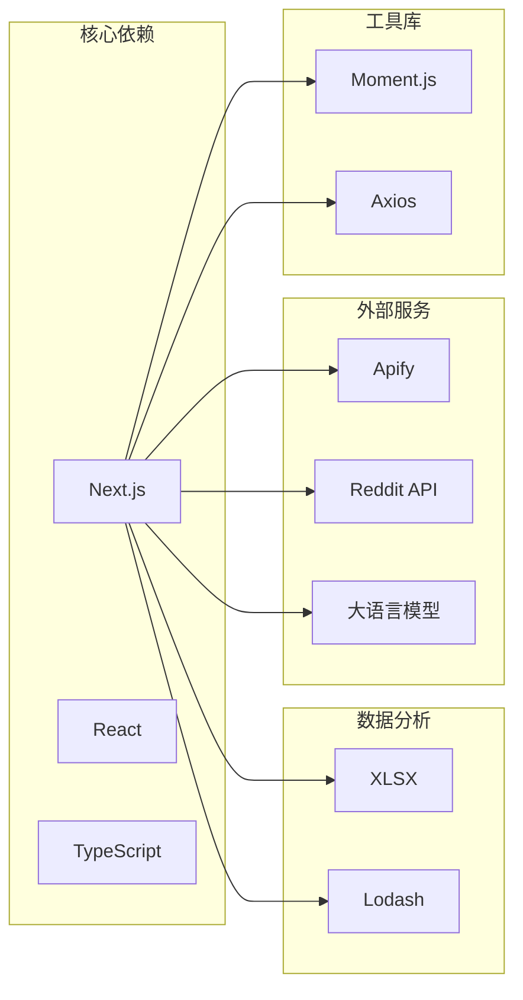
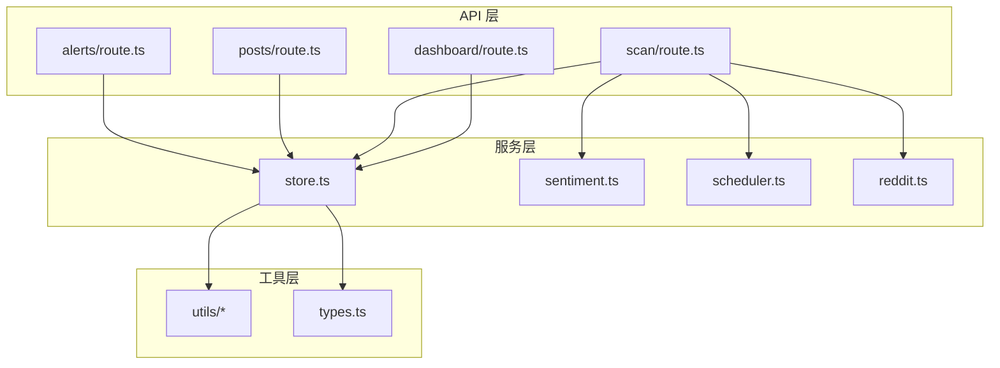

# API 接口文档

<cite>
**本文档引用的文件**
- [src/app/api/alerts/route.ts](file://src/app/api/alerts/route.ts)
- [src/app/api/posts/route.ts](file://src/app/api/posts/route.ts)
- [src/app/api/posts/[id]/route.ts](file://src/app/api/posts/[id]/route.ts)
- [src/app/api/subreddits/route.ts](file://src/app/api/subreddits/route.ts)
- [src/app/api/scan/route.ts](file://src/app/api/scan/route.ts)
- [src/app/api/dashboard/route.ts](file://src/app/api/dashboard/route.ts)
- [src/app/api/keywords/route.ts](file://src/app/api/keywords/route.ts)
- [src/app/api/detection-rules/route.ts](file://src/app/api/detection-rules/route.ts)
- [src/app/api/import/route.ts](file://src/app/api/import/route.ts)
- [src/app/api/scan-schedule/route.ts](file://src/app/api/scan-schedule/route.ts)
- [src/app/api/compare/route.ts](file://src/app/api/compare/route.ts)
- [src/app/api/subreddit-detail/route.ts](file://src/app/api/subreddit-detail/route.ts)
- [src/app/api/influencers/route.ts](file://src/app/api/influencers/route.ts)
- [src/app/api/proxy-diag/route.ts](file://src/app/api/proxy-diag/route.ts)
- [src/app/api/connectivity/route.ts](file://src/app/api/connectivity/route.ts)
</cite>

## 目录
1. [简介](#简介)
2. [项目结构](#项目结构)
3. [核心组件](#核心组件)
4. [架构概览](#架构概览)
5. [详细组件分析](#详细组件分析)
6. [依赖关系分析](#依赖关系分析)
7. [性能考虑](#性能考虑)
8. [故障排除指南](#故障排除指南)
9. [结论](#结论)
10. [附录](#附录)

## 简介
本文件为 Reddit 监控系统的完整 RESTful API 文档。该系统基于 Next.js App Router 构建，提供 Reddit 帖子监控、情感分析、关键词统计、告警管理、仪表板展示等功能。API 设计遵循 REST 原则，采用 JSON 格式进行请求和响应，并通过 NextResponse 提供统一的 HTTP 响应处理。

## 项目结构
系统采用模块化设计，API 路由按照功能域组织在 `src/app/api/` 目录下：



**图表来源**
- [src/app/api/alerts/route.ts:1-62](file://src/app/api/alerts/route.ts#L1-L62)
- [src/app/api/scan/route.ts:1-394](file://src/app/api/scan/route.ts#L1-L394)
- [src/app/api/dashboard/route.ts:1-108](file://src/app/api/dashboard/route.ts#L1-L108)

**章节来源**
- [src/app/api/alerts/route.ts:1-62](file://src/app/api/alerts/route.ts#L1-L62)
- [src/app/api/scan/route.ts:1-394](file://src/app/api/scan/route.ts#L1-L394)
- [src/app/api/dashboard/route.ts:1-108](file://src/app/api/dashboard/route.ts#L1-L108)

## 核心组件
系统包含以下核心组件：

### 数据存储组件
- **store**: 统一的数据访问层，提供帖子、评论、配置、扫描结果等数据的 CRUD 操作
- **mock-data**: 开发环境下的模拟数据，用于演示和测试

### 分析组件
- **sentiment**: 情感分析引擎，支持关键词匹配和 LLM 分析
- **summary**: 自动摘要生成
- **scheduler**: 定时扫描任务管理

### 外部集成
- **apify**: Apify 代理服务集成
- **reddit**: Reddit API 客户端封装

**章节来源**
- [src/app/api/scan/route.ts:1-394](file://src/app/api/scan/route.ts#L1-L394)
- [src/app/api/dashboard/route.ts:1-108](file://src/app/api/dashboard/route.ts#L1-L108)

## 架构概览
系统采用分层架构设计，各层职责清晰分离：



**图表来源**
- [src/app/api/scan/route.ts:1-394](file://src/app/api/scan/route.ts#L1-L394)
- [src/app/api/keywords/route.ts:1-156](file://src/app/api/keywords/route.ts#L1-L156)

## 详细组件分析

### 告警管理 API
提供 Reddit 帖子告警的查询和状态更新功能。

#### 端点定义
- **GET** `/api/alerts` - 查询告警列表
- **PATCH** `/api/alerts` - 更新告警状态

#### 请求参数
**GET 请求参数:**
- `status` (可选): 告警状态过滤器
  - 值: `all` | `pending` | `processing` | `resolved` | `ignored`
  - 默认: `all`

#### 响应格式
```json
{
  "posts": [
    {
      "id": "string",
      "title": "string",
      "alertLevel": "critical" | "medium" | "safe" | "low",
      "alertStatus": "pending" | "processing" | "resolved" | "ignored",
      "handler": "string",
      "handleNote": "string",
      "handleTime": "string",
      "createdAt": "string"
    }
  ],
  "stats": {
    "pending": 0,
    "pendingCritical": 0,
    "pendingMedium": 0,
    "processing": 0,
    "resolved": 0,
    "ignored": 0
  }
}
```

#### 错误处理
- 400 Bad Request: 缺少必需参数
- 404 Not Found: 帖子不存在

**章节来源**
- [src/app/api/alerts/route.ts:1-62](file://src/app/api/alerts/route.ts#L1-L62)

### 帖子管理 API
提供 Reddit 帖子的查询、删除和管理功能。

#### 端点定义
- **GET** `/api/posts` - 查询帖子列表
- **DELETE** `/api/posts` - 删除帖子

#### 请求参数
**GET 请求参数:**
- `level` (可选): 告警级别过滤
  - 值: `all` | `critical` | `medium` | `safe`
- `search` (可选): 搜索关键词
- `sort` (可选): 排序方式
  - 值: `alert` | `date` | `comments` | `influence` | `negative`
- `dateFrom` (可选): 开始日期
- `dateTo` (可选): 结束日期
- `subreddit` (可选): 板块名称

#### 响应格式
```json
{
  "posts": [
    {
      "id": "string",
      "title": "string",
      "subreddit": "string",
      "alertLevel": "critical" | "medium" | "safe" | "low",
      "commentCount": 0,
      "totalCommentsFetched": 0,
      "flaggedComments": 0,
      "flaggedRatio": "string",
      "totalInfluenceScore": 0
    }
  ],
  "total": 0
}
```

#### 删除操作
**DELETE 请求体:**
```json
{
  "postId": "string",
  "deleteAll": true
}
```

**章节来源**
- [src/app/api/posts/route.ts:1-157](file://src/app/api/posts/route.ts#L1-L157)

### 帖子详情 API
提供单个帖子的详细信息和评论分析。

#### 端点定义
- **GET** `/api/posts/[id]` - 获取帖子详情

#### 响应格式
```json
{
  "post": {
    "id": "string",
    "title": "string",
    "subreddit": "string",
    "alertLevel": "critical" | "medium" | "safe" | "low",
    "createdAt": "string"
  },
  "comments": [
    {
      "id": "string",
      "author": "string",
      "body": "string",
      "score": 0,
      "sentimentScore": 0,
      "influenceScore": 0,
      "flagReasons": ["string"],
      "replies": []
    }
  ],
  "summary": {
    "total": 0,
    "flagged": 0,
    "positive": 0,
    "neutral": 0,
    "negative": 0,
    "categories": {},
    "avgSentiment": "string",
    "totalInfluenceScore": 0
  }
}
```

**章节来源**
- [src/app/api/posts/[id]/route.ts](file://src/app/api/posts/[id]/route.ts#L1-L98)

### 板块查询 API
获取所有可用的 Reddit 板块列表。

#### 端点定义
- **GET** `/api/subreddits` - 获取板块列表

#### 响应格式
```json
{
  "subreddits": ["string"]
}
```

**章节来源**
- [src/app/api/subreddits/route.ts:1-14](file://src/app/api/subreddits/route.ts#L1-L14)

### 扫描调度 API
管理 Reddit 帖子的自动扫描功能。

#### 端点定义
- **POST** `/api/scan` - 启动扫描任务
- **GET** `/api/scan` - 获取扫描进度
- **DELETE** `/api/scan` - 停止扫描任务

#### 扫描配置
**POST 请求体:**
```json
{
  "postIds": ["string"],
  "scanAll": true,
  "quickScan": true,
  "skipRecentHours": 0
}
```

#### 扫描进度响应
```json
{
  "isRunning": false,
  "current": 0,
  "total": 0,
  "postTitle": "string",
  "message": "string"
}
```

#### 扫描流程图


**图表来源**
- [src/app/api/scan/route.ts:21-379](file://src/app/api/scan/route.ts#L21-L379)

**章节来源**
- [src/app/api/scan/route.ts:1-394](file://src/app/api/scan/route.ts#L1-L394)

### 仪表板 API
提供系统整体监控数据和统计信息。

#### 端点定义
- **GET** `/api/dashboard` - 获取仪表板数据

#### 响应格式
```json
{
  "stats": {
    "totalPosts": 0,
    "criticalAlerts": 0,
    "mediumAlerts": 0,
    "safePosts": 0,
    "totalComments": 0,
    "flaggedComments": 0,
    "flaggedRatio": "string"
  },
  "sentimentDistribution": {
    "positive": 0,
    "neutral": 0,
    "negative": 0
  },
  "categoryBreakdown": {},
  "topFlaggedPosts": [],
  "recentFlagged": [],
  "trendData": []
}
```

**章节来源**
- [src/app/api/dashboard/route.ts:1-108](file://src/app/api/dashboard/route.ts#L1-L108)

### 关键词分析 API
分析评论中的关键词分布和类别统计。

#### 端点定义
- **GET** `/api/keywords` - 获取关键词统计

#### 请求参数
- `subreddit` (可选): 板块过滤
- `keyword` (可选): 关键词搜索
- `commentDateFrom` (可选): 评论开始日期
- `commentDateTo` (可选): 评论结束日期
- `postDateFrom` (可选): 帖子开始日期
- `postDateTo` (可选): 帖子结束日期
- `brandKeywords` (可选): 品牌关键词过滤
- `sceneKeywords` (可选): 场景关键词过滤
- `modelKeywords` (可选): 模型关键词过滤
- `qualityKeywords` (可选): 质量关键词过滤

#### 响应格式
```json
{
  "keywords": [
    {
      "word": "string",
      "count": 0
    }
  ],
  "total": 0,
  "subreddits": ["string"],
  "categories": {}
}
```

**章节来源**
- [src/app/api/keywords/route.ts:1-156](file://src/app/api/keywords/route.ts#L1-L156)

### 检测规则 API
管理情感分析的检测规则配置。

#### 端点定义
- **GET** `/api/detection-rules` - 获取检测规则
- **POST** `/api/detection-rules` - 更新检测规则

#### 规则配置
```json
{
  "brand_attack": true,
  "product_hate": true,
  "negative_sentiment": true,
  "call_to_action_negative": true,
  "competitor_push": true
}
```

**章节来源**
- [src/app/api/detection-rules/route.ts:1-49](file://src/app/api/detection-rules/route.ts#L1-L49)

### 数据导入 API
支持从 Excel/CSV 文件批量导入 Reddit 帖子数据。

#### 端点定义
- **POST** `/api/import` - 导入数据文件

#### 请求格式
- Content-Type: `multipart/form-data`
- 参数: `file` (Excel/CSV 文件)

#### 响应格式
```json
{
  "success": true,
  "message": "string",
  "totalRows": 0,
  "newPosts": 0,
  "duplicatePosts": 0,
  "skippedRows": 0,
  "existingPostsBefore": 0,
  "totalPostsAfter": 0,
  "detectedColumns": {
    "urlColumn": "string",
    "titleColumn": "string",
    "subredditColumn": "string",
    "authorColumn": "string"
  }
}
```

**章节来源**
- [src/app/api/import/route.ts:1-244](file://src/app/api/import/route.ts#L1-L244)

### 扫描计划 API
管理自动扫描的时间配置。

#### 端点定义
- **GET** `/api/scan-schedule` - 获取扫描配置
- **POST** `/api/scan-schedule` - 更新扫描配置

#### 配置参数
```json
{
  "autoScanEnabled": true,
  "scanTime": "HH:mm",
  "scanSchedule": "cron表达式",
  "sentimentThreshold": 0
}
```

**章节来源**
- [src/app/api/scan-schedule/route.ts:1-53](file://src/app/api/scan-schedule/route.ts#L1-L53)

### 对比分析 API
提供跨板块的情感分析对比。

#### 端点定义
- **GET** `/api/compare` - 获取对比数据

#### 响应格式
```json
{
  "subreddits": [
    {
      "subreddit": "string",
      "totalPosts": 0,
      "totalComments": 0,
      "positiveRate": 0,
      "neutralRate": 0,
      "negativeRate": 0,
      "flaggedComments": 0,
      "criticalPosts": 0,
      "mediumPosts": 0,
      "healthScore": 0
    }
  ]
}
```

**章节来源**
- [src/app/api/compare/route.ts:1-68](file://src/app/api/compare/route.ts#L1-L68)

### 板块详情 API
获取特定板块的恶意评论分析。

#### 端点定义
- **GET** `/api/subreddit-detail` - 获取板块详情

#### 请求参数
- `subreddit` (可选): 板块名称

#### 响应格式
```json
{
  "posts": [
    {
      "id": "string",
      "title": "string",
      "redditUrl": "string",
      "alertLevel": "critical" | "medium" | "safe" | "low",
      "commentCount": 0,
      "flaggedCommentCount": 0,
      "influenceScore": 0,
      "maliciousComments": []
    }
  ]
}
```

**章节来源**
- [src/app/api/subreddit-detail/route.ts:1-63](file://src/app/api/subreddit-detail/route.ts#L1-L63)

### 影响者分析 API
识别具有高影响力的恶意评论作者。

#### 端点定义
- **GET** `/api/influencers` - 获取影响者列表

#### 请求参数
- `subreddit` (可选): 板块过滤
- `keyword` (可选): 关键词过滤
- `author` (可选): 作者过滤
- `commentDateFrom` (可选): 评论时间范围
- `commentDateTo` (可选): 评论时间范围
- `postDateFrom` (可选): 帖子时间范围
- `postDateTo` (可选): 帖子时间范围

#### 响应格式
```json
{
  "comments": [
    {
      "id": "string",
      "author": "string",
      "body": "string",
      "score": 0,
      "sentimentScore": 0,
      "influenceScore": 0,
      "postId": "string",
      "postTitle": "string",
      "subreddit": "string",
      "postCreatedAt": "string",
      "postUrl": "string"
    }
  ],
  "total": 0,
  "subreddits": ["string"]
}
```

**章节来源**
- [src/app/api/influencers/route.ts:1-111](file://src/app/api/influencers/route.ts#L1-L111)

### 连接诊断 API
检查系统连接状态和配置。

#### 端点定义
- **GET** `/api/proxy-diag` - 代理诊断
- **GET** `/api/connectivity` - 连接状态检查

#### 诊断响应
```json
{
  "envCheck": {
    "APIFY_TOKEN": "string",
    "NODE_ENV": "string"
  },
  "apifyStatus": {
    "configured": true,
    "message": "string"
  }
}
```

**章节来源**
- [src/app/api/proxy-diag/route.ts:1-24](file://src/app/api/proxy-diag/route.ts#L1-L24)
- [src/app/api/connectivity/route.ts:1-25](file://src/app/api/connectivity/route.ts#L1-L25)

## 依赖关系分析

### 外部依赖


**图表来源**
- [src/app/api/import/route.ts:1-244](file://src/app/api/import/route.ts#L1-L244)
- [src/app/api/scan/route.ts:1-394](file://src/app/api/scan/route.ts#L1-L394)

### 内部依赖关系


**图表来源**
- [src/app/api/alerts/route.ts:1-62](file://src/app/api/alerts/route.ts#L1-L62)
- [src/app/api/scan/route.ts:1-394](file://src/app/api/scan/route.ts#L1-L394)
- [src/app/api/dashboard/route.ts:1-108](file://src/app/api/dashboard/route.ts#L1-L108)

**章节来源**
- [src/app/api/scan/route.ts:1-394](file://src/app/api/scan/route.ts#L1-L394)
- [src/app/api/dashboard/route.ts:1-108](file://src/app/api/dashboard/route.ts#L1-L108)

## 性能考虑

### 扫描性能优化
1. **智能延迟机制**: 3个月内的帖子才进行全量扫描
2. **冷却期控制**: 最近扫描的帖子跳过重复扫描
3. **并发限制**: Reddit 请求间隔3秒避免429错误
4. **LLM 调用限流**: 评论分析间隔300ms

### 数据查询优化
1. **索引字段**: 按 `createdAt` 和 `alertLevel` 建立查询索引
2. **分页查询**: 大数据集采用分页处理
3. **缓存策略**: 频繁访问的数据进行内存缓存

### 存储优化
1. **数据压缩**: 评论数据采用压缩存储
2. **增量更新**: 只更新变化的数据字段
3. **批量操作**: 大量数据操作采用事务处理

## 故障排除指南

### 常见错误及解决方案

#### 扫描失败
**症状**: 扫描任务报错或部分帖子扫描失败
**原因**: Reddit API 限制、网络问题、代理配置错误
**解决方案**:
1. 检查 `APIFY_TOKEN` 环境变量配置
2. 验证 Reddit API 访问权限
3. 查看扫描日志中的具体错误信息

#### 数据导入失败
**症状**: Excel/CSV 文件导入报错
**原因**: 文件格式不支持、列名不匹配、数据格式错误
**解决方案**:
1. 确保文件包含有效的 Reddit 链接列
2. 检查文件编码格式（UTF-8）
3. 验证列名与系统期望的关键词匹配

#### 性能问题
**症状**: API 响应缓慢
**原因**: 数据量过大、查询条件不当、缓存未命中
**解决方案**:
1. 添加适当的查询过滤条件
2. 使用分页参数限制返回数量
3. 检查数据库索引配置

### 调试工具
1. **浏览器开发者工具**: 监控网络请求和响应
2. **日志分析**: 查看服务器端日志输出
3. **性能监控**: 使用浏览器性能面板分析渲染时间

**章节来源**
- [src/app/api/scan/route.ts:1-394](file://src/app/api/scan/route.ts#L1-L394)
- [src/app/api/proxy-diag/route.ts:1-24](file://src/app/api/proxy-diag/route.ts#L1-L24)

## 结论
Reddit 监控系统提供了完整的 RESTful API 解决方案，涵盖了从数据采集、情感分析到可视化展示的全流程。系统采用模块化设计，具有良好的扩展性和维护性。通过合理的性能优化和错误处理机制，能够满足生产环境的稳定运行需求。

## 附录

### 版本信息
- **当前版本**: 1.0.0
- **最后更新**: 2024
- **兼容性**: Next.js 14+，Node.js 18+

### 安全考虑
1. **认证机制**: 基于环境变量的访问控制
2. **数据加密**: 敏感数据在传输过程中加密
3. **输入验证**: 所有用户输入都经过严格验证
4. **权限控制**: 不同用户角色具有不同的 API 访问权限

### 速率限制
- **扫描请求**: 每帖子至少3秒间隔
- **LLM 调用**: 每评论至少300ms间隔
- **通用 API**: 建议每分钟不超过100次请求

### 迁移指南
由于系统处于开发阶段，暂无正式的版本迁移文档。如需升级，请备份现有数据并在测试环境中验证后再进行生产部署。