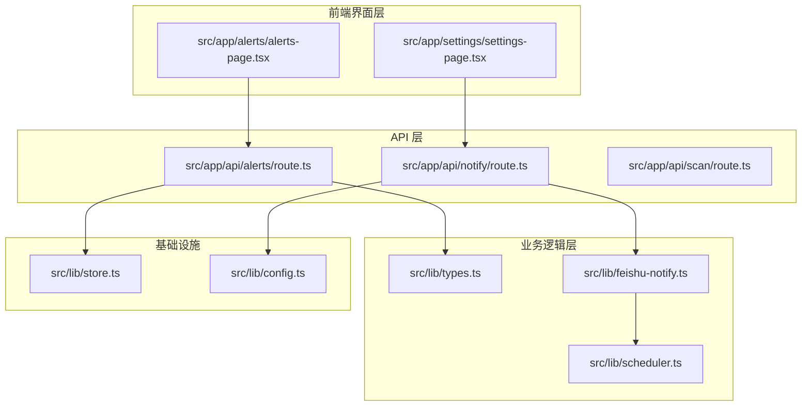
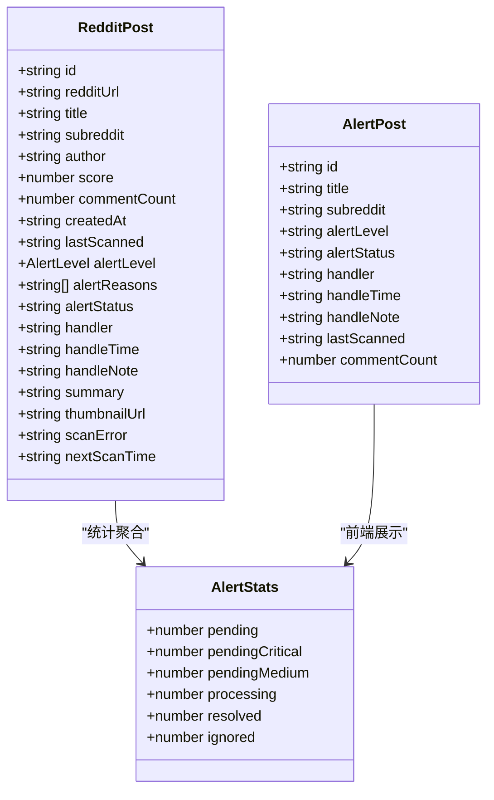
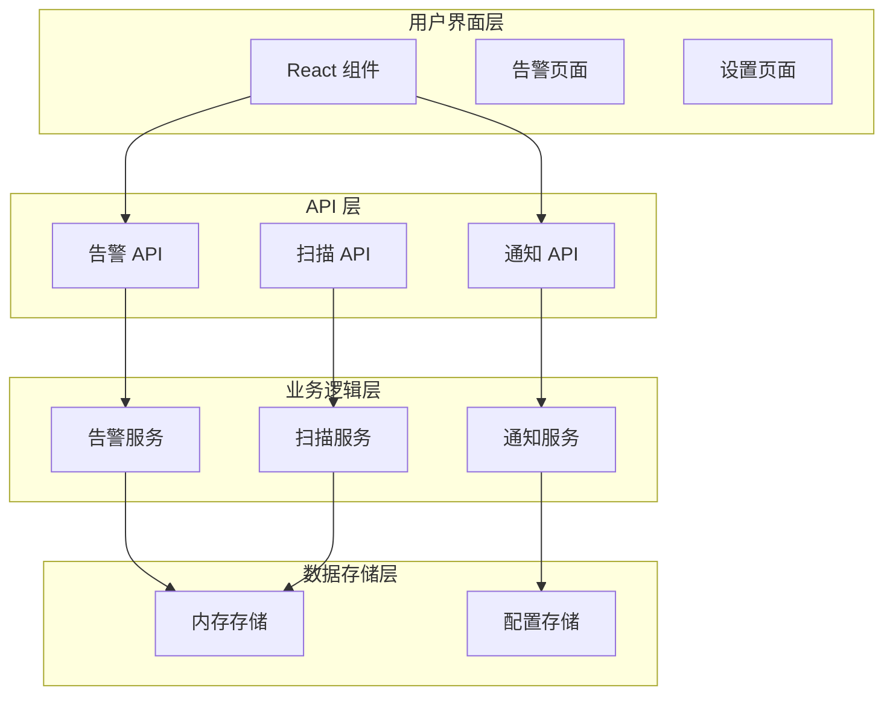
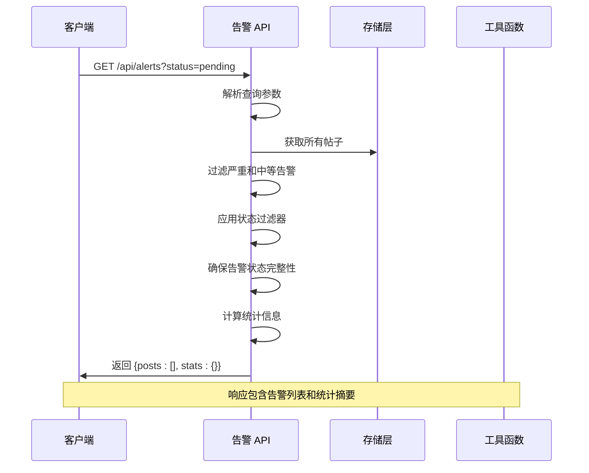
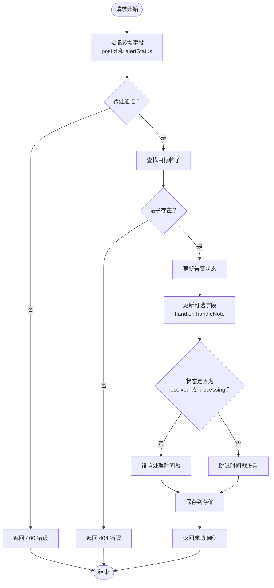
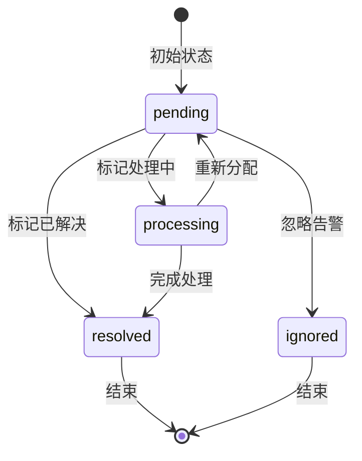
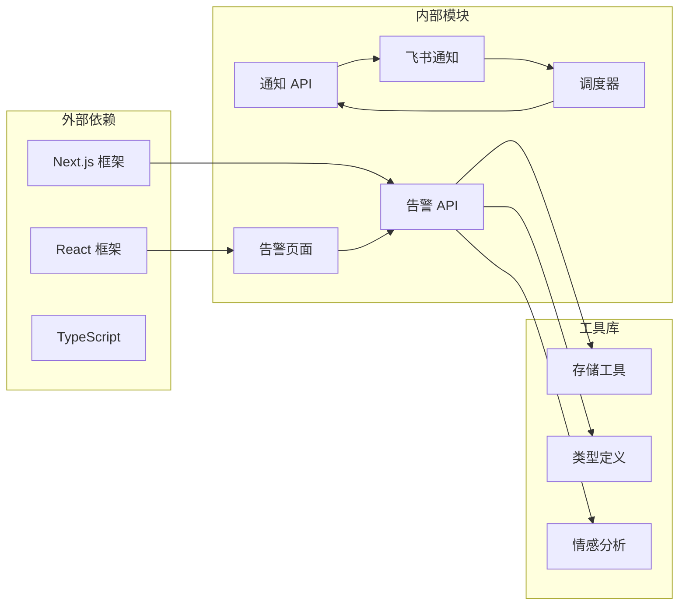

# 告警管理 API

<cite>
**本文档引用的文件**
- [src/app/api/alerts/route.ts](file://src/app/api/alerts/route.ts)
- [src/lib/types.ts](file://src/lib/types.ts)
- [src/app/alerts/alerts-page.tsx](file://src/app/alerts/alerts-page.tsx)
- [src/app/settings/settings-page.tsx](file://src/app/settings/settings-page.tsx)
- [src/app/api/notify/route.ts](file://src/app/api/notify/route.ts)
- [src/lib/feishu-notify.ts](file://src/lib/feishu-notify.ts)
- [src/lib/scheduler.ts](file://src/lib/scheduler.ts)
- [src/instrumentation.ts](file://src/instrumentation.ts)
</cite>

## 目录
1. [简介](#简介)
2. [项目结构](#项目结构)
3. [核心组件](#核心组件)
4. [架构概览](#架构概览)
5. [详细组件分析](#详细组件分析)
6. [依赖关系分析](#依赖关系分析)
7. [性能考虑](#性能考虑)
8. [故障排除指南](#故障排除指南)
9. [结论](#结论)

## 简介

告警管理 API 是 Reddit 品牌声誉监控系统的核心组件，负责处理和管理社交媒体平台上的威胁性内容告警。该 API 提供了完整的告警生命周期管理功能，包括告警事件的检索、状态更新、统计分析以及与飞书通知系统的集成。

系统采用 React Next.js 架构，使用 TypeScript 进行类型安全编程，实现了前后端分离的现代化 Web 应用程序。告警管理功能专注于识别和处理可能影响品牌声誉的负面内容，特别是那些具有高度攻击性和煽动性的评论。

## 项目结构

告警管理 API 的项目结构遵循模块化设计原则，主要分为以下几个关键部分：

**图表来源**
- [src/app/api/alerts/route.ts:1-62](file://src/app/api/alerts/route.ts#L1-L62)
- [src/app/alerts/alerts-page.tsx:1-220](file://src/app/alerts/alerts-page.tsx#L1-L220)
- [src/lib/types.ts:1-194](file://src/lib/types.ts#L1-L194)

**章节来源**
- [src/app/api/alerts/route.ts:1-62](file://src/app/api/alerts/route.ts#L1-L62)
- [src/lib/types.ts:1-194](file://src/lib/types.ts#L1-L194)

## 核心组件

### 数据模型

告警管理系统基于以下核心数据模型构建：

#### 告警级别定义
系统支持五级告警级别，从低风险到高风险依次为：
- **critical（严重）**: 最高优先级，需要立即处理
- **medium（中等）**: 需要关注的重要告警
- **safe/low（安全）**: 正常状态，无威胁

#### 告警状态枚举
告警状态管理采用四状态模型：
- **pending（待处理）**: 新生成但尚未分配处理的状态
- **processing（处理中）**: 已分配给处理人员的状态
- **resolved（已解决）**: 处理完成并确认的状态
- **ignored（已忽略）**: 认定为误报或无需处理的状态

#### 实体属性说明

**图表来源**
- [src/lib/types.ts:9-29](file://src/lib/types.ts#L9-L29)
- [src/app/alerts/alerts-page.tsx:5-25](file://src/app/alerts/alerts-page.tsx#L5-L25)

**章节来源**
- [src/lib/types.ts:3-29](file://src/lib/types.ts#L3-L29)
- [src/app/alerts/alerts-page.tsx:5-25](file://src/app/alerts/alerts-page.tsx#L5-L25)

## 架构概览

告警管理系统的整体架构采用分层设计，确保了良好的可维护性和扩展性：

**图表来源**
- [src/app/api/alerts/route.ts:1-62](file://src/app/api/alerts/route.ts#L1-L62)
- [src/app/api/notify/route.ts:1-118](file://src/app/api/notify/route.ts#L1-L118)

## 详细组件分析

### GET /api/alerts - 告警事件列表获取

#### 查询参数

| 参数名 | 类型 | 必填 | 默认值 | 描述 |
|--------|------|------|--------|------|
| status | string | 否 | 'all' | 过滤告警状态，可选值：'all'、'pending'、'processing'、'resolved'、'ignored' |

#### 响应格式

**图表来源**
- [src/app/api/alerts/route.ts:4-35](file://src/app/api/alerts/route.ts#L4-L35)

#### 过滤逻辑

系统采用两阶段过滤机制：

1. **基础过滤**: 只显示最近扫描过的帖子，且告警级别为严重或中等
2. **状态过滤**: 根据查询参数进一步筛选特定状态的告警

#### 统计计算

系统实时计算以下统计指标：
- 待处理总数（pending）
- 待处理严重告警数量
- 待处理中等告警数量
- 处理中数量
- 已解决数量
- 已忽略数量

**章节来源**
- [src/app/api/alerts/route.ts:4-35](file://src/app/api/alerts/route.ts#L4-L35)

### PATCH /api/alerts - 告警状态更新

#### 请求格式

**图表来源**
- [src/app/api/alerts/route.ts:37-61](file://src/app/api/alerts/route.ts#L37-L61)

#### 状态转换规则

**图表来源**
- [src/lib/types.ts:6-7](file://src/lib/types.ts#L6-L7)

#### 时间戳处理

当告警状态转换为 `resolved` 或 `processing` 时，系统会自动设置 `handleTime` 字段为当前 ISO 8601 格式时间戳。

**章节来源**
- [src/app/api/alerts/route.ts:37-61](file://src/app/api/alerts/route.ts#L37-L61)
- [src/lib/types.ts:6-7](file://src/lib/types.ts#L6-L7)

### 告警实体数据模型

#### 核心属性详解

| 属性名 | 类型 | 必填 | 描述 | 示例值 |
|--------|------|------|------|--------|
| id | string | 是 | 帖子唯一标识符 | "t3_xxxxxx" |
| alertLevel | AlertLevel | 是 | 告警级别 | "critical" |
| alertStatus | AlertStatus | 否 | 告警状态，默认 "pending" | "processing" |
| handler | string | 否 | 处理人员姓名 | "张三" |
| handleTime | string | 否 | 处理时间戳 | "2024-01-15T10:30:00Z" |
| handleNote | string | 否 | 处理备注说明 | "已联系用户删除相关内容" |
| lastScanned | string | 否 | 最后扫描时间 | "2024-01-15T09:00:00Z" |
| alertReasons | string[] | 否 | 告警原因列表 | ["brand_attack", "negative_sentiment"] |

**章节来源**
- [src/lib/types.ts:9-29](file://src/lib/types.ts#L9-L29)

## 依赖关系分析

### 组件耦合度分析

**图表来源**
- [src/app/api/alerts/route.ts:1-2](file://src/app/api/alerts/route.ts#L1-L2)
- [src/app/alerts/alerts-page.tsx:1-3](file://src/app/alerts/alerts-page.tsx#L1-L3)

### 关键依赖关系

1. **API 与存储层**: 告警 API 直接依赖存储工具进行数据持久化
2. **前端与 API**: 前端组件通过 HTTP 请求与后端 API 通信
3. **通知系统集成**: 告警状态变更触发通知系统的相应处理
4. **调度系统**: 通知功能依赖调度器进行定时任务管理

**章节来源**
- [src/app/api/alerts/route.ts:1-2](file://src/app/api/alerts/route.ts#L1-L2)
- [src/app/alerts/alerts-page.tsx:1-3](file://src/app/alerts/alerts-page.tsx#L1-L3)

## 性能考虑

### 内存优化策略

1. **数据过滤优化**: 在 API 层进行数据过滤，减少前端渲染负担
2. **状态缓存**: 利用内存存储避免重复的数据加载
3. **批量操作**: 支持批量状态更新以提高处理效率

### 并发处理

系统采用异步处理模式，确保在大量告警同时更新时仍能保持响应性。

## 故障排除指南

### 常见问题及解决方案

#### API 响应错误

| 错误码 | 可能原因 | 解决方案 |
|--------|----------|----------|
| 400 | 缺少必需参数 | 确保请求包含 `postId` 和 `alertStatus` |
| 404 | 帖子不存在 | 检查帖子 ID 是否正确 |
| 500 | 服务器内部错误 | 查看服务器日志获取详细信息 |

#### 前端交互问题

1. **告警列表不显示**: 检查网络连接和 API 可达性
2. **状态更新失败**: 确认用户权限和帖子状态有效性
3. **统计数据不准确**: 刷新页面或检查数据同步状态

**章节来源**
- [src/app/api/alerts/route.ts:41-49](file://src/app/api/alerts/route.ts#L41-L49)

## 结论

告警管理 API 提供了一个完整、高效的品牌声誉监控解决方案。通过清晰的 API 设计、完善的告警状态管理和灵活的通知集成机制，系统能够有效识别和处理潜在的威胁性内容。

系统的主要优势包括：
- **实时性**: 支持实时告警检测和状态更新
- **可扩展性**: 模块化设计便于功能扩展
- **易用性**: 直观的前端界面和清晰的 API 接口
- **可靠性**: 完善的错误处理和数据一致性保证

未来可以考虑的功能增强方向：
- 添加告警历史追踪功能
- 扩展通知渠道支持
- 增强数据分析和报告功能
- 优化大规模数据处理性能