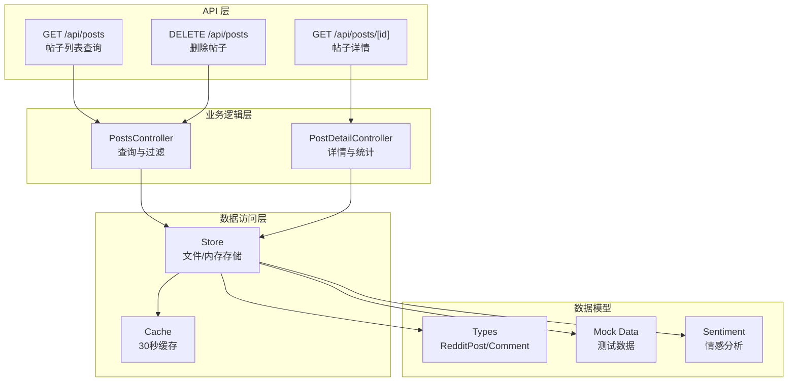
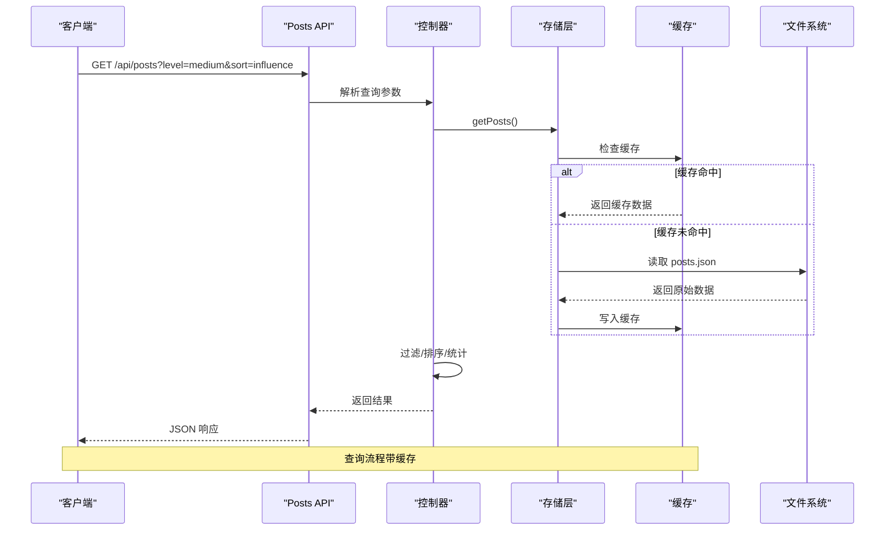
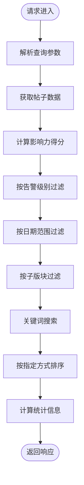
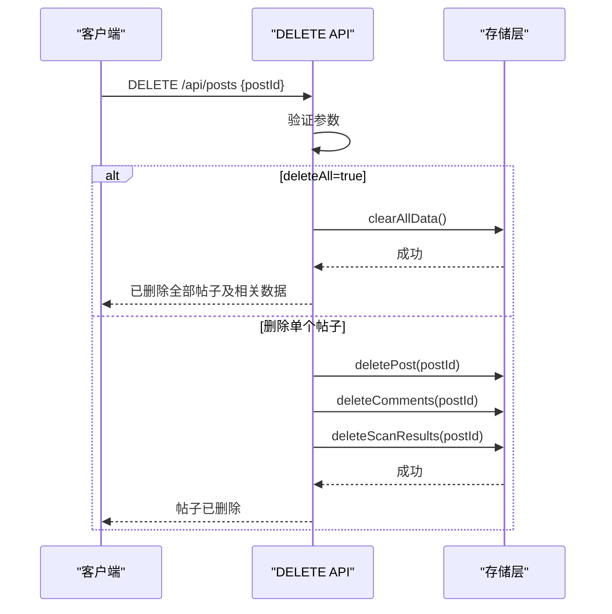
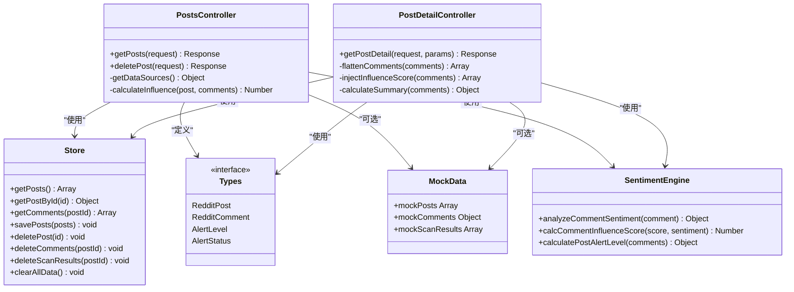

# 帖子管理 API

<cite>
**本文引用的文件**
- [src/app/api/posts/route.ts](file://src/app/api/posts/route.ts)
- [src/app/api/posts/[id]/route.ts](file://src/app/api/posts/[id]/route.ts)
- [src/lib/types.ts](file://src/lib/types.ts)
- [src/lib/store.ts](file://src/lib/store.ts)
- [src/lib/mock-data.ts](file://src/lib/mock-data.ts)
- [src/lib/sentiment.ts](file://src/lib/sentiment.ts)
- [data/posts.json](file://data/posts.json)
</cite>

## 目录
1. [简介](#简介)
2. [项目结构](#项目结构)
3. [核心组件](#核心组件)
4. [架构概览](#架构概览)
5. [详细组件分析](#详细组件分析)
6. [依赖关系分析](#依赖关系分析)
7. [性能考虑](#性能考虑)
8. [故障排除指南](#故障排除指南)
9. [结论](#结论)

## 简介
本文件为 Reddit 品牌监控系统的帖子管理 API 提供详细的 RESTful API 文档。该系统支持：
- 获取帖子列表及统计信息（GET /api/posts）
- 删除特定帖子及其关联数据（DELETE /api/posts）
- 查看帖子详情及评论分析（GET /api/posts/[id]）

系统采用本地文件存储与内存存储相结合的方式，在开发环境使用 JSON 文件持久化，在 Vercel 环境使用内存存储，并提供缓存机制提升性能。

## 项目结构
帖子管理 API 位于 Next.js App Router 的 API 路由中，主要文件组织如下：
- API 路由：src/app/api/posts/route.ts（列表查询与删除）
- API 路由：src/app/api/posts/[id]/route.ts（详情查询）
- 数据模型：src/lib/types.ts
- 存储层：src/lib/store.ts
- 模拟数据：src/lib/mock-data.ts
- 情感分析：src/lib/sentiment.ts
- 数据文件：data/posts.json



**图表来源**
- [src/app/api/posts/route.ts:13-156](file://src/app/api/posts/route.ts#L13-L156)
- [src/app/api/posts/[id]/route.ts](file://src/app/api/posts/[id]/route.ts#L30-L97)
- [src/lib/store.ts:89-173](file://src/lib/store.ts#L89-L173)

**章节来源**
- [src/app/api/posts/route.ts:1-157](file://src/app/api/posts/route.ts#L1-L157)
- [src/app/api/posts/[id]/route.ts](file://src/app/api/posts/[id]/route.ts#L1-L98)
- [src/lib/store.ts:1-285](file://src/lib/store.ts#L1-L285)

## 核心组件

### 数据模型定义

#### RedditPost 实体
帖子实体包含以下字段：
- id: 字符串，帖子唯一标识
- redditUrl: 字符串，Reddit 帖子链接
- title: 字符串，帖子标题
- subreddit: 字符串，所属子版块
- author: 字符串，作者
- score: 数字，帖子评分
- commentCount: 数字，评论数量
- createdAt: 字符串（ISO 8601），创建时间
- lastScanned: 字符串（ISO 8601 或 null），最后扫描时间
- alertLevel: 枚举，告警级别（critical/high/medium/low/safe）
- alertReasons: 字符串数组，告警原因
- thumbnailUrl: 可选字符串，缩略图 URL
- summary: 可选字符串，摘要
- alertStatus: 可选枚举，告警状态（pending/processing/resolved/ignored）
- handler: 可选字符串，处理人
- handleTime: 可选字符串（ISO 8601），处理时间
- handleNote: 可选字符串，处理备注
- scanError: 可选字符串，扫描错误信息
- nextScanTime: 可选字符串（ISO 8601），下次扫描时间

#### RedditComment 实体
评论实体包含以下字段：
- id: 字符串，评论唯一标识
- postId: 字符串，所属帖子 ID
- author: 字符串，作者
- body: 字符串，评论内容
- score: 数字，评论评分
- createdAt: 字符串（ISO 8601），创建时间
- sentimentScore: 数字，情感分数（-1 到 1，负值表示敌对）
- isFlagged: 布尔值，是否标记为恶意
- flagReasons: 字符串数组，标记原因
- permalink: 字符串，评论永久链接
- influenceScore: 可选数字，影响力得分
- replies: 可选评论数组，回复评论

#### 验证规则
- 时间字段必须符合 ISO 8601 格式
- alertLevel 必须为预定义枚举值之一
- score 和 commentCount 必须为非负整数
- sentimentScore 必须在 -1 到 1 范围内
- isFlagged 必须为布尔值

**章节来源**
- [src/lib/types.ts:9-44](file://src/lib/types.ts#L9-L44)

### 存储层设计
系统采用双存储策略：
- 本地开发：JSON 文件持久化（data/posts.json、data/comments.json、data/scans.json）
- 生产部署（Vercel）：内存存储 + 环境变量覆盖
- 缓存机制：30秒 TTL 避免频繁读取大文件

存储操作包括：
- getPosts()/getPostById()：获取帖子列表或指定帖子
- getComments()/saveComments()：获取/保存评论
- getScanResults()/saveScanResult()：获取/保存扫描结果
- deletePost()/deleteComments()/deleteScanResults()：删除相关数据
- clearAllData()：清空所有数据

**章节来源**
- [src/lib/store.ts:89-173](file://src/lib/store.ts#L89-L173)

## 架构概览



**图表来源**
- [src/app/api/posts/route.ts:13-127](file://src/app/api/posts/route.ts#L13-L127)
- [src/lib/store.ts:73-93](file://src/lib/store.ts#L73-L93)

**章节来源**
- [src/app/api/posts/route.ts:13-127](file://src/app/api/posts/route.ts#L13-L127)
- [src/lib/store.ts:73-93](file://src/lib/store.ts#L73-L93)

## 详细组件分析

### GET /api/posts - 帖子列表查询

#### 请求参数
- level: 字符串，告警级别过滤器
  - all: 不限（默认）
  - critical: 严重/高风险
  - medium: 中等风险
  - safe: 低风险/安全
- search: 字符串，搜索关键词
- sort: 字符串，排序方式
  - alert: 按告警级别排序（critical > high > medium > low > safe）
  - date: 按创建时间排序
  - comments: 按评论数量排序
  - influence: 按影响力得分排序
  - negative: 按负面占比排序
- dateFrom: 字符串（ISO 8601），开始日期
- dateTo: 字符串（ISO 8601），结束日期
- subreddit: 字符串，子版块过滤

#### 响应格式
```json
{
  "posts": [
    {
      "id": "string",
      "redditUrl": "string",
      "title": "string",
      "subreddit": "string",
      "author": "string",
      "score": number,
      "commentCount": number,
      "createdAt": "string",
      "lastScanned": "string|null",
      "alertLevel": "critical|high|medium|low|safe",
      "alertReasons": string[],
      "totalCommentsFetched": number,
      "flaggedComments": number,
      "flaggedRatio": "string",
      "totalInfluenceScore": number
    }
  ],
  "total": number
}
```

#### 分页机制
系统当前实现为一次性返回所有匹配结果，不包含分页参数。对于大量数据，建议前端实现虚拟滚动或后端添加分页参数。

#### 处理流程


**图表来源**
- [src/app/api/posts/route.ts:13-127](file://src/app/api/posts/route.ts#L13-L127)

**章节来源**
- [src/app/api/posts/route.ts:13-127](file://src/app/api/posts/route.ts#L13-L127)

### DELETE /api/posts - 删除帖子

#### 请求体参数
- postId: 字符串，要删除的帖子 ID
- deleteAll: 布尔值，是否删除全部数据

#### 权限要求
- 无特殊认证要求（基于当前实现）
- 建议在生产环境中添加身份验证和授权检查

#### 返回值
成功响应：
```json
{
  "success": true,
  "message": "帖子已删除"
}
```

批量删除响应：
```json
{
  "success": true,
  "message": "已删除全部帖子及相关数据"
}
```

错误响应：
```json
{
  "success": false,
  "message": "缺少帖子 ID"
}
```

#### 删除流程


**图表来源**
- [src/app/api/posts/route.ts:129-156](file://src/app/api/posts/route.ts#L129-L156)
- [src/lib/store.ts:116-173](file://src/lib/store.ts#L116-L173)

**章节来源**
- [src/app/api/posts/route.ts:129-156](file://src/app/api/posts/route.ts#L129-L156)
- [src/lib/store.ts:116-173](file://src/lib/store.ts#L116-L173)

### GET /api/posts/[id] - 帖子详情

#### 响应格式
```json
{
  "post": {
    "id": "string",
    "redditUrl": "string",
    "title": "string",
    "subreddit": "string",
    "author": "string",
    "score": number,
    "commentCount": number,
    "createdAt": "string",
    "lastScanned": "string|null",
    "alertLevel": "critical|high|medium|low|safe",
    "alertReasons": string[]
  },
  "comments": [
    {
      "id": "string",
      "postId": "string",
      "author": "string",
      "body": "string",
      "score": number,
      "createdAt": "string",
      "sentimentScore": number,
      "isFlagged": boolean,
      "flagReasons": string[],
      "permalink": "string",
      "influenceScore": number,
      "replies": []
    }
  ],
  "summary": {
    "total": number,
    "flagged": number,
    "positive": number,
    "neutral": number,
    "negative": number,
    "categories": {
      "brand_attack": number,
      "product_hate": number,
      "negative_sentiment": number,
      "call_to_action_negative": number,
      "competitor_push": number
    },
    "avgSentiment": "string",
    "totalInfluenceScore": number
  }
}
```

#### 统计信息计算
- total: 总评论数（包含回复）
- flagged: 标记为恶意的评论数
- positive/neutra/negative: 按情感分类的评论数
- categories: 各类标记原因的统计
- avgSentiment: 平均情感分数（保留两位小数）
- totalInfluenceScore: 所有恶意评论影响力得分之和

**章节来源**
- [src/app/api/posts/[id]/route.ts](file://src/app/api/posts/[id]/route.ts#L30-L97)

## 依赖关系分析



**图表来源**
- [src/app/api/posts/route.ts:1-157](file://src/app/api/posts/route.ts#L1-L157)
- [src/app/api/posts/[id]/route.ts](file://src/app/api/posts/[id]/route.ts#L1-L98)
- [src/lib/store.ts:1-285](file://src/lib/store.ts#L1-L285)
- [src/lib/types.ts:1-194](file://src/lib/types.ts#L1-L194)
- [src/lib/mock-data.ts:1-245](file://src/lib/mock-data.ts#L1-L245)
- [src/lib/sentiment.ts:1-398](file://src/lib/sentiment.ts#L1-L398)

**章节来源**
- [src/app/api/posts/route.ts:1-157](file://src/app/api/posts/route.ts#L1-L157)
- [src/app/api/posts/[id]/route.ts](file://src/app/api/posts/[id]/route.ts#L1-L98)
- [src/lib/store.ts:1-285](file://src/lib/store.ts#L1-L285)

## 性能考虑

### 缓存策略
- 缓存 TTL：30 秒，减少频繁读取大文件的开销
- 缓存键：posts、comments、scans、reports、config
- 缓存失效：数据更新时主动清除缓存

### 存储优化
- 文件系统读写：仅在 Vercel 环境禁用文件写入
- 内存存储：Vercel 环境使用内存存储提升性能
- 批量操作：评论和扫描结果采用批量保存和删除

### 查询优化
- 前端过滤：在内存中进行过滤和排序，避免数据库查询
- 情感分析：使用关键词匹配和规则引擎，避免昂贵的 NLP 计算
- 影响力计算：预先计算并缓存影响力得分

### 建议的改进措施
1. 添加分页支持（limit/offset 或游标分页）
2. 实现更精细的缓存控制（按帖子 ID 缓存）
3. 添加索引字段（subreddit、createdAt、alertLevel）
4. 实现异步批处理删除操作
5. 添加查询超时和错误重试机制

**章节来源**
- [src/lib/store.ts:71-87](file://src/lib/store.ts#L71-L87)
- [src/lib/sentiment.ts:267-270](file://src/lib/sentiment.ts#L267-L270)

## 故障排除指南

### 常见错误及解决方案

#### 500 Internal Server Error
可能原因：
- 文件系统权限问题（Vercel 环境只读文件系统）
- JSON 解析错误
- 内存存储初始化失败

解决方法：
- 检查环境变量配置
- 验证数据文件格式
- 确认内存存储可用性

#### 404 Not Found
可能原因：
- 指定的帖子 ID 不存在
- 数据文件为空或损坏

解决方法：
- 验证帖子 ID 是否正确
- 检查数据文件完整性
- 使用模拟数据进行测试

#### 参数验证错误
可能原因：
- 日期格式不正确
- 排序参数无效
- 搜索关键词包含特殊字符

解决方法：
- 确保日期符合 ISO 8601 格式
- 使用有效的排序选项
- 对搜索关键词进行适当的转义

### 调试建议
1. 启用详细日志记录
2. 添加请求 ID 追踪
3. 实现健康检查端点
4. 设置监控和告警

**章节来源**
- [src/app/api/posts/route.ts:124-126](file://src/app/api/posts/route.ts#L124-L126)
- [src/app/api/posts/[id]/route.ts](file://src/app/api/posts/[id]/route.ts#L52-L54)

## 结论

帖子管理 API 提供了完整的 Reddit 品牌监控功能，具有以下特点：

### 优势
- **简洁的 API 设计**：RESTful 接口，易于理解和使用
- **灵活的查询能力**：支持多种过滤和排序选项
- **实时统计**：动态计算影响力得分和情感分析
- **双存储策略**：适应不同部署环境的需求
- **性能优化**：缓存机制和内存存储提升响应速度

### 改进建议
1. **增强安全性**：添加身份验证和授权机制
2. **扩展分页**：支持大规模数据的分页查询
3. **完善错误处理**：提供更详细的错误信息和恢复机制
4. **监控集成**：添加性能监控和日志记录
5. **API 版本控制**：为未来功能扩展预留空间

该 API 为品牌监控系统提供了坚实的基础，能够有效支持对 Reddit 平台上的品牌相关内容进行实时监控和分析。