# 扫描控制 API

<cite>
**本文档引用的文件**
- [src/app/api/scan/route.ts](file://src/app/api/scan/route.ts)
- [src/app/api/scan-schedule/route.ts](file://src/app/api/scan-schedule/route.ts)
- [src/lib/apify.ts](file://src/lib/apify.ts)
- [src/lib/reddit.ts](file://src/lib/reddit.ts)
- [src/lib/store.ts](file://src/lib/store.ts)
- [src/lib/scheduler.ts](file://src/lib/scheduler.ts)
- [src/lib/types.ts](file://src/lib/types.ts)
- [src/lib/sentiment.ts](file://src/lib/sentiment.ts)
- [src/app/api/dashboard/route.ts](file://src/app/api/dashboard/route.ts)
- [src/app/dashboard-page.tsx](file://src/app/dashboard-page.tsx)
- [data/config.json](file://data/config.json)
</cite>

## 更新摘要
**变更内容**
- 新增扫描完成后执行全局百分位排名的功能
- 添加恶意评论比率计算和告警级别更新机制
- 更新扫描完成后的数据处理流程
- 新增全局分位分级算法说明

## 目录
1. [简介](#简介)
2. [项目结构](#项目结构)
3. [核心组件](#核心组件)
4. [架构概览](#架构概览)
5. [详细组件分析](#详细组件分析)
6. [依赖关系分析](#依赖关系分析)
7. [性能考虑](#性能考虑)
8. [故障排除指南](#故障排除指南)
9. [结论](#结论)

## 简介

扫描控制 API 是 Reddit 监控系统的核心组件，负责管理手动扫描任务和自动扫描调度。该 API 提供了完整的社交媒体内容监控解决方案，包括实时扫描、智能调度、情感分析和告警通知等功能。

系统基于 Next.js API Routes 构建，采用模块化设计，支持本地开发和云端部署。通过集成 Apify 爬虫引擎，能够高效地从 Reddit 平台抓取帖子和评论数据，并进行深度分析。

**更新** 扫描系统新增了全局百分位排名功能，在扫描完成后自动计算所有帖子的恶意评论比率并更新告警级别，提供更准确的全局风险评估。

## 项目结构

扫描控制 API 相关的文件组织结构如下：

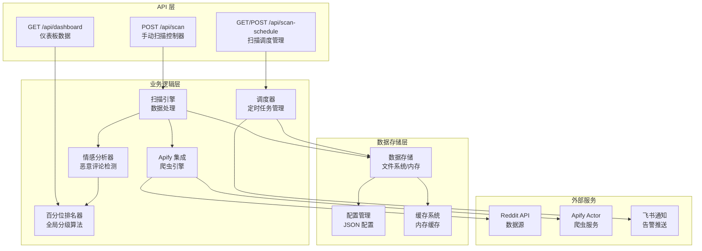

**图表来源**
- [src/app/api/scan/route.ts:21-393](file://src/app/api/scan/route.ts#L21-L393)
- [src/app/api/scan-schedule/route.ts:1-52](file://src/app/api/scan-schedule/route.ts#L1-L52)
- [src/lib/scheduler.ts:63-100](file://src/lib/scheduler.ts#L63-L100)
- [src/lib/sentiment.ts:903-937](file://src/lib/sentiment.ts#L903-L937)

**章节来源**
- [src/app/api/scan/route.ts:1-394](file://src/app/api/scan/route.ts#L1-L394)
- [src/app/api/scan-schedule/route.ts:1-53](file://src/app/api/scan-schedule/route.ts#L1-L53)

## 核心组件

### 扫描控制器 (POST /api/scan)

扫描控制器是手动扫描任务的主要入口点，支持灵活的扫描参数配置和实时进度跟踪。

**主要功能特性：**
- 支持全量扫描和指定帖子扫描
- 智能年龄过滤和延迟扫描机制
- 实时进度跟踪和中断控制
- 多级告警状态管理
- 情感分析和关键词检测
- **新增** 全局百分位排名和恶意评论比率计算

**请求参数规范：**

| 参数名 | 类型 | 必填 | 默认值 | 描述 |
|--------|------|------|--------|------|
| postIds | string[] | 否 | [] | 指定要扫描的帖子ID数组 |
| scanAll | boolean | 否 | false | 是否扫描所有帖子 |
| quickScan | boolean | 否 | false | 快速扫描模式（限制5个帖子） |
| skipRecentHours | number | 否 | 0 | 跳过最近N小时内的帖子 |

**扫描范围和过滤逻辑：**

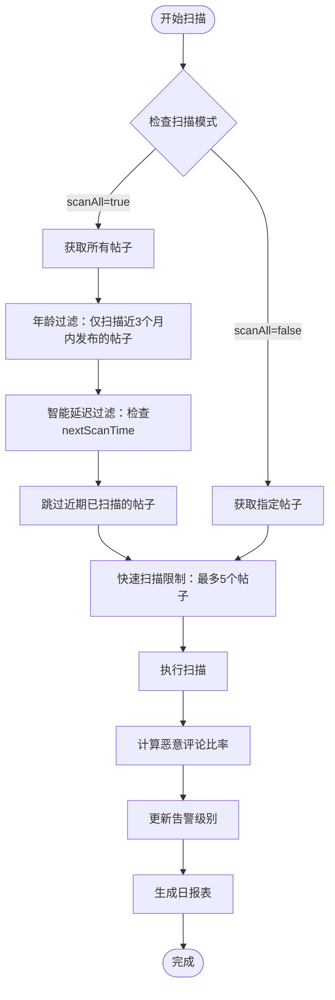

**扫描完成后的全局处理流程：**

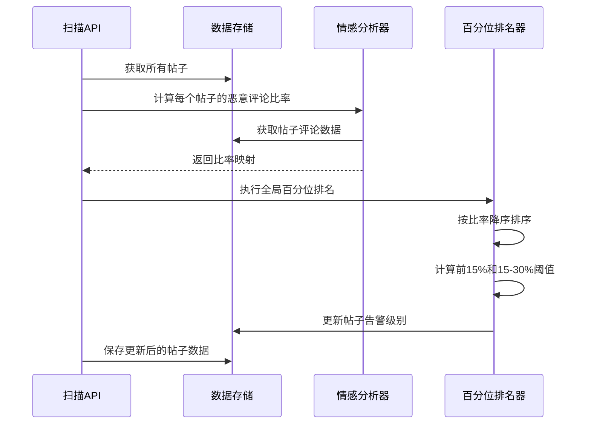

**恶意评论比率计算规则：**
- **恶意判定**：命中硬性关键词 或 sentimentScore < 0
- **计算公式**：恶意评论数 / 总评论数
- **全局分位算法**：
  - 排名前 15% → critical（高危）
  - 排名 15%~30% → medium（中等）
  - 其余及恶意比例为 0 → safe（正常）

**响应格式：**

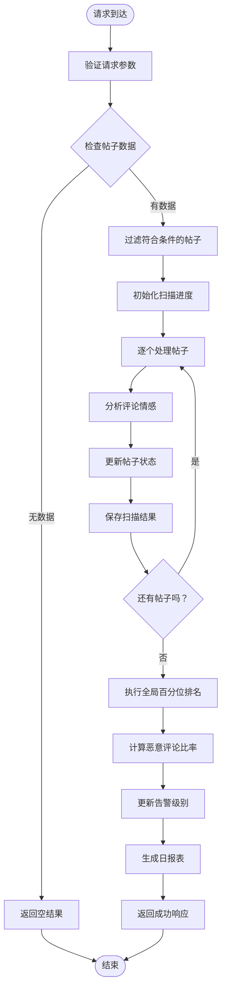

**图表来源**
- [src/app/api/scan/route.ts:31-306](file://src/app/api/scan/route.ts#L31-L306)
- [src/app/api/scan/route.ts:312-322](file://src/app/api/scan/route.ts#L312-L322)

### 扫描进度查询 (GET /api/scan)

提供实时扫描进度查询功能，支持前端轮询获取扫描状态。

**响应字段：**

| 字段名 | 类型 | 描述 |
|--------|------|------|
| isRunning | boolean | 扫描是否正在进行 |
| current | number | 当前处理的帖子索引 |
| total | number | 总共需要处理的帖子数量 |
| postTitle | string | 当前处理的帖子标题 |
| message | string | 当前扫描状态消息 |

### 扫描停止 (DELETE /api/scan)

允许用户主动中断正在进行的扫描任务。

**响应字段：**

| 字段名 | 类型 | 描述 |
|--------|------|------|
| success | boolean | 停止操作是否成功 |
| message | string | 操作结果描述 |

### 扫描调度管理 (GET/POST /api/scan-schedule)

管理自动扫描的定时任务配置和执行状态。

**GET 请求响应：**

| 字段名 | 类型 | 描述 |
|--------|------|------|
| autoScanEnabled | boolean | 是否启用自动扫描 |
| scanTime | string | 每日扫描时间（HH:mm） |
| scanSchedule | string | Cron 表达式 |
| sentimentThreshold | number | 情感阈值 |

**POST 请求参数：**

| 字段名 | 类型 | 必填 | 描述 |
|--------|------|------|------|
| autoScanEnabled | boolean | 否 | 是否启用自动扫描 |
| scanTime | string | 否 | 每日扫描时间 |
| scanSchedule | string | 否 | Cron 表达式 |
| sentimentThreshold | number | 否 | 情感阈值 |

**章节来源**
- [src/app/api/scan/route.ts:21-393](file://src/app/api/scan/route.ts#L21-L393)
- [src/app/api/scan-schedule/route.ts:1-52](file://src/app/api/scan-schedule/route.ts#L1-L52)

## 架构概览

扫描控制 API 采用分层架构设计，确保各组件职责清晰、耦合度低。

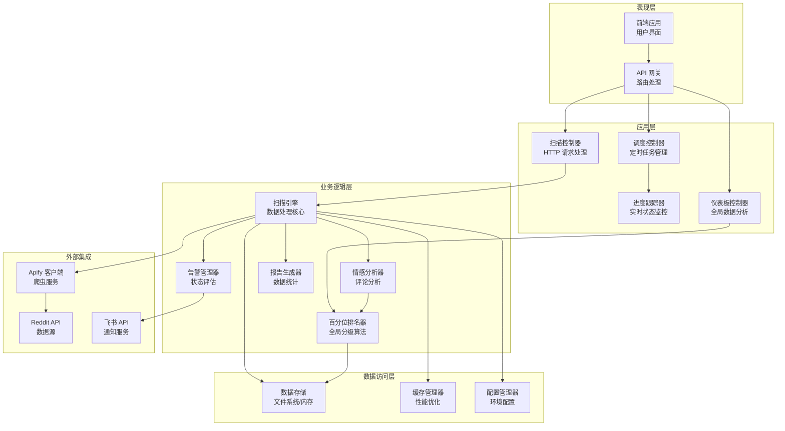

**图表来源**
- [src/lib/apify.ts:1-280](file://src/lib/apify.ts#L1-L280)
- [src/lib/reddit.ts:1-94](file://src/lib/reddit.ts#L1-L94)
- [src/lib/store.ts:1-285](file://src/lib/store.ts#L1-L285)
- [src/lib/sentiment.ts:903-937](file://src/lib/sentiment.ts#L903-L937)

## 详细组件分析

### Apify 爬虫引擎集成

系统通过 Apify Actor 实现高效的 Reddit 数据抓取，支持两种抓取模式：

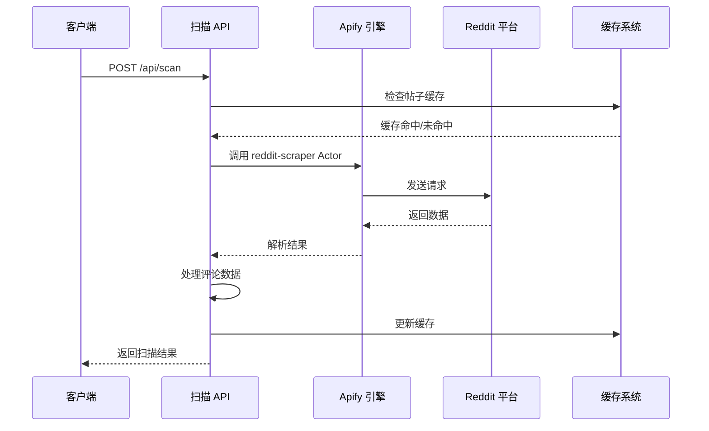

**图表来源**
- [src/lib/apify.ts:184-279](file://src/lib/apify.ts#L184-L279)
- [src/lib/reddit.ts:12-24](file://src/lib/reddit.ts#L12-L24)

**Apify 集成特性：**

1. **智能缓存机制**：帖子详情缓存 30 分钟，版块列表缓存 10 分钟
2. **请求限流**：最小 2 秒间隔，避免 API 限制
3. **代理支持**：使用住宅代理确保稳定性
4. **错误处理**：完善的异常捕获和降级策略

**章节来源**
- [src/lib/apify.ts:1-280](file://src/lib/apify.ts#L1-L280)

### 情感分析引擎

系统支持两种情感分析模式：关键词检测和 LLM 分析。

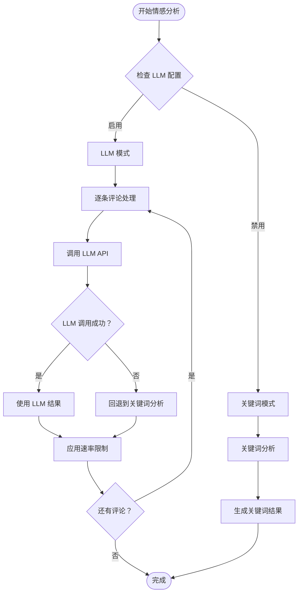

**图表来源**
- [src/app/api/scan/route.ts:175-225](file://src/app/api/scan/route.ts#L175-L225)

**情感分析配置：**

| 配置项 | 类型 | 默认值 | 描述 |
|--------|------|--------|------|
| enabled | boolean | false | 是否启用 LLM 分析 |
| provider | string | 'openai' | LLM 供应商 |
| apiKey | string | '' | API 密钥 |
| model | string | 'gpt-4o-mini' | 模型名称 |
| maxTokens | number | 1024 | 最大 token 数 |
| temperature | number | 0.1 | 生成温度 |

**章节来源**
- [src/app/api/scan/route.ts:175-225](file://src/app/api/scan/route.ts#L175-L225)
- [src/lib/types.ts:117-125](file://src/lib/types.ts#L117-L125)

### 全局百分位排名系统

**新增功能** 系统在扫描完成后执行全局百分位排名，提供更准确的全局风险评估。

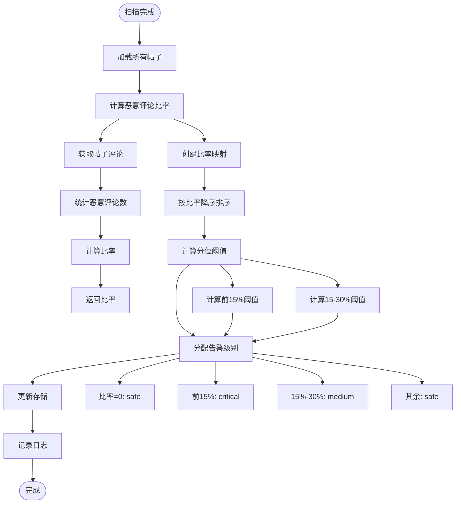

**图表来源**
- [src/app/api/scan/route.ts:312-322](file://src/app/api/scan/route.ts#L312-L322)
- [src/lib/sentiment.ts:903-937](file://src/lib/sentiment.ts#L903-L937)

**百分位排名算法：**

1. **数据收集**：遍历所有帖子，计算每个帖子的恶意评论比率
2. **排序**：按恶意评论比率降序排列，相同比率按原始索引排序
3. **阈值计算**：
   - 前 15% 为高危（critical）
   - 15%-30% 为中等（medium）
   - 其余及恶意比例为 0 为安全（safe）
4. **级别分配**：根据排名位置分配相应的告警级别

**恶意评论判定标准：**
- 命中硬性关键词规则
- sentimentScore < 0（情感得分小于0）

**章节来源**
- [src/app/api/scan/route.ts:312-322](file://src/app/api/scan/route.ts#L312-L322)
- [src/lib/sentiment.ts:903-937](file://src/lib/sentiment.ts#L903-L937)

### 扫描进度管理系统

系统实现了完整的进度跟踪机制，支持实时状态查询和中断控制。

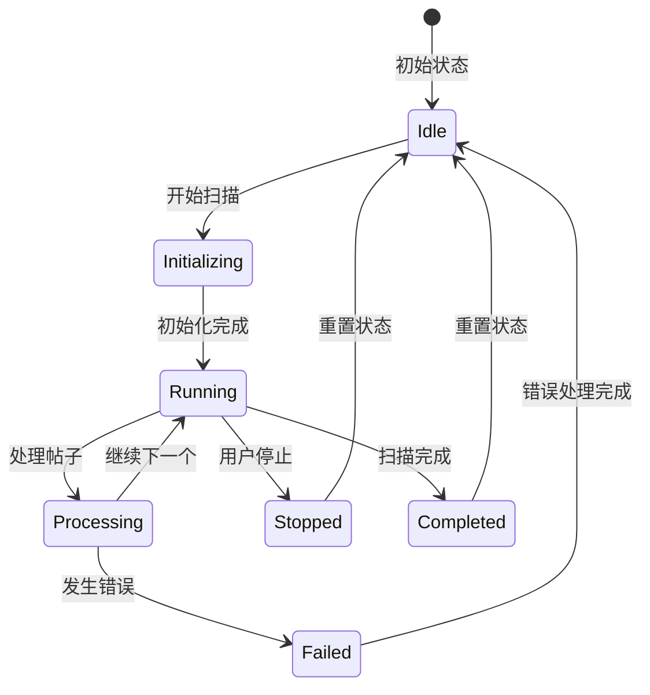

**图表来源**
- [src/app/api/scan/route.ts:9-16](file://src/app/api/scan/route.ts#L9-L16)
- [src/app/api/scan/route.ts:381-393](file://src/app/api/scan/route.ts#L381-L393)

**进度跟踪特性：**

1. **全局状态管理**：使用内存变量跟踪扫描状态
2. **实时查询**：支持 GET 请求获取当前进度
3. **中断控制**：通过 DELETE 请求停止扫描
4. **错误恢复**：异常情况下的状态重置

**章节来源**
- [src/app/api/scan/route.ts:9-16](file://src/app/api/scan/route.ts#L9-L16)
- [src/app/api/scan/route.ts:381-393](file://src/app/api/scan/route.ts#L381-L393)

### 数据持久化层

系统采用混合存储策略，支持本地开发和云端部署。

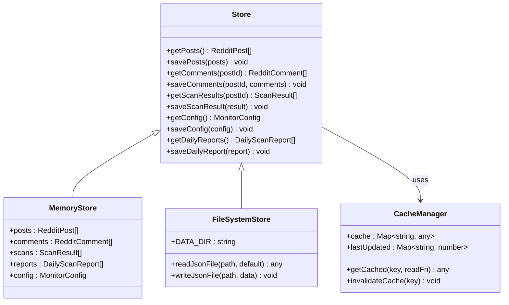

**图表来源**
- [src/lib/store.ts:90-192](file://src/lib/store.ts#L90-L192)
- [src/lib/store.ts:52-87](file://src/lib/store.ts#L52-L87)

**存储策略：**

1. **本地开发**：使用文件系统存储数据
2. **云端部署**：使用内存存储配合环境变量
3. **缓存优化**：30 秒缓存 TTL 减少文件 I/O
4. **数据一致性**：提供统一的数据访问接口

**章节来源**
- [src/lib/store.ts:1-285](file://src/lib/store.ts#L1-L285)

## 依赖关系分析

扫描控制 API 的依赖关系复杂但层次清晰，各组件间通过明确定义的接口交互。

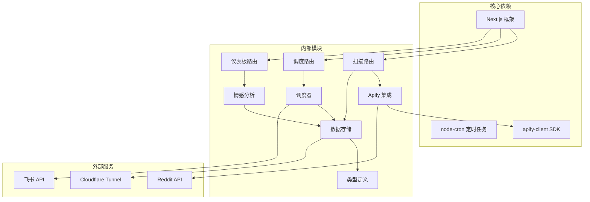

**图表来源**
- [src/app/api/scan/route.ts:1-8](file://src/app/api/scan/route.ts#L1-L8)
- [src/lib/scheduler.ts:5-12](file://src/lib/scheduler.ts#L5-L12)
- [src/lib/sentiment.ts:903-937](file://src/lib/sentiment.ts#L903-L937)

**关键依赖特性：**

1. **异步处理**：所有外部 API 调用都是异步的
2. **错误隔离**：每个组件都有独立的错误处理机制
3. **资源管理**：合理控制并发请求和内存使用
4. **配置驱动**：通过配置文件管理外部服务连接

**章节来源**
- [src/lib/scheduler.ts:1-133](file://src/lib/scheduler.ts#L1-L133)
- [src/lib/apify.ts:1-66](file://src/lib/apify.ts#L1-L66)

## 性能考虑

### 并发控制和资源限制

系统实现了多层次的并发控制和资源限制机制：

**请求限流：**
- Apify 请求间隔：至少 2 秒
- Reddit API 请求间隔：至少 3 秒
- LLM API 调用间隔：至少 300ms（逐条评论）

**内存管理：**
- 全局扫描进度状态仅在单进程内有效
- 文件系统写入在 Vercel 环境下被禁用
- 30 秒缓存 TTL 减少频繁读取

**资源优化：**
- 智能跳过：跳过超过 3 个月的帖子
- 延迟扫描：2 周无新评论的帖子延后 1 个月
- 快速扫描：限制同时处理的帖子数量
- **新增** 全局百分位排名：批量计算和更新告警级别

### 性能监控机制

系统内置了多项性能监控和诊断功能：

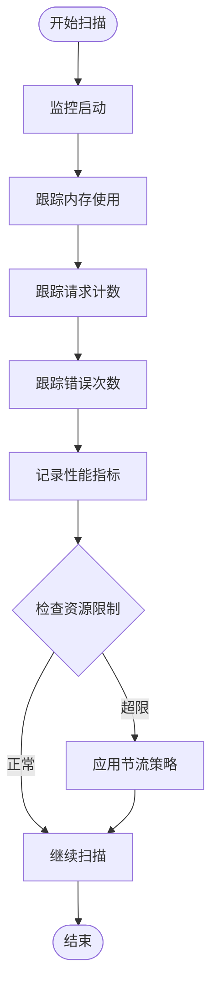

**监控指标：**
- 内存使用量
- API 调用频率
- 错误率统计
- 响应时间分布

**更新** 全局百分位排名的性能优化：
- **批量处理**：扫描完成后一次性计算所有帖子的比率
- **内存映射**：使用 Map 存储比率，避免重复计算
- **排序优化**：按比率降序排序，确保算法效率
- **阈值计算**：动态计算分位阈值，适应不同数据规模

**章节来源**
- [src/lib/apify.ts:37-50](file://src/lib/apify.ts#L37-L50)
- [src/app/api/scan/route.ts:291-294](file://src/app/api/scan/route.ts#L291-L294)
- [src/app/api/scan/route.ts:312-322](file://src/app/api/scan/route.ts#L312-L322)

## 故障排除指南

### 常见问题和解决方案

**1. Apify 配置错误**
- **症状**：扫描过程中出现 APIFY_TOKEN 相关错误
- **原因**：缺少或错误的 Apify 认证信息
- **解决方案**：检查环境变量配置，确保 APIFY_TOKEN 设置正确

**2. 扫描进度停滞**
- **症状**：扫描进度长时间不变化
- **原因**：Reddit API 限制或网络连接问题
- **解决方案**：检查网络连接，适当调整请求间隔

**3. LLM 分析失败**
- **症状**：情感分析回退到关键词模式
- **原因**：LLM API 调用失败或配额不足
- **解决方案**：检查 LLM 配置，确认 API 密钥有效性

**4. 数据持久化失败**
- **症状**：扫描结果无法保存
- **原因**：文件系统权限或 Vercel 环境限制
- **解决方案**：检查文件系统权限或使用内存存储

**5. 全局百分位排名异常**
- **症状**：扫描完成后告警级别未更新
- **原因**：数据存储问题或算法错误
- **解决方案**：检查数据完整性，验证比率计算逻辑

### 调试工具和方法

**1. 日志分析**
- 查看控制台输出的详细日志信息
- 关注扫描进度和错误信息
- 监控外部 API 调用状态
- **新增** 监控全局百分位排名过程

**2. 状态检查**
- 使用 GET /api/scan 查询当前扫描状态
- 检查扫描进度和剩余时间估计
- 验证配置参数的有效性
- **新增** 检查全局排名算法执行情况

**3. 性能诊断**
- 监控内存使用情况
- 分析 API 调用耗时
- 检查缓存命中率
- **新增** 分析全局排名算法性能

**章节来源**
- [src/lib/apify.ts:56-58](file://src/lib/apify.ts#L56-L58)
- [src/app/api/scan/route.ts:371-378](file://src/app/api/scan/route.ts#L371-L378)

## 结论

扫描控制 API 提供了一个完整、可靠的社交媒体内容监控解决方案。通过精心设计的架构和丰富的功能特性，系统能够高效地处理大规模的数据采集和分析任务。

**主要优势：**
1. **模块化设计**：清晰的组件分离便于维护和扩展
2. **智能调度**：支持手动和自动扫描模式
3. **性能优化**：多层缓存和限流机制确保系统稳定
4. **错误处理**：完善的异常捕获和降级策略
5. **监控诊断**：全面的性能监控和调试工具
6. **响应优化**：智能延迟机制的差异化处理，提升用户体验
7. **** 新增** 全局百分位排名**：提供更准确的全局风险评估和告警级别更新

**适用场景：**
- 社交媒体品牌监控
- 竞品分析和情报收集
- 危机预警和舆情监控
- 市场趋势分析和研究

**更新总结** 本次优化通过新增全局百分位排名功能，系统能够在扫描完成后自动计算所有帖子的恶意评论比率并更新告警级别。这一功能提供了更准确的全局风险评估，通过前15%和15-30%的分位阈值算法，为用户提供更可靠的风险分级和决策支持。

通过合理的配置和使用，扫描控制 API 能够满足各种规模和复杂度的监控需求，为用户提供准确、及时的社交媒体洞察。