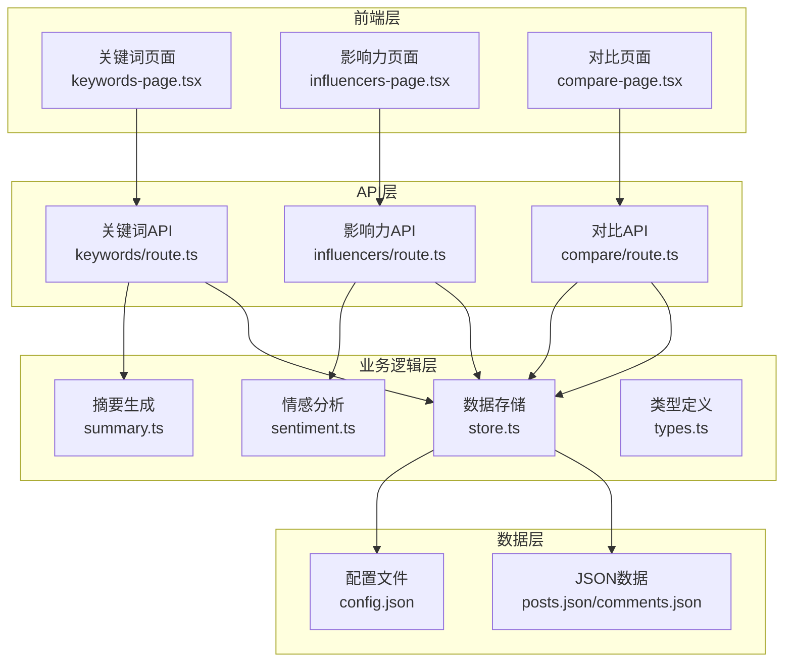
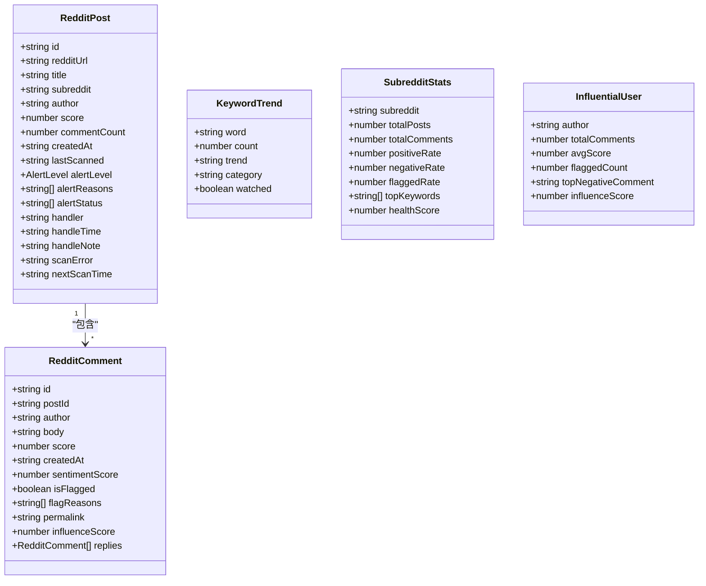
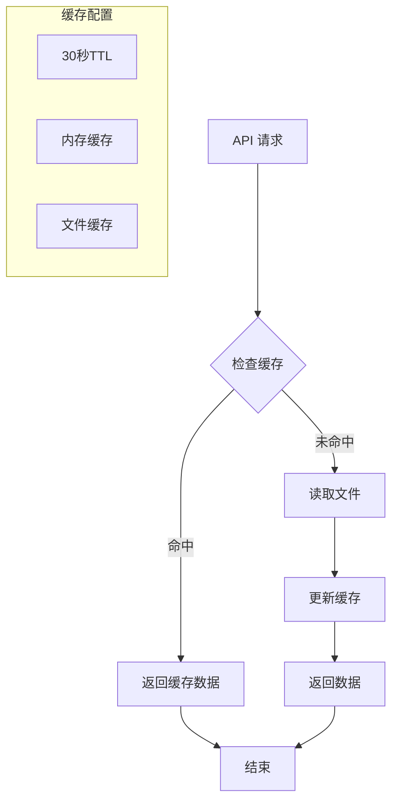
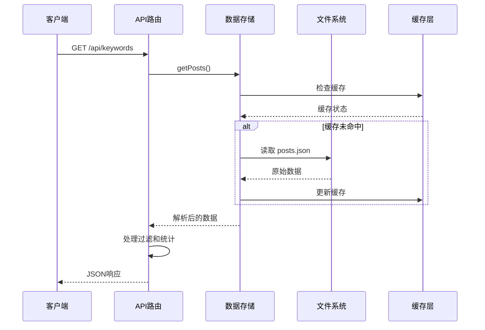
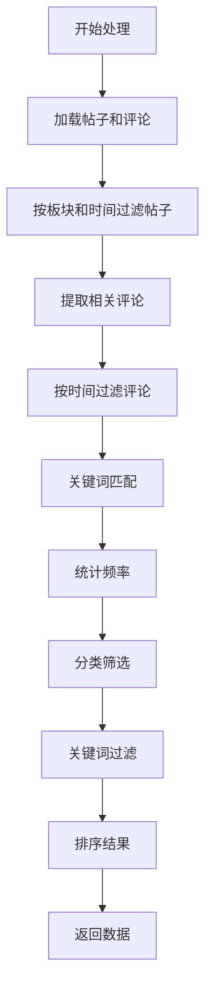
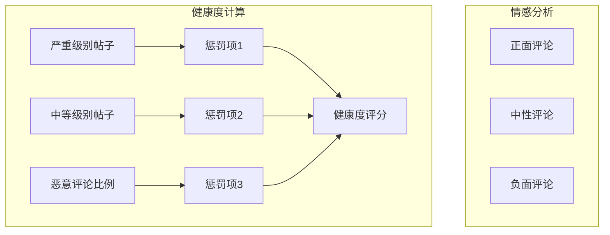
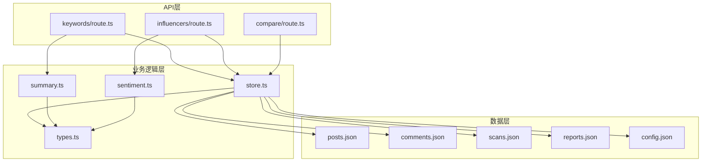

# 数据分析 API

<cite>
**本文引用的文件**
- [keywords/route.ts](file://src/app/api/keywords/route.ts)
- [influencers/route.ts](file://src/app/api/influencers/route.ts)
- [compare/route.ts](file://src/app/api/compare/route.ts)
- [types.ts](file://src/lib/types.ts)
- [summary.ts](file://src/lib/summary.ts)
- [sentiment.ts](file://src/lib/sentiment.ts)
- [store.ts](file://src/lib/store.ts)
- [config.json](file://data/config.json)
- [keywords-page.tsx](file://src/app/keywords/keywords-page.tsx)
- [influencers-page.tsx](file://src/app/influencers/influencers-page.tsx)
- [compare-page.tsx](file://src/app/compare/compare-page.tsx)
</cite>

## 目录
1. [简介](#简介)
2. [项目结构](#项目结构)
3. [核心组件](#核心组件)
4. [架构概览](#架构概览)
5. [详细组件分析](#详细组件分析)
6. [依赖关系分析](#依赖关系分析)
7. [性能考虑](#性能考虑)
8. [故障排除指南](#故障排除指南)
9. [结论](#结论)

## 简介
本项目提供一组数据分析 API，用于监控和分析 Reddit 上的品牌舆情数据。主要包含三个核心 API：
- GET /api/keywords：关键词统计分析
- GET /api/influencers：有影响力用户追踪
- GET /api/compare：板块对比分析

这些 API 基于受控词表进行关键词匹配，结合情感分析和影响力评分算法，为品牌监控提供实时的数据洞察。

## 项目结构
项目采用 Next.js 应用结构，API 路由位于 `src/app/api/` 目录下，业务逻辑封装在 `src/lib/` 目录中，前端页面组件位于 `src/app/` 目录下。



**图表来源**
- [keywords-page.tsx:1-375](file://src/app/keywords/keywords-page.tsx#L1-L375)
- [influencers-page.tsx:1-312](file://src/app/influencers/influencers-page.tsx#L1-L312)
- [compare-page.tsx:1-347](file://src/app/compare/compare-page.tsx#L1-L347)

**章节来源**
- [keywords/route.ts:1-156](file://src/app/api/keywords/route.ts#L1-L156)
- [influencers/route.ts:1-111](file://src/app/api/influencers/route.ts#L1-L111)
- [compare/route.ts:1-68](file://src/app/api/compare/route.ts#L1-L68)

## 核心组件

### 数据模型
系统使用统一的数据模型来表示 Reddit 内容：



**图表来源**
- [types.ts:9-44](file://src/lib/types.ts#L9-L44)
- [types.ts:167-193](file://src/lib/types.ts#L167-L193)

**章节来源**
- [types.ts:1-194](file://src/lib/types.ts#L1-L194)

### 缓存策略
系统实现了智能缓存机制来优化性能：



**图表来源**
- [store.ts:61-82](file://src/lib/store.ts#L61-L82)

**章节来源**
- [store.ts:1-285](file://src/lib/store.ts#L1-L285)

## 架构概览



**图表来源**
- [keywords/route.ts:20-55](file://src/app/api/keywords/route.ts#L20-L55)
- [store.ts:90-93](file://src/lib/store.ts#L90-L93)

## 详细组件分析

### 关键词统计 API (GET /api/keywords)

#### 查询参数
- `subreddit`: 板块名称筛选
- `keyword`: 关键词搜索过滤
- `commentDateFrom/commentDateTo`: 评论时间范围
- `postDateFrom/postDateTo`: 发帖时间范围
- `brandKeywords/sceneKeywords/modelKeywords/qualityKeywords`: 分类关键词筛选（逗号分隔）

#### 时间范围处理
API 支持灵活的时间范围过滤：
- 评论时间过滤：支持起始和结束日期
- 发帖时间过滤：支持起始和结束日期
- 时间精度：精确到毫秒级

#### 排序选项
- 默认按关键词出现次数降序排列
- 支持关键词模糊搜索过滤

#### 聚合算法


**图表来源**
- [keywords/route.ts:39-132](file://src/app/api/keywords/route.ts#L39-L132)

#### 数据模型
API 返回结构：
- `keywords`: 关键词数组，包含词和计数
- `total`: 总数量
- `subreddits`: 可用板块列表
- `categories`: 动态分类信息

**章节来源**
- [keywords/route.ts:1-156](file://src/app/api/keywords/route.ts#L1-L156)
- [summary.ts:6-89](file://src/lib/summary.ts#L6-L89)

### 有影响力用户 API (GET /api/influencers)

#### 排名规则
影响力得分计算公式：
```
influenceScore = (log₁₀(max(score, 1) + 1) × 5 + 1) × |sentimentScore|
```

其中：
- `score`: 评论点赞数
- `sentimentScore`: 情感分析得分（-1 到 1）
- `|sentimentScore|`: 情感强度的绝对值

#### 筛选条件
- `subreddit`: 板块筛选
- `keyword`: 关键词内容筛选
- `author`: 用户名筛选
- `commentDateFrom/commentDateTo`: 评论时间范围
- `postDateFrom/postDateTo`: 发帖时间范围

#### 排序规则
- 按影响力得分降序排列
- 仅返回标记为恶意的评论

#### 数据模型
返回结构：
- `comments`: 评论数组，包含详细信息
- `total`: 总数量
- `subreddits`: 可用板块列表

**章节来源**
- [influencers/route.ts:1-111](file://src/app/api/influencers/route.ts#L1-L111)
- [sentiment.ts:267-270](file://src/lib/sentiment.ts#L267-L270)

### 板块对比 API (GET /api/compare)

#### 比较维度
- 发帖数量统计
- 评论数量统计
- 情感分布分析（正面、中性、负面）
- 健康度评分计算

#### 统计指标


**图表来源**
- [compare/route.ts:38-49](file://src/app/api/compare/route.ts#L38-L49)

#### 数据模型
返回结构：
- `subreddits`: 板块统计数组
  - `subreddit`: 板块名称
  - `totalPosts`: 总发帖数
  - `totalComments`: 总评论数
  - `positiveRate`: 正面情感比率
  - `neutralRate`: 中性情感比率
  - `negativeRate`: 负面情感比率
  - `flaggedComments`: 恶意评论数量
  - `criticalPosts`: 严重级别帖子数
  - `mediumPosts`: 中等级别帖子数
  - `healthScore`: 健康度评分

**章节来源**
- [compare/route.ts:1-68](file://src/app/api/compare/route.ts#L1-L68)

## 依赖关系分析



**图表来源**
- [store.ts:1-285](file://src/lib/store.ts#L1-L285)
- [summary.ts:1-269](file://src/lib/summary.ts#L1-L269)
- [sentiment.ts:1-398](file://src/lib/sentiment.ts#L1-L398)

**章节来源**
- [store.ts:1-285](file://src/lib/store.ts#L1-L285)
- [summary.ts:1-269](file://src/lib/summary.ts#L1-L269)
- [sentiment.ts:1-398](file://src/lib/sentiment.ts#L1-L398)

## 性能考虑

### 缓存优化
- **TTL 设置**：30秒缓存周期，平衡数据新鲜度和性能
- **内存缓存**：Vercel 环境使用内存缓存，本地开发使用文件缓存
- **智能失效**：数据更新时自动清除缓存

### 算法优化
- **关键词匹配优化**：预构建关键词查找表，按长度排序优先匹配
- **嵌套评论处理**：使用扁平化算法减少递归深度
- **时间范围过滤**：先过滤再匹配，减少处理数据量

### 大数据量处理
- **流式处理**：使用生成器模式处理大量数据
- **分批处理**：对超大数据集采用分批处理策略
- **索引优化**：建立必要的索引提高查询效率

## 故障排除指南

### 常见问题
1. **API 响应缓慢**
   - 检查缓存是否正常工作
   - 验证数据文件大小
   - 确认网络连接稳定性

2. **关键词匹配不准确**
   - 检查受控词表配置
   - 验证关键词分类设置
   - 确认文本预处理逻辑

3. **情感分析异常**
   - 检查检测规则配置
   - 验证情感阈值设置
   - 确认 LLM 集成状态

### 调试建议
- 启用详细日志记录
- 使用性能分析工具
- 监控内存使用情况
- 检查 API 错误码

**章节来源**
- [config.json:1-57](file://data/config.json#L1-L57)

## 结论
本数据分析 API 提供了完整的 Reddit 品牌监控解决方案，具有以下特点：

1. **功能完整**：涵盖关键词分析、影响力追踪、板块对比三大核心功能
2. **性能优化**：智能缓存、算法优化确保高效响应
3. **扩展性强**：模块化设计便于功能扩展和维护
4. **数据准确**：基于受控词表和情感分析算法保证数据质量

建议在生产环境中：
- 根据数据量调整缓存策略
- 定期更新受控词表
- 监控 API 性能指标
- 实施适当的限流措施