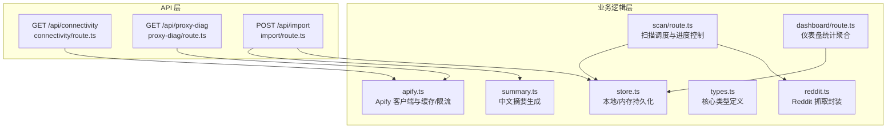
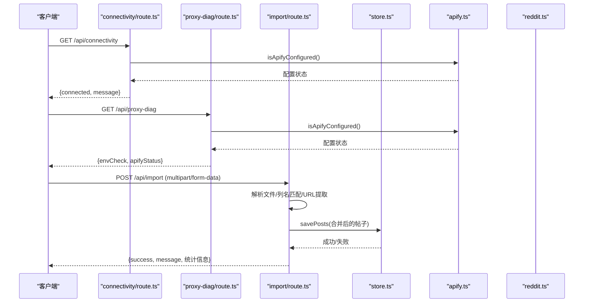
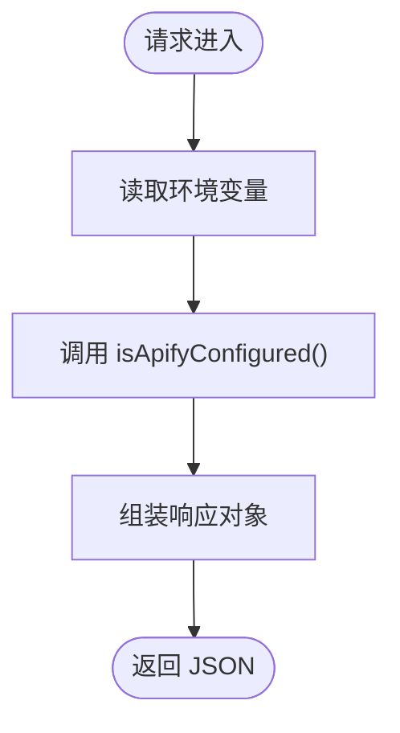
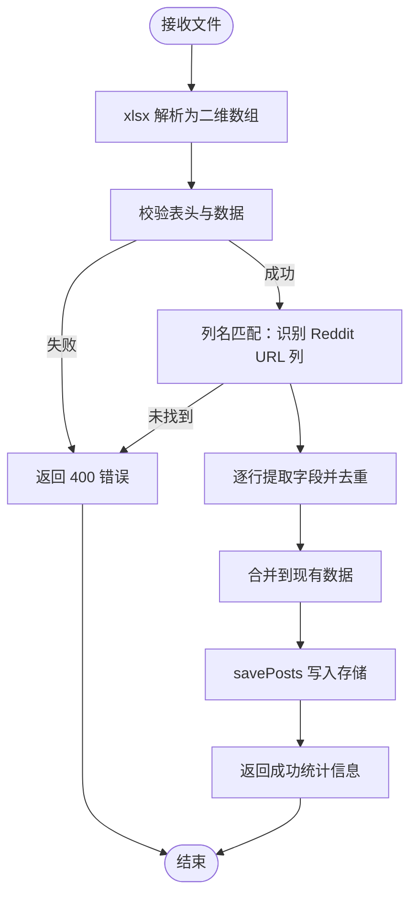
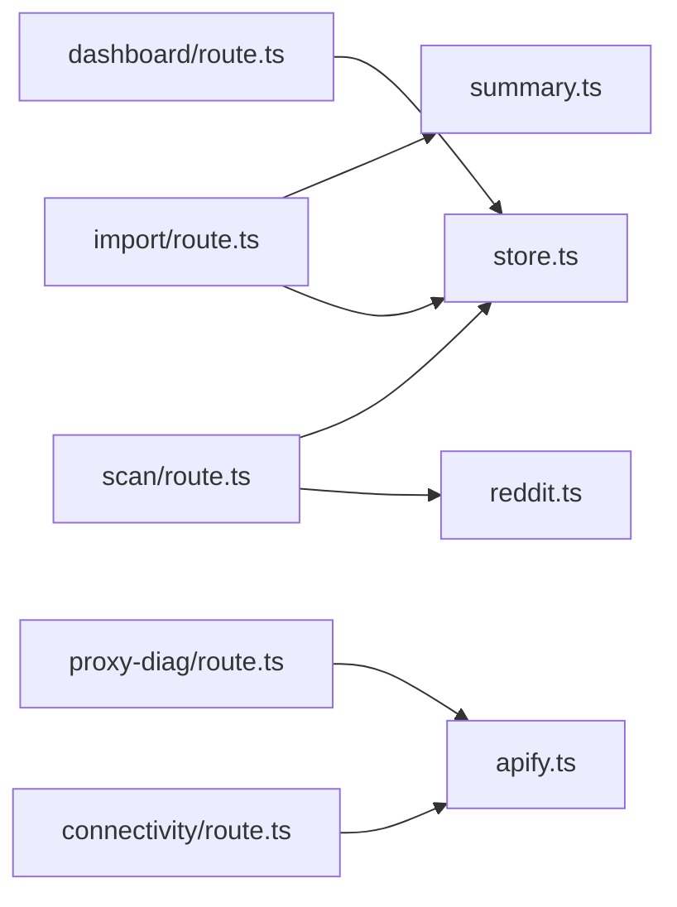

# 系统管理 API

<cite>
**本文引用的文件**
- [connectivity/route.ts](file://src/app/api/connectivity/route.ts)
- [proxy-diag/route.ts](file://src/app/api/proxy-diag/route.ts)
- [import/route.ts](file://src/app/api/import/route.ts)
- [apify.ts](file://src/lib/apify.ts)
- [reddit.ts](file://src/lib/reddit.ts)
- [store.ts](file://src/lib/store.ts)
- [types.ts](file://src/lib/types.ts)
- [summary.ts](file://src/lib/summary.ts)
- [scan/route.ts](file://src/app/api/scan/route.ts)
- [dashboard/route.ts](file://src/app/api/dashboard/route.ts)
- [Dockerfile](file://Dockerfile)
- [package.json](file://package.json)
</cite>

## 目录
1. [简介](#简介)
2. [项目结构](#项目结构)
3. [核心组件](#核心组件)
4. [架构总览](#架构总览)
5. [详细组件分析](#详细组件分析)
6. [依赖关系分析](#依赖关系分析)
7. [性能考量](#性能考量)
8. [故障排除指南](#故障排除指南)
9. [结论](#结论)
10. [附录](#附录)

## 简介
本文件为系统管理 API 的详细 RESTful API 文档，聚焦以下三个管理类接口：
- GET /api/connectivity：检查系统连接性与 Apify 配置状态的网络诊断与健康检查端点
- GET /api/proxy-diag：代理服务诊断的代理可用性检测与连接测试
- POST /api/import：导入数据的文件上传格式、数据验证与批量导入机制

同时涵盖系统状态监控、网络配置与数据完整性检查，并提供故障排除指南、日志记录与错误诊断方法，帮助运维与开发人员快速定位问题并保障系统稳定运行。

## 项目结构
系统采用 Next.js App Router 的 API 路由组织方式，管理类 API 位于 src/app/api 下的独立路由文件中，核心业务逻辑集中在 src/lib 目录下的模块中，包括数据存储、Reddit/Apify 抓取、情感分析与摘要生成等。

图表来源
- [connectivity/route.ts:1-25](file://src/app/api/connectivity/route.ts#L1-L25)
- [proxy-diag/route.ts:1-24](file://src/app/api/proxy-diag/route.ts#L1-L24)
- [import/route.ts:1-244](file://src/app/api/import/route.ts#L1-L244)
- [apify.ts:1-280](file://src/lib/apify.ts#L1-L280)
- [reddit.ts:1-94](file://src/lib/reddit.ts#L1-L94)
- [store.ts:1-285](file://src/lib/store.ts#L1-L285)
- [types.ts:1-194](file://src/lib/types.ts#L1-L194)
- [summary.ts:1-269](file://src/lib/summary.ts#L1-L269)
- [scan/route.ts:1-394](file://src/app/api/scan/route.ts#L1-L394)
- [dashboard/route.ts:1-108](file://src/app/api/dashboard/route.ts#L1-L108)

章节来源
- [connectivity/route.ts:1-25](file://src/app/api/connectivity/route.ts#L1-L25)
- [proxy-diag/route.ts:1-24](file://src/app/api/proxy-diag/route.ts#L1-L24)
- [import/route.ts:1-244](file://src/app/api/import/route.ts#L1-L244)
- [apify.ts:1-280](file://src/lib/apify.ts#L1-L280)
- [reddit.ts:1-94](file://src/lib/reddit.ts#L1-L94)
- [store.ts:1-285](file://src/lib/store.ts#L1-L285)
- [types.ts:1-194](file://src/lib/types.ts#L1-L194)
- [summary.ts:1-269](file://src/lib/summary.ts#L1-L269)
- [scan/route.ts:1-394](file://src/app/api/scan/route.ts#L1-L394)
- [dashboard/route.ts:1-108](file://src/app/api/dashboard/route.ts#L1-L108)

## 核心组件
- 系统连接性检查（GET /api/connectivity）
  - 功能：验证 Apify 配置是否就绪，返回连接状态与消息
  - 关键实现：调用 isApifyConfigured() 并返回 JSON 响应
- 代理诊断（GET /api/proxy-diag）
  - 功能：检查环境变量与 Apify 配置状态，输出诊断结果
  - 关键实现：读取环境变量与配置状态，返回结构化诊断信息
- 数据导入（POST /api/import）
  - 功能：支持 Excel/CSV 文件上传，自动识别 Reddit URL 列，解析并去重，批量保存
  - 关键实现：使用 xlsx 解析，URL/ID/子版块提取，列名关键字匹配，去重与合并，保存至本地/内存存储

章节来源
- [connectivity/route.ts:4-24](file://src/app/api/connectivity/route.ts#L4-L24)
- [proxy-diag/route.ts:4-22](file://src/app/api/proxy-diag/route.ts#L4-L22)
- [import/route.ts:117-242](file://src/app/api/import/route.ts#L117-L242)

## 架构总览
系统管理 API 与核心业务模块之间的交互如下：

图表来源
- [connectivity/route.ts:4-24](file://src/app/api/connectivity/route.ts#L4-L24)
- [proxy-diag/route.ts:4-22](file://src/app/api/proxy-diag/route.ts#L4-L22)
- [import/route.ts:117-242](file://src/app/api/import/route.ts#L117-L242)
- [store.ts:99-103](file://src/lib/store.ts#L99-L103)
- [apify.ts:64-66](file://src/lib/apify.ts#L64-L66)
- [reddit.ts:12-24](file://src/lib/reddit.ts#L12-L24)

## 详细组件分析

### GET /api/connectivity 接口
- 请求方法：GET
- 路径：/api/connectivity
- 功能概述：检查 Apify 是否已正确配置，返回连接状态与消息
- 响应字段
  - connected: boolean，是否已配置且可连接
  - message: string，状态说明
  - apifyConfigured: boolean（仅成功时），是否已配置
- 错误处理
  - 未配置：返回 connected=false 与提示
  - 异常：捕获异常并返回失败消息
- 日志与诊断
  - 成功时输出“Apify 已配置，可以扫描 Reddit 帖子”
  - 失败时输出“连接检查失败: ...”

图表来源
- [connectivity/route.ts:4-24](file://src/app/api/connectivity/route.ts#L4-L24)
- [apify.ts:64-66](file://src/lib/apify.ts#L64-L66)

章节来源
- [connectivity/route.ts:4-24](file://src/app/api/connectivity/route.ts#L4-L24)
- [apify.ts:64-66](file://src/lib/apify.ts#L64-L66)

### GET /api/proxy-diag 接口
- 请求方法：GET
- 路径：/api/proxy-diag
- 功能概述：输出环境变量与 Apify 配置状态，用于代理与网络诊断
- 响应字段
  - envCheck: 对象
    - APIFY_TOKEN: string，已设置则截断显示前缀
    - NODE_ENV: string，当前环境
  - apifyStatus: 对象
    - configured: boolean，Apify 是否配置
    - message: string，配置说明
- 错误处理
  - 返回结构化诊断信息，不抛异常
- 日志与诊断
  - 输出环境变量与配置状态，便于快速判断代理与网络问题

图表来源
- [proxy-diag/route.ts:4-22](file://src/app/api/proxy-diag/route.ts#L4-L22)
- [apify.ts:64-66](file://src/lib/apify.ts#L64-L66)

章节来源
- [proxy-diag/route.ts:4-22](file://src/app/api/proxy-diag/route.ts#L4-L22)
- [apify.ts:64-66](file://src/lib/apify.ts#L64-L66)

### POST /api/import 接口
- 请求方法：POST
- 路径：/api/import
- 请求体：multipart/form-data，字段 file 为上传的 Excel/CSV 文件
- 功能概述：解析文件，自动识别 Reddit URL 列，提取必要字段，去重合并，保存至本地/内存存储
- 数据流程
  - 解析文件：使用 xlsx 读取第一个工作表
  - 清洗与校验：去除空行/空列，校验表头与数据
  - 列识别：按关键字匹配 Reddit URL 列，支持多语言关键词
  - 字段提取：URL、标题、子版块、作者等
  - 去重与合并：基于 id 与 redditUrl 去重，合并到现有数据
  - 保存：调用 savePosts 写入存储
- 响应字段
  - success: boolean
  - message: string
  - totalRows/newPosts/duplicatePosts/skippedRows/existingPostsBefore/totalPostsAfter：统计信息
  - detectedColumns：识别到的列名映射
- 错误处理
  - 缺少文件：返回 400
  - 空文件/无有效数据：返回 400
  - 未找到 Reddit URL 列：返回 400
  - 异常：返回 500 并记录错误日志
- 日志与诊断
  - 控制台输出导入过程中的关键步骤与错误信息

图表来源
- [import/route.ts:117-242](file://src/app/api/import/route.ts#L117-L242)
- [store.ts:99-103](file://src/lib/store.ts#L99-L103)

章节来源
- [import/route.ts:117-242](file://src/app/api/import/route.ts#L117-L242)
- [store.ts:99-103](file://src/lib/store.ts#L99-L103)

## 依赖关系分析
- 外部依赖
  - apify-client：调用 Apify Actor 进行 Reddit 抓取
  - xlsx：解析 Excel/CSV 文件
  - next/server：Next.js 响应处理
- 内部依赖
  - apify.ts：提供 isApifyConfigured、fetchPostViaApify、fetchSubredditViaApify、缓存与限流
  - store.ts：提供 getPosts/savePosts 等数据持久化能力
  - types.ts：定义 RedditPost、RedditComment、AlertLevel 等核心类型
  - summary.ts：生成中文摘要
  - reddit.ts：封装 fetchRedditPost/fetchMultiplePosts/fetchSubredditPosts

图表来源
- [import/route.ts:1-244](file://src/app/api/import/route.ts#L1-L244)
- [store.ts:1-285](file://src/lib/store.ts#L1-L285)
- [summary.ts:1-269](file://src/lib/summary.ts#L1-L269)
- [connectivity/route.ts:1-25](file://src/app/api/connectivity/route.ts#L1-L25)
- [proxy-diag/route.ts:1-24](file://src/app/api/proxy-diag/route.ts#L1-L24)
- [apify.ts:1-280](file://src/lib/apify.ts#L1-L280)
- [scan/route.ts:1-394](file://src/app/api/scan/route.ts#L1-L394)
- [reddit.ts:1-94](file://src/lib/reddit.ts#L1-L94)
- [dashboard/route.ts:1-108](file://src/app/api/dashboard/route.ts#L1-L108)

章节来源
- [package.json:14-26](file://package.json#L14-L26)
- [apify.ts:1-280](file://src/lib/apify.ts#L1-L280)
- [store.ts:1-285](file://src/lib/store.ts#L1-L285)
- [types.ts:1-194](file://src/lib/types.ts#L1-L194)
- [summary.ts:1-269](file://src/lib/summary.ts#L1-L269)
- [reddit.ts:1-94](file://src/lib/reddit.ts#L1-L94)
- [scan/route.ts:1-394](file://src/app/api/scan/route.ts#L1-L394)
- [dashboard/route.ts:1-108](file://src/app/api/dashboard/route.ts#L1-L108)

## 性能考量
- Apify 限流与缓存
  - 请求间隔：最小 2 秒，避免触发限流
  - 缓存策略：版块列表缓存 10 分钟，帖子详情缓存 30 分钟
- 扫描速率控制
  - Reddit 请求间隔：3 秒，降低 429 风险
  - LLM 调用间隔：300ms，避免超限
- 存储优化
  - 本地文件读写：在 Vercel 上禁用写入，使用内存存储
  - 读取缓存：30 秒 TTL，减少频繁读取大文件
- 导入性能
  - 使用 xlsx 统一解析，避免手写 CSV 解析的脆弱性
  - 列识别采用采样与权重策略，提升准确性与性能

章节来源
- [apify.ts:37-50](file://src/lib/apify.ts#L37-L50)
- [apify.ts:17-35](file://src/lib/apify.ts#L17-L35)
- [scan/route.ts:291-294](file://src/app/api/scan/route.ts#L291-L294)
- [scan/route.ts:210-214](file://src/app/api/scan/route.ts#L210-L214)
- [store.ts:42-50](file://src/lib/store.ts#L42-L50)
- [store.ts:71-82](file://src/lib/store.ts#L71-L82)
- [import/route.ts:132-137](file://src/app/api/import/route.ts#L132-L137)

## 故障排除指南
- Apify 未配置
  - 现象：/api/connectivity 返回未配置
  - 处理：设置环境变量 APIFY_TOKEN
  - 参考：connectivity/route.ts、apify.ts
- 代理/网络问题
  - 现象：/api/proxy-diag 显示未配置或连接失败
  - 处理：检查 APIFY_TOKEN 与网络连通性；Apify Actor 使用住宅代理
  - 参考：proxy-diag/route.ts、apify.ts
- 导入失败
  - 现象：/api/import 返回 400 或 500
  - 常见原因
    - 未选择文件：缺少 file 字段
    - 文件为空或仅有表头：数据不足
    - 未找到 Reddit URL 列：列名不匹配
    - 解析异常：文件格式不兼容
  - 处理：确认文件格式为 Excel/CSV，确保包含 Reddit 链接列
  - 参考：import/route.ts、store.ts
- 扫描异常
  - 现象：扫描失败或部分失败
  - 处理：检查 Reddit 链接有效性；Apify 限制导致的 429；LLM 配置错误
  - 参考：scan/route.ts、apify.ts
- 日志定位
  - 控制台输出：导入、扫描、Apify 调用、缓存命中/失效、限流等待等
  - 参考：各模块的 console.log 输出

章节来源
- [connectivity/route.ts:6-23](file://src/app/api/connectivity/route.ts#L6-L23)
- [proxy-diag/route.ts:10-22](file://src/app/api/proxy-diag/route.ts#L10-L22)
- [import/route.ts:122-160](file://src/app/api/import/route.ts#L122-L160)
- [import/route.ts:236-242](file://src/app/api/import/route.ts#L236-L242)
- [scan/route.ts:146-161](file://src/app/api/scan/route.ts#L146-L161)
- [scan/route.ts:179-225](file://src/app/api/scan/route.ts#L179-L225)
- [apify.ts:172-176](file://src/lib/apify.ts#L172-L176)
- [apify.ts:275-278](file://src/lib/apify.ts#L275-L278)

## 结论
系统管理 API 提供了完整的连接性检查、代理诊断与数据导入能力，结合 Apify 的稳定抓取与本地/内存存储，能够满足中小规模场景下的 Reddit 内容监控需求。通过合理的限流、缓存与日志策略，系统具备良好的稳定性与可观测性。建议在生产环境中：
- 明确配置 APIFY_TOKEN 与相关环境变量
- 使用统一的数据格式（Excel/CSV）并确保包含 Reddit URL 列
- 监控 Apify 限额与网络状况，合理规划扫描节奏
- 借助日志与诊断接口快速定位问题

## 附录

### 环境变量与部署
- 关键环境变量
  - APIFY_TOKEN：Apify 访问令牌
  - FEISHU_WEBHOOK_URL/FEISHU_NOTIFY_TIME/FEISHU_NOTIFY_LEVELS：飞书通知配置（Vercel 环境）
  - LLM_*：大模型配置（可选）
  - TUNNEL_URL：隧道地址（可选）
- 部署
  - 使用 Dockerfile 构建与运行，暴露 3000 端口
  - 在 Vercel 上启用内存存储与环境变量覆盖

章节来源
- [store.ts:235-269](file://src/lib/store.ts#L235-L269)
- [Dockerfile:36-40](file://Dockerfile#L36-L40)
- [package.json:14-26](file://package.json#L14-L26)