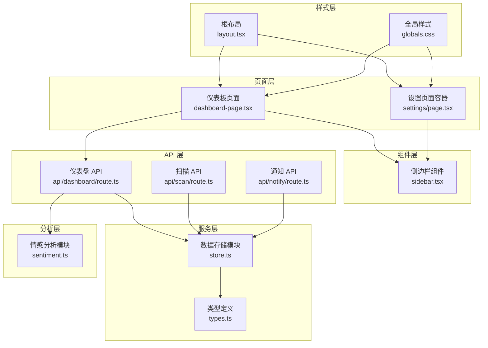
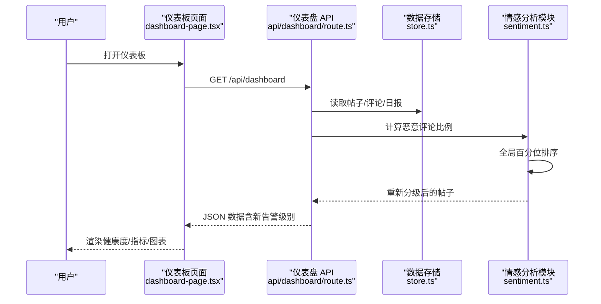
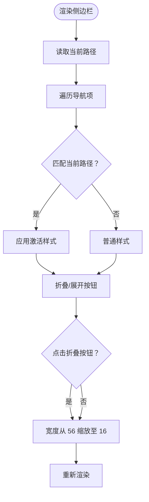
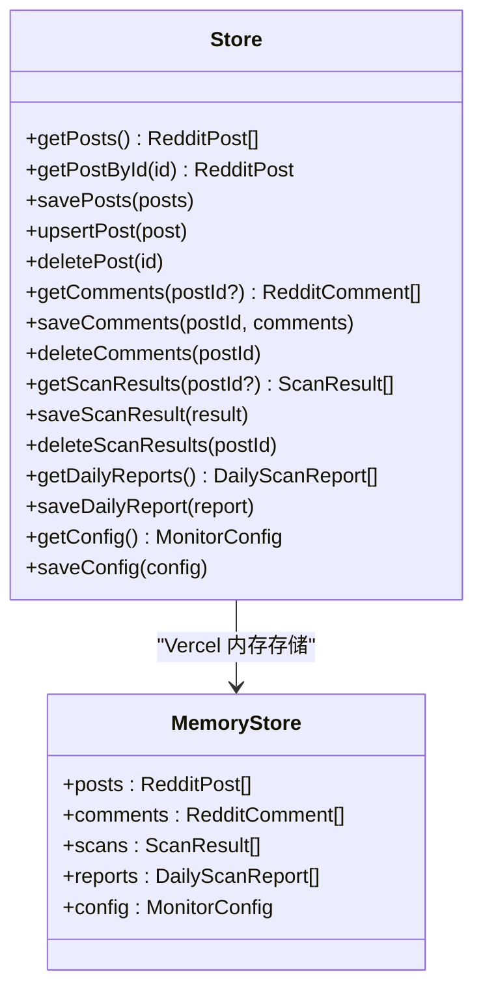
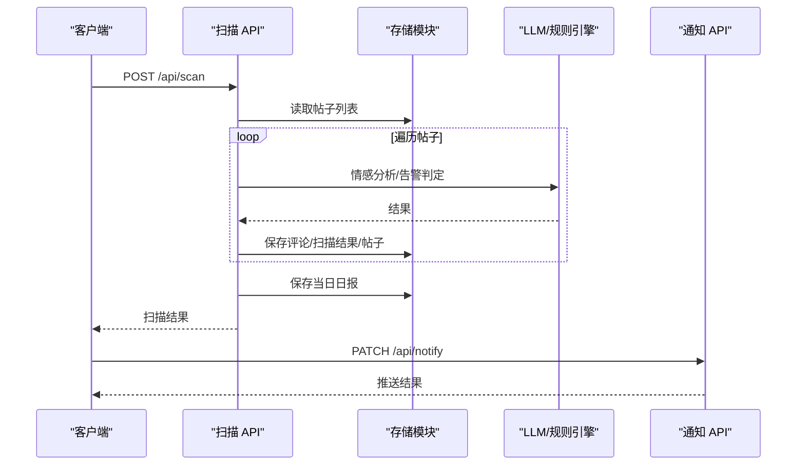
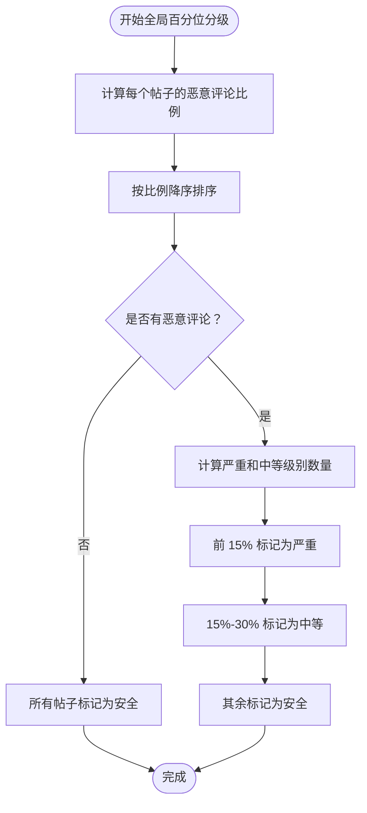
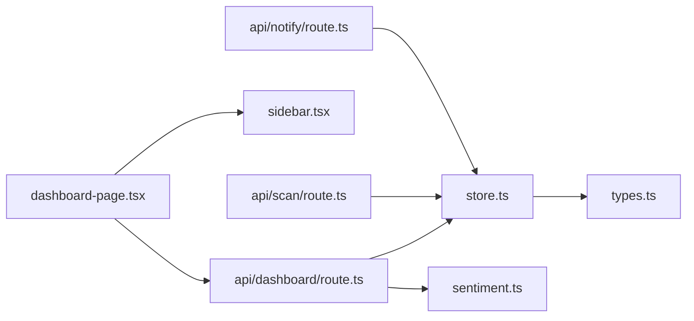

# 仪表板组件

<cite>
**本文引用的文件**
- [dashboard-page.tsx](file://src/app/dashboard-page.tsx)
- [sidebar.tsx](file://src/components/sidebar.tsx)
- [store.ts](file://src/lib/store.ts)
- [layout.tsx](file://src/app/layout.tsx)
- [globals.css](file://src/app/globals.css)
- [route.ts（仪表盘 API）](file://src/app/api/dashboard/route.ts)
- [route.ts（扫描 API）](file://src/app/api/scan/route.ts)
- [route.ts（通知 API）](file://src/app/api/notify/route.ts)
- [types.ts](file://src/lib/types.ts)
- [settings/page.tsx](file://src/app/settings/page.tsx)
- [sentiment.ts](file://src/lib/sentiment.ts)
</cite>

## 更新摘要
**变更内容**
- 新增全局百分位告警排名系统，提供更准确的社区上下文感知的告警级别
- 更新仪表板API以集成新的告警级别计算逻辑
- 改进告警级别分配算法，基于恶意评论比例的全局分位排序
- 增强情感分析与告警判定的准确性

## 目录
1. [简介](#简介)
2. [项目结构](#项目结构)
3. [核心组件](#核心组件)
4. [架构总览](#架构总览)
5. [详细组件分析](#详细组件分析)
6. [依赖关系分析](#依赖关系分析)
7. [性能考量](#性能考量)
8. [故障排查指南](#故障排查指南)
9. [结论](#结论)
10. [附录](#附录)

## 简介
本文件面向"仪表板组件"的使用者与维护者，系统性梳理仪表板的整体布局设计、关键指标展示区域、实时数据更新机制与导航结构；记录侧边栏组件的实现细节、菜单项配置与响应式行为；阐述组件状态管理、数据绑定与用户交互处理；提供仪表板定制化选项、主题切换与布局调整的实现方式；总结性能优化策略与数据缓存机制，并给出最佳实践与排障建议。

**更新** 新增了全局百分位告警排名系统，提供更准确的社区上下文感知的告警级别，替代原有的基于影响力得分的静态阈值方法。

## 项目结构
仪表板位于 Next.js 应用的客户端页面中，采用"页面 + 组件 + 服务层"的分层组织：
- 页面层：仪表板页面负责渲染与交互，调用 API 获取数据并驱动图表与卡片展示。
- 组件层：侧边栏组件提供全局导航与折叠交互。
- 服务层：数据存储与业务逻辑封装在 store 模块，提供本地文件与 Vercel 内存双态持久化。
- 样式层：全局样式定义主题变量与动画，支持统一视觉风格。
- 分析层：情感分析与告警级别计算在 sentiment 模块中实现，提供全局百分位算法。



**图表来源**
- [dashboard-page.tsx:1-535](file://src/app/dashboard-page.tsx#L1-L535)
- [sidebar.tsx:1-96](file://src/components/sidebar.tsx#L1-L96)
- [store.ts:1-285](file://src/lib/store.ts#L1-L285)
- [layout.tsx:1-23](file://src/app/layout.tsx#L1-L23)
- [globals.css:1-74](file://src/app/globals.css#L1-L74)
- [route.ts（仪表盘 API）:1-119](file://src/app/api/dashboard/route.ts#L1-L119)
- [route.ts（扫描 API）:1-394](file://src/app/api/scan/route.ts#L1-L394)
- [route.ts（通知 API）:1-118](file://src/app/api/notify/route.ts#L1-L118)
- [types.ts:1-194](file://src/lib/types.ts#L1-L194)
- [settings/page.tsx:1-14](file://src/app/settings/page.tsx#L1-L14)
- [sentiment.ts:903-937](file://src/lib/sentiment.ts#L903-L937)

**章节来源**
- [dashboard-page.tsx:1-535](file://src/app/dashboard-page.tsx#L1-L535)
- [sidebar.tsx:1-96](file://src/components/sidebar.tsx#L1-L96)
- [store.ts:1-285](file://src/lib/store.ts#L1-L285)
- [layout.tsx:1-23](file://src/app/layout.tsx#L1-L23)
- [globals.css:1-74](file://src/app/globals.css#L1-L74)
- [route.ts（仪表盘 API）:1-119](file://src/app/api/dashboard/route.ts#L1-L119)
- [route.ts（扫描 API）:1-394](file://src/app/api/scan/route.ts#L1-L394)
- [route.ts（通知 API）:1-118](file://src/app/api/notify/route.ts#L1-L118)
- [types.ts:1-194](file://src/lib/types.ts#L1-L194)
- [settings/page.tsx:1-14](file://src/app/settings/page.tsx#L1-L14)
- [sentiment.ts:903-937](file://src/lib/sentiment.ts#L903-L937)

## 核心组件
- 仪表板页面：负责加载仪表盘数据、渲染健康度评分、关键指标卡、趋势图、情感分布、恶意类型分布、高风险帖子与最新恶意评论列表，并提供"立即扫描""推送预警"等交互入口。
- 侧边栏组件：提供全局导航菜单、Logo 与徽章、当前路径高亮、折叠/展开交互。
- 数据存储模块：抽象本地文件与 Vercel 内存两种部署形态，内置缓存与 TTL 控制，降低频繁读取成本。
- API 层：仪表盘聚合接口、扫描任务接口、通知配置与推送接口，支撑前端实时更新与自动化调度。
- 分析层：情感分析与告警级别计算模块，提供基于全局百分位的智能告警分级算法。

**更新** 新增分析层组件，专门处理情感分析与告警级别计算，采用全局百分位算法替代传统的静态阈值方法。

**章节来源**
- [dashboard-page.tsx:49-535](file://src/app/dashboard-page.tsx#L49-L535)
- [sidebar.tsx:30-96](file://src/components/sidebar.tsx#L30-L96)
- [store.ts:52-87](file://src/lib/store.ts#L52-L87)
- [route.ts（仪表盘 API）:13-119](file://src/app/api/dashboard/route.ts#L13-L119)
- [route.ts（扫描 API）:21-393](file://src/app/api/scan/route.ts#L21-L393)
- [route.ts（通知 API）:16-118](file://src/app/api/notify/route.ts#L16-L118)
- [sentiment.ts:903-937](file://src/lib/sentiment.ts#L903-L937)

## 架构总览
仪表板采用前后端分离的 API 设计：前端页面通过 fetch 请求调用后端路由，后端路由从存储模块读取数据或执行扫描任务，返回结构化 JSON，前端据此渲染视图。通知模块通过调度器与飞书接口对接，支持定时推送与手动触发。

**更新** 在仪表盘 API 中集成了全局百分位告警排名系统，在计算健康度评分之前，先基于恶意评论比例对所有帖子进行重新分级，提供更准确的社区上下文感知的告警级别。



**图表来源**
- [dashboard-page.tsx:59-112](file://src/app/dashboard-page.tsx#L59-L112)
- [route.ts（仪表盘 API）:14-26](file://src/app/api/dashboard/route.ts#L14-L26)
- [route.ts（仪表盘 API）:19-25](file://src/app/api/dashboard/route.ts#L19-L25)
- [store.ts:89-192](file://src/lib/store.ts#L89-L192)
- [sentiment.ts:903-937](file://src/lib/sentiment.ts#L903-L937)

## 详细组件分析

### 仪表板页面（dashboard-page.tsx）
- 状态管理
  - 使用 React hooks 管理数据、加载状态、扫描状态、推送状态与趋势天数。
  - 初始加载时并行获取仪表盘数据与通知状态。
- 关键指标展示区域
  - 健康度评分：综合负面评论、严重/中等帖子与恶意评论率，动态计算并展示带色阶的评分与进度条。
  - 指标卡：监控帖子总数、严重/中等预警数、恶意评论率与总量。
- 实时数据更新机制
  - 扫描按钮：发起扫描任务，前端轮询 /api/scan 的 GET 获取进度，完成后刷新仪表盘数据。
  - 推送预警：调用 /api/notify 的 PATCH 触发即时推送，并展示结果。
- 图表与可视化
  - 趋势图：基于每日日报生成近 N 日情感趋势，支持 7/14/30 天切换。
  - 情感分布饼图：正面/中性/负面评论占比。
  - 恶意类型柱状图：垂直柱状图展示各类别违规数量。
  - 高风险帖子与最新恶意评论：卡片列表与列表卡片，支持外链跳转。
- 导航结构
  - 顶部操作区包含标题、上次扫描时间、扫描按钮、推送按钮。
  - 通知状态横幅：显示飞书推送开关状态、上次推送时间与结果，未启用时引导至设置页。

```mermaid
flowchart TD
Start(["进入仪表板"]) --> Load["加载仪表盘数据<br/>GET /api/dashboard"]
Load --> GlobalPercentile["应用全局百分位告警分级"]
GlobalPercentile --> Render["渲染健康度/指标/图表"]
Render --> UserAction{"用户操作？"}
UserAction --> |点击"立即扫描"| Scan["POST /api/scan<br/>轮询 /api/scan(GET)"]
Scan --> Refresh["刷新仪表盘数据"]
UserAction --> |点击"推送预警"| Notify["PATCH /api/notify"]
Notify --> Toast["展示推送结果"]
UserAction --> |切换趋势天数| Trend["更新趋势天数并重绘"]
Refresh --> GlobalPercentile
Toast --> Render
Trend --> Render
```

**图表来源**
- [dashboard-page.tsx:59-112](file://src/app/dashboard-page.tsx#L59-L112)
- [route.ts（仪表盘 API）:14-26](file://src/app/api/dashboard/route.ts#L14-L26)
- [route.ts（扫描 API）:381-383](file://src/app/api/scan/route.ts#L381-L383)
- [route.ts（通知 API）:107-118](file://src/app/api/notify/route.ts#L107-L118)

**章节来源**
- [dashboard-page.tsx:49-535](file://src/app/dashboard-page.tsx#L49-L535)
- [route.ts（仪表盘 API）:14-119](file://src/app/api/dashboard/route.ts#L14-L119)
- [route.ts（扫描 API）:21-393](file://src/app/api/scan/route.ts#L21-L393)
- [route.ts（通知 API）:16-118](file://src/app/api/notify/route.ts#L16-L118)

### 侧边栏组件（sidebar.tsx）
- 菜单项配置
  - 包含"监控面板、帖子管理、预警事件、恶意评论追踪、关键词热度、板块对比、系统设置"等导航项。
  - 使用图标与中文标签，支持路径高亮与悬停态。
- 响应式与交互
  - 支持折叠/展开，折叠时仅保留图标与收起按钮，宽度由 56→16 动画过渡。
  - Logo 区域包含品牌徽标与状态徽章，未折叠时显示完整信息。
- 路由集成
  - 基于 Next.js 的 usePathname 判断当前激活项，支持前缀匹配（如子路由激活父菜单）。



**图表来源**
- [sidebar.tsx:30-96](file://src/components/sidebar.tsx#L30-L96)

**章节来源**
- [sidebar.tsx:20-96](file://src/components/sidebar.tsx#L20-L96)

### 数据存储与缓存（store.ts）
- 双态持久化
  - 本地开发：文件系统持久化（posts/comments/scans/reports/config）。
  - Vercel 部署：内存存储 + 环境变量覆盖，避免写入只读文件系统。
- 缓存机制
  - 内存缓存 + TTL（默认 30 秒），减少频繁读取大文件带来的延迟与成本。
  - 提供缓存失效函数，写入后主动清空对应键缓存。
- 关键接口
  - 帖子：增删改查、批量保存、按 ID 查询。
  - 评论：按帖子过滤、批量保存、删除。
  - 扫描结果：追加保存、按帖子筛选。
  - 日报：按日期去重更新、读取。
  - 配置：默认配置合并环境变量覆盖，读取/保存。



**图表来源**
- [store.ts:89-192](file://src/lib/store.ts#L89-L192)
- [store.ts:52-87](file://src/lib/store.ts#L52-L87)

**章节来源**
- [store.ts:1-285](file://src/lib/store.ts#L1-L285)
- [types.ts:9-75](file://src/lib/types.ts#L9-L75)

### API 层（仪表盘、扫描、通知）
- 仪表盘 API（GET /api/dashboard）
  - **更新** 集成全局百分位告警排名系统：在计算健康度之前，先基于恶意评论比例对所有帖子进行重新分级。
  - 使用全局百分位算法：将所有帖子按恶意评论比例降序排列，前 15% 标记为严重，15%-30% 标记为中等，其余标记为安全。
  - 根据帖子与评论数据计算健康度、指标卡、情感分布、恶意类型分布、Top 风险帖子、最新恶意评论与趋势数据。
  - 当无真实数据时回退到 mock 数据，保证首次体验。
- 扫描 API（POST /api/scan）
  - 支持全量扫描与指定帖子扫描，内置年龄过滤、延迟扫描控制与速率限制。
  - 对评论进行情感分析（优先 LLM，失败回退关键词规则），计算帖子告警等级，生成扫描结果与当日日报。
  - 提供 GET 查询扫描进度、DELETE 停止扫描。
- 通知 API（GET/POST/PUT/PATCH /api/notify）
  - GET：返回通知配置、预览与调度器状态。
  - POST：保存通知配置并重载调度器。
  - PUT：测试通知连通性。
  - PATCH：手动触发推送。



**图表来源**
- [route.ts（扫描 API）:21-393](file://src/app/api/scan/route.ts#L21-L393)
- [route.ts（通知 API）:107-118](file://src/app/api/notify/route.ts#L107-L118)
- [store.ts:89-192](file://src/lib/store.ts#L89-L192)

**章节来源**
- [route.ts（仪表盘 API）:14-119](file://src/app/api/dashboard/route.ts#L14-L119)
- [route.ts（扫描 API）:21-393](file://src/app/api/scan/route.ts#L21-L393)
- [route.ts（通知 API）:16-118](file://src/app/api/notify/route.ts#L16-L118)

### 全局百分位告警排名系统（sentiment.ts）
- **新增功能** 基于"恶意评论比例"的全局分位告警排名系统
- 算法原理
  - 计算每个帖子的恶意评论比例：恶意评论数 / 总评论数
  - 将所有帖子按恶意评论比例降序排列
  - 前 15% 的帖子标记为严重级别（critical）
  - 15%-30% 的帖子标记为中等级别（medium）
  - 其余帖子标记为安全级别（safe）
- 实现细节
  - 使用 Map 存储帖子 ID 到恶意比例的映射
  - 通过 sort 方法按比例降序排序，保持原始索引稳定
  - 特殊处理：当没有恶意评论时，所有帖子标记为安全级别
- 性能优化
  - 时间复杂度 O(N log N)，其中 N 为帖子数量
  - 空间复杂度 O(N)，用于存储排序中间结果



**图表来源**
- [sentiment.ts:903-937](file://src/lib/sentiment.ts#L903-L937)

**章节来源**
- [sentiment.ts:903-937](file://src/lib/sentiment.ts#L903-L937)

## 依赖关系分析
- 组件耦合
  - 仪表板页面依赖 API 路由与侧边栏组件；侧边栏组件与页面无直接耦合，通过路由与图标解耦。
  - 存储模块对类型定义存在强依赖，确保数据结构一致性。
  - **新增** 仪表盘 API 依赖情感分析模块，实现全局百分位告警分级。
- 外部依赖
  - 图表库：Recharts 用于面积图、饼图、柱状图。
  - 图标库：Lucide React 提供图标。
  - 样式：Tailwind CSS + 主题变量，支持颜色与动画统一管理。
- 潜在循环依赖
  - 未见直接循环导入；API 路由仅单向依赖存储模块，不反向依赖页面。



**图表来源**
- [dashboard-page.tsx:1-535](file://src/app/dashboard-page.tsx#L1-L535)
- [sidebar.tsx:1-96](file://src/components/sidebar.tsx#L1-L96)
- [store.ts:1-285](file://src/lib/store.ts#L1-L285)
- [route.ts（仪表盘 API）:1-119](file://src/app/api/dashboard/route.ts#L1-L119)
- [route.ts（扫描 API）:1-394](file://src/app/api/scan/route.ts#L1-L394)
- [route.ts（通知 API）:1-118](file://src/app/api/notify/route.ts#L1-L118)
- [types.ts:1-194](file://src/lib/types.ts#L1-L194)
- [sentiment.ts:903-937](file://src/lib/sentiment.ts#L903-L937)

**章节来源**
- [dashboard-page.tsx:1-535](file://src/app/dashboard-page.tsx#L1-L535)
- [sidebar.tsx:1-96](file://src/components/sidebar.tsx#L1-L96)
- [store.ts:1-285](file://src/lib/store.ts#L1-L285)
- [route.ts（仪表盘 API）:1-119](file://src/app/api/dashboard/route.ts#L1-L119)
- [route.ts（扫描 API）:1-394](file://src/app/api/scan/route.ts#L1-L394)
- [route.ts（通知 API）:1-118](file://src/app/api/notify/route.ts#L1-L118)
- [types.ts:1-194](file://src/lib/types.ts#L1-L194)
- [sentiment.ts:903-937](file://src/lib/sentiment.ts#L903-L937)

## 性能考量
- 缓存策略
  - 存储模块引入 30 秒 TTL 的内存缓存，显著降低读取大文件的频率，提升首屏与刷新性能。
  - 写入后主动失效对应键缓存，保证读取一致性。
- I/O 优化
  - 本地开发使用文件持久化，Vercel 使用内存存储，避免写入失败导致的异常。
- 图表渲染
  - 使用响应式容器与按需渲染，避免不必要的重绘；趋势图支持天数切换，减少一次性渲染的数据量。
- 扫描速率限制
  - 扫描循环中对 Reddit 请求施加 3 秒间隔与 LLM 调用限频，避免触发限流与超时。
- 首屏体验
  - 仪表板页面在加载期间显示旋转指示器，提升感知速度；通知状态横幅提供即时反馈。
- **新增** 全局百分位算法优化
  - 时间复杂度 O(N log N)，对于中等规模数据集性能良好
  - 内存使用 O(N)，通过 Map 和数组操作实现高效排序

**章节来源**
- [store.ts:61-87](file://src/lib/store.ts#L61-L87)
- [route.ts（扫描 API）:291-294](file://src/app/api/scan/route.ts#L291-L294)
- [dashboard-page.tsx:114-120](file://src/app/dashboard-page.tsx#L114-L120)
- [sentiment.ts:903-937](file://src/lib/sentiment.ts#L903-L937)

## 故障排查指南
- 仪表盘数据为空
  - 若无帖子数据，API 将回退到 mock 数据；检查导入流程或 mock 数据是否正确。
  - 确认 /api/dashboard 返回结构与前端期望一致。
- **更新** 告警级别异常
  - 检查全局百分位算法是否正确执行：确认恶意评论比例计算是否准确。
  - 验证帖子数量与告警级别分配逻辑：确保前 15% 和 15%-30% 的计算正确。
  - 检查特殊情况下（无恶意评论）的处理逻辑。
- 扫描无法启动或进度停滞
  - 检查 /api/scan 的 POST 是否成功，确认帖子列表非空且未被年龄/延迟策略过滤过多。
  - 使用 /api/scan(GET) 轮询进度，若长时间无变化，检查网络与 Reddit 访问状态。
- 推送失败
  - 使用 /api/notify(PUT) 进行测试，确认飞书 Webhook 或应用凭证配置正确。
  - 检查 /api/notify(GET) 返回的调度器状态与上次推送结果。
- 侧边栏不响应
  - 确认当前路径与导航项 href 匹配；检查 usePathname 返回值与路由层级。
  - 折叠/展开按钮是否被其他元素遮挡。

**章节来源**
- [route.ts（仪表盘 API）:14-119](file://src/app/api/dashboard/route.ts#L14-L119)
- [route.ts（扫描 API）:381-393](file://src/app/api/scan/route.ts#L381-L393)
- [route.ts（通知 API）:84-118](file://src/app/api/notify/route.ts#L84-L118)
- [sidebar.tsx:30-96](file://src/components/sidebar.tsx#L30-L96)
- [sentiment.ts:903-937](file://src/lib/sentiment.ts#L903-L937)

## 结论
该仪表板组件通过清晰的分层设计与完善的 API 支撑，实现了从数据采集、分析、存储到可视化的完整闭环。侧边栏提供稳定的导航体验，仪表板页面以健康度评分与多维度图表为核心，辅以实时扫描与推送能力，满足品牌声誉监控的核心诉求。

**更新** 新集成的全局百分位告警排名系统显著提升了告警级别的准确性，通过社区上下文感知的方式，基于恶意评论比例的全局分位排序，为用户提供更可靠的风险评估。结合缓存与限流策略，系统在可用性与性能之间取得良好平衡。

## 附录
- 主题与样式
  - 全局 CSS 定义了主题变量与动画，支持主色、危险/警告/成功色与滚动条样式统一。
  - 仪表板背景与卡片阴影、边框遵循一致的设计语言。
- 设置页面集成
  - 设置页面容器引入侧边栏组件，便于在设置页复用导航与布局。
- **新增** 告警级别说明
  - 严重级别（critical）：恶意评论比例最高的前 15% 帖子
  - 中等级别（medium）：恶意评论比例在 15%-30% 区间的帖子
  - 安全级别（safe）：恶意评论比例为 0 或低于阈值的帖子

**章节来源**
- [globals.css:1-74](file://src/app/globals.css#L1-L74)
- [settings/page.tsx:1-14](file://src/app/settings/page.tsx#L1-L14)
- [sentiment.ts:903-937](file://src/lib/sentiment.ts#L903-L937)