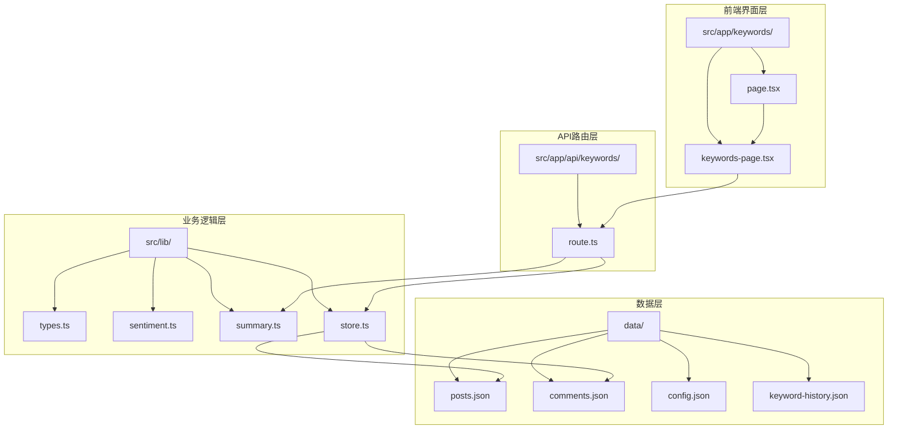
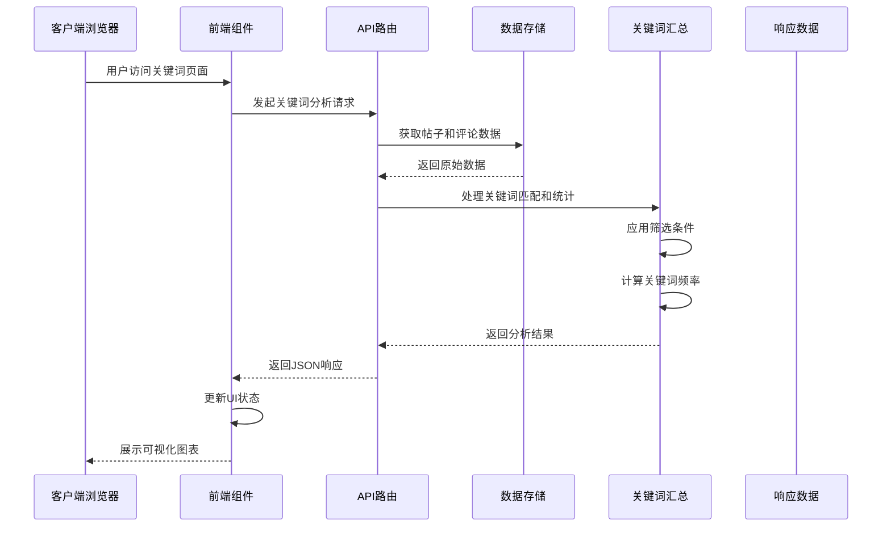
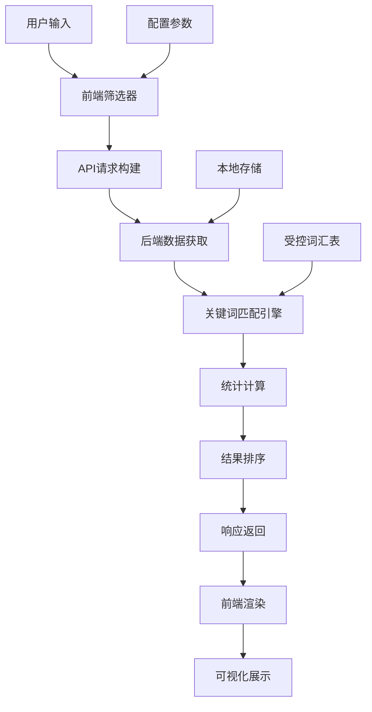
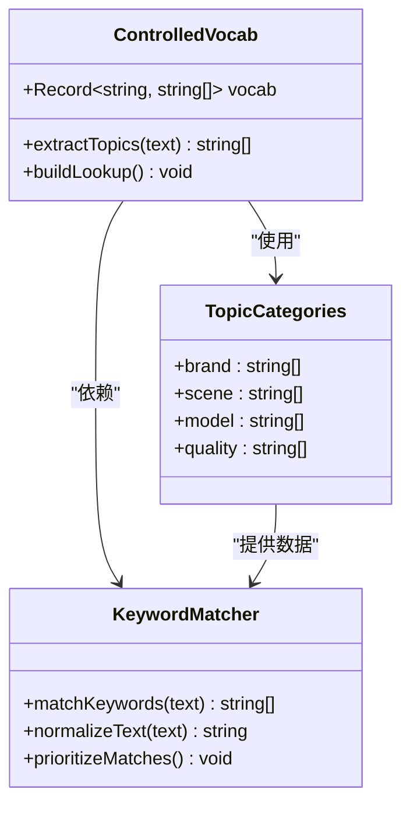
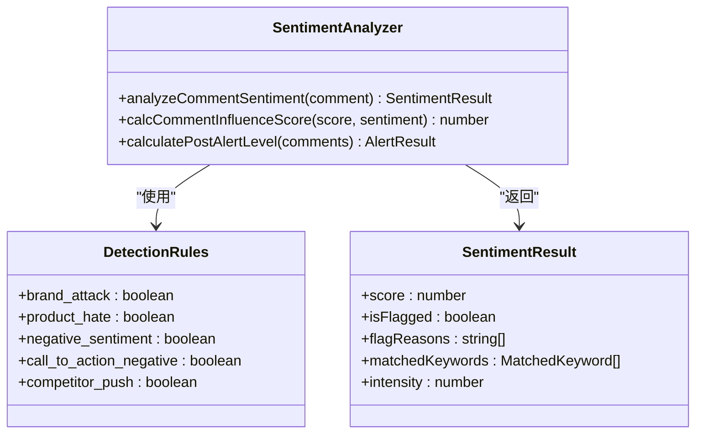
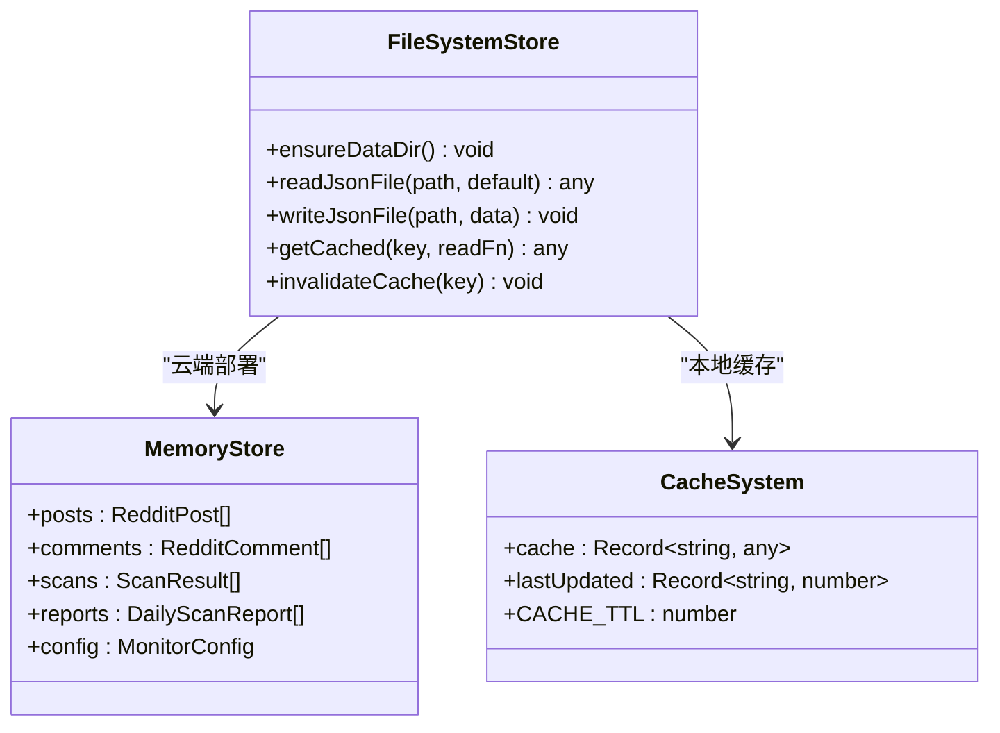
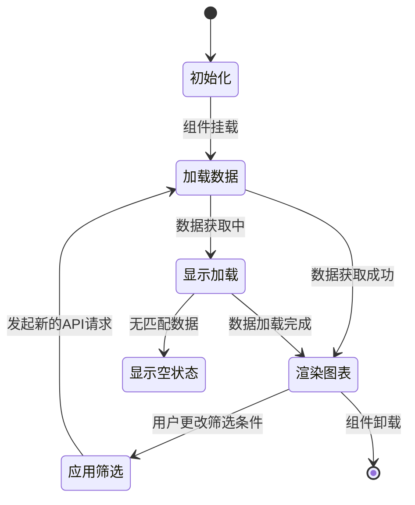
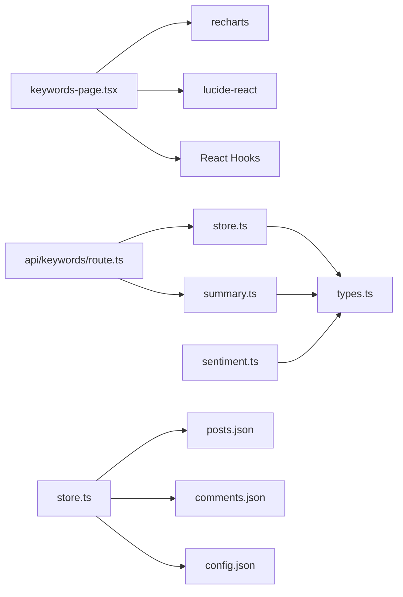

# 关键词分析界面

<cite>
**本文档引用的文件**
- [src/app/keywords/page.tsx](file://src/app/keywords/page.tsx)
- [src/app/keywords/keywords-page.tsx](file://src/app/keywords/keywords-page.tsx)
- [src/lib/types.ts](file://src/lib/types.ts)
- [src/lib/sentiment.ts](file://src/lib/sentiment.ts)
- [src/lib/summary.ts](file://src/lib/summary.ts)
- [src/lib/store.ts](file://src/lib/store.ts)
- [src/app/api/keywords/route.ts](file://src/app/api/keywords/route.ts)
- [data/keyword-history.json](file://data/keyword-history.json)
- [data/config.json](file://data/config.json)
- [data/posts.json](file://data/posts.json)
- [data/comments.json](file://data/comments.json)
</cite>

## 目录
1. [简介](#简介)
2. [项目结构](#项目结构)
3. [核心组件](#核心组件)
4. [架构概览](#架构概览)
5. [详细组件分析](#详细组件分析)
6. [依赖关系分析](#依赖关系分析)
7. [性能考虑](#性能考虑)
8. [故障排除指南](#故障排除指南)
9. [结论](#结论)

## 简介

关键词分析界面是Reddit监控系统的核心功能模块，专门用于分析和可视化社交媒体上的关键词热度变化。该界面提供了实时的关键词统计、趋势分析、情感分析和相关性评估功能，帮助用户深入了解品牌声誉和市场趋势。

系统采用React客户端组件架构，结合Next.js API路由处理后端逻辑，实现了完整的关键词分析解决方案。界面支持多种筛选条件，包括时间范围、子版块、关键词类别等，为用户提供灵活的数据探索能力。

## 项目结构

关键词分析界面位于Next.js应用的特定路由下，采用模块化的文件组织方式：

**图表来源**
- [src/app/keywords/page.tsx:1-14](file://src/app/keywords/page.tsx#L1-L14)
- [src/app/keywords/keywords-page.tsx:1-375](file://src/app/keywords/keywords-page.tsx#L1-L375)
- [src/app/api/keywords/route.ts:1-156](file://src/app/api/keywords/route.ts#L1-L156)

**章节来源**
- [src/app/keywords/page.tsx:1-14](file://src/app/keywords/page.tsx#L1-L14)
- [src/app/keywords/keywords-page.tsx:1-375](file://src/app/keywords/keywords-page.tsx#L1-L375)

## 核心组件

### 主界面组件

关键词分析界面的核心是一个响应式的React组件，提供了完整的数据分析功能：

#### 关键词热度图表
- **垂直条形图**：展示Top 20关键词的出现频率
- **交互式Tooltip**：提供详细的统计数据
- **自适应布局**：支持不同屏幕尺寸的响应式设计

#### 筛选器系统
- **基础筛选**：子版块选择、关键词搜索
- **时间筛选**：评论时间和发帖时间范围
- **分类筛选**：品牌、场景、型号、质量四类关键词
- **批量操作**：全选、清空功能

#### 数据展示网格
- **关键词卡片**：显示关键词名称和出现次数
- **加载状态**：空状态和加载指示器
- **响应式布局**：根据屏幕大小调整列数

**章节来源**
- [src/app/keywords/keywords-page.tsx:20-375](file://src/app/keywords/keywords-page.tsx#L20-L375)

### API路由处理

后端API路由负责处理前端请求，执行关键词分析和数据聚合：

#### 请求参数处理
- **查询字符串解析**：支持多种筛选条件
- **日期范围验证**：确保时间参数的有效性
- **分类参数处理**：多类别关键词筛选

#### 数据处理流程
- **数据源访问**：从本地存储获取帖子和评论
- **关键词匹配**：使用受控词汇表进行标准化匹配
- **统计计算**：按标签统计关键词出现频率
- **结果排序**：按出现次数降序排列

**章节来源**
- [src/app/api/keywords/route.ts:5-156](file://src/app/api/keywords/route.ts#L5-L156)

## 架构概览

关键词分析系统的整体架构采用前后端分离的设计模式：

**图表来源**
- [src/app/keywords/keywords-page.tsx:41-68](file://src/app/keywords/keywords-page.tsx#L41-L68)
- [src/app/api/keywords/route.ts:20-154](file://src/app/api/keywords/route.ts#L20-L154)

### 数据流架构

系统采用分层数据流设计，确保数据的一致性和可维护性：

**图表来源**
- [src/lib/summary.ts:6-89](file://src/lib/summary.ts#L6-L89)
- [src/lib/store.ts:89-142](file://src/lib/store.ts#L89-L142)

## 详细组件分析

### 关键词分析引擎

关键词分析引擎是系统的核心组件，负责处理文本数据并提取有意义的信息：

#### 受控词汇表设计
系统使用标准化的受控词汇表来确保关键词分析的一致性和准确性：

**图表来源**
- [src/lib/summary.ts:6-119](file://src/lib/summary.ts#L6-L119)

#### 关键词匹配算法
系统采用智能的关键词匹配策略，优先匹配较长的词组以避免误匹配：

**章节来源**
- [src/lib/summary.ts:140-155](file://src/lib/summary.ts#L140-L155)

### 情感分析集成

系统集成了多层次的情感分析功能，为关键词分析提供深度洞察：

#### 情感评分体系
情感分析使用基于规则的方法，结合机器学习模型提供准确的判断：

**图表来源**
- [src/lib/sentiment.ts:150-244](file://src/lib/sentiment.ts#L150-L244)

#### 告警级别计算
系统根据情感分析结果自动计算告警级别，帮助用户快速识别潜在风险：

**章节来源**
- [src/lib/sentiment.ts:272-315](file://src/lib/sentiment.ts#L272-L315)

### 数据存储和缓存

系统采用混合存储策略，支持本地开发和云端部署：

#### 文件存储系统
本地开发环境使用文件系统进行数据持久化：

**图表来源**
- [src/lib/store.ts:8-87](file://src/lib/store.ts#L8-L87)

#### 缓存策略
系统实现了智能缓存机制，平衡数据新鲜度和性能需求：

**章节来源**
- [src/lib/store.ts:71-82](file://src/lib/store.ts#L71-L82)

### 前端交互组件

关键词分析界面提供了丰富的交互功能，增强用户体验：

#### 实时筛选功能
用户可以实时调整筛选条件，界面会自动重新计算和展示结果：

**图表来源**
- [src/app/keywords/keywords-page.tsx:70-72](file://src/app/keywords/keywords-page.tsx#L70-L72)

#### 图表交互设计
界面集成了响应式图表组件，提供直观的数据可视化：

**章节来源**
- [src/app/keywords/keywords-page.tsx:202-217](file://src/app/keywords/keywords-page.tsx#L202-L217)

## 依赖关系分析

关键词分析界面的依赖关系相对简单，主要依赖于核心的业务逻辑模块：

**图表来源**
- [src/app/keywords/keywords-page.tsx:3-5](file://src/app/keywords/keywords-page.tsx#L3-L5)
- [src/app/api/keywords/route.ts:1-3](file://src/app/api/keywords/route.ts#L1-L3)

### 外部依赖管理

系统对外部依赖进行了最小化管理，确保部署的简洁性：

**章节来源**
- [src/app/keywords/keywords-page.tsx:3-5](file://src/app/keywords/keywords-page.tsx#L3-L5)

## 性能考虑

关键词分析界面在设计时充分考虑了性能优化，采用了多种策略来提升用户体验：

### 数据加载优化
- **缓存机制**：30秒缓存周期减少重复数据读取
- **懒加载**：图表组件按需渲染
- **虚拟滚动**：大量数据时的性能优化

### 计算效率优化
- **增量更新**：只在筛选条件变化时重新计算
- **智能匹配**：按关键词长度排序优先匹配
- **内存管理**：及时清理不再使用的数据

### 网络传输优化
- **参数压缩**：URL查询参数的最小化
- **数据压缩**：JSON响应的精简格式
- **并发处理**：多个API请求的并行处理

## 故障排除指南

### 常见问题诊断

#### 数据加载失败
当API请求失败时，系统会显示错误状态并提供重试机制：

**章节来源**
- [src/app/keywords/keywords-page.tsx:63-67](file://src/app/keywords/keywords-page.tsx#L63-L67)

#### 筛选条件无效
当筛选条件导致无匹配数据时，界面会显示相应的提示信息：

**章节来源**
- [src/app/keywords/keywords-page.tsx:347-351](file://src/app/keywords/keywords-page.tsx#L347-L351)

#### 性能问题
如果界面响应缓慢，检查以下可能的原因：
- 缓存失效导致频繁数据读取
- 筛选条件过于复杂
- 浏览器性能限制

### 调试工具使用

系统提供了多种调试工具来帮助开发者定位问题：
- 控制台日志输出
- API响应时间监控
- 数据完整性验证

## 结论

关键词分析界面是一个功能完整、设计合理的数据分析工具。它成功地将复杂的文本分析技术与直观的用户界面相结合，为用户提供了深入的市场洞察和品牌监测能力。

系统的主要优势包括：
- **实时性**：支持动态数据更新和实时监控
- **可扩展性**：模块化设计便于功能扩展
- **用户体验**：直观的界面设计和丰富的交互功能
- **性能优化**：高效的算法和缓存策略

未来可以考虑的功能增强包括：
- 更高级的统计分析功能
- 多维度数据导出
- 自定义告警规则
- 移动端优化

通过持续的优化和改进，关键词分析界面将成为一个强大的数据分析工具，为用户提供有价值的商业洞察。