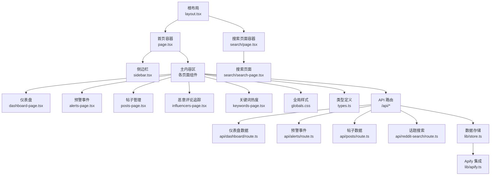
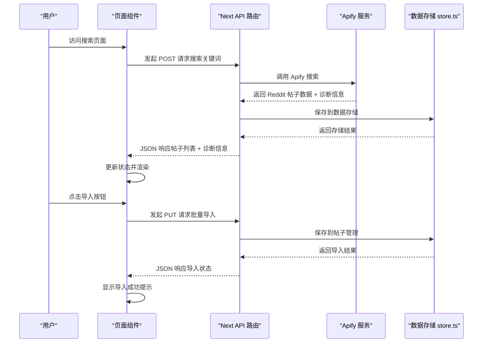
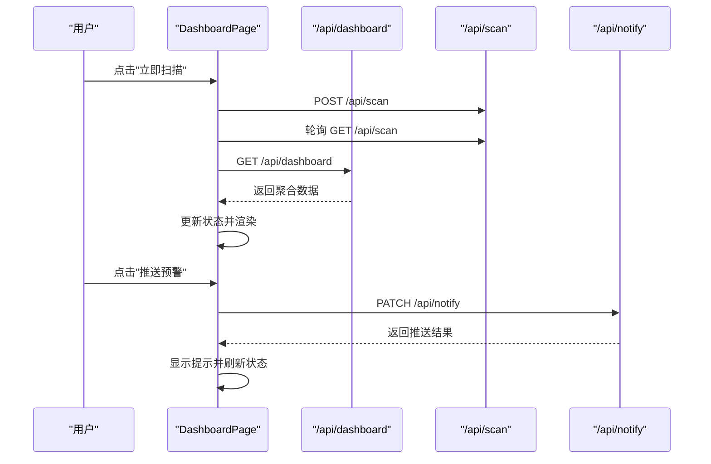
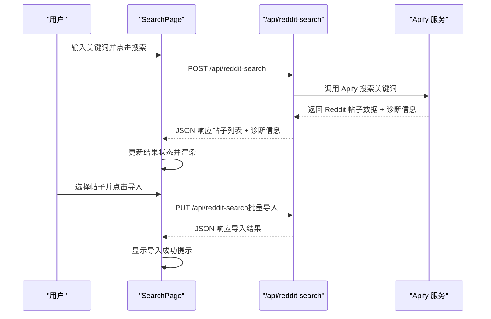
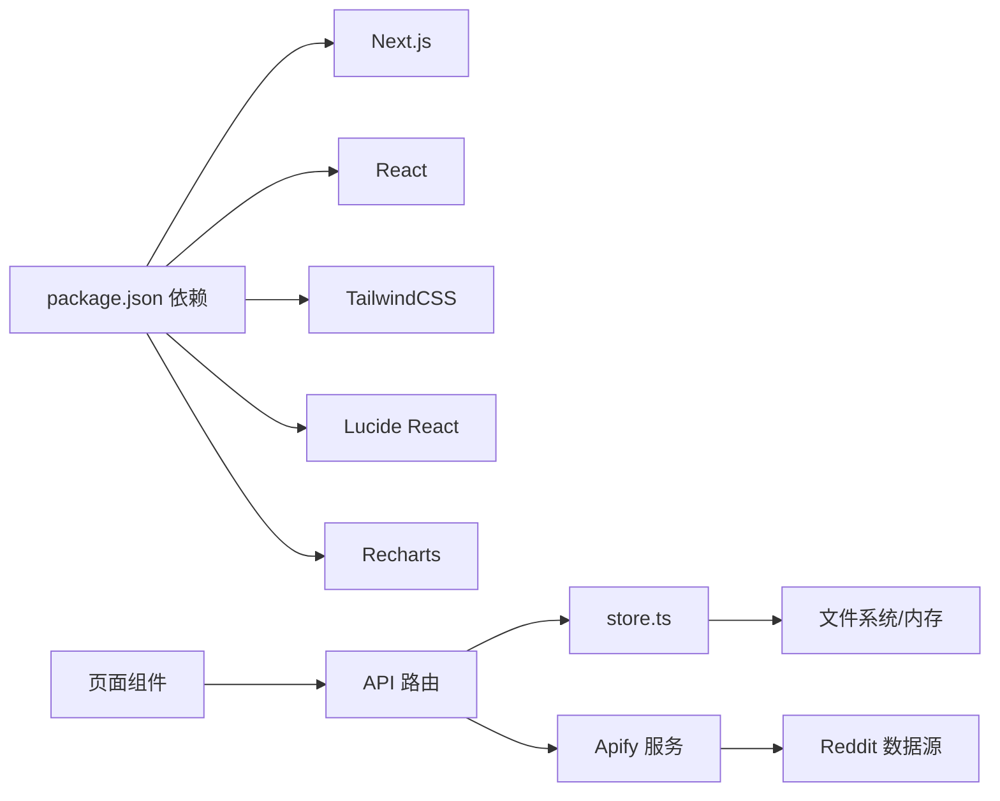

# 前端界面

<cite>
**本文引用的文件**
- [src/app/layout.tsx](file://src/app/layout.tsx)
- [src/app/page.tsx](file://src/app/page.tsx)
- [src/components/sidebar.tsx](file://src/components/sidebar.tsx)
- [src/app/dashboard-page.tsx](file://src/app/dashboard-page.tsx)
- [src/app/alerts/alerts-page.tsx](file://src/app/alerts/alerts-page.tsx)
- [src/app/posts/posts-page.tsx](file://src/app/posts/posts-page.tsx)
- [src/app/influencers/influencers-page.tsx](file://src/app/influencers/influencers-page.tsx)
- [src/app/keywords/keywords-page.tsx](file://src/app/keywords/keywords-page.tsx)
- [src/app/search/page.tsx](file://src/app/search/page.tsx)
- [src/app/search/search-page.tsx](file://src/app/search/search-page.tsx)
- [src/app/api/reddit-search/route.ts](file://src/app/api/reddit-search/route.ts)
- [src/lib/types.ts](file://src/lib/types.ts)
- [src/lib/apify.ts](file://src/lib/apify.ts)
- [src/app/globals.css](file://src/app/globals.css)
- [src/app/api/dashboard/route.ts](file://src/app/api/dashboard/route.ts)
- [src/app/api/alerts/route.ts](file://src/app/api/alerts/route.ts)
- [src/app/api/posts/route.ts](file://src/app/api/posts/route.ts)
- [src/lib/store.ts](file://src/lib/store.ts)
- [package.json](file://package.json)
- [next.config.ts](file://next.config.ts)
</cite>

## 更新摘要
**变更内容**
- 新增完整的搜索界面组件，包括多关键词输入、subreddit过滤、时间范围选择、结果展示和批量导入功能
- 更新侧边栏导航以包含新的'话题搜索'功能
- 新增 Reddit 话题搜索 API 路由，支持关键词搜索和批量导入到帖子管理
- **更新** 改进了搜索页面的关键词匹配行为，现在搜索结果更加精准，仅基于帖子标题进行匹配，提升了用户体验和搜索质量
- **新增** 搜索页面界面优化，改进用户交互体验，新增诊断信息显示，优化数量选择控件
- **更新** 移除了搜索结果卡片中的评分（⬆ {post.score} 赞）和评论数（💬 {post.commentCount} 评论）显示，优化了用户界面以提供更可靠的用户体验

## 目录
1. [简介](#简介)
2. [项目结构](#项目结构)
3. [核心组件](#核心组件)
4. [架构总览](#架构总览)
5. [详细组件分析](#详细组件分析)
6. [依赖关系分析](#依赖关系分析)
7. [性能考量](#性能考量)
8. [故障排查指南](#故障排查指南)
9. [结论](#结论)
10. [附录](#附录)

## 简介
本文件面向 Reddit 监控系统的前端界面，提供从视觉外观、交互行为到技术实现的完整说明。文档覆盖以下方面：
- 组件的视觉风格与布局、交互模式与状态管理
- Props/属性、事件、插槽与自定义选项
- 使用示例（以路径形式给出，不直接展示代码）
- 响应式设计与无障碍访问建议
- 动画与过渡效果
- 样式自定义与主题支持
- 跨浏览器兼容性与性能优化
- 组件组合与与后端 API 的集成方式

## 项目结构
前端采用 Next.js App Router 架构，页面组件位于 src/app 下，通用 UI 组件位于 src/components，共享类型定义与全局样式位于 src/lib 与 src/app。

**图表来源**
- [src/app/layout.tsx:1-23](file://src/app/layout.tsx#L1-L23)
- [src/app/page.tsx:1-14](file://src/app/page.tsx#L1-L14)
- [src/app/search/page.tsx:1-14](file://src/app/search/page.tsx#L1-L14)
- [src/components/sidebar.tsx:1-98](file://src/components/sidebar.tsx#L1-L98)
- [src/app/dashboard-page.tsx:1-535](file://src/app/dashboard-page.tsx#L1-L535)
- [src/app/alerts/alerts-page.tsx:1-220](file://src/app/alerts/alerts-page.tsx#L1-L220)
- [src/app/posts/posts-page.tsx:1-566](file://src/app/posts/posts-page.tsx#L1-L566)
- [src/app/influencers/influencers-page.tsx:1-312](file://src/app/influencers/influencers-page.tsx#L1-L312)
- [src/app/keywords/keywords-page.tsx:1-375](file://src/app/keywords/keywords-page.tsx#L1-L375)
- [src/app/search/search-page.tsx:1-437](file://src/app/search/search-page.tsx#L1-L437)
- [src/app/api/reddit-search/route.ts:1-159](file://src/app/api/reddit-search/route.ts#L1-L159)
- [src/app/globals.css:1-74](file://src/app/globals.css#L1-L74)
- [src/app/api/dashboard/route.ts:1-108](file://src/app/api/dashboard/route.ts#L1-L108)
- [src/app/api/alerts/route.ts:1-62](file://src/app/api/alerts/route.ts#L1-L62)
- [src/app/api/posts/route.ts:1-157](file://src/app/api/posts/route.ts#L1-L157)
- [src/lib/store.ts:1-285](file://src/lib/store.ts#L1-L285)
- [src/lib/apify.ts:1-511](file://src/lib/apify.ts#L1-L511)
- [src/lib/types.ts:1-194](file://src/lib/types.ts#L1-L194)

**章节来源**
- [src/app/layout.tsx:1-23](file://src/app/layout.tsx#L1-L23)
- [src/app/page.tsx:1-14](file://src/app/page.tsx#L1-L14)
- [src/app/search/page.tsx:1-14](file://src/app/search/page.tsx#L1-L14)
- [src/components/sidebar.tsx:1-98](file://src/components/sidebar.tsx#L1-L98)

## 核心组件
- 侧边栏（Sidebar）：提供导航与折叠功能，支持图标与文字切换，根据当前路径高亮活动项。**已更新** 包含新增的'话题搜索'导航项。
- 仪表盘（DashboardPage）：聚合监控指标、情感趋势、恶意类型分布、高风险帖子与最新恶意评论，支持手动扫描与推送预警。
- 预警事件（AlertsPage）：展示与管理预警帖子的状态流转（待处理/处理中/已处理/已忽略），支持展开查看详情与更新状态。
- 帖子管理（PostsPage）：展示监控中的帖子，支持搜索、筛选、排序、快速日期筛选、单贴/全量扫描、删除单个/全部帖子。
- 恶意评论追踪（InfluencersPage）：按影响力得分排序的恶意评论列表，支持按板块、关键词、作者与时间范围筛选。
- 关键词热度（KeywordsPage）：场景关键词热力图与网格展示，支持按板块、关键词与时间范围筛选，并提供分类关键词勾选。
- **新增** 话题搜索（SearchPage）：完整的 Reddit 话题搜索界面，支持多关键词输入、subreddit过滤、时间范围选择、结果展示和批量导入功能，**新增** 包含诊断信息显示和优化的数量选择控件。

**章节来源**
- [src/components/sidebar.tsx:1-98](file://src/components/sidebar.tsx#L1-L98)
- [src/app/dashboard-page.tsx:1-535](file://src/app/dashboard-page.tsx#L1-L535)
- [src/app/alerts/alerts-page.tsx:1-220](file://src/app/alerts/alerts-page.tsx#L1-L220)
- [src/app/posts/posts-page.tsx:1-566](file://src/app/posts/posts-page.tsx#L1-L566)
- [src/app/influencers/influencers-page.tsx:1-312](file://src/app/influencers/influencers-page.tsx#L1-L312)
- [src/app/keywords/keywords-page.tsx:1-375](file://src/app/keywords/keywords-page.tsx#L1-L375)
- [src/app/search/search-page.tsx:1-437](file://src/app/search/search-page.tsx#L1-L437)

## 架构总览
前端通过 Next.js App Router 提供页面级路由，页面组件通过 fetch 调用后端 API 获取数据；数据持久化与缓存由 lib/store.ts 管理，开发环境使用文件系统，生产环境（Vercel）使用内存存储并支持环境变量注入。**已更新** 新增 Reddit 话题搜索功能，通过 Apify 服务进行数据抓取，**新增** 包含诊断信息的完整数据流。

**图表来源**
- [src/app/search/search-page.tsx:47-103](file://src/app/search/search-page.tsx#L47-L103)
- [src/app/api/reddit-search/route.ts:6-58](file://src/app/api/reddit-search/route.ts#L6-L58)
- [src/lib/apify.ts:137-291](file://src/lib/apify.ts#L137-L291)
- [src/lib/store.ts:99-114](file://src/lib/store.ts#L99-L114)

**章节来源**
- [src/app/api/reddit-search/route.ts:1-159](file://src/app/api/reddit-search/route.ts#L1-L159)
- [src/lib/store.ts:1-285](file://src/lib/store.ts#L1-L285)
- [src/lib/apify.ts:1-511](file://src/lib/apify.ts#L1-L511)

## 详细组件分析

### 侧边栏（Sidebar）
- 视觉与行为
  - 固定宽度与折叠逻辑，折叠时仅保留图标与收起按钮。
  - 导航项根据当前路径高亮，支持悬停态与过渡动画。
  - 顶部包含品牌标识与简短标语，底部提供折叠开关。
- 交互
  - 点击导航项跳转至对应页面。
  - 点击折叠按钮切换展开/收起状态。
- 属性与事件
  - 无外部 props；内部通过 usePathname 与 useState 管理状态。
- 插槽与自定义
  - 可通过替换图标库与颜色变量定制外观。
- 样式与主题
  - 使用 Tailwind 类名与 CSS 变量控制背景、边框、文本色与阴影。
- 无障碍
  - Link 组件具备语义化链接属性，建议为按钮添加 aria-label。
- **更新** 导航项新增'话题搜索'，图标为 Globe，路由为 '/search'

**章节来源**
- [src/components/sidebar.tsx:1-98](file://src/components/sidebar.tsx#L1-L98)

### 仪表盘（DashboardPage）
- 视觉与行为
  - 顶部包含标题、上次扫描时间与操作按钮（立即扫描、推送预警）。
  - 舆情健康度卡片：动态计算健康度、标签与进度条。
  - 统计卡片：监控帖子、严重预警、中等预警、恶意评论率。
  - 图表区域：情感趋势折线图、情感分布饼图、恶意类型柱状图。
  - 事件区域：高风险帖子列表与最新恶意评论列表。
- 交互
  - 立即扫描：轮询扫描进度，完成后刷新数据。
  - 推送预警：调用 /api/notify PATCH，显示结果提示。
  - 时间范围切换：7/14/30 天情感趋势。
  - 飞书推送状态：显示启用状态、定时时间与最近一次推送结果。
- 状态与动画
  - loading、scanning、pushing、scanProgress、pushResult 等状态驱动 UI。
  - 健康度进度条与卡片内条形图使用过渡动画。
  - 最新恶意评论使用 slide-in 动画。
- 数据流
  - 通过 /api/dashboard 获取聚合数据，包括统计、情感分布、类别分布、趋势与事件列表。
- 样式与主题
  - 使用 CSS 变量与 Tailwind 类名统一配色与间距。
- 无障碍
  - 图表使用 Tooltip 与 Legend，建议为按钮提供明确的 aria-label。

**图表来源**
- [src/app/dashboard-page.tsx:84-112](file://src/app/dashboard-page.tsx#L84-L112)
- [src/app/api/dashboard/route.ts:13-107](file://src/app/api/dashboard/route.ts#L13-L107)
- [src/app/api/alerts/route.ts:37-61](file://src/app/api/alerts/route.ts#L37-L61)

**章节来源**
- [src/app/dashboard-page.tsx:1-535](file://src/app/dashboard-page.tsx#L1-L535)
- [src/app/api/dashboard/route.ts:1-108](file://src/app/api/dashboard/route.ts#L1-L108)

### 预警事件（AlertsPage）
- 视觉与行为
  - 统计卡片展示各类别预警数量。
  - 顶部筛选标签页（待处理/处理中/已处理/已忽略/全部）。
  - 列表项支持展开查看详情与输入处理人与备注。
- 交互
  - 点击筛选标签页切换状态过滤。
  - 点击展开/收起切换详情区域。
  - 点击"标记处理中/已处理/忽略"更新状态并保存。
- 状态与事件
  - 内部维护 posts、stats、filter、expandedId、note、handlerName 等状态。
  - PATCH /api/alerts 更新状态与备注。
- 样式与主题
  - 使用状态色与标签徽章区分状态与等级。

**章节来源**
- [src/app/alerts/alerts-page.tsx:1-220](file://src/app/alerts/alerts-page.tsx#L1-L220)
- [src/app/api/alerts/route.ts:1-62](file://src/app/api/alerts/route.ts#L1-L62)

### 帖子管理（PostsPage）
- 视觉与行为
  - 顶部包含扫描与刷新按钮、删除全部按钮。
  - 筛选区域：搜索、等级筛选、日期范围、快捷日期、排序、快速等级徽章。
  - 帖子网格：按预警等级着色，显示扫描状态、评论数、恶意数、创建时间与原因标签。
- 交互
  - 单贴扫描：POST /api/scan（postIds）。
  - 全量扫描：POST /api/scan（scanAll），轮询进度。
  - 删除单个/全部：DELETE /api/posts。
  - 刷新：GET /api/posts。
- 状态与事件
  - 内部维护 posts、loading、search、filterLevel、sortBy、dateFrom、dateTo、scanning、scanProgress、scanResult、showFilterMenu、showSortMenu、deletingPostId、deletingAll、selectedQuickDate、scanningPostId 等状态。
- 样式与主题
  - 使用等级色块与边框区分安全/中等/严重等级。

**章节来源**
- [src/app/posts/posts-page.tsx:1-566](file://src/app/posts/posts-page.tsx#L1-L566)
- [src/app/api/posts/route.ts:1-157](file://src/app/api/posts/route.ts#L1-L157)

### 恶意评论追踪（InfluencersPage）
- 视觉与行为
  - 顶部标题与刷新按钮。
  - 筛选区域：板块、关键词、作者、评论时间、发帖时间。
  - 列表项：作者、影响力得分徽章、赞数、评论时间、板块链接、评论正文、帖子标题与原因标签。
- 交互
  - 下拉选择板块，支持清空筛选。
  - 输入关键词与作者名进行模糊搜索。
  - 设置评论/发帖时间范围。
  - 刷新数据。
- 状态与事件
  - 内部维护 comments、loading、subreddit、keyword、authorFilter、commentDateFrom、commentDateTo、postDateFrom、postDateTo、showSubredditMenu、subreddits 等状态。
- 样式与主题
  - 影响力得分使用分级徽章（红/橙/黄/灰）。

**章节来源**
- [src/app/influencers/influencers-page.tsx:1-312](file://src/app/influencers/influencers-page.tsx#L1-L312)

### 关键词热度（KeywordsPage）
- 视觉与行为
  - 顶部标题与说明。
  - 顶部垂直柱状图展示 Top 20 场景关键词。
  - 筛选区域：板块、关键词、评论/发帖时间范围。
  - 分类关键词勾选：品牌、场景、型号、质量四类，支持全选/清空。
  - 关键词网格：展示关键词与出现次数。
- 交互
  - 下拉选择板块，支持清空筛选。
  - 输入关键词进行搜索。
  - 设置评论/发帖时间范围。
  - 勾选/取消分类关键词，支持全选/清空。
  - 刷新数据。
- 状态与事件
  - 内部维护 keywords、loading、subreddits、categories、subreddit、keyword、commentDateFrom、commentDateTo、postDateFrom、postDateTo、showSubredditMenu、selectedBrand/Scene/Model/Quality 等状态。
- 样式与主题
  - 使用蓝色填充柱状图与卡片式网格。

**章节来源**
- [src/app/keywords/keywords-page.tsx:1-375](file://src/app/keywords/keywords-page.tsx#L1-L375)

### **新增** 话题搜索（SearchPage）
- 视觉与行为
  - 顶部包含标题和说明，强调无需提供帖子链接即可按关键词搜索。
  - 搜索表单包含关键词输入、subreddit 过滤、数量限制和时间范围选择。
  - **新增** 诊断信息显示区域，展示原始返回数量与过滤后数量对比。
  - 结果展示区域支持全选、导入选中和导入全部功能。
  - 支持关键词自动解析（逗号、空格、换行分隔）和关键词移除。
  - **更新** 移除了搜索结果卡片中的评分（⬆ {post.score} 赞）和评论数（💬 {post.commentCount} 评论）显示，优化了用户界面以提供更可靠的用户体验。
- 交互
  - 多关键词输入：支持逗号、空格、换行分隔，自动解析为关键词数组。
  - subreddit 过滤：可选参数，留空则全局搜索。
  - **优化** 数量限制：支持 1-100 条帖子限制，提供更好的用户体验。
  - 时间范围：支持最近 1 小时/1 天/1 周/1 个月/1 年/不限时间。
  - **新增** 诊断信息：显示原始返回数量、过滤后数量和数据样本，帮助定位问题。
  - 结果导入：支持批量导入到帖子管理，自动去重处理。
  - 搜索状态：包含加载状态、错误提示和最后查询显示。
  - **新增** 超时控制：前端设置 3 分钟超时，防止长时间等待。
- 状态与事件
  - 内部维护 keywordInput、subreddit、limit、timeframe、results、searching、error、lastQuery、diagInfo、importing、importMessage、selectedIds 等状态。
  - POST /api/reddit-search 进行关键词搜索。
  - PUT /api/reddit-search 进行批量导入。
- 数据流
  - 通过 Apify 服务进行 Reddit 帖子搜索，支持缓存和限流。
  - 搜索结果转换为 RedditPost 格式，导入到帖子管理。
  - **新增** 返回诊断信息：rawItemCount、filteredPostCount、firstItemKeys、firstItemSample。
- 样式与主题
  - 使用卡片式布局，支持响应式设计。
  - 关键词标签使用蓝色背景，选中状态使用浅蓝色高亮。
  - **新增** 诊断信息区域使用橙色高亮显示差异。
- 无障碍
  - 关键词移除按钮提供 aria-label。
  - 搜索按钮支持禁用状态和加载指示器。
  - **新增** 诊断信息提供清晰的数值对比，便于屏幕阅读器理解。

**更新** 关键词匹配行为优化：现在搜索结果更加精准，仅基于帖子标题进行匹配，提升了用户体验和搜索质量。Apify 服务中的 `postMatchesKeywords` 函数明确说明了这一改进，仅匹配标题内容，不匹配正文或评论。

**图表来源**
- [src/app/search/search-page.tsx:47-103](file://src/app/search/search-page.tsx#L47-L103)
- [src/app/api/reddit-search/route.ts:6-58](file://src/app/api/reddit-search/route.ts#L6-L58)
- [src/lib/apify.ts:137-291](file://src/lib/apify.ts#L137-L291)

**章节来源**
- [src/app/search/search-page.tsx:1-437](file://src/app/search/search-page.tsx#L1-L437)
- [src/app/search/page.tsx:1-14](file://src/app/search/page.tsx#L1-L14)
- [src/app/api/reddit-search/route.ts:1-159](file://src/app/api/reddit-search/route.ts#L1-L159)
- [src/lib/apify.ts:137-291](file://src/lib/apify.ts#L137-L291)

## 依赖关系分析
- 前端依赖
  - Next.js 16、React 19、TailwindCSS 4、Lucide React、Recharts。
- 组件间耦合
  - 页面组件通过 API 路由解耦，store.ts 提供统一数据源。
  - 侧边栏与页面主体通过路由解耦，保持低耦合高内聚。
  - **新增** 话题搜索组件与 Apify 服务集成，通过 /api/reddit-search 路由进行数据交互。
- 外部集成
  - 飞书通知通过 /api/notify 与 /api/feishu* 路由对接（见 API 文件）。
  - **新增** Apify 服务集成，用于 Reddit 帖子搜索和数据抓取，**新增** 返回详细的诊断信息。

**图表来源**
- [package.json:14-36](file://package.json#L14-L36)
- [src/app/search/search-page.tsx:60-104](file://src/app/search/search-page.tsx#L60-L104)
- [src/lib/store.ts:1-285](file://src/lib/store.ts#L1-L285)
- [src/lib/apify.ts:137-291](file://src/lib/apify.ts#L137-L291)

**章节来源**
- [package.json:1-38](file://package.json#L1-L38)
- [next.config.ts:1-28](file://next.config.ts#L1-L28)

## 性能考量
- 缓存策略
  - store.ts 对 posts/comments/scans/reports 使用 30 秒缓存，减少频繁读取大文件带来的开销。
  - **新增** Apify 服务对 subreddit 和帖子详情使用缓存，subreddit 列表缓存 10 分钟，帖子详情缓存 30 分钟。
- 开发体验
  - next.config.ts 在开发服务器禁用最小化与优化 CSS，提升编译速度。
- 图表渲染
  - Recharts 在大数据集上建议虚拟化或分页，避免一次性渲染过多节点。
- 资源加载
  - Tailwind 按需生成样式，避免冗余 CSS。
- 网络请求
  - 轮询扫描进度时注意节流与清理定时器，避免内存泄漏。
  - **新增** Apify 服务请求添加 2 秒最小间隔限制，避免 API 限流。
  - **新增** 前端设置 3 分钟超时控制，防止长时间等待。
- **新增** 搜索功能优化
  - 关键词自动解析使用正则表达式，支持多种分隔符。
  - 结果导入前进行去重检查，避免重复数据。
  - **新增** 诊断信息帮助定位问题，提高调试效率。
  - **更新** 关键词匹配优化：仅基于帖子标题进行匹配，提升搜索精度和性能。
  - **更新** UI优化：移除了评分和评论数显示，简化了搜索结果卡片，提升了用户界面的可靠性和简洁性。

**章节来源**
- [src/lib/store.ts:73-82](file://src/lib/store.ts#L73-L82)
- [src/lib/apify.ts:17-50](file://src/lib/apify.ts#L17-L50)
- [next.config.ts:7-21](file://next.config.ts#L7-L21)

## 故障排查指南
- 数据为空或异常
  - 检查 store.ts 是否存在数据文件或内存数据；确认 mock-data 是否生效。
- 扫描未完成
  - 确认 /api/scan 路由是否正确返回 isRunning/total/current；检查轮询间隔与清理逻辑。
- 预警推送失败
  - 检查 /api/notify PATCH 返回值与飞书配置；确认通知级别与时间设置。
- 删除数据失败
  - 检查 /api/posts DELETE 参数与返回；确认删除关联评论与扫描结果逻辑。
- **新增** 话题搜索问题
  - 检查 APIFY_TOKEN 环境变量是否配置；确认 Apify 服务可用性。
  - 验证关键词格式和 subreddit 名称；检查搜索限制参数。
  - 确认导入到帖子管理的数据格式和去重逻辑。
  - **新增** 检查诊断信息：rawItemCount 与 filteredPostCount 的差异，定位是 Actor 返回少还是过滤多。
  - **新增** 检查超时问题：确认前端 3 分钟超时设置是否合理。
  - **更新** 检查关键词匹配：确认仅基于标题匹配的行为符合预期。
  - **更新** 检查UI显示：确认评分和评论数字段已被移除，界面显示更加简洁。
- Vercel 环境
  - 确认环境变量是否正确注入（LLM、飞书 Webhook、隧道 URL、APIFY_TOKEN）。

**章节来源**
- [src/lib/store.ts:195-284](file://src/lib/store.ts#L195-L284)
- [src/app/api/alerts/route.ts:37-61](file://src/app/api/alerts/route.ts#L37-L61)
- [src/app/api/posts/route.ts:129-156](file://src/app/api/posts/route.ts#L129-L156)
- [src/app/api/reddit-search/route.ts:17-22](file://src/app/api/reddit-search/route.ts#L17-L22)
- [src/lib/apify.ts:56-66](file://src/lib/apify.ts#L56-L66)

## 结论
该前端界面以清晰的导航与模块化页面为核心，结合丰富的可视化图表与完善的交互反馈，实现了对 Reddit 品牌声誉的全面监控。**新增的搜索界面组件**进一步增强了系统的实用性，用户可以通过关键词直接搜索 Reddit 话题，无需提供具体帖子链接。**新增的诊断信息显示**帮助用户更好地理解搜索结果的质量和数量关系，**优化的数量选择控件**提供了更好的用户体验。**更新的关键词匹配行为**使搜索结果更加精准，仅基于帖子标题进行匹配，显著提升了用户体验和搜索质量。**更新的UI优化**移除了搜索结果卡片中的评分和评论数显示，简化了界面布局，提供了更可靠的用户体验。通过合理的状态管理、缓存策略与 API 解耦，系统在易用性与性能之间取得平衡。建议后续进一步完善无障碍能力与移动端体验，并持续优化大数据量下的渲染性能。

## 附录

### 使用示例（以路径代替代码）
- 访问仪表盘并手动扫描
  - [src/app/dashboard-page.tsx:84-112](file://src/app/dashboard-page.tsx#L84-L112)
- 查看预警事件并更新状态
  - [src/app/alerts/alerts-page.tsx:60-73](file://src/app/alerts/alerts-page.tsx#L60-L73)
- 管理帖子并执行扫描/删除
  - [src/app/posts/posts-page.tsx:137-214](file://src/app/posts/posts-page.tsx#L137-L214)
- 追踪恶意评论并筛选
  - [src/app/influencers/influencers-page.tsx:46-71](file://src/app/influencers/influencers-page.tsx#L46-L71)
- 查看关键词热度并筛选分类
  - [src/app/keywords/keywords-page.tsx:41-72](file://src/app/keywords/keywords-page.tsx#L41-L72)
- **新增** 使用话题搜索功能
  - [src/app/search/search-page.tsx:47-103](file://src/app/search/search-page.tsx#L47-L103)
  - [src/app/search/search-page.tsx:105-140](file://src/app/search/search-page.tsx#L105-L140)

### 样式自定义与主题支持
- CSS 变量
  - 在 [src/app/globals.css:3-35](file://src/app/globals.css#L3-L35) 中定义背景、前景、卡片、边框、主色与危险/警告/成功等颜色变量。
- 动画与过渡
  - 在 [src/app/globals.css:58-74](file://src/app/globals.css#L58-L74) 中定义脉冲与滑入动画。
- Tailwind 主题
  - 使用 @theme inline 将 CSS 变量映射为 Tailwind 色彩体系。

**章节来源**
- [src/app/globals.css:1-74](file://src/app/globals.css#L1-L74)

### 响应式设计与无障碍访问建议
- 响应式
  - 使用 Tailwind 的 grid 与 flex 布局，配合断点适配不同屏幕尺寸。
- 无障碍
  - 为按钮与交互元素提供 aria-label；为图表提供 Tooltip 与 Legend；确保键盘可访问性与焦点可见性。
  - **新增** 为关键词移除按钮提供明确的 aria-label，增强屏幕阅读器支持。
  - **新增** 诊断信息区域提供清晰的数值对比，便于屏幕阅读器理解。
  - **更新** UI简化后的界面更易于屏幕阅读器理解和导航。

### 跨浏览器兼容性
- 现代浏览器优先，Tailwind 4 与 Next.js 16 默认针对现代浏览器优化。
- 如需兼容旧版浏览器，建议引入 polyfill 与 CSS 前缀工具（在现有配置中未发现相关设置）。
- **新增** 确保 Lucide React 图标在所有目标浏览器中正常显示。
- **新增** 确保诊断信息的数值显示在所有浏览器中一致。
- **更新** 确保关键词匹配算法在所有浏览器中的一致性行为。
- **更新** 确保简化的UI界面在各种浏览器中的一致显示效果。