# 告警监控界面

<cite>
**本文档引用的文件**
- [alerts-page.tsx](file://src/app/alerts/alerts-page.tsx)
- [page.tsx](file://src/app/alerts/page.tsx)
- [route.ts](file://src/app/api/alerts/route.ts)
- [types.ts](file://src/lib/types.ts)
- [sentiment.ts](file://src/lib/sentiment.ts)
- [mock-data.ts](file://src/lib/mock-data.ts)
- [route.ts](file://src/app/api/notify/route.ts)
- [feishu-notify.ts](file://src/lib/feishu-notify.ts)
- [route.ts](file://src/app/api/detection-rules/route.ts)
- [settings-page.tsx](file://src/app/settings/settings-page.tsx)
- [route.ts](file://src/app/api/dashboard/route.ts)
- [dashboard-page.tsx](file://src/app/dashboard-page.tsx)
</cite>

## 目录
1. [简介](#简介)
2. [项目结构](#项目结构)
3. [核心组件](#核心组件)
4. [架构概览](#架构概览)
5. [详细组件分析](#详细组件分析)
6. [依赖关系分析](#依赖关系分析)
7. [性能考虑](#性能考虑)
8. [故障排除指南](#故障排除指南)
9. [结论](#结论)

## 简介

告警监控界面是Reddit品牌声誉监控系统的核心组件，负责实时跟踪和处理品牌相关的预警事件。该系统基于Next.js框架构建，采用前后端分离的架构设计，提供了完整的告警生命周期管理功能。

系统主要功能包括：
- 告警级别的智能分类和状态管理
- 实时告警事件的展示和处理
- 历史记录查询和统计分析
- 告警规则配置和阈值设置
- 通知机制集成（飞书）
- 趋势分析和根因分析工具

## 项目结构

告警监控界面采用模块化的设计架构，主要由前端界面层和后端API层组成：

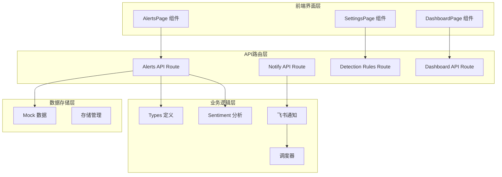

**图表来源**
- [alerts-page.tsx:1-220](file://src/app/alerts/alerts-page.tsx#L1-L220)
- [route.ts:1-62](file://src/app/api/alerts/route.ts#L1-L62)
- [types.ts:1-194](file://src/lib/types.ts#L1-L194)

**章节来源**
- [alerts-page.tsx:1-220](file://src/app/alerts/alerts-page.tsx#L1-L220)
- [page.tsx:1-14](file://src/app/alerts/page.tsx#L1-L14)
- [route.ts:1-62](file://src/app/api/alerts/route.ts#L1-L62)

## 核心组件

### 告警级别分类体系

系统实现了多层次的告警级别分类标准，支持从严重到安全的完整等级体系：

| 等级 | 数值范围 | 描述 | 颜色标识 |
|------|----------|------|----------|
| 严重 | critical | 极高风险，需要立即处理 | 🔴 红色 |
| 中等 | medium | 高风险，需要尽快处理 | 🟠 橙色 |
| 安全 | safe | 正常状态，无需关注 | 🟢 绿色 |

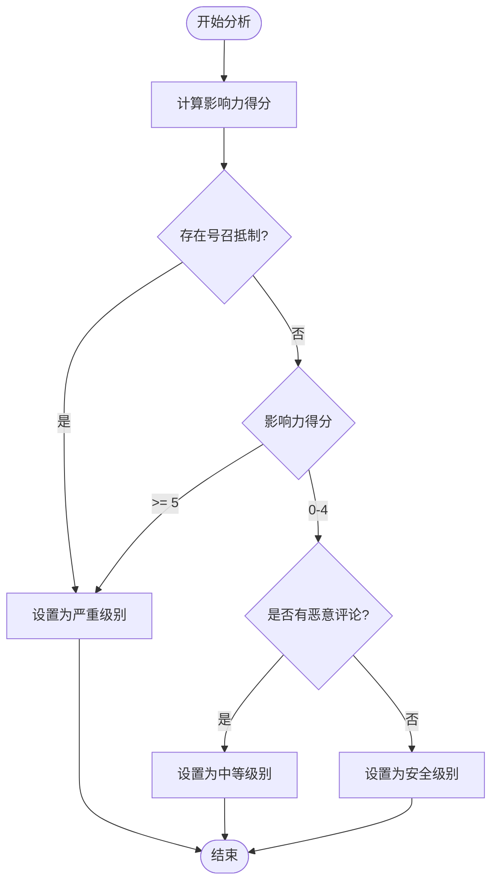

**图表来源**
- [sentiment.ts:291-315](file://src/lib/sentiment.ts#L291-L315)

### 状态管理系统

告警状态采用有限状态机设计，支持四种基本状态：

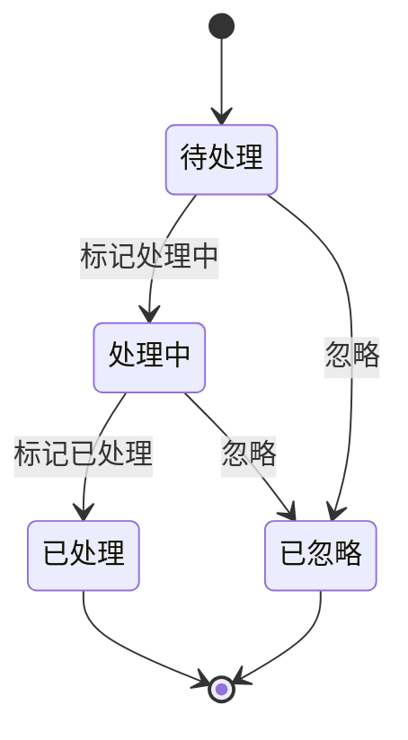

**图表来源**
- [types.ts:6-7](file://src/lib/types.ts#L6-L7)
- [alerts-page.tsx:27-32](file://src/app/alerts/alerts-page.tsx#L27-L32)

**章节来源**
- [types.ts:3-29](file://src/lib/types.ts#L3-L29)
- [sentiment.ts:291-355](file://src/lib/sentiment.ts#L291-L355)
- [alerts-page.tsx:27-32](file://src/app/alerts/alerts-page.tsx#L27-L32)

## 架构概览

告警监控系统采用分层架构设计，确保了良好的可维护性和扩展性：

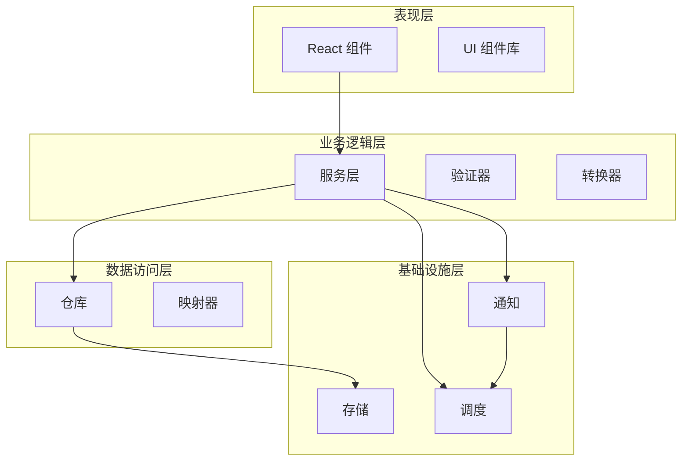

**图表来源**
- [alerts-page.tsx:39-73](file://src/app/alerts/alerts-page.tsx#L39-L73)
- [route.ts:4-34](file://src/app/api/alerts/route.ts#L4-L34)

## 详细组件分析

### 告警列表组件

告警列表组件是用户交互的核心界面，提供了完整的告警事件管理功能：

#### 组件架构图

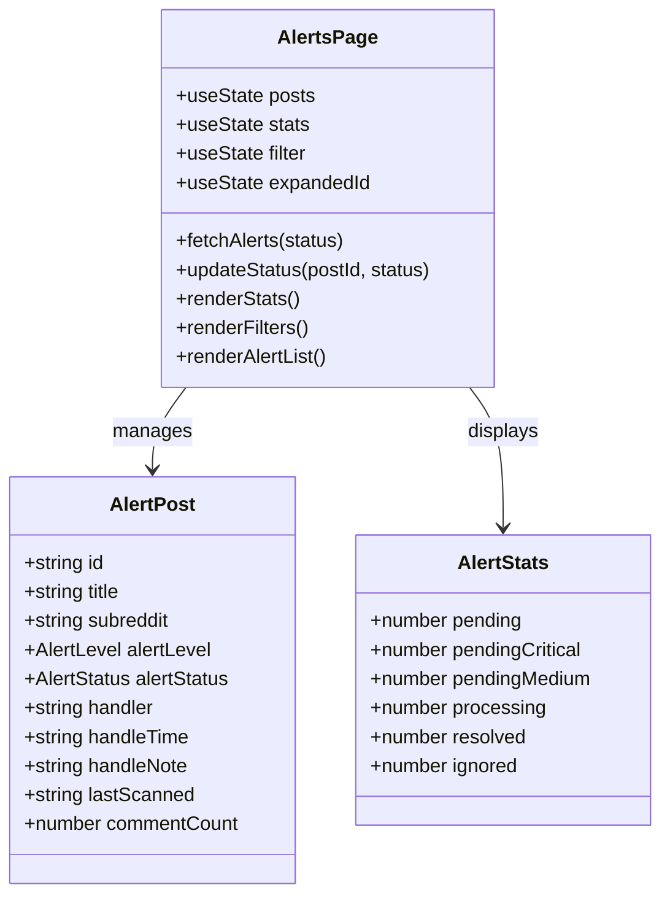

**图表来源**
- [alerts-page.tsx:5-25](file://src/app/alerts/alerts-page.tsx#L5-L25)
- [alerts-page.tsx:39-73](file://src/app/alerts/alerts-page.tsx#L39-L73)

#### 数据流序列图

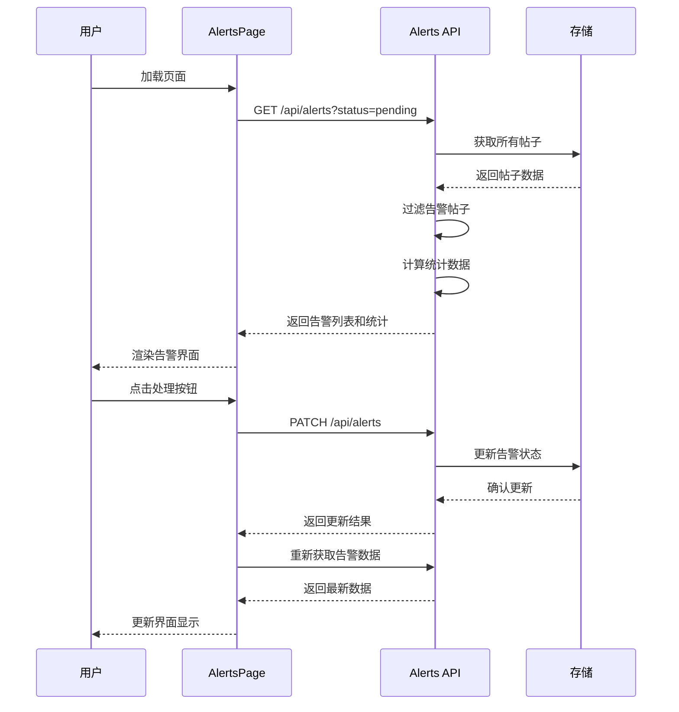

**图表来源**
- [alerts-page.tsx:47-73](file://src/app/alerts/alerts-page.tsx#L47-L73)
- [route.ts:37-61](file://src/app/api/alerts/route.ts#L37-L61)

**章节来源**
- [alerts-page.tsx:1-220](file://src/app/alerts/alerts-page.tsx#L1-L220)
- [page.tsx:1-14](file://src/app/alerts/page.tsx#L1-L14)

### 告警API服务

告警API服务提供了完整的RESTful接口，支持告警数据的CRUD操作：

#### API接口设计

| 方法 | 端点 | 功能 | 请求体 | 响应 |
|------|------|------|--------|------|
| GET | `/api/alerts` | 获取告警列表 | 查询参数: status | 告警数组 + 统计数据 |
| PATCH | `/api/alerts` | 更新告警状态 | postId, alertStatus, handler, handleNote | 更新后的告警对象 |

#### 状态更新流程

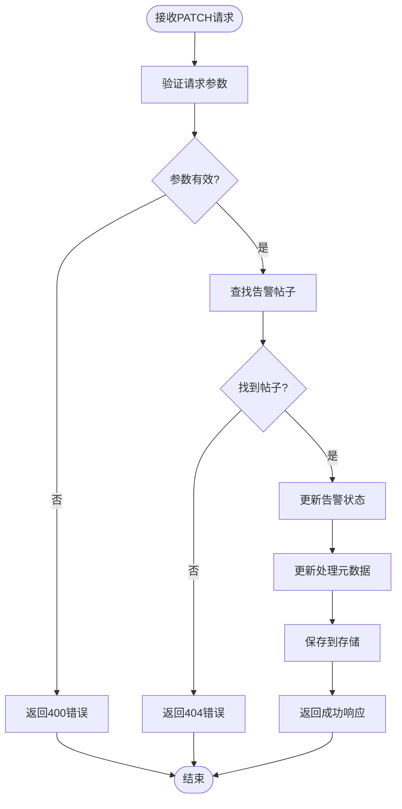

**图表来源**
- [route.ts:37-61](file://src/app/api/alerts/route.ts#L37-L61)

**章节来源**
- [route.ts:1-62](file://src/app/api/alerts/route.ts#L1-L62)

### 通知系统集成

系统集成了飞书通知功能，支持自动化的告警推送：

#### 通知配置管理

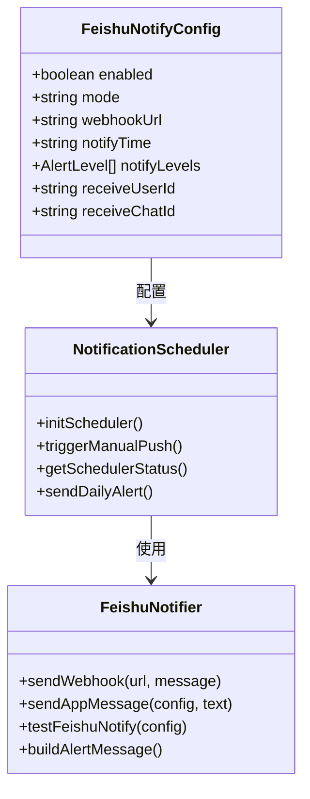

**图表来源**
- [types.ts:127-136](file://src/lib/types.ts#L127-L136)
- [route.ts:16-46](file://src/app/api/notify/route.ts#L16-L46)

#### 通知发送流程

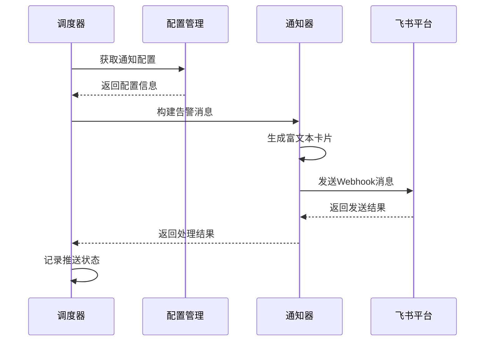

**图表来源**
- [feishu-notify.ts:416-437](file://src/lib/feishu-notify.ts#L416-L437)
- [route.ts:107-118](file://src/app/api/notify/route.ts#L107-L118)

**章节来源**
- [route.ts:1-118](file://src/app/api/notify/route.ts#L1-L118)
- [feishu-notify.ts:393-465](file://src/lib/feishu-notify.ts#L393-L465)

### 检测规则配置

系统提供了灵活的检测规则配置功能，支持多种告警触发条件：

#### 规则类型定义

| 规则类型 | 描述 | 默认启用 |
|----------|------|----------|
| 品牌攻击 | 检测针对品牌的恶意攻击评论 | ✅ 是 |
| 产品差评 | 检测极端负面的产品评价 | ✅ 是 |
| 负面情绪 | 检测表达强烈不满的评论 | ✅ 是 |
| 号召抵制 | 检测号召他人抵制品牌的评论 | ✅ 是 |
| 竞品推荐 | 检测推荐竞品并贬低品牌的评论 | ✅ 是 |

#### 规则配置流程

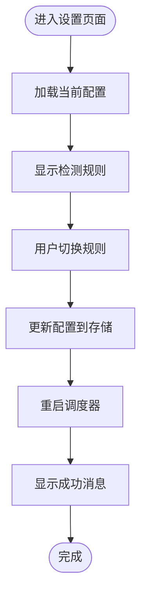

**图表来源**
- [route.ts:25-48](file://src/app/api/detection-rules/route.ts#L25-L48)
- [settings-page.tsx:1398-1413](file://src/app/settings/settings-page.tsx#L1398-L1413)

**章节来源**
- [route.ts:1-48](file://src/app/api/detection-rules/route.ts#L1-L48)
- [settings-page.tsx:1398-1413](file://src/app/settings/settings-page.tsx#L1398-L1413)

## 依赖关系分析

### 核心依赖关系

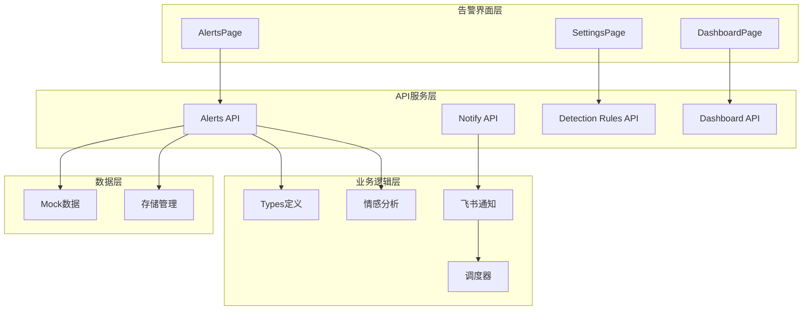

**图表来源**
- [types.ts:1-194](file://src/lib/types.ts#L1-L194)
- [sentiment.ts:153-185](file://src/lib/sentiment.ts#L153-L185)

### 数据流依赖

系统中的数据流向呈现清晰的单向依赖关系：

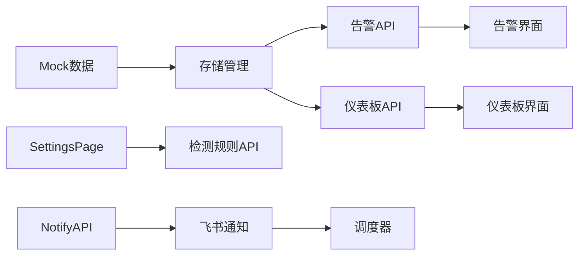

**图表来源**
- [mock-data.ts:1-245](file://src/lib/mock-data.ts#L1-L245)
- [route.ts:4-34](file://src/app/api/alerts/route.ts#L4-L34)

**章节来源**
- [types.ts:1-194](file://src/lib/types.ts#L1-L194)
- [mock-data.ts:1-245](file://src/lib/mock-data.ts#L1-L245)

## 性能考虑

### 前端性能优化

1. **组件懒加载**: 使用React Suspense实现组件的按需加载
2. **状态管理**: 采用useState和useEffect进行高效的状态更新
3. **虚拟滚动**: 对于大量告警数据，建议实现虚拟滚动以提升渲染性能
4. **缓存策略**: API响应数据应实现适当的缓存机制

### 后端性能优化

1. **数据库查询优化**: 使用索引和适当的查询条件减少查询时间
2. **批量操作**: 支持批量更新告警状态以减少API调用次数
3. **异步处理**: 通知发送采用异步队列处理，避免阻塞主流程
4. **资源限制**: 实现合理的超时和重试机制

## 故障排除指南

### 常见问题及解决方案

#### 告警数据不显示

**症状**: 告警列表为空白

**可能原因**:
1. 缺少lastScanned字段的数据
2. alertLevel不在允许范围内
3. API请求失败

**解决步骤**:
1. 检查数据源是否包含有效的lastScanned字段
2. 验证alertLevel值是否为critical或medium
3. 查看浏览器开发者工具中的网络请求

#### 状态更新失败

**症状**: 点击处理按钮后状态未更新

**可能原因**:
1. postId参数缺失
2. 告警不存在
3. 存储写入失败

**解决步骤**:
1. 确认请求中包含正确的postId
2. 检查数据库中是否存在该告警
3. 查看服务器日志获取详细错误信息

#### 通知发送失败

**症状**: 飞书通知未收到

**可能原因**:
1. Webhook URL配置错误
2. 飞书应用凭证缺失
3. 网络连接问题

**解决步骤**:
1. 测试Webhook连接有效性
2. 验证飞书应用凭证配置
3. 检查网络防火墙设置

**章节来源**
- [route.ts:41-49](file://src/app/api/alerts/route.ts#L41-L49)
- [feishu-notify.ts:440-465](file://src/lib/feishu-notify.ts#L440-L465)

## 结论

告警监控界面是一个功能完整、架构清晰的品牌声誉监控系统。系统通过合理的分层设计和模块化组织，实现了告警事件的全生命周期管理。

### 主要优势

1. **完整的告警管理**: 支持从发现到处理的完整流程
2. **灵活的通知机制**: 集成多种通知渠道，支持自定义配置
3. **强大的分析能力**: 提供趋势分析和根因分析工具
4. **良好的用户体验**: 直观的界面设计和响应式交互

### 技术亮点

1. **智能告警分类**: 基于影响力得分的自动化分级系统
2. **实时状态更新**: 支持快速的状态变更和追踪
3. **可扩展的架构**: 模块化设计便于功能扩展
4. **完善的错误处理**: 全面的异常处理和故障恢复机制

该系统为品牌声誉管理提供了强有力的技术支撑，能够帮助用户及时发现和处理潜在的品牌风险。