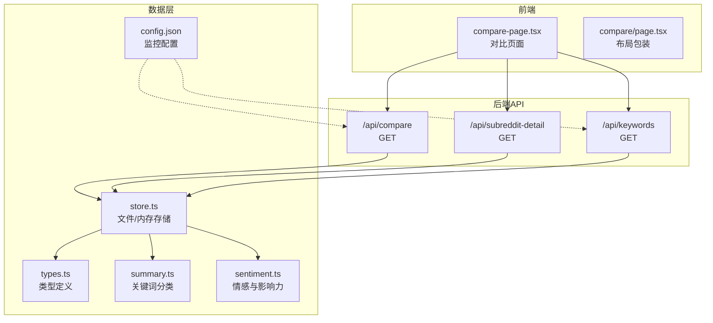
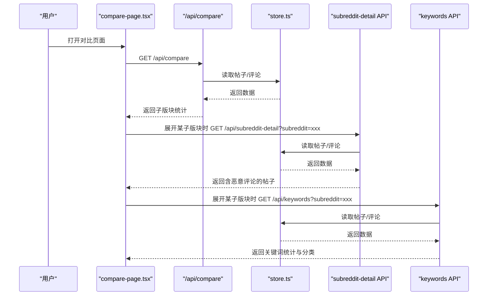
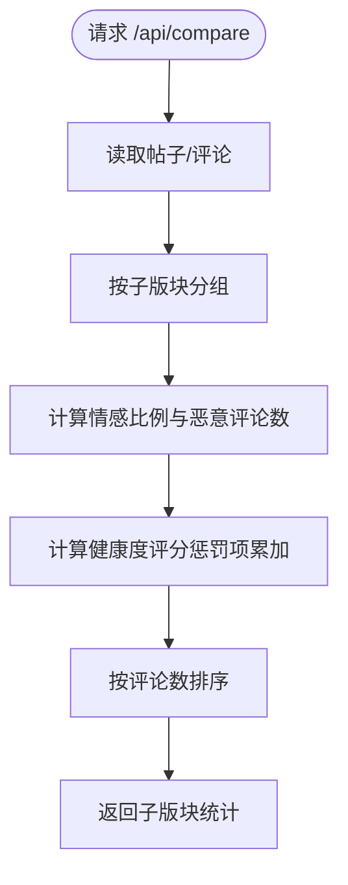
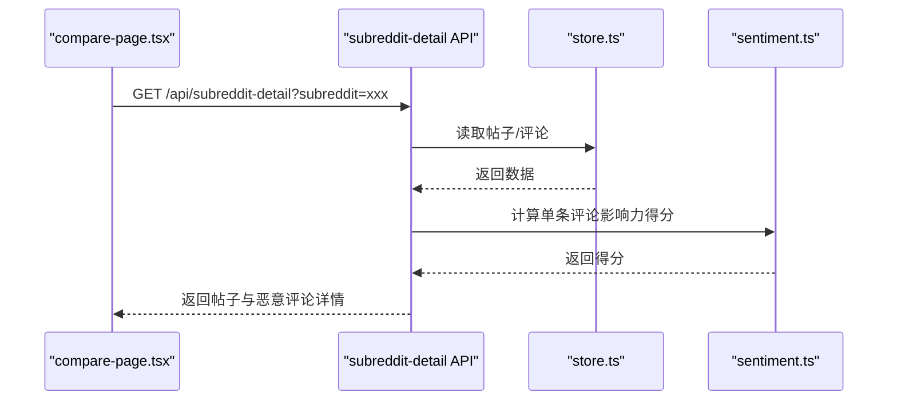
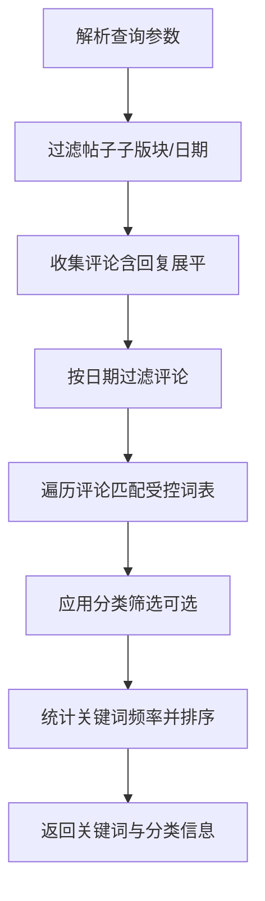
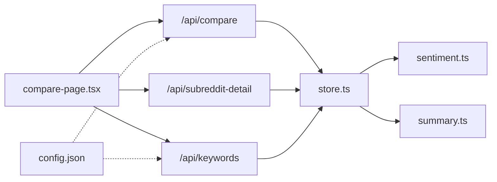

# 对比分析界面

<cite>
**本文引用的文件**
- [compare-page.tsx](file://src/app/compare/compare-page.tsx)
- [compare-page.tsx（布局包装）](file://src/app/compare/page.tsx)
- [compare/route.ts](file://src/app/api/compare/route.ts)
- [subreddit-detail/route.ts](file://src/app/api/subreddit-detail/route.ts)
- [keywords/route.ts](file://src/app/api/keywords/route.ts)
- [types.ts](file://src/lib/types.ts)
- [store.ts](file://src/lib/store.ts)
- [sentiment.ts](file://src/lib/sentiment.ts)
- [summary.ts](file://src/lib/summary.ts)
- [config.json](file://data/config.json)
</cite>

## 目录
1. [简介](#简介)
2. [项目结构](#项目结构)
3. [核心组件](#核心组件)
4. [架构概览](#架构概览)
5. [详细组件分析](#详细组件分析)
6. [依赖关系分析](#依赖关系分析)
7. [性能考量](#性能考量)
8. [故障排查指南](#故障排查指南)
9. [结论](#结论)
10. [附录](#附录)

## 简介
本文件面向“对比分析界面”的实现与使用，聚焦多维度数据对比、图表可视化、统计分析与交互式展示。内容涵盖：
- 对比对象选择（按子版块）、时间范围设置（帖子/评论时间过滤）、指标权重配置（情感阈值、规则开关）
- 差异分析算法（健康度评分、影响力得分、恶意类型分布）
- 显著性检验与趋势对比工具（基于关键词分类与趋势数据）
- 交互式图表（柱状图、雷达图、词云/关键词列表）、动态数据更新与实时预览
- 数据标准化处理（情感评分、影响力压缩）、异常值检测（恶意评论识别）、结果解释机制（告警等级映射）

## 项目结构
对比分析界面位于前端路由与API之间，采用前后端分离的数据流设计：
- 前端页面负责渲染卡片、图表与交互控件
- 后端API负责聚合与统计，返回标准化数据
- 数据存储层提供帖子、评论、扫描报告与配置

**图表来源**
- [compare-page.tsx:45-347](file://src/app/compare/compare-page.tsx#L45-L347)
- [compare-page.tsx（布局包装）:1-14](file://src/app/compare/page.tsx#L1-L14)
- [compare/route.ts:1-68](file://src/app/api/compare/route.ts#L1-L68)
- [subreddit-detail/route.ts:1-63](file://src/app/api/subreddit-detail/route.ts#L1-L63)
- [keywords/route.ts:1-156](file://src/app/api/keywords/route.ts#L1-L156)
- [store.ts:1-285](file://src/lib/store.ts#L1-L285)
- [types.ts:1-194](file://src/lib/types.ts#L1-L194)
- [summary.ts:1-269](file://src/lib/summary.ts#L1-L269)
- [sentiment.ts:1-398](file://src/lib/sentiment.ts#L1-L398)
- [config.json:1-57](file://data/config.json#L1-L57)

**章节来源**
- [compare-page.tsx:45-347](file://src/app/compare/compare-page.tsx#L45-L347)
- [compare-page.tsx（布局包装）:1-14](file://src/app/compare/page.tsx#L1-L14)

## 核心组件
- 对比页面组件：负责渲染子版块卡片、健康度条、情感分布柱状图与雷达图，并支持展开查看帖子与恶意评论详情。
- 对比API：聚合各子版块的帖子与评论，计算情感比例、健康度评分与恶意评论数量。
- 子版块详情API：按子版块筛选帖子，提取含恶意评论的帖子并计算影响力得分，返回恶意评论明细。
- 关键词API：支持按子版块、日期范围、关键词分类筛选，统计受控词表下的关键词频率与分类分布。

**章节来源**
- [compare-page.tsx:45-347](file://src/app/compare/compare-page.tsx#L45-L347)
- [compare/route.ts:1-68](file://src/app/api/compare/route.ts#L1-L68)
- [subreddit-detail/route.ts:1-63](file://src/app/api/subreddit-detail/route.ts#L1-L63)
- [keywords/route.ts:1-156](file://src/app/api/keywords/route.ts#L1-L156)

## 架构概览
对比分析界面的数据流如下：

**图表来源**
- [compare-page.tsx:52-88](file://src/app/compare/compare-page.tsx#L52-L88)
- [compare/route.ts:4-67](file://src/app/api/compare/route.ts#L4-L67)
- [subreddit-detail/route.ts:5-61](file://src/app/api/subreddit-detail/route.ts#L5-L61)
- [keywords/route.ts:5-155](file://src/app/api/keywords/route.ts#L5-L155)
- [store.ts:89-142](file://src/lib/store.ts#L89-L142)

## 详细组件分析

### 对比页面组件（compare-page.tsx）
- 数据结构
  - 子版块统计：包含子版块名称、帖子总数、评论总数、正面/中性/负面比例、健康度评分等。
  - 帖子列表：包含标题、URL、告警等级、评论数、恶意评论数、总影响力得分及恶意评论明细。
  - 关键词统计：按出现次数排序的关键词及其分类。
- 图表与展示
  - 柱状图：按子版块展示正面/中性/负面比例。
  - 雷达图：选取前五高风险子版块，叠加活跃度与健康度等指标。
  - 卡片式布局：点击展开查看帖子与关键词详情。
- 交互逻辑
  - 点击子版块卡片展开/收起，触发详情API调用。
  - 展开时加载帖子与关键词数据，支持懒加载与加载状态提示。
- 颜色与等级
  - 健康度颜色随分数分级（绿/黄/橙/红）。
  - 告警等级映射为中文标签（严重/高危/中等/安全）。

**章节来源**
- [compare-page.tsx:7-347](file://src/app/compare/compare-page.tsx#L7-L347)

### 对比API（/api/compare）
- 输入：无查询参数（可扩展为时间范围、子版块过滤）。
- 处理：
  - 按子版块分组帖子与评论。
  - 统计正面/中性/负面比例与恶意评论占比。
  - 健康度评分综合考虑帖子告警等级与恶意评论比例，采用惩罚项累加并限制范围。
- 输出：子版块数组，包含统计指标与健康度评分。

**图表来源**
- [compare/route.ts:4-67](file://src/app/api/compare/route.ts#L4-L67)

**章节来源**
- [compare/route.ts:1-68](file://src/app/api/compare/route.ts#L1-L68)

### 子版块详情API（/api/subreddit-detail）
- 查询参数：subreddit（必填）。
- 处理：
  - 筛选指定子版块的帖子。
  - 提取含恶意评论的帖子，计算恶意评论影响力得分总和。
  - 对帖子按影响力得分降序排序。
- 输出：帖子数组，包含标题、URL、告警等级、评论数、恶意评论数、总影响力得分与恶意评论明细。

**图表来源**
- [subreddit-detail/route.ts:5-61](file://src/app/api/subreddit-detail/route.ts#L5-L61)
- [sentiment.ts:267-270](file://src/lib/sentiment.ts#L267-L270)

**章节来源**
- [subreddit-detail/route.ts:1-63](file://src/app/api/subreddit-detail/route.ts#L1-L63)
- [sentiment.ts:261-315](file://src/lib/sentiment.ts#L261-L315)

### 关键词API（/api/keywords）
- 查询参数：subreddit、keyword、commentDateFrom、commentDateTo、postDateFrom、postDateTo、brandKeywords、sceneKeywords、modelKeywords、qualityKeywords、keyword。
- 处理：
  - 基于帖子/评论时间范围与子版块过滤。
  - 使用受控词表进行关键词匹配与计数，支持分类筛选。
  - 动态生成分类信息（仅包含实际出现的关键词类别）。
- 输出：关键词数组、总类目数、可用子版块列表与动态分类信息。

**图表来源**
- [keywords/route.ts:5-155](file://src/app/api/keywords/route.ts#L5-L155)
- [summary.ts:6-119](file://src/lib/summary.ts#L6-L119)

**章节来源**
- [keywords/route.ts:1-156](file://src/app/api/keywords/route.ts#L1-L156)
- [summary.ts:1-269](file://src/lib/summary.ts#L1-L269)

### 数据模型与类型
- 核心类型：RedditPost、RedditComment、ScanResult、DailyScanReport、SubredditStats、AlertLevel、DetectionRules 等。
- 类型约束：告警等级兼容映射（high→critical，low→safe），情感分数范围[-1,1]，影响力得分由点赞数与情感强度共同决定。

**章节来源**
- [types.ts:1-194](file://src/lib/types.ts#L1-L194)

### 数据存储与配置
- 存储：本地文件持久化（开发环境）与内存缓存（生产环境），提供帖子、评论、扫描结果、日报与配置的读写接口。
- 配置：包含关键词列表、情感阈值、检测规则开关、通知配置等，影响情感分析与告警判定。

**章节来源**
- [store.ts:1-285](file://src/lib/store.ts#L1-L285)
- [config.json:1-57](file://data/config.json#L1-L57)

## 依赖关系分析
- 前端组件依赖后端API返回的标准化数据，图表库负责可视化渲染。
- 后端API依赖数据存储层与分析模块（情感分析、关键词分类）。
- 关键词API依赖受控词表与分类映射，输出动态分类信息。
- 配置文件影响情感阈值与规则开关，间接影响健康度评分与告警等级。

**图表来源**
- [compare-page.tsx:45-88](file://src/app/compare/compare-page.tsx#L45-L88)
- [compare/route.ts:4-67](file://src/app/api/compare/route.ts#L4-L67)
- [subreddit-detail/route.ts:5-61](file://src/app/api/subreddit-detail/route.ts#L5-L61)
- [keywords/route.ts:5-155](file://src/app/api/keywords/route.ts#L5-L155)
- [store.ts:89-142](file://src/lib/store.ts#L89-L142)
- [sentiment.ts:261-315](file://src/lib/sentiment.ts#L261-L315)
- [summary.ts:6-119](file://src/lib/summary.ts#L6-L119)
- [config.json:26-57](file://data/config.json#L26-L57)

**章节来源**
- [compare-page.tsx:45-88](file://src/app/compare/compare-page.tsx#L45-L88)
- [compare/route.ts:1-68](file://src/app/api/compare/route.ts#L1-L68)
- [subreddit-detail/route.ts:1-63](file://src/app/api/subreddit-detail/route.ts#L1-L63)
- [keywords/route.ts:1-156](file://src/app/api/keywords/route.ts#L1-L156)
- [store.ts:1-285](file://src/lib/store.ts#L1-L285)
- [sentiment.ts:1-398](file://src/lib/sentiment.ts#L1-L398)
- [summary.ts:1-269](file://src/lib/summary.ts#L1-L269)
- [config.json:1-57](file://data/config.json#L1-L57)

## 性能考量
- 缓存策略：数据存储层对JSON文件读取进行内存缓存（默认30秒TTL），减少频繁I/O。
- 图表渲染：前端使用响应式容器与轻量图表库，建议在大数据量时启用虚拟滚动与分页。
- API优化：关键词统计与情感分析可在服务端进行批量处理，避免重复计算。
- 并发控制：展开子版块时并发发起帖子与关键词请求，注意前端加载状态与错误处理。

[本节为通用性能建议，无需特定文件引用]

## 故障排查指南
- 无数据或空白卡片
  - 检查数据文件是否存在与格式是否正确（开发环境）。
  - 确认API返回的子版块统计是否为空。
- 展开无内容
  - 确认子版块详情API与关键词API的查询参数（subreddit）是否正确传递。
  - 检查恶意评论筛选条件与影响力得分计算逻辑。
- 健康度评分异常
  - 检查告警等级与恶意评论比例的惩罚项是否符合预期。
  - 确认情感阈值与检测规则开关是否影响了评分。
- 图表显示异常
  - 检查数据字段命名与图表映射（如雷达图维度）。
  - 确认响应式容器尺寸与数据长度。

**章节来源**
- [compare-page.tsx:52-88](file://src/app/compare/compare-page.tsx#L52-L88)
- [compare/route.ts:4-67](file://src/app/api/compare/route.ts#L4-L67)
- [subreddit-detail/route.ts:5-61](file://src/app/api/subreddit-detail/route.ts#L5-L61)
- [keywords/route.ts:5-155](file://src/app/api/keywords/route.ts#L5-L155)
- [store.ts:89-142](file://src/lib/store.ts#L89-L142)
- [sentiment.ts:261-315](file://src/lib/sentiment.ts#L261-L315)

## 结论
对比分析界面通过清晰的前后端职责划分，实现了多维度数据对比与可视化展示。其核心能力包括：
- 健康度评分与情感分布的直观呈现
- 恶意评论的影响力聚合与明细展示
- 关键词分类统计与动态筛选
- 可扩展的时间范围与规则配置入口

建议后续增强：
- 时间范围参数化（支持自定义开始/结束日期）
- 指标权重配置（情感阈值、规则权重、惩罚系数）
- 显著性检验与趋势对比（基于关键词趋势与情感趋势）
- 实时预览与增量更新（WebSocket或轮询）

[本节为总结性内容，无需特定文件引用]

## 附录

### 实际使用场景与分析方法论
- 场景一：品牌声誉监控
  - 选择目标子版块，观察健康度变化与负面情感比例，结合关键词分类定位问题领域（如画质、对比度、产品故障）。
- 场景二：竞品对比
  - 同时对比多个子版块的健康度与情感分布，识别竞品在不同场景下的口碑差异。
- 场景三：趋势分析
  - 结合关键词趋势与情感趋势，判断负面事件的传播路径与影响范围。
- 方法论要点
  - 数据标准化：情感分数归一化、影响力得分对数压缩。
  - 异常值检测：基于恶意评论数量与总影响力得分阈值。
  - 结果解释：告警等级与中文标签映射，便于非技术用户理解。

[本节为概念性说明，无需特定文件引用]