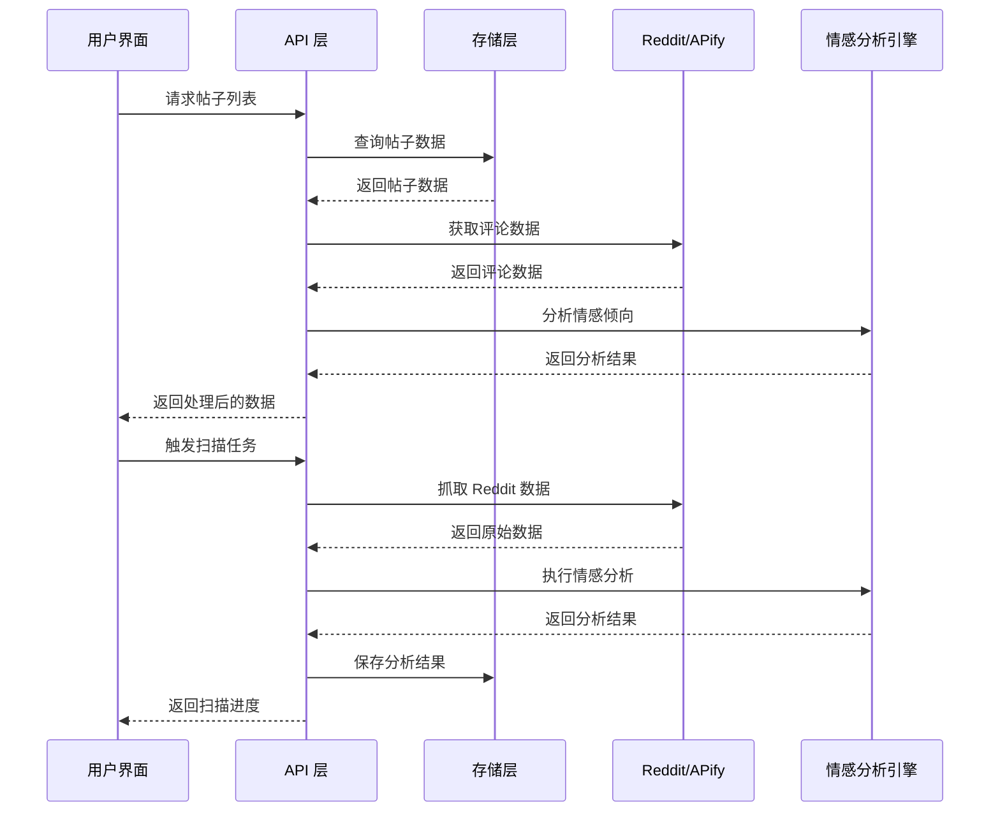
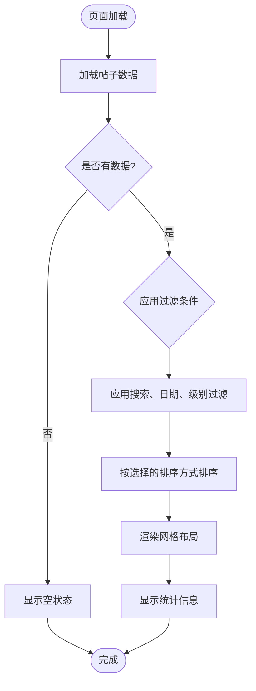
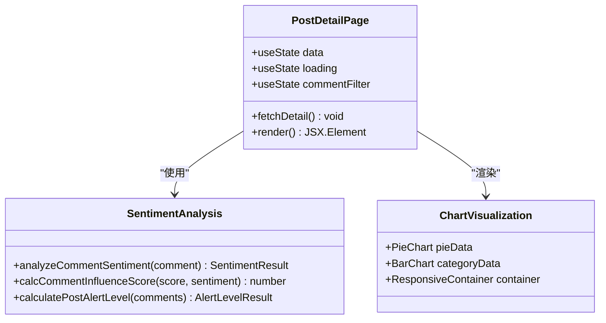
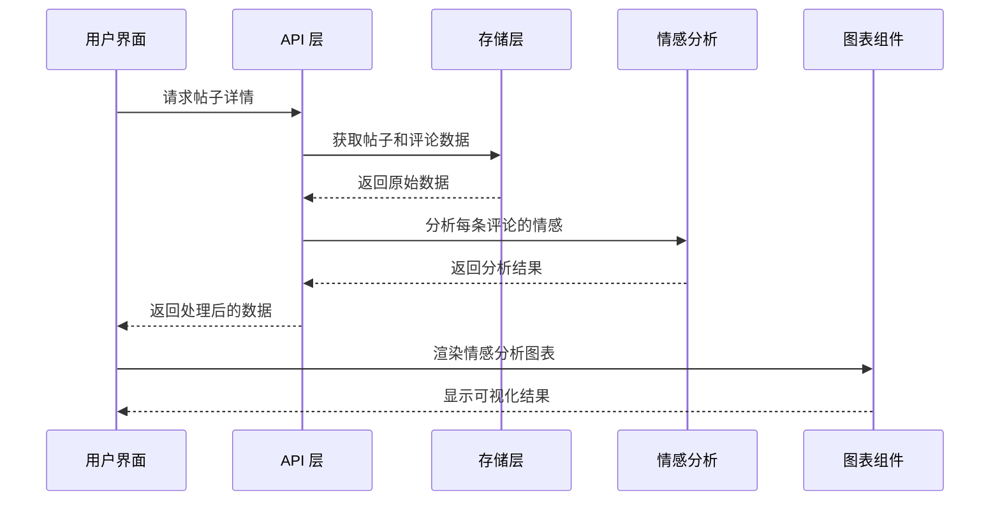
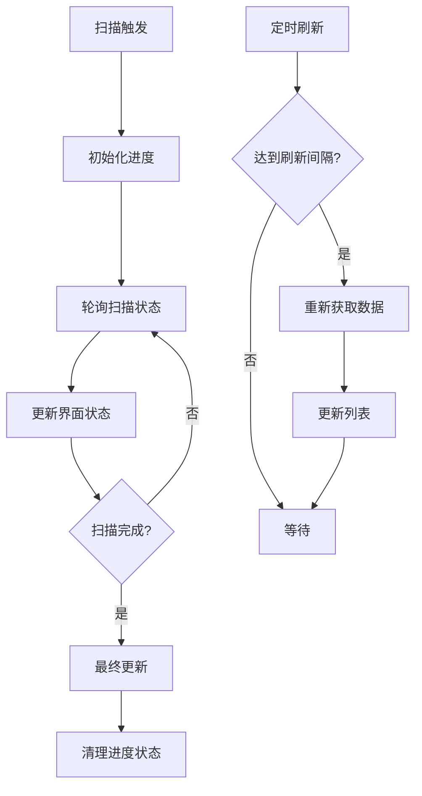

# 帖子管理界面

<cite>
**本文引用的文件**
- [src/app/posts/page.tsx](file://src/app/posts/page.tsx)
- [src/app/posts/posts-page.tsx](file://src/app/posts/posts-page.tsx)
- [src/app/posts/[id]/page.tsx](file://src/app/posts/[id]/page.tsx)
- [src/app/posts/[id]/detail-page.tsx](file://src/app/posts/[id]/detail-page.tsx)
- [src/app/api/posts/route.ts](file://src/app/api/posts/route.ts)
- [src/app/api/posts/[id]/route.ts](file://src/app/api/posts/[id]/route.ts)
- [src/app/api/scan/route.ts](file://src/app/api/scan/route.ts)
- [src/lib/reddit.ts](file://src/lib/reddit.ts)
- [src/lib/apify.ts](file://src/lib/apify.ts)
- [src/lib/sentiment.ts](file://src/lib/sentiment.ts)
- [src/lib/store.ts](file://src/lib/store.ts)
- [src/lib/types.ts](file://src/lib/types.ts)
- [src/lib/mock-data.ts](file://src/lib/mock-data.ts)
</cite>

## 目录
1. [简介](#简介)
2. [项目结构](#项目结构)
3. [核心组件](#核心组件)
4. [架构概览](#架构概览)
5. [详细组件分析](#详细组件分析)
6. [依赖关系分析](#依赖关系分析)
7. [性能考虑](#性能考虑)
8. [故障排除指南](#故障排除指南)
9. [结论](#结论)
10. [附录](#附录)

## 简介
帖子管理界面是一个基于 Next.js 的 React 应用，专门用于监控和管理 Reddit 上的品牌相关帖子。该系统提供了完整的帖子列表展示、详细分析、情感分析、搜索过滤、批量操作和实时更新等功能。界面采用现代化的设计，支持响应式布局，并提供了丰富的可视化图表来展示情感分析结果。

## 项目结构
项目采用 Next.js App Router 结构，主要分为以下几个部分：

```mermaid
graph TB
subgraph "客户端界面"
A[posts-page.tsx<br/>帖子列表页面]
B[detail-page.tsx<br/>帖子详情页面]
C[layout.tsx<br/>全局布局]
D[sidebar.tsx<br/>侧边栏导航]
end
subgraph "API 层"
E[posts/route.ts<br/>帖子列表 API]
F[posts/[id]/route.ts<br/>帖子详情 API]
G[scan/route.ts<br/>扫描控制 API]
end
subgraph "业务逻辑层"
H[reddit.ts<br/>Reddit 数据获取]
I[sentiment.ts<br/>情感分析引擎]
J[apify.ts<br/>Apify 集成]
K[store.ts<br/>数据存储]
end
subgraph "数据层"
L[types.ts<br/>类型定义]
M[mock-data.ts<br/>模拟数据]
N[本地文件存储<br/>posts.json, comments.json]
end
A --> E
B --> F
A --> G
E --> H
F --> H
G --> H
H --> J
H --> I
I --> K
K --> N
L --> H
L --> I
L --> K
```

**图表来源**
- [src/app/posts/posts-page.tsx:1-566](file://src/app/posts/posts-page.tsx#L1-L566)
- [src/app/posts/[id]/detail-page.tsx](file://src/app/posts/[id]/detail-page.tsx#L1-L313)
- [src/app/api/posts/route.ts:1-157](file://src/app/api/posts/route.ts#L1-L157)
- [src/app/api/posts/[id]/route.ts](file://src/app/api/posts/[id]/route.ts#L1-L98)
- [src/app/api/scan/route.ts:1-394](file://src/app/api/scan/route.ts#L1-L394)

**章节来源**
- [src/app/posts/page.tsx:1-14](file://src/app/posts/page.tsx#L1-L14)
- [src/app/posts/[id]/page.tsx](file://src/app/posts/[id]/page.tsx#L1-L14)

## 核心组件
帖子管理界面由多个核心组件构成，每个组件都有特定的功能职责：

### 帖子列表组件 (PostsPage)
帖子列表组件是整个界面的核心，负责展示所有监控中的帖子，并提供完整的交互功能：
- 实时帖子列表展示，支持网格布局
- 多维度搜索和过滤功能
- 排序机制（按影响力、预警等级、负面占比、发布时间、评论数）
- 批量操作（扫描全部、删除全部）
- 实时扫描进度监控
- 帖子状态可视化（颜色编码）

### 帖子详情组件 (PostDetailPage)
帖子详情组件提供深入的分析视图：
- 帖子基本信息展示
- 情感分析统计图表
- 评论列表展示和过滤
- 恶意评论识别和标注
- 影响力得分计算

### API 层组件
API 层提供了完整的数据访问接口：
- 帖子列表查询和过滤
- 帖子详情获取
- 扫描任务控制
- 数据持久化

**章节来源**
- [src/app/posts/posts-page.tsx:50-566](file://src/app/posts/posts-page.tsx#L50-L566)
- [src/app/posts/[id]/detail-page.tsx](file://src/app/posts/[id]/detail-page.tsx#L31-L313)

## 架构概览
系统采用分层架构设计，确保了良好的可维护性和扩展性：



**图表来源**
- [src/app/api/posts/route.ts:13-127](file://src/app/api/posts/route.ts#L13-L127)
- [src/app/api/scan/route.ts:21-379](file://src/app/api/scan/route.ts#L21-L379)
- [src/lib/reddit.ts:10-56](file://src/lib/reddit.ts#L10-L56)

系统架构的关键特点：
- **异步数据流**：所有数据获取都是异步的，避免阻塞用户界面
- **缓存策略**：实现了多层次缓存（内存缓存、文件缓存、浏览器缓存）
- **错误处理**：完善的错误处理和降级机制
- **实时更新**：支持扫描进度的实时监控

## 详细组件分析

### 帖子列表展示逻辑
帖子列表采用响应式网格布局，支持不同屏幕尺寸的自适应显示：



**图表来源**
- [src/app/posts/posts-page.tsx:69-91](file://src/app/posts/posts-page.tsx#L69-L91)
- [src/app/api/posts/route.ts:68-103](file://src/app/api/posts/route.ts#L68-L103)

帖子列表的关键特性：
- **颜色编码系统**：根据预警级别使用不同的颜色主题
- **状态徽章**：显示帖子的扫描状态和预警级别
- **摘要信息**：显示评论数量、恶意评论数量、发布时间等关键指标
- **快速操作**：支持单个帖子扫描和删除操作

**章节来源**
- [src/app/posts/posts-page.tsx:464-561](file://src/app/posts/posts-page.tsx#L464-L561)

### 分页机制和排序功能
系统实现了灵活的分页和排序机制：

#### 排序选项
- **按影响力得分**：基于恶意评论的影响力综合计算
- **按预警等级**：严重 > 高 > 中等 > 低 > 安全
- **按负面占比**：恶意评论占总评论的比例
- **按发布时间**：最新的帖子优先
- **按评论数**：评论数量最多的帖子优先

#### 过滤机制
- **级别过滤**：支持按预警级别过滤（严重、中等、安全）
- **日期范围过滤**：支持自定义日期范围
- **快速日期过滤**：支持近7天、近30天、近90天的快速筛选
- **搜索功能**：支持标题、子版块、URL的全文搜索

**章节来源**
- [src/app/posts/posts-page.tsx:28-48](file://src/app/posts/posts-page.tsx#L28-L48)
- [src/app/api/posts/route.ts:78-103](file://src/app/api/posts/route.ts#L78-L103)

### 帖子详情页面实现
帖子详情页面提供了全面的分析视图：



**图表来源**
- [src/app/posts/[id]/detail-page.tsx](file://src/app/posts/[id]/detail-page.tsx#L31-L313)
- [src/lib/sentiment.ts:150-244](file://src/lib/sentiment.ts#L150-L244)

帖子详情页面的核心功能：
- **情感分析图表**：使用饼图展示正面、中性、负面情感分布
- **恶意类型分析**：使用柱状图展示不同类型恶意内容的数量
- **评论过滤**：支持按全部、仅恶意、仅安全三种模式过滤
- **影响力计算**：为恶意评论计算影响力得分

**章节来源**
- [src/app/posts/[id]/detail-page.tsx](file://src/app/posts/[id]/detail-page.tsx#L77-L98)

### 评论加载和情感分析展示
评论系统实现了完整的加载和分析流程：



**图表来源**
- [src/app/api/posts/[id]/route.ts](file://src/app/api/posts/[id]/route.ts#L30-L97)
- [src/lib/sentiment.ts:261-270](file://src/lib/sentiment.ts#L261-L270)

情感分析的关键特性：
- **关键词匹配**：基于预定义的关键词库进行情感识别
- **规则引擎**：支持多种恶意内容类型的检测规则
- **影响力计算**：结合点赞数和情感得分计算影响力
- **可视化展示**：提供直观的情感分布图表

**章节来源**
- [src/app/api/posts/[id]/route.ts](file://src/app/api/posts/[id]/route.ts#L56-L93)

### 搜索过滤功能
搜索过滤功能提供了多维度的数据检索能力：

#### 搜索字段
- **帖子标题**：支持模糊匹配
- **子版块名称**：支持子版块过滤
- **Reddit URL**：支持通过URL精确匹配

#### 过滤条件
- **预警级别**：严重、高、中等、低、安全
- **日期范围**：支持自定义起止日期
- **子版块**：支持按子版块过滤
- **快速日期**：近7天、近30天、近90天

**章节来源**
- [src/app/api/posts/route.ts:68-76](file://src/app/api/posts/route.ts#L68-L76)

### 批量操作和状态管理
系统提供了完整的批量操作功能：

#### 批量操作
- **扫描全部帖子**：触发全量扫描任务
- **删除全部帖子**：批量删除所有帖子及其相关数据
- **单个帖子操作**：支持扫描单个帖子和删除单个帖子

#### 状态管理
- **扫描状态**：实时显示扫描进度和状态
- **加载状态**：处理数据加载过程中的状态反馈
- **错误状态**：优雅处理各种异常情况

**章节来源**
- [src/app/posts/posts-page.tsx:162-214](file://src/app/posts/posts-page.tsx#L162-L214)

### 实时更新机制
系统实现了多种实时更新机制：



**图表来源**
- [src/app/posts/posts-page.tsx:107-135](file://src/app/posts/posts-page.tsx#L107-L135)
- [src/app/api/scan/route.ts:381-383](file://src/app/api/scan/route.ts#L381-L383)

实时更新的关键特性：
- **轮询机制**：定期检查扫描进度
- **状态同步**：保持界面状态与后台任务同步
- **自动刷新**：扫描完成后自动刷新数据

**章节来源**
- [src/app/posts/posts-page.tsx:93-135](file://src/app/posts/posts-page.tsx#L93-L135)

### 缓存策略和性能优化
系统采用了多层次的缓存策略来优化性能：

#### 缓存层次
- **内存缓存**：Vercel 环境下的内存存储
- **文件缓存**：本地开发环境的文件存储
- **Apify 缓存**：Reddit 数据的短期缓存
- **浏览器缓存**：前端组件的状态缓存

#### 性能优化措施
- **数据预计算**：在服务端预计算影响力得分
- **懒加载**：评论列表的懒加载实现
- **防抖处理**：搜索输入的防抖优化
- **虚拟滚动**：大量数据的虚拟滚动支持

**章节来源**
- [src/lib/store.ts:61-87](file://src/lib/store.ts#L61-L87)
- [src/lib/apify.ts:11-35](file://src/lib/apify.ts#L11-L35)

## 依赖关系分析

```mermaid
graph LR
subgraph "界面层"
A[PostsPage]
B[PostDetailPage]
end
subgraph "API 层"
C[posts/route.ts]
D[posts/[id]/route.ts]
E[scan/route.ts]
end
subgraph "业务逻辑层"
F[reddit.ts]
G[sentiment.ts]
H[apify.ts]
I[store.ts]
end
subgraph "数据层"
J[types.ts]
K[mock-data.ts]
L[本地文件]
end
A --> C
B --> D
A --> E
C --> F
D --> F
E --> F
F --> H
F --> G
G --> I
I --> L
J --> F
J --> G
J --> I
```

**图表来源**
- [src/app/posts/posts-page.tsx:1-14](file://src/app/posts/posts-page.tsx#L1-L14)
- [src/app/posts/[id]/detail-page.tsx](file://src/app/posts/[id]/detail-page.tsx#L1-L14)
- [src/lib/reddit.ts:1-94](file://src/lib/reddit.ts#L1-L94)

系统的主要依赖关系：
- **界面层**：负责用户交互和数据展示
- **API 层**：提供数据访问接口
- **业务逻辑层**：实现核心业务逻辑
- **数据层**：管理数据存储和持久化

**章节来源**
- [src/lib/types.ts:1-194](file://src/lib/types.ts#L1-L194)

## 性能考虑
系统在设计时充分考虑了性能优化：

### 数据加载优化
- **服务端预计算**：在服务端计算复杂的统计数据
- **批量数据获取**：减少网络请求次数
- **智能缓存**：避免重复的数据获取

### 前端性能优化
- **React.memo**：使用记忆化优化组件渲染
- **虚拟滚动**：大数据量时使用虚拟滚动
- **懒加载**：图片和重资源的懒加载

### 网络优化
- **请求去重**：避免重复的相同请求
- **超时控制**：合理的请求超时设置
- **错误重试**：失败请求的智能重试机制

## 故障排除指南

### 常见问题及解决方案

#### 扫描功能异常
**问题**：扫描任务无法正常执行
**原因**：
- Apify Token 未配置
- Reddit API 限制
- 网络连接问题

**解决方案**：
1. 检查环境变量 `APIFY_TOKEN` 是否正确配置
2. 确认网络连接正常
3. 查看扫描进度接口 `/api/scan` 的状态

#### 数据加载缓慢
**问题**：帖子列表加载速度慢
**原因**：
- 数据量过大
- 网络延迟
- 缓存未命中

**解决方案**：
1. 使用过滤器缩小数据范围
2. 检查网络连接质量
3. 清除浏览器缓存

#### 情感分析不准确
**问题**：情感分析结果与预期不符
**原因**：
- 关键词规则配置不当
- LLM 模型配置错误
- 数据质量问题

**解决方案**：
1. 调整检测规则配置
2. 检查 LLM API 密钥配置
3. 验证输入数据的质量

**章节来源**
- [src/app/api/scan/route.ts:386-393](file://src/app/api/scan/route.ts#L386-L393)
- [src/lib/apify.ts:54-66](file://src/lib/apify.ts#L54-L66)

### 调试工具
系统提供了多种调试工具来帮助问题诊断：

#### 开发者工具
- **浏览器开发者工具**：监控网络请求和性能
- **React DevTools**：检查组件状态和渲染
- **Console 日志**：查看详细的错误信息

#### API 测试
- **curl 命令**：直接测试 API 接口
- **Postman**：图形化 API 测试工具
- **Swagger 文档**：API 接口文档

## 结论
帖子管理界面是一个功能完整、架构清晰的现代化 Web 应用。它成功地整合了 Reddit 数据获取、情感分析、可视化展示和用户交互等多个方面，为品牌监控提供了强大的技术支持。

系统的亮点包括：
- **完整的功能覆盖**：从数据获取到分析展示的一体化解决方案
- **优秀的用户体验**：响应式设计和直观的操作界面
- **强大的技术架构**：分层设计和多层缓存策略
- **完善的错误处理**：健壮的异常处理和降级机制

未来可以考虑的改进方向：
- 增加更多可视化图表类型
- 优化移动端用户体验
- 添加更多自定义过滤选项
- 实现更精细的权限控制

## 附录

### API 接口说明

#### 帖子列表 API
- **GET** `/api/posts`：获取帖子列表
- **DELETE** `/api/posts`：删除帖子

#### 帖子详情 API
- **GET** `/api/posts/[id]`：获取帖子详情

#### 扫描控制 API
- **POST** `/api/scan`：启动扫描任务
- **GET** `/api/scan`：获取扫描进度
- **DELETE** `/api/scan`：停止扫描任务

### 配置选项
系统支持多种配置选项来满足不同的使用需求：
- **检测规则**：可配置的恶意内容检测规则
- **情感阈值**：情感分析的敏感度设置
- **扫描频率**：自动扫描的时间间隔
- **通知设置**：告警通知的配置选项

### 用户指南
- **基本操作**：浏览帖子、查看详情、执行扫描
- **高级功能**：批量操作、自定义过滤、导出数据
- **最佳实践**：合理使用过滤器、定期维护数据、关注告警信息