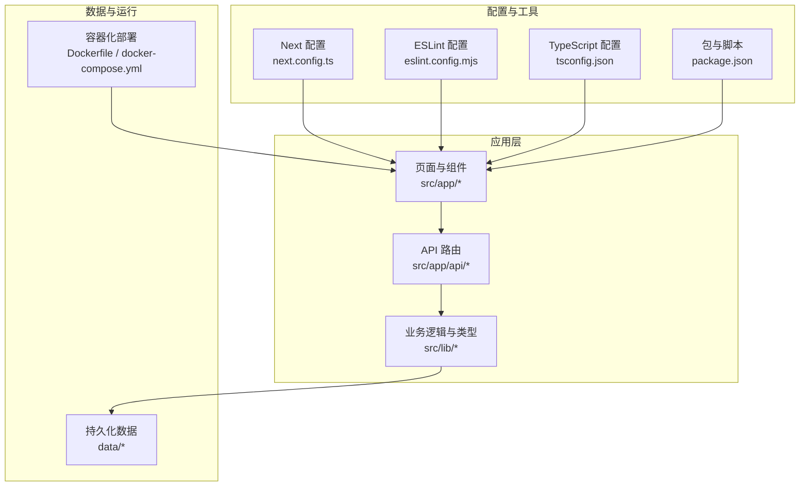
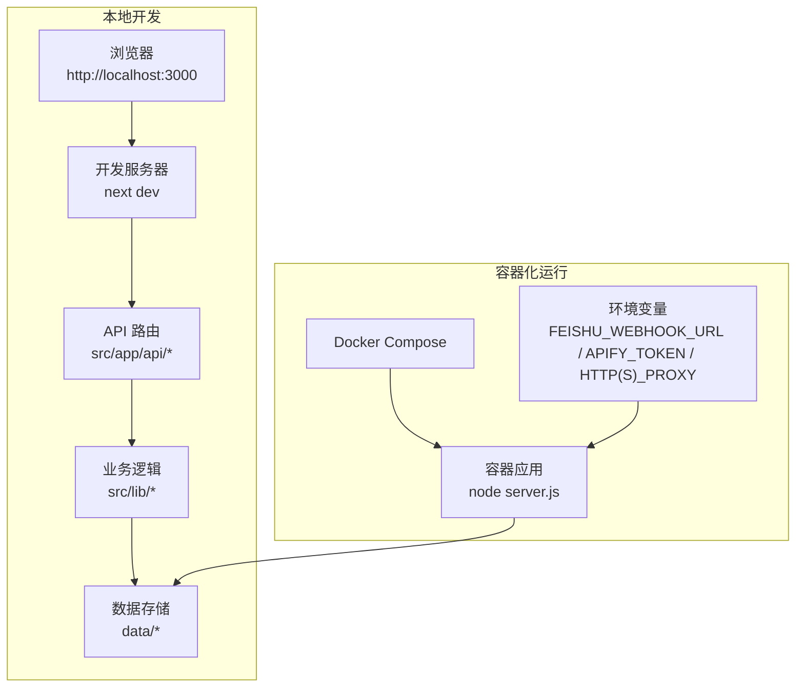
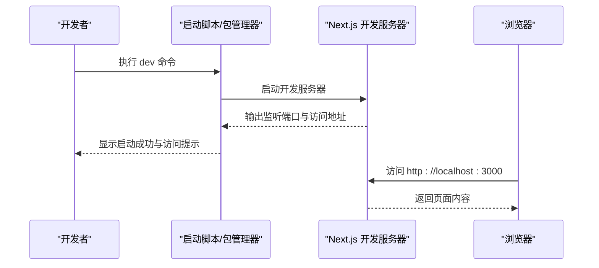
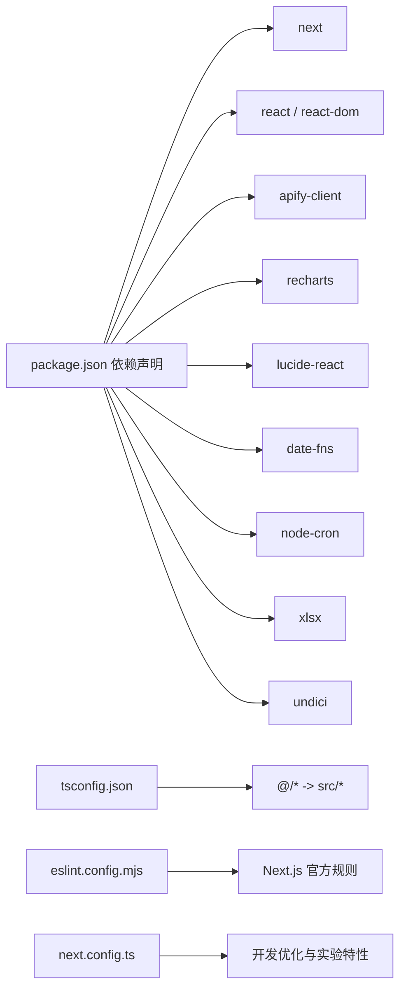

# 快速开始

<cite>
**本文引用的文件**
- [package.json](file://package.json)
- [README.md](file://README.md)
- [next.config.ts](file://next.config.ts)
- [Dockerfile](file://Dockerfile)
- [docker-compose.yml](file://docker-compose.yml)
- [start-dev.ps1](file://start-dev.ps1)
- [start.ps1](file://start.ps1)
- [start-dev.bat](file://start-dev.bat)
- [tsconfig.json](file://tsconfig.json)
- [eslint.config.mjs](file://eslint.config.mjs)
- [data/config.json](file://data/config.json)
- [src/lib/types.ts](file://src/lib/types.ts)
- [src/instrumentation.ts](file://src/instrumentation.ts)
</cite>

## 目录
1. [简介](#简介)
2. [项目结构](#项目结构)
3. [核心组件](#核心组件)
4. [架构总览](#架构总览)
5. [详细组件分析](#详细组件分析)
6. [依赖分析](#依赖分析)
7. [性能考虑](#性能考虑)
8. [故障排除指南](#故障排除指南)
9. [结论](#结论)
10. [附录](#附录)

## 简介
本指南面向首次接触 Reddit 监控项目的开发者，帮助你在最短时间内完成环境准备、依赖安装、本地开发环境配置与首次运行。你将学会：
- 环境要求与工具链选择（Node.js 版本、包管理器）
- 多种启动方式（npm、yarn、pnpm、bun）
- 开发服务器启动流程与浏览器访问
- 常见初始化问题的排查与验证步骤
- 使用脚本与容器化部署的基础知识

## 项目结构
该项目基于 Next.js 16 应用，采用 App Router 结构，前端使用 React 19，后端 API 路由位于 src/app/api 下，业务逻辑集中在 src/lib 中，数据持久化于 data 目录。

图表来源
- [next.config.ts:1-28](file://next.config.ts#L1-L28)
- [package.json:1-38](file://package.json#L1-L38)
- [Dockerfile:1-41](file://Dockerfile#L1-L41)
- [docker-compose.yml:1-38](file://docker-compose.yml#L1-L38)

章节来源
- [package.json:1-38](file://package.json#L1-L38)
- [next.config.ts:1-28](file://next.config.ts#L1-L28)
- [Dockerfile:1-41](file://Dockerfile#L1-L41)
- [docker-compose.yml:1-38](file://docker-compose.yml#L1-L38)

## 核心组件
- 包管理与脚本
  - 支持 dev（Webpack 模式）、dev:webpack、dev:turbo 等多种开发模式；build、start、lint、clean 等常用脚本。
- Next.js 配置
  - 开发时允许特定来源访问，输出模式为 standalone，实验性启用 CSS 优化。
- TypeScript 配置
  - 严格模式、Bundler 解析、路径别名 @/* 指向 src/*。
- ESLint 配置
  - 基于 next.js 官方规则，覆盖核心 Web Vitals 与 TypeScript 规则，并自定义忽略项。
- 数据与类型
  - data/config.json 提供飞书通知、关键词、检测规则、LLM 等配置；src/lib/types.ts 定义了监控的核心数据模型。
- 仪表化与调度
  - src/instrumentation.ts 在服务启动时注册定时任务（如每日推送、自动扫描）。

章节来源
- [package.json:5-12](file://package.json#L5-L12)
- [next.config.ts:3-22](file://next.config.ts#L3-L22)
- [tsconfig.json:1-45](file://tsconfig.json#L1-L45)
- [eslint.config.mjs:1-19](file://eslint.config.mjs#L1-L19)
- [data/config.json:1-57](file://data/config.json#L1-L57)
- [src/lib/types.ts:1-194](file://src/lib/types.ts#L1-L194)
- [src/instrumentation.ts:1-12](file://src/instrumentation.ts#L1-L12)

## 架构总览
下图展示了本地开发与容器化运行两种场景下的关键组件交互。

图表来源
- [next.config.ts:3-22](file://next.config.ts#L3-L22)
- [Dockerfile:1-41](file://Dockerfile#L1-L41)
- [docker-compose.yml:1-38](file://docker-compose.yml#L1-L38)

## 详细组件分析

### 环境要求与工具链
- Node.js 版本
  - 容器基础镜像使用 Node.js 22（Alpine），建议本地也使用 Node.js 22.x 以保证一致性。
- 包管理器选择
  - 项目脚本同时支持 npm、yarn、pnpm、bun，任选其一即可。
- TypeScript 与 ESLint
  - 项目内置 TypeScript 与 ESLint 配置，遵循 Next.js 官方规则。

章节来源
- [Dockerfile:1-2](file://Dockerfile#L1-L2)
- [README.md:7-15](file://README.md#L7-L15)
- [tsconfig.json:1-45](file://tsconfig.json#L1-L45)
- [eslint.config.mjs:1-19](file://eslint.config.mjs#L1-L19)

### 依赖安装步骤
- 使用包管理器安装依赖（任选其一）：
  - npm：npm install
  - yarn：yarn install
  - pnpm：pnpm install
  - bun：bun install
- 安装完成后，执行 lint 检查（可选）：npm run lint

章节来源
- [package.json:14-36](file://package.json#L14-L36)
- [README.md:7-15](file://README.md#L7-L15)

### 本地开发环境配置
- 开发服务器启动
  - 通用命令：npm run dev（或 yarn dev / pnpm dev / bun dev）
  - 项目提供 Windows 启动脚本：
    - PowerShell：start-dev.ps1（带端口占用检测、进程清理、Turbopack 模式提示）
    - 批处理：start-dev.bat（设置最大内存并启动 dev）
    - start.ps1（Cloudflare Tunnel + Next.js 开发服务器）
- 浏览器访问
  - 默认访问地址：http://localhost:3000
- 开发模式差异
  - dev：Webpack 模式
  - dev:webpack：显式指定 Webpack
  - dev:turbo：Turbopack 模式（更快、更省内存）

章节来源
- [package.json:5-12](file://package.json#L5-L12)
- [README.md:5-17](file://README.md#L5-L17)
- [start-dev.ps1:107-137](file://start-dev.ps1#L107-L137)
- [start-dev.bat:8-12](file://start-dev.bat#L8-L12)
- [start.ps1:46-53](file://start.ps1#L46-L53)
- [next.config.ts:3-22](file://next.config.ts#L3-L22)

### 首次运行指导
- 初始化数据与配置
  - data/config.json 是核心配置文件，包含飞书通知、关键词、检测规则、LLM 等设置。首次运行前可根据需要调整。
- 仪表化与定时任务
  - src/instrumentation.ts 在服务启动时注册定时任务（如每日推送、自动扫描），确保在生产或容器环境中正确加载。
- 验证步骤
  - 启动后访问 http://localhost:3000，确认页面渲染正常。
  - 查看控制台日志，确认定时任务初始化成功。

章节来源
- [data/config.json:1-57](file://data/config.json#L1-L57)
- [src/instrumentation.ts:4-11](file://src/instrumentation.ts#L4-L11)

### 多种启动方式
- npm
  - npm run dev
- yarn
  - yarn dev
- pnpm
  - pnpm dev
- bun
  - bun dev

章节来源
- [README.md:7-15](file://README.md#L7-L15)
- [package.json:5-12](file://package.json#L5-L12)

### 开发服务器启动流程（概念序列）

（该图为概念流程，不对应具体源码文件）

### 容器化运行（可选）
- 构建镜像
  - 使用 Dockerfile 构建，基础镜像为 node:22-alpine，构建阶段安装依赖并执行 next build。
- 运行容器
  - 使用 docker-compose.yml 指定环境变量（飞书 Webhook、代理、Apify Token、数据目录等），映射端口 3000，暴露环境变量 PORT=3000、HOSTNAME=0.0.0.0。
- 数据持久化
  - 通过命名卷持久化 data 与 node_modules（可选）。

章节来源
- [Dockerfile:1-41](file://Dockerfile#L1-L41)
- [docker-compose.yml:1-38](file://docker-compose.yml#L1-L38)

## 依赖分析
- 核心依赖
  - next、react、react-dom：框架与 UI 基础
  - apify-client：Reddit 抓取客户端
  - recharts、lucide-react：可视化与图标
  - date-fns、node-cron：日期与定时任务
  - xlsx、undici：数据导出与 HTTP 客户端
- 开发依赖
  - TypeScript、TailwindCSS、ESLint 及 Next.js 官方 ESLint 配置
- 配置耦合
  - next.config.ts 与开发体验（并发编译优化、Turbopack 实验特性）
  - tsconfig.json 与路径别名、模块解析策略
  - eslint.config.mjs 与代码质量约束

图表来源
- [package.json:14-36](file://package.json#L14-L36)
- [tsconfig.json:25-29](file://tsconfig.json#L25-L29)
- [eslint.config.mjs:1-19](file://eslint.config.mjs#L1-L19)
- [next.config.ts:7-21](file://next.config.ts#L7-L21)

章节来源
- [package.json:14-36](file://package.json#L14-L36)
- [tsconfig.json:25-29](file://tsconfig.json#L25-L29)
- [eslint.config.mjs:1-19](file://eslint.config.mjs#L1-L19)
- [next.config.ts:7-21](file://next.config.ts#L7-L21)

## 性能考虑
- 开发模式选择
  - dev:turbo（Turbopack）通常更快且内存占用更低，适合频繁改动的开发场景。
  - dev 或 dev:webpack 更稳定，适合需要严格 Webpack 行为的场景。
- 内存设置
  - Windows 启动脚本已设置 NODE_OPTIONS="--max-old-space-size=4096"，避免大项目内存不足。
- 构建优化
  - next.config.ts 对开发服务器进行优化（最小化关闭、CSS 优化），提升热重载与编译速度。
- 容器运行
  - Dockerfile 使用 Alpine 基础镜像，减少体积；生产阶段仅复制必要文件，缩短启动时间。

章节来源
- [package.json:5-12](file://package.json#L5-L12)
- [start-dev.ps1:125-127](file://start-dev.ps1#L125-L127)
- [next.config.ts:7-21](file://next.config.ts#L7-L21)
- [Dockerfile:22-40](file://Dockerfile#L22-L40)

## 故障排除指南
- 端口占用
  - 症状：端口 3000 被占用，无法启动
  - 处理：使用 start-dev.ps1 自动检测并清理占用进程；或手动查找占用进程并终止
- 重复启动
  - 症状：多个 Node 进程导致冲突
  - 处理：脚本会尝试识别并清理相关进程，若仍有残留，建议手动结束 node.exe
- 访问受限
  - 症状：本地开发时访问被限制
  - 处理：next.config.ts 中 allowedDevOrigins 已包含 localhost 等域名，如使用 Cloudflare Tunnel，需更新该列表
- 代理与网络
  - 症状：抓取 Reddit 失败或超时
  - 处理：在 docker-compose.yml 中配置 HTTP_PROXY/HTTPS_PROXY，或在本地环境变量中设置
- 飞书通知
  - 症状：未收到通知
  - 处理：检查 data/config.json 中的 webhook 地址与开关状态
- LLM 配置
  - 症状：情感分析或摘要功能异常
  - 处理：检查 data/config.json 中 llm.enabled/provider/apiKey/model/baseUrl 等字段

章节来源
- [start-dev.ps1:9-33](file://start-dev.ps1#L9-L33)
- [start-dev.ps1:37-88](file://start-dev.ps1#L37-L88)
- [next.config.ts:4](file://next.config.ts#L4)
- [docker-compose.yml:14-16](file://docker-compose.yml#L14-L16)
- [data/config.json:39-48](file://data/config.json#L39-L48)
- [data/config.json:29-37](file://data/config.json#L29-L37)

## 结论
通过本快速开始指南，你可以：
- 在本地快速搭建开发环境并启动 Next.js 应用
- 使用多种包管理器与启动方式
- 理解开发服务器的工作原理与访问方式
- 排查常见初始化问题并进行验证
- 为进一步扩展（如容器化、定时任务、通知集成）打下基础

## 附录

### 关键配置一览
- 开发服务器端口与访问
  - 默认端口：3000；访问地址：http://localhost:3000
- TypeScript 路径别名
  - @/* 指向 src/*
- ESLint 规则
  - 基于 Next.js 官方规则与核心 Web Vitals
- Next.js 实验特性
  - optimizeCss 启用，开发优化开启
- 容器运行参数
  - EXPOSE 3000；ENV PORT=3000；HOSTNAME=0.0.0.0

章节来源
- [README.md:17](file://README.md#L17)
- [tsconfig.json:25-29](file://tsconfig.json#L25-L29)
- [eslint.config.mjs:1-19](file://eslint.config.mjs#L1-L19)
- [next.config.ts:4-21](file://next.config.ts#L4-L21)
- [Dockerfile:36-37](file://Dockerfile#L36-L37)