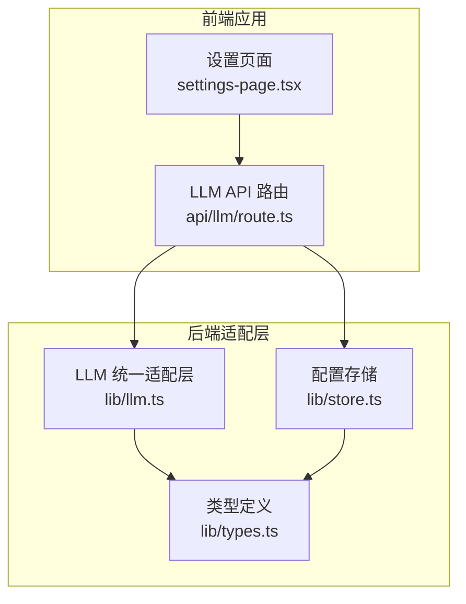
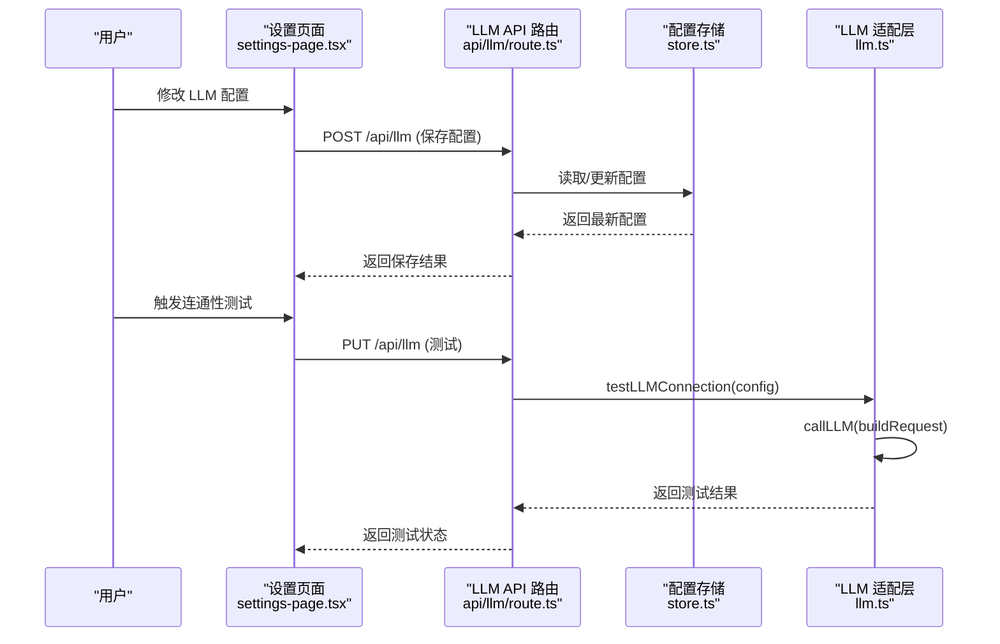
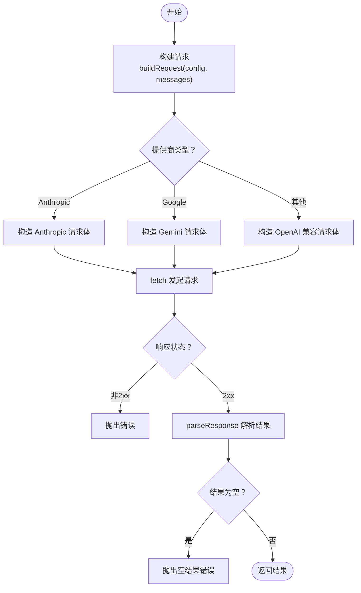
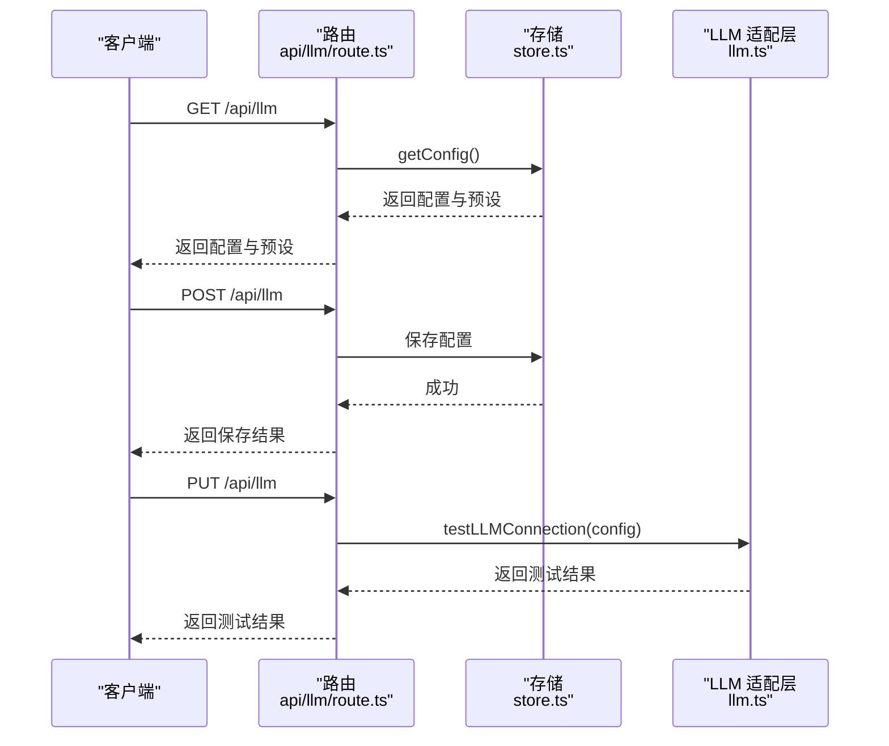
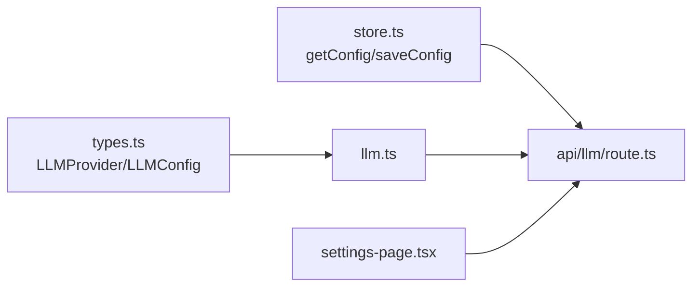

# LLM 集成扩展

<cite>
**本文引用的文件**
- [src/lib/llm.ts](file://src/lib/llm.ts)
- [src/app/api/llm/route.ts](file://src/app/api/llm/route.ts)
- [src/lib/types.ts](file://src/lib/types.ts)
- [src/lib/store.ts](file://src/lib/store.ts)
- [src/app/settings/settings-page.tsx](file://src/app/settings/settings-page.tsx)
- [README.md](file://README.md)
- [AGENTS.md](file://AGENTS.md)
- [CLAUDE.md](file://CLAUDE.md)
</cite>

## 目录
1. [简介](#简介)
2. [项目结构](#项目结构)
3. [核心组件](#核心组件)
4. [架构总览](#架构总览)
5. [详细组件分析](#详细组件分析)
6. [依赖关系分析](#依赖关系分析)
7. [性能考量](#性能考量)
8. [故障排查指南](#故障排查指南)
9. [结论](#结论)
10. [附录](#附录)

## 简介
本技术文档面向希望在 Reddit 监控系统中集成与扩展大语言模型（LLM）能力的开发者。文档围绕 llm.ts 的统一适配层展开，系统性说明 OpenAI、Claude、Gemini、DeepSeek、智谱、Kimi、通义千问、豆包、Ollama 以及自定义 OpenAI 兼容接口的配置与调用方式；结合 AGENTS.md 与 CLAUDE.md 的模型选择策略与 API 密钥管理要点，给出新 LLM 提供商的接入流程、认证配置、请求格式适配、响应解析与错误处理的最佳实践。

## 项目结构
本项目的 LLM 集成位于前端 Next.js 应用中，核心逻辑集中在 src/lib/llm.ts，配套的 API 路由位于 src/app/api/llm/route.ts，类型定义与全局配置分别在 src/lib/types.ts 与 src/lib/store.ts 中。设置页面负责用户交互与配置持久化。

图表来源
- [src/app/api/llm/route.ts:1-80](file://src/app/api/llm/route.ts#L1-L80)
- [src/lib/llm.ts:1-338](file://src/lib/llm.ts#L1-L338)
- [src/lib/types.ts:105-125](file://src/lib/types.ts#L105-L125)
- [src/lib/store.ts:194-285](file://src/lib/store.ts#L194-L285)

章节来源
- [README.md:1-37](file://README.md#L1-L37)
- [src/app/api/llm/route.ts:1-80](file://src/app/api/llm/route.ts#L1-L80)
- [src/lib/llm.ts:1-338](file://src/lib/llm.ts#L1-L338)
- [src/lib/types.ts:105-125](file://src/lib/types.ts#L105-L125)
- [src/lib/store.ts:194-285](file://src/lib/store.ts#L194-L285)

## 核心组件
- 统一适配层（llm.ts）
  - 提供 PROVIDER_PRESETS 预设，覆盖 OpenAI、Anthropic/Claude、Google/Gemini、DeepSeek、智谱、Kimi、通义千问、豆包、Ollama、Custom 等提供商的基础信息（名称、基础 URL、可用模型、密钥标签与提示）。
  - 实现 buildRequest 与 parseResponse，针对 Anthropic 与 Google 的特有格式进行适配，其余提供商遵循 OpenAI 兼容格式。
  - 封装 callLLM 发起请求，内置 30 秒超时控制与错误处理；提供 analyzeSentimentWithLLM 与 batchAnalyzeWithLLM 两个业务入口，前者用于单条评论情感分析，后者批量分析并带速率限制。
  - 提供 testLLMConnection 用于连通性测试。
- API 路由（api/llm/route.ts）
  - GET：返回当前 LLM 配置与提供商预设。
  - POST：保存 LLM 配置至全局配置存储，并持久化。
  - PUT：校验密钥后发起连通性测试。
- 类型定义（types.ts）
  - LLMProvider 枚举与 LLMConfig 结构体，约束提供商、模型、基础 URL、最大输出长度与采样温度等字段。
- 配置存储（store.ts）
  - 默认配置包含 llm 字段，支持在 Vercel 环境通过环境变量覆盖；提供 getConfig/saveConfig 以读写配置。

章节来源
- [src/lib/llm.ts:8-85](file://src/lib/llm.ts#L8-L85)
- [src/lib/llm.ts:109-176](file://src/lib/llm.ts#L109-L176)
- [src/lib/llm.ts:178-231](file://src/lib/llm.ts#L178-L231)
- [src/lib/llm.ts:233-307](file://src/lib/llm.ts#L233-L307)
- [src/lib/llm.ts:309-338](file://src/lib/llm.ts#L309-L338)
- [src/app/api/llm/route.ts:6-13](file://src/app/api/llm/route.ts#L6-L13)
- [src/app/api/llm/route.ts:15-47](file://src/app/api/llm/route.ts#L15-L47)
- [src/app/api/llm/route.ts:49-79](file://src/app/api/llm/route.ts#L49-L79)
- [src/lib/types.ts:105-125](file://src/lib/types.ts#L105-L125)
- [src/lib/store.ts:194-269](file://src/lib/store.ts#L194-L269)

## 架构总览
下图展示了从前端设置页面到 LLM 适配层与外部提供商的整体调用链路与数据流。

图表来源
- [src/app/settings/settings-page.tsx:967-1007](file://src/app/settings/settings-page.tsx#L967-L1007)
- [src/app/api/llm/route.ts:15-47](file://src/app/api/llm/route.ts#L15-L47)
- [src/app/api/llm/route.ts:49-79](file://src/app/api/llm/route.ts#L49-L79)
- [src/lib/store.ts:271-284](file://src/lib/store.ts#L271-L284)
- [src/lib/llm.ts:309-338](file://src/lib/llm.ts#L309-L338)

## 详细组件分析

### 统一适配层（llm.ts）
- 提供商预设与选择策略
  - 预设包含提供商名称、基础 URL、可用模型列表、API Key 标签与提示，便于前端渲染与用户输入校验。
  - 选择策略建议优先考虑模型能力与成本：如 OpenAI 的 gpt-4o/gpt-4o-mini 在通用任务上表现稳定；Claude 系列适合长文本与复杂推理；Gemini 在多模态与跨语言场景较强；DeepSeek、智谱、Kimi、通义千问、豆包等在中文场景具备优势；Ollama 适合本地部署与隐私需求。
- 请求构建与格式适配
  - Anthropic：使用 /v1/messages，请求头包含 x-api-key 与 anthropic-version，消息体将 system 与 messages 分离。
  - Google Gemini：使用 /v1beta/{model}:generateContent?key=...，请求体包含 systemInstruction、contents（角色映射为 model/user）与 generationConfig。
  - 其他提供商：统一走 /chat/completions，请求头 Authorization: Bearer {apiKey}，消息体包含 model、messages、temperature、max_tokens。
- 响应解析
  - Anthropic：解析 content[0].text。
  - Google：解析 candidates[0].content.parts[0].text。
  - 其他：解析 choices[0].message.content。
- 错误处理与超时
  - fetch 设置 30 秒超时，AbortError 统一转换为“LLM请求超时(30秒)”。
  - 非 2xx 响应读取文本片段并抛出错误；空结果抛出“LLM返回了空结果”。
- 情感分析与批处理
  - analyzeSentimentWithLLM：注入系统提示词，提取 JSON 并做边界裁剪与类型转换。
  - batchAnalyzeWithLLM：逐条分析并加入 500ms 速率限制，保证稳定性与合规性。
- 连通性测试
  - testLLMConnection：发送简短测试消息，验证提供商可用性与模型返回。

图表来源
- [src/lib/llm.ts:109-176](file://src/lib/llm.ts#L109-L176)
- [src/lib/llm.ts:178-231](file://src/lib/llm.ts#L178-L231)
- [src/lib/llm.ts:233-307](file://src/lib/llm.ts#L233-L307)
- [src/lib/llm.ts:309-338](file://src/lib/llm.ts#L309-L338)

章节来源
- [src/lib/llm.ts:8-85](file://src/lib/llm.ts#L8-L85)
- [src/lib/llm.ts:109-176](file://src/lib/llm.ts#L109-L176)
- [src/lib/llm.ts:178-231](file://src/lib/llm.ts#L178-L231)
- [src/lib/llm.ts:233-307](file://src/lib/llm.ts#L233-L307)
- [src/lib/llm.ts:309-338](file://src/lib/llm.ts#L309-L338)

### API 路由（api/llm/route.ts）
- GET /api/llm
  - 返回当前 llm 配置与 PROVIDER_PRESETS，供前端渲染。
- POST /api/llm
  - 接收前端提交的配置，合并默认值与预设 baseUrl，保存至全局配置并持久化。
- PUT /api/llm
  - 校验 API Key（除 ollama 外），构造临时配置并调用 testLLMConnection，返回测试结果。

图表来源
- [src/app/api/llm/route.ts:6-13](file://src/app/api/llm/route.ts#L6-L13)
- [src/app/api/llm/route.ts:15-47](file://src/app/api/llm/route.ts#L15-L47)
- [src/app/api/llm/route.ts:49-79](file://src/app/api/llm/route.ts#L49-L79)
- [src/lib/store.ts:271-284](file://src/lib/store.ts#L271-L284)
- [src/lib/llm.ts:309-338](file://src/lib/llm.ts#L309-L338)

章节来源
- [src/app/api/llm/route.ts:6-13](file://src/app/api/llm/route.ts#L6-L13)
- [src/app/api/llm/route.ts:15-47](file://src/app/api/llm/route.ts#L15-L47)
- [src/app/api/llm/route.ts:49-79](file://src/app/api/llm/route.ts#L49-L79)

### 类型定义与配置存储（types.ts、store.ts）
- LLMConfig
  - enabled、provider、apiKey、model、baseUrl、maxTokens、temperature。
- 默认配置与环境变量覆盖
  - 默认配置包含 llm 字段；在 Vercel 环境可通过 LLM_* 系列环境变量覆盖 llm 配置。
- 设置页面交互
  - settings-page.tsx 展示并允许切换 llmConfig.enabled，选择 provider 与 model，并触发保存与测试。

章节来源
- [src/lib/types.ts:105-125](file://src/lib/types.ts#L105-L125)
- [src/lib/store.ts:194-269](file://src/lib/store.ts#L194-L269)
- [src/app/settings/settings-page.tsx:967-1007](file://src/app/settings/settings-page.tsx#L967-L1007)

## 依赖关系分析
- 组件耦合
  - api/llm/route.ts 依赖 llm.ts 的 PROVIDER_PRESETS 与测试函数，依赖 store.ts 的配置读写。
  - llm.ts 依赖 types.ts 的 LLMProvider 与 LLMConfig 类型。
  - settings-page.tsx 依赖 api/llm/route.ts 的接口，间接依赖 store.ts 的配置。
- 外部依赖
  - fetch 作为 HTTP 客户端；Anthropic 与 Google 的特定 API 端点；Ollama 本地端口。
- 潜在循环依赖
  - 当前模块间为单向依赖，无循环风险。

图表来源
- [src/lib/types.ts:105-125](file://src/lib/types.ts#L105-L125)
- [src/lib/llm.ts:1-338](file://src/lib/llm.ts#L1-L338)
- [src/lib/store.ts:194-285](file://src/lib/store.ts#L194-L285)
- [src/app/api/llm/route.ts:1-80](file://src/app/api/llm/route.ts#L1-L80)
- [src/app/settings/settings-page.tsx:967-1007](file://src/app/settings/settings-page.tsx#L967-L1007)

章节来源
- [src/lib/types.ts:105-125](file://src/lib/types.ts#L105-L125)
- [src/lib/llm.ts:1-338](file://src/lib/llm.ts#L1-L338)
- [src/lib/store.ts:194-285](file://src/lib/store.ts#L194-L285)
- [src/app/api/llm/route.ts:1-80](file://src/app/api/llm/route.ts#L1-L80)
- [src/app/settings/settings-page.tsx:967-1007](file://src/app/settings/settings-page.tsx#L967-L1007)

## 性能考量
- 超时与重试
  - 单次请求 30 秒超时，避免长时间阻塞；建议在前端展示加载状态与取消按钮。
- 速率限制
  - 批量分析默认 500ms 间隔，兼顾稳定性与成本控制；可根据提供商限流策略调整。
- 缓存与持久化
  - store.ts 对大文件读取采用 30 秒缓存，降低 I/O 压力；LLM 配置变更后及时失效缓存。
- 模型参数
  - temperature 与 maxTokens 影响响应质量与成本，建议根据任务复杂度动态调整。
- 本地模型
  - Ollama 本地部署可显著降低网络延迟与隐私风险，但需评估硬件资源与吞吐能力。

## 故障排查指南
- 常见错误与定位
  - “LLM请求超时(30秒)”：检查网络连通性、代理设置与提供商限流；适当提高超时阈值。
  - “LLM返回了空结果”：确认模型可用性、消息格式与系统提示词；检查响应解析分支。
  - “LLM分析失败: ...”：查看批次分析中的单条错误日志，定位具体评论与提供商响应。
  - “请先填写API Key”：PUT 测试时未提供密钥（除 ollama 外），请在前端补齐。
- 连通性测试
  - 使用 PUT /api/llm 进行快速验证，观察返回的成功/失败信息与提供商名称、模型信息。
- 日志与可观测性
  - 批量分析会记录每条评论的错误信息，便于定位问题；建议在生产环境收集并归档。

章节来源
- [src/lib/llm.ts:224-231](file://src/lib/llm.ts#L224-L231)
- [src/lib/llm.ts:287-298](file://src/lib/llm.ts#L287-L298)
- [src/app/api/llm/route.ts:64-69](file://src/app/api/llm/route.ts#L64-L69)
- [src/app/api/llm/route.ts:71-72](file://src/app/api/llm/route.ts#L71-L72)

## 结论
本 LLM 集成扩展通过统一适配层实现了多家提供商的兼容与抽象，配合前端设置页面与 API 路由，提供了完整的配置、测试与分析闭环。开发者可基于现有模式快速接入新提供商，遵循请求格式适配与响应解析规范，确保在不同生态下的稳定运行。

## 附录

### 新 LLM 提供商集成流程
- 步骤概览
  - 在 PROVIDER_PRESETS 中新增提供商预设（名称、基础 URL、模型列表、密钥标签与提示）。
  - 在 buildRequest 中添加该提供商的请求格式适配（URL、Headers、Body）。
  - 在 parseResponse 中添加该提供商的响应解析逻辑。
  - 如需特殊行为（如测试连通性），在 testLLMConnection 或调用方补充。
  - 在前端设置页面渲染该提供商的模型与参数，并调用 /api/llm 保存与测试。
- 关键路径参考
  - 预设与请求构建：[src/lib/llm.ts:8-85](file://src/lib/llm.ts#L8-L85)，[src/lib/llm.ts:109-176](file://src/lib/llm.ts#L109-L176)
  - 响应解析：[src/lib/llm.ts:178-189](file://src/lib/llm.ts#L178-L189)
  - 连通性测试：[src/lib/llm.ts:309-338](file://src/lib/llm.ts#L309-L338)
  - 配置保存与测试：[src/app/api/llm/route.ts:15-47](file://src/app/api/llm/route.ts#L15-L47)，[src/app/api/llm/route.ts:49-79](file://src/app/api/llm/route.ts#L49-L79)
  - 前端设置交互：[src/app/settings/settings-page.tsx:967-1007](file://src/app/settings/settings-page.tsx#L967-L1007)

### 模型选择策略与密钥管理要点
- 模型选择策略（摘自 AGENTS.md 与 CLAUDE.md 的上下文）
  - AGENTS.md 提示 Next.js 版本存在破坏性变更，编写代码前需阅读官方文档，避免因版本差异导致集成问题。
  - CLAUDE.md 引用 AGENTS.md，强调在使用 Claude 等模型时需关注 API 行为与兼容性。
- 密钥管理
  - 除 ollama 外，所有提供商均需 API Key；建议通过环境变量注入并在前端隐藏显示。
  - 在 Vercel 环境可通过 LLM_API_KEY 等环境变量覆盖默认配置，便于多环境部署。

章节来源
- [AGENTS.md:1-6](file://AGENTS.md#L1-L6)
- [CLAUDE.md:1-2](file://CLAUDE.md#L1-L2)
- [src/lib/store.ts:250-261](file://src/lib/store.ts#L250-L261)
- [src/app/api/llm/route.ts:64-69](file://src/app/api/llm/route.ts#L64-L69)