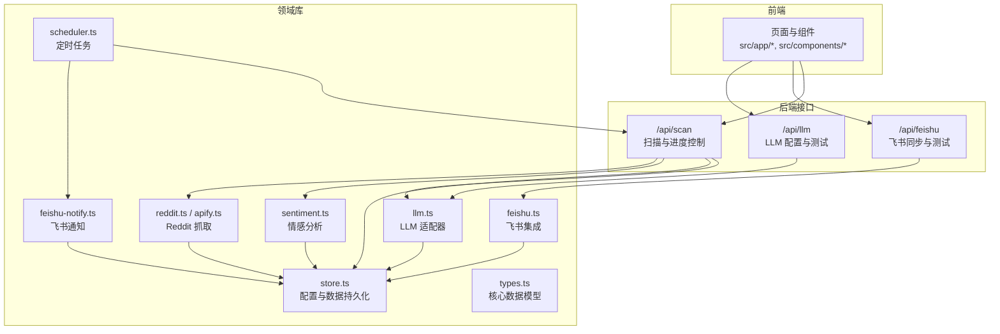
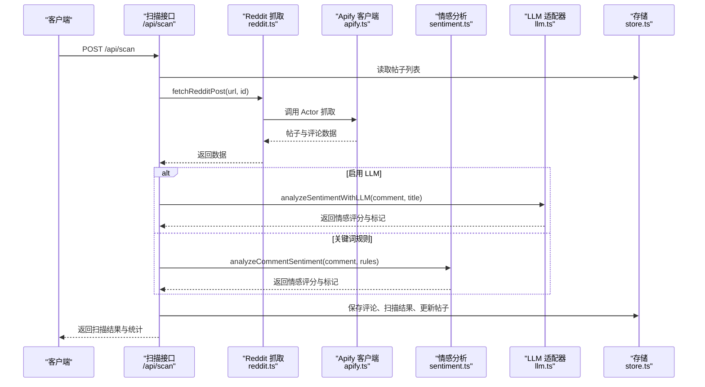
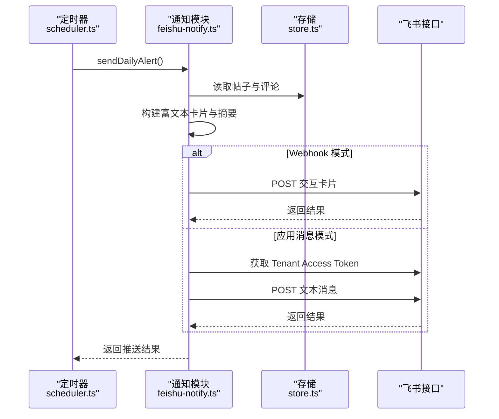
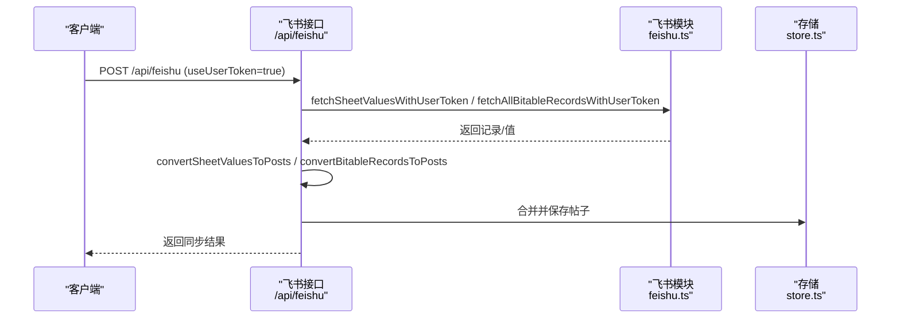
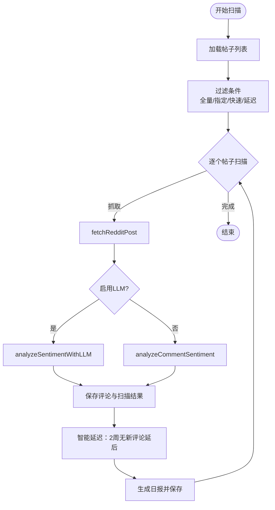
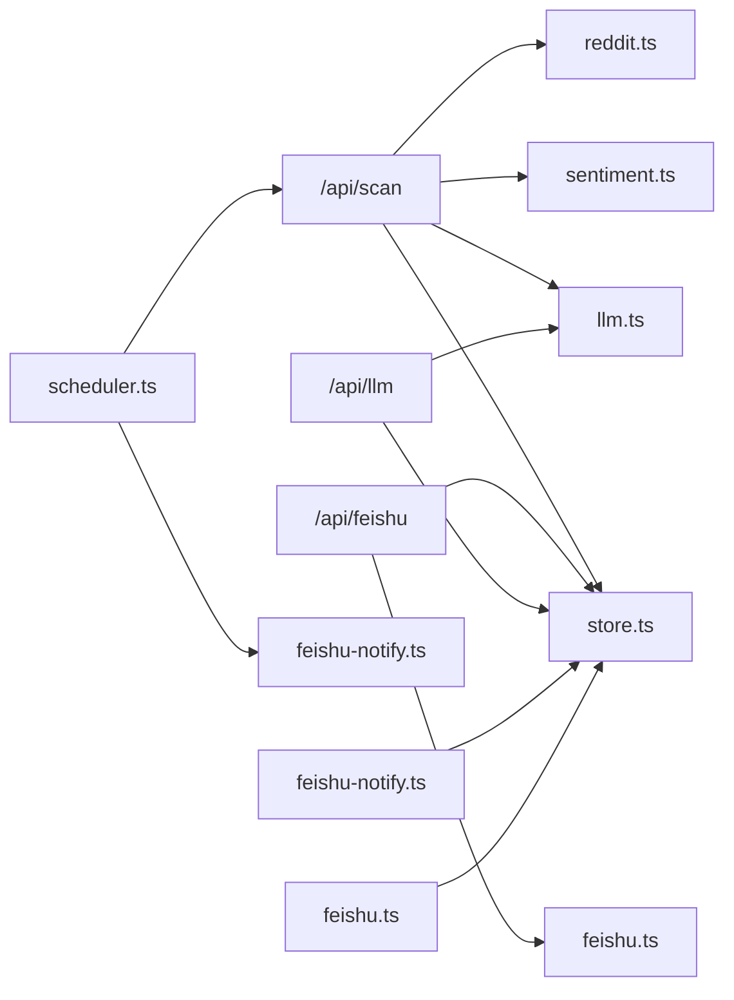

# 扩展开发

<cite>
**本文引用的文件**
- [src/lib/types.ts](file://src/lib/types.ts)
- [src/lib/llm.ts](file://src/lib/llm.ts)
- [src/app/api/llm/route.ts](file://src/app/api/llm/route.ts)
- [src/lib/feishu.ts](file://src/lib/feishu.ts)
- [src/app/api/feishu/route.ts](file://src/app/api/feishu/route.ts)
- [src/lib/store.ts](file://src/lib/store.ts)
- [src/lib/reddit.ts](file://src/lib/reddit.ts)
- [src/app/api/scan/route.ts](file://src/app/api/scan/route.ts)
- [src/lib/scheduler.ts](file://src/lib/scheduler.ts)
- [src/lib/feishu-notify.ts](file://src/lib/feishu-notify.ts)
- [src/lib/apify.ts](file://src/lib/apify.ts)
- [src/lib/sentiment.ts](file://src/lib/sentiment.ts)
- [src/components/sidebar.tsx](file://src/components/sidebar.tsx)
- [package.json](file://package.json)
- [README.md](file://README.md)
</cite>

## 目录
1. [简介](#简介)
2. [项目结构](#项目结构)
3. [核心组件](#核心组件)
4. [架构总览](#架构总览)
5. [详细组件分析](#详细组件分析)
6. [依赖关系分析](#依赖关系分析)
7. [性能考量](#性能考量)
8. [故障排查指南](#故障排查指南)
9. [结论](#结论)
10. [附录](#附录)

## 简介
本指南面向为 Reddit 监控系统开发扩展的工程师，覆盖插件开发方法、新功能集成流程、第三方集成方案，以及 LLM 集成（OpenAI、Claude、Gemini、通义千问、豆包、Ollama 等）与飞书通知系统的扩展与自定义。文档同时提供新的数据源接入、分析算法扩展、UI 组件开发的指导，并总结扩展点识别与插件架构设计的最佳实践，帮助开发者构建完整的扩展开发工具链与示例。

## 项目结构
系统采用 Next.js App Router 架构，前后端 API 以 App Router 的路由函数形式组织，核心业务逻辑集中在 src/lib 下的模块化库中，数据持久化采用本地文件存储（开发环境）或内存存储（Vercel）。关键目录与职责如下：
- src/app/api/*：REST 风格的后端接口，负责对外暴露配置、扫描、Feishu 同步、LLM 配置等功能
- src/lib/*：领域库，封装数据模型、存储、Reddit 抓取、情感分析、LLM 适配器、飞书集成、定时任务等
- src/components/*：UI 组件（如侧边栏）
- data/*：本地持久化数据（开发环境）



图表来源
- [src/app/api/llm/route.ts:1-80](file://src/app/api/llm/route.ts#L1-L80)
- [src/app/api/feishu/route.ts:1-250](file://src/app/api/feishu/route.ts#L1-L250)
- [src/app/api/scan/route.ts:1-394](file://src/app/api/scan/route.ts#L1-L394)
- [src/lib/store.ts:1-285](file://src/lib/store.ts#L1-L285)
- [src/lib/types.ts:1-194](file://src/lib/types.ts#L1-L194)
- [src/lib/reddit.ts:1-94](file://src/lib/reddit.ts#L1-L94)
- [src/lib/apify.ts:1-280](file://src/lib/apify.ts#L1-L280)
- [src/lib/sentiment.ts:1-398](file://src/lib/sentiment.ts#L1-L398)
- [src/lib/llm.ts:1-338](file://src/lib/llm.ts#L1-L338)
- [src/lib/feishu.ts:1-448](file://src/lib/feishu.ts#L1-L448)
- [src/lib/feishu-notify.ts:1-482](file://src/lib/feishu-notify.ts#L1-L482)
- [src/lib/scheduler.ts:1-133](file://src/lib/scheduler.ts#L1-L133)

章节来源
- [README.md:1-37](file://README.md#L1-L37)
- [package.json:1-38](file://package.json#L1-L38)

## 核心组件
- 数据模型与配置：统一的数据类型定义与监控配置结构，支持 LLM、飞书、检测规则等扩展字段
- 存储层：本地文件存储（开发）与内存存储（部署）双模式，具备缓存与 TTL 控制
- Reddit 抓取：基于 Apify 的 Actor 调用，支持单贴与板块抓取，内置代理与限流
- 情感分析：关键词规则 + 评分体系；可选 LLM 模式增强
- LLM 适配器：统一 OpenAI 兼容接口，支持多家厂商与本地模型
- 飞书集成：Bitable/Sheet 读取、OAuth 用户授权、跨租户访问
- 通知系统：Webhook 与应用消息，支持每日定时推送
- 定时任务：基于 node-cron 的每日推送与午夜自动扫描

章节来源
- [src/lib/types.ts:1-194](file://src/lib/types.ts#L1-L194)
- [src/lib/store.ts:1-285](file://src/lib/store.ts#L1-L285)
- [src/lib/reddit.ts:1-94](file://src/lib/reddit.ts#L1-L94)
- [src/lib/apify.ts:1-280](file://src/lib/apify.ts#L1-L280)
- [src/lib/sentiment.ts:1-398](file://src/lib/sentiment.ts#L1-L398)
- [src/lib/llm.ts:1-338](file://src/lib/llm.ts#L1-L338)
- [src/lib/feishu.ts:1-448](file://src/lib/feishu.ts#L1-L448)
- [src/lib/feishu-notify.ts:1-482](file://src/lib/feishu-notify.ts#L1-L482)
- [src/lib/scheduler.ts:1-133](file://src/lib/scheduler.ts#L1-L133)

## 架构总览
系统采用“接口层 + 领域库 + 存储层”的分层设计。接口层负责参数校验、鉴权与响应封装；领域库封装业务规则与第三方集成；存储层抽象数据持久化细节。扩展点主要体现在：
- 新增 LLM 提供商：在 LLM 适配器中新增提供商预设与请求构造
- 新增数据源：在 Reddit/Apify 层新增抓取策略或替换抓取实现
- 新增通知渠道：在通知模块新增消息通道与模板
- 新增分析算法：在情感分析模块新增规则或替换为外部服务
- 新增 UI 组件：在组件层新增页面与交互组件



图表来源
- [src/app/api/scan/route.ts:1-394](file://src/app/api/scan/route.ts#L1-L394)
- [src/lib/reddit.ts:1-94](file://src/lib/reddit.ts#L1-L94)
- [src/lib/apify.ts:1-280](file://src/lib/apify.ts#L1-L280)
- [src/lib/sentiment.ts:1-398](file://src/lib/sentiment.ts#L1-L398)
- [src/lib/llm.ts:1-338](file://src/lib/llm.ts#L1-L338)
- [src/lib/store.ts:1-285](file://src/lib/store.ts#L1-L285)

## 详细组件分析

### LLM 集成与配置
- 支持提供商：OpenAI、Anthropic（Claude）、Google（Gemini）、DeepSeek、智谱、月之暗面、通义千问、豆包、Ollama、Custom
- 统一适配器：根据提供商选择不同的请求格式与解析逻辑，保持调用一致性
- 配置入口：/api/llm 提供 GET（读取配置与预设）、POST（保存配置）、PUT（测试连接）
- 运行时选择：扫描阶段根据配置决定使用 LLM 还是关键词规则；失败时自动回退

```mermaid
classDiagram
class LLMConfig {
+enabled : boolean
+provider : LLMProvider
+apiKey : string
+model : string
+baseUrl : string
+maxTokens : number
+temperature : number
}
class LLMAdapter {
+callLLM(config, messages) string
+analyzeSentimentWithLLM(config, body, title) LLMSentimentResult
+batchAnalyzeWithLLM(config, comments, title, onProgress) LLMSentimentResult[]
+testLLMConnection(config) {success,message}
}
LLMAdapter --> LLMConfig : "使用"
```

图表来源
- [src/lib/llm.ts:1-338](file://src/lib/llm.ts#L1-L338)
- [src/app/api/llm/route.ts:1-80](file://src/app/api/llm/route.ts#L1-L80)
- [src/lib/types.ts:105-125](file://src/lib/types.ts#L105-L125)

章节来源
- [src/lib/llm.ts:1-338](file://src/lib/llm.ts#L1-L338)
- [src/app/api/llm/route.ts:1-80](file://src/app/api/llm/route.ts#L1-L80)
- [src/lib/types.ts:105-125](file://src/lib/types.ts#L105-L125)

### 飞书通知系统扩展
- 通知模式：Webhook（群机器人）与 App（应用消息）
- 模板渲染：构建富文本卡片与纯文本摘要，支持健康度评分、情感分布、风险类别、帖子列表等
- 发送流程：Webhook 直接推送卡片；应用消息通过 Token 获取与消息发送
- 测试接口：/api/feishu-notify 提供测试连接能力
- 定时推送：基于 node-cron 在配置时间执行每日推送



图表来源
- [src/lib/scheduler.ts:1-133](file://src/lib/scheduler.ts#L1-L133)
- [src/lib/feishu-notify.ts:1-482](file://src/lib/feishu-notify.ts#L1-L482)
- [src/lib/store.ts:1-285](file://src/lib/store.ts#L1-L285)
- [src/lib/feishu.ts:1-448](file://src/lib/feishu.ts#L1-L448)

章节来源
- [src/lib/feishu-notify.ts:1-482](file://src/lib/feishu-notify.ts#L1-L482)
- [src/lib/scheduler.ts:1-133](file://src/lib/scheduler.ts#L1-L133)
- [src/lib/feishu.ts:1-448](file://src/lib/feishu.ts#L1-L448)

### 飞书数据源集成与同步
- 两种访问模式：tenant_access_token（本租户）与 user_access_token（跨租户）
- 支持数据源：Bitable（多维表格）与 Sheet（电子表格）
- 同步流程：读取记录/值 → 解析 URL → 合并现有帖子 → 保存
- 测试接口：/api/feishu 提供连接测试与同步入口



图表来源
- [src/app/api/feishu/route.ts:1-250](file://src/app/api/feishu/route.ts#L1-L250)
- [src/lib/feishu.ts:1-448](file://src/lib/feishu.ts#L1-L448)
- [src/lib/store.ts:1-285](file://src/lib/store.ts#L1-L285)

章节来源
- [src/app/api/feishu/route.ts:1-250](file://src/app/api/feishu/route.ts#L1-L250)
- [src/lib/feishu.ts:1-448](file://src/lib/feishu.ts#L1-L448)

### 扫描与分析流水线
- 扫描控制：支持全量扫描、指定帖子、快速扫描、智能延迟跳过
- 分析策略：优先 LLM，失败回退关键词规则；生成情感评分、标记与摘要
- 结果落盘：保存评论、扫描结果、更新帖子状态与健康度趋势
- 进度查询：GET /api/scan 返回实时进度；DELETE 请求可停止扫描



图表来源
- [src/app/api/scan/route.ts:1-394](file://src/app/api/scan/route.ts#L1-L394)
- [src/lib/reddit.ts:1-94](file://src/lib/reddit.ts#L1-L94)
- [src/lib/sentiment.ts:1-398](file://src/lib/sentiment.ts#L1-L398)
- [src/lib/llm.ts:1-338](file://src/lib/llm.ts#L1-L338)
- [src/lib/store.ts:1-285](file://src/lib/store.ts#L1-L285)

章节来源
- [src/app/api/scan/route.ts:1-394](file://src/app/api/scan/route.ts#L1-L394)

### 扩展点识别与插件架构最佳实践
- 扩展点
  - LLM 提供商：在 PROVIDER_PRESETS 新增提供商配置，必要时扩展请求/响应解析
  - 数据源：在 Reddit/Apify 层新增抓取策略或替换实现，确保输出符合统一模型
  - 通知渠道：在通知模块新增消息通道与模板渲染逻辑
  - 分析算法：在情感分析模块新增规则或替换为外部服务
  - UI 组件：在组件层新增页面与交互组件，遵循现有路由与布局
- 设计原则
  - 单一职责：每个模块聚焦一个领域能力
  - 开闭原则：对扩展开放，对修改封闭；通过配置与接口实现扩展
  - 依赖倒置：高层模块不依赖低层模块，二者都依赖抽象
  - 可测试性：提供独立函数与最小依赖，便于单元测试
  - 可观测性：在关键路径记录日志与指标，便于排障

章节来源
- [src/lib/llm.ts:1-338](file://src/lib/llm.ts#L1-L338)
- [src/lib/reddit.ts:1-94](file://src/lib/reddit.ts#L1-L94)
- [src/lib/feishu-notify.ts:1-482](file://src/lib/feishu-notify.ts#L1-L482)
- [src/lib/sentiment.ts:1-398](file://src/lib/sentiment.ts#L1-L398)
- [src/components/sidebar.tsx:1-96](file://src/components/sidebar.tsx#L1-L96)

## 依赖关系分析
- 外部依赖
  - Apify：用于 Reddit 抓取，提供代理与限流
  - node-cron：定时任务调度
  - next：App Router 与服务端渲染
  - react/recharts：UI 与可视化
- 内部耦合
  - 扫描接口依赖 Reddit、情感分析、LLM、存储模块
  - 通知模块依赖存储与飞书接口
  - 定时模块依赖通知与扫描接口



图表来源
- [src/app/api/scan/route.ts:1-394](file://src/app/api/scan/route.ts#L1-L394)
- [src/lib/reddit.ts:1-94](file://src/lib/reddit.ts#L1-L94)
- [src/lib/sentiment.ts:1-398](file://src/lib/sentiment.ts#L1-L398)
- [src/lib/llm.ts:1-338](file://src/lib/llm.ts#L1-L338)
- [src/lib/store.ts:1-285](file://src/lib/store.ts#L1-L285)
- [src/app/api/feishu/route.ts:1-250](file://src/app/api/feishu/route.ts#L1-L250)
- [src/lib/feishu.ts:1-448](file://src/lib/feishu.ts#L1-L448)
- [src/app/api/llm/route.ts:1-80](file://src/app/api/llm/route.ts#L1-L80)
- [src/lib/feishu-notify.ts:1-482](file://src/lib/feishu-notify.ts#L1-L482)
- [src/lib/scheduler.ts:1-133](file://src/lib/scheduler.ts#L1-L133)

章节来源
- [package.json:1-38](file://package.json#L1-L38)

## 性能考量
- 限流与缓存
  - Apify 层：最小请求间隔与缓存策略，降低外部依赖压力
  - 存储层：文件读写在 Vercel 环境禁用，采用内存存储与缓存，缩短冷启动时间
- 扫描优化
  - 智能延迟：无新评论的帖子延后扫描，减少无效请求
  - 速率控制：Reddit 请求与 LLM 请求均有限制，避免触发限流
- 前端体验
  - 侧边栏折叠与导航高亮，提升操作效率

章节来源
- [src/lib/apify.ts:1-280](file://src/lib/apify.ts#L1-L280)
- [src/lib/store.ts:1-285](file://src/lib/store.ts#L1-L285)
- [src/app/api/scan/route.ts:1-394](file://src/app/api/scan/route.ts#L1-L394)
- [src/components/sidebar.tsx:1-96](file://src/components/sidebar.tsx#L1-L96)

## 故障排查指南
- LLM 连接失败
  - 检查提供商配置、API Key、模型与 BaseUrl 是否正确
  - 使用 /api/llm 的 PUT 接口进行连通性测试
- 飞书同步失败
  - 核对 App 凭证与文档 ID；跨租户需完成 OAuth 授权并配置外部文档
  - 使用 /api/feishu 的 PUT 接口进行连接测试
- 扫描中断或卡住
  - 通过 GET /api/scan 查询进度；如需停止，调用 DELETE /api/scan
  - 检查 Reddit 链接有效性与网络代理
- 通知未送达
  - 确认通知开关、Webhook 地址或应用凭证配置
  - 使用通知模块的测试接口验证连通性

章节来源
- [src/app/api/llm/route.ts:1-80](file://src/app/api/llm/route.ts#L1-L80)
- [src/app/api/feishu/route.ts:1-250](file://src/app/api/feishu/route.ts#L1-L250)
- [src/app/api/scan/route.ts:1-394](file://src/app/api/scan/route.ts#L1-L394)
- [src/lib/feishu-notify.ts:1-482](file://src/lib/feishu-notify.ts#L1-L482)

## 结论
该系统提供了清晰的扩展边界与成熟的集成范式。通过统一的适配器与配置中心，开发者可以快速接入新的 LLM 提供商、数据源与通知渠道；通过模块化的领域库与严格的依赖倒置，系统具备良好的可维护性与可演进性。建议在扩展开发中遵循单一职责、开闭原则与可观测性原则，结合现有工具链与测试接口，确保扩展质量与稳定性。

## 附录
- 开发工具链
  - Next.js 开发服务器：npm run dev
  - 类型检查与格式化：ESLint/TailwindCSS/TypeScript
  - 部署：Vercel 平台
- 示例与参考
  - LLM 配置与测试：/api/llm
  - 飞书同步与测试：/api/feishu
  - 扫描与进度：/api/scan
  - 通知测试：feishu-notify 模块测试接口

章节来源
- [README.md:1-37](file://README.md#L1-L37)
- [package.json:1-38](file://package.json#L1-L38)