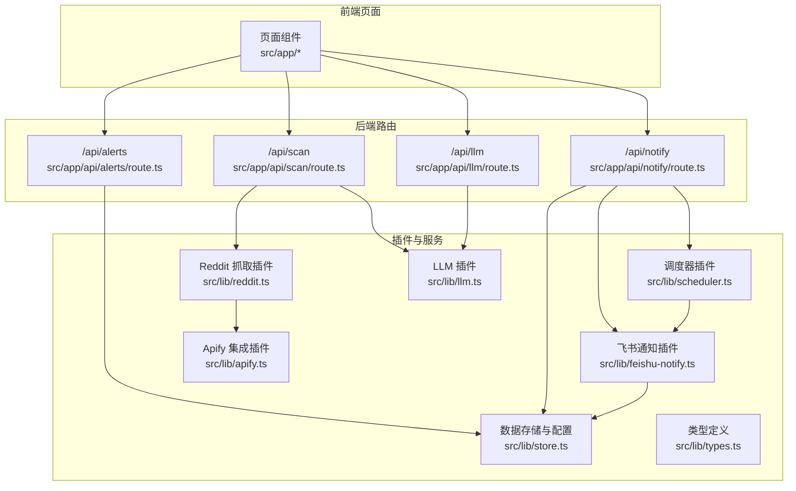
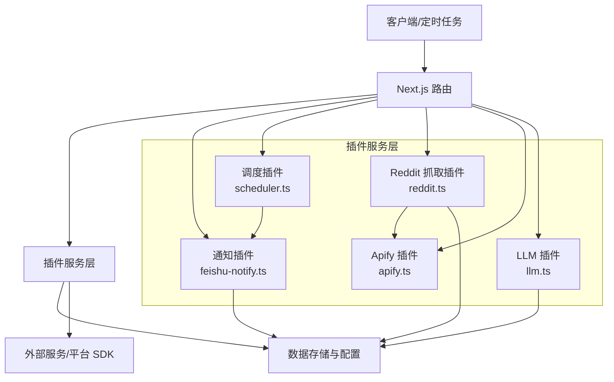
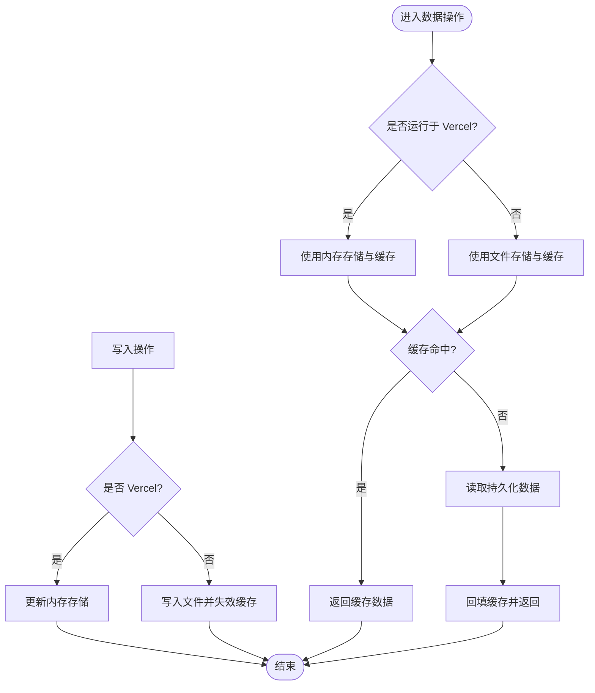
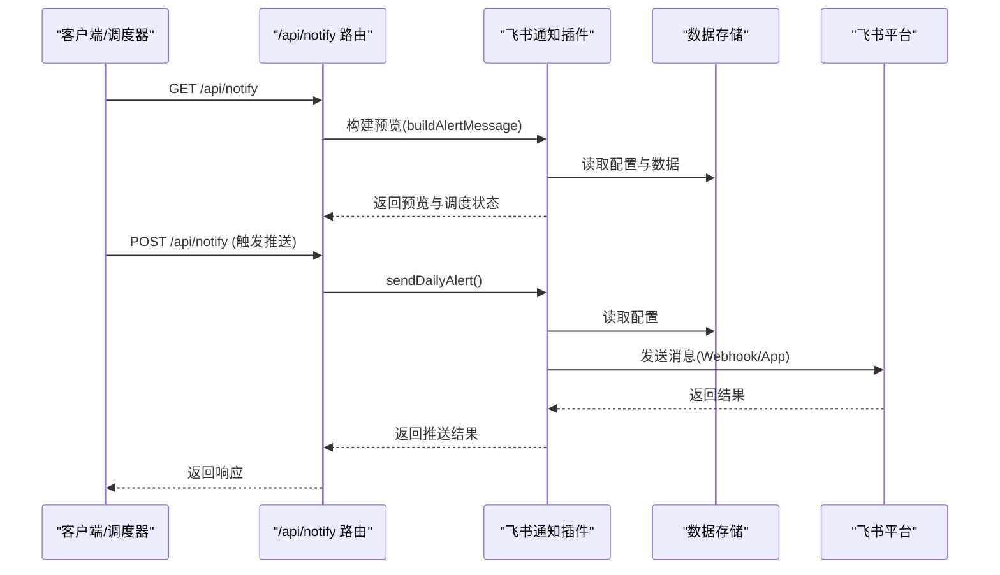
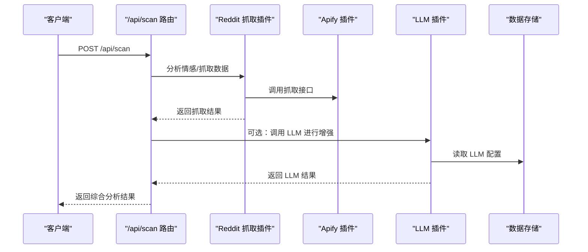
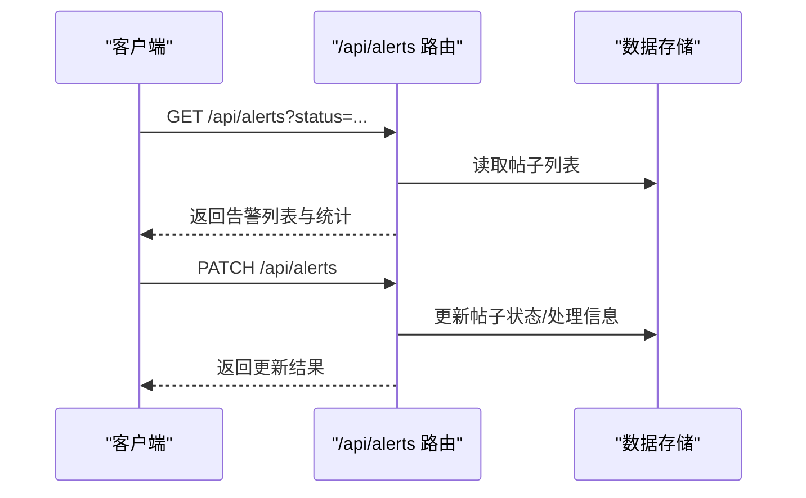
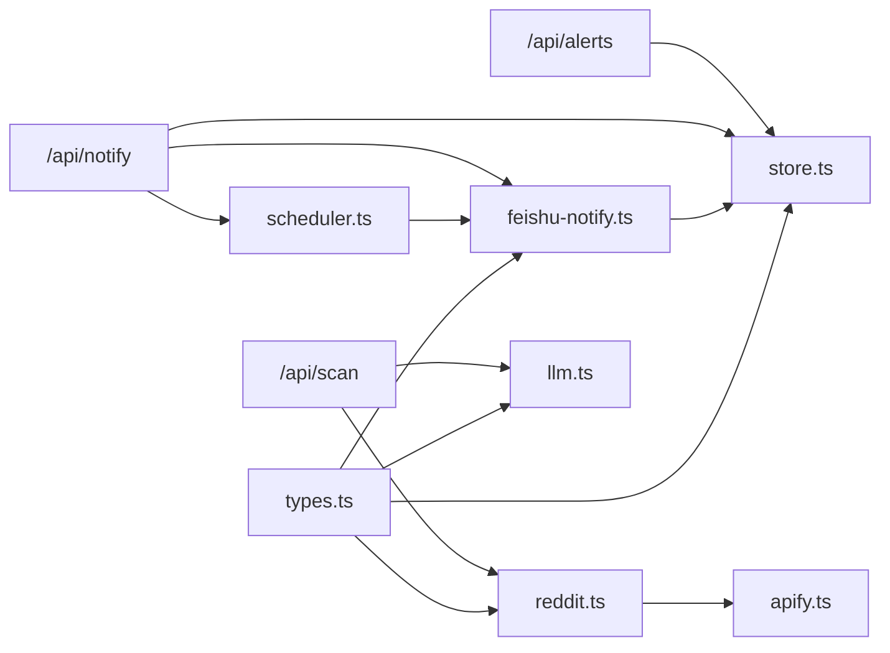

# 插件架构设计

<cite>
**本文引用的文件**
- [types.ts](file://src/lib/types.ts)
- [store.ts](file://src/lib/store.ts)
- [route.ts](file://src/app/api/alerts/route.ts)
- [feishu-notify.ts](file://src/lib/feishu-notify.ts)
- [route.ts](file://src/app/api/notify/route.ts)
- [scheduler.ts](file://src/lib/scheduler.ts)
- [apify.ts](file://src/lib/apify.ts)
- [reddit.ts](file://src/lib/reddit.ts)
- [llm.ts](file://src/lib/llm.ts)
</cite>

## 目录
1. [引言](#引言)
2. [项目结构](#项目结构)
3. [核心组件](#核心组件)
4. [架构总览](#架构总览)
5. [详细组件分析](#详细组件分析)
6. [依赖关系分析](#依赖关系分析)
7. [性能考量](#性能考量)
8. [故障排查指南](#故障排查指南)
9. [结论](#结论)
10. [附录](#附录)

## 引言
本文件面向希望基于现有系统进行“插件化扩展”的开发者，系统性阐述该系统的插件化设计理念与架构模式。重点覆盖以下方面：
- 核心类型体系与数据契约（types.ts）
- 数据持久化与配置插件接口（store.ts）
- API 路由中的插件扩展点（如通知、扫描、LLM 等）
- 插件注册机制、生命周期管理与依赖注入思路
- 插件开发标准流程（接口定义、实现规范、测试与发布）
- 实际插件示例与最佳实践

## 项目结构
该项目采用“按功能域分层 + 路由即插件入口”的组织方式：
- 类型与数据契约集中在 src/lib/types.ts
- 数据存储与配置集中在 src/lib/store.ts
- API 路由作为插件扩展点，例如通知、扫描、LLM、认证等
- 业务逻辑模块（如飞书通知、调度器、Reddit 抓取、LLM 对话）位于 src/lib 下

图表来源
- [route.ts:1-61](file://src/app/api/alerts/route.ts#L1-L61)
- [route.ts:1-44](file://src/app/api/notify/route.ts#L1-L44)
- [store.ts:1-285](file://src/lib/store.ts#L1-L285)
- [feishu-notify.ts:71-465](file://src/lib/feishu-notify.ts#L71-L465)
- [scheduler.ts](file://src/lib/scheduler.ts)
- [apify.ts](file://src/lib/apify.ts)
- [reddit.ts](file://src/lib/reddit.ts)
- [llm.ts](file://src/lib/llm.ts)

章节来源
- [types.ts:1-194](file://src/lib/types.ts#L1-L194)
- [store.ts:1-285](file://src/lib/store.ts#L1-L285)

## 核心组件
- 类型系统（types.ts）：定义了告警等级、状态、Reddit 帖子与评论、扫描结果、每日报告、飞书配置、LLM 提供商与配置、检测规则、监控配置、影响力用户、关键词趋势、子版块统计等核心数据结构。这些类型构成了所有插件的数据契约与交互边界。
- 存储与配置（store.ts）：提供统一的 CRUD 与缓存能力，支持本地文件与 Vercel 内存两种运行环境；内置默认配置与环境变量覆盖策略，形成“配置插件”能力。

章节来源
- [types.ts:1-194](file://src/lib/types.ts#L1-L194)
- [store.ts:1-285](file://src/lib/store.ts#L1-L285)

## 架构总览
系统采用“路由即插件入口 + 服务模块即插件实现”的模式：
- 路由层负责请求接入、参数解析与响应封装，是插件注册与调用的统一入口
- 服务层（store、feishu-notify、scheduler、reddit、apify、llm）以纯函数/类形式提供能力，彼此通过依赖注入（显式导入）组合
- 类型系统贯穿始终，确保插件间数据一致性与可演进性

图表来源
- [route.ts:1-44](file://src/app/api/notify/route.ts#L1-L44)
- [feishu-notify.ts:71-465](file://src/lib/feishu-notify.ts#L71-L465)
- [scheduler.ts](file://src/lib/scheduler.ts)
- [reddit.ts](file://src/lib/reddit.ts)
- [apify.ts](file://src/lib/apify.ts)
- [llm.ts](file://src/lib/llm.ts)
- [store.ts:1-285](file://src/lib/store.ts#L1-L285)

## 详细组件分析

### 组件一：数据插件接口（store.ts）
- 设计要点
  - 运行环境自适应：本地开发使用文件持久化，Vercel 使用内存存储与缓存，避免只读文件系统写入失败
  - 缓存策略：针对大文件读取设置 TTL，降低冷读成本
  - 默认配置与环境覆盖：在 Vercel 上通过环境变量动态注入配置项，形成“配置插件”
  - 数据模型：围绕帖子、评论、扫描结果、日报、配置五类数据提供统一读写接口
- 生命周期
  - 初始化：首次访问时加载/构造内存存储与默认配置
  - 访问：优先命中缓存，否则读取持久化数据并回填缓存
  - 更新：写入持久化（非 Vercel）并失效对应缓存键
- 依赖注入
  - 通过导出函数而非全局状态，便于在不同上下文（路由、定时任务）中注入与复用

图表来源
- [store.ts:1-285](file://src/lib/store.ts#L1-L285)

章节来源
- [store.ts:1-285](file://src/lib/store.ts#L1-L285)

### 组件二：通知插件（feishu-notify.ts）
- 设计要点
  - 通知内容构建：根据当前数据与配置生成文本/富文本卡片
  - 发送通道：支持 Webhook（群机器人）与应用消息（个人/群聊）
  - 测试连通性：提供测试消息发送能力
  - 与调度器协作：由调度器触发每日推送
- 生命周期
  - 预览阶段：构建预览消息，供前端展示
  - 推送阶段：根据配置选择通道并发送
  - 错误处理：捕获网络异常与平台返回码，返回明确结果
- 依赖注入
  - 通过导入 store 获取配置与数据，导入 scheduler 触发/查询调度状态

图表来源
- [route.ts:1-44](file://src/app/api/notify/route.ts#L1-L44)
- [feishu-notify.ts:71-465](file://src/lib/feishu-notify.ts#L71-L465)
- [store.ts:1-285](file://src/lib/store.ts#L1-L285)
- [scheduler.ts](file://src/lib/scheduler.ts)

章节来源
- [feishu-notify.ts:71-465](file://src/lib/feishu-notify.ts#L71-L465)
- [route.ts:1-44](file://src/app/api/notify/route.ts#L1-L44)

### 组件三：扫描与 LLM 插件（reddit.ts、apify.ts、llm.ts）
- 设计要点
  - Apify 插件：封装第三方 SDK，提供统一的抓取入口与配置校验
  - Reddit 抓取插件：基于 Apify 封装，提供帖子与子版块抓取能力
  - LLM 插件：抽象不同提供商的对话/推理接口，支持多种供应商与自定义基座
- 生命周期
  - 初始化：在路由首次调用时按需初始化（懒加载）
  - 执行：接收输入参数，调用底层 SDK 或服务，返回标准化结果
  - 错误处理：区分网络/鉴权/参数等异常，返回可诊断信息
- 依赖注入
  - 通过导入 store 获取配置与上下文，导入 apify/reddit/llm 等模块完成具体任务

图表来源
- [route.ts:5-5](file://src/app/api/scan/route.ts#L5-L5)
- [reddit.ts](file://src/lib/reddit.ts)
- [apify.ts](file://src/lib/apify.ts)
- [llm.ts](file://src/lib/llm.ts)
- [store.ts:1-285](file://src/lib/store.ts#L1-L285)

章节来源
- [apify.ts](file://src/lib/apify.ts)
- [reddit.ts](file://src/lib/reddit.ts)
- [llm.ts](file://src/lib/llm.ts)

### 组件四：告警路由插件（/api/alerts）
- 设计要点
  - 查询告警：支持按状态过滤，计算待处理/已处理等统计
  - 更新告警：支持批量更新状态、处理人、处理备注与时间
  - 与存储层解耦：通过 store 的统一接口读写数据
- 生命周期
  - 读取：从存储获取全部帖子，过滤并补全状态字段
  - 写入：更新指定帖子状态并持久化

图表来源
- [route.ts:1-61](file://src/app/api/alerts/route.ts#L1-L61)
- [store.ts:1-285](file://src/lib/store.ts#L1-L285)

章节来源
- [route.ts:1-61](file://src/app/api/alerts/route.ts#L1-L61)

## 依赖关系分析
- 路由层对服务层的依赖：路由仅通过导入服务模块暴露能力，不直接依赖外部平台
- 服务层内部依赖：通知插件依赖存储与调度器；Reddit 抓取依赖 Apify；扫描路由依赖 Reddit 与 LLM
- 类型系统贯穿：所有插件共享 types.ts 的数据契约，保证扩展点的一致性

图表来源
- [route.ts:1-61](file://src/app/api/alerts/route.ts#L1-L61)
- [route.ts:1-44](file://src/app/api/notify/route.ts#L1-L44)
- [store.ts:1-285](file://src/lib/store.ts#L1-L285)
- [feishu-notify.ts:71-465](file://src/lib/feishu-notify.ts#L71-L465)
- [scheduler.ts](file://src/lib/scheduler.ts)
- [reddit.ts](file://src/lib/reddit.ts)
- [apify.ts](file://src/lib/apify.ts)
- [llm.ts](file://src/lib/llm.ts)
- [types.ts:1-194](file://src/lib/types.ts#L1-L194)

章节来源
- [types.ts:1-194](file://src/lib/types.ts#L1-L194)
- [store.ts:1-285](file://src/lib/store.ts#L1-L285)

## 性能考量
- 缓存策略：store.ts 对大文件读取设置 TTL，减少频繁 IO；建议插件在高频读取场景复用缓存
- 环境适配：Vercel 场景禁用文件写入，使用内存存储；插件需兼容只读环境
- 并发与限流：外部服务（如飞书、Apify、LLM）可能有限流，插件应具备重试与退避策略
- 数据规模：当数据量增长时，建议分页查询与增量更新，避免一次性加载全量数据

## 故障排查指南
- 配置问题
  - 检查 store.ts 的默认配置与环境变量覆盖逻辑，确认关键字段（如 Webhook URL、LLM 凭证）已正确注入
- 通知失败
  - 使用 feishu-notify.ts 的测试接口验证连通性；检查飞书平台返回码与消息格式
- 调度异常
  - 通过 /api/notify 路由获取调度状态，确认定时任务是否正常触发
- 外部服务错误
  - Apify/LLM 插件需捕获网络异常与鉴权错误，返回可诊断信息；必要时开启更详细的日志

章节来源
- [store.ts:235-284](file://src/lib/store.ts#L235-L284)
- [feishu-notify.ts:440-465](file://src/lib/feishu-notify.ts#L440-L465)
- [route.ts:1-44](file://src/app/api/notify/route.ts#L1-L44)

## 结论
该系统通过“路由即插件入口 + 服务模块即插件实现”的架构，结合统一类型系统与可插拔的存储/配置能力，形成了清晰的插件化扩展路径。开发者可在不破坏既有契约的前提下，新增路由与服务模块，快速实现新的业务能力（如新通知渠道、新分析算法、新数据源等）。

## 附录

### 插件开发标准流程
- 接口定义
  - 在 types.ts 中定义插件所需的数据结构与枚举，确保与现有类型兼容
- 实现规范
  - 将插件逻辑封装为独立模块，通过显式导入依赖 store、其他插件或外部 SDK
  - 提供初始化/懒加载机制，避免阻塞主流程
  - 统一错误处理与返回结构，便于路由层聚合
- 注册与集成
  - 在路由层新增或复用现有路由，调用插件模块并返回标准化响应
  - 如涉及定时任务，通过 scheduler.ts 注册与管理
- 测试要求
  - 单元测试：覆盖关键分支与边界条件（如空数据、错误码）
  - 集成测试：模拟路由调用，验证端到端流程（含 store 与外部服务）
  - 回归测试：在类型变更或配置覆盖逻辑调整后执行
- 发布流程
  - 代码审查：确保类型契约、错误处理与性能指标达标
  - 配置校验：在 Vercel 环境验证配置覆盖与只读文件系统兼容性
  - 文档更新：补充插件使用说明与配置项清单

### 插件示例与最佳实践
- 示例参考
  - 通知插件：参考 feishu-notify.ts 的消息构建与发送流程
  - 调度插件：参考 scheduler.ts 的初始化与状态查询
  - 数据插件：参考 store.ts 的缓存与环境适配
  - 外部集成：参考 apify.ts、reddit.ts、llm.ts 的封装模式
- 最佳实践
  - 保持无副作用：插件尽量只做单一职责，避免隐式依赖
  - 明确错误语义：对外暴露可诊断的错误信息与状态码
  - 可观测性：记录关键事件与耗时，便于定位性能瓶颈
  - 版本兼容：在 types.ts 中以向后兼容的方式演进类型