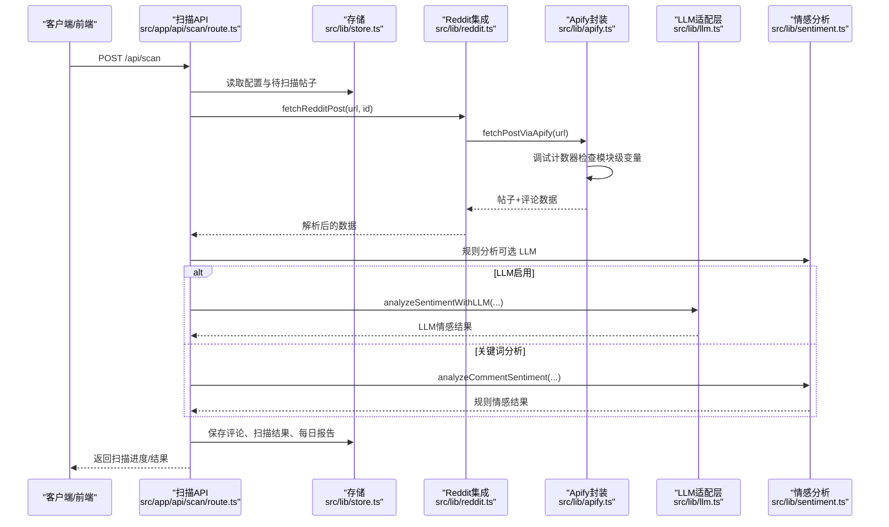
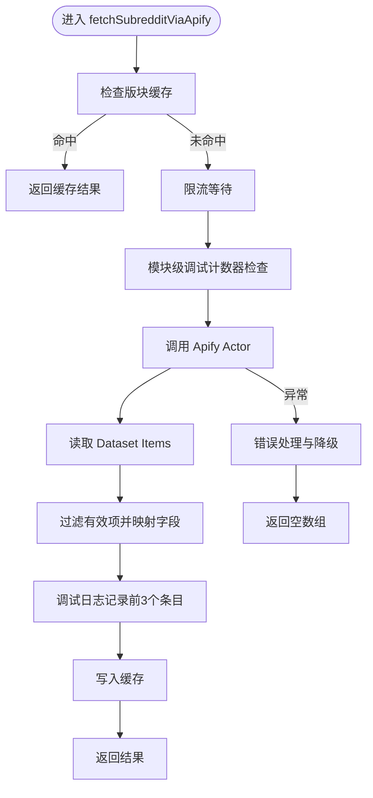
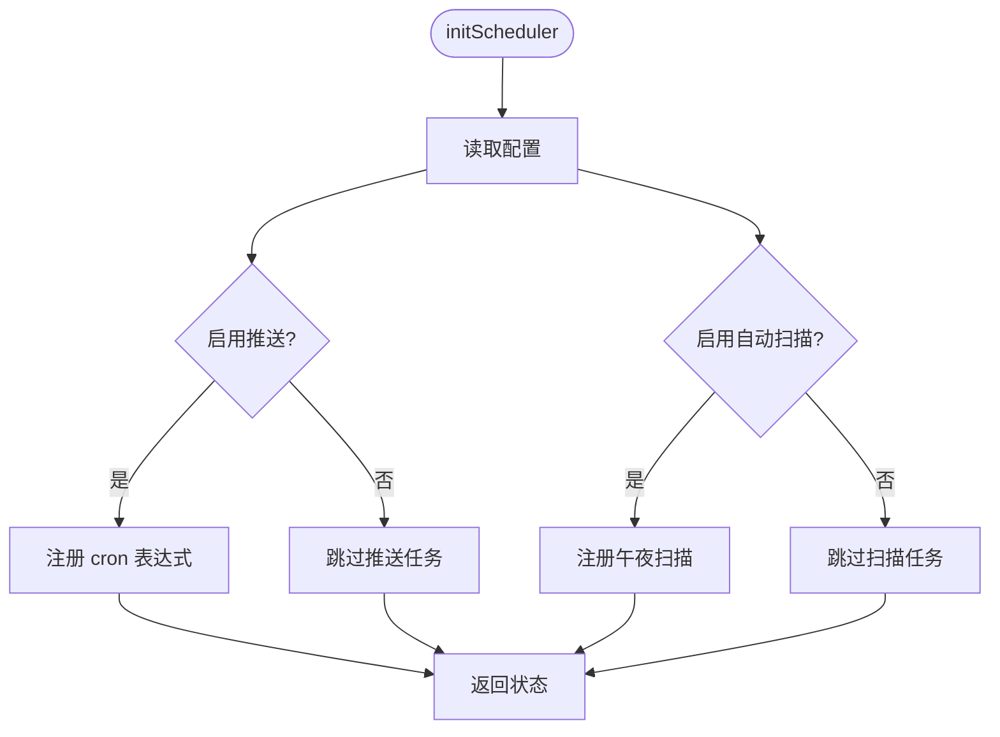
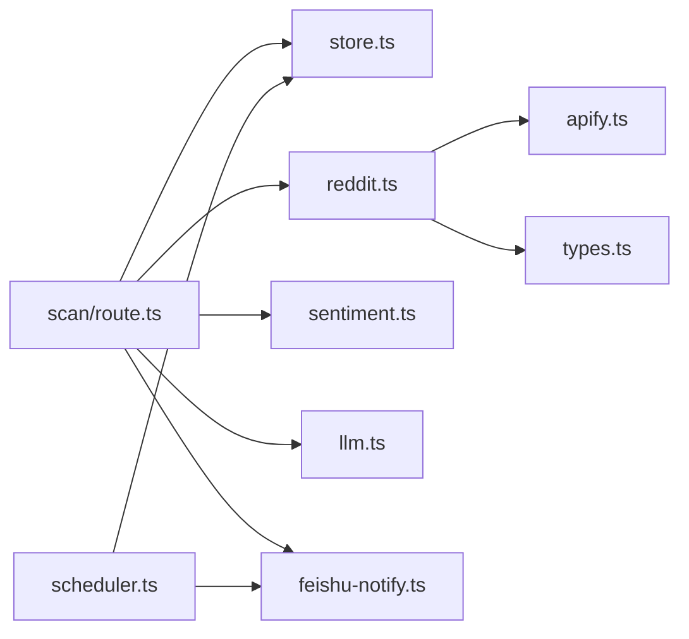

# 第三方平台集成

<cite>
**本文引用的文件**
- [README.md](file://README.md)
- [package.json](file://package.json)
- [apify.ts](file://src/lib/apify.ts)
- [reddit.ts](file://src/lib/reddit.ts)
- [scheduler.ts](file://src/lib/scheduler.ts)
- [types.ts](file://src/lib/types.ts)
- [store.ts](file://src/lib/store.ts)
- [scan/route.ts](file://src/app/api/scan/route.ts)
- [feishu-notify.ts](file://src/lib/feishu-notify.ts)
- [sentiment.ts](file://src/lib/sentiment.ts)
- [llm.ts](file://src/lib/llm.ts)
- [config.json](file://data/config.json)
- [feishu.ts](file://src/lib/feishu.ts)
- [import/route.ts](file://src/app/api/import/route.ts)
</cite>

## 更新摘要
**变更内容**
- 新增调试计数器机制，用于监控 Apify 数据转换过程中的字段映射
- 增强多字段命名支持，提升第三方平台数据集成的灵活性
- 改进错误处理机制，提供更详细的调试信息和降级策略
- 优化可观测性设计，增强第三方平台集成的监控能力
- **更新** Apify 调试计数器实现重构：使用模块级变量替代函数静态属性，提升调试计数器的可靠性和作用域管理

## 目录
1. [简介](#简介)
2. [项目结构](#项目结构)
3. [核心组件](#核心组件)
4. [架构概览](#架构概览)
5. [详细组件分析](#详细组件分析)
6. [依赖关系分析](#依赖关系分析)
7. [性能考虑](#性能考虑)
8. [故障排查指南](#故障排查指南)
9. [结论](#结论)
10. [附录](#附录)

## 简介
本文件面向需要扩展 Apify 爬虫引擎以支持新数据源的开发者，提供从爬虫配置、数据转换、错误处理到调度器扩展与 OAuth 集成的完整开发指南。重点覆盖：
- 如何基于现有 Apify 集成扩展新的数据源（Reddit API 与第三方平台）
- 新 API 端点的集成流程与数据模型适配
- 调度器扩展机制，支持新的定时任务类型与执行策略
- OAuth 认证、API 限流处理与数据同步策略
- 完整的配置、测试与部署流程

**更新** 本版本增强了调试能力，新增调试计数器机制、多字段命名支持和错误处理增强，显著提升了第三方平台集成的可观测性和可靠性。**调试计数器现已重构为模块级变量实现，提供更好的作用域管理和调试稳定性。**

## 项目结构
该项目采用 Next.js 应用结构，核心业务逻辑集中在 src/lib 下，API 路由位于 src/app/api。数据持久化采用本地文件存储（开发环境）与内存存储（Vercel）。关键目录与文件如下：
- src/lib：核心库（Apify 集成、Reddit 数据抓取、调度器、情感分析、LLM 适配层、存储与类型定义）
- src/app/api：REST API 路由（如扫描、通知、关键词、子版块等）
- data：本地数据文件（posts、comments、scans、config、reports 等）

```mermaid
graph TB
subgraph "应用层"
UI["前端页面<br/>Next.js App Router"]
API["API 路由<br/>src/app/api/*"]
end
subgraph "业务逻辑层"
REDDIT["Reddit 数据集成<br/>src/lib/reddit.ts"]
APIFY["Apify 客户端封装<br/>src/lib/apify.ts"]
SCHED["调度器<br/>src/lib/scheduler.ts"]
STORE["数据存储<br/>src/lib/store.ts"]
SENT["情感分析<br/>src/lib/sentiment.ts"]
LLM["LLM 适配层<br/>src/lib/llm.ts"]
FEISHU["飞书通知<br/>src/lib/feishu-notify.ts"]
END
subgraph "数据与配置"
CFG["配置文件<br/>data/config.json"]
DATA["本地数据文件<br/>data/*.json"]
end
UI --> API
API --> REDDIT
REDDIT --> APIFY
API --> STORE
API --> SENT
API --> LLM
API --> FEISHU
SCHED --> FEISHU
STORE --> DATA
CFG --> STORE
```

**图表来源**
- [apify.ts:1-503](file://src/lib/apify.ts#L1-L503)
- [reddit.ts:1-94](file://src/lib/reddit.ts#L1-L94)
- [scheduler.ts:1-133](file://src/lib/scheduler.ts#L1-L133)
- [store.ts:1-285](file://src/lib/store.ts#L1-L285)
- [scan/route.ts:1-408](file://src/app/api/scan/route.ts#L1-L408)
- [feishu-notify.ts:1-482](file://src/lib/feishu-notify.ts#L1-L482)
- [sentiment.ts:1-398](file://src/lib/sentiment.ts#L1-L398)
- [llm.ts:1-338](file://src/lib/llm.ts#L1-L338)
- [config.json:1-57](file://data/config.json#L1-L57)

**章节来源**
- [README.md:1-37](file://README.md#L1-L37)
- [package.json:1-38](file://package.json#L1-L38)

## 核心组件
- Apify 集成（apify.ts）：封装 Apify 客户端、Actor 调用、缓存与限流；支持按 URL 抓取单帖及评论、按版块抓取帖子列表。**新增调试计数器机制**，用于监控数据转换过程。
- Reddit 数据集成（reddit.ts）：统一入口，协调 Apify 与 Reddit .json 端点；提供批量抓取与随机抽样。
- 存储与配置（store.ts）：本地文件存储与内存存储双模式；支持缓存、默认配置与环境变量覆盖。
- 调度器（scheduler.ts）：基于 node-cron 的计划任务管理，支持每日推送与午夜自动扫描。
- 情感分析与 LLM（sentiment.ts、llm.ts）：规则驱动与 LLM 双通道情感分析；统一 LLM 适配层支持多家供应商。
- API 路由（scan/route.ts）：扫描主流程，聚合数据、执行分析、生成报告与持久化。

**更新** Apify 组件现在具备增强的调试能力，包括模块级调试计数器和多字段命名支持。

**章节来源**
- [apify.ts:1-503](file://src/lib/apify.ts#L1-L503)
- [reddit.ts:1-94](file://src/lib/reddit.ts#L1-L94)
- [store.ts:1-285](file://src/lib/store.ts#L1-L285)
- [scheduler.ts:1-133](file://src/lib/scheduler.ts#L1-L133)
- [sentiment.ts:1-398](file://src/lib/sentiment.ts#L1-L398)
- [llm.ts:1-338](file://src/lib/llm.ts#L1-L338)
- [scan/route.ts:1-408](file://src/app/api/scan/route.ts#L1-L408)

## 架构概览
系统围绕"数据采集—分析—通知—存储—调度"的闭环构建。Apify Actor 作为主要数据源，Reddit .json 端点用于单帖补充；情感分析与 LLM 结合实现精准标注；调度器负责自动化执行与通知；配置中心统一管理通知、检测规则与 LLM 参数。



**图表来源**
- [scan/route.ts:21-408](file://src/app/api/scan/route.ts#L21-L408)
- [reddit.ts:10-24](file://src/lib/reddit.ts#L10-L24)
- [apify.ts:184-503](file://src/lib/apify.ts#L184-L503)
- [sentiment.ts:150-244](file://src/lib/sentiment.ts#L150-L244)
- [llm.ts:241-273](file://src/lib/llm.ts#L241-L273)

## 详细组件分析

### Apify 扩展：新增数据源接入与调试增强

**更新** Apify 组件现在具备增强的调试能力和多字段命名支持，调试计数器已重构为模块级变量实现。

- 配置与限流
  - 使用环境变量 APIFY_TOKEN 初始化客户端；内置最小请求间隔与 TTL 缓存。
  - 版块抓取使用 RESIDENTIAL 代理，单帖抓取 Actor 自带代理。
- Actor 调用
  - 版块列表：调用 spry_wholemeal/reddit-scraper，支持 sort/timeframe/includeCommentsMode。
  - 单帖详情：调用 neatrat/reddit-scraper，支持 pages/maxCommentsPerPost/requestTimeoutSecs。
- 数据转换与调试增强
  - 统一映射字段（id/title/author/score/commentCount/subreddit/createdAt/permalink/selftext/comments）。
  - **模块级调试计数器机制**：在 normalizeApifyItem 函数中实现 _debugCount 模块级变量，自动记录前 3 个帖子的调试信息。
  - 递归提取评论树，构造扁平化评论列表。
- 错误处理与降级策略
  - 捕获异常并返回空结果或 null，避免中断流程；记录警告日志。
  - **增强的错误降级**：当 Apify 服务不可用时，提供详细的错误信息和降级路径。



**图表来源**
- [apify.ts:102-176](file://src/lib/apify.ts#L102-L176)
- [apify.ts:105-118](file://src/lib/apify.ts#L105-L118)

**章节来源**
- [apify.ts:1-503](file://src/lib/apify.ts#L1-L503)

### 模块级调试计数器实现重构

**新增** 调试计数器已从函数静态属性重构为模块级变量，提供更好的作用域管理和调试稳定性。

- 实现位置
  - 在模块顶部声明：`let _debugCount = 0;`
  - 作为模块级变量在整个模块范围内共享
- 调试功能
  - 仅记录前 3 个帖子的调试信息，避免过度日志输出
  - 输出原始数据字段值（score、num_comments、upvotes、estimated_upvotes）
  - 用于监控数据转换过程中的字段映射情况
- 优势
  - 更好的作用域管理：避免函数调用间的状态污染
  - 稳定的计数器状态：不会因函数重置而丢失计数
  - 更清晰的调试输出：每个模块实例都有独立的调试计数器

**章节来源**
- [apify.ts:105-118](file://src/lib/apify.ts#L105-L118)

### 多字段命名支持：增强第三方平台集成能力

**新增** 为了支持更多第三方平台的数据源，系统现在具备强大的多字段命名支持能力。

- 字段映射增强
  - 支持多种字段命名变体（score/upvotes/estimated_upvotes）的自动识别与映射。
  - **多字段命名支持**：normalizeApifyItem 函数能够处理不同来源的数据字段差异。
- 第三方平台适配
  - 通过 extractStringField 和 extractUrlField 函数支持多种数据类型的字段提取。
  - 支持 URL 类型字段（对象形式包含 link 和 text 属性）的解析。
  - 支持数组类型字段的多值提取和处理。
- 配置灵活性
  - 通过 urlFieldName 配置支持自定义字段名称。
  - 支持中文表头和英文表头的混合使用。

**章节来源**
- [apify.ts:104-137](file://src/lib/apify.ts#L104-L137)
- [feishu.ts:297-305](file://src/lib/feishu.ts#L297-L305)
- [feishu.ts:166-194](file://src/lib/feishu.ts#L166-L194)

### Reddit API 扩展：新版端点集成
- 单帖抓取
  - 优先使用 Apify Actor；若 Apify 未配置，则可扩展为直接调用 Reddit .json 端点。
  - 保持与现有数据模型一致，确保字段映射与评论树提取逻辑兼容。
- 批量抓取
  - 在 fetchMultiplePosts 中加入速率限制与进度回调，支持大规模数据同步。
- 随机抽样
  - 使用 selectRandomPosts 控制样本规模，便于测试与性能优化。

**章节来源**
- [reddit.ts:10-94](file://src/lib/reddit.ts#L10-L94)

### 数据模型适配与转换
- 类型定义
  - RedditPost、RedditComment、ScanResult、DailyScanReport 等核心类型统一管理。
  - AlertLevel 兼容旧数据（high→critical，low→safe）。
- 字段映射
  - Apify 输出字段与内部类型字段一一对应；缺失字段使用默认值或占位符。
  - **增强的字段映射**：支持多种字段命名变体的自动识别与转换。
- 评论树处理
  - 递归遍历 children，扁平化输出，保留回复关系以便后续可视化。

**章节来源**
- [types.ts:1-194](file://src/lib/types.ts#L1-L194)
- [apify.ts:222-503](file://src/lib/apify.ts#L222-L503)

### 调度器扩展：新增定时任务与策略
- 当前能力
  - 基于 node-cron 的每日推送与午夜自动扫描；支持配置开关与时间设置。
- 扩展建议
  - 新增任务类型：周期性导出报表、清理历史数据、增量同步第三方平台。
  - 执行策略：并发控制（避免多个任务冲突）、失败重试（指数退避）、资源隔离（独立队列）。
  - 配置管理：在 config.json 中新增任务配置段，动态加载与热更新。



**图表来源**
- [scheduler.ts:63-100](file://src/lib/scheduler.ts#L63-L100)

**章节来源**
- [scheduler.ts:1-133](file://src/lib/scheduler.ts#L1-L133)
- [config.json:1-57](file://data/config.json#L1-L57)

### OAuth 认证与第三方平台对接
- 飞书 OAuth（参考）
  - 用户授权流程：获取 accessToken、refreshToken、openId/unionId，设置过期时间与授权时间。
  - 跨租户访问：通过 externalDocType、externalAppToken、externalTableId 指向目标文档。
- 第三方平台对接步骤
  - 注册应用并获取 ClientId/ClientSecret；
  - 实现授权回调路由，交换 access_token；
  - 保存令牌与过期时间，定期刷新；
  - 通过令牌调用平台 API，遵循其限流策略；
  - 将返回数据映射到 RedditPost/RedditComment 类型，写入存储。

**章节来源**
- [types.ts:85-103](file://src/lib/types.ts#L85-L103)
- [feishu-notify.ts:352-413](file://src/lib/feishu-notify.ts#L352-L413)

### API 限流与稳定性保障
- Apify 层限流
  - 最小请求间隔 2 秒；缓存 TTL：版块 10 分钟、帖子 30 分钟。
- 扫描层限流
  - Reddit 请求间隔 3 秒；LLM 请求间隔 500ms；关键词分析间隔 300ms。
- 异常处理与降级
  - 捕获错误并记录，失败不中断整体流程；对 LLM 失败进行关键词回退。
  - **增强的降级策略**：当 LLM 服务不可用时，自动切换到关键词分析模式。

**章节来源**
- [apify.ts:37-50](file://src/lib/apify.ts#L37-L50)
- [apify.ts:102-176](file://src/lib/apify.ts#L102-L176)
- [scan/route.ts:291-294](file://src/app/api/scan/route.ts#L291-L294)
- [llm.ts:299-303](file://src/lib/llm.ts#L299-L303)

### 数据同步策略
- 增量扫描
  - 仅扫描近 3 个月内的帖子；根据 nextScanTime 实施智能延迟。
- 冷却策略
  - 近期扫描过的帖子跳过（当前版本 skipHours=0，可按需启用）。
- 成功/失败标记
  - 更新 lastScanned 与 scanError，避免重复告警。

**章节来源**
- [scan/route.ts:50-114](file://src/app/api/scan/route.ts#L50-L114)
- [scan/route.ts:150-161](file://src/app/api/scan/route.ts#L150-L161)

### 测试与验证
- 单元测试
  - 使用 test-reddit-*.js 与 test-scan.js 验证抓取、分析与扫描流程。
- 端到端测试
  - 通过 API 路由 POST /api/scan 发起扫描，GET /api/scan 查询进度，DELETE /api/scan 停止扫描。
- 配置校验
  - 检查 data/config.json 中 feishuNotify、llm、detectionRules 等字段。

**章节来源**
- [scan/route.ts:381-408](file://src/app/api/scan/route.ts#L381-L408)

### 部署与运维
- 开发与生产
  - 本地开发使用 npm/yarn/pnpm/bun；生产部署至 Vercel。
- 环境变量
  - Vercel 环境变量覆盖 store.ts 中的默认配置（如 FEISHU_WEBHOOK_URL、LLM_*、TUNNEL_URL）。
- Docker 与脚本
  - 提供 Dockerfile、deploy.sh、sync-aws-to-git.sh 等脚本辅助部署与数据同步。

**章节来源**
- [store.ts:235-284](file://src/lib/store.ts#L235-L284)
- [package.json:1-38](file://package.json#L1-L38)

## 依赖关系分析
- 外部依赖
  - apify-client：调用 Apify Actor 与 Dataset。
  - node-cron：计划任务调度。
  - react、next：前端与服务端渲染框架。
- 内部模块耦合
  - scan/route.ts 依赖 store.ts、reddit.ts、sentiment.ts、llm.ts、feishu-notify.ts。
  - reddit.ts 依赖 apify.ts 与 types.ts。
  - scheduler.ts 依赖 store.ts 与 feishu-notify.ts。



**图表来源**
- [scan/route.ts:1-8](file://src/app/api/scan/route.ts#L1-L8)
- [reddit.ts:5-8](file://src/lib/reddit.ts#L5-L8)
- [apify.ts:6-7](file://src/lib/apify.ts#L6-L7)
- [scheduler.ts:5-7](file://src/lib/scheduler.ts#L5-L7)

**章节来源**
- [scan/route.ts:1-408](file://src/app/api/scan/route.ts#L1-L408)
- [reddit.ts:1-94](file://src/lib/reddit.ts#L1-L94)
- [apify.ts:1-503](file://src/lib/apify.ts#L1-L503)
- [scheduler.ts:1-133](file://src/lib/scheduler.ts#L1-L133)

## 性能考虑
- 缓存策略
  - 版块与帖子缓存降低重复请求；合理设置 TTL 平衡新鲜度与成本。
- 限流与退避
  - 固定间隔与指数退避结合，避免触发第三方限流。
- 批量与并发
  - 批量处理与串行限流相结合；对 LLM 与网络请求分别限速。
- 存储优化
  - 本地开发使用文件存储，Vercel 使用内存存储；缓存最近访问数据减少 IO。
- **调试开销控制**
  - 模块级调试计数器限制在前 3 个条目，避免过度的日志输出影响性能。
  - **更新** 模块级变量实现提供更好的调试性能和稳定性。

## 故障排查指南
- Apify 配置问题
  - 确认 APIFY_TOKEN 是否设置；检查 Actor 输入参数与代理配置。
- 网络与限流
  - 观察请求间隔与返回码；必要时调整 MIN_REQUEST_INTERVAL。
- LLM 连接失败
  - 使用 llm.ts 的 testLLMConnection 检查提供商连通性与响应格式。
- 通知失败
  - 使用 feishu-notify.ts 的 testFeishuNotify 检查 Webhook/App 凭证与 Token 获取。
- 扫描中断
  - 通过 DELETE /api/scan 触发停止；检查 scan/route.ts 中的 stopRequested 标志。
- **调试信息查看**
  - 查看 normalizeApifyItem 函数输出的调试日志，了解字段映射情况。
  - **更新** 检查模块级调试计数器状态，确认前 3 个条目的调试信息。
  - **模块级调试计数器**：由于已重构为模块级变量，调试计数器会在模块加载时初始化，提供稳定的调试状态。

**更新** 新增模块级调试计数器和多字段命名支持的故障排查指导。

**章节来源**
- [apify.ts:54-66](file://src/lib/apify.ts#L54-L66)
- [llm.ts:309-337](file://src/lib/llm.ts#L309-L337)
- [feishu-notify.ts:440-481](file://src/lib/feishu-notify.ts#L440-L481)
- [scan/route.ts:385-408](file://src/app/api/scan/route.ts#L385-L408)

## 结论
通过本指南，您可以基于现有 Apify 与 Reddit 集成，快速扩展新的数据源与 API 端点，完善调度器与通知体系，并在 OAuth、限流与数据同步方面建立稳健的工程实践。**新增的调试计数器机制、多字段命名支持和增强的错误处理**显著提升了系统的可观测性和第三方平台集成的可靠性。**模块级调试计数器重构提供了更好的作用域管理和调试稳定性**。建议在扩展过程中遵循统一的数据模型、严格的错误处理与可观测性设计，确保系统在高并发与多平台环境下稳定运行。

## 附录

### 配置文件修改清单
- data/config.json
  - feishuNotify：启用/禁用、Webhook 地址、推送时间、推送级别
  - llm：启用/禁用、提供商、API Key、模型、基础 URL、最大 Token、温度
  - detectionRules：品牌攻击、产品差评、负面情绪、号召抵制、竞品推荐
  - autoScanEnabled、scanTime：自动扫描开关与时间
  - 其他：keywords、sentimentThreshold、tunnelUrl 等

**章节来源**
- [config.json:1-57](file://data/config.json#L1-L57)

### 数据模型适配要点
- RedditPost：id、redditUrl、title、subreddit、author、score、commentCount、createdAt、lastScanned、alertLevel、alertReasons、thumbnailUrl、summary、alertStatus、handler、handleTime、handleNote、scanError、nextScanTime
- RedditComment：id、postId、author、body、score、createdAt、sentimentScore、isFlagged、flagReasons、permalink、influenceScore、replies
- ScanResult：postId、scanTime、totalComments、flaggedComments、alertLevel、sentimentSummary、topFlaggedComments
- DailyScanReport：date、totalPosts、totalComments、flaggedComments、criticalAlerts、highAlerts、mediumAlerts、safePosts、sentimentTrend

**章节来源**
- [types.ts:9-75](file://src/lib/types.ts#L9-L75)

### 测试验证清单
- 单元测试：test-reddit-*.js、test-scan.js
- 端到端：/api/scan 的 POST/GET/DELETE
- 配置校验：data/config.json 字段完整性

**章节来源**
- [scan/route.ts:21-408](file://src/app/api/scan/route.ts#L21-L408)

### 调试与监控增强功能

**新增** 以下功能增强了系统的可观测性：

- **模块级调试计数器机制**
  - 在模块顶部声明：`let _debugCount = 0;`
  - 作为模块级变量在整个模块范围内共享，提供稳定的调试状态
  - 自动记录前 3 个帖子的调试信息，包括标题、分数、评论数等
  - 用于监控数据转换过程中的字段映射情况
  - **重构优势**：相比函数静态属性，模块级变量提供更好的作用域管理和调试稳定性

- **多字段命名支持**
  - 支持多种字段命名变体的自动识别（score/upvotes/estimated_upvotes）
  - 增强的字段映射函数，处理不同来源的数据差异
  - 提升第三方平台数据集成的灵活性

- **增强的错误处理**
  - 详细的错误降级策略，确保系统稳定性
  - 完善的调试日志输出，便于问题定位
  - 支持多种数据类型的字段提取和处理

**章节来源**
- [apify.ts:105-118](file://src/lib/apify.ts#L105-L118)
- [apify.ts:104-137](file://src/lib/apify.ts#L104-L137)
- [feishu.ts:297-305](file://src/lib/feishu.ts#L297-L305)
- [feishu.ts:166-194](file://src/lib/feishu.ts#L166-L194)