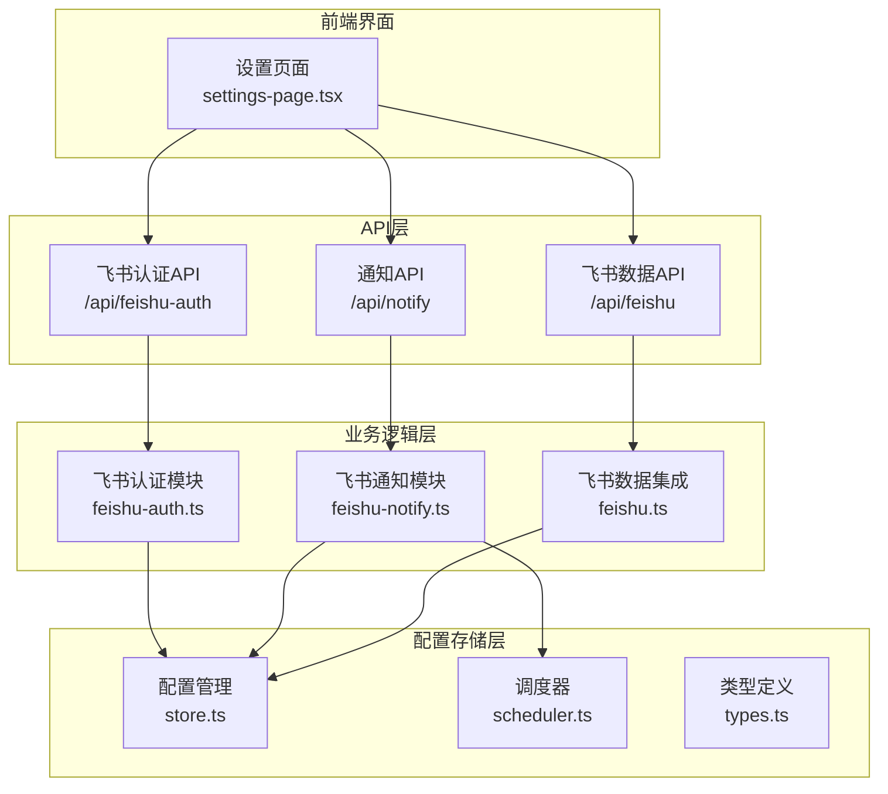
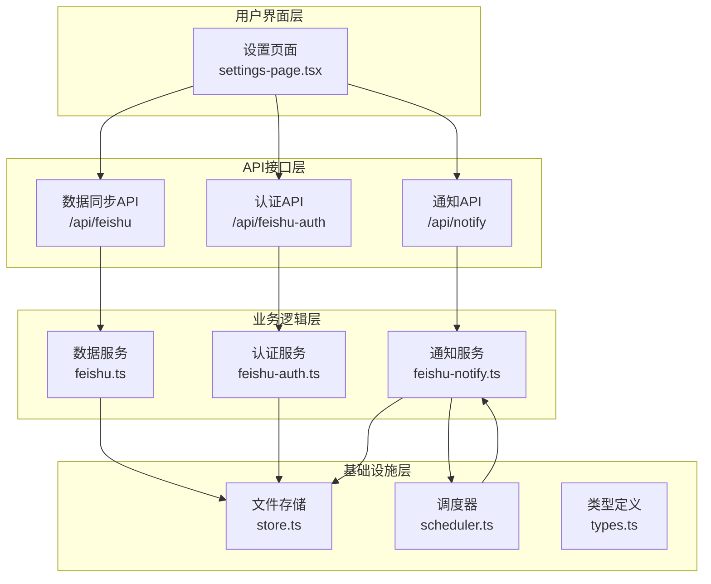
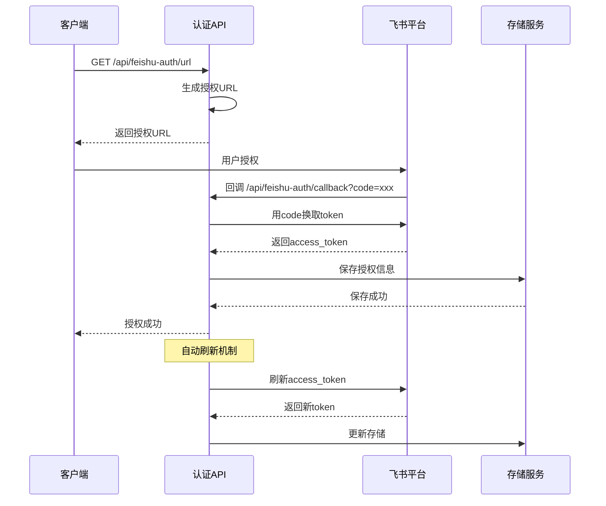
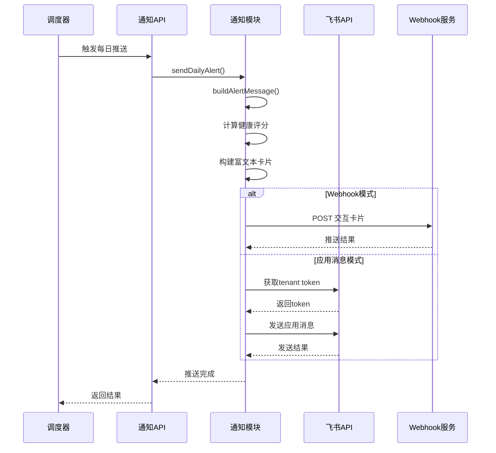
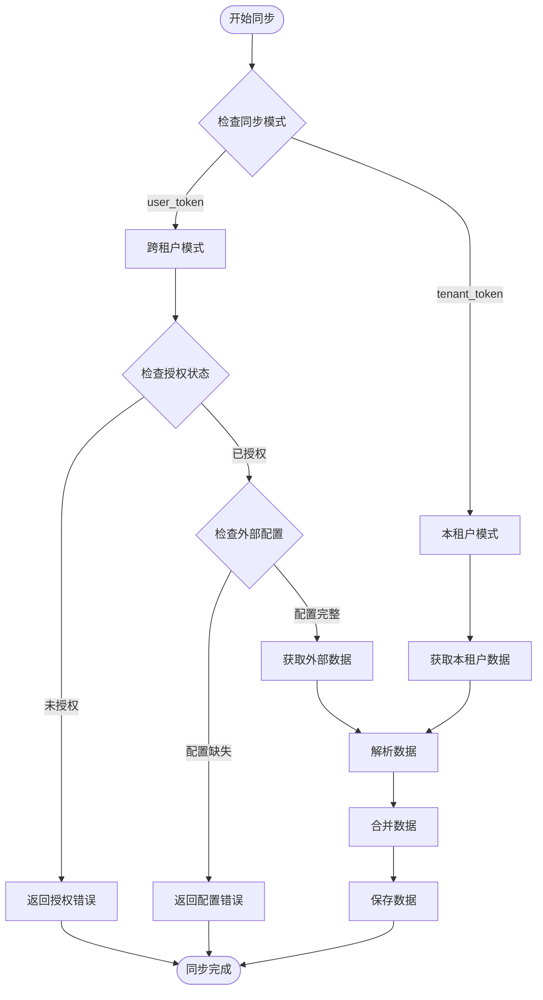
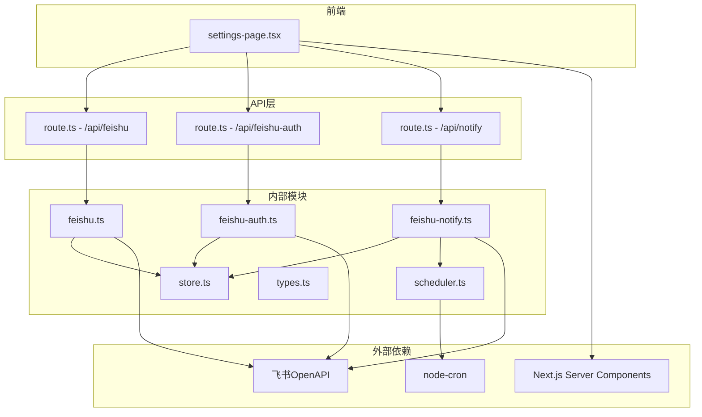

# 通知系统扩展

<cite>
**本文档引用的文件**
- [feishu.ts](file://src/lib/feishu.ts)
- [feishu-notify.ts](file://src/lib/feishu-notify.ts)
- [feishu-auth.ts](file://src/lib/feishu-auth.ts)
- [route.ts](file://src/app/api/feishu/route.ts)
- [route.ts](file://src/app/api/feishu-auth/callback/route.ts)
- [route.ts](file://src/app/api/feishu-auth/status/route.ts)
- [route.ts](file://src/app/api/notify/route.ts)
- [types.ts](file://src/lib/types.ts)
- [store.ts](file://src/lib/store.ts)
- [scheduler.ts](file://src/lib/scheduler.ts)
- [settings-page.tsx](file://src/app/settings/settings-page.tsx)
</cite>

## 目录
1. [简介](#简介)
2. [项目结构](#项目结构)
3. [核心组件](#核心组件)
4. [架构概览](#架构概览)
5. [详细组件分析](#详细组件分析)
6. [依赖关系分析](#依赖关系分析)
7. [性能考虑](#性能考虑)
8. [故障排除指南](#故障排除指南)
9. [结论](#结论)
10. [附录](#附录)

## 简介

本文档为通知系统扩展的全面开发指南，专注于飞书通知系统的架构设计和扩展方法。该系统提供了完整的品牌声誉监控和预警通知功能，支持多种通知渠道集成。

通知系统采用模块化设计，主要包括三个核心模块：
- **飞书认证模块**：处理OAuth 2.0授权流程和用户令牌管理
- **飞书通知模块**：负责告警消息构建和发送
- **飞书数据集成模块**：提供飞书Bitable和Sheet的数据同步能力

系统支持两种通知模式：Webhook群机器人和应用消息个人推送，同时具备自动调度和手动触发功能。

## 项目结构

通知系统在项目中的组织结构如下：



**图表来源**
- [route.ts:1-250](file://src/app/api/feishu/route.ts#L1-L250)
- [feishu-auth.ts:1-416](file://src/lib/feishu-auth.ts#L1-L416)
- [feishu-notify.ts:1-482](file://src/lib/feishu-notify.ts#L1-L482)

**章节来源**
- [route.ts:1-250](file://src/app/api/feishu/route.ts#L1-L250)
- [feishu-auth.ts:1-416](file://src/lib/feishu-auth.ts#L1-L416)
- [feishu-notify.ts:1-482](file://src/lib/feishu-notify.ts#L1-L482)

## 核心组件

### 飞书认证组件 (feishu-auth.ts)

飞书认证组件实现了完整的OAuth 2.0授权流程，支持跨租户访问外部飞书文档。

**核心功能**：
- OAuth授权URL生成
- 授权码换取令牌
- 令牌自动刷新
- 用户信息获取
- 授权状态管理

**关键特性**：
- 支持user_access_token和tenant_access_token两种访问模式
- 内存缓存机制优化性能
- 自动令牌刷新机制
- CSRF保护机制

### 飞书通知组件 (feishu-notify.ts)

飞书通知组件负责构建和发送告警消息，支持富文本交互卡片格式。

**核心功能**：
- 告警消息构建
- 健康评分计算
- 富文本卡片生成
- Webhook和应用消息发送
- 通知预览功能

**消息格式**：
- 纯文本摘要版本
- 富文本交互卡片
- 支持按钮和链接
- 实时数据更新

### 飞书数据集成 (feishu.ts)

飞书数据集成组件提供飞书Bitable和Sheet的数据同步能力。

**核心功能**：
- Bitable记录获取
- Sheet数据读取
- 数据转换和映射
- 分页数据处理
- URL提取和验证

**支持的数据源**：
- 本租户文档（tenant_access_token）
- 外部租户文档（user_access_token）

**章节来源**
- [feishu-auth.ts:1-416](file://src/lib/feishu-auth.ts#L1-L416)
- [feishu-notify.ts:1-482](file://src/lib/feishu-notify.ts#L1-L482)
- [feishu.ts:1-448](file://src/lib/feishu.ts#L1-L448)

## 架构概览

通知系统的整体架构采用分层设计，确保各组件职责清晰、耦合度低。



**图表来源**
- [settings-page.tsx:1-1430](file://src/app/settings/settings-page.tsx#L1-L1430)
- [route.ts:1-119](file://src/app/api/notify/route.ts#L1-L119)
- [scheduler.ts:1-133](file://src/lib/scheduler.ts#L1-L133)

系统采用事件驱动的调度机制，通过node-cron实现定时任务管理，支持每日自动推送和定时扫描功能。

## 详细组件分析

### 飞书认证流程分析



**图表来源**
- [route.ts:1-73](file://src/app/api/feishu-auth/callback/route.ts#L1-L73)
- [feishu-auth.ts:109-211](file://src/lib/feishu-auth.ts#L109-L211)

认证流程的关键特点：
- 支持CSRF保护的state参数
- 自动令牌刷新机制
- 用户信息获取和存储
- 错误处理和状态管理

**章节来源**
- [route.ts:1-73](file://src/app/api/feishu-auth/callback/route.ts#L1-L73)
- [feishu-auth.ts:1-416](file://src/lib/feishu-auth.ts#L1-L416)

### 通知发送流程分析



**图表来源**
- [scheduler.ts:24-36](file://src/lib/scheduler.ts#L24-L36)
- [feishu-notify.ts:416-437](file://src/lib/feishu-notify.ts#L416-L437)

通知流程的核心逻辑：
- 自动健康评分计算
- 多层级告警过滤
- 富文本卡片构建
- 多种推送方式支持

**章节来源**
- [scheduler.ts:1-133](file://src/lib/scheduler.ts#L1-L133)
- [feishu-notify.ts:1-482](file://src/lib/feishu-notify.ts#L1-L482)

### 数据同步流程分析



**图表来源**
- [route.ts:19-38](file://src/app/api/feishu/route.ts#L19-L38)
- [route.ts:43-140](file://src/app/api/feishu/route.ts#L43-L140)

数据同步的关键特性：
- 支持Bitable和Sheet两种文档类型
- 自动URL提取和验证
- 数据去重和更新机制
- 错误处理和状态反馈

**章节来源**
- [route.ts:1-250](file://src/app/api/feishu/route.ts#L1-L250)
- [feishu.ts:1-448](file://src/lib/feishu.ts#L1-L448)

## 依赖关系分析

通知系统的依赖关系呈现清晰的分层结构：



**图表来源**
- [scheduler.ts:5-7](file://src/lib/scheduler.ts#L5-L7)
- [feishu-auth.ts:13-14](file://src/lib/feishu-auth.ts#L13-L14)
- [settings-page.tsx:1-10](file://src/app/settings/settings-page.tsx#L1-L10)

**章节来源**
- [types.ts:1-194](file://src/lib/types.ts#L1-L194)
- [store.ts:1-285](file://src/lib/store.ts#L1-L285)

## 性能考虑

通知系统在设计时充分考虑了性能优化：

### 缓存策略
- **令牌缓存**：内存中缓存飞书访问令牌，避免频繁请求
- **配置缓存**：本地文件缓存配置信息，减少I/O操作
- **数据缓存**：30秒缓存机制减少文件读取频率

### 异步处理
- **定时任务**：使用node-cron实现非阻塞调度
- **并发请求**：支持多API并发调用
- **懒加载**：配置按需初始化

### 资源管理
- **连接池**：合理管理HTTP连接
- **内存控制**：限制缓存大小和生命周期
- **错误隔离**：单个组件故障不影响整体系统

## 故障排除指南

### 常见问题及解决方案

**飞书授权失败**
- 检查App ID和App Secret配置
- 验证回调URL设置
- 确认授权scope权限
- 查看网络连接状态

**通知推送失败**
- 验证Webhook URL有效性
- 检查接收人ID格式
- 确认通知级别配置
- 查看飞书返回的错误信息

**数据同步异常**
- 验证外部文档权限
- 检查文档类型配置
- 确认URL字段映射
- 查看API响应状态

**章节来源**
- [feishu-auth.ts:334-359](file://src/lib/feishu-auth.ts#L334-L359)
- [feishu-notify.ts:332-413](file://src/lib/feishu-notify.ts#L332-L413)
- [route.ts:31-37](file://src/app/api/feishu/route.ts#L31-L37)

## 结论

通知系统扩展提供了完整的飞书通知解决方案，具有以下优势：

**架构优势**：
- 模块化设计，职责清晰
- 支持多种通知渠道
- 自动化调度机制
- 完善的错误处理

**扩展性**：
- 易于添加新的通知平台
- 灵活的配置管理
- 可插拔的组件设计

**实用性**：
- 丰富的前端配置界面
- 实时状态监控
- 详细的日志记录

该系统为后续集成Slack、微信、钉钉等其他通知渠道奠定了良好的基础，开发者可以基于现有的架构模式快速实现新平台的集成。

## 附录

### 新通知平台集成步骤

#### 1. 创建通知适配器
```typescript
// 示例：Slack通知适配器
export class SlackNotifier {
  private webhookUrl: string;
  
  constructor(config: SlackConfig) {
    this.webhookUrl = config.webhookUrl;
  }
  
  async sendNotification(message: string): Promise<boolean> {
    // 实现Slack API调用
    return true;
  }
}
```

#### 2. 更新类型定义
在`types.ts`中添加新的配置类型：
```typescript
export interface SlackConfig {
  webhookUrl: string;
  channel: string;
}

export interface NotificationConfig {
  // ... 现有配置
  slack?: SlackConfig;
}
```

#### 3. 实现API接口
创建对应的API路由文件，遵循现有模式。

#### 4. 更新前端界面
在设置页面中添加新的配置选项和测试功能。

#### 5. 集成调度系统
将新通知平台纳入调度器的统一管理。

### 配置示例

**飞书通知配置**：
```json
{
  "enabled": true,
  "mode": "webhook",
  "webhookUrl": "https://open.feishu.cn/open-apis/bot/v2/hook/xxx",
  "notifyTime": "09:00",
  "notifyLevels": ["critical", "medium"]
}
```

**Slack通知配置**：
```json
{
  "enabled": true,
  "webhookUrl": "https://hooks.slack.com/services/T000/B000/XXXXXXXX",
  "channel": "#alerts"
}
```

### 最佳实践

1. **错误处理**：为每个API调用实现完善的错误处理
2. **日志记录**：详细记录操作日志便于调试
3. **配置验证**：在保存配置时进行参数验证
4. **性能监控**：监控API调用频率和响应时间
5. **安全考虑**：妥善保管敏感配置信息