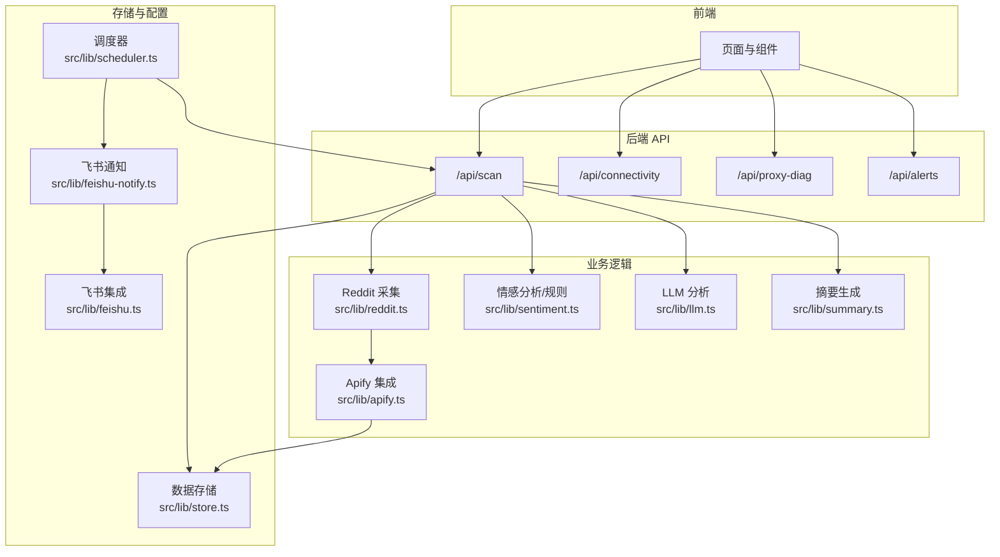
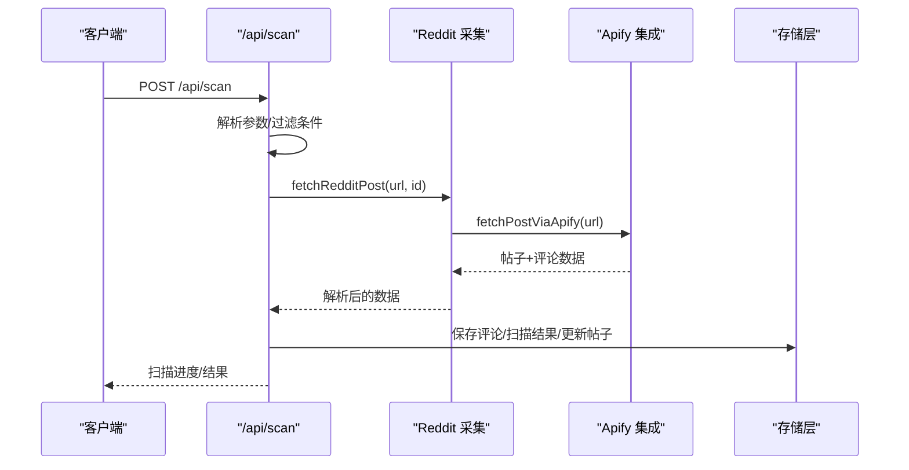
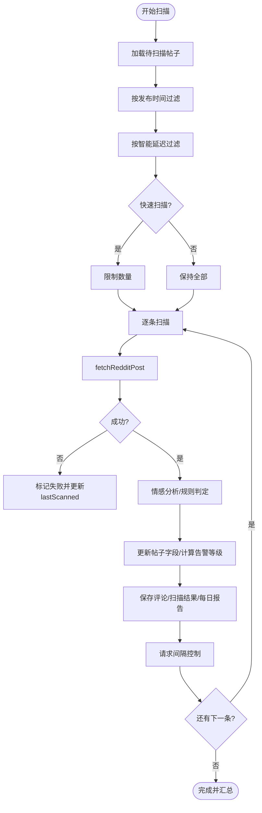
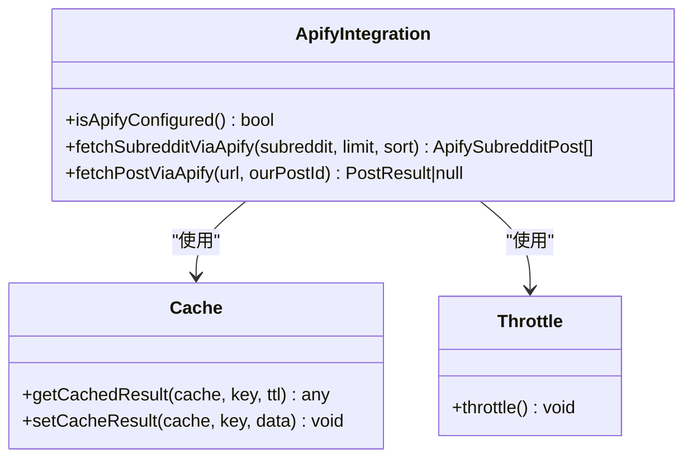
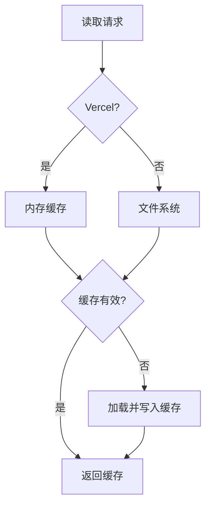
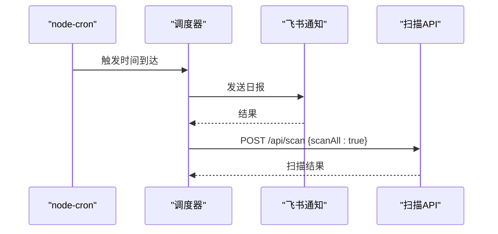
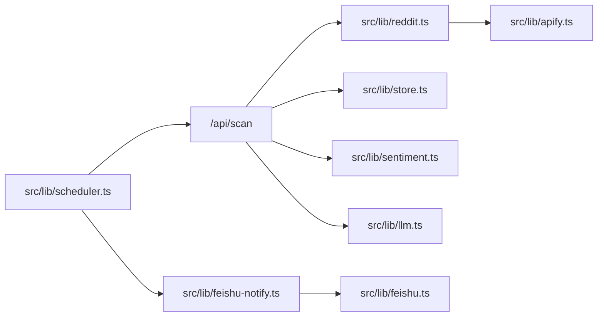

# 故障排除

<cite>
**本文引用的文件**
- [README.md](file://README.md)
- [src/lib/reddit.ts](file://src/lib/reddit.ts)
- [src/lib/apify.ts](file://src/lib/apify.ts)
- [src/app/api/connectivity/route.ts](file://src/app/api/connectivity/route.ts)
- [src/app/api/proxy-diag/route.ts](file://src/app/api/proxy-diag/route.ts)
- [src/app/api/scan/route.ts](file://src/app/api/scan/route.ts)
- [src/app/api/alerts/route.ts](file://src/app/api/alerts/route.ts)
- [src/lib/store.ts](file://src/lib/store.ts)
- [src/lib/scheduler.ts](file://src/lib/scheduler.ts)
- [src/lib/tokens.ts](file://src/lib/tokens.ts)
- [src/lib/feishu.ts](file://src/lib/feishu.ts)
- [src/lib/feishu-notify.ts](file://src/lib/feishu-notify.ts)
- [src/lib/llm.ts](file://src/lib/llm.ts)
- [src/lib/sentiment.ts](file://src/lib/sentiment.ts)
- [src/lib/types.ts](file://src/lib/types.ts)
- [diagnose-deploy.js](file://diagnose-deploy.js)
</cite>

## 目录
1. [简介](#简介)
2. [项目结构](#项目结构)
3. [核心组件](#核心组件)
4. [架构总览](#架构总览)
5. [详细组件分析](#详细组件分析)
6. [依赖关系分析](#依赖关系分析)
7. [性能考虑](#性能考虑)
8. [故障排除指南](#故障排除指南)
9. [结论](#结论)
10. [附录](#附录)

## 简介
本指南面向技术支持与高级用户，聚焦 Reddit 监控系统在生产与开发环境中的常见问题与系统化排障方法。内容覆盖爬虫失败、API 限制、网络连接、数据异常、性能瓶颈、通知与调度等问题，并提供分场景的诊断步骤、错误码与错误信息解读、以及优化建议。

## 项目结构
系统采用 Next.js 应用，前后端逻辑集中在 src 目录，核心模块包括：
- 数据采集层：Reddit 与 Apify 集成
- 业务处理层：情感分析、检测规则、摘要生成
- 存储层：本地文件与 Vercel 内存持久化
- API 层：扫描、连接性检查、告警管理、代理诊断
- 调度与通知：定时任务、飞书推送

图表来源
- [src/app/api/scan/route.ts:1-394](file://src/app/api/scan/route.ts#L1-L394)
- [src/lib/reddit.ts:1-94](file://src/lib/reddit.ts#L1-L94)
- [src/lib/apify.ts:1-280](file://src/lib/apify.ts#L1-L280)
- [src/lib/store.ts:1-285](file://src/lib/store.ts#L1-L285)
- [src/lib/scheduler.ts:1-133](file://src/lib/scheduler.ts#L1-L133)
- [src/lib/feishu-notify.ts](file://src/lib/feishu-notify.ts)

章节来源
- [README.md:1-37](file://README.md#L1-L37)

## 核心组件
- Reddit 采集与批量抓取：负责单贴与板块数据抓取、速率控制与缓存
- Apify 集成：封装 Actor 调用、代理配置、结果解析与缓存
- 扫描与分析：统一扫描入口，整合情感分析、检测规则、摘要与报告
- 存储与配置：本地文件与 Vercel 内存双态持久化，支持缓存与 TTL
- 调度与通知：基于 cron 的定时任务与飞书推送
- API 诊断：连接性检查、代理诊断、告警查询与状态变更

章节来源
- [src/lib/reddit.ts:10-94](file://src/lib/reddit.ts#L10-L94)
- [src/lib/apify.ts:101-280](file://src/lib/apify.ts#L101-L280)
- [src/app/api/scan/route.ts:21-394](file://src/app/api/scan/route.ts#L21-L394)
- [src/lib/store.ts:89-285](file://src/lib/store.ts#L89-L285)
- [src/lib/scheduler.ts:63-133](file://src/lib/scheduler.ts#L63-L133)
- [src/app/api/connectivity/route.ts:1-25](file://src/app/api/connectivity/route.ts#L1-L25)
- [src/app/api/proxy-diag/route.ts:1-24](file://src/app/api/proxy-diag/route.ts#L1-L24)
- [src/app/api/alerts/route.ts:1-62](file://src/app/api/alerts/route.ts#L1-L62)

## 架构总览
系统通过 API 统一入口触发扫描，内部串联采集、分析与存储，同时支持定时任务与手动触发。错误与状态通过日志与响应体反馈，便于前端轮询与运维监控。

图表来源
- [src/app/api/scan/route.ts:146-306](file://src/app/api/scan/route.ts#L146-L306)
- [src/lib/reddit.ts:12-24](file://src/lib/reddit.ts#L12-L24)
- [src/lib/apify.ts:184-279](file://src/lib/apify.ts#L184-L279)
- [src/lib/store.ts:128-173](file://src/lib/store.ts#L128-L173)

## 详细组件分析

### 组件 A：扫描流程与错误处理
- 关键路径：POST /api/scan -> fetchRedditPost -> fetchPostViaApify -> 保存评论与扫描结果
- 错误处理：单条失败不影响整体；更新 lastScanned 与 scanError；最终汇总统计
- 速率控制：Apify 请求间隔与 Reddit 请求间隔，避免 429

图表来源
- [src/app/api/scan/route.ts:44-306](file://src/app/api/scan/route.ts#L44-L306)

章节来源
- [src/app/api/scan/route.ts:21-394](file://src/app/api/scan/route.ts#L21-L394)

### 组件 B：Apify 集成与代理配置
- Apify 客户端初始化与令牌校验
- 缓存策略：板块列表与帖子详情分别设置 TTL
- 限流策略：最小请求间隔，避免触发平台限流
- 代理配置：使用住宅代理，提升稳定性

图表来源
- [src/lib/apify.ts:64-66](file://src/lib/apify.ts#L64-L66)
- [src/lib/apify.ts:23-35](file://src/lib/apify.ts#L23-L35)
- [src/lib/apify.ts:41-50](file://src/lib/apify.ts#L41-L50)
- [src/lib/apify.ts:106-176](file://src/lib/apify.ts#L106-L176)
- [src/lib/apify.ts:184-279](file://src/lib/apify.ts#L184-L279)

章节来源
- [src/lib/apify.ts:1-280](file://src/lib/apify.ts#L1-L280)

### 组件 C：存储与配置（本地/内存）
- 本地开发：文件读写，目录 data
- Vercel 环境：内存存储 + 缓存，避免读写文件
- 缓存 TTL：降低频繁读取大文件带来的延迟
- 配置合并：Vercel 环境变量覆盖默认配置

图表来源
- [src/lib/store.ts:73-87](file://src/lib/store.ts#L73-L87)
- [src/lib/store.ts:90-114](file://src/lib/store.ts#L90-L114)
- [src/lib/store.ts:235-269](file://src/lib/store.ts#L235-L269)

章节来源
- [src/lib/store.ts:1-285](file://src/lib/store.ts#L1-L285)

### 组件 D：调度与通知
- 定时推送：基于 cron 的每日推送
- 自动扫描：午夜自动扫描更新趋势
- 手动触发：支持手动推送

图表来源
- [src/lib/scheduler.ts:24-59](file://src/lib/scheduler.ts#L24-L59)
- [src/lib/scheduler.ts:63-100](file://src/lib/scheduler.ts#L63-L100)
- [src/app/api/scan/route.ts:44-48](file://src/app/api/scan/route.ts#L44-L48)

章节来源
- [src/lib/scheduler.ts:1-133](file://src/lib/scheduler.ts#L1-L133)

## 依赖关系分析
- 组件耦合
  - 扫描 API 强依赖 Reddit 采集与存储层
  - Apify 集成被 Reddit 采集与板块抓取共同依赖
  - 存储层对各模块提供统一的数据访问
- 外部依赖
  - Apify 平台与 Actor
  - 飞书开放平台
  - LLM 提供商（可选）

图表来源
- [src/app/api/scan/route.ts:1-8](file://src/app/api/scan/route.ts#L1-L8)
- [src/lib/reddit.ts:1-9](file://src/lib/reddit.ts#L1-L9)
- [src/lib/apify.ts:1-8](file://src/lib/apify.ts#L1-L8)
- [src/lib/store.ts:1-5](file://src/lib/store.ts#L1-L5)
- [src/lib/scheduler.ts:1-8](file://src/lib/scheduler.ts#L1-L8)
- [src/lib/feishu-notify.ts](file://src/lib/feishu-notify.ts)
- [src/lib/feishu.ts](file://src/lib/feishu.ts)
- [src/lib/sentiment.ts](file://src/lib/sentiment.ts)
- [src/lib/llm.ts](file://src/lib/llm.ts)

## 性能考虑
- 速率控制
  - Apify 请求间隔与 Reddit 请求间隔，避免 429
  - LLM 调用间隔，降低成本与超时风险
- 缓存策略
  - 板块列表与帖子详情缓存，减少重复抓取
  - 存储层缓存，降低文件系统 IO
- 扫描范围控制
  - 按发布时间与智能延迟跳过老帖子与无新评论帖子
  - 快速扫描模式限制数量

章节来源
- [src/lib/apify.ts:37-50](file://src/lib/apify.ts#L37-L50)
- [src/app/api/scan/route.ts:291-294](file://src/app/api/scan/route.ts#L291-L294)
- [src/app/api/scan/route.ts:210-214](file://src/app/api/scan/route.ts#L210-L214)
- [src/lib/apify.ts:17-18](file://src/lib/apify.ts#L17-L18)
- [src/lib/store.ts:71-82](file://src/lib/store.ts#L71-L82)
- [src/app/api/scan/route.ts:50-102](file://src/app/api/scan/route.ts#L50-L102)

## 故障排除指南

### 一、爬虫失败排查
- 症状
  - 扫描返回“无法获取 Reddit 数据”或“扫描失败”
- 诊断步骤
  - 检查 Apify 配置：/api/proxy-diag 与 /api/connectivity
  - 确认 Reddit 链接有效性与可见性
  - 查看 Apify 日志与缓存命中情况
- 常见原因
  - APIFY_TOKEN 未配置或过期
  - Reddit 链接失效或内容被删除
  - 代理不稳定导致抓取失败
- 处理建议
  - 补充/更新 APIFY_TOKEN
  - 更换链接或等待内容恢复
  - 切换代理组或稍后重试

章节来源
- [src/app/api/proxy-diag/route.ts:1-24](file://src/app/api/proxy-diag/route.ts#L1-L24)
- [src/app/api/connectivity/route.ts:1-25](file://src/app/api/connectivity/route.ts#L1-L25)
- [src/lib/apify.ts:54-66](file://src/lib/apify.ts#L54-L66)
- [src/app/api/scan/route.ts:150-161](file://src/app/api/scan/route.ts#L150-L161)

### 二、API 限制与速率控制
- 症状
  - 请求被拒绝或出现 429/限流
- 诊断步骤
  - 检查 Apify 限流日志与请求间隔
  - 确认 LLM 调用间隔
- 处理建议
  - 增加请求间隔或降低并发
  - 使用住宅代理组
  - 开启缓存以减少重复请求

章节来源
- [src/lib/apify.ts:41-50](file://src/lib/apify.ts#L41-L50)
- [src/app/api/scan/route.ts:291-294](file://src/app/api/scan/route.ts#L291-L294)
- [src/app/api/scan/route.ts:210-214](file://src/app/api/scan/route.ts#L210-L214)

### 三、网络连接问题
- 症状
  - /api/connectivity 返回未配置或连接失败
- 诊断步骤
  - 检查环境变量：APIFY_TOKEN、NODE_ENV
  - 在 Vercel 环境下确认内存配置可用
- 处理建议
  - 设置正确的环境变量
  - 在 Vercel 环境下通过环境变量注入配置

章节来源
- [src/app/api/connectivity/route.ts:1-25](file://src/app/api/connectivity/route.ts#L1-L25)
- [src/app/api/proxy-diag/route.ts:10-20](file://src/app/api/proxy-diag/route.ts#L10-L20)
- [src/lib/store.ts:235-269](file://src/lib/store.ts#L235-L269)

### 四、数据异常与一致性
- 症状
  - 帖子未更新 lastScanned、告警状态缺失
- 诊断步骤
  - 检查扫描结果与错误字段
  - 确认存储层缓存是否过期
- 处理建议
  - 重新扫描该帖子
  - 清理缓存或等待 TTL 过期

章节来源
- [src/app/api/scan/route.ts:156-161](file://src/app/api/scan/route.ts#L156-L161)
- [src/lib/store.ts:71-82](file://src/lib/store.ts#L71-L82)

### 五、告警与状态管理
- 症状
  - 告警状态未更新或缺失
- 诊断步骤
  - 使用 /api/alerts 查询并更新状态
  - 检查 alertStatus 默认值与 PATCH 参数
- 处理建议
  - 确保 PATCH 请求包含 postId 与 alertStatus
  - 更新后保存并验证状态变化

章节来源
- [src/app/api/alerts/route.ts:1-62](file://src/app/api/alerts/route.ts#L1-L62)

### 六、性能问题识别与优化
- 识别指标
  - 扫描耗时、失败率、缓存命中率
  - Apify 与 LLM 调用次数与耗时
- 优化建议
  - 启用缓存与合理 TTL
  - 控制扫描范围与速率
  - 使用住宅代理提升成功率

章节来源
- [src/lib/apify.ts:17-18](file://src/lib/apify.ts#L17-L18)
- [src/app/api/scan/route.ts:50-102](file://src/app/api/scan/route.ts#L50-L102)
- [src/app/api/scan/route.ts:291-294](file://src/app/api/scan/route.ts#L291-L294)

### 七、不同环境下的故障排除流程

#### 开发环境（本地）
- 步骤
  - 启动服务后访问 /api/connectivity 与 /api/proxy-diag
  - 检查 data 目录是否存在与可写
  - 执行小规模扫描验证链路
- 常见问题
  - 文件系统不可写（Vercel 环境）
  - 环境变量未设置

章节来源
- [src/lib/store.ts:42-50](file://src/lib/store.ts#L42-L50)
- [src/app/api/connectivity/route.ts:1-25](file://src/app/api/connectivity/route.ts#L1-L25)
- [src/app/api/proxy-diag/route.ts:1-24](file://src/app/api/proxy-diag/route.ts#L1-L24)

#### 生产环境（Vercel）
- 步骤
  - 通过环境变量注入配置（飞书 Webhook、LLM 等）
  - 使用 /api/connectivity 验证连接
  - 查看调度任务状态与最后推送结果
- 常见问题
  - 环境变量未生效
  - 内存存储与缓存行为差异

章节来源
- [src/lib/store.ts:235-269](file://src/lib/store.ts#L235-L269)
- [src/lib/scheduler.ts:102-124](file://src/lib/scheduler.ts#L102-L124)

#### 部署与 CI/CD（EC2/AWS）
- 步骤
  - 查看 GitHub Actions 失败日志
  - 按部署脚本执行手动部署命令
  - 检查密钥对、Git/Docker 安装与服务状态
- 常见问题
  - SSH 密钥对不匹配
  - EC2 缺少 Git 或 Docker

章节来源
- [diagnose-deploy.js:60-98](file://diagnose-deploy.js#L60-L98)

## 结论
本指南提供了从采集、分析、存储到调度与通知的全链路故障排除方法。建议优先通过 /api/connectivity 与 /api/proxy-diag 快速定位配置与网络问题，再结合扫描日志与缓存策略进行深度排查。针对不同环境，重点检查配置注入与存储行为差异，确保稳定运行。

## 附录

### A. 常见错误码与信息
- /api/connectivity
  - 未配置：返回连接状态为 false，提示设置 APIFY_TOKEN
  - 失败：返回连接失败及错误信息
- /api/proxy-diag
  - 环境变量检查：显示 APIFY_TOKEN 与 NODE_ENV 状态
  - Apify 配置：显示是否已配置与提示信息
- /api/scan
  - 失败：包含 postId、failed/error 与错误信息
  - 成功：包含扫描统计与告警等级

章节来源
- [src/app/api/connectivity/route.ts:6-23](file://src/app/api/connectivity/route.ts#L6-L23)
- [src/app/api/proxy-diag/route.ts:10-20](file://src/app/api/proxy-diag/route.ts#L10-L20)
- [src/app/api/scan/route.ts:149-161](file://src/app/api/scan/route.ts#L149-L161)
- [src/app/api/scan/route.ts:295-305](file://src/app/api/scan/route.ts#L295-L305)

### B. 数据模型与关键字段
- RedditPost：包含 id、redditUrl、title、subreddit、author、score、commentCount、createdAt、lastScanned、alertLevel、alertReasons、scanError、nextScanTime 等
- RedditComment：包含 id、postId、author、body、score、createdAt、sentimentScore、isFlagged、flagReasons、permalink 等
- ScanResult：包含 postId、scanTime、totalComments、flaggedComments、alertLevel、sentimentSummary、topFlaggedComments
- DailyScanReport：包含 date、totalPosts、totalComments、flaggedComments、criticalAlerts、highAlerts、mediumAlerts、safePosts、sentimentTrend

章节来源
- [src/lib/types.ts:9-58](file://src/lib/types.ts#L9-L58)
- [src/lib/types.ts:161-194](file://src/lib/types.ts#L161-L194)