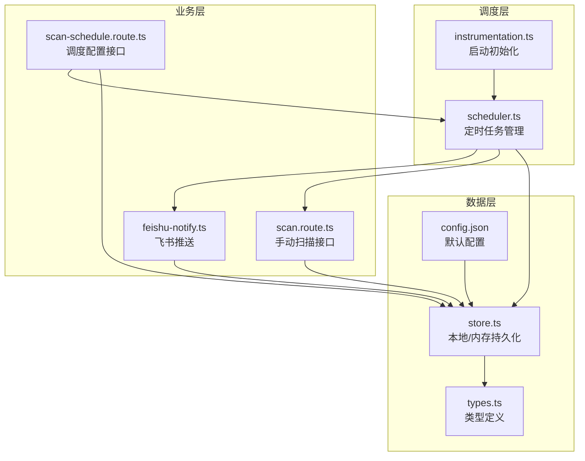
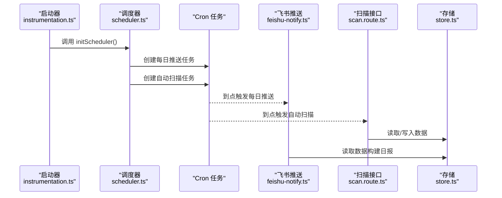
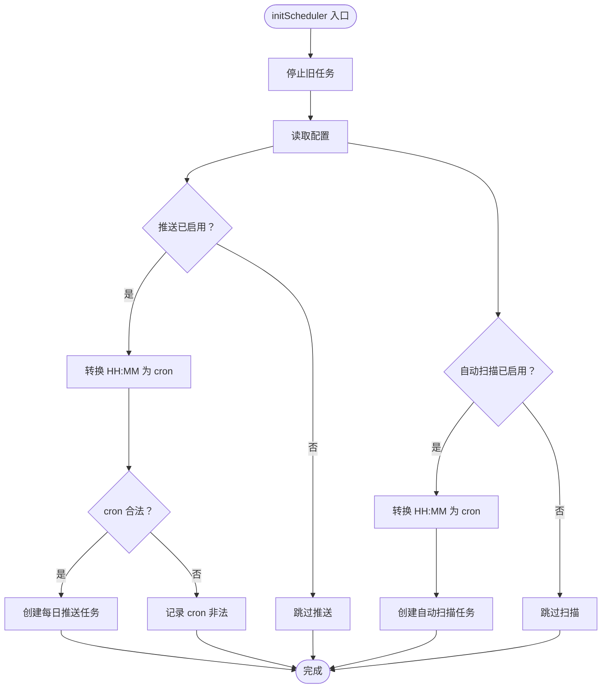
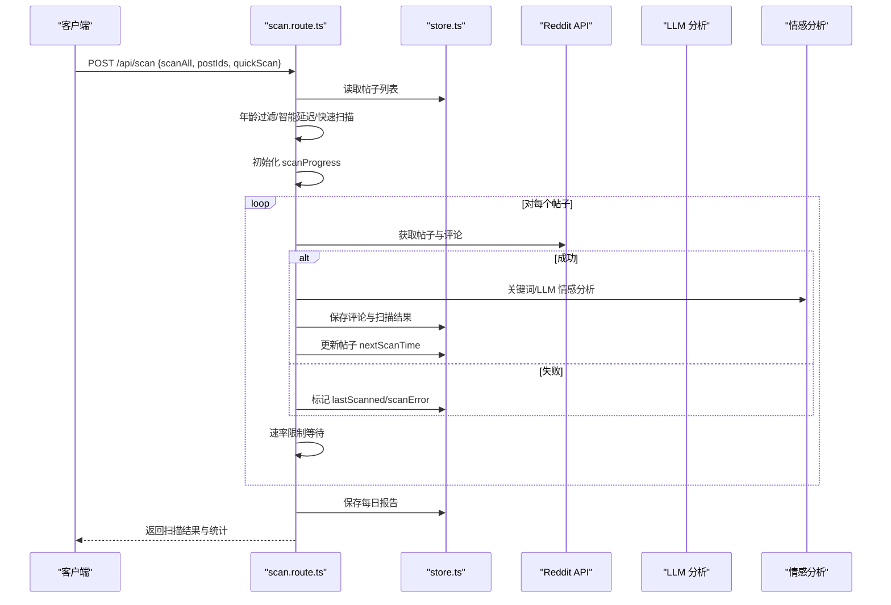
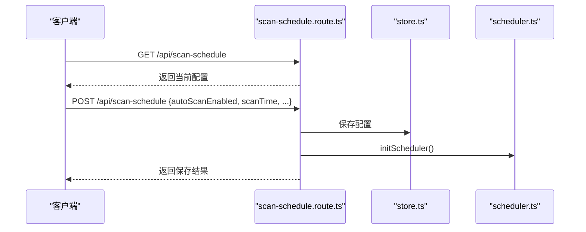
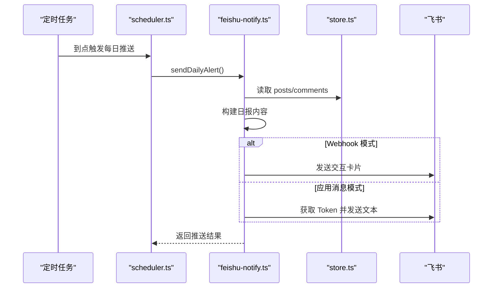
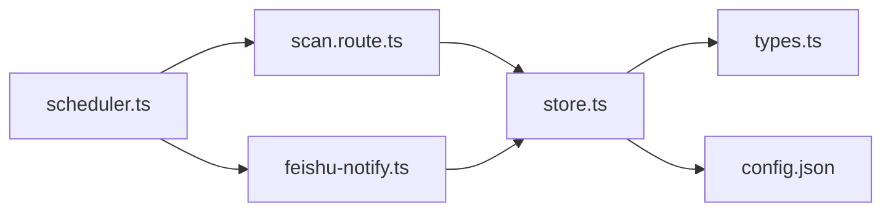

# 任务调度器

<cite>
**本文引用的文件**
- [scheduler.ts](file://src/lib/scheduler.ts)
- [scan.route.ts](file://src/app/api/scan/route.ts)
- [scan-schedule.route.ts](file://src/app/api/scan-schedule/route.ts)
- [types.ts](file://src/lib/types.ts)
- [store.ts](file://src/lib/store.ts)
- [feishu-notify.ts](file://src/lib/feishu-notify.ts)
- [instrumentation.ts](file://src/instrumentation.ts)
- [config.json](file://data/config.json)
</cite>

## 目录
1. [简介](#简介)
2. [项目结构](#项目结构)
3. [核心组件](#核心组件)
4. [架构总览](#架构总览)
5. [详细组件分析](#详细组件分析)
6. [依赖关系分析](#依赖关系分析)
7. [性能考量](#性能考量)
8. [故障排查指南](#故障排查指南)
9. [结论](#结论)
10. [附录](#附录)

## 简介
本任务调度器基于 node-cron 实现，提供两类自动化能力：
- 每日定时推送：在配置时间向飞书推送品牌声誉日报。
- 自动扫描：在配置时间自动执行全量扫描，更新情感趋势与告警状态。

同时支持手动触发扫描与推送，并提供实时进度查询与停止控制。调度器在服务启动时初始化，确保在生产环境（如 Vercel）也能稳定运行。

## 项目结构
围绕调度器的关键文件组织如下：
- 调度核心：src/lib/scheduler.ts
- 手动扫描 API：src/app/api/scan/route.ts
- 调度配置 API：src/app/api/scan-schedule/route.ts
- 类型定义：src/lib/types.ts
- 数据存储：src/lib/store.ts
- 飞书推送：src/lib/feishu-notify.ts
- 启动初始化：src/instrumentation.ts
- 默认配置：data/config.json

图表来源
- [scheduler.ts:1-133](file://src/lib/scheduler.ts#L1-L133)
- [scan.route.ts:1-394](file://src/app/api/scan/route.ts#L1-L394)
- [scan-schedule.route.ts:1-53](file://src/app/api/scan-schedule/route.ts#L1-L53)
- [store.ts:1-285](file://src/lib/store.ts#L1-L285)
- [feishu-notify.ts:1-482](file://src/lib/feishu-notify.ts#L1-L482)
- [instrumentation.ts:1-11](file://src/instrumentation.ts#L1-L11)
- [config.json:1-57](file://data/config.json#L1-L57)

章节来源
- [scheduler.ts:1-133](file://src/lib/scheduler.ts#L1-L133)
- [scan.route.ts:1-394](file://src/app/api/scan/route.ts#L1-L394)
- [scan-schedule.route.ts:1-53](file://src/app/api/scan-schedule/route.ts#L1-L53)
- [store.ts:1-285](file://src/lib/store.ts#L1-L285)
- [feishu-notify.ts:1-482](file://src/lib/feishu-notify.ts#L1-L482)
- [instrumentation.ts:1-11](file://src/instrumentation.ts#L1-L11)
- [config.json:1-57](file://data/config.json#L1-L57)

## 核心组件
- 调度器（scheduler.ts）
  - 基于 node-cron 的定时任务管理，支持每日推送与自动扫描。
  - 提供状态查询与手动触发推送。
- 手动扫描（scan.route.ts）
  - 支持全量扫描与指定帖子扫描，内置智能延迟、年龄过滤、快速扫描等策略。
  - 提供进度查询与停止控制。
- 调度配置（scan-schedule.route.ts）
  - 提供获取与保存调度配置的 API，保存后会重新初始化调度器。
- 存储与配置（store.ts、config.json）
  - 文件/内存双态持久化，支持 Vercel 环境变量覆盖。
- 飞书推送（feishu-notify.ts）
  - 生成日报卡片与纯文本摘要，支持 Webhook 与应用消息两种模式。
- 启动初始化（instrumentation.ts）
  - 在服务启动时调用调度器初始化。

章节来源
- [scheduler.ts:63-133](file://src/lib/scheduler.ts#L63-L133)
- [scan.route.ts:21-394](file://src/app/api/scan/route.ts#L21-L394)
- [scan-schedule.route.ts:5-53](file://src/app/api/scan-schedule/route.ts#L5-L53)
- [store.ts:194-285](file://src/lib/store.ts#L194-L285)
- [feishu-notify.ts:416-437](file://src/lib/feishu-notify.ts#L416-L437)
- [instrumentation.ts:4-11](file://src/instrumentation.ts#L4-L11)

## 架构总览
调度器采用“启动初始化 + 定时任务 + 手动接口”的组合架构：
- 启动阶段：instrumentation 注册，调用 initScheduler 初始化。
- 定时阶段：scheduler 基于配置创建 cron 任务，分别执行每日推送与自动扫描。
- 手动阶段：前端或外部系统调用 /api/scan 触发扫描；/api/scan-schedule 修改配置并重载调度器。
- 数据阶段：store 统一读写 posts/comments/scans/reports/config，types 定义数据模型。

图表来源
- [instrumentation.ts:4-11](file://src/instrumentation.ts#L4-L11)
- [scheduler.ts:63-100](file://src/lib/scheduler.ts#L63-L100)
- [feishu-notify.ts:416-437](file://src/lib/feishu-notify.ts#L416-L437)
- [scan.route.ts:21-394](file://src/app/api/scan/route.ts#L21-L394)
- [store.ts:194-285](file://src/lib/store.ts#L194-L285)

## 详细组件分析

### 调度器（基于 node-cron）
- 关键职责
  - 解析配置，将 HH:MM 转换为 cron 表达式。
  - 定时执行每日推送与自动扫描。
  - 提供状态查询与手动触发推送。
- 执行策略
  - 每日推送：当启用且配置合法时，按配置时间创建 cron 任务。
  - 自动扫描：当启用时，按配置时间创建 cron 任务，内部构造请求调用扫描接口。
- 并发与冲突
  - 两个任务独立运行，互不阻塞。
  - 手动扫描接口内部维护全局运行状态，避免并发冲突。
- 错误处理
  - cron 表达式校验失败时记录错误。
  - 扫描与推送过程中的异常被捕获并记录，保证调度器持续运行。

图表来源
- [scheduler.ts:63-100](file://src/lib/scheduler.ts#L63-L100)

章节来源
- [scheduler.ts:14-100](file://src/lib/scheduler.ts#L14-L100)

### 手动扫描接口（/api/scan）
- 请求参数
  - scanAll: 是否全量扫描
  - postIds: 指定帖子 ID 数组（为空或未提供时根据 scanAll 决定范围）
  - quickScan: 是否快速扫描（限制数量）
  - skipRecentHours: 近期冷却（当前逻辑始终为 0）
- 执行策略
  - 年龄过滤：全量扫描时仅处理近 3 个月内的帖子。
  - 智能延迟：跳过 nextScanTime 未到期的帖子。
  - 速率限制：Reddit 请求间隔 3 秒，LLM 调用间隔 300ms。
  - 情感分析：优先使用 LLM，失败时回退关键词规则。
  - 结果保存：逐贴保存评论、扫描结果与每日报告。
- 进度与停止
  - 全局 scanProgress 记录运行状态与进度。
  - 支持 DELETE /api/scan 停止当前扫描。

图表来源
- [scan.route.ts:21-394](file://src/app/api/scan/route.ts#L21-L394)
- [store.ts:90-173](file://src/lib/store.ts#L90-L173)

章节来源
- [scan.route.ts:21-394](file://src/app/api/scan/route.ts#L21-L394)

### 调度配置接口（/api/scan-schedule）
- GET：返回 autoScanEnabled、scanTime、scanSchedule、sentimentThreshold。
- POST：更新配置项并保存，随后调用 initScheduler 重载调度器。
- 配置项
  - autoScanEnabled：是否启用自动扫描
  - scanTime：每日自动扫描时间（HH:MM）
  - scanSchedule：cron 表达式
  - sentimentThreshold：情感阈值

图表来源
- [scan-schedule.route.ts:5-53](file://src/app/api/scan-schedule/route.ts#L5-L53)
- [store.ts:281-285](file://src/lib/store.ts#L281-L285)
- [scheduler.ts:63-100](file://src/lib/scheduler.ts#L63-L100)

章节来源
- [scan-schedule.route.ts:5-53](file://src/app/api/scan-schedule/route.ts#L5-L53)

### 飞书推送（/api/notify）
- 功能：构建日报卡片与文本摘要，支持 Webhook 与应用消息两种模式。
- 触发方式：定时任务或手动 PATCH /api/notify。
- 输出：包含健康度评分、情感分布、风险类别、严重帖子列表等。

图表来源
- [scheduler.ts:24-36](file://src/lib/scheduler.ts#L24-L36)
- [feishu-notify.ts:416-437](file://src/lib/feishu-notify.ts#L416-L437)
- [store.ts:90-173](file://src/lib/store.ts#L90-L173)

章节来源
- [feishu-notify.ts:416-437](file://src/lib/feishu-notify.ts#L416-L437)

### 启动初始化
- 在服务启动时注册并调用 initScheduler，确保定时任务在进程生命周期内持续运行。

章节来源
- [instrumentation.ts:4-11](file://src/instrumentation.ts#L4-L11)

## 依赖关系分析
- 调度器依赖
  - 配置：来自 store.getConfig 与 config.json。
  - 推送：feishu-notify.sendDailyAlert。
  - 扫描：动态导入 scan.route.ts 的 POST 方法模拟请求。
- 扫描接口依赖
  - 存储：store.getPosts/savePosts/saveComments/saveScanResult/saveDailyReport。
  - 分析：sentiment/llm/summary/detectionRules。
- 飞书推送依赖
  - 存储：getPosts/getComments/getConfig。
  - 外部：飞书 Webhook/App API。

图表来源
- [scheduler.ts:74-100](file://src/lib/scheduler.ts#L74-L100)
- [scan.route.ts:1-8](file://src/app/api/scan/route.ts#L1-L8)
- [store.ts:194-285](file://src/lib/store.ts#L194-L285)
- [types.ts:146-159](file://src/lib/types.ts#L146-L159)
- [config.json:1-57](file://data/config.json#L1-L57)

章节来源
- [scheduler.ts:74-100](file://src/lib/scheduler.ts#L74-L100)
- [scan.route.ts:1-8](file://src/app/api/scan/route.ts#L1-L8)
- [store.ts:194-285](file://src/lib/store.ts#L194-L285)
- [types.ts:146-159](file://src/lib/types.ts#L146-L159)
- [config.json:1-57](file://data/config.json#L1-L57)

## 性能考量
- 速率限制
  - Reddit 请求间隔 3 秒，LLM 调用间隔 300ms，避免触发限流。
- 缓存与持久化
  - store.ts 对大文件读取加 30 秒缓存，减少频繁 IO。
  - Vercel 环境下使用内存存储，避免只读文件系统限制。
- 扫描优化
  - 全量扫描时仅处理近 3 个月内的帖子，降低代理流量消耗。
  - 智能延迟：若 2 周内无新评论，下次扫描延后至 1 个月后。
- 并发与冲突
  - 手动扫描接口通过全局状态与停止标志避免并发冲突。

章节来源
- [scan.route.ts:291-295](file://src/app/api/scan/route.ts#L291-L295)
- [scan.route.ts:50-65](file://src/app/api/scan/route.ts#L50-L65)
- [scan.route.ts:238-256](file://src/app/api/scan/route.ts#L238-L256)
- [store.ts:71-82](file://src/lib/store.ts#L71-L82)

## 故障排查指南
- 任务未执行
  - 检查配置：autoScanEnabled 与 scanTime 是否正确；cron 表达式是否合法。
  - 查看日志：调度器初始化与任务创建日志。
- 推送失败
  - 检查飞书配置：webhookUrl 或应用凭证是否完整。
  - 使用测试接口验证连接。
- 扫描卡住或冲突
  - 通过 /api/scan GET 查询 scanProgress，确认 isRunning 与 total。
  - 如需中断，调用 /api/scan DELETE 发送停止信号。
- 资源限制
  - 若在 Vercel 环境，注意只读文件系统，配置通过环境变量注入。
  - 控制扫描规模（quickScan）与频率，避免超时。

章节来源
- [scheduler.ts:81-86](file://src/lib/scheduler.ts#L81-L86)
- [feishu-notify.ts:440-481](file://src/lib/feishu-notify.ts#L440-L481)
- [scan.route.ts:381-393](file://src/app/api/scan/route.ts#L381-L393)
- [store.ts:235-269](file://src/lib/store.ts#L235-L269)

## 结论
该调度器以轻量、可配置为核心设计原则，结合 node-cron 的定时能力与 Next.js API 的灵活扩展，实现了稳定的每日推送与自动扫描。通过清晰的配置接口、完善的错误处理与性能优化策略，能够在不同部署环境下可靠运行。建议在生产环境中：
- 明确扫描窗口与速率限制，避免触发外部 API 限流。
- 使用 /api/scan-schedule 精准控制扫描频率与阈值。
- 通过 /api/scan 的进度与停止接口进行可观测与可控操作。

## 附录

### 配置项一览（来自 store 与 config.json）
- feishu：飞书基础配置
- feishuUserAuth：用户授权（跨租户访问）
- scanSchedule：cron 表达式
- autoScanEnabled：是否启用自动扫描
- scanTime："HH:MM" 格式
- keywords：关键词列表
- sentimentThreshold：情感阈值
- llm：LLM 配置（provider、apiKey、model、baseUrl、maxTokens、temperature）
- feishuNotify：飞书推送配置（enabled、mode、webhookUrl、notifyTime、notifyLevels、receiveUserId/receiveChatId）
- detectionRules：检测规则集合

章节来源
- [store.ts:195-233](file://src/lib/store.ts#L195-L233)
- [config.json:22-57](file://data/config.json#L22-L57)