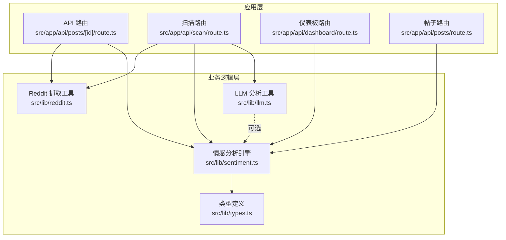
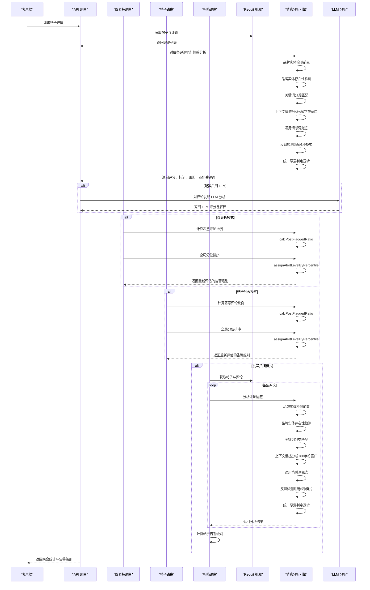
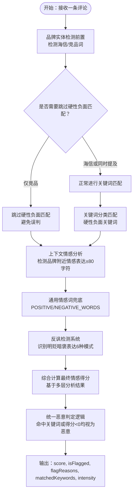
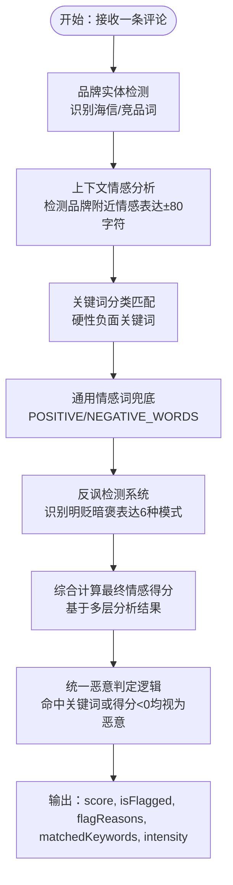
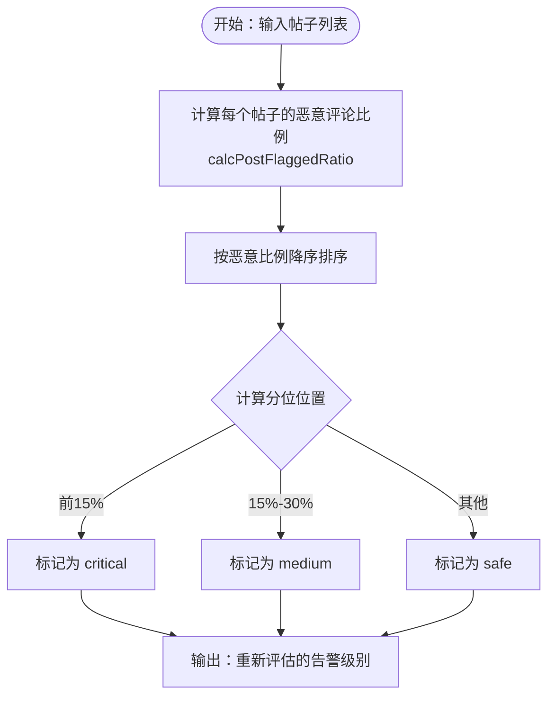
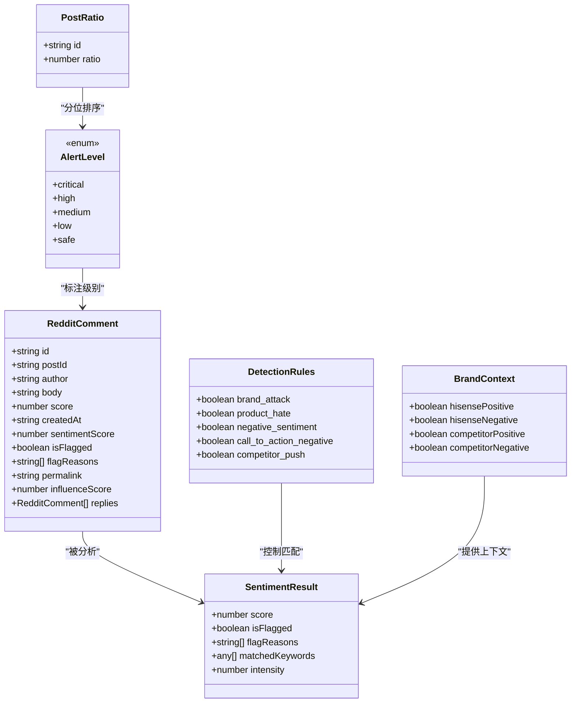
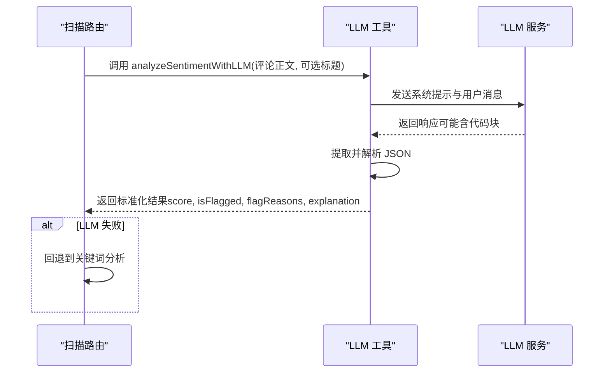
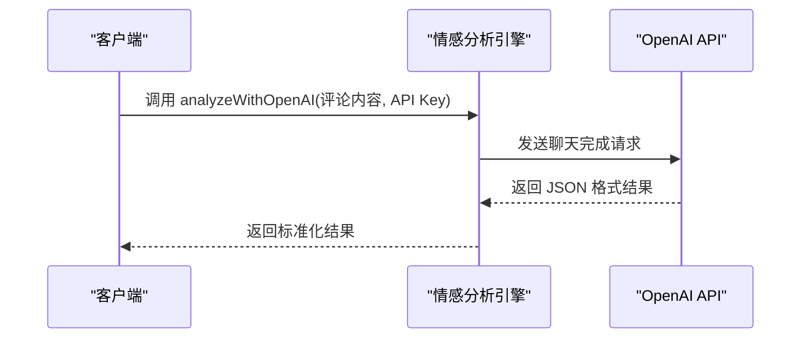
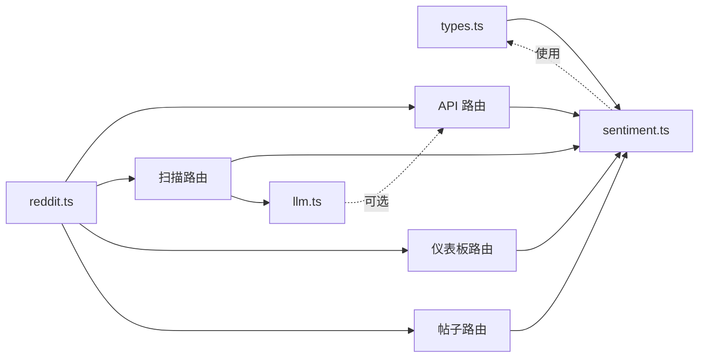

# 情感分析引擎

<cite>
**本文引用的文件**
- [sentiment.ts](file://src/lib/sentiment.ts)
- [types.ts](file://src/lib/types.ts)
- [reddit.ts](file://src/lib/reddit.ts)
- [route.ts](file://src/app/api/posts/[id]/route.ts)
- [llm.ts](file://src/lib/llm.ts)
- [scan-route.ts](file://src/app/api/scan/route.ts)
- [config.json](file://data/config.json)
- [dashboard-route.ts](file://src/app/api/dashboard/route.ts)
- [posts-route.ts](file://src/app/api/posts/route.ts)
</cite>

## 更新摘要
**变更内容**
- 新增全面的反讽检测系统（IRONY_REVERSAL_PATTERNS），能够识别明贬暗褒的表达模式，包含6种主要类型
- 增强保修/售后服务识别能力，新增5个保修相关正面情感模式
- 扩大品牌上下文检测窗口，从±60扩展到±80字符
- 改进品牌实体检测前置机制，提升竞品提及场景的准确性
- 增强俚语表达处理，包括"fucking"作为强调副词的特殊处理
- 优化否定词识别机制，NEGATION_LOOKBACK提升至35字符
- 扩大POSITIVE_EMOTION_WORDS和NEGATIVE_EMOTION_WORDS词库规模
- 增强POSITIVE_PATTERNS正则模式匹配数量至573个
- 新增12个强调短语如"couldn't be happier"、"could not be happier"、"couldnt be happier"
- 改进强度修饰词识别和权重计算逻辑
- **新增** OpenAI 分析功能，提供可选的 LLM 辅助情感分析能力
- **新增** 统一恶意判定逻辑，确保前后端一致性

## 目录
1. [简介](#简介)
2. [项目结构](#项目结构)
3. [核心组件](#核心组件)
4. [架构概览](#架构概览)
5. [详细组件分析](#详细组件分析)
6. [依赖关系分析](#依赖关系分析)
7. [性能考量](#性能考量)
8. [故障排查指南](#故障排查指南)
9. [结论](#结论)
10. [附录](#附录)

## 简介
本文件面向情感分析引擎，系统化阐述基于多层嵌套分析系统的恶意评论检测实现，涵盖以下要点：
- 品牌实体检测与上下文情感分析
- 专用海信产品评估功能
- 关键词匹配策略与权重计算
- 规则配置与启用控制
- 情感评分机制与正负向判定
- 告警级别判定逻辑与影响力得分
- 全局百分位告警排名系统
- 与 RedditComment 类型的集成与数据流
- **新增** 反讽检测系统与俚语表达处理
- **新增** OpenAI 分析功能与 LLM 辅助分析
- 实际代码中的调用示例与优化建议

该引擎采用"品牌实体检测前置 + 通用情感词兜底 + 关键词分类负面检测 + 反讽识别"的四层分析架构，提供可选的 LLM 辅助分析能力，作为规则引擎的补充。最新的更新包括新增的反讽检测系统，能够识别复杂的语言模式，如转折、对比、夸张和引用等反讽表达。

## 项目结构
情感分析引擎位于 src/lib/sentiment.ts，围绕 RedditComment 类型进行处理，并通过 API 路由在应用层使用。核心类型定义位于 src/lib/types.ts，Reddit 数据抓取与聚合逻辑位于 src/lib/reddit.ts，扫描和分析逻辑位于 src/app/api/scan/route.ts，部分调用示例可在 API 路由中找到。新增的全局百分位告警排名系统通过 dashboard 和 posts API 路由进行调用。

**图表来源**
- [sentiment.ts:1-1146](file://src/lib/sentiment.ts#L1-L1146)
- [types.ts:1-194](file://src/lib/types.ts#L1-L194)
- [reddit.ts:1-94](file://src/lib/reddit.ts#L1-L94)
- [route.ts:76-97](file://src/app/api/posts/[id]/route.ts#L76-L97)
- [llm.ts:241-338](file://src/lib/llm.ts#L241-L338)
- [scan-route.ts:1-408](file://src/app/api/scan/route.ts#L1-L408)
- [dashboard-route.ts:1-119](file://src/app/api/dashboard/route.ts#L1-L119)
- [posts-route.ts:1-166](file://src/app/api/posts/route.ts#L1-L166)

**章节来源**
- [sentiment.ts:1-1146](file://src/lib/sentiment.ts#L1-L1146)
- [types.ts:1-194](file://src/lib/types.ts#L1-L194)
- [reddit.ts:1-94](file://src/lib/reddit.ts#L1-L94)
- [route.ts:76-97](file://src/app/api/posts/[id]/route.ts#L76-L97)
- [scan-route.ts:1-408](file://src/app/api/scan/route.ts#L1-L408)
- [dashboard-route.ts:1-119](file://src/app/api/dashboard/route.ts#L1-L119)
- [posts-route.ts:1-166](file://src/app/api/posts/route.ts#L1-L166)

## 核心组件
- **品牌实体检测前置机制**：在关键词匹配前先检测海信和竞品实体，避免仅提及竞品时的误判
- **上下文情感分析**：检测品牌词附近（±80字符）的正负面情感表达，扩大检测窗口提升准确性
- **专用海信产品评估**：针对海信电视产品的专业情感分析，包括画质、音质、性能等维度
- **关键词分类与权重**：品牌攻击、产品厌恶、负面情绪、负面行动号召、竞品推动
- **通用情感词兜底**：POSITIVE_EMOTION_WORDS 和 NEGATIVE_EMOTION_WORDS 提供基础情感评分
- **正向模式匹配**：品牌直接推荐、购买推荐、产品好评、满意度表达等
- **强度修饰词与否定词**：提升负面强度或抑制误判，NEGATION_LOOKBACK提升至35字符
- **统一恶意判定逻辑**：命中硬性关键词或最终情感得分小于零均视为恶意，确保前后端一致性
- **影响力得分**：结合点赞数与情感强度，衡量恶意评论传播影响
- **帖子级告警**：汇总恶意评论影响力，按阈值判定严重/中等/安全
- **全局百分位告警排名系统**：基于恶意评论比例的分位排序，重新评估帖子安全级别
- **恶意评论比例计算**：计算单个帖子的恶意评论数占总评论数的比例
- **反讽检测系统**：识别转折、对比、夸张和引用等反讽表达模式，包含6种主要类型
- **保修/售后服务识别**：新增5个保修相关正面情感模式，包括extended warranty、lifetime warranty、free replacement/repair/service等
- **俚语表达处理**：特殊处理"fucking"作为强调副词的正面表达
- **增强的否定词识别**：扩展否定词库，提升否定语境识别准确性
- **OpenAI 分析功能**：提供可选的 LLM 辅助情感分析能力，支持多种模型提供商

**章节来源**
- [sentiment.ts:155-170](file://src/lib/sentiment.ts#L155-L170)
- [sentiment.ts:599-641](file://src/lib/sentiment.ts#L599-L641)
- [sentiment.ts:718-788](file://src/lib/sentiment.ts#L718-L788)
- [sentiment.ts:819-828](file://src/lib/sentiment.ts#L819-L828)
- [sentiment.ts:822-824](file://src/lib/sentiment.ts#L822-L824)
- [sentiment.ts:903-937](file://src/lib/sentiment.ts#L903-L937)
- [sentiment.ts:595-621](file://src/lib/sentiment.ts#L595-L621)
- [sentiment.ts:244-249](file://src/lib/sentiment.ts#L244-L249)
- [sentiment.ts:1108-1145](file://src/lib/sentiment.ts#L1108-L1145)

## 架构概览
情感分析引擎采用"品牌实体检测前置 + 通用情感词兜底 + 关键词分类负面检测 + 反讽识别"的四层分析架构：
- **第一层：品牌实体检测前置**：识别海信品牌词和竞品词，建立品牌上下文，避免仅提及竞品时的误判
- **第二层：上下文情感分析**：检测品牌词附近的正负面情感表达，提供精准的语境理解，检测窗口扩大至±80字符
- **第三层：关键词分类与通用情感词**：提供兜底的情感分析和恶意评论检测
- **第四层：反讽检测系统**：识别复杂的语言模式，如转折、对比、夸张和引用等反讽表达
- **统一恶意判定**：命中硬性关键词或最终情感得分小于零均视为恶意，确保前后端一致性
- **全局百分位告警排名**：基于恶意评论比例的分位排序，重新评估帖子安全级别
- **规则引擎**：关键词匹配与强度修正，快速、稳定、可解释
- **LLM 补充**：在规则引擎之外提供更灵活的语义理解，适合复杂场景与边界案例

**图表来源**
- [route.ts:76-97](file://src/app/api/posts/[id]/route.ts#L76-L97)
- [scan-route.ts:174-225](file://src/app/api/scan/route.ts#L174-L225)
- [reddit.ts:10-56](file://src/lib/reddit.ts#L10-L56)
- [sentiment.ts:653-816](file://src/lib/sentiment.ts#L653-L816)
- [llm.ts:241-338](file://src/lib/llm.ts#L241-L338)
- [dashboard-route.ts:17-26](file://src/app/api/dashboard/route.ts#L17-L26)
- [posts-route.ts:27-33](file://src/app/api/posts/route.ts#L27-L33)

## 详细组件分析

### 组件一：品牌实体检测前置机制
**更新** 新增品牌实体检测前置机制，显著提升竞品提及场景的准确性

- **前置检测流程**
  - 首先检测海信品牌词：'hisense'、'海信'、'hisense tv'等
  - 检测竞品词：'samsung'、'lg'、'tcl'、'sony'等
  - 建立 skipHardNegative 守卫：仅当同时包含海信和竞品或仅包含海信时才进行硬性负面关键词匹配
- **竞品场景处理**
  - 仅出现竞品（如 "Fuck Samsung"）→ 不属于海信负面，跳过所有硬性负面命中
  - 仅出现海信 → 正常进行硬性负面关键词匹配
  - 同时出现海信和竞品 → 根据上下文情感进行精确判定

**图表来源**
- [sentiment.ts:674-679](file://src/lib/sentiment.ts#L674-L679)
- [sentiment.ts:680-717](file://src/lib/sentiment.ts#L680-L717)
- [sentiment.ts:718-788](file://src/lib/sentiment.ts#L718-L788)
- [sentiment.ts:822-824](file://src/lib/sentiment.ts#L822-L824)
- [sentiment.ts:595-621](file://src/lib/sentiment.ts#L595-L621)

**章节来源**
- [sentiment.ts:674-679](file://src/lib/sentiment.ts#L674-L679)
- [sentiment.ts:680-717](file://src/lib/sentiment.ts#L680-L717)
- [sentiment.ts:718-788](file://src/lib/sentiment.ts#L718-L788)
- [sentiment.ts:822-824](file://src/lib/sentiment.ts#L822-L824)

### 组件二：多层嵌套分析架构
**更新** 新增反讽检测系统，形成四层分析架构

- **品牌实体检测层**
  - 专门识别海信品牌词：'hisense'、'海信'、'hisense tv'等
  - 识别竞品词：'samsung'、'lg'、'tcl'、'sony'等
  - 为后续上下文分析提供基础
- **上下文情感分析层**
  - 检测品牌词附近（±80字符）的正负面情感表达，扩大检测窗口提升准确性
  - 识别强表达词汇：'love'、'amazing'、'hate'、'terrible'等
  - 提供精准的品牌情感上下文理解
- **关键词分类与通用情感词层**
  - 硬性负面关键词分类：品牌攻击、产品仇恨、号召抵制等
  - 通用情感词兜底：提供基础情感评分
  - 正向模式匹配：品牌推荐、购买推荐等
- **反讽检测层**
  - 识别转折反转："they say X but Y" / "X is bad but actually great"
  - 识别对比反转："not bad at all" / "not terrible, actually good"
  - 识别夸张转正面："so bad I love it" / "terrible but I love it"
  - 识别引用+否定："they say it's bad" / "supposed to be trash"
  - 识别反讽肯定："yeah right, it's trash" / "sure, Hisense is bad (NOT)"
  - 识别俚语购买意愿："want/need ... so bad" = "非常想要"（正面）

**图表来源**
- [sentiment.ts:653-816](file://src/lib/sentiment.ts#L653-L816)
- [sentiment.ts:599-641](file://src/lib/sentiment.ts#L599-L641)
- [sentiment.ts:718-788](file://src/lib/sentiment.ts#L718-L788)
- [sentiment.ts:822-824](file://src/lib/sentiment.ts#L822-L824)
- [sentiment.ts:595-621](file://src/lib/sentiment.ts#L595-L621)

**章节来源**
- [sentiment.ts:155-170](file://src/lib/sentiment.ts#L155-L170)
- [sentiment.ts:599-641](file://src/lib/sentiment.ts#L599-L641)
- [sentiment.ts:718-788](file://src/lib/sentiment.ts#L718-L788)
- [sentiment.ts:653-816](file://src/lib/sentiment.ts#L653-L816)
- [sentiment.ts:595-621](file://src/lib/sentiment.ts#L595-L621)

### 组件三：专用海信产品评估功能
- **海信电视产品特征识别**
  - 电视型号识别：'u9', 'u8', 'e7'等
  - 技术特性识别：'miniled', 'rgb', 'sky blue'等
  - 产品系列识别：'canvas', 'fire tv'等
- **画质情感分析**
  - 画质相关正面词汇：'great picture', 'beautiful colors', 'stunning display'
  - 画质相关负面词汇：'burn in', 'cloudy screen', 'image retention'
- **音质情感分析**
  - 音质相关正面词汇：'great sound', 'powerful bass', 'booming audio'
  - 音质相关负面词汇：'tinny sound', 'audio dropout', 'no sound'
- **性能情感分析**
  - 性能相关正面词汇：'low input lag', 'smooth gameplay', 'responsive'
  - 性能相关负面词汇：'laggy', 'freezes', 'unresponsive'

**章节来源**
- [sentiment.ts:155-163](file://src/lib/sentiment.ts#L155-L163)
- [sentiment.ts:413-442](file://src/lib/sentiment.ts#L413-L442)
- [sentiment.ts:446-452](file://src/lib/sentiment.ts#L446-L452)
- [sentiment.ts:455-466](file://src/lib/sentiment.ts#L455-L466)

### 组件四：增强的权重计算和评分机制
**更新** 改进权重映射和强度修饰词计算逻辑

- **权重映射**
  - call_to_action_negative: 2.5（最高权重）
  - brand_attack: 2.0
  - competitor_push: 1.5
  - product_hate: 1.5
  - negative_sentiment: 1.0
- **强度修饰词**
  - 1个修饰词：1.2倍系数
  - ≥2个修饰词：1.5倍系数
- **点赞因子**
  - score > 10：1.3倍
  - score > 5：1.1倍
  - 否则：1.0倍
- **最终评分计算**
  - 硬性负面命中：直接使用负面得分
  - 仅提到海信：考虑品牌上下文情感
  - 仅提到竞品：转换为对海信的负面或正面
  - 同时提到两者：轻微正面或负面

**章节来源**
- [sentiment.ts:819-828](file://src/lib/sentiment.ts#L819-L828)
- [sentiment.ts:695-702](file://src/lib/sentiment.ts#L695-L702)
- [sentiment.ts:724-802](file://src/lib/sentiment.ts#L724-L802)

### 组件五：统一恶意判定逻辑与影响力得分
**更新** 新增统一恶意判定逻辑，确保前后端一致性

- **统一恶意判定标准**
  - 命中硬性负面关键词：直接标记为恶意
  - 最终情感得分小于零：同样标记为恶意
  - 两种情况任一满足即视为恶意，确保前后端一致性
- **单条评论影响力得分**
  - 公式：log10(max(score, 1) + 1) × 5 + 1 × |情感得分|
  - 确保非恶意评论也有最小影响力
- **帖子级告警**
  - 汇总所有恶意评论影响力得分
  - 若存在行动号召负面类别，直接判定严重
  - 判定阈值：≥5 或含行动号召 → 严重；>0 且 <5 → 中等；=0 → 安全
- **输出字段**：级别、原因集合、恶意评论数量、总影响力得分

**图表来源**
- [sentiment.ts:834-878](file://src/lib/sentiment.ts#L834-L878)
- [sentiment.ts:822-824](file://src/lib/sentiment.ts#L822-L824)

**章节来源**
- [sentiment.ts:834-878](file://src/lib/sentiment.ts#L834-L878)
- [sentiment.ts:822-824](file://src/lib/sentiment.ts#L822-L824)

### 组件六：全局百分位告警排名系统
**新增** 全球百分位告警排名系统，基于恶意评论比例进行分位排序

- **恶意评论比例计算**
  - 公式：恶意评论数 / 总评论数
  - 恶意判定：命中硬性关键词 或 sentimentScore < 0
- **分位排序规则**
  - 所有帖子按恶意评论比例降序排列
  - 排名前 15% → critical（高危）
  - 排名 15%~30% → medium（中等）
  - 其余及恶意比例为 0 → safe（正常）
- **应用场景**
  - 仪表板路由：实时重新评估所有帖子的安全级别
  - 帖子列表路由：按恶意比例排序显示帖子
  - 扫描路由：批量扫描时的告警级别计算

**图表来源**
- [sentiment.ts:903-937](file://src/lib/sentiment.ts#L903-L937)
- [dashboard-route.ts:17-26](file://src/app/api/dashboard/route.ts#L17-L26)
- [posts-route.ts:27-33](file://src/app/api/posts/route.ts#L27-L33)

**章节来源**
- [sentiment.ts:903-937](file://src/lib/sentiment.ts#L903-L937)
- [dashboard-route.ts:17-26](file://src/app/api/dashboard/route.ts#L17-L26)
- [posts-route.ts:27-33](file://src/app/api/posts/route.ts#L27-L33)

### 组件七：与 RedditComment 类型的集成与数据流
- **类型定义**
  - RedditComment 包含 id、postId、author、body、score、createdAt、sentimentScore、isFlagged、flagReasons、permalink、influenceScore、replies 等字段
- **数据流转**
  - 抓取层：fetchRedditPost/fetchMultiplePosts 获取帖子与评论
  - 分析层：对每条评论调用 analyzeCommentSentiment，填充 sentimentScore、isFlagged、flagReasons、matchedKeywords、intensity
  - 聚合层：计算每条评论影响力，汇总恶意评论数量与总影响力，生成帖子级告警级别
  - 展示层：API 路由返回统计摘要与告警级别
  - 排序层：全局百分位告警排名系统重新评估帖子安全级别
  - 扫描流程：批量扫描：scan-route.ts 中的 POST 方法
  - 单条分析：route.ts 中的 GET 方法
  - LLM 补充：可选的 analyzeSentimentWithLLM 调用

**图表来源**
- [types.ts:31-44](file://src/lib/types.ts#L31-L44)
- [types.ts:138-144](file://src/lib/types.ts#L138-L144)
- [types.ts:3-6](file://src/lib/types.ts#L3-L6)
- [sentiment.ts:644-650](file://src/lib/sentiment.ts#L644-L650)
- [sentiment.ts:599-641](file://src/lib/sentiment.ts#L599-L641)

**章节来源**
- [types.ts:31-44](file://src/lib/types.ts#L31-L44)
- [types.ts:138-144](file://src/lib/types.ts#L138-L144)
- [types.ts:3-6](file://src/lib/types.ts#L3-L6)
- [reddit.ts:10-56](file://src/lib/reddit.ts#L10-L56)
- [route.ts:76-97](file://src/app/api/posts/[id]/route.ts#L76-L97)
- [scan-route.ts:174-225](file://src/app/api/scan/route.ts#L174-L225)

### 组件八：LLM 辅助分析（可选）
**更新** 新增 OpenAI 分析功能，提供可选的 LLM 辅助情感分析能力

- **能力概述**
  - 在规则引擎之外，使用 LLM 对评论进行更细粒度的语义分析，返回评分、标记与解释
  - 专门针对海信品牌的情感分析，提供中文解释
  - 支持多种 LLM 提供商：OpenAI、Anthropic、Google、DeepSeek 等
- **使用场景**
  - 规则边界案例、复杂语气与隐含意图
  - 批量扫描时的降级策略
- **调用方式**
  - 通过 LLM 工具函数发起请求，解析 JSON 结果并进行裁剪与校验
  - 支持 OpenAI 兼容格式，可配置不同提供商和模型

**图表来源**
- [llm.ts:241-338](file://src/lib/llm.ts#L241-L338)
- [scan-route.ts:181-214](file://src/app/api/scan/route.ts#L181-L214)

**章节来源**
- [llm.ts:241-338](file://src/lib/llm.ts#L241-L338)
- [scan-route.ts:181-214](file://src/app/api/scan/route.ts#L181-L214)

### 组件九：OpenAI 分析功能（新增）
**新增** OpenAI 分析功能，提供可选的 LLM 辅助情感分析能力

- **功能概述**
  - 提供 analyzeWithOpenAI 函数，支持直接调用 OpenAI API 进行情感分析
  - 返回标准化的结果格式，包括 score、reasons、isFlagged
  - 支持 gpt-4o-mini 等模型，默认温度 0.1
- **使用场景**
  - 高精度情感分析需求
  - 规则引擎无法处理的复杂语境
  - 与其他分析结果进行对比验证
- **调用方式**
  - 直接调用 analyzeWithOpenAI 函数传入评论内容和 API 密钥
  - 返回 JSON 格式的结果，包含情感分数、标记原因和是否需要标记

**图表来源**
- [sentiment.ts:1108-1145](file://src/lib/sentiment.ts#L1108-L1145)

**章节来源**
- [sentiment.ts:1108-1145](file://src/lib/sentiment.ts#L1108-L1145)

### 组件十：关键词库扩展与增强功能

**更新** 基于最新的代码分析，情感分析引擎经历了重大关键词库扩展和算法改进：

#### 新增的6种主要反讽检测模式
- **转折反转**："they say X but Y" / "X is bad but actually great"
- **对比反转**："not bad at all" / "not terrible, actually good"
- **夸张转正面**："so bad I love it" / "terrible but I love it"
- **引用+否定**："they say it's bad" / "supposed to be trash"
- **反讽肯定**："yeah right, it's trash" / "sure, Hisense is bad (NOT)"
- **俚语购买意愿**："want/need ... so bad" = "非常想要"（正面）

#### 新增的5个主要关键词类别
- **brand_attack（品牌攻击）**：包含辱骂、抵制、欺诈等品牌攻击性词汇
- **product_hate（产品仇恨）**：涵盖产品整体贬低、显示问题、故障描述、软件问题等
- **negative_sentiment（负面情感）**：直接情感表达、脏话、愤怒、失望等
- **call_to_action_negative（负面行动号召）**：劝阻购买、号召抵制、寻求退款等
- **competitor_push（竞品推动）**：直接推荐竞品、贬低海信、具体对比推荐等

#### 扩展的情感词库
- **POSITIVE_EMOTION_WORDS**：从基础词汇扩展到260+个正面情感词，包括：
  - 核心正面形容词：'great', 'amazing', 'excellent', 'wonderful', 'awesome'等
  - 喜爱/欣赏动词：'love', 'adore', 'cherish', 'prefer'等
  - 推荐/支持：'recommend', 'suggest', 'promote', 'endorse'等
  - 满意度表达：'satisfied', 'pleased', 'happy', 'thrilled'等
  - 产品好评：'bright', 'clear', 'smooth', 'responsive'等
  - 使用体验：'comfortable', 'convenient', 'effortless'等
  - **新增强调短语**：包括 'couldn't be happier', 'could not be happier', 'couldnt be happier' 等12个强烈购买意愿表达
  - **俚语表达**：包括 'beast', 'absolute beast', 'monster', 'goated', 'top tier' 等俚语表达
  - **新增保修相关正面情感模式**：'extended warranty'、'lifetime warranty'、'free replacement'、'free repair'、'free service'

- **NEGATIVE_EMOTION_WORDS**：从基础词汇扩展到340+个负面情感词，包括：
  - 核心负面形容词：'terrible', 'awful', 'horrible', 'worst', 'pathetic'等
  - 厌恶/反动感词：'hate', 'dislike', 'despise', 'loathe'等
  - 失望/不满：'disappointed', 'frustrated', 'annoyed'等
  - 愤怒/辱骂：'pissed', 'fucking', 'damn', 'shit'等
  - 产品质量：'broken', 'defective', 'faulty', 'glitchy'等
  - 故障描述：'died', 'quit working', 'burned out', 'quit working'等
  - **精炼处理**：移除了歧义词 'crap'，仅保留单义负面的 'crappy', 'craptastic'
  - **新增保修相关负面情感模式**：'useless warranty'、'warranty denied'、'warranty refused'

#### 扩展的正向模式匹配
- **POSITIVE_PATTERNS**：从65个扩展到573个正则模式，包括：
  - 品牌直接提及与推荐：'love hisense', 'recommend hisense', 'hisense all the way'
  - 推荐购买：'highly recommend', 'would definitely recommend', 'get hisense'
  - 价值/性价比：'best bang for the buck', 'great value', 'worth every penny'
  - 产品好评（画质）：'great picture', 'beautiful colors', 'stunning display'
  - 产品好评（声音/音质）：'great sound', 'powerful bass', 'booming audio'
  - 产品好评（游戏/性能）：'low input lag', 'smooth gameplay', '120hz'
  - 产品好评（系统/软件/使用）：'easy to set up', 'fast ui', 'plug and play'
  - 满意度/体验：'very happy', 'satisfied', 'exceeded expectations'
  - 对比竞品推荐海信：'hisense over samsung', 'beats sony', 'better than lg'
  - 复购/推荐意愿：'buying another', 'would buy again', 'recommend to friends'
  - **新增强调短语**：包括 'couldn't be happier', 'could not be happier', 'couldnt be happier' 等12个强烈购买意愿表达
  - **俚语表达**：包括 'fuckin beast', 'absolute monster', 'goated' 等俚语表达
  - **新增保修相关正面情感模式**：'extended warranty'、'lifetime warranty'、'free replacement'、'free repair'、'free service'
  - **增强的保修识别**：新增多个年份保修模式，如'\d+年延保'、'extended warranty'等

#### 改进的否定检测算法
- **NEGATION_WORDS**：从8个扩展到更多否定词，包括 'not', "n't", 'never', 'no', 'neither', 'nor', 'barely', 'hardly', 'without', 'free of', 'free from', 'eliminates', 'rid of', 'no risk of', 'no worry', 'no worries', 'unlike'
- **NEGATION_LOOKBACK**：提升至35字符，覆盖 "without worrying about burn-in"、"free of dead pixels" 等长前缀否定表达
- **否定检测改进**：在关键词匹配前检查否定词，避免 "without burn-in" 等否定表达被误判为正面

#### 改进的品牌上下文检测
- **检测窗口**：从±60字符扩展到±80字符，覆盖更长的语境，特别是保修和售后服务相关的正面信号
- **增强的保修识别**：扩大检测窗口以识别更长的保修承诺和售后服务描述

**章节来源**
- [sentiment.ts:8-151](file://src/lib/sentiment.ts#L8-L151)
- [sentiment.ts:173-252](file://src/lib/sentiment.ts#L173-L252)
- [sentiment.ts:255-348](file://src/lib/sentiment.ts#L255-L348)
- [sentiment.ts:351-537](file://src/lib/sentiment.ts#L351-L537)
- [sentiment.ts:595-621](file://src/lib/sentiment.ts#L595-L621)
- [sentiment.ts:244-249](file://src/lib/sentiment.ts#L244-L249)
- [sentiment.ts:598-612](file://src/lib/sentiment.ts#L598-L612)

## 依赖关系分析
- **模块耦合**
  - sentiment.ts 依赖 types.ts 中的 RedditComment、DetectionRules、AlertLevel 等类型
  - API 路由依赖 reddit.ts 获取评论数据，并调用 sentiment.ts 进行分析
  - 扫描路由依赖 reddit.ts、sentiment.ts、llm.ts 进行批量分析
  - 仪表板和帖子路由依赖 sentiment.ts 的全局百分位告警排名功能
  - LLM 分析作为可选依赖，独立于规则引擎
- **规则配置**
  - DetectionRules 控制各关键词分类是否参与匹配，支持动态开关
- **外部依赖**
  - LLM 模块依赖外部模型服务（如 OpenAI），需正确配置密钥与模型
  - 扫描路由依赖 Apify 服务进行 Reddit 数据抓取
  - 全局百分位告警排名系统依赖 Map 数据结构进行比例计算

**图表来源**
- [types.ts:1-194](file://src/lib/types.ts#L1-L194)
- [sentiment.ts:1-1146](file://src/lib/sentiment.ts#L1-L1146)
- [reddit.ts:1-94](file://src/lib/reddit.ts#L1-L94)
- [llm.ts:241-338](file://src/lib/llm.ts#L241-L338)
- [scan-route.ts:1-408](file://src/app/api/scan/route.ts#L1-L408)
- [dashboard-route.ts:1-119](file://src/app/api/dashboard/route.ts#L1-L119)
- [posts-route.ts:1-166](file://src/app/api/posts/route.ts#L1-L166)

**章节来源**
- [types.ts:1-194](file://src/lib/types.ts#L1-L194)
- [sentiment.ts:1-1146](file://src/lib/sentiment.ts#L1-L1146)
- [reddit.ts:1-94](file://src/lib/reddit.ts#L1-L94)
- [llm.ts:241-338](file://src/lib/llm.ts#L241-L338)
- [scan-route.ts:1-408](file://src/app/api/scan/route.ts#L1-L408)
- [dashboard-route.ts:1-119](file://src/app/api/dashboard/route.ts#L1-L119)
- [posts-route.ts:1-166](file://src/app/api/posts/route.ts#L1-L166)

## 性能考量
- **时间复杂度**
  - 单条评论：品牌实体检测 O(n) + 上下文分析 O(n) + 关键词匹配 O(m×k) + 反讽检测 O(n×p)
  - 其中 n 为文本长度，m 为关键词分类数，k 为平均关键词数，p 为反讽模式数
  - 批量扫描：O(N_comments) × (多层分析 + 聚合)
  - **全局百分位排序**：O(N_posts log N_posts) + O(N_posts × N_comments)
  - **OpenAI 分析**：每次调用约 3-5 秒，受网络延迟影响
- **优化建议**
  - 缓存品牌实体检测结果，避免重复计算
  - 对长文本先做预过滤（如包含关键词集合），再进行严格匹配
  - 将强度修饰词与否定词匹配改为滑动窗口，减少重复扫描
  - 对 LLM 分析进行批量限速与重试，避免外部依赖抖动
  - 对高并发场景，考虑将分析任务异步化并引入队列
  - 上下文情感分析使用固定窗口大小（±80字符）限制计算复杂度
  - **全局百分位排序优化**：缓存恶意评论比例计算结果，避免重复计算
  - **否定检测优化**：NEGATION_LOOKBACK提升至35字符，提高否定检测准确性
  - **反讽检测优化**：限制反讽检测窗口大小（±100字符），避免过度计算
  - **词库优化**：对POSITIVE_EMOTION_WORDS和NEGATIVE_EMOTION_WORDS进行索引优化
  - **检测窗口优化**：±80字符窗口相比±60字符增加约33%的计算量，需要平衡准确性与性能
  - **OpenAI 优化**：合理配置温度参数（当前为 0.1），平衡准确性与多样性

**章节来源**
- [sentiment.ts:599-641](file://src/lib/sentiment.ts#L599-L641)
- [sentiment.ts:695-702](file://src/lib/sentiment.ts#L695-L702)
- [llm.ts:241-338](file://src/lib/llm.ts#L241-L338)
- [sentiment.ts:903-937](file://src/lib/sentiment.ts#L903-L937)
- [sentiment.ts:608-621](file://src/lib/sentiment.ts#L608-L621)
- [sentiment.ts:1108-1145](file://src/lib/sentiment.ts#L1108-L1145)

## 故障排查指南
- **常见问题**
  - 误报/漏报：检查 DetectionRules 是否正确启用；调整关键词分类权重或新增关键词
  - 品牌误识别：检查品牌实体检测词库，确保包含最新品牌词
  - 上下文分析不准确：调整上下文窗口大小或情感词库
  - 强度偏差：核查强度修饰词与点赞因子设置，确保对极端情绪与高赞评论合理建模
  - LLM 解析失败：确认响应格式与 JSON 提取逻辑，必要时增加重试与降级策略
  - 前后端不一致：检查统一恶意判定逻辑，确保命中关键词或得分<0的条件一致
  - **全局百分位排序异常**：检查 calcPostFlaggedRatio 函数的恶意判定逻辑，确保与统一恶意判定一致
  - **分位排序不准确**：验证 assignAlertLevelByPercentile 的排序算法，确保正确处理相同比例的帖子
  - **否定检测误判**：检查 NEGATION_WORDS 和 NEGATION_LOOKBACK 设置，确保覆盖所有否定表达
  - **反讽检测误判**：检查 IRONY_REVERSAL_PATTERNS 模式，确保识别准确率
  - **俚语表达误判**：检查 POSITIVE_EMOTION_WORDS 中的俚语表达，避免误判为负面
  - **检测窗口过大**：±80字符窗口可能影响性能，需要监控计算时间
  - **保修相关误判**：检查新增的保修相关正面情感模式，确保准确识别
  - **OpenAI 分析失败**：检查 API 密钥配置和网络连接，验证模型可用性
  - **LLM 配置错误**：检查 PROVIDER_PRESETS 中的提供商配置，确保 URL 和模型正确
- **调试步骤**
  - 在规则引擎中打印 matchedKeywords 与 intensity，定位触发因素
  - 对疑似边界评论单独调用 analyzeWithOpenAI 或 analyzeSentimentWithLLM 对比验证
  - 检查 Reddit 抓取层返回数据完整性，确保 body 与 score 字段可用
  - 验证品牌实体检测是否正确识别海信和竞品词
  - 检查上下文情感分析是否正确提取品牌附近的正负面表达
  - 验证统一恶意判定逻辑是否正确处理硬性关键词和最终得分
  - **否定检测调试**：检查 NEGATION_WORDS 和 NEGATION_LOOKBACK 设置
  - **反讽检测调试**：检查 IRONY_REVERSAL_PATTERNS 模式的匹配效果
  - **俚语表达调试**：检查 POSITIVE_EMOTION_WORDS 中的俚语表达识别
  - **全局百分位排序调试**：检查 calcPostFlaggedRatio 的恶意评论计算逻辑
  - **分位排序验证**：验证 assignAlertLevelByPercentile 的分位计算是否正确
  - **检测窗口调试**：验证±80字符窗口是否正确处理长句中的保修信息
  - **OpenAI 调试**：检查 API 密钥配置和网络连接状态

**章节来源**
- [sentiment.ts:653-816](file://src/lib/sentiment.ts#L653-L816)
- [sentiment.ts:599-641](file://src/lib/sentiment.ts#L599-L641)
- [llm.ts:241-338](file://src/lib/llm.ts#L241-L338)
- [sentiment.ts:822-824](file://src/lib/sentiment.ts#L822-L824)
- [sentiment.ts:903-937](file://src/lib/sentiment.ts#L903-L937)
- [sentiment.ts:595-621](file://src/lib/sentiment.ts#L595-L621)
- [sentiment.ts:1108-1145](file://src/lib/sentiment.ts#L1108-L1145)

## 结论
该情感分析引擎采用"品牌实体检测前置 + 通用情感词兜底 + 关键词分类负面检测 + 反讽识别"的四层分析架构，从品牌实体检测前置、上下文情感分析到关键词分类匹配，再到反讽识别，实现了对 Reddit 评论的深度情感分析。通过专用的海信产品评估功能和增强的权重计算机制，系统能够准确识别恶意评论并给出明确的告警级别。

**最重要的更新** 是新增的反讽检测系统，能够识别复杂的语言模式，包括转折反转、对比反转、夸张转正面、引用+否定、反讽肯定和俚语购买意愿等6种主要模式。这一系统显著提升了对明贬暗褒表达的识别能力，避免了传统情感分析中的误判问题。

**关键改进** 包括：
- **新增反讽检测系统**：识别转折、对比、夸张和引用等反讽表达模式，包含6种主要类型
- **增强保修/售后服务识别**：新增5个保修相关正面情感模式，包括extended warranty、lifetime warranty、free replacement/repair/service等
- **增强俚语表达处理**：特殊处理"fucking"作为强调副词的正面表达
- **扩展否定词库**：从8个扩展到更多否定词，提高否定检测准确性
- **改进否定检测算法**：NEGATION_LOOKBACK提升至35字符，覆盖更多否定表达
- **增强关键词匹配逻辑**：统一关键词匹配和否定检测算法
- **大幅扩展情感词库**：POSITIVE_EMOTION_WORDS和NEGATIVE_EMOTION_WORDS分别扩展到260+和340+个词条
- **扩展正向模式匹配**：POSITIVE_PATTERNS从65个扩展到573个正则模式
- **改进品牌上下文情感检测**：检测窗口从±60扩展到±80字符，提升检测准确性
- **系统性反讽检测**：实现完整的反讽检测系统，包含6种主要反讽模式
- **新增 OpenAI 分析功能**：提供可选的 LLM 辅助情感分析能力，支持多种模型提供商

这些更新显著提升了系统的准确性和实用性，特别是在处理大量数据时能够提供更加客观和稳定的告警级别评估。建议在生产环境中结合业务反馈持续迭代关键词与权重，并根据流量与稳定性需求对性能与可靠性进行针对性优化。

## 附录

### 品牌实体关键词对照
- **海信品牌词**：'hisense'、'海信'、'hisense tv'、'hisense smart tv'、'hisense television'等
- **竞品词**：'samsung'、'sumsung'、'lg'、'tcl'、'sony'、'vizio'等
- **海信电视型号**：'u9'、'u8'、'e7'、'ux'、'ur9sg'、'ur8sg'等
- **技术特性**：'miniled'、'rgb'、'sky blue'、'canvas'、'world cup'等

**章节来源**
- [sentiment.ts:155-170](file://src/lib/sentiment.ts#L155-L170)

### 上下文情感分析规则
- **检测窗口**：品牌词 ±80 字符（已从±60扩展）
- **强表达词汇**：'love'、'amazing'、'excellent'、'hate'、'terrible'、'awful'等
- **情感上下文**：区分海信和竞品的不同情感分析逻辑
- **对比场景处理**：同时提到海信和竞品时的权重分配
- **增强窗口**：品牌上下文情感检测扩大至±80字符，覆盖更长的保修和售后服务描述

**章节来源**
- [sentiment.ts:599-641](file://src/lib/sentiment.ts#L599-L641)
- [sentiment.ts:707-711](file://src/lib/sentiment.ts#L707-L711)

### 统一恶意判定标准
- **判定条件**：命中硬性关键词 或 最终情感得分小于零
- **前后端一致性**：确保 UI 标红与后台判定逻辑完全一致
- **标记逻辑**：任一条件满足即标记为恶意，便于统一处理

**章节来源**
- [sentiment.ts:822-824](file://src/lib/sentiment.ts#L822-L824)

### 全局百分位告警排名规则
- **恶意评论比例计算**：恶意评论数 / 总评论数
- **分位排序算法**：按恶意比例降序排列，前15%为critical，15%-30%为medium，其余为safe
- **应用场景**：仪表板路由和帖子列表路由的实时重新评估

**章节来源**
- [sentiment.ts:903-937](file://src/lib/sentiment.ts#L903-L937)

### 评分与标记标准
- **评分范围**：-1（极度负面）到 1（极度正面）
- **标记条件**：命中硬性关键词 或 最终情感得分小于零
- **品牌场景特殊处理**：
  - 仅海信：考虑品牌上下文情感
  - 仅竞品：转换为对海信的负面或正面
  - 同时提及：轻微正面或负面
- **中性**：既无负面也无正向信号

**章节来源**
- [sentiment.ts:724-802](file://src/lib/sentiment.ts#L724-L802)

### 帖子级告警阈值
- **严重**：总影响力 ≥ 5，或存在行动号召负面
- **中等**：总影响力 > 0 且 < 5
- **安全**：总影响力 = 0

**章节来源**
- [sentiment.ts:866-878](file://src/lib/sentiment.ts#L866-L878)

### 关键词库统计
- **硬性负面关键词分类**：6个类别，总计数千个关键词
- **POSITIVE_EMOTION_WORDS**：260+个正面情感词（新增12个强调短语，新增俚语表达，新增保修相关正面情感模式）
- **NEGATIVE_EMOTION_WORDS**：340+个负面情感词（精炼处理，移除歧义词，新增保修相关负面情感模式）
- **POSITIVE_PATTERNS**：573个正则模式（大幅扩展，新增保修相关正面情感模式）
- **INTENSITY_MODIFIERS**：12个强度修饰词
- **NEGATION_WORDS**：扩展的否定词库（从8个扩展到更多）
- **IRONY_REVERSAL_PATTERNS**：6种反讽模式，用于识别复杂的语言表达
- **检测窗口**：从±60扩展到±80字符，提升检测准确性

**章节来源**
- [sentiment.ts:8-151](file://src/lib/sentiment.ts#L8-L151)
- [sentiment.ts:173-252](file://src/lib/sentiment.ts#L173-L252)
- [sentiment.ts:255-348](file://src/lib/sentiment.ts#L255-L348)
- [sentiment.ts:351-537](file://src/lib/sentiment.ts#L351-L537)
- [sentiment.ts:595-621](file://src/lib/sentiment.ts#L595-L621)
- [sentiment.ts:598-612](file://src/lib/sentiment.ts#L598-L612)

### 实际调用示例（路径参考）
- **多层嵌套情感分析**
  - [analyzeCommentSentiment:653-816](file://src/lib/sentiment.ts#L653-L816)
- **品牌实体检测前置**
  - [detectBrandContextSentiment:599-641](file://src/lib/sentiment.ts#L599-L641)
- **通用情感词检测**
  - [detectGenericEmotion:571-595](file://src/lib/sentiment.ts#L571-L595)
- **计算单条评论影响力得分**
  - [calcCommentInfluenceScore:852-855](file://src/lib/sentiment.ts#L852-L855)
- **计算帖子级告警级别**
  - [calculatePostAlertLevel:858-895](file://src/lib/sentiment.ts#L858-L895)
- **全局百分位告警排名**
  - [assignAlertLevelByPercentile:903-929](file://src/lib/sentiment.ts#L903-L929)
- **计算恶意评论比例**
  - [calcPostFlaggedRatio:931-937](file://src/lib/sentiment.ts#L931-L937)
- **批量扫描情感分析**
  - [scan-route.ts:174-225](file://src/app/api/scan/route.ts#L174-L225)
- **API 路由中聚合统计与影响力**
  - [route.ts:76-97](file://src/app/api/posts/[id]/route.ts#L76-L97)
- **LLM 辅助分析（可选）**
  - [analyzeSentimentWithLLM:241-338](file://src/lib/llm.ts#L241-L338)
- **仪表板路由中的全局分位排序**
  - [dashboard-route.ts:17-26](file://src/app/api/dashboard/route.ts#L17-L26)
- **帖子路由中的全局分位排序**
  - [posts-route.ts:27-33](file://src/app/api/posts/route.ts#L27-L33)
- **反讽检测系统**
  - [detectIrony:608-621](file://src/lib/sentiment.ts#L608-L621)
- **检测窗口扩展**
  - [detectBrandContextSentiment:707-711](file://src/lib/sentiment.ts#L707-L711)
- **OpenAI 分析功能**
  - [analyzeWithOpenAI:1108-1145](file://src/lib/sentiment.ts#L1108-L1145)