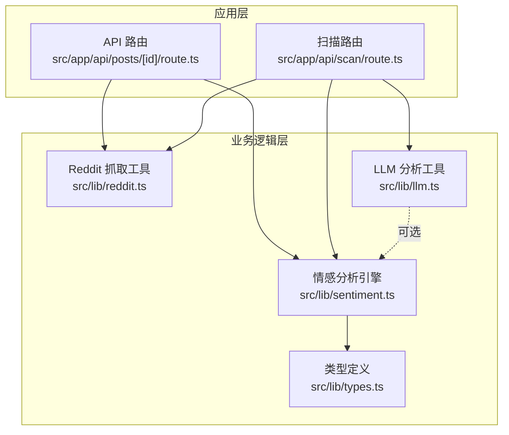
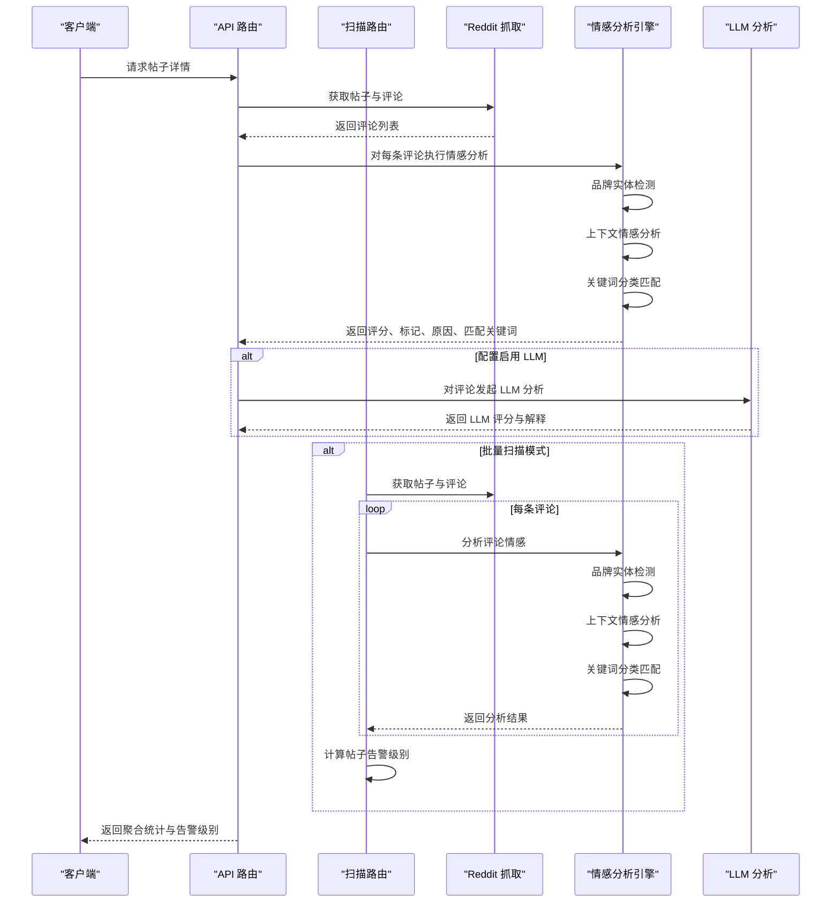
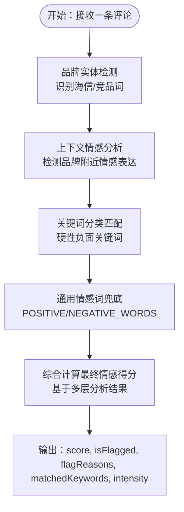
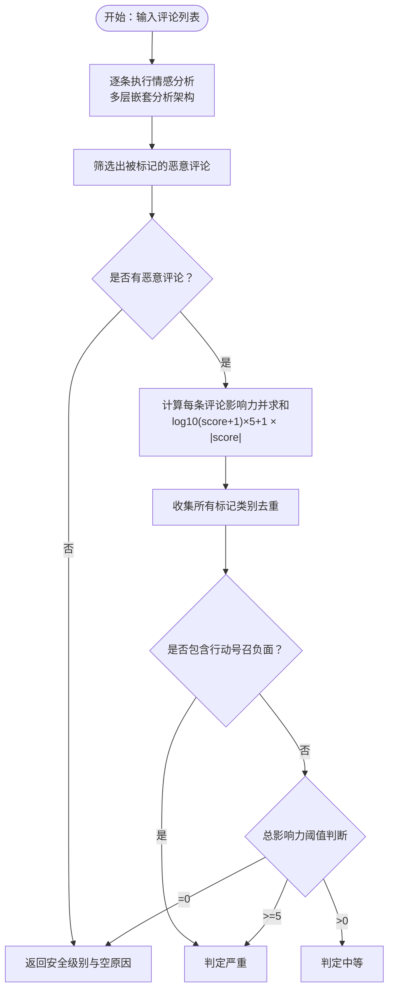
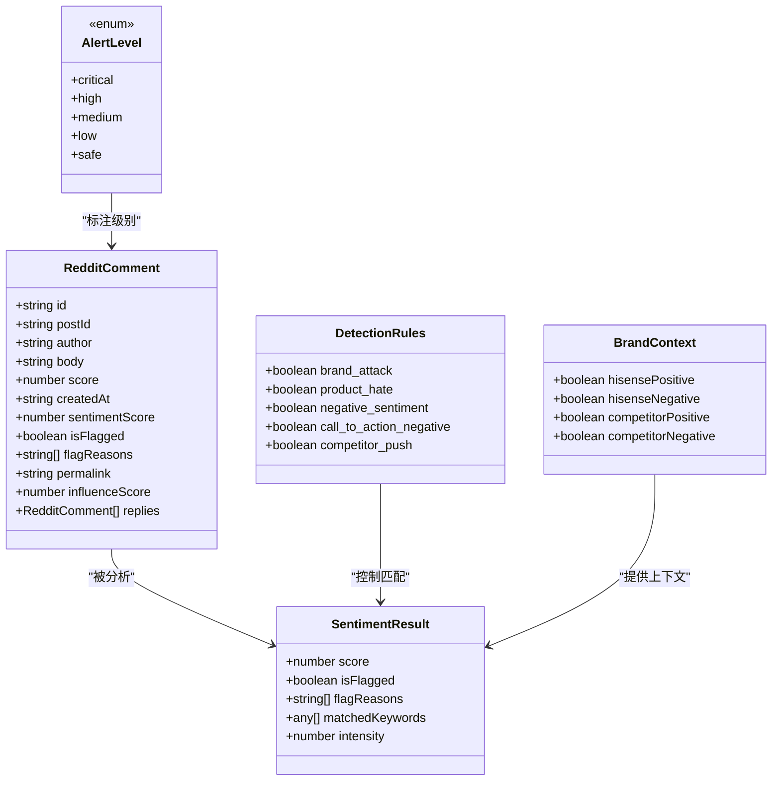
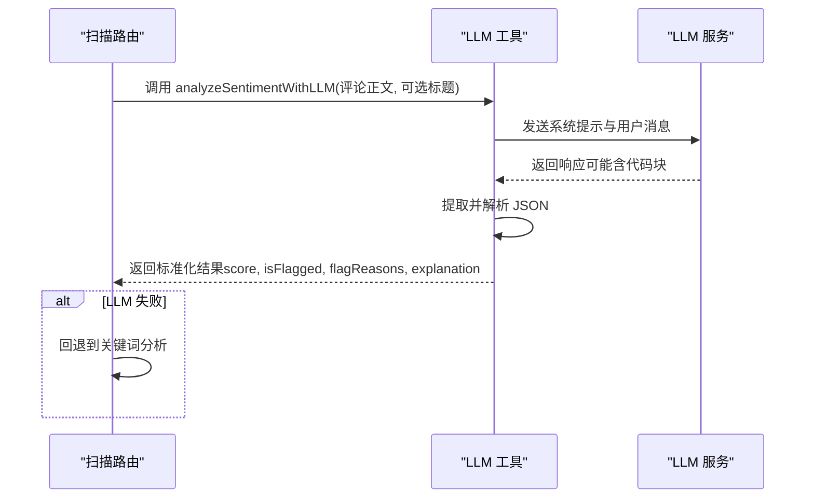
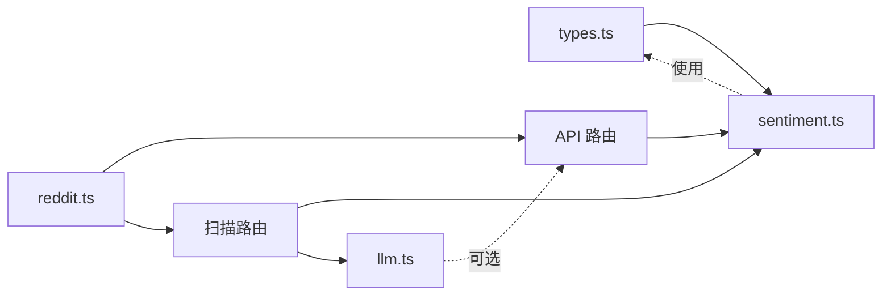

# 情感分析引擎

<cite>
**本文引用的文件**
- [sentiment.ts](file://src/lib/sentiment.ts)
- [types.ts](file://src/lib/types.ts)
- [reddit.ts](file://src/lib/reddit.ts)
- [route.ts](file://src/app/api/posts/[id]/route.ts)
- [llm.ts](file://src/lib/llm.ts)
- [scan-route.ts](file://src/app/api/scan/route.ts)
- [config.json](file://data/config.json)
</cite>

## 更新摘要
**变更内容**
- 重大关键词库扩展：新增5个主要关键词类别（brand_attack、product_hate、negative_sentiment、call_to_action_negative、competitor_push）
- POSITIVE_EMOTION_WORDS和NEGATIVE_EMOTION_WORDS大幅扩展，提供更丰富的通用情感词库
- POSITIVE_PATTERNS从65个扩展到120+，显著增强品牌攻击检测、产品仇恨检测、情感表达识别和竞品比较分析能力
- 增强的品牌实体检测和上下文情感分析功能
- 改进的权重计算和评分机制

## 目录
1. [简介](#简介)
2. [项目结构](#项目结构)
3. [核心组件](#核心组件)
4. [架构概览](#架构概览)
5. [详细组件分析](#详细组件分析)
6. [依赖关系分析](#依赖关系分析)
7. [性能考量](#性能考量)
8. [故障排查指南](#故障排查指南)
9. [结论](#结论)
10. [附录](#附录)

## 简介
本文件面向情感分析引擎，系统化阐述基于多层嵌套分析系统的恶意评论检测实现，涵盖以下要点：
- 品牌实体检测与上下文情感分析
- 专用海信产品评估功能
- 关键词匹配策略与权重计算
- 规则配置与启用控制
- 情感评分机制与正负向判定
- 告警级别判定逻辑与影响力得分
- 与 RedditComment 类型的集成与数据流
- 实际代码中的调用示例与优化建议

该引擎采用"品牌实体检测 + 通用情感词兜底 + 关键词分类负面检测"的三层分析架构，提供可选的 LLM 辅助分析能力，作为规则引擎的补充。

## 项目结构
情感分析引擎位于 src/lib/sentiment.ts，围绕 RedditComment 类型进行处理，并通过 API 路由在应用层使用。核心类型定义位于 src/lib/types.ts，Reddit 数据抓取与聚合逻辑位于 src/lib/reddit.ts，扫描和分析逻辑位于 src/app/api/scan/route.ts，部分调用示例可在 API 路由中找到。

**图表来源**
- [sentiment.ts:1-959](file://src/lib/sentiment.ts#L1-L959)
- [types.ts:1-194](file://src/lib/types.ts#L1-L194)
- [reddit.ts:1-94](file://src/lib/reddit.ts#L1-L94)
- [route.ts:76-97](file://src/app/api/posts/[id]/route.ts#L76-L97)
- [llm.ts:241-305](file://src/lib/llm.ts#L241-L305)
- [scan-route.ts:1-394](file://src/app/api/scan/route.ts#L1-L394)

**章节来源**
- [sentiment.ts:1-959](file://src/lib/sentiment.ts#L1-L959)
- [types.ts:1-194](file://src/lib/types.ts#L1-L194)
- [reddit.ts:1-94](file://src/lib/reddit.ts#L1-L94)
- [route.ts:76-97](file://src/app/api/posts/[id]/route.ts#L76-L97)
- [scan-route.ts:1-394](file://src/app/api/scan/route.ts#L1-L394)

## 核心组件
- **品牌实体检测**：专门针对海信品牌词的精确识别，包括中文和英文品牌词
- **上下文情感分析**：检测品牌词附近（±60字符）的正负面情感表达
- **专用海信产品评估**：针对海信电视产品的专业情感分析，包括画质、音质、性能等维度
- **关键词分类与权重**：品牌攻击、产品厌恶、负面情绪、负面行动号召、竞品推动
- **通用情感词兜底**：POSITIVE_EMOTION_WORDS 和 NEGATIVE_EMOTION_WORDS 提供基础情感评分
- **正向模式匹配**：品牌直接推荐、购买推荐、产品好评、满意度表达等
- **强度修饰词与否定词**：提升负面强度或抑制误判
- **评分与标记**：综合分析结果，输出 -1 到 1 的分数与是否标记、标记原因、匹配关键词列表、强度等级
- **影响力得分**：结合点赞数与情感强度，衡量恶意评论传播影响
- **帖子级告警**：汇总恶意评论影响力，按阈值判定严重/中等/安全

**章节来源**
- [sentiment.ts:155-170](file://src/lib/sentiment.ts#L155-L170)
- [sentiment.ts:599-641](file://src/lib/sentiment.ts#L599-L641)
- [sentiment.ts:718-788](file://src/lib/sentiment.ts#L718-L788)
- [sentiment.ts:819-828](file://src/lib/sentiment.ts#L819-L828)

## 架构概览
情感分析引擎采用"品牌实体检测 + 通用情感词兜底 + 关键词分类负面检测"的三层分析架构：
- **第一层：品牌实体检测**：识别海信品牌词和竞品词，建立品牌上下文
- **第二层：上下文情感分析**：检测品牌词附近的正负面情感表达，提供精准的语境理解
- **第三层：关键词分类与通用情感词**：提供兜底的情感分析和恶意评论检测
- **规则引擎**：关键词匹配与强度修正，快速、稳定、可解释
- **LLM 补充**：在规则引擎之外提供更灵活的语义理解，适合复杂场景与边界案例

**图表来源**
- [route.ts:76-97](file://src/app/api/posts/[id]/route.ts#L76-L97)
- [scan-route.ts:174-225](file://src/app/api/scan/route.ts#L174-L225)
- [reddit.ts:10-56](file://src/lib/reddit.ts#L10-L56)
- [sentiment.ts:653-816](file://src/lib/sentiment.ts#L653-L816)
- [llm.ts:241-305](file://src/lib/llm.ts#L241-L305)

## 详细组件分析

### 组件一：多层嵌套分析架构
- **品牌实体检测层**
  - 专门识别海信品牌词：'hisense'、'海信'、'hisense tv'等
  - 识别竞品词：'samsung'、'lg'、'tcl'、'sony'等
  - 为后续上下文分析提供基础
- **上下文情感分析层**
  - 检测品牌词附近（±60字符）的正负面情感表达
  - 识别强表达词汇：'love'、'amazing'、'hate'、'terrible'等
  - 提供精准的品牌情感上下文理解
- **关键词分类与通用情感词层**
  - 硬性负面关键词分类：品牌攻击、产品仇恨、号召抵制等
  - 通用情感词兜底：提供基础情感评分
  - 正向模式匹配：品牌推荐、购买推荐等

**图表来源**
- [sentiment.ts:653-816](file://src/lib/sentiment.ts#L653-L816)
- [sentiment.ts:599-641](file://src/lib/sentiment.ts#L599-L641)
- [sentiment.ts:718-788](file://src/lib/sentiment.ts#L718-L788)

**章节来源**
- [sentiment.ts:155-170](file://src/lib/sentiment.ts#L155-L170)
- [sentiment.ts:599-641](file://src/lib/sentiment.ts#L599-L641)
- [sentiment.ts:718-788](file://src/lib/sentiment.ts#L718-L788)
- [sentiment.ts:653-816](file://src/lib/sentiment.ts#L653-L816)

### 组件二：专用海信产品评估功能
- **海信电视产品特征识别**
  - 电视型号识别：'u9', 'u8', 'e7'等
  - 技术特性识别：'miniled', 'rgb', 'sky blue'等
  - 产品系列识别：'canvas', 'fire tv'等
- **画质情感分析**
  - 画质相关正面词汇：'great picture', 'beautiful colors', 'stunning display'
  - 画质相关负面词汇：'burn in', 'cloudy screen', 'image retention'
- **音质情感分析**
  - 音质相关正面词汇：'great sound', 'powerful bass', 'booming audio'
  - 音质相关负面词汇：'tinny sound', 'audio dropout', 'no sound'
- **性能情感分析**
  - 性能相关正面词汇：'low input lag', 'smooth gameplay', 'responsive'
  - 性能相关负面词汇：'laggy', 'freezes', 'unresponsive'

**章节来源**
- [sentiment.ts:155-163](file://src/lib/sentiment.ts#L155-L163)
- [sentiment.ts:413-442](file://src/lib/sentiment.ts#L413-L442)
- [sentiment.ts:446-452](file://src/lib/sentiment.ts#L446-L452)
- [sentiment.ts:455-466](file://src/lib/sentiment.ts#L455-L466)

### 组件三：增强的权重计算和评分机制
- **权重映射**
  - call_to_action_negative: 2.5（最高权重）
  - brand_attack: 2.0
  - competitor_push: 1.5
  - product_hate: 1.5
  - negative_sentiment: 1.0
- **强度修饰词**
  - 1个修饰词：1.2倍系数
  - ≥2个修饰词：1.5倍系数
- **点赞因子**
  - score > 10：1.3倍
  - score > 5：1.1倍
  - 否则：1.0倍
- **最终评分计算**
  - 硬性负面命中：直接使用负面得分
  - 仅提到海信：考虑品牌上下文情感
  - 仅提到竞品：转换为对海信的负面或正面
  - 同时提到两者：轻微正面或负面

**章节来源**
- [sentiment.ts:819-828](file://src/lib/sentiment.ts#L819-L828)
- [sentiment.ts:695-702](file://src/lib/sentiment.ts#L695-L702)
- [sentiment.ts:724-802](file://src/lib/sentiment.ts#L724-L802)

### 组件四：影响力得分与帖子级告警
- **单条评论影响力得分**
  - 公式：log10(max(score, 1) + 1) × 5 + 1 × |情感得分|
  - 确保非恶意评论也有最小影响力
- **帖子级告警**
  - 汇总所有恶意评论影响力得分
  - 若存在行动号召负面类别，直接判定严重
  - 判定阈值：≥5 或含行动号召 → 严重；>0 且 <5 → 中等；=0 → 安全
- **输出字段**：级别、原因集合、恶意评论数量、总影响力得分

**图表来源**
- [sentiment.ts:834-878](file://src/lib/sentiment.ts#L834-L878)

**章节来源**
- [sentiment.ts:834-878](file://src/lib/sentiment.ts#L834-L878)

### 组件五：与 RedditComment 类型的集成与数据流
- **类型定义**
  - RedditComment 包含 id、postId、author、body、score、createdAt、sentimentScore、isFlagged、flagReasons、permalink、influenceScore、replies 等字段
- **数据流转**
  - 抓取层：fetchRedditPost/fetchMultiplePosts 获取帖子与评论
  - 分析层：对每条评论调用 analyzeCommentSentiment，填充 sentimentScore、isFlagged、flagReasons、matchedKeywords、intensity
  - 聚合层：计算每条评论影响力，汇总恶意评论数量与总影响力，生成帖子级告警级别
  - 展示层：API 路由返回统计摘要与告警级别
- **扫描流程**
  - 批量扫描：scan-route.ts 中的 POST 方法
  - 单条分析：route.ts 中的 GET 方法
  - LLM 补充：可选的 analyzeSentimentWithLLM 调用

**图表来源**
- [types.ts:31-44](file://src/lib/types.ts#L31-L44)
- [types.ts:138-144](file://src/lib/types.ts#L138-L144)
- [types.ts:3-6](file://src/lib/types.ts#L3-L6)
- [sentiment.ts:644-650](file://src/lib/sentiment.ts#L644-L650)
- [sentiment.ts:599-641](file://src/lib/sentiment.ts#L599-L641)

**章节来源**
- [types.ts:31-44](file://src/lib/types.ts#L31-L44)
- [types.ts:138-144](file://src/lib/types.ts#L138-L144)
- [types.ts:3-6](file://src/lib/types.ts#L3-L6)
- [reddit.ts:10-56](file://src/lib/reddit.ts#L10-L56)
- [route.ts:76-97](file://src/app/api/posts/[id]/route.ts#L76-L97)
- [scan-route.ts:174-225](file://src/app/api/scan/route.ts#L174-L225)

### 组件六：LLM 辅助分析（可选）
- **能力概述**
  - 在规则引擎之外，使用 LLM 对评论进行更细粒度的语义分析，返回评分、标记与解释
  - 专门针对海信品牌的情感分析，提供中文解释
- **使用场景**
  - 规则边界案例、复杂语气与隐含意图
  - 批量扫描时的降级策略
- **调用方式**
  - 通过 LLM 工具函数发起请求，解析 JSON 结果并进行裁剪与校验
  - 支持多种 LLM 提供商：OpenAI、Anthropic、Google、DeepSeek 等

**图表来源**
- [llm.ts:241-305](file://src/lib/llm.ts#L241-L305)
- [scan-route.ts:181-214](file://src/app/api/scan/route.ts#L181-L214)

**章节来源**
- [llm.ts:241-305](file://src/lib/llm.ts#L241-L305)
- [scan-route.ts:181-214](file://src/app/api/scan/route.ts#L181-L214)

### 组件七：关键词库扩展与增强功能

**更新** 基于最新的代码分析，情感分析引擎经历了重大关键词库扩展：

#### 新增的5个主要关键词类别
- **brand_attack（品牌攻击）**：包含辱骂、抵制、欺诈等品牌攻击性词汇
- **product_hate（产品仇恨）**：涵盖产品整体贬低、显示问题、故障描述、软件问题等
- **negative_sentiment（负面情感）**：直接情感表达、脏话、愤怒、失望等
- **call_to_action_negative（负面行动号召）**：劝阻购买、号召抵制、寻求退款等
- **competitor_push（竞品推动）**：直接推荐竞品、贬低海信、具体对比推荐等

#### 扩展的情感词库
- **POSITIVE_EMOTION_WORDS**：从基础词汇扩展到250+个正面情感词，包括：
  - 核心正面形容词：'great', 'amazing', 'excellent', 'wonderful', 'awesome'等
  - 喜爱/欣赏动词：'love', 'adore', 'cherish', 'prefer'等
  - 推荐/支持：'recommend', 'suggest', 'promote', 'endorse'等
  - 满意度表达：'satisfied', 'pleased', 'happy', 'thrilled'等
  - 产品好评：'bright', 'clear', 'smooth', 'responsive'等
  - 使用体验：'comfortable', 'convenient', 'effortless'等

- **NEGATIVE_EMOTION_WORDS**：从基础词汇扩展到340+个负面情感词，包括：
  - 核心负面形容词：'terrible', 'awful', 'horrible', 'worst', 'pathetic'等
  - 厌恶/反感动词：'hate', 'dislike', 'despise', 'loathe'等
  - 失望/不满：'disappointed', 'frustrated', 'annoyed'等
  - 愤怒/辱骂：'pissed', 'fucking', 'damn', 'shit'等
  - 产品质量：'broken', 'defective', 'faulty', 'glitchy'等
  - 故障描述：'failed', 'died', 'burned out', 'quit working'等

#### 扩展的正向模式匹配
- **POSITIVE_PATTERNS**：从65个扩展到120+个正则模式，包括：
  - 品牌直接提及与推荐：'love hisense', 'recommend hisense', 'hisense all the way'
  - 推荐购买：'highly recommend', 'would definitely recommend', 'get hisense'
  - 价值/性价比：'best bang for the buck', 'great value', 'worth every penny'
  - 产品好评（画质）：'great picture', 'beautiful colors', 'stunning display'
  - 产品好评（声音/音质）：'great sound', 'powerful bass', 'booming audio'
  - 产品好评（游戏/性能）：'low input lag', 'smooth gameplay', '120hz'
  - 产品好评（系统/软件/使用）：'easy to set up', 'fast ui', 'plug and play'
  - 满意度/体验：'very happy', 'satisfied', 'exceeded expectations'
  - 对比竞品推荐海信：'hisense over samsung', 'beats sony', 'better than lg'
  - 复购/推荐意愿：'buying another', 'would buy again', 'recommend to friends'

**章节来源**
- [sentiment.ts:8-151](file://src/lib/sentiment.ts#L8-L151)
- [sentiment.ts:173-252](file://src/lib/sentiment.ts#L173-L252)
- [sentiment.ts:255-348](file://src/lib/sentiment.ts#L255-L348)
- [sentiment.ts:351-537](file://src/lib/sentiment.ts#L351-L537)

## 依赖关系分析
- **模块耦合**
  - sentiment.ts 依赖 types.ts 中的 RedditComment、DetectionRules、AlertLevel 等类型
  - API 路由依赖 reddit.ts 获取评论数据，并调用 sentiment.ts 进行分析
  - 扫描路由依赖 reddit.ts、sentiment.ts、llm.ts 进行批量分析
  - LLM 分析作为可选依赖，独立于规则引擎
- **规则配置**
  - DetectionRules 控制各关键词分类是否参与匹配，支持动态开关
- **外部依赖**
  - LLM 模块依赖外部模型服务（如 OpenAI），需正确配置密钥与模型
  - 扫描路由依赖 Apify 服务进行 Reddit 数据抓取

**图表来源**
- [types.ts:1-194](file://src/lib/types.ts#L1-L194)
- [sentiment.ts:1-959](file://src/lib/sentiment.ts#L1-L959)
- [reddit.ts:1-94](file://src/lib/reddit.ts#L1-L94)
- [llm.ts:241-305](file://src/lib/llm.ts#L241-L305)
- [scan-route.ts:1-394](file://src/app/api/scan/route.ts#L1-L394)

**章节来源**
- [types.ts:1-194](file://src/lib/types.ts#L1-L194)
- [sentiment.ts:1-959](file://src/lib/sentiment.ts#L1-L959)
- [reddit.ts:1-94](file://src/lib/reddit.ts#L1-L94)
- [llm.ts:241-305](file://src/lib/llm.ts#L241-L305)
- [scan-route.ts:1-394](file://src/app/api/scan/route.ts#L1-L394)

## 性能考量
- **时间复杂度**
  - 单条评论：品牌实体检测 O(n) + 上下文分析 O(n) + 关键词匹配 O(m×k)
  - 其中 n 为文本长度，m 为关键词分类数，k 为平均关键词数
  - 批量扫描：O(N_comments) × (多层分析 + 聚合)
- **优化建议**
  - 缓存品牌实体检测结果，避免重复计算
  - 对长文本先做预过滤（如包含关键词集合），再进行严格匹配
  - 将强度修饰词与否定词匹配改为滑动窗口，减少重复扫描
  - 对 LLM 分析进行批量限速与重试，避免外部依赖抖动
  - 对高并发场景，考虑将分析任务异步化并引入队列
  - 上下文情感分析使用固定窗口大小（±60字符）限制计算复杂度

**章节来源**
- [sentiment.ts:599-641](file://src/lib/sentiment.ts#L599-L641)
- [sentiment.ts:695-702](file://src/lib/sentiment.ts#L695-L702)
- [llm.ts:241-305](file://src/lib/llm.ts#L241-L305)

## 故障排查指南
- **常见问题**
  - 误报/漏报：检查 DetectionRules 是否正确启用；调整关键词分类权重或新增关键词
  - 品牌误识别：检查品牌实体检测词库，确保包含最新品牌词
  - 上下文分析不准确：调整上下文窗口大小或情感词库
  - 强度偏差：核查强度修饰词与点赞因子设置，确保对极端情绪与高赞评论合理建模
  - LLM 解析失败：确认响应格式与 JSON 提取逻辑，必要时增加重试与降级策略
- **调试步骤**
  - 在规则引擎中打印 matchedKeywords 与 intensity，定位触发因素
  - 对疑似边界评论单独调用 analyzeWithOpenAI 或 analyzeSentimentWithLLM 对比验证
  - 检查 Reddit 抓取层返回数据完整性，确保 body 与 score 字段可用
  - 验证品牌实体检测是否正确识别海信和竞品词
  - 检查上下文情感分析是否正确提取品牌附近的正负面表达

**章节来源**
- [sentiment.ts:653-816](file://src/lib/sentiment.ts#L653-L816)
- [sentiment.ts:599-641](file://src/lib/sentiment.ts#L599-L641)
- [llm.ts:241-305](file://src/lib/llm.ts#L241-L305)

## 结论
该情感分析引擎采用多层嵌套分析架构，从品牌实体检测、上下文情感分析到关键词分类匹配，实现了对 Reddit 评论的深度情感分析。通过专用的海信产品评估功能和增强的权重计算机制，系统能够准确识别恶意评论并给出明确的告警级别。最新的关键词库扩展进一步增强了系统的检测能力，特别是品牌攻击检测、产品仇恨检测、情感表达识别和竞品比较分析方面。建议在生产环境中结合业务反馈持续迭代关键词与权重，并根据流量与稳定性需求对性能与可靠性进行针对性优化。

## 附录

### 品牌实体关键词对照
- **海信品牌词**：'hisense'、'海信'、'hisense tv'、'hisense smart tv'、'hisense television'等
- **竞品词**：'samsung'、'sumsung'、'lg'、'tcl'、'sony'、'vizio'等
- **海信电视型号**：'u9'、'u8'、'e7'、'ux'、'ur9sg'、'ur8sg'等
- **技术特性**：'miniled'、'rgb'、'sky blue'、'canvas'、'world cup'等

**章节来源**
- [sentiment.ts:155-170](file://src/lib/sentiment.ts#L155-L170)

### 上下文情感分析规则
- **检测窗口**：品牌词 ±60 字符
- **强表达词汇**：'love'、'amazing'、'excellent'、'hate'、'terrible'、'awful'等
- **情感上下文**：区分海信和竞品的不同情感分析逻辑
- **对比场景处理**：同时提到海信和竞品时的权重分配

**章节来源**
- [sentiment.ts:599-641](file://src/lib/sentiment.ts#L599-L641)

### 评分与标记标准
- **评分范围**：-1（极度负面）到 1（极度正面）
- **标记条件**：存在恶意关键词即标记
- **品牌场景特殊处理**：
  - 仅海信：考虑品牌上下文情感
  - 仅竞品：转换为对海信的负面或正面
  - 同时提及：轻微正面或负面
- **中性**：既无负面也无正向信号

**章节来源**
- [sentiment.ts:724-802](file://src/lib/sentiment.ts#L724-L802)

### 帖子级告警阈值
- **严重**：总影响力 ≥ 5，或存在行动号召负面
- **中等**：总影响力 > 0 且 < 5
- **安全**：总影响力 = 0

**章节来源**
- [sentiment.ts:866-878](file://src/lib/sentiment.ts#L866-L878)

### 关键词库统计
- **硬性负面关键词分类**：5个类别，总计数千个关键词
- **POSITIVE_EMOTION_WORDS**：250+个正面情感词
- **NEGATIVE_EMOTION_WORDS**：340+个负面情感词
- **POSITIVE_PATTERNS**：120+个正则模式
- **INTENSITY_MODIFIERS**：12个强度修饰词
- **NEGATION_WORDS**：8个否定词

**章节来源**
- [sentiment.ts:8-151](file://src/lib/sentiment.ts#L8-L151)
- [sentiment.ts:173-252](file://src/lib/sentiment.ts#L173-L252)
- [sentiment.ts:255-348](file://src/lib/sentiment.ts#L255-L348)
- [sentiment.ts:351-537](file://src/lib/sentiment.ts#L351-L537)

### 实际调用示例（路径参考）
- **多层嵌套情感分析**
  - [analyzeCommentSentiment:653-816](file://src/lib/sentiment.ts#L653-L816)
- **品牌实体检测**
  - [detectBrandContextSentiment:599-641](file://src/lib/sentiment.ts#L599-L641)
- **通用情感词检测**
  - [detectGenericEmotion:571-595](file://src/lib/sentiment.ts#L571-L595)
- **计算单条评论影响力得分**
  - [calcCommentInfluenceScore:834-838](file://src/lib/sentiment.ts#L834-L838)
- **计算帖子级告警级别**
  - [calculatePostAlertLevel:840-878](file://src/lib/sentiment.ts#L840-L878)
- **批量扫描情感分析**
  - [scan-route.ts:174-225](file://src/app/api/scan/route.ts#L174-L225)
- **API 路由中聚合统计与影响力**
  - [route.ts:76-97](file://src/app/api/posts/[id]/route.ts#L76-L97)
- **LLM 辅助分析（可选）**
  - [analyzeSentimentWithLLM:241-305](file://src/lib/llm.ts#L241-L305)