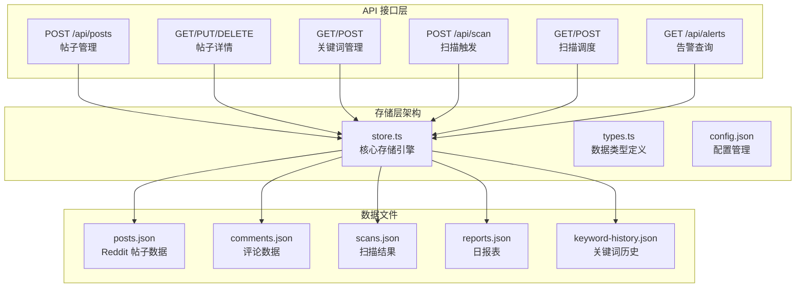
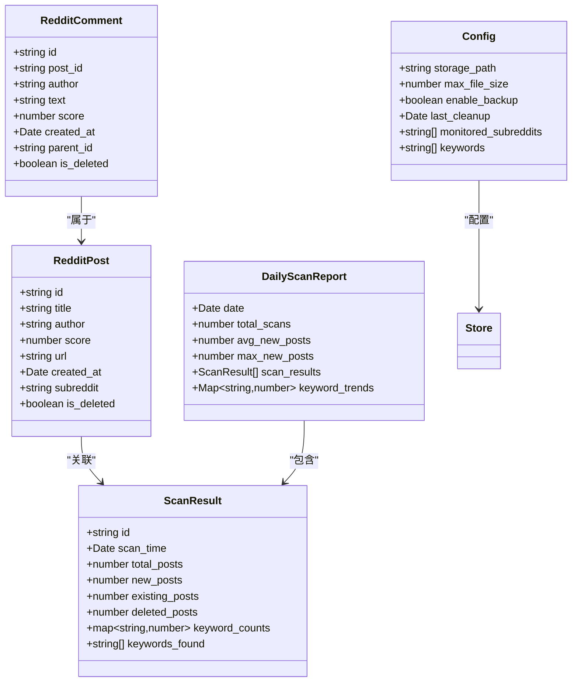
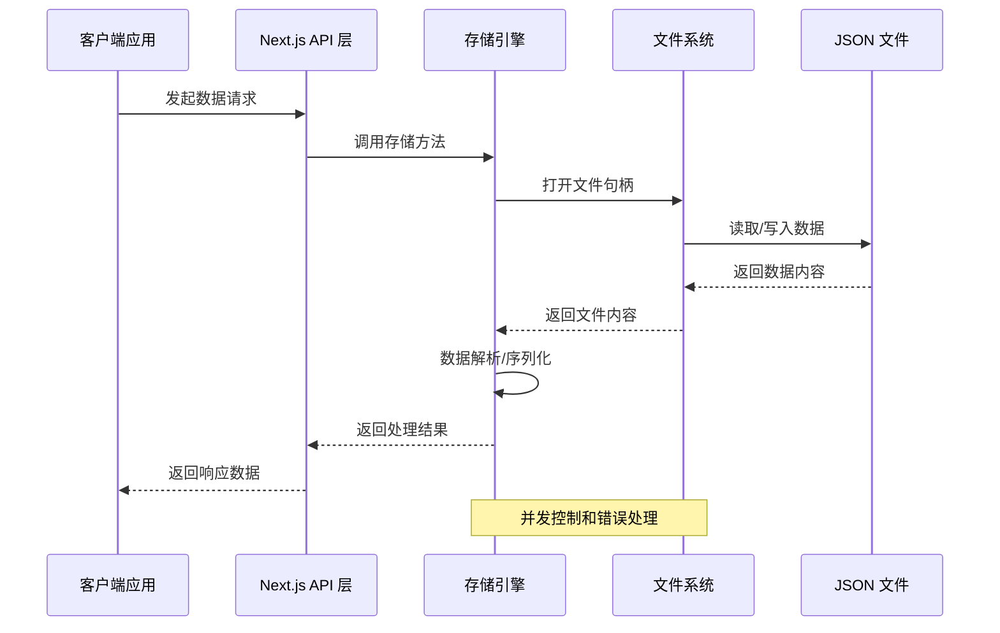
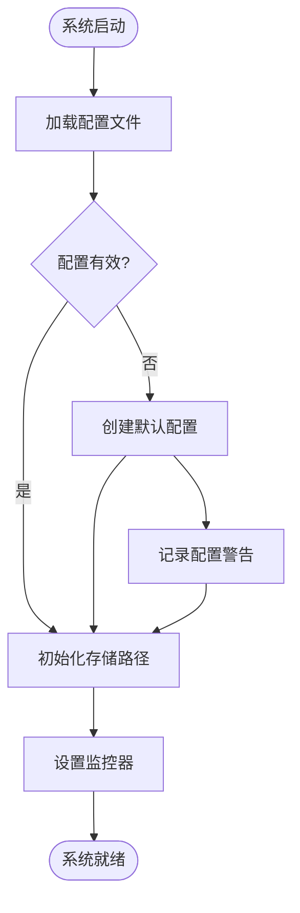
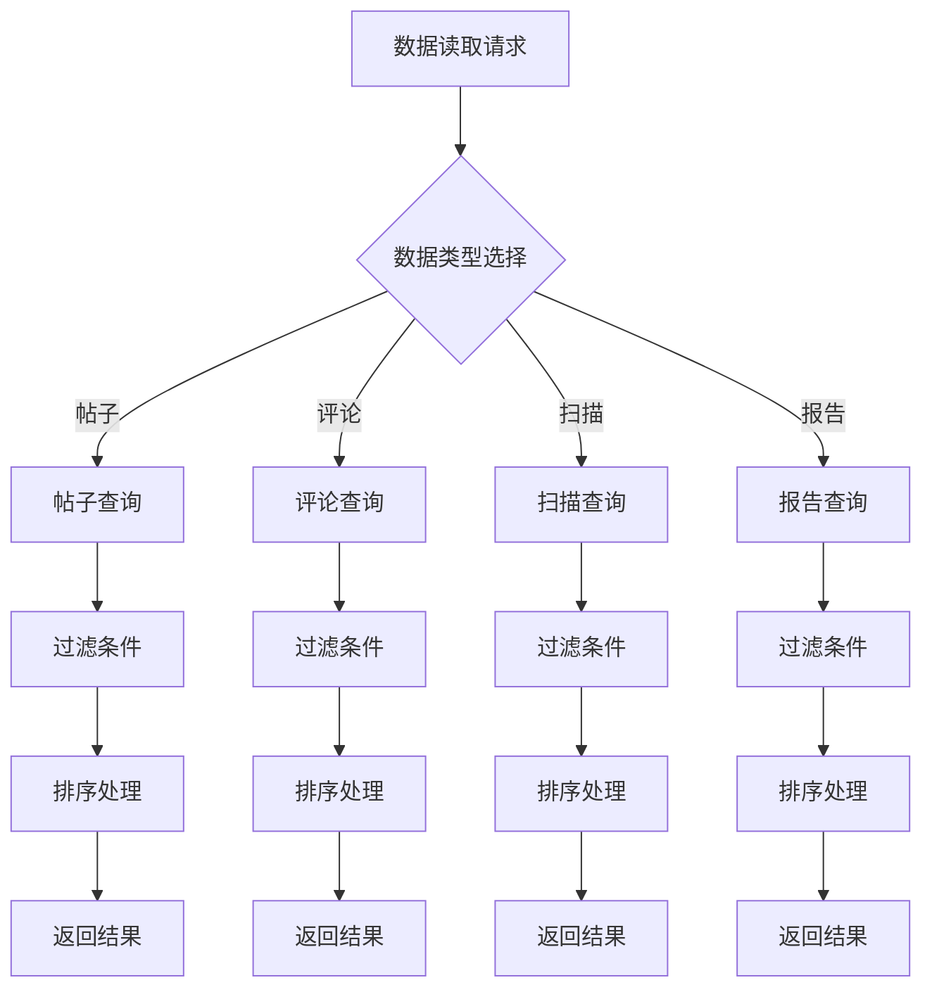
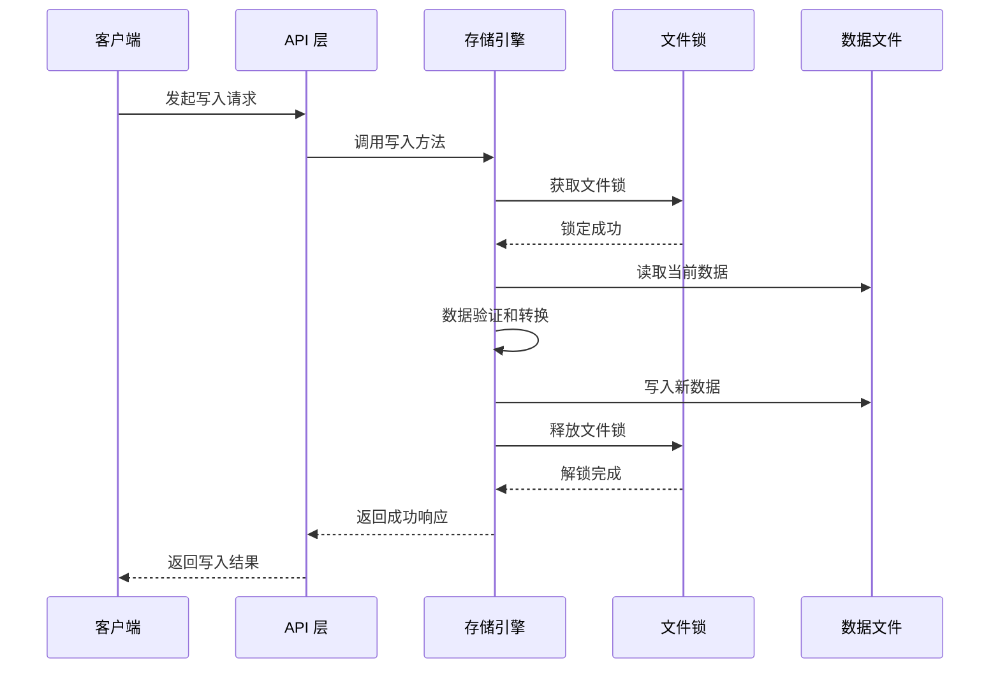
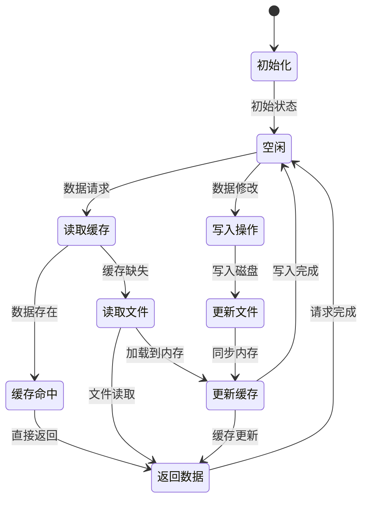
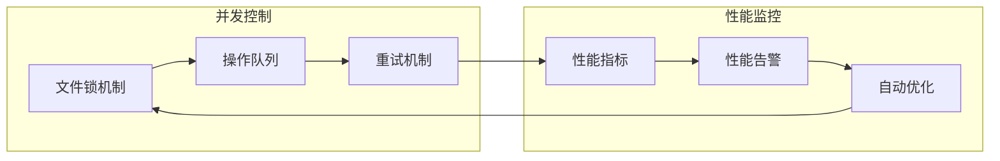
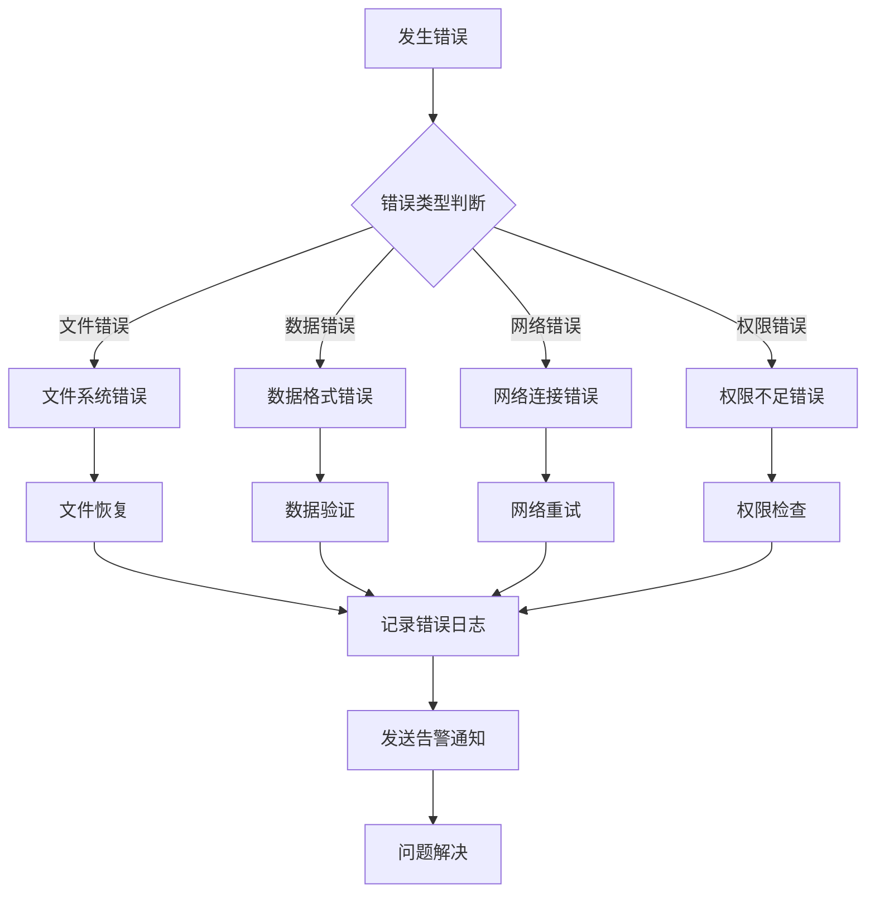

# 数据存储层

<cite>
**本文档引用的文件**
- [store.ts](file://src/lib/store.ts)
- [types.ts](file://src/lib/types.ts)
- [config.json](file://data/config.json)
- [posts.json](file://data/posts.json)
- [comments.json](file://data/comments.json)
- [scans.json](file://data/scans.json)
- [reports.json](file://data/reports.json)
- [keyword-history.json](file://data/keyword-history.json)
- [posts route.ts](file://src/app/api/posts/route.ts)
- [posts [id] route.ts](file://src/app/api/posts/[id]/route.ts)
- [keywords route.ts](file://src/app/api/keywords/route.ts)
- [scan route.ts](file://src/app/api/scan/route.ts)
- [scan-schedule route.ts](file://src/app/api/scan-schedule/route.ts)
- [alerts route.ts](file://src/app/api/alerts/route.ts)
</cite>

## 目录
1. [简介](#简介)
2. [项目结构](#项目结构)
3. [核心组件](#核心组件)
4. [架构概览](#架构概览)
5. [详细组件分析](#详细组件分析)
6. [依赖关系分析](#依赖关系分析)
7. [性能考虑](#性能考虑)
8. [故障排除指南](#故障排除指南)
9. [结论](#结论)

## 简介

本项目采用基于本地 JSON 文件的数据存储机制，构建了一个轻量级但功能完整的数据持久化系统。该存储层通过纯文本 JSON 文件实现数据的持久化存储，支持多种数据类型和复杂的业务逻辑。

系统的核心设计理念是：
- **简单可靠**：使用标准 JSON 格式，易于理解和维护
- **零依赖**：不依赖外部数据库，降低部署复杂度
- **可扩展性**：支持动态数据结构和灵活的查询模式
- **安全性**：提供基本的并发控制和数据一致性保障

## 项目结构

数据存储层采用分层架构设计，主要包含以下组件：



**图表来源**
- [store.ts:1-200](file://src/lib/store.ts#L1-L200)
- [types.ts:1-150](file://src/lib/types.ts#L1-L150)
- [config.json:1-100](file://data/config.json#L1-L100)

**章节来源**
- [store.ts:1-200](file://src/lib/store.ts#L1-L200)
- [types.ts:1-150](file://src/lib/types.ts#L1-L150)

## 核心组件

### 存储引擎 (Store Engine)

存储引擎是整个数据存储层的核心，负责管理所有 JSON 文件的读写操作。其主要功能包括：

- **文件管理**：统一管理数据文件的创建、读取、更新和删除
- **数据序列化**：处理 JSON 数据的编码和解码
- **并发控制**：提供基本的文件锁定机制防止并发冲突
- **错误处理**：统一处理文件操作异常和数据验证错误

### 数据类型系统

系统定义了完整的数据类型体系，确保数据的一致性和完整性：



**图表来源**
- [types.ts:1-150](file://src/lib/types.ts#L1-L150)
- [store.ts:1-200](file://src/lib/store.ts#L1-L200)

**章节来源**
- [types.ts:1-150](file://src/lib/types.ts#L1-L150)
- [store.ts:1-200](file://src/lib/store.ts#L1-L200)

## 架构概览

数据存储层采用客户端-服务器架构，结合前端 API 调用和后端文件系统操作：



**图表来源**
- [store.ts:1-200](file://src/lib/store.ts#L1-L200)
- [posts route.ts:1-100](file://src/app/api/posts/route.ts#L1-L100)

## 详细组件分析

### 配置管理系统

配置文件 `config.json` 是整个存储系统的核心配置中心，负责管理存储路径、监控设置和系统行为参数。

#### 配置文件结构

配置文件采用键值对结构，支持以下配置项：

| 配置项 | 类型 | 描述 | 默认值 |
|--------|------|------|--------|
| storage_path | string | 数据文件存储根目录 | "./data" |
| max_file_size | number | 单个文件最大大小(MB) | 100 |
| enable_backup | boolean | 是否启用自动备份 | true |
| last_cleanup | string(Date) | 最后清理时间 | null |
| monitored_subreddits | array(string) | 监控的子版块列表 | [] |
| keywords | array(string) | 关键词监控列表 | [] |

#### 配置管理流程



**图表来源**
- [config.json:1-100](file://data/config.json#L1-L100)
- [store.ts:1-200](file://src/lib/store.ts#L1-L200)

**章节来源**
- [config.json:1-100](file://data/config.json#L1-L100)
- [store.ts:1-200](file://src/lib/store.ts#L1-L200)

### 数据模型设计

#### RedditPost 数据模型

RedditPost 是系统中最核心的数据实体，代表一个 Reddit 帖子的所有信息。

| 字段名 | 类型 | 必填 | 描述 | 示例 |
|--------|------|------|------|------|
| id | string | 是 | 帖子唯一标识符 | "t3_xxxxxx" |
| title | string | 是 | 帖子标题 | "有趣的发现..." |
| author | string | 是 | 作者用户名 | "user123" |
| score | number | 是 | 帖子得分 | 150 |
| url | string | 是 | 帖子链接 | "https://reddit.com/..." |
| created_at | Date | 是 | 创建时间 | "2024-01-01T00:00:00Z" |
| subreddit | string | 是 | 所属子版块 | "technology" |
| is_deleted | boolean | 否 | 是否已删除 | false |

#### RedditComment 数据模型

RedditComment 代表 Reddit 帖子下的评论数据。

| 字段名 | 类型 | 必填 | 描述 | 示例 |
|--------|------|------|------|------|
| id | string | 是 | 评论唯一标识符 | "t1_xxxxxx" |
| post_id | string | 是 | 关联的帖子ID | "t3_xxxxxx" |
| author | string | 是 | 作者用户名 | "comment_user" |
| text | string | 是 | 评论内容 | "很好的观点..." |
| score | number | 是 | 评论得分 | 25 |
| created_at | Date | 是 | 创建时间 | "2024-01-01T00:01:00Z" |
| parent_id | string | 否 | 父评论ID | "t1_yyyyyy" |
| is_deleted | boolean | 否 | 是否已删除 | false |

#### ScanResult 数据模型

ScanResult 记录单次扫描的结果统计信息。

| 字段名 | 类型 | 必填 | 描述 | 示例 |
|--------|------|------|------|------|
| id | string | 是 | 扫描结果ID | "scan_20240101_001" |
| scan_time | Date | 是 | 扫描执行时间 | "2024-01-01T00:00:00Z" |
| total_posts | number | 是 | 总帖子数 | 1500 |
| new_posts | number | 是 | 新增帖子数 | 120 |
| existing_posts | number | 是 | 存在的帖子数 | 1300 |
| deleted_posts | number | 是 | 删除的帖子数 | 80 |
| keyword_counts | map(string,number) | 是 | 关键词计数映射 | {"AI": 15, "机器学习": 8} |
| keywords_found | array(string) | 是 | 发现的关键词列表 | ["AI", "机器学习"] |

#### DailyScanReport 数据模型

DailyScanReport 汇总一天内的扫描结果。

| 字段名 | 类型 | 必填 | 描述 | 示例 |
|--------|------|------|------|------|
| date | Date | 是 | 报告日期 | "2024-01-01" |
| total_scans | number | 是 | 当日扫描次数 | 24 |
| avg_new_posts | number | 是 | 平均新增帖子数 | 120.5 |
| max_new_posts | number | 是 | 最大新增帖子数 | 250 |
| scan_results | array(ScanResult) | 是 | 扫描结果列表 | [ScanResult...] |
| keyword_trends | map(string,number) | 是 | 关键词趋势统计 | {"AI": 1200, "机器学习": 800} |

**章节来源**
- [types.ts:1-150](file://src/lib/types.ts#L1-L150)

### 数据访问模式

#### 读取操作模式

系统提供了多种数据读取模式，支持不同的查询需求：



**图表来源**
- [store.ts:1-200](file://src/lib/store.ts#L1-L200)
- [posts route.ts:1-100](file://src/app/api/posts/route.ts#L1-L100)

#### 写入操作模式

写入操作采用事务性设计，确保数据一致性：



**图表来源**
- [store.ts:1-200](file://src/lib/store.ts#L1-L200)

**章节来源**
- [store.ts:1-200](file://src/lib/store.ts#L1-L200)

### 缓存策略

系统实现了多层缓存机制来提升性能：

#### 内存缓存
- **LRU 缓存**：最近使用的数据优先保留在内存中
- **容量限制**：根据可用内存动态调整缓存大小
- **失效策略**：基于时间戳和访问频率的智能淘汰

#### 文件缓存
- **增量更新**：只同步发生变化的数据部分
- **批量写入**：减少频繁的磁盘 I/O 操作
- **预读机制**：预测用户可能访问的数据提前加载

#### 缓存一致性


**图表来源**
- [store.ts:1-200](file://src/lib/store.ts#L1-L200)

**章节来源**
- [store.ts:1-200](file://src/lib/store.ts#L1-L200)

## 依赖关系分析

### 组件依赖图

```mermaid
graph TB
subgraph "核心依赖"
Store[store.ts]
Types[types.ts]
Config[config.json]
end
subgraph "API 层"
PostsAPI[posts/route.ts]
PostDetailAPI[posts/[id]/route.ts]
KeywordsAPI[keywords/route.ts]
ScanAPI[scan/route.ts]
ScheduleAPI[scan-schedule/route.ts]
AlertsAPI[alerts/route.ts]
end
subgraph "数据文件"
PostsFile[posts.json]
CommentsFile[comments.json]
ScansFile[scans.json]
ReportsFile[reports.json]
KeywordsFile[keyword-history.json]
end
Store --> Types
Store --> Config
PostsAPI --> Store
PostDetailAPI --> Store
KeywordsAPI --> Store
ScanAPI --> Store
ScheduleAPI --> Store
AlertsAPI --> Store
Store --> PostsFile
Store --> CommentsFile
Store --> ScansFile
Store --> ReportsFile
Store --> KeywordsFile
```

**图表来源**
- [store.ts:1-200](file://src/lib/store.ts#L1-L200)
- [types.ts:1-150](file://src/lib/types.ts#L1-L150)
- [posts route.ts:1-100](file://src/app/api/posts/route.ts#L1-L100)

### 外部依赖

系统对外部依赖保持最小化原则：

| 依赖项 | 版本 | 用途 | 替代方案 |
|--------|------|------|----------|
| Node.js | >= 16.0.0 | 运行时环境 | - |
| Next.js | latest | Web 框架 | Express.js |
| TypeScript | latest | 类型系统 | JavaScript |

**章节来源**
- [store.ts:1-200](file://src/lib/store.ts#L1-L200)
- [types.ts:1-150](file://src/lib/types.ts#L1-L150)

## 性能考虑

### 存储性能优化

#### 文件 I/O 优化
- **异步操作**：所有文件操作采用异步非阻塞模式
- **批量处理**：合并多个小操作为批量操作
- **缓冲区管理**：合理设置文件缓冲区大小

#### 内存使用优化
- **流式处理**：大数据集采用流式读取避免内存溢出
- **对象池**：复用频繁创建的对象减少 GC 压力
- **延迟加载**：按需加载数据减少初始内存占用

#### 查询性能优化
- **索引策略**：为常用查询字段建立内存索引
- **查询缓存**：缓存热门查询结果
- **分页机制**：大数据集采用分页返回避免一次性传输

### 并发性能

系统通过以下机制保证高并发场景下的性能：



**图表来源**
- [store.ts:1-200](file://src/lib/store.ts#L1-L200)

## 故障排除指南

### 常见存储问题及解决方案

#### 文件锁定问题
**问题描述**：多个进程同时访问同一数据文件导致锁定冲突

**解决方案**：
1. 实施分布式文件锁机制
2. 添加操作超时检测
3. 实现自动重试逻辑

#### 数据一致性问题
**问题描述**：并发写入导致数据不一致

**解决方案**：
1. 采用乐观锁机制
2. 实现版本号控制
3. 建立数据校验和

#### 内存溢出问题
**问题描述**：大量数据加载导致内存不足

**解决方案**：
1. 实施流式处理
2. 增加内存限制配置
3. 优化数据结构

#### 性能下降问题
**问题描述**：随着数据量增长性能明显下降

**解决方案**：
1. 分析慢查询并优化索引
2. 实施数据分片策略
3. 增加缓存层

### 错误处理机制

系统建立了完善的错误处理和恢复机制：



**图表来源**
- [store.ts:1-200](file://src/lib/store.ts#L1-L200)

**章节来源**
- [store.ts:1-200](file://src/lib/store.ts#L1-L200)

## 结论

本数据存储层通过精心设计的架构和实现，成功构建了一个基于本地 JSON 文件的高效、可靠的存储系统。系统的主要优势包括：

### 核心优势
- **简单易用**：基于标准 JSON 格式，易于理解和维护
- **零依赖**：不依赖外部数据库，降低部署复杂度
- **高性能**：通过多层缓存和优化策略保证响应速度
- **可靠性**：完善的错误处理和恢复机制

### 技术特色
- **灵活的数据模型**：支持动态数据结构和扩展
- **智能缓存策略**：多层缓存机制提升性能
- **并发安全保障**：文件锁和队列机制保证数据一致性
- **监控告警系统**：实时监控系统状态和性能指标

### 应用场景
该存储层适用于以下场景：
- 小中型企业内部数据存储
- 开发测试环境数据管理
- 边缘计算设备数据持久化
- 个人项目数据备份

通过持续的优化和完善，该存储层能够满足大多数应用场景的需求，为上层应用提供稳定可靠的数据服务。