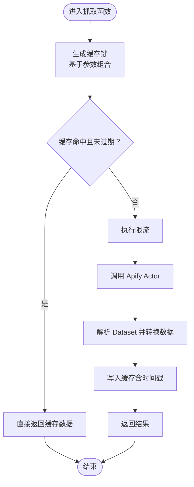
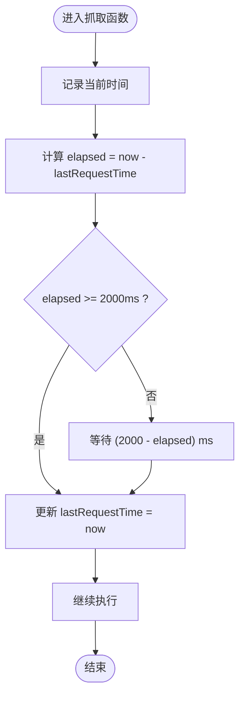
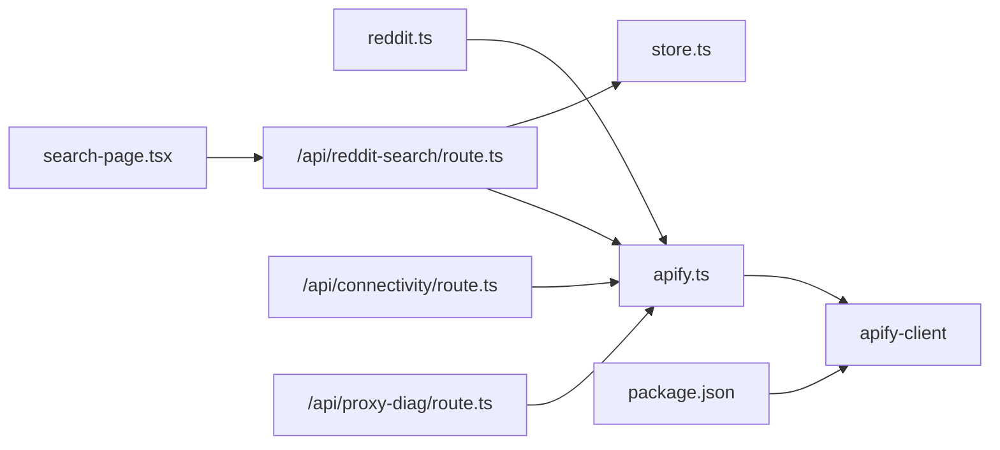

# 数据采集模块

<cite>
**本文引用的文件**
- [apify.ts](file://src/lib/apify.ts)
- [reddit.ts](file://src/lib/reddit.ts)
- [types.ts](file://src/lib/types.ts)
- [route.ts](file://src/app/api/reddit-search/route.ts)
- [store.ts](file://src/lib/store.ts)
- [route.ts](file://src/app/api/connectivity/route.ts)
- [route.ts](file://src/app/api/proxy-diag/route.ts)
- [search-page.tsx](file://src/app/search/search-page.tsx)
- [package.json](file://package.json)
</cite>

## 更新摘要
**变更内容**
- 优化Apify搜索功能的关键词匹配逻辑：从标题+正文匹配改为仅标题匹配，提升搜索结果的相关性和准确性
- 新增完整的Reddit搜索模块，支持基于关键词的Reddit爬取功能
- 新增`fetchSearchViaApify`函数，实现按subreddit和关键词搜索帖子
- 新增`/api/reddit-search` API端点，提供POST和PUT方法
- 增强Apify集成，支持搜索模式和住宅代理配置
- 新增数据导入功能，支持将搜索结果导入帖子管理系统
- **新增混合搜索策略**：search模式 + scrape兜底，提升搜索准确性
- **增强诊断信息显示**：API响应包含原始返回数量、过滤后数量等诊断字段
- **改进超时控制**：为Apify Actor调用增加2分钟超时保护
- **优化错误处理**：改进异常捕获和错误日志记录
- **新增锁定和归档帖子过滤机制**：在scrape模式中排除locked和archived帖子
- **新增加权排序算法**：基于评论数和分数的综合评分，优先热门帖子
- **增强前端诊断显示功能**：搜索页面显示详细的诊断信息和搜索效果反馈
- **新增调试日志机制**：在数据提取过程中添加针对分数和评论数的调试输出，支持多种字段命名约定的自动识别和转换
- **增强调试功能**：改进了normalizeApifyItem函数中的调试日志输出机制，提供更精确的问题定位能力

## 目录
1. [简介](#简介)
2. [项目结构](#项目结构)
3. [核心组件](#核心组件)
4. [架构总览](#架构总览)
5. [详细组件分析](#详细组件分析)
6. [依赖关系分析](#依赖关系分析)
7. [性能考量](#性能考量)
8. [故障排查指南](#故障排查指南)
9. [结论](#结论)
10. [附录](#附录)

## 简介
本文件面向 Reddit 数据采集模块，系统性阐述基于 Apify 的爬虫引擎实现，涵盖版本控制、缓存机制、限流策略与代理配置；详解三种抓取模式（subreddit 帖子列表、单个帖子评论、关键词搜索）的参数配置、数据转换与错误处理；并提供内存缓存 TTL 与限流 MIN_REQUEST_INTERVAL 的工作原理及优化策略。文末给出 fetchSubredditViaApify、fetchPostViaApify 和 fetchSearchViaApify 的使用路径与常见问题解决方案。

**更新** 本次更新重点增强了搜索功能，新增混合搜索策略（search + scrape），增加了详细的诊断信息显示，改进了超时控制和错误处理机制，并新增了锁定和归档帖子过滤、加权排序等优化功能。**关键优化**：改进了关键词匹配逻辑，从标题+正文匹配改为仅标题匹配，显著提升了搜索结果的相关性和准确性。**新增调试功能**：在数据提取过程中新增了针对分数和评论数的调试日志机制，支持多种字段命名约定的自动识别和转换，显著提高了数据提取的可靠性和可调试性。**增强调试能力**：改进了normalizeApifyItem函数中的调试日志输出机制，通过_debugCount计数器精确控制调试输出数量，提供更精确的问题定位能力。

## 项目结构
数据采集模块位于 src/lib 下，核心文件包括：
- apify.ts：Apify 爬虫引擎封装，含缓存、限流、代理与三种抓取函数
- reddit.ts：对外接口层，统一调用 Apify 并提供批量抓取能力
- types.ts：通用类型定义（RedditPost、RedditComment 等）
- store.ts：数据存储层，提供本地文件存储和内存缓存功能
- API 路由：用于连通性检测、代理诊断和Reddit搜索（reddit-search）
- API 路由：用于连通性检测与环境诊断（connectivity、proxy-diag）
- 前端组件：搜索页面组件，显示诊断信息和搜索结果

```mermaid
graph TB
subgraph "应用层"
UI["前端页面<br/>Next.js App Router"]
API["API 路由<br/>/api/connectivity, /api/proxy-diag<br/>/api/reddit-search"]
SEARCH_PAGE["搜索页面组件<br/>显示诊断信息"]
END
subgraph "采集层"
REDDIT_TS["reddit.ts<br/>对外接口"]
APIFY_TS["apify.ts<br/>Apify 封装<br/>混合搜索策略<br/>增强调试日志机制"]
STORE_TS["store.ts<br/>数据存储"]
END
subgraph "外部服务"
ACTOR1["Apify Actor<br/>spry_wholemeal/reddit-scraper"]
ACTOR2["Apify Actor<br/>neatrat/reddit-scraper"]
APIFY_CLIENT["apify-client SDK"]
END
UI --> API
UI --> SEARCH_PAGE
API --> REDDIT_TS
REDDIT_TS --> APIFY_TS
APIFY_TS --> STORE_TS
APIFY_TS --> APIFY_CLIENT
APIFY_CLIENT --> ACTOR1
APIFY_CLIENT --> ACTOR2
```

**图表来源**
- [apify.ts:1-511](file://src/lib/apify.ts#L1-L511)
- [reddit.ts:1-94](file://src/lib/reddit.ts#L1-L94)
- [store.ts:1-285](file://src/lib/store.ts#L1-L285)
- [route.ts:1-159](file://src/app/api/reddit-search/route.ts#L1-L159)
- [search-page.tsx:250-439](file://src/app/search/search-page.tsx#L250-L439)

**章节来源**
- [apify.ts:1-511](file://src/lib/apify.ts#L1-L511)
- [reddit.ts:1-94](file://src/lib/reddit.ts#L1-L94)
- [store.ts:1-285](file://src/lib/store.ts#L1-L285)

## 核心组件
- Apify 客户端与配置
  - 通过环境变量 APIFY_TOKEN 初始化 apify-client
  - 提供 isApifyConfigured 判定配置状态
- 缓存机制
  - 内存 Map 实现，键为查询参数组合，值含数据与时间戳
  - subreddit 列表缓存 TTL 为 10 分钟，帖子详情缓存 TTL 为 30 分钟
- 限流策略
  - 全局最小请求间隔 MIN_REQUEST_INTERVAL = 2000ms
  - throttle() 计算上次请求到现在的时间差，不足则等待补齐
- 代理配置
  - 版块抓取使用 Apify 住宅代理组 RESIDENTIAL
  - 单贴抓取由 Actor 自带代理，无需额外配置
- 三种抓取函数
  - fetchSubredditViaApify：抓取 subreddit 帖子列表
  - fetchPostViaApify：抓取单个帖子及其评论
  - fetchSearchViaApify：按关键词搜索帖子（新增混合搜索策略）
- **新增** 混合搜索策略
  - search 模式：使用 Reddit 原生搜索API
  - scrape 兜底：当结果不足且有 subreddit 时，抓取最新帖子按关键词过滤
  - 锁定和归档过滤：排除 locked 和 archived 帖子
  - 加权排序：基于评论数和分数的综合评分算法，优先热门帖子
  - 超时控制：每个 Actor 调用增加2分钟超时保护
  - 诊断信息：返回原始返回数量、过滤后数量等诊断字段
- **更新** 关键词匹配优化
  - 仅匹配标题内容，不再匹配正文和评论
  - 提升搜索结果的相关性和准确性
- **新增** 增强调试日志机制
  - 在 normalizeApifyItem 函数中新增调试输出，记录前3个帖子的原始分数和评论数字段
  - 支持多种字段命名约定的自动识别：score、upvotes、estimated_upvotes、num_comments、numComments、commentsCount、comment_count
  - 通过 _debugCount 计数器限制调试输出数量，避免影响生产环境性能
  - 提高数据提取过程的可观测性和可靠性

**章节来源**
- [apify.ts:9-66](file://src/lib/apify.ts#L9-L66)
- [apify.ts:17-35](file://src/lib/apify.ts#L17-L35)
- [apify.ts:37-50](file://src/lib/apify.ts#L37-L50)
- [apify.ts:94-98](file://src/lib/apify.ts#L94-L98)
- [apify.ts:106-176](file://src/lib/apify.ts#L106-L176)
- [apify.ts:184-279](file://src/lib/apify.ts#L184-L279)
- [apify.ts:106-180](file://src/lib/apify.ts#L106-L180)

## 架构总览
Apify 爬虫引擎以函数式封装形式暴露三种抓取能力：
- 版块抓取：调用 spry_wholemeal/reddit-scraper，支持排序、时间窗口与住宅代理
- 单贴抓取：调用 neatrat/reddit-scraper，按 URL 精确抓取，自动展开评论树
- 关键词搜索：调用 spry_wholemeal/reddit-scraper，支持 subreddit + 多关键词 + 时间范围搜索
- **新增** 混合搜索：search 模式 + scrape 兜底，提升搜索准确性
- **新增** 增强调试日志：在数据提取过程中提供详细的字段识别和转换信息，支持问题精确定位

```mermaid
sequenceDiagram
participant Caller as "调用方"
participant Reddit as "reddit.ts"
participant Apify as "apify.ts"
participant Store as "store.ts"
participant Client as "apify-client"
participant Actor as "Apify Actor"
Caller->>Reddit : "fetchSubredditPosts()/fetchRedditPost()"
Reddit->>Apify : "fetchSubredditViaApify()/fetchPostViaApify()"
Apify->>Apify : "检查缓存/限流"
Apify->>Client : "初始化客户端"
Client->>Actor : "调用 Actor 并提交输入"
Actor-->>Client : "返回 Dataset Items"
Client-->>Apify : "解析数据并转换"
Note over Apify : "增强调试日志：记录字段识别过程和原始值"
Apify-->>Reddit : "返回结构化结果"
Reddit-->>Caller : "返回聚合结果"
Note over Caller,Actor : 新增关键词搜索流程混合策略
Caller->>Store : "POST /api/reddit-search"
Store->>Apify : "fetchSearchViaApify()"
Apify->>Client : "调用 Actor 搜索模式"
Client->>Actor : "提交搜索请求"
Actor-->>Client : "返回搜索结果"
Note over Apify,Actor : 混合策略：search + scrape 兜底
Apify->>Client : "必要时调用 scrape 模式"
Client-->>Apify : "返回 scrape 结果"
Apify->>Apify : "过滤锁定/归档帖子，加权排序，合并并过滤结果"
Apify-->>Store : "返回搜索结果"
Store-->>Caller : "返回搜索结果含诊断信息"
```

**图表来源**
- [reddit.ts:10-24](file://src/lib/reddit.ts#L10-L24)
- [reddit.ts:71-85](file://src/lib/reddit.ts#L71-L85)
- [apify.ts:106-176](file://src/lib/apify.ts#L106-L176)
- [apify.ts:184-279](file://src/lib/apify.ts#L184-L279)
- [apify.ts:106-180](file://src/lib/apify.ts#L106-L180)
- [route.ts:1-159](file://src/app/api/reddit-search/route.ts#L1-L159)

## 详细组件分析

### 组件一：内存缓存与 TTL
- 结构
  - CacheEntry 泛型条目：data + timestamp
  - subredditCache 与 postCache 两个 Map
- 命中逻辑
  - 以查询参数拼接的 key 查找
  - 若未过期则直接返回，否则删除过期项并放行
- 写入逻辑
  - 请求成功后写入当前时间戳，便于后续命中判断
- TTL 设计
  - subreddit 列表：10 分钟
  - 帖子详情：30 分钟
- 性能影响
  - 显著降低重复请求次数，减少 Apify 调用成本
  - 在高并发场景下建议结合分布式缓存（Redis）以避免多实例间缓存不一致



**图表来源**
- [apify.ts:11-35](file://src/lib/apify.ts#L11-L35)
- [apify.ts:106-176](file://src/lib/apify.ts#L106-L176)
- [apify.ts:184-279](file://src/lib/apify.ts#L184-L279)

**章节来源**
- [apify.ts:11-35](file://src/lib/apify.ts#L11-L35)

### 组件二：限流策略（MIN_REQUEST_INTERVAL）
- 设计要点
  - 全局 lastRequestTime 记录上一次请求时间
  - throttle() 计算 elapsed = now - lastRequestTime
  - 若 elapsed < 2000ms，则等待补足剩余时间
  - 更新 lastRequestTime 为 now
- 作用
  - 防止触发 Apify 或 Reddit 的速率限制
  - 保证 Actor 调用稳定有序，降低失败率
- 注意事项
  - 对于批量抓取，建议在调用层也叠加等待，避免并发竞争



**图表来源**
- [apify.ts:37-50](file://src/lib/apify.ts#L37-L50)

**章节来源**
- [apify.ts:37-50](file://src/lib/apify.ts#L37-L50)

### 组件三：代理配置
- 版块抓取（spry_wholemeal/reddit-scraper）
  - 使用 Apify 住宅代理组 RESIDENTIAL
  - 通过 proxyConfiguration 字段传递
- 单贴抓取（neatrat/reddit-scraper）
  - Actor 自带代理，无需额外配置
- 诊断
  - 通过 /api/proxy-diag 可查看 APIFY_TOKEN 状态与 Apify 配置情况

**章节来源**
- [apify.ts:94-98](file://src/lib/apify.ts#L94-L98)
- [route.ts:1-24](file://src/app/api/proxy-diag/route.ts#L1-L24)

### 组件四：抓取模式一——subreddit 帖子列表
- 函数签名与参数
  - fetchSubredditViaApify(subreddit, limit=100, sort='new')
  - 支持 sort: 'hot' | 'new' | 'top'
- 关键步骤
  - 生成缓存键并检查缓存
  - 执行限流
  - 构造 Actor 输入：mode=scrape、listings、sort、timeframe、includeCommentsMode、proxyConfiguration
  - 调用 Actor 并读取 Dataset
  - 过滤并映射为 ApifySubredditPost 列表
  - 写入缓存并返回
- 数据转换
  - 统一字段：id、title、author、score、commentCount、subreddit、createdAt、permalink、selftext
  - 时间字段优先使用 created_utc_iso，否则回退到 created_utc 或当前时间
  - permalink 自动补全为绝对 URL
- 错误处理
  - 捕获异常并返回空数组，同时输出错误日志

```mermaid
sequenceDiagram
participant Caller as "调用方"
participant Apify as "fetchSubredditViaApify"
participant Client as "apify-client"
participant Actor as "spry_wholemeal/reddit-scraper"
Caller->>Apify : "传入 subreddit/limit/sort"
Apify->>Apify : "构建缓存键并检查缓存"
Apify->>Apify : "执行 throttle()"
Apify->>Client : "构造输入并调用 Actor"
Client->>Actor : "提交 scrape 请求"
Actor-->>Client : "返回 Dataset Items"
Client-->>Apify : "读取 items"
Apify->>Apify : "过滤/映射为 ApifySubredditPost[]"
Apify->>Apify : "写入缓存"
Apify-->>Caller : "返回结果"
```

**图表来源**
- [apify.ts:298-368](file://src/lib/apify.ts#L298-L368)

**章节来源**
- [apify.ts:298-368](file://src/lib/apify.ts#L298-L368)

### 组件五：抓取模式二——单个帖子与评论
- 函数签名与参数
  - fetchPostViaApify(redditUrl, ourPostId?)
- 关键步骤
  - 检查缓存（按 URL）
  - 执行限流
  - 构造 Actor 输入：startUrls、pages、maxCommentsPerPost、maxItems、requestTimeoutSecs
  - 调用 neatrat/reddit-scraper 并读取 Dataset
  - 解析帖子数据与评论树（递归提取 children）
  - 写入缓存并返回 { postData, comments }
- 数据转换
  - 帖子字段：id、title、author、score、commentCount、subreddit、thumbnailUrl、createdAt
  - 评论字段：id、postId、author、body、score、createdAt、sentimentScore、isFlagged、flagReasons、permalink
  - 递归提取评论树，确保深层嵌套也被收集
- 错误处理
  - 捕获异常并返回 null，同时输出错误日志

```mermaid
sequenceDiagram
participant Caller as "调用方"
participant Apify as "fetchPostViaApify"
participant Client as "apify-client"
participant Actor as "neatrat/reddit-scraper"
Caller->>Apify : "传入 redditUrl/ourPostId"
Apify->>Apify : "检查缓存"
Apify->>Apify : "执行 throttle()"
Apify->>Client : "构造输入并调用 Actor"
Client->>Actor : "提交 URL 抓取请求"
Actor-->>Client : "返回包含帖子与评论的数据"
Client-->>Apify : "读取 items"
Apify->>Apify : "提取 postData 与递归提取 comments"
Apify->>Apify : "写入缓存"
Apify-->>Caller : "返回 {postData, comments}"
```

**图表来源**
- [apify.ts:376-471](file://src/lib/apify.ts#L376-L471)

**章节来源**
- [apify.ts:376-471](file://src/lib/apify.ts#L376-L471)

### 组件六：抓取模式三——关键词搜索（新增）
- 函数签名与参数
  - fetchSearchViaApify(subreddit, keywords[], limit=25, timeframe='month')
  - 支持 timeframe: 'hour' | 'day' | 'week' | 'month' | 'year' | 'all'
- **新增** 混合搜索策略
  - 第一步：search 模式（Reddit 原生搜索）
  - 第二步：如果结果不够且有 subreddit，使用 scrape 模式抓取最新帖子按关键词过滤
  - 第三步：合并 search 和 scrape 结果，按 id 去重
  - **新增** 第四步：过滤锁定和归档帖子（locked/archived）
  - **新增** 第五步：加权排序（评论数×2 + 分数），优先热门帖子
- **更新** 关键词匹配优化
  - 仅匹配标题内容，不再匹配正文和评论
  - 提升搜索结果的相关性和准确性
- 关键步骤
  - 生成搜索缓存键并检查缓存
  - 执行限流
  - 构造 Actor 输入：mode=search、searchTargets、searchSort、timeframe、includeCommentsMode、proxyConfiguration
  - 调用 spry_wholemeal/reddit-scraper 并读取 Dataset
  - 过滤并映射为 ApifySubredditPost 列表
  - **新增** 超时控制：每个 Actor 调用增加2分钟超时保护
  - **新增** 诊断信息：返回原始返回数量、过滤后数量等
  - 写入缓存并返回
- 数据转换
  - 统一字段：id、title、author、score、commentCount、subreddit、createdAt、permalink、selftext
  - 支持限定 subreddit 搜索和多关键词组合
  - timeframe 参数控制搜索时间范围
- 错误处理
  - 捕获异常并返回错误信息，同时输出错误日志
  - **新增** 超时错误处理：Actor 运行超时（2分钟）的专门错误处理

```mermaid
sequenceDiagram
participant Caller as "调用方"
participant Apify as "fetchSearchViaApify"
participant Client as "apify-client"
participant Actor as "spry_wholemeal/reddit-scraper"
Caller->>Apify : "传入 subreddit/keywords/limit/timeframe"
Apify->>Apify : "构建搜索缓存键并检查缓存"
Apify->>Apify : "执行 throttle()"
Apify->>Client : "构造搜索输入并调用 Actor"
Client->>Actor : "提交 search 请求"
Actor-->>Client : "返回 Dataset Items"
Client-->>Apify : "读取 items"
Apify->>Apify : "过滤/映射为 ApifySubredditPost[]"
Note over Apify : "检查结果数量是否足够"
Apify->>Apify : "如果不足且有 subreddit，执行 scrape 兜底"
Apify->>Client : "调用 scrape 模式"
Client-->>Apify : "返回 scrape 结果"
Apify->>Apify : "过滤锁定/归档帖子，加权排序，合并并去重"
Apify-->>Caller : "返回搜索结果含诊断信息"
```

**图表来源**
- [apify.ts:137-291](file://src/lib/apify.ts#L137-L291)

**章节来源**
- [apify.ts:137-291](file://src/lib/apify.ts#L137-L291)

### 组件七：对外接口层（reddit.ts）
- fetchRedditPost(url, ourPostId?)
  - 直接委托 fetchPostViaApify，并打印日志
- fetchMultiplePosts(posts, onProgress?)
  - 顺序抓取多个帖子，内置 2 秒限流等待
  - 支持进度回调
- fetchSubredditPosts(subreddit, limit=100, sort='hot')
  - 校验 Apify 配置，再调用 fetchSubredditViaApify
- selectRandomPosts(posts, count)
  - 随机抽取 N 个帖子

**章节来源**
- [reddit.ts:10-24](file://src/lib/reddit.ts#L10-L24)
- [reddit.ts:26-56](file://src/lib/reddit.ts#L26-L56)
- [reddit.ts:71-85](file://src/lib/reddit.ts#L71-L85)
- [reddit.ts:87-93](file://src/lib/reddit.ts#L87-L93)

### 组件八：Reddit搜索API端点（新增）
- POST /api/reddit-search
  - 接收关键词数组、可选subreddit、limit和timeframe参数
  - 调用 fetchSearchViaApify 执行搜索
  - 返回搜索结果和统计信息
  - **新增** 诊断字段：rawItemCount（原始返回数量）、filteredPostCount（过滤后数量）、firstItemKeys（首项键名）、firstItemSample（首项样本）
- PUT /api/reddit-search
  - 接收搜索结果数组，导入到帖子管理系统
  - 去重处理，避免重复导入
  - 支持批量导入和跳过已存在帖子
- 参数验证与清理
  - 关键词数组必须非空且去除空白字符
  - subreddit参数自动清理前缀"r/"
  - limit限制在1-100范围内
  - timeframe默认为"month"

```mermaid
sequenceDiagram
participant Client as "客户端"
participant API as "/api/reddit-search"
participant Store as "store.ts"
participant Apify as "apify.ts"
participant Actor as "spry_wholemeal/reddit-scraper"
Client->>API : "POST /api/reddit-search"
API->>API : "验证和清理参数"
API->>Apify : "fetchSearchViaApify()"
Apify->>Actor : "调用搜索模式"
Actor-->>Apify : "返回搜索结果"
Note over Apify : "执行混合搜索策略"
Apify->>Actor : "必要时调用 scrape 模式"
Actor-->>Apify : "返回 scrape 结果"
Apify->>Apify : "过滤锁定/归档帖子，加权排序，合并并过滤结果"
Apify-->>API : "返回结果含诊断信息"
API-->>Client : "返回JSON响应包含诊断字段"
Client->>API : "PUT /api/reddit-search"
API->>Store : "getPosts() 获取现有帖子"
API->>Store : "savePosts() 导入新帖子"
API-->>Client : "返回导入结果"
```

**图表来源**
- [route.ts:1-159](file://src/app/api/reddit-search/route.ts#L1-L159)

**章节来源**
- [route.ts:1-159](file://src/app/api/reddit-search/route.ts#L1-L159)

### 组件九：前端搜索页面（新增）
- **新增** 诊断信息显示
  - 显示原始返回数量与过滤后数量的对比
  - 当原始返回数量等于过滤后数量时，显示 Actor 共返回的项数
  - 当两者不相等时，显示原始返回数量与过滤后数量的差异
- 搜索结果显示
  - 展示搜索结果列表，包含帖子标题、作者、分数、评论数、发布时间等信息
  - 支持全选、导入选中、导入全部等功能
- 用户体验优化
  - 搜索按钮禁用状态处理
  - 搜索中加载状态显示
  - 错误信息友好展示

**章节来源**
- [search-page.tsx:250-439](file://src/app/search/search-page.tsx#L250-L439)

### 组件十：数据存储层（store.ts）
- 文件存储与内存缓存
  - 本地开发：文件系统持久化（data目录）
  - Vercel部署：内存存储 + 环境变量覆盖
  - **更新** 30秒缓存机制，减少频繁读取大文件
- 帖子管理
  - getPosts()、getPostById()、savePosts()、upsertPost()、deletePost()
  - 支持去重导入，避免重复ID
- 评论管理
  - getComments()、saveComments()、deleteComments()
  - 按帖子ID过滤评论
- 扫描结果与报告
  - getScanResults()、saveScanResult()、deleteScanResults()
  - getDailyReports()、saveDailyReport()

**章节来源**
- [store.ts:1-285](file://src/lib/store.ts#L1-L285)

### 组件十一：增强调试日志机制（新增）
- **新增** normalizeApifyItem 函数中的增强调试日志
  - 在数据提取过程中记录前3个帖子的原始字段值
  - 输出字段包括：title、score、num_comments、upvotes、estimated_upvotes
  - 帮助开发者理解不同 Actor 返回的数据结构差异
- **新增** 字段命名约定支持
  - 分数字段：score、upvotes、estimated_upvotes
  - 评论数字段：num_comments、numComments、commentsCount、comment_count
  - 自动识别并转换为统一的数值格式
- **新增** 调试计数器优化
  - 使用 _debugCount 属性限制调试输出的数量为3个
  - 避免大量日志影响生产环境性能
  - 精确控制调试输出，提高问题定位效率
- **新增** 日志格式优化
  - 格式化输出字段名称和值
  - 包含帖子标题的截断显示（前50字符）
  - 便于快速识别数据提取问题和字段命名差异

**章节来源**
- [apify.ts:104-137](file://src/lib/apify.ts#L104-L137)

### 类型定义（types.ts）
- RedditPost：帖子实体，包含 id、redditUrl、title、subreddit、author、score、commentCount、createdAt、lastScanned、alertLevel、alertReasons、thumbnailUrl、summary、alertStatus、handler、handleTime、handleNote、scanError、nextScanTime 等
- RedditComment：评论实体，包含 id、postId、author、body、score、createdAt、sentimentScore、isFlagged、flagReasons、permalink、influenceScore、replies
- 其他：ScanResult、DailyScanReport、FeishuConfig、FeishuUserAuth、LLMConfig、FeishuNotifyConfig、DetectionRules、MonitorConfig、PostDetail、InfluentialUser、KeywordTrend、SubredditStats 等

**章节来源**
- [types.ts:9-44](file://src/lib/types.ts#L9-L44)
- [types.ts:46-194](file://src/lib/types.ts#L46-L194)

## 依赖关系分析
- 外部依赖
  - apify-client：官方 SDK，负责与 Apify 平台交互
  - axios、proxy-agent 等：底层网络与代理支持
- 内部依赖
  - apify.ts 被 reddit.ts 和 route.ts 引用
  - route.ts 依赖 apify.ts 的 isApifyConfigured 和 fetchSearchViaApify
  - store.ts 被 route.ts 和 apify.ts 引用
  - API 路由依赖 apify.ts 的 isApifyConfigured 进行连通性检查
  - **新增** 前端搜索页面组件依赖 API 路由进行数据交互



**图表来源**
- [apify.ts:6-7](file://src/lib/apify.ts#L6-L7)
- [reddit.ts](file://src/lib/reddit.ts#L8)
- [route.ts](file://src/app/api/reddit-search/route.ts#L2)
- [store.ts](file://src/lib/store.ts#L4)
- [route.ts](file://src/app/api/connectivity/route.ts#L2)
- [route.ts](file://src/app/api/proxy-diag/route.ts#L2)
- [search-page.tsx:1-13](file://src/app/search/search-page.tsx#L1-L13)
- [package.json:14-26](file://package.json#L14-L26)

**章节来源**
- [package.json:14-26](file://package.json#L14-L26)

## 性能考量
- 缓存策略
  - TTL 设置合理：列表 10 分钟、详情 30 分钟，兼顾新鲜度与成本
  - 建议在多实例部署时替换为 Redis 等分布式缓存，避免缓存不一致
- 限流策略
  - MIN_REQUEST_INTERVAL=2000ms 有效降低限流风险
  - 批量抓取时可在调用层叠加等待，避免并发竞争
- 代理选择
  - 版块抓取使用 RESIDENTIAL 代理，提高稳定性
  - 单贴抓取由 Actor 自带代理，无需额外维护
- **新增** 混合搜索优化
  - search 模式优先，利用 Reddit 原生搜索API的高效性
  - scrape 兜底模式仅在必要时触发，避免不必要的请求
  - 3倍抓取策略为关键词过滤预留空间，提高成功率
  - **新增** 锁定和归档过滤机制，避免无效内容干扰
  - **新增** 加权排序算法，优先热门和高质量帖子
- **新增** 超时控制
  - 2分钟超时保护，防止长时间阻塞
  - Promise.race 机制确保及时响应超时错误
- **更新** 关键词匹配优化
  - 仅匹配标题内容，减少误匹配，提升搜索结果质量
  - 降低数据处理复杂度，提高搜索效率
- **新增** 增强调试日志优化
  - 限制调试输出数量为3个，避免影响生产环境性能
  - 精准定位字段识别问题，提高开发效率
  - 通过截断显示帖子标题，便于快速识别问题
- 数据转换
  - 采用过滤与映射，减少无效数据传输
  - 评论树递归提取，确保完整性
- 存储优化
  - **更新** 30秒缓存机制，减少文件I/O操作
  - Vercel环境下使用内存存储，提升响应速度

## 故障排查指南
- Apify 未配置
  - 现象：抛出"未配置"错误或返回空结果
  - 处理：设置 APIFY_TOKEN 环境变量；通过 /api/connectivity 与 /api/proxy-diag 检查状态
- 无数据返回
  - 现象：Actor 返回空 items
  - 处理：检查 URL 是否正确、subreddit 是否存在、sort 参数是否合法；适当放宽 limit 或调整 timeframe
- 速率限制
  - 现象：频繁报错或响应缓慢
  - 处理：确认 MIN_REQUEST_INTERVAL 生效；避免并发过高；必要时增加等待时间
- 代理问题
  - 现象：请求失败或 IP 被封
  - 处理：切换代理组或更换云服务提供商；使用 /api/proxy-diag 检查配置
- **新增** 关键词搜索失败
  - 现象：搜索无结果或错误
  - 处理：检查关键词数组是否为空、subreddit格式是否正确、timeframe参数是否合法
  - **新增** 检查诊断信息：查看 rawItemCount 和 filteredPostCount 的差异
- **新增** 搜索超时问题
  - 现象：Actor 运行超时（2分钟）
  - 处理：检查网络连接、Apify 账户配额、Actor 状态；适当降低搜索强度
- **新增** 混合搜索策略问题
  - 现象：search 模式结果不足
  - 处理：确认 subreddit 参数是否正确；检查 scrape 兜底是否正常工作
  - **新增** 检查锁定和归档过滤：确认是否意外排除了有效帖子
- **新增** 排序和过滤问题
  - 现象：搜索结果质量不高或不符合预期
  - 处理：检查加权排序算法是否按预期工作；确认关键词匹配逻辑
- **更新** 关键词匹配问题
  - 现象：搜索结果过于宽泛或过于严格
  - 处理：检查关键词是否包含在帖子标题中；考虑使用更精确的关键词
  - **新增** 由于仅匹配标题，正文和评论中的关键词不会影响搜索结果
- **新增** 增强调试日志问题
  - 现象：分数或评论数字段识别失败
  - 处理：查看调试日志输出，确认 Actor 返回的字段名称
  - **新增** 检查 _debugCount 计数器，确保调试输出正常（最多3个）
  - **新增** 验证字段命名约定支持：score、upvotes、estimated_upvotes、num_comments、numComments、commentsCount、comment_count
  - **新增** 观察调试输出中的字段值，识别数据结构差异
- 数据导入问题
  - 现象：导入失败或重复导入
  - 处理：检查帖子ID唯一性、验证必填字段、查看导入日志

**章节来源**
- [apify.ts:54-62](file://src/lib/apify.ts#L54-L62)
- [apify.ts:141-144](file://src/lib/apify.ts#L141-L144)
- [apify.ts:217-220](file://src/lib/apify.ts#L217-L220)
- [route.ts:4-24](file://src/app/api/connectivity/route.ts#L4-L24)
- [route.ts:4-24](file://src/app/api/proxy-diag/route.ts#L4-L24)
- [route.ts:17-28](file://src/app/api/reddit-search/route.ts#L17-L28)
- [route.ts:73-78](file://src/app/api/reddit-search/route.ts#L73-L78)

## 结论
该数据采集模块以 apify.ts 为核心，通过内存缓存、全局限流与 Apify 代理，实现了稳定高效的 Reddit 数据抓取。三种抓取模式分别覆盖了版块列表、单贴评论和关键词搜索场景，配合 reddit.ts 的对外接口和 store.ts 的数据存储，满足了监控与分析需求。**本次更新显著增强了搜索功能，新增混合搜索策略（search + scrape），提供了详细的诊断信息显示，改进了超时控制和错误处理机制，并新增了锁定和归档帖子过滤、加权排序等优化功能。** **新增调试功能**：在数据提取过程中新增了针对分数和评论数的调试日志机制，支持多种字段命名约定的自动识别和转换，显著提高了数据提取的可靠性和可调试性。**增强调试能力**：通过改进的normalizeApifyItem函数，提供更精确的问题定位能力，通过_debugCount计数器精确控制调试输出数量，避免影响生产环境性能。**关键优化**：改进了关键词匹配逻辑，从标题+正文匹配改为仅标题匹配，显著提升了搜索结果的相关性和准确性，减少了误匹配的情况。建议在生产环境中引入分布式缓存与更严格的错误重试策略，并持续关注 Apify Actor 的行为变化以优化输入参数。

## 附录

### 使用示例（函数路径）
- 抓取 subreddit 帖子列表
  - [fetchSubredditViaApify:298-368](file://src/lib/apify.ts#L298-L368)
  - [fetchSubredditPosts:71-85](file://src/lib/reddit.ts#L71-L85)
- 抓取单个帖子与评论
  - [fetchPostViaApify:376-471](file://src/lib/apify.ts#L376-L471)
  - [fetchRedditPost:10-24](file://src/lib/reddit.ts#L10-L24)
- **新增** 关键词搜索
  - [fetchSearchViaApify:137-291](file://src/lib/apify.ts#L137-L291)
  - [POST /api/reddit-search:7-58](file://src/app/api/reddit-search/route.ts#L7-L58)
  - [PUT /api/reddit-search:60-130](file://src/app/api/reddit-search/route.ts#L60-L130)

### 关键配置与常量
- 缓存 TTL
  - [SUBREDDIT_CACHE_TTL](file://src/lib/apify.ts#L17)
  - [POST_CACHE_TTL](file://src/lib/apify.ts#L18)
- 限流
  - [MIN_REQUEST_INTERVAL](file://src/lib/apify.ts#L38)
  - [throttle:41-50](file://src/lib/apify.ts#L41-L50)
- 代理
  - [PROXY_CONFIG:95-98](file://src/lib/apify.ts#L95-L98)
- **新增** 混合搜索策略
  - [fetchSearchViaApify:137-291](file://src/lib/apify.ts#L137-L291)
  - [API端点参数验证:10-28](file://src/app/api/reddit-search/route.ts#L10-L28)
- **新增** 超时控制
  - [Actor运行超时:173-175](file://src/lib/apify.ts#L173-L175)
  - [Scrape超时:214-216](file://src/lib/apify.ts#L214-L216)
- **新增** 锁定和归档过滤
  - [锁定过滤:235-237](file://src/lib/apify.ts#L235-L237)
- **新增** 加权排序算法
  - [加权排序:239-245](file://src/lib/apify.ts#L239-L245)
- **更新** 关键词匹配优化
  - [postMatchesKeywords:129-133](file://src/lib/apify.ts#L129-L133)
  - [标题匹配逻辑:197-198](file://src/lib/apify.ts#L197-L198)
  - [scrape匹配逻辑:251-252](file://src/lib/apify.ts#L251-L252)
- **新增** 增强调试日志机制
  - [调试日志输出:113-118](file://src/lib/apify.ts#L113-L118)
  - [字段命名约定:110-111](file://src/lib/apify.ts#L110-L111)
  - [调试计数器:113-118](file://src/lib/apify.ts#L113-L118)

### 诊断信息字段说明
- **新增** 诊断信息字段
  - `rawItemCount`：原始返回的项目数量
  - `filteredPostCount`：经过过滤后的帖子数量
  - `firstItemKeys`：第一个返回项目的键名集合
  - `firstItemSample`：第一个返回项目的JSON样本
  - `usedFallback`：是否使用了scrape兜底模式
  - `error`：错误信息（当有结果但有警告时）
- **新增** 前端显示逻辑
  - 当原始返回数量等于过滤后数量时，显示 Actor 共返回的项数
  - 当两者不相等时，显示原始返回数量与过滤后数量的差异
  - 显示 usedFallback 标识，指示是否使用了scrape兜底模式
  - 提供直观的搜索效果反馈
- **新增** 增强调试日志输出
  - 前3个帖子的原始字段值：title、score、num_comments、upvotes、estimated_upvotes
  - 帮助识别不同 Actor 的数据结构差异
  - 支持字段命名约定的自动识别和转换
  - 通过截断显示帖子标题，便于快速识别问题

**章节来源**
- [apify.ts:137-291](file://src/lib/apify.ts#L137-L291)
- [route.ts:45-50](file://src/app/api/reddit-search/route.ts#L45-L50)
- [search-page.tsx:298-310](file://src/app/search/search-page.tsx#L298-L310)