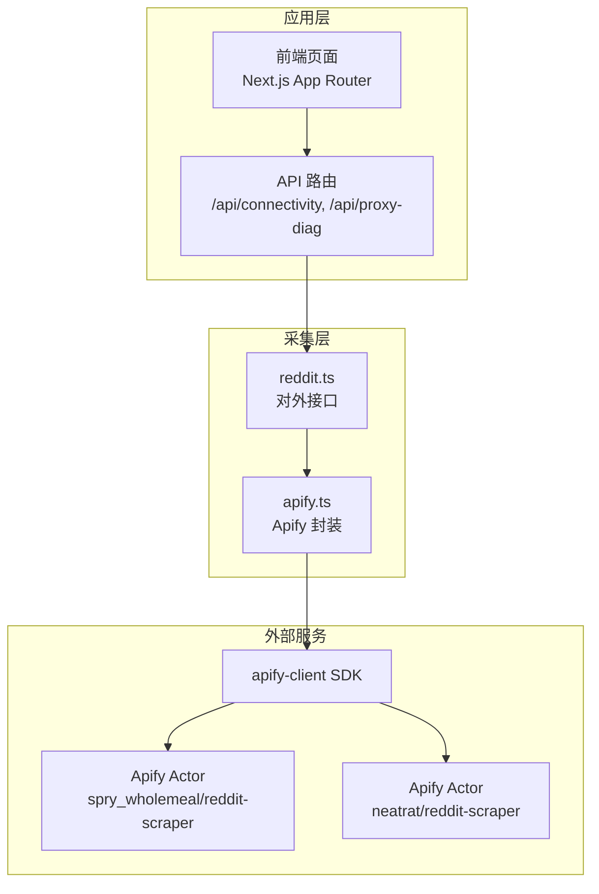
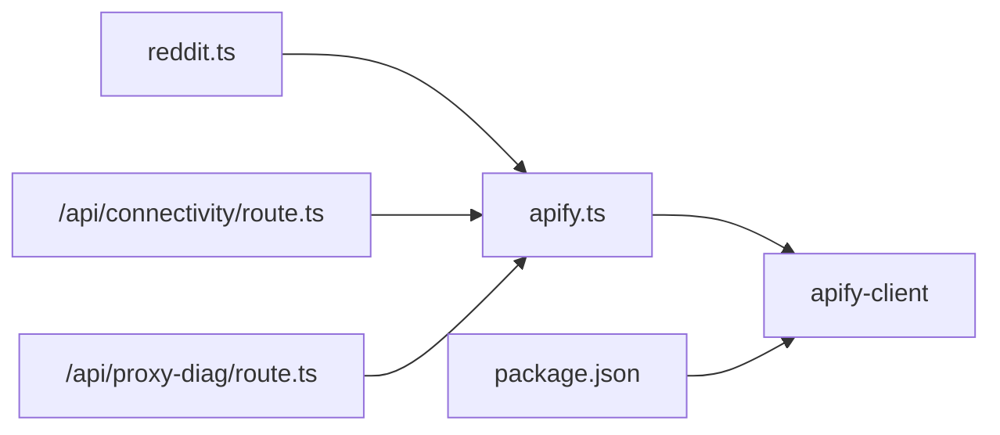

# 数据采集模块

<cite>
**本文引用的文件**
- [apify.ts](file://src/lib/apify.ts)
- [reddit.ts](file://src/lib/reddit.ts)
- [types.ts](file://src/lib/types.ts)
- [route.ts](file://src/app/api/connectivity/route.ts)
- [route.ts](file://src/app/api/proxy-diag/route.ts)
- [package.json](file://package.json)
</cite>

## 目录
1. [简介](#简介)
2. [项目结构](#项目结构)
3. [核心组件](#核心组件)
4. [架构总览](#架构总览)
5. [详细组件分析](#详细组件分析)
6. [依赖关系分析](#依赖关系分析)
7. [性能考量](#性能考量)
8. [故障排查指南](#故障排查指南)
9. [结论](#结论)
10. [附录](#附录)

## 简介
本文件面向 Reddit 数据采集模块，系统性阐述基于 Apify 的爬虫引擎实现，涵盖版本控制、缓存机制、限流策略与代理配置；详解两种抓取模式（subreddit 帖子列表与单个帖子评论）的参数配置、数据转换与错误处理；并提供内存缓存 TTL 与限流 MIN_REQUEST_INTERVAL 的工作原理及优化策略。文末给出 fetchSubredditViaApify 与 fetchPostViaApify 的使用路径与常见问题解决方案。

## 项目结构
数据采集模块位于 src/lib 下，核心文件包括：
- apify.ts：Apify 爬虫引擎封装，含缓存、限流、代理与两类抓取函数
- reddit.ts：对外接口层，统一调用 Apify 并提供批量抓取能力
- types.ts：通用类型定义（RedditPost、RedditComment 等）
- API 路由：用于连通性检测与环境诊断（connectivity、proxy-diag）



图表来源
- [apify.ts:1-280](file://src/lib/apify.ts#L1-L280)
- [reddit.ts:1-94](file://src/lib/reddit.ts#L1-L94)
- [route.ts:1-24](file://src/app/api/connectivity/route.ts#L1-L24)
- [route.ts:1-23](file://src/app/api/proxy-diag/route.ts#L1-L23)

章节来源
- [apify.ts:1-280](file://src/lib/apify.ts#L1-L280)
- [reddit.ts:1-94](file://src/lib/reddit.ts#L1-L94)

## 核心组件
- Apify 客户端与配置
  - 通过环境变量 APIFY_TOKEN 初始化 apify-client
  - 提供 isApifyConfigured 判定配置状态
- 缓存机制
  - 内存 Map 实现，键为查询参数组合，值含数据与时间戳
  - subreddit 列表缓存 TTL 为 10 分钟，帖子详情缓存 TTL 为 30 分钟
- 限流策略
  - 全局最小请求间隔 MIN_REQUEST_INTERVAL = 2000ms
  - throttle() 计算上次请求到现在的时间差，不足则等待补齐
- 代理配置
  - 版块抓取使用 Apify 住宅代理组 RESIDENTIAL
  - 单贴抓取由 Actor 自带代理，无需额外配置
- 两类抓取函数
  - fetchSubredditViaApify：抓取 subreddit 帖子列表
  - fetchPostViaApify：抓取单个帖子及其评论

章节来源
- [apify.ts:9-66](file://src/lib/apify.ts#L9-L66)
- [apify.ts:17-35](file://src/lib/apify.ts#L17-L35)
- [apify.ts:37-50](file://src/lib/apify.ts#L37-L50)
- [apify.ts:94-98](file://src/lib/apify.ts#L94-L98)
- [apify.ts:106-176](file://src/lib/apify.ts#L106-L176)
- [apify.ts:184-279](file://src/lib/apify.ts#L184-L279)

## 架构总览
Apify 爬虫引擎以函数式封装形式暴露两类抓取能力：
- 版块抓取：调用 spry_wholemeal/reddit-scraper，支持排序、时间窗口与住宅代理
- 单贴抓取：调用 neatrat/reddit-scraper，按 URL 精确抓取，自动展开评论树

```mermaid
sequenceDiagram
participant Caller as "调用方"
participant Reddit as "reddit.ts"
participant Apify as "apify.ts"
participant Client as "apify-client"
participant Actor as "Apify Actor"
Caller->>Reddit : "fetchSubredditPosts()/fetchRedditPost()"
Reddit->>Apify : "fetchSubredditViaApify()/fetchPostViaApify()"
Apify->>Apify : "检查缓存/限流"
Apify->>Client : "初始化客户端"
Client->>Actor : "调用 Actor 并提交输入"
Actor-->>Client : "返回 Dataset Items"
Client-->>Apify : "解析数据并转换"
Apify-->>Reddit : "返回结构化结果"
Reddit-->>Caller : "返回聚合结果"
```

图表来源
- [reddit.ts:10-24](file://src/lib/reddit.ts#L10-L24)
- [reddit.ts:71-85](file://src/lib/reddit.ts#L71-L85)
- [apify.ts:106-176](file://src/lib/apify.ts#L106-L176)
- [apify.ts:184-279](file://src/lib/apify.ts#L184-L279)

## 详细组件分析

### 组件一：内存缓存与 TTL
- 结构
  - CacheEntry 泛型条目：data + timestamp
  - subredditCache 与 postCache 两个 Map
- 命中逻辑
  - 以查询参数拼接的 key 查找
  - 若未过期则直接返回，否则删除过期项并放行
- 写入逻辑
  - 请求成功后写入当前时间戳，便于后续命中判断
- TTL 设计
  - subreddit 列表：10 分钟
  - 帖子详情：30 分钟
- 性能影响
  - 显著降低重复请求次数，减少 Apify 调用成本
  - 在高并发场景下建议结合分布式缓存（Redis）以避免多实例间缓存不一致


图表来源
- [apify.ts:11-35](file://src/lib/apify.ts#L11-L35)
- [apify.ts:106-176](file://src/lib/apify.ts#L106-L176)
- [apify.ts:184-279](file://src/lib/apify.ts#L184-L279)

章节来源
- [apify.ts:11-35](file://src/lib/apify.ts#L11-L35)

### 组件二：限流策略（MIN_REQUEST_INTERVAL）
- 设计要点
  - 全局 lastRequestTime 记录上一次请求时间
  - throttle() 计算 elapsed = now - lastRequestTime
  - 若 elapsed < 2000ms，则等待补足剩余时间
  - 更新 lastRequestTime 为 now
- 作用
  - 防止触发 Apify 或 Reddit 的速率限制
  - 保证 Actor 调用稳定有序，降低失败率
- 注意事项
  - 对于批量抓取，建议在调用层也叠加等待，避免并发竞争


图表来源
- [apify.ts:37-50](file://src/lib/apify.ts#L37-L50)

章节来源
- [apify.ts:37-50](file://src/lib/apify.ts#L37-L50)

### 组件三：代理配置
- 版块抓取（spry_wholemeal/reddit-scraper）
  - 使用 Apify 住宅代理组 RESIDENTIAL
  - 通过 proxyConfiguration 字段传递
- 单贴抓取（neatrat/reddit-scraper）
  - Actor 自带代理，无需额外配置
- 诊断
  - 通过 /api/proxy-diag 可查看 APIFY_TOKEN 状态与 Apify 配置情况

章节来源
- [apify.ts:94-98](file://src/lib/apify.ts#L94-L98)
- [route.ts:1-23](file://src/app/api/proxy-diag/route.ts#L1-L23)

### 组件四：抓取模式一——subreddit 帖子列表
- 函数签名与参数
  - fetchSubredditViaApify(subreddit, limit=100, sort='new')
  - 支持 sort: 'hot' | 'new' | 'top'
- 关键步骤
  - 生成缓存键并检查缓存
  - 执行限流
  - 构造 Actor 输入：mode=scrape、listings、sort、timeframe、includeCommentsMode、proxyConfiguration
  - 调用 Actor 并读取 Dataset
  - 过滤并映射为 ApifySubredditPost 列表
  - 写入缓存并返回
- 数据转换
  - 统一字段：id、title、author、score、commentCount、subreddit、createdAt、permalink、selftext
  - 时间字段优先使用 created_utc_iso，否则回退到 created_utc 或当前时间
  - permalink 自动补全为绝对 URL
- 错误处理
  - 捕获异常并返回空数组，同时输出错误日志

```mermaid
sequenceDiagram
participant Caller as "调用方"
participant Apify as "fetchSubredditViaApify"
participant Client as "apify-client"
participant Actor as "spry_wholemeal/reddit-scraper"
Caller->>Apify : "传入 subreddit/limit/sort"
Apify->>Apify : "构建缓存键并检查缓存"
Apify->>Apify : "执行 throttle()"
Apify->>Client : "构造输入并调用 Actor"
Client->>Actor : "提交 scrape 请求"
Actor-->>Client : "返回 Dataset Items"
Client-->>Apify : "读取 items"
Apify->>Apify : "过滤/映射为 ApifySubredditPost[]"
Apify->>Apify : "写入缓存"
Apify-->>Caller : "返回结果"
```

图表来源
- [apify.ts:106-176](file://src/lib/apify.ts#L106-L176)

章节来源
- [apify.ts:106-176](file://src/lib/apify.ts#L106-L176)

### 组件五：抓取模式二——单个帖子与评论
- 函数签名与参数
  - fetchPostViaApify(redditUrl, ourPostId?)
- 关键步骤
  - 检查缓存（按 URL）
  - 执行限流
  - 构造 Actor 输入：startUrls、pages、maxCommentsPerPost、maxItems、requestTimeoutSecs
  - 调用 neatrat/reddit-scraper 并读取 Dataset
  - 解析帖子数据与评论树（递归提取 children）
  - 写入缓存并返回 { postData, comments }
- 数据转换
  - 帖子字段：id、title、author、score、commentCount、subreddit、thumbnailUrl、createdAt
  - 评论字段：id、postId、author、body、score、createdAt、flag 与 sentiment 字段占位
  - 递归提取评论树，确保深层嵌套也被收集
- 错误处理
  - 捕获异常并返回 null，同时输出错误日志

```mermaid
sequenceDiagram
participant Caller as "调用方"
participant Apify as "fetchPostViaApify"
participant Client as "apify-client"
participant Actor as "neatrat/reddit-scraper"
Caller->>Apify : "传入 redditUrl/ourPostId"
Apify->>Apify : "检查缓存"
Apify->>Apify : "执行 throttle()"
Apify->>Client : "构造输入并调用 Actor"
Client->>Actor : "提交 URL 抓取请求"
Actor-->>Client : "返回包含帖子与评论的数据"
Client-->>Apify : "读取 items"
Apify->>Apify : "提取 postData 与递归提取 comments"
Apify->>Apify : "写入缓存"
Apify-->>Caller : "返回 {postData, comments}"
```

图表来源
- [apify.ts:184-279](file://src/lib/apify.ts#L184-L279)

章节来源
- [apify.ts:184-279](file://src/lib/apify.ts#L184-L279)

### 组件六：对外接口层（reddit.ts）
- fetchRedditPost(url, ourPostId?)
  - 直接委托 fetchPostViaApify，并打印日志
- fetchMultiplePosts(posts, onProgress?)
  - 顺序抓取多个帖子，内置 2 秒限流等待
  - 支持进度回调
- fetchSubredditPosts(subreddit, limit=100, sort='hot')
  - 校验 Apify 配置，再调用 fetchSubredditViaApify
- selectRandomPosts(posts, count)
  - 随机抽取 N 个帖子

章节来源
- [reddit.ts:10-24](file://src/lib/reddit.ts#L10-L24)
- [reddit.ts:26-56](file://src/lib/reddit.ts#L26-L56)
- [reddit.ts:71-85](file://src/lib/reddit.ts#L71-L85)
- [reddit.ts:87-93](file://src/lib/reddit.ts#L87-L93)

### 类型定义（types.ts）
- RedditPost：帖子实体，包含 id、redditUrl、title、subreddit、author、score、commentCount、createdAt、lastScanned、alertLevel、alertReasons、thumbnailUrl、summary、alertStatus、handler、handleTime、handleNote、scanError、nextScanTime 等
- RedditComment：评论实体，包含 id、postId、author、body、score、createdAt、sentimentScore、isFlagged、flagReasons、permalink、influenceScore、replies
- 其他：ScanResult、DailyScanReport、FeishuConfig、FeishuUserAuth、LLMConfig、FeishuNotifyConfig、DetectionRules、MonitorConfig、PostDetail、InfluentialUser、KeywordTrend、SubredditStats 等

章节来源
- [types.ts:9-44](file://src/lib/types.ts#L9-L44)
- [types.ts:46-194](file://src/lib/types.ts#L46-L194)

## 依赖关系分析
- 外部依赖
  - apify-client：官方 SDK，负责与 Apify 平台交互
  - axios、proxy-agent 等：底层网络与代理支持
- 内部依赖
  - apify.ts 被 reddit.ts 引用
  - API 路由依赖 apify.ts 的 isApifyConfigured 进行连通性检查



图表来源
- [apify.ts:6-7](file://src/lib/apify.ts#L6-L7)
- [reddit.ts](file://src/lib/reddit.ts#L8)
- [route.ts](file://src/app/api/connectivity/route.ts#L2)
- [route.ts](file://src/app/api/proxy-diag/route.ts#L2)
- [package.json:14-26](file://package.json#L14-L26)

章节来源
- [package.json:14-26](file://package.json#L14-L26)

## 性能考量
- 缓存策略
  - TTL 设置合理：列表 10 分钟、详情 30 分钟，兼顾新鲜度与成本
  - 建议在多实例部署时替换为 Redis 等分布式缓存，避免缓存不一致
- 限流策略
  - MIN_REQUEST_INTERVAL=2000ms 有效降低限流风险
  - 批量抓取时可在调用层叠加等待，避免并发竞争
- 代理选择
  - 版块抓取使用 RESIDENTIAL 代理，提高稳定性
  - 单贴抓取由 Actor 自带代理，无需额外维护
- 数据转换
  - 采用过滤与映射，减少无效数据传输
  - 评论树递归提取，确保完整性

## 故障排查指南
- Apify 未配置
  - 现象：抛出“未配置”错误或返回空结果
  - 处理：设置 APIFY_TOKEN 环境变量；通过 /api/connectivity 与 /api/proxy-diag 检查状态
- 无数据返回
  - 现象：Actor 返回空 items
  - 处理：检查 URL 是否正确、subreddit 是否存在、sort 参数是否合法；适当放宽 limit 或调整 timeframe
- 速率限制
  - 现象：频繁报错或响应缓慢
  - 处理：确认 MIN_REQUEST_INTERVAL 生效；避免并发过高；必要时增加等待时间
- 代理问题
  - 现象：请求失败或 IP 被封
  - 处理：切换代理组或更换云服务提供商；使用 /api/proxy-diag 检查配置

章节来源
- [apify.ts:54-62](file://src/lib/apify.ts#L54-L62)
- [apify.ts:141-144](file://src/lib/apify.ts#L141-L144)
- [apify.ts:217-220](file://src/lib/apify.ts#L217-L220)
- [route.ts:4-23](file://src/app/api/connectivity/route.ts#L4-L23)
- [route.ts:4-23](file://src/app/api/proxy-diag/route.ts#L4-L23)

## 结论
该数据采集模块以 apify.ts 为核心，通过内存缓存、全局限流与 Apify 代理，实现了稳定高效的 Reddit 数据抓取。两种抓取模式分别覆盖了版块列表与单贴评论场景，配合 reddit.ts 的对外接口，满足了监控与分析需求。建议在生产环境中引入分布式缓存与更严格的错误重试策略，并持续关注 Apify Actor 的行为变化以优化输入参数。

## 附录

### 使用示例（函数路径）
- 抓取 subreddit 帖子列表
  - [fetchSubredditViaApify:106-176](file://src/lib/apify.ts#L106-L176)
  - [fetchSubredditPosts:71-85](file://src/lib/reddit.ts#L71-L85)
- 抓取单个帖子与评论
  - [fetchPostViaApify:184-279](file://src/lib/apify.ts#L184-L279)
  - [fetchRedditPost:10-24](file://src/lib/reddit.ts#L10-L24)

### 关键配置与常量
- 缓存 TTL
  - [SUBREDDIT_CACHE_TTL](file://src/lib/apify.ts#L17)
  - [POST_CACHE_TTL](file://src/lib/apify.ts#L18)
- 限流
  - [MIN_REQUEST_INTERVAL](file://src/lib/apify.ts#L38)
  - [throttle:41-50](file://src/lib/apify.ts#L41-L50)
- 代理
  - [PROXY_CONFIG:95-98](file://src/lib/apify.ts#L95-L98)