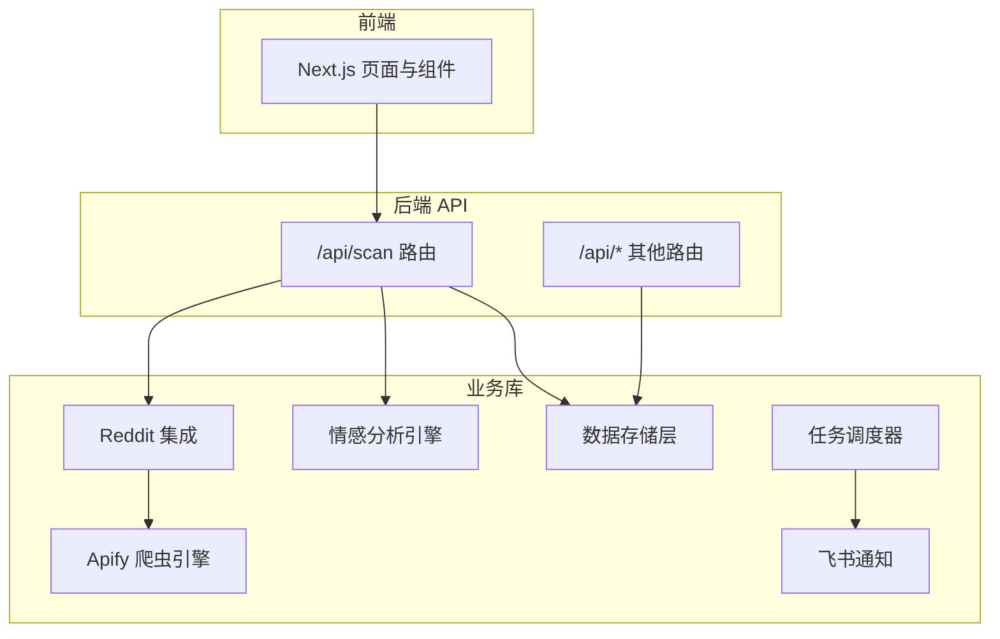
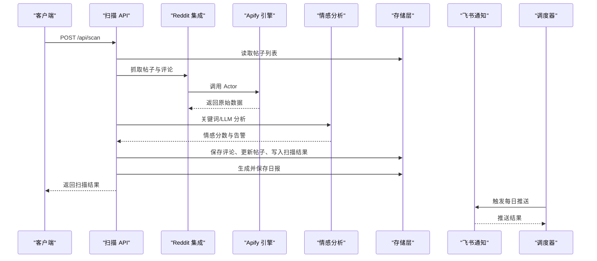
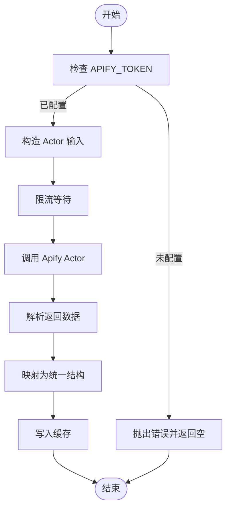
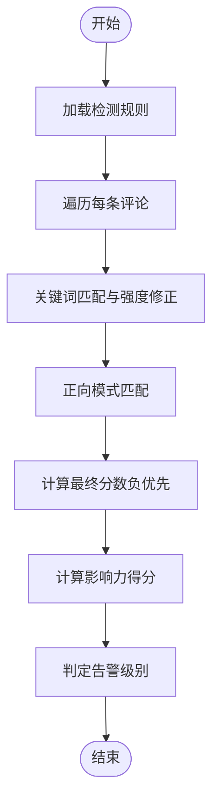
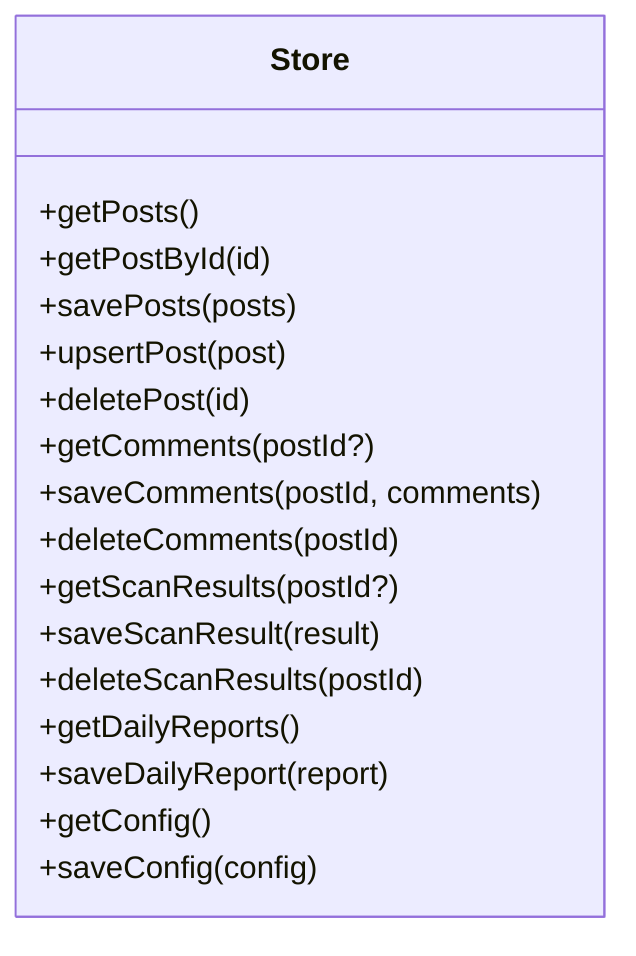
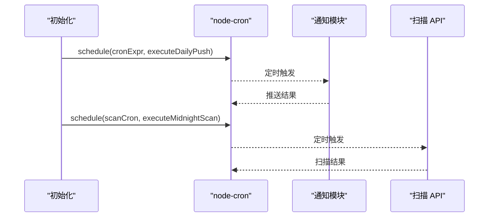
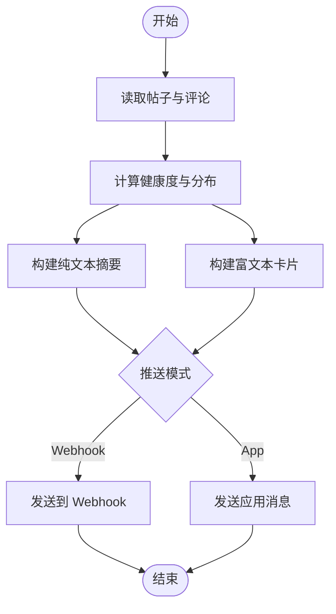
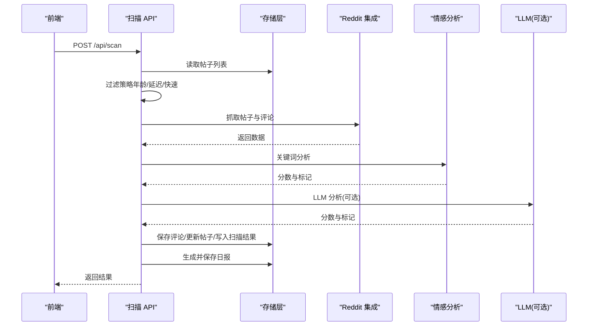
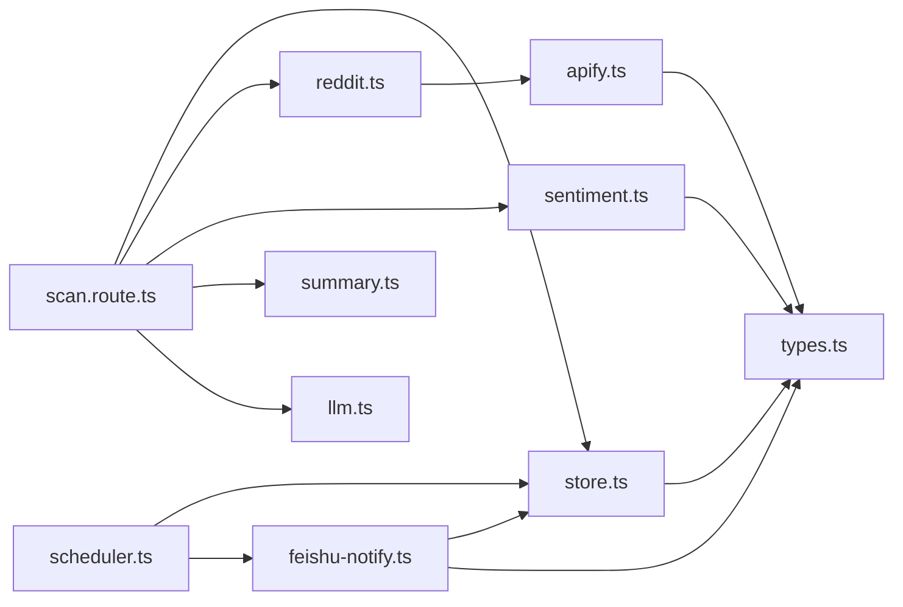

# 核心模块

<cite>
**本文引用的文件**
- [apify.ts](file://src/lib/apify.ts)
- [sentiment.ts](file://src/lib/sentiment.ts)
- [store.ts](file://src/lib/store.ts)
- [scheduler.ts](file://src/lib/scheduler.ts)
- [reddit.ts](file://src/lib/reddit.ts)
- [types.ts](file://src/lib/types.ts)
- [scan.route.ts](file://src/app/api/scan/route.ts)
- [feishu-notify.ts](file://src/lib/feishu-notify.ts)
- [config.json](file://data/config.json)
- [posts.json](file://data/posts.json)
- [package.json](file://package.json)
</cite>

## 目录
1. [简介](#简介)
2. [项目结构](#项目结构)
3. [核心组件](#核心组件)
4. [架构总览](#架构总览)
5. [详细组件分析](#详细组件分析)
6. [依赖关系分析](#依赖关系分析)
7. [性能考量](#性能考量)
8. [故障排查指南](#故障排查指南)
9. [结论](#结论)
10. [附录](#附录)

## 简介
本文件面向 Reddit 监控系统的核心模块，聚焦以下关键能力：
- 数据采集模块（Apify 爬虫引擎）：负责从 Reddit 抓取帖子与评论，支持版块列表与单帖抓取，并内置缓存与限流。
- 情感分析引擎：基于关键词规则与强度修正，结合影响力评分，输出告警级别；可选集成 LLM。
- 数据存储层：本地文件持久化与 Vercel 环境下的内存+环境变量混合存储，提供统一的 CRUD 接口。
- 任务调度器：基于 cron 的每日推送与自动扫描任务，支持手动触发与状态查询。
- 通知模块：将日报摘要以富文本卡片形式推送到飞书群或个人。
- 扫描 API：统一的批量扫描入口，聚合采集、分析、存储与趋势报告生成。

## 项目结构
系统采用“前端 Next.js + 后端 API 路由 + 业务库”的分层组织方式。核心逻辑集中在 src/lib 下的模块化工具函数，API 路由作为对外接口入口，data 目录提供本地持久化的 JSON 数据文件。

图表来源
- [scan.route.ts:1-394](file://src/app/api/scan/route.ts#L1-L394)
- [apify.ts:1-280](file://src/lib/apify.ts#L1-L280)
- [reddit.ts:1-94](file://src/lib/reddit.ts#L1-L94)
- [sentiment.ts:1-398](file://src/lib/sentiment.ts#L1-L398)
- [store.ts:1-285](file://src/lib/store.ts#L1-L285)
- [scheduler.ts:1-133](file://src/lib/scheduler.ts#L1-L133)
- [feishu-notify.ts:1-482](file://src/lib/feishu-notify.ts#L1-L482)

章节来源
- [scan.route.ts:1-394](file://src/app/api/scan/route.ts#L1-L394)
- [apify.ts:1-280](file://src/lib/apify.ts#L1-L280)
- [reddit.ts:1-94](file://src/lib/reddit.ts#L1-L94)
- [sentiment.ts:1-398](file://src/lib/sentiment.ts#L1-L398)
- [store.ts:1-285](file://src/lib/store.ts#L1-L285)
- [scheduler.ts:1-133](file://src/lib/scheduler.ts#L1-L133)
- [feishu-notify.ts:1-482](file://src/lib/feishu-notify.ts#L1-L482)

## 核心组件
- Apify 爬虫引擎：封装客户端初始化、URL 解析、Actor 调用、结果映射、缓存与限流。
- 情感分析引擎：关键词匹配与强度修正、正向/负向权重、影响力评分、告警级别判定、可选 LLM。
- 数据存储层：文件/内存双态存储、缓存、增删改查、配置合并与环境覆盖。
- 任务调度器：cron 表达式解析、每日推送与自动扫描、状态查询与手动触发。
- 通知模块：构建富文本卡片、Webhook 与应用消息两种模式、健康度评分与可视化。
- 扫描 API：统一扫描入口，进度控制、智能延迟、趋势报告生成。

章节来源
- [apify.ts:1-280](file://src/lib/apify.ts#L1-L280)
- [sentiment.ts:1-398](file://src/lib/sentiment.ts#L1-L398)
- [store.ts:1-285](file://src/lib/store.ts#L1-L285)
- [scheduler.ts:1-133](file://src/lib/scheduler.ts#L1-L133)
- [feishu-notify.ts:1-482](file://src/lib/feishu-notify.ts#L1-L482)
- [scan.route.ts:1-394](file://src/app/api/scan/route.ts#L1-L394)

## 架构总览
系统通过 API 路由协调各模块，形成“采集-分析-存储-通知-调度”的闭环。Apify 与 Reddit 集成为数据源，情感分析与 LLM 提供语义洞察，存储层持久化状态与历史，调度器驱动自动化与推送。

图表来源
- [scan.route.ts:21-394](file://src/app/api/scan/route.ts#L21-L394)
- [reddit.ts:10-94](file://src/lib/reddit.ts#L10-L94)
- [apify.ts:102-279](file://src/lib/apify.ts#L102-L279)
- [sentiment.ts:150-315](file://src/lib/sentiment.ts#L150-L315)
- [store.ts:89-284](file://src/lib/store.ts#L89-L284)
- [feishu-notify.ts:416-437](file://src/lib/feishu-notify.ts#L416-L437)
- [scheduler.ts:63-100](file://src/lib/scheduler.ts#L63-L100)

## 详细组件分析

### Apify 爬虫引擎
- 功能要点
  - 单帖抓取：使用 neatrat/reddit-scraper Actor，按 URL 精确抓取，自动处理代理与评论树。
  - 版块抓取：使用 spry_wholemeal/reddit-scraper Actor，支持 hot/new/top 排序与代理组。
  - 缓存：按版块/帖子维度 TTL 缓存，命中即返回，降低请求成本。
  - 限流：最小请求间隔 2 秒，避免触发 Apify/Reddit 速率限制。
  - 结果映射：标准化字段（标题、作者、分数、评论数、时间、自文本等），兼容不同 Actor 输出。
- 关键接口
  - isApifyConfigured(): 检查 APIFY_TOKEN 是否配置。
  - fetchPostViaApify(url, ourPostId?): 返回帖子与评论集合。
  - fetchSubredditViaApify(subreddit, limit?, sort?): 返回版块帖子列表。
- 参数与返回
  - 参数：URL、帖子 ID、版块名、数量上限、排序方式。
  - 返回：帖子对象数组（版块）或包含帖子与评论的对象（单帖）。
- 错误处理
  - 捕获异常并返回空结果或空数组，避免中断流程。
- 使用模式
  - 在扫描 API 中按顺序调用，先抓取再分析，最后落库。

图表来源
- [apify.ts:53-176](file://src/lib/apify.ts#L53-L176)
- [apify.ts:184-279](file://src/lib/apify.ts#L184-L279)

章节来源
- [apify.ts:1-280](file://src/lib/apify.ts#L1-L280)

### 情感分析引擎
- 功能要点
  - 关键词分类：品牌攻击、产品差评、负面情绪、号召抵制、竞品推荐。
  - 正向模式：品牌推荐、购买建议、产品好评、满意度表达等。
  - 强度修正：强度修饰词放大负面程度，否定词抑制匹配。
  - 评分融合：负向优先，正向仅在无负向时生效；最终归一化至 [-1,1]。
  - 影响力评分：基于点赞数与情感强度的加权得分。
  - 告警级别：综合总影响力与是否存在号召抵制，判定严重/中等/安全。
  - 可选 LLM：当启用时逐条评论调用 LLM，失败回退关键词规则。
- 关键接口
  - analyzeCommentSentiment(comment, rules?): 返回分数、标记与原因。
  - calculatePostAlertLevel(comments, rules?): 返回告警级别与统计。
  - calcCommentInfluenceScore(score, sentimentScore): 计算影响力。
  - analyzeWithOpenAI(comment, apiKey, model?): 可选的 OpenAI 分析。
- 参数与返回
  - 输入：评论文本、检测规则开关、LLM 配置。
  - 输出：分数、标记、原因、影响力、告警级别。
- 使用模式
  - 扫描 API 中根据配置选择 LLM 或关键词分析，随后计算帖子级别并生成摘要。

图表来源
- [sentiment.ts:150-244](file://src/lib/sentiment.ts#L150-L244)
- [sentiment.ts:272-315](file://src/lib/sentiment.ts#L272-L315)

章节来源
- [sentiment.ts:1-398](file://src/lib/sentiment.ts#L1-L398)

### 数据存储层
- 功能要点
  - 本地开发：文件系统持久化，目录 data 下的 posts.json、comments.json、scans.json、config.json、reports.json。
  - Vercel 环境：内存存储 + 环境变量覆盖，避免读写只读文件系统。
  - 缓存：30 秒 TTL 的内存缓存，减少频繁读取大文件。
  - 统一接口：增删改查、批量保存、清空数据、配置合并与覆盖。
- 关键接口
  - getPosts()/getPostById()/savePosts()/upsertPost()/deletePost()
  - getComments()/saveComments()/deleteComments()
  - getScanResults()/saveScanResult()/deleteScanResults()
  - getDailyReports()/saveDailyReport()
  - getConfig()/saveConfig()
- 配置项
  - 默认配置包含飞书、扫描计划、关键词、情感阈值、LLM、通知级别等。
  - Vercel 环境下可从环境变量覆盖通知与 LLM 设置。
- 使用模式
  - 扫描 API 中保存评论、更新帖子、写入扫描结果与日报。

图表来源
- [store.ts:89-284](file://src/lib/store.ts#L89-L284)

章节来源
- [store.ts:1-285](file://src/lib/store.ts#L1-L285)
- [config.json:1-57](file://data/config.json#L1-L57)
- [posts.json:1-200](file://data/posts.json#L1-L200)

### 任务调度器
- 功能要点
  - 每日推送：基于配置的 HH:MM 转换为 cron 表达式，定时调用 sendDailyAlert。
  - 自动扫描：午夜执行扫描 API，支持强制全量扫描。
  - 状态查询：返回启用状态、计划时间、cron 表达式、上次推送结果等。
  - 手动触发：支持立即推送。
- 关键接口
  - initScheduler(): 初始化或更新任务。
  - getSchedulerStatus(): 查询状态。
  - triggerManualPush(): 手动推送。
- 使用模式
  - 应用启动时初始化，或在配置变更后重新初始化。

图表来源
- [scheduler.ts:63-100](file://src/lib/scheduler.ts#L63-L100)
- [scheduler.ts:24-59](file://src/lib/scheduler.ts#L24-L59)
- [feishu-notify.ts:416-437](file://src/lib/feishu-notify.ts#L416-L437)
- [scan.route.ts:39-59](file://src/app/api/scan/route.ts#L39-L59)

章节来源
- [scheduler.ts:1-133](file://src/lib/scheduler.ts#L1-L133)

### 通知模块（飞书）
- 功能要点
  - 构建日报：统计健康度、情感分布、风险类别、严重帖子清单。
  - 富文本卡片：使用交互式卡片，包含按钮直达面板与帖子详情。
  - 发送方式：Webhook（机器人）或应用消息（个人/群聊）。
  - 健康度评分：综合严重/中等帖子数量与恶意评论比例。
- 关键接口
  - buildAlertMessage(): 生成纯文本与富文本内容。
  - sendDailyAlert(): 发送每日推送。
  - testFeishuNotify(config): 测试连接。
- 使用模式
  - 调度器定时触发或手动触发时调用。

图表来源
- [feishu-notify.ts:76-182](file://src/lib/feishu-notify.ts#L76-L182)
- [feishu-notify.ts:416-437](file://src/lib/feishu-notify.ts#L416-L437)

章节来源
- [feishu-notify.ts:1-482](file://src/lib/feishu-notify.ts#L1-L482)

### 扫描 API
- 功能要点
  - 进度控制：全局扫描进度对象，支持停止请求。
  - 过滤策略：全量扫描时按发布时间与智能延迟过滤。
  - 采集与分析：调用 Reddit 集成与情感分析，支持 LLM 回退。
  - 存储与报告：保存评论、更新帖子、写入扫描结果与日报。
  - 智能延迟：若两周内无新评论，下次扫描延后一个月。
- 关键接口
  - POST /api/scan：批量扫描，支持指定帖子、快速扫描、全量扫描。
  - GET /api/scan：查询扫描进度。
  - DELETE /api/scan：停止扫描。
- 请求体参数
  - postIds: 指定帖子 ID 列表（可选）
  - scanAll: 是否全量扫描（可选）
  - quickScan: 是否快速扫描（可选）
  - skipRecentHours: 跳过近期扫描（已取消）
- 返回值
  - 成功：包含扫描结果、消息与时间戳。
  - 失败：包含错误信息与 500 状态码。
- 使用模式
  - 前端轮询进度，后台异步执行，完成后生成日报。

图表来源
- [scan.route.ts:21-394](file://src/app/api/scan/route.ts#L21-L394)
- [reddit.ts:10-94](file://src/lib/reddit.ts#L10-L94)
- [sentiment.ts:150-315](file://src/lib/sentiment.ts#L150-L315)

章节来源
- [scan.route.ts:1-394](file://src/app/api/scan/route.ts#L1-L394)

## 依赖关系分析
- 外部依赖
  - apify-client：调用 Apify Actor。
  - node-cron：定时任务。
  - next：服务端渲染与 API 路由。
  - react/react-dom：前端框架。
- 内部依赖
  - scan.route.ts 依赖 store、reddit、sentiment、summary、llm。
  - scheduler.ts 依赖 store、feishu-notify。
  - feishu-notify.ts 依赖 store、types。
  - apify.ts 依赖 types。
  - sentiment.ts 依赖 types。
  - store.ts 依赖 types。

图表来源
- [scan.route.ts:1-8](file://src/app/api/scan/route.ts#L1-L8)
- [scheduler.ts:5-7](file://src/lib/scheduler.ts#L5-L7)
- [feishu-notify.ts:4-5](file://src/lib/feishu-notify.ts#L4-L5)
- [apify.ts:6-7](file://src/lib/apify.ts#L6-L7)
- [sentiment.ts](file://src/lib/sentiment.ts#L5)
- [store.ts](file://src/lib/store.ts#L4)

章节来源
- [package.json:14-36](file://package.json#L14-L36)

## 性能考量
- 限流与缓存
  - Apify 层：最小请求间隔 2 秒，版块/帖子两级 TTL 缓存，显著降低外部请求压力。
  - 存储层：30 秒缓存，避免频繁读取大文件。
- 扫描优化
  - 年龄过滤：全量扫描时跳过 3 个月前帖子，减少无关流量。
  - 智能延迟：两周无新评论的帖子下次扫描延后一个月。
  - 速率限制：Reddit 请求间 3 秒间隔，避免 429。
- LLM 调用
  - 逐条评论调用，失败回退关键词分析，控制成本与稳定性。
- 可扩展性
  - Vercel 环境下内存存储与环境变量覆盖，便于云部署与横向扩展。

## 故障排查指南
- Apify 未配置
  - 现象：扫描失败或返回空数据。
  - 排查：确认 APIFY_TOKEN 是否设置，参考连接性检查路由。
  - 参考
    - [apify.ts:53-66](file://src/lib/apify.ts#L53-L66)
    - [scan.route.ts:76-85](file://src/app/api/scan/route.ts#L76-L85)
- 代理/网络问题
  - 现象：抓取超时或返回空。
  - 排查：检查 Apify 代理配置与网络连通性，适当放宽限流。
  - 参考
    - [apify.ts:95-98](file://src/lib/apify.ts#L95-L98)
    - [apify.ts:41-50](file://src/lib/apify.ts#L41-L50)
- LLM 调用失败
  - 现象：部分评论分析失败。
  - 排查：检查 LLM 配置与密钥，系统会自动回退到关键词分析。
  - 参考
    - [scan.route.ts:175-214](file://src/app/api/scan/route.ts#L175-L214)
- 飞书推送失败
  - 现象：推送返回错误或未收到消息。
  - 排查：验证 Webhook 地址或应用凭证，使用测试接口验证。
  - 参考
    - [feishu-notify.ts:416-481](file://src/lib/feishu-notify.ts#L416-L481)
- 数据持久化异常
  - 现象：Vercel 环境下无法写入文件。
  - 排查：确认部署环境变量与只读文件系统限制。
  - 参考
    - [store.ts:42-50](file://src/lib/store.ts#L42-L50)

章节来源
- [apify.ts:53-66](file://src/lib/apify.ts#L53-L66)
- [scan.route.ts:76-85](file://src/app/api/scan/route.ts#L76-L85)
- [feishu-notify.ts:416-481](file://src/lib/feishu-notify.ts#L416-L481)
- [store.ts:42-50](file://src/lib/store.ts#L42-L50)

## 结论
该系统通过模块化设计实现了从数据采集、情感分析、存储与通知的完整闭环。Apify 引擎与关键词规则相结合，既保证了稳定性又具备可扩展性；存储层在本地与云端环境间无缝切换；调度器与通知模块确保运营侧的及时触达。建议在生产环境中持续监控 LLM 成本与 Apify 配额，合理设置智能延迟与缓存策略，以获得最佳性价比与稳定性。

## 附录
- 配置项说明（摘自配置文件）
  - 飞书配置：appId、appSecret、appToken、tableId、urlFieldName。
  - 通知配置：enabled、mode、webhookUrl、notifyTime、notifyLevels。
  - 扫描配置：scanSchedule、autoScanEnabled、scanTime、keywords、sentimentThreshold。
  - LLM 配置：enabled、provider、apiKey、model、baseUrl、maxTokens、temperature。
  - 检测规则：brand_attack、product_hate、negative_sentiment、call_to_action_negative、competitor_push。
  - 示例路径
    - [config.json:1-57](file://data/config.json#L1-L57)

章节来源
- [config.json:1-57](file://data/config.json#L1-L57)