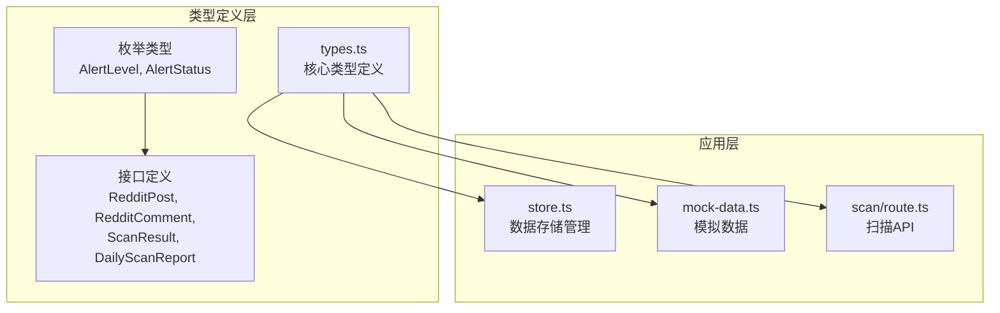
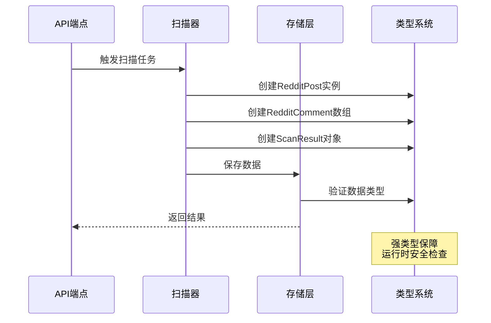
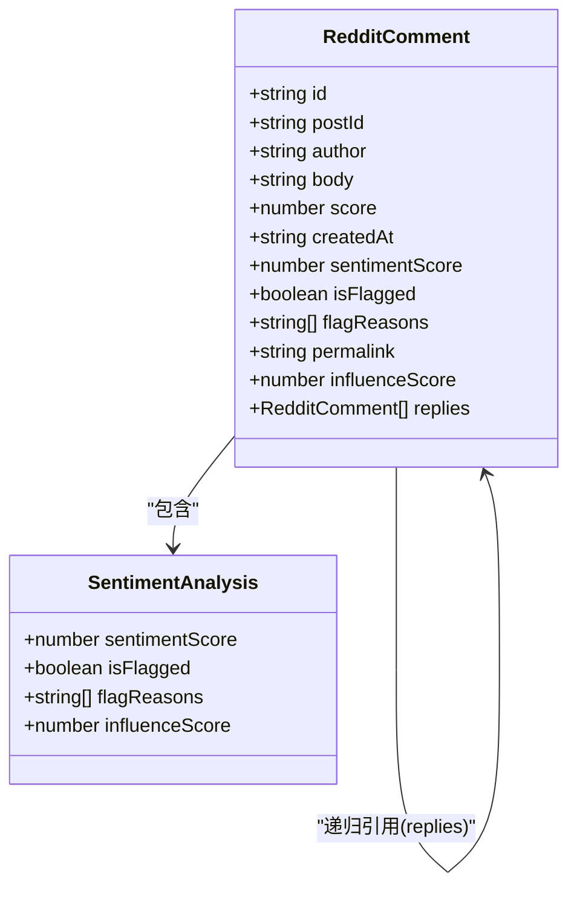
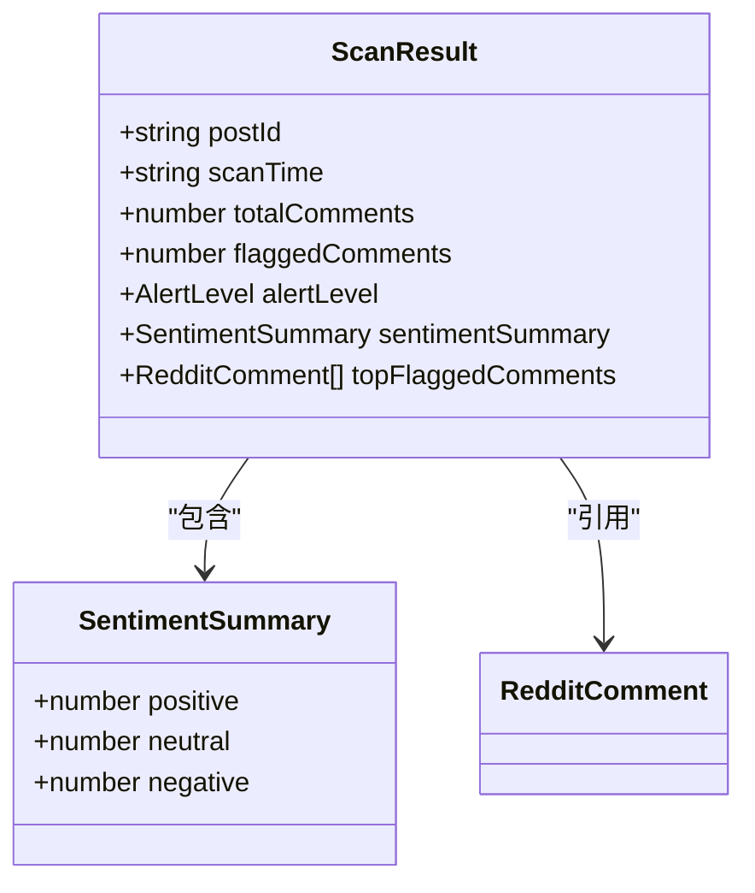
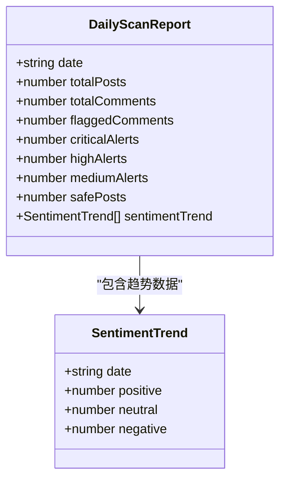
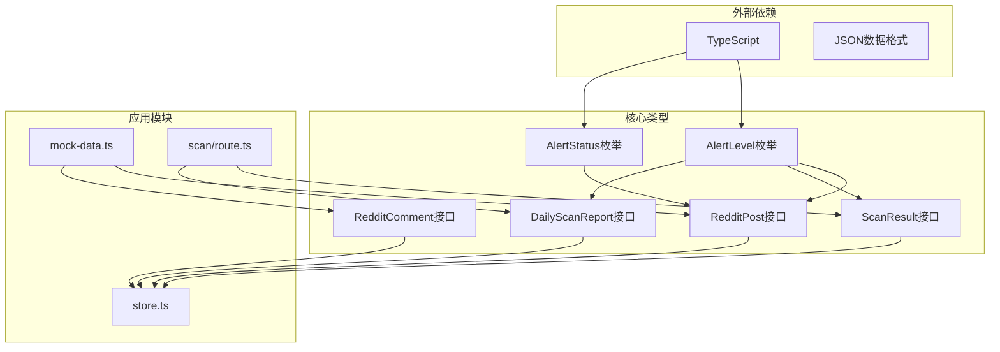

# 核心类型定义

<cite>
**本文档引用的文件**
- [src/lib/types.ts](file://src/lib/types.ts)
- [src/lib/store.ts](file://src/lib/store.ts)
- [src/lib/mock-data.ts](file://src/lib/mock-data.ts)
- [src/app/api/scan/route.ts](file://src/app/api/scan/route.ts)
</cite>

## 目录
1. [简介](#简介)
2. [项目结构](#项目结构)
3. [核心组件](#核心组件)
4. [架构概览](#架构概览)
5. [详细组件分析](#详细组件分析)
6. [依赖分析](#依赖分析)
7. [性能考虑](#性能考虑)
8. [故障排除指南](#故障排除指南)
9. [结论](#结论)

## 简介

本文件专注于 Reddit Apify 项目的核心类型定义系统。该系统采用 TypeScript 的强类型特性，为 Reddit 数据监控应用提供了完整的类型安全保障。主要涵盖 RedditPost、RedditComment、ScanResult、DailyScanReport 等核心接口，以及 AlertLevel、AlertStatus 等枚举类型的完整实现。

## 项目结构

项目采用模块化设计，类型定义集中在 `src/lib/types.ts` 文件中，通过清晰的接口层次结构支持整个应用的数据流处理。



**图表来源**
- [src/lib/types.ts:1-93](file://src/lib/types.ts#L1-L93)
- [src/lib/store.ts:1-153](file://src/lib/store.ts#L1-L153)

**章节来源**
- [src/lib/types.ts:1-93](file://src/lib/types.ts#L1-L93)
- [src/lib/store.ts:1-153](file://src/lib/store.ts#L1-L153)

## 核心组件

### 枚举类型系统

项目实现了完整的告警级别枚举体系，支持多级告警状态管理：

```mermaid
classDiagram
class AlertLevel {
<<enumeration>>
"critical" : 严重
"high" : 高
"medium" : 中等
"low" : 低
"safe" : 安全
}
class AlertStatus {
<<enumeration>>
"pending" : 待处理
"processing" : 处理中
"resolved" : 已解决
"ignored" : 已忽略
}
AlertLevel --> AlertStatus : "组合使用"
```

**图表来源**
- [src/lib/types.ts:5-8](file://src/lib/types.ts#L5-L8)

### 核心数据模型

系统采用接口驱动的设计模式，每个核心实体都有明确的职责边界：

**章节来源**
- [src/lib/types.ts:9-75](file://src/lib/types.ts#L9-L75)

## 架构概览

类型系统在整个应用中的作用机制如下：



**图表来源**
- [src/app/api/scan/route.ts:167-195](file://src/app/api/scan/route.ts#L167-L195)
- [src/lib/store.ts:145-153](file://src/lib/store.ts#L145-L153)

## 详细组件分析

### RedditPost 接口分析

RedditPost 是整个系统的核心数据载体，代表单个 Reddit 帖子的完整信息。

```mermaid
classDiagram
class RedditPost {
+string id
+string redditUrl
+string title
+string subreddit
+string author
+number score
+number commentCount
+string createdAt
+string lastScanned
+AlertLevel alertLevel
+string[] alertReasons
+string thumbnailUrl
+string summary
+AlertStatus alertStatus
+string handler
+string handleTime
+string handleNote
+string scanError
+string nextScanTime
}
class AlertLevel {
<<enumeration>>
"critical"|"high"|"medium"|"low"|"safe"
}
class AlertStatus {
<<enumeration>>
"pending"|"processing"|"resolved"|"ignored"
}
RedditPost --> AlertLevel : "使用"
RedditPost --> AlertStatus : "使用"
```

**图表来源**
- [src/lib/types.ts:9-29](file://src/lib/types.ts#L9-L29)

#### 关键特性说明

- **标识符系统**: 使用字符串 ID 和 Reddit URL 双重标识确保唯一性
- **时间戳管理**: 支持创建时间和最后扫描时间的精确追踪
- **告警集成**: 内置告警级别和状态管理字段
- **可选扩展**: 提供多个可选字段支持灵活的数据扩展

**章节来源**
- [src/lib/types.ts:9-29](file://src/lib/types.ts#L9-L29)

### RedditComment 接口分析

RedditComment 定义了评论的完整数据结构，支持嵌套回复和情感分析。



**图表来源**
- [src/lib/types.ts:31-44](file://src/lib/types.ts#L31-L44)

#### 情感分析集成

评论系统集成了多层次的情感分析能力：

- **数值评分**: -1 到 1 的连续评分范围
- **标志状态**: 布尔值标记恶意或敏感内容
- **影响力计算**: 基于点赞数和情感强度的加权计算
- **嵌套回复**: 支持无限层级的评论回复结构

**章节来源**
- [src/lib/types.ts:31-44](file://src/lib/types.ts#L31-L44)

### ScanResult 接口分析

ScanResult 记录每次扫描任务的统计结果和关键指标。



**图表来源**
- [src/lib/types.ts:46-58](file://src/lib/types.ts#L46-L58)

#### 统计指标体系

扫描结果提供了全面的统计分析维度：

- **总量统计**: 总评论数、标记评论数
- **情感分布**: 正面、中性、负面情感的分布统计
- **关键发现**: 顶级标记评论的精选列表
- **告警聚合**: 基于统计结果的综合告警级别

**章节来源**
- [src/lib/types.ts:46-58](file://src/lib/types.ts#L46-L58)

### DailyScanReport 接口分析

DailyScanReport 提供日度扫描报告的聚合视图。



**图表来源**
- [src/lib/types.ts:60-75](file://src/lib/types.ts#L60-L75)

#### 趋势分析功能

日报表支持多维度的趋势分析：

- **时间序列**: 日度级别的数据累积
- **情感趋势**: 连续日期的情感变化轨迹
- **告警统计**: 不同级别告警的日度分布
- **聚合指标**: 整体健康状况的量化评估

**章节来源**
- [src/lib/types.ts:60-75](file://src/lib/types.ts#L60-L75)

## 依赖分析

类型系统在项目中的依赖关系呈现清晰的分层结构：



**图表来源**
- [src/lib/types.ts:1-93](file://src/lib/types.ts#L1-L93)
- [src/lib/store.ts:4](file://src/lib/store.ts#L4)
- [src/lib/mock-data.ts:2](file://src/lib/mock-data.ts#L2)

**章节来源**
- [src/lib/types.ts:1-93](file://src/lib/types.ts#L1-L93)
- [src/lib/store.ts:4](file://src/lib/store.ts#L4)
- [src/lib/mock-data.ts:2](file://src/lib/mock-data.ts#L2)

## 性能考虑

### 类型安全与运行时开销

TypeScript 在编译时提供类型检查，在运行时不会产生额外的性能开销。所有类型信息在编译阶段被移除，确保生产环境的执行效率。

### 数据结构优化

- **选择性属性**: 使用可选属性减少内存占用
- **统一标识符**: 通过 ID 字段实现高效的关联查询
- **嵌套结构**: 评论回复的递归结构支持灵活的数据组织

## 故障排除指南

### 常见类型错误

1. **属性缺失**: 确保所有必需属性都已正确定义
2. **类型不匹配**: 注意 AlertLevel 和 AlertStatus 的枚举值限制
3. **可选属性访问**: 在访问可选属性前进行存在性检查

### 调试建议

- 使用 TypeScript 编译器的严格模式
- 在关键数据转换点添加类型断言注释
- 利用 IDE 的类型提示功能进行开发

**章节来源**
- [src/lib/types.ts:5-8](file://src/lib/types.ts#L5-L8)

## 结论

该类型系统通过精心设计的接口层次和枚举体系，为 Reddit 监控应用提供了完整的类型安全保障。核心接口之间形成了清晰的依赖关系，既保证了数据的一致性，又保持了足够的灵活性以适应不同的业务场景。推荐的使用模式包括：始终使用接口定义数据结构、合理利用可选属性、在需要时扩展现有接口，以及遵循类型安全的最佳实践。