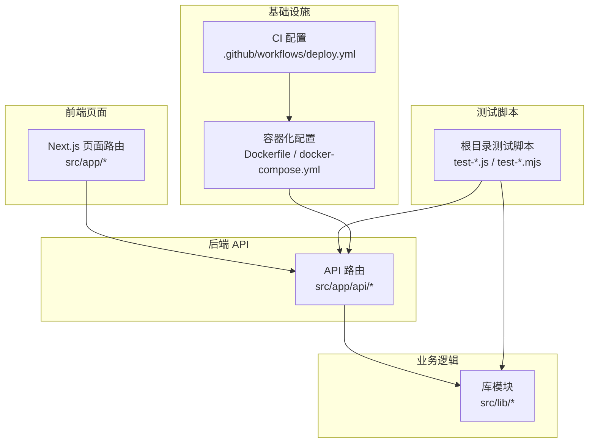
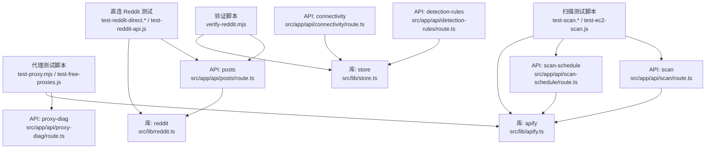
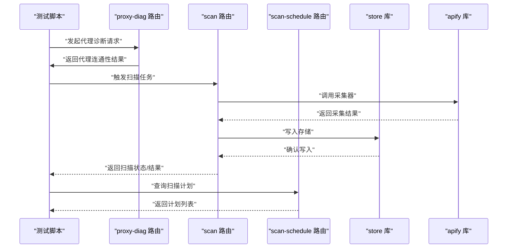
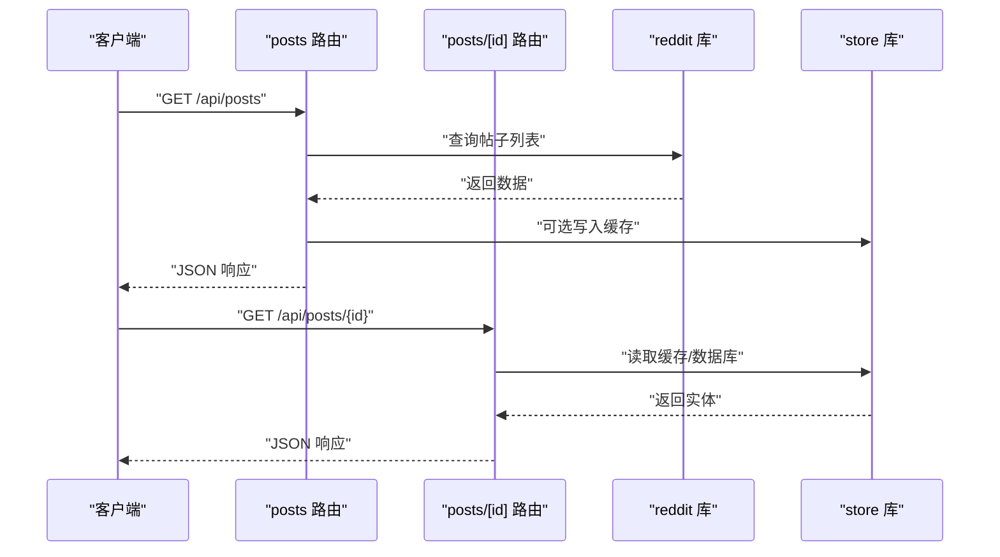
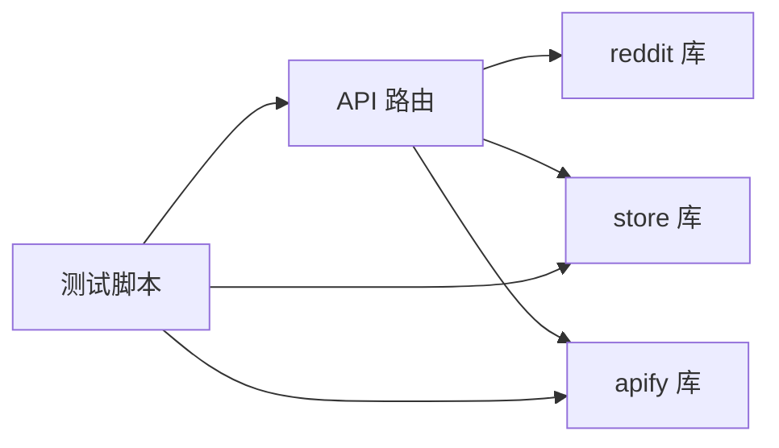

# 测试策略

<cite>
**本文引用的文件**
- [package.json](file://package.json)
- [tsconfig.json](file://tsconfig.json)
- [eslint.config.mjs](file://eslint.config.mjs)
- [next.config.ts](file://next.config.ts)
- [src/lib/apify.ts](file://src/lib/apify.ts)
- [src/lib/reddit.ts](file://src/lib/reddit.ts)
- [src/lib/scheduler.ts](file://src/lib/scheduler.ts)
- [src/lib/store.ts](file://src/lib/store.ts)
- [src/lib/types.ts](file://src/lib/types.ts)
- [src/app/api/posts/route.ts](file://src/app/api/posts/route.ts)
- [src/app/api/scan/route.ts](file://src/app/api/scan/route.ts)
- [src/app/api/proxy-diag/route.ts](file://src/app/api/proxy-diag/route.ts)
- [src/app/api/connectivity/route.ts](file://src/app/api/connectivity/route.ts)
- [src/app/api/alerts/route.ts](file://src/app/api/alerts/route.ts)
- [src/app/api/detection-rules/route.ts](file://src/app/api/detection-rules/route.ts)
- [src/app/api/dashboard/route.ts](file://src/app/api/dashboard/route.ts)
- [src/app/api/keywords/route.ts](file://src/app/api/keywords/route.ts)
- [src/app/api/influencers/route.ts](file://src/app/api/influencers/route.ts)
- [src/app/api/compare/route.ts](file://src/app/api/compare/route.ts)
- [src/app/api/subreddits/route.ts](file://src/app/api/subreddits/route.ts)
- [src/app/api/subreddit-detail/route.ts](file://src/app/api/subreddit-detail/route.ts)
- [src/app/api/scan-schedule/route.ts](file://src/app/api/scan-schedule/route.ts)
- [src/app/api/import/route.ts](file://src/app/api/import/route.ts)
- [src/app/api/llm/route.ts](file://src/app/api/llm/route.ts)
- [src/app/api/feishu/route.ts](file://src/app/api/feishu/route.ts)
- [src/app/api/feishu-auth/callback/route.ts](file://src/app/api/feishu-auth/callback/route.ts)
- [src/app/api/feishu-auth/external/route.ts](file://src/app/api/feishu-auth/external/route.ts)
- [src/app/api/feishu-auth/revoke/route.ts](file://src/app/api/feishu-auth/revoke/route.ts)
- [src/app/api/feishu-auth/status/route.ts](file://src/app/api/feishu-auth/status/route.ts)
- [src/app/api/feishu-auth/url/route.ts](file://src/app/api/feishu-auth/url/route.ts)
- [src/app/api/notify/route.ts](file://src/app/api/notify/route.ts)
- [src/app/api/posts/[id]/route.ts](file://src/app/api/posts/[id]/route.ts)
- [src/app/api/posts/route.ts](file://src/app/api/posts/route.ts)
- [src/lib/mock-data.ts](file://src/lib/mock-data.ts)
- [.github/workflows/deploy.yml](file://.github/workflows/deploy.yml)
- [docker-compose.yml](file://docker-compose.yml)
- [Dockerfile](file://Dockerfile)
- [test-proxy.mjs](file://test-proxy.mjs)
- [test-reddit-direct.mjs](file://test-reddit-direct.mjs)
- [test-scan.mjs](file://test-scan.mjs)
- [test-decodo-formats.js](file://test-decodo-formats.js)
- [test-decodo-local.js](file://test-decodo-local.js)
- [test-ec2-scan.js](file://test-ec2-scan.js)
- [test-free-proxies.js](file://test-free-proxies.js)
- [test-reddit-api.js](file://test-reddit-api.js)
- [test-reddit-direct.js](file://test-reddit-direct.js)
- [test-reddit-with-proxy.js](file://test-reddit-with-proxy.js)
- [test-scan.js](file://test-scan.js)
- [verify-reddit.mjs](file://verify-reddit.mjs)
</cite>

## 目录
1. [引言](#引言)
2. [项目结构](#项目结构)
3. [核心组件](#核心组件)
4. [架构总览](#架构总览)
5. [详细组件分析](#详细组件分析)
6. [依赖关系分析](#依赖关系分析)
7. [性能考虑](#性能考虑)
8. [故障排查指南](#故障排查指南)
9. [结论](#结论)
10. [附录](#附录)

## 引言
本测试策略文档面向 Reddit 监控系统，目标是建立覆盖单元测试、集成测试与性能测试的完整测试体系。文档基于仓库中现有的测试脚本与 API 实现，明确测试范围、测试环境搭建、测试数据准备、模拟服务使用、覆盖率与质量标准、持续集成与自动化测试配置，并为新功能开发提供测试编写指导。

## 项目结构
项目采用 Next.js 应用结构，后端 API 路由集中于 src/app/api 下，业务逻辑位于 src/lib 中，测试脚本位于根目录。整体组织方式为“按功能域分层 + 路由即接口”的设计，便于进行端到端与集成测试。

图表来源
- [src/app/api/posts/route.ts:1-200](file://src/app/api/posts/route.ts#L1-L200)
- [src/lib/apify.ts:1-200](file://src/lib/apify.ts#L1-L200)
- [test-proxy.mjs:1-200](file://test-proxy.mjs#L1-L200)
- [.github/workflows/deploy.yml:1-200](file://.github/workflows/deploy.yml#L1-L200)
- [docker-compose.yml:1-200](file://docker-compose.yml#L1-L200)

章节来源
- [package.json:1-200](file://package.json#L1-L200)
- [next.config.ts:1-200](file://next.config.ts#L1-L200)

## 核心组件
- 爬虫与数据采集：通过 Apify 客户端封装与调度器协作，负责从 Reddit 获取内容并写入存储。
- 数据模型与类型：定义统一的数据结构与类型约束，确保前后端一致性。
- API 层：以 Next.js App Router 的路由形式暴露 REST 接口，处理请求、参数校验与响应格式。
- 存储与状态：提供数据持久化与缓存能力，支撑监控与报表生成。
- 调度与计划任务：支持定时扫描与扫描计划管理。

章节来源
- [src/lib/apify.ts:1-200](file://src/lib/apify.ts#L1-L200)
- [src/lib/reddit.ts:1-200](file://src/lib/reddit.ts#L1-L200)
- [src/lib/scheduler.ts:1-200](file://src/lib/scheduler.ts#L1-L200)
- [src/lib/store.ts:1-200](file://src/lib/store.ts#L1-L200)
- [src/lib/types.ts:1-200](file://src/lib/types.ts#L1-L200)

## 架构总览
下图展示测试策略与现有实现的映射关系：测试脚本直接调用 API 或业务模块，验证数据流与错误处理；CI 通过容器化部署与自动化流程保障质量门禁。

图表来源
- [test-proxy.mjs:1-200](file://test-proxy.mjs#L1-L200)
- [test-reddit-direct.mjs:1-200](file://test-reddit-direct.mjs#L1-L200)
- [test-scan.mjs:1-200](file://test-scan.mjs#L1-L200)
- [verify-reddit.mjs:1-200](file://verify-reddit.mjs#L1-L200)
- [src/app/api/posts/route.ts:1-200](file://src/app/api/posts/route.ts#L1-L200)
- [src/app/api/scan/route.ts:1-200](file://src/app/api/scan/route.ts#L1-L200)
- [src/app/api/scan-schedule/route.ts:1-200](file://src/app/api/scan-schedule/route.ts#L1-L200)
- [src/app/api/detection-rules/route.ts:1-200](file://src/app/api/detection-rules/route.ts#L1-L200)
- [src/app/api/connectivity/route.ts:1-200](file://src/app/api/connectivity/route.ts#L1-L200)
- [src/app/api/proxy-diag/route.ts:1-200](file://src/app/api/proxy-diag/route.ts#L1-L200)
- [src/lib/apify.ts:1-200](file://src/lib/apify.ts#L1-L200)
- [src/lib/reddit.ts:1-200](file://src/lib/reddit.ts#L1-L200)
- [src/lib/store.ts:1-200](file://src/lib/store.ts#L1-L200)

## 详细组件分析

### 爬虫与扫描测试（单元/集成）
- 测试目标：验证 Reddit 数据抓取、代理连通性诊断、扫描任务执行与结果落库。
- 关键测试脚本：
  - 代理连通性与可用性：test-proxy.mjs、test-free-proxies.js
  - 直连 Reddit 与 API 访问：test-reddit-direct.mjs、test-reddit-direct.js、test-reddit-api.js
  - 扫描与 EC2 扫描：test-scan.mjs、test-scan.js、test-ec2-scan.js
  - 数据格式与本地解码：test-decodo-formats.js、test-decodo-local.js
  - 数据一致性验证：verify-reddit.mjs
- 建议测试策略：
  - 单元测试：针对 apify/reddit/store 的独立函数进行输入输出断言与边界条件测试。
  - 集成测试：通过 API 路由触发扫描与抓取，断言数据库/文件输出与返回值。
  - 回归测试：对 verify 脚本进行回归，确保数据完整性与格式正确性。

图表来源
- [src/app/api/proxy-diag/route.ts:1-200](file://src/app/api/proxy-diag/route.ts#L1-L200)
- [src/app/api/scan/route.ts:1-200](file://src/app/api/scan/route.ts#L1-L200)
- [src/app/api/scan-schedule/route.ts:1-200](file://src/app/api/scan-schedule/route.ts#L1-L200)
- [src/lib/store.ts:1-200](file://src/lib/store.ts#L1-L200)
- [src/lib/apify.ts:1-200](file://src/lib/apify.ts#L1-L200)

章节来源
- [test-proxy.mjs:1-200](file://test-proxy.mjs#L1-L200)
- [test-free-proxies.js:1-200](file://test-free-proxies.js#L1-L200)
- [test-reddit-direct.mjs:1-200](file://test-reddit-direct.mjs#L1-L200)
- [test-reddit-direct.js:1-200](file://test-reddit-direct.js#L1-L200)
- [test-reddit-api.js:1-200](file://test-reddit-api.js#L1-L200)
- [test-scan.mjs:1-200](file://test-scan.mjs#L1-L200)
- [test-scan.js:1-200](file://test-scan.js#L1-L200)
- [test-ec2-scan.js:1-200](file://test-ec2-scan.js#L1-L200)
- [test-decodo-formats.js:1-200](file://test-decodo-formats.js#L1-L200)
- [test-decodo-local.js:1-200](file://test-decodo-local.js#L1-L200)
- [verify-reddit.mjs:1-200](file://verify-reddit.mjs#L1-L200)

### API 测试（集成/端到端）
- 测试目标：验证各 API 路由的请求处理、参数校验、异常分支与响应一致性。
- 关键路由与职责：
  - posts、posts/[id]：帖子查询与详情
  - scan、scan-schedule：扫描任务与计划
  - connectivity、proxy-diag：连通性与代理诊断
  - alerts、detection-rules、dashboard、keywords、influencers、compare、subreddits、subreddit-detail：监控与分析相关
  - import、llm、feishu 及其认证子路由：导入、大模型与飞书对接
  - notify：通知发送
- 建议测试策略：
  - 单元测试：对路由中的业务函数进行断言（如参数解析、权限检查）。
  - 集成测试：使用 http 请求调用路由，断言状态码、响应体结构与副作用。
  - 端到端测试：结合 mock-data 与 mock 服务，验证完整用户路径。

图表来源
- [src/app/api/posts/route.ts:1-200](file://src/app/api/posts/route.ts#L1-L200)
- [src/app/api/posts/[id]/route.ts](file://src/app/api/posts/[id]/route.ts#L1-L200)
- [src/lib/reddit.ts:1-200](file://src/lib/reddit.ts#L1-L200)
- [src/lib/store.ts:1-200](file://src/lib/store.ts#L1-L200)

章节来源
- [src/app/api/posts/route.ts:1-200](file://src/app/api/posts/route.ts#L1-L200)
- [src/app/api/posts/[id]/route.ts](file://src/app/api/posts/[id]/route.ts#L1-L200)
- [src/app/api/scan/route.ts:1-200](file://src/app/api/scan/route.ts#L1-L200)
- [src/app/api/scan-schedule/route.ts:1-200](file://src/app/api/scan-schedule/route.ts#L1-L200)
- [src/app/api/connectivity/route.ts:1-200](file://src/app/api/connectivity/route.ts#L1-L200)
- [src/app/api/proxy-diag/route.ts:1-200](file://src/app/api/proxy-diag/route.ts#L1-L200)
- [src/app/api/alerts/route.ts:1-200](file://src/app/api/alerts/route.ts#L1-L200)
- [src/app/api/detection-rules/route.ts:1-200](file://src/app/api/detection-rules/route.ts#L1-L200)
- [src/app/api/dashboard/route.ts:1-200](file://src/app/api/dashboard/route.ts#L1-L200)
- [src/app/api/keywords/route.ts:1-200](file://src/app/api/keywords/route.ts#L1-L200)
- [src/app/api/influencers/route.ts:1-200](file://src/app/api/influencers/route.ts#L1-L200)
- [src/app/api/compare/route.ts:1-200](file://src/app/api/compare/route.ts#L1-L200)
- [src/app/api/subreddits/route.ts:1-200](file://src/app/api/subreddits/route.ts#L1-L200)
- [src/app/api/subreddit-detail/route.ts:1-200](file://src/app/api/subreddit-detail/route.ts#L1-L200)
- [src/app/api/import/route.ts:1-200](file://src/app/api/import/route.ts#L1-L200)
- [src/app/api/llm/route.ts:1-200](file://src/app/api/llm/route.ts#L1-L200)
- [src/app/api/feishu/route.ts:1-200](file://src/app/api/feishu/route.ts#L1-L200)
- [src/app/api/feishu-auth/callback/route.ts:1-200](file://src/app/api/feishu-auth/callback/route.ts#L1-L200)
- [src/app/api/feishu-auth/external/route.ts:1-200](file://src/app/api/feishu-auth/external/route.ts#L1-L200)
- [src/app/api/feishu-auth/revoke/route.ts:1-200](file://src/app/api/feishu-auth/revoke/route.ts#L1-L200)
- [src/app/api/feishu-auth/status/route.ts:1-200](file://src/app/api/feishu-auth/status/route.ts#L1-L200)
- [src/app/api/feishu-auth/url/route.ts:1-200](file://src/app/api/feishu-auth/url/route.ts#L1-L200)
- [src/app/api/notify/route.ts:1-200](file://src/app/api/notify/route.ts#L1-L200)

### 代理测试（集成）
- 测试目标：验证代理连通性、代理池健康度与请求转发行为。
- 关键测试脚本：test-proxy.mjs、test-free-proxies.js
- 建议测试策略：
  - 单元测试：对代理选择与切换逻辑进行断言。
  - 集成测试：通过 proxy-diag 路由验证代理可用性与延迟指标。

章节来源
- [test-proxy.mjs:1-200](file://test-proxy.mjs#L1-L200)
- [test-free-proxies.js:1-200](file://test-free-proxies.js#L1-L200)
- [src/app/api/proxy-diag/route.ts:1-200](file://src/app/api/proxy-diag/route.ts#L1-L200)

### 数据准备与模拟服务
- 模拟数据：mock-data.ts 提供测试所需的基础数据集，建议在单元测试中优先使用。
- 模拟服务：可结合 Next.js App Router 的路由与本地存储，构建最小化依赖的测试环境。
- 外部依赖：Reddit API、飞书 API、外部代理服务，建议通过环境变量与配置隔离，便于替换与测试。

章节来源
- [src/lib/mock-data.ts:1-200](file://src/lib/mock-data.ts#L1-L200)

## 依赖关系分析
- 组件耦合：API 路由依赖库模块；库模块之间存在清晰职责划分；测试脚本直接依赖 API 与库模块。
- 外部依赖：Reddit、飞书、代理服务；建议通过配置与适配器模式降低耦合。
- 循环依赖：当前结构未见明显循环依赖迹象。

图表来源
- [src/app/api/posts/route.ts:1-200](file://src/app/api/posts/route.ts#L1-L200)
- [src/lib/reddit.ts:1-200](file://src/lib/reddit.ts#L1-L200)
- [src/lib/store.ts:1-200](file://src/lib/store.ts#L1-L200)
- [src/lib/apify.ts:1-200](file://src/lib/apify.ts#L1-L200)
- [test-proxy.mjs:1-200](file://test-proxy.mjs#L1-L200)

章节来源
- [src/lib/apify.ts:1-200](file://src/lib/apify.ts#L1-L200)
- [src/lib/reddit.ts:1-200](file://src/lib/reddit.ts#L1-L200)
- [src/lib/store.ts:1-200](file://src/lib/store.ts#L1-L200)

## 性能考虑
- 爬取并发与限速：在 apify/reddit 库中设置合理的并发与速率限制，避免触发反爬机制。
- 缓存策略：利用 store 库的缓存能力减少重复请求，提升响应速度。
- 数据批处理：扫描与导入 API 支持批量操作，建议在测试中覆盖不同规模数据集。
- 监控指标：在 proxy-diag 与 connectivity 路由中收集延迟、成功率等指标，作为性能基线。

## 故障排查指南
- 代理问题：通过 proxy-diag 路由与 test-proxy.mjs/test-free-proxies.js 定位代理连通性与可用性。
- 连接问题：使用 connectivity 路由与 test-reddit-direct.* 验证网络与 API 可达性。
- 数据不一致：运行 verify-reddit.mjs 对比预期与实际输出，定位数据采集或存储环节。
- 扫描失败：检查 scan 与 scan-schedule 路由日志，结合 apify 库的错误信息定位原因。

章节来源
- [src/app/api/proxy-diag/route.ts:1-200](file://src/app/api/proxy-diag/route.ts#L1-L200)
- [src/app/api/connectivity/route.ts:1-200](file://src/app/api/connectivity/route.ts#L1-L200)
- [test-proxy.mjs:1-200](file://test-proxy.mjs#L1-L200)
- [test-free-proxies.js:1-200](file://test-free-proxies.js#L1-L200)
- [test-reddit-direct.mjs:1-200](file://test-reddit-direct.mjs#L1-L200)
- [verify-reddit.mjs:1-200](file://verify-reddit.mjs#L1-L200)

## 结论
本测试策略以现有测试脚本与 API 实现为基础，建议采用“单元测试 + 集成测试 + 端到端测试”三层体系，配合容器化与 CI 流水线，持续保障系统稳定性与质量。后续可在关键模块补充更细粒度的单元测试与覆盖率统计，完善测试数据与模拟服务，形成闭环的质量保障体系。

## 附录

### 测试环境搭建与配置
- 语言与工具链：TypeScript、Next.js、Node.js（参考 package.json 与 tsconfig.json）。
- 代码规范：ESLint 配置（eslint.config.mjs），建议在 CI 中强制执行。
- 容器化：Dockerfile 与 docker-compose.yml 用于本地与 CI 环境的一致化部署。
- CI：GitHub Actions 部署工作流（deploy.yml），建议扩展为测试与构建并行流水线。

章节来源
- [package.json:1-200](file://package.json#L1-L200)
- [tsconfig.json:1-200](file://tsconfig.json#L1-L200)
- [eslint.config.mjs:1-200](file://eslint.config.mjs#L1-L200)
- [docker-compose.yml:1-200](file://docker-compose.yml#L1-L200)
- [.github/workflows/deploy.yml:1-200](file://.github/workflows/deploy.yml#L1-L200)

### 测试覆盖率与质量标准
- 覆盖率目标：建议对核心库模块（apify、reddit、store、scheduler、types）达到 80%+ 行覆盖率与 70%+ 分支覆盖率。
- 质量门禁：CI 中集成 ESLint、类型检查与单元测试，失败则阻断合并。
- 回归测试：每次变更后运行 verify 与关键集成测试脚本，确保数据一致性与 API 兼容性。

章节来源
- [src/lib/apify.ts:1-200](file://src/lib/apify.ts#L1-L200)
- [src/lib/reddit.ts:1-200](file://src/lib/reddit.ts#L1-L200)
- [src/lib/store.ts:1-200](file://src/lib/store.ts#L1-L200)
- [src/lib/scheduler.ts:1-200](file://src/lib/scheduler.ts#L1-L200)
- [src/lib/types.ts:1-200](file://src/lib/types.ts#L1-L200)
- [verify-reddit.mjs:1-200](file://verify-reddit.mjs#L1-L200)

### 持续集成与自动化测试
- 触发条件：push 到主分支或创建 PR。
- 步骤建议：安装依赖 → 类型检查 → ESLint → 单元测试 → 集成测试 → 构建镜像 → 部署预览。
- 结果反馈：在 PR 中显示测试报告与覆盖率摘要。

章节来源
- [.github/workflows/deploy.yml:1-200](file://.github/workflows/deploy.yml#L1-L200)

### 新功能测试编写指导
- 设计原则：先写单元测试，再写集成测试，最后写端到端测试。
- 数据与模拟：优先使用 mock-data.ts 与本地存储，必要时引入轻量级模拟服务。
- 关注点：输入参数校验、异常分支、幂等性、并发安全、资源释放。
- 报告与追踪：为每个功能模块维护独立的测试套件与测试用例清单，便于回归与追踪。