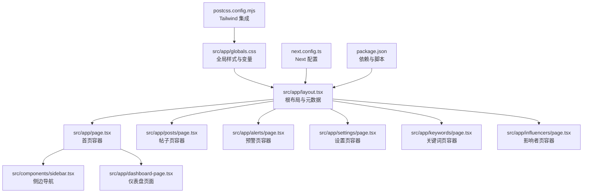
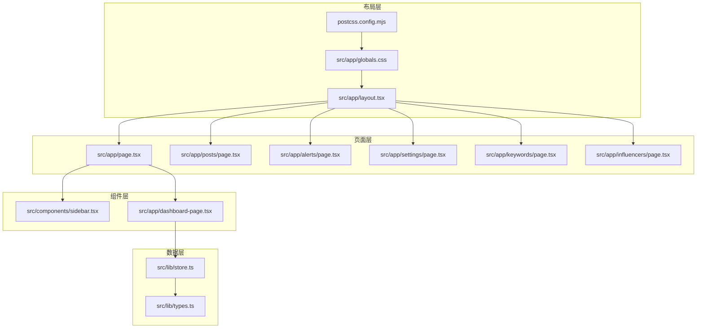
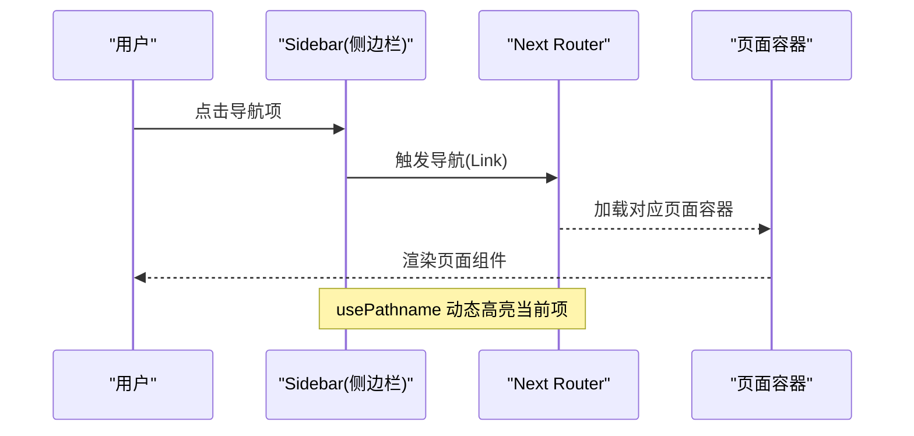
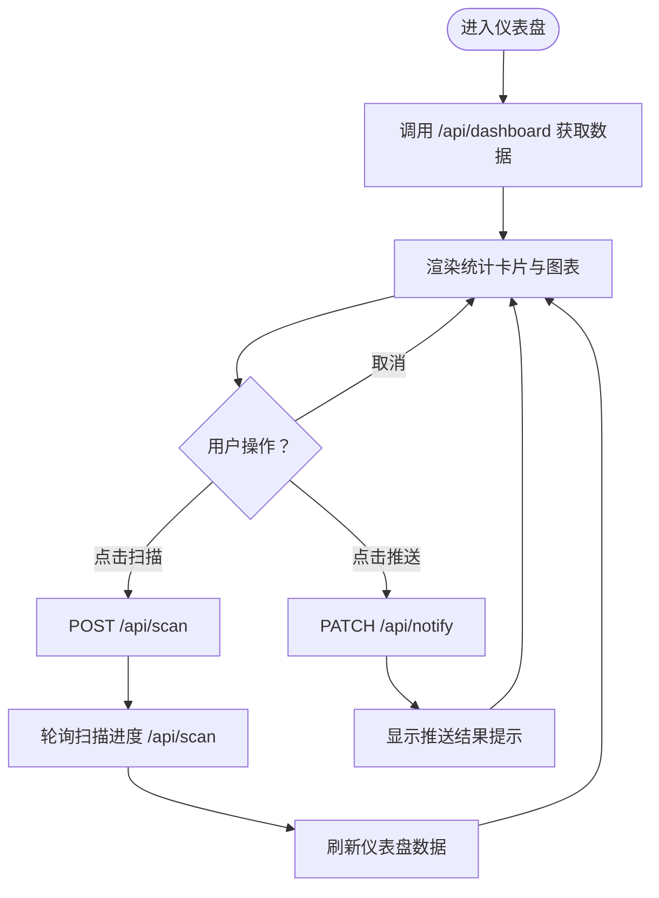
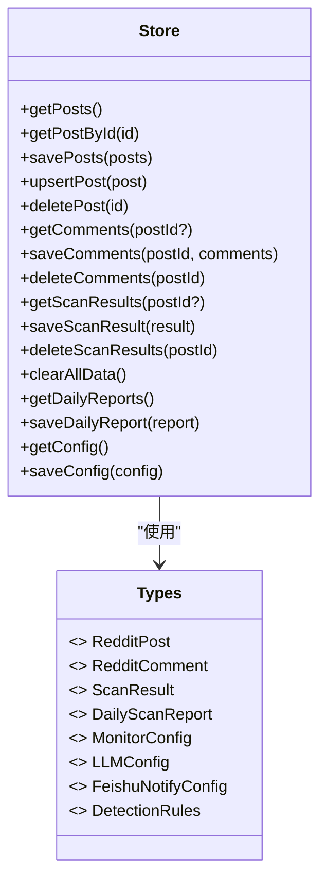
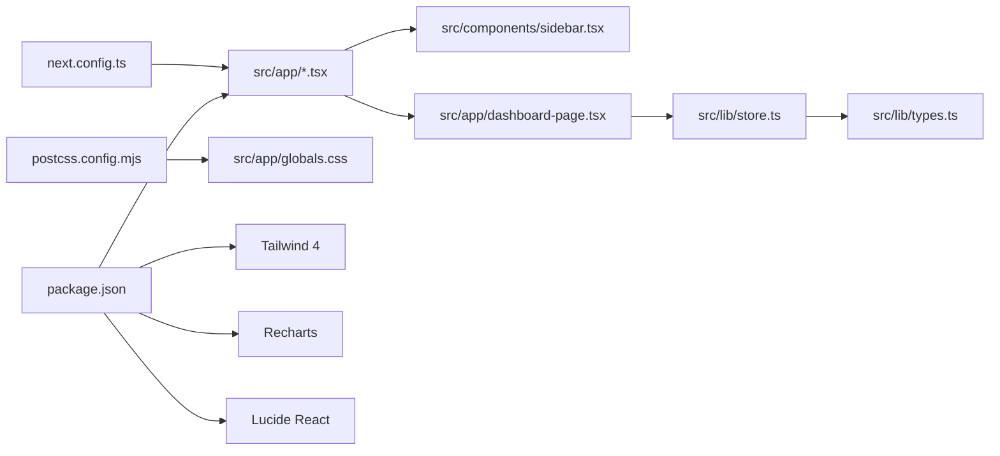

# 前端架构

<cite>
**本文引用的文件**
- [src/app/layout.tsx](file://src/app/layout.tsx)
- [src/app/page.tsx](file://src/app/page.tsx)
- [src/app/globals.css](file://src/app/globals.css)
- [src/components/sidebar.tsx](file://src/components/sidebar.tsx)
- [src/lib/store.ts](file://src/lib/store.ts)
- [src/lib/types.ts](file://src/lib/types.ts)
- [src/app/dashboard-page.tsx](file://src/app/dashboard-page.tsx)
- [src/app/posts/page.tsx](file://src/app/posts/page.tsx)
- [src/app/alerts/page.tsx](file://src/app/alerts/page.tsx)
- [src/app/settings/page.tsx](file://src/app/settings/page.tsx)
- [src/app/keywords/page.tsx](file://src/app/keywords/page.tsx)
- [src/app/influencers/page.tsx](file://src/app/influencers/page.tsx)
- [next.config.ts](file://next.config.ts)
- [package.json](file://package.json)
- [postcss.config.mjs](file://postcss.config.mjs)
</cite>

## 目录
1. [简介](#简介)
2. [项目结构](#项目结构)
3. [核心组件](#核心组件)
4. [架构总览](#架构总览)
5. [详细组件分析](#详细组件分析)
6. [依赖关系分析](#依赖关系分析)
7. [性能考量](#性能考量)
8. [故障排查指南](#故障排查指南)
9. [结论](#结论)
10. [附录](#附录)

## 简介
本文件面向 Reddit 监控系统的前端架构，围绕 Next.js 14 App Router 的设计理念与实现细节展开，系统性阐述页面路由、布局体系、组件层次结构；详解 React 组件架构、状态管理模式、路由配置与导航系统；记录全局样式系统、主题定制与响应式设计；解释前端性能优化策略、代码分割与懒加载机制；并总结组件间通信模式、错误边界处理与用户体验优化的最佳实践。

## 项目结构
该前端采用 Next.js 14 App Router 的文件系统路由约定，页面与布局以目录结构组织，静态资源与样式通过根级入口统一注入。整体结构清晰、职责明确，便于扩展与维护。

图表来源
- [src/app/layout.tsx:1-23](file://src/app/layout.tsx#L1-L23)
- [src/app/page.tsx:1-14](file://src/app/page.tsx#L1-L14)
- [src/app/globals.css:1-74](file://src/app/globals.css#L1-L74)
- [src/components/sidebar.tsx:1-96](file://src/components/sidebar.tsx#L1-L96)
- [src/app/dashboard-page.tsx:1-535](file://src/app/dashboard-page.tsx#L1-L535)
- [src/app/posts/page.tsx:1-14](file://src/app/posts/page.tsx#L1-L14)
- [src/app/alerts/page.tsx:1-14](file://src/app/alerts/page.tsx#L1-L14)
- [src/app/settings/page.tsx:1-14](file://src/app/settings/page.tsx#L1-L14)
- [src/app/keywords/page.tsx:1-14](file://src/app/keywords/page.tsx#L1-L14)
- [src/app/influencers/page.tsx:1-14](file://src/app/influencers/page.tsx#L1-L14)
- [postcss.config.mjs:1-8](file://postcss.config.mjs#L1-L8)
- [next.config.ts:1-28](file://next.config.ts#L1-L28)
- [package.json:1-38](file://package.json#L1-L38)

章节来源
- [src/app/layout.tsx:1-23](file://src/app/layout.tsx#L1-L23)
- [src/app/page.tsx:1-14](file://src/app/page.tsx#L1-L14)
- [src/app/globals.css:1-74](file://src/app/globals.css#L1-L74)
- [postcss.config.mjs:1-8](file://postcss.config.mjs#L1-L8)
- [next.config.ts:1-28](file://next.config.ts#L1-L28)
- [package.json:1-38](file://package.json#L1-L38)

## 核心组件
- 根布局与元数据：在根布局中声明站点元信息，并统一注入全局样式，确保所有页面共享一致的主题与排版。
- 侧边栏导航：基于 Next.js 的 usePathname 与 Link 实现动态高亮与折叠交互，支持图标与文本的条件渲染。
- 页面容器：各业务页面均以“容器 + 页面组件”的形式组织，容器负责布局与通用样式，页面组件承载具体业务逻辑。
- 数据存储与类型：提供本地文件与 Vercel 内存双态持久化方案，配合 TTL 缓存降低 IO 开销；类型系统覆盖帖子、评论、扫描结果、配置等核心领域对象。

章节来源
- [src/app/layout.tsx:1-23](file://src/app/layout.tsx#L1-L23)
- [src/components/sidebar.tsx:1-96](file://src/components/sidebar.tsx#L1-L96)
- [src/app/page.tsx:1-14](file://src/app/page.tsx#L1-L14)
- [src/lib/store.ts:1-285](file://src/lib/store.ts#L1-L285)
- [src/lib/types.ts:1-194](file://src/lib/types.ts#L1-L194)

## 架构总览
系统采用“布局层 → 页面层 → 组件层”的三层结构。布局层负责全局样式与元数据；页面层通过 App Router 的目录路由映射到具体页面；组件层由通用 UI 组件与业务页面组件构成。数据流自后端 API 下发，前端通过本地存储与缓存进行状态管理与持久化。

图表来源
- [src/app/layout.tsx:1-23](file://src/app/layout.tsx#L1-L23)
- [src/app/globals.css:1-74](file://src/app/globals.css#L1-L74)
- [postcss.config.mjs:1-8](file://postcss.config.mjs#L1-L8)
- [src/app/page.tsx:1-14](file://src/app/page.tsx#L1-L14)
- [src/app/posts/page.tsx:1-14](file://src/app/posts/page.tsx#L1-L14)
- [src/app/alerts/page.tsx:1-14](file://src/app/alerts/page.tsx#L1-L14)
- [src/app/settings/page.tsx:1-14](file://src/app/settings/page.tsx#L1-L14)
- [src/app/keywords/page.tsx:1-14](file://src/app/keywords/page.tsx#L1-L14)
- [src/app/influencers/page.tsx:1-14](file://src/app/influencers/page.tsx#L1-L14)
- [src/components/sidebar.tsx:1-96](file://src/components/sidebar.tsx#L1-L96)
- [src/app/dashboard-page.tsx:1-535](file://src/app/dashboard-page.tsx#L1-L535)
- [src/lib/store.ts:1-285](file://src/lib/store.ts#L1-L285)
- [src/lib/types.ts:1-194](file://src/lib/types.ts#L1-L194)

## 详细组件分析

### 布局与导航系统
- 根布局：设置语言、全局类名与最小高度，保证内容占满视口；统一引入全局样式。
- 侧边栏：使用 Lucide 图标库，结合 usePathname 动态判断当前激活项；支持折叠切换，折叠时仅保留图标与收起按钮。
- 页面容器：每个业务页面均复用相同的布局容器，左侧为侧边栏，右侧为主内容区，主内容区内部再嵌入对应的页面组件。

图表来源
- [src/components/sidebar.tsx:1-96](file://src/components/sidebar.tsx#L1-L96)
- [src/app/page.tsx:1-14](file://src/app/page.tsx#L1-L14)
- [src/app/posts/page.tsx:1-14](file://src/app/posts/page.tsx#L1-L14)
- [src/app/alerts/page.tsx:1-14](file://src/app/alerts/page.tsx#L1-L14)
- [src/app/settings/page.tsx:1-14](file://src/app/settings/page.tsx#L1-L14)
- [src/app/keywords/page.tsx:1-14](file://src/app/keywords/page.tsx#L1-L14)
- [src/app/influencers/page.tsx:1-14](file://src/app/influencers/page.tsx#L1-L14)

章节来源
- [src/app/layout.tsx:1-23](file://src/app/layout.tsx#L1-L23)
- [src/components/sidebar.tsx:1-96](file://src/components/sidebar.tsx#L1-L96)
- [src/app/page.tsx:1-14](file://src/app/page.tsx#L1-L14)

### 仪表盘页面与状态管理
- 页面职责：聚合仪表盘数据、执行扫描与推送操作、展示健康度评分与各类图表。
- 状态管理：使用 React hooks 管理加载、扫描、推送等状态；通过 API 获取数据并更新界面。
- 图表与可视化：使用 Recharts 展示情感趋势、分布与分类统计；支持时间窗口切换。
- 用户体验：提供扫描进度反馈、推送结果提示、健康度可视化与动画效果。

图表来源
- [src/app/dashboard-page.tsx:1-535](file://src/app/dashboard-page.tsx#L1-L535)

章节来源
- [src/app/dashboard-page.tsx:1-535](file://src/app/dashboard-page.tsx#L1-L535)

### 数据存储与类型系统
- 存储策略：本地开发使用文件系统持久化，部署于 Vercel 时采用内存存储与环境变量覆盖；提供 TTL 缓存以减少频繁读取。
- 类型系统：涵盖帖子、评论、扫描结果、日报、配置、检测规则、LLM 与飞书通知等核心领域对象，确保前后端数据契约一致。
- 配置合并：在 Vercel 环境下将环境变量合并到默认配置，支持飞书 Webhook、LLM Provider 与隧道地址等动态配置。

图表来源
- [src/lib/store.ts:1-285](file://src/lib/store.ts#L1-L285)
- [src/lib/types.ts:1-194](file://src/lib/types.ts#L1-L194)

章节来源
- [src/lib/store.ts:1-285](file://src/lib/store.ts#L1-L285)
- [src/lib/types.ts:1-194](file://src/lib/types.ts#L1-L194)

### 样式系统、主题与响应式设计
- 全局样式：通过 CSS 变量定义主题色板，使用 @theme inline 将变量映射为 Tailwind 可用的颜色；统一背景、前景、卡片、边框与动画。
- 滚动条与动画：自定义滚动条样式与入场动画，提升交互体验。
- Tailwind 集成：通过 PostCSS 插件启用 Tailwind，结合 CSS 变量实现主题一致性。
- 响应式布局：使用网格与弹性布局适配不同屏幕尺寸，图表容器使用响应式容器以适配小屏设备。

章节来源
- [src/app/globals.css:1-74](file://src/app/globals.css#L1-L74)
- [postcss.config.mjs:1-8](file://postcss.config.mjs#L1-L8)

### 性能优化与代码分割
- Next 配置：启用 standalone 输出与实验性 CSS 优化；开发服务器限制并发编译以提升稳定性。
- 依赖与工具链：使用 Next 16、React 19、Tailwind 4 与 Recharts，结合 ESLint 与 TypeScript 提升构建质量。
- 代码分割：App Router 默认按页面拆分路由模块，页面组件按需加载；图表组件通过外部库按需渲染。
- 缓存策略：本地存储层引入 TTL 缓存，减少对大文件的频繁读取，提高首屏与交互性能。

章节来源
- [next.config.ts:1-28](file://next.config.ts#L1-L28)
- [package.json:1-38](file://package.json#L1-L38)
- [src/lib/store.ts:61-87](file://src/lib/store.ts#L61-L87)

### 错误处理与用户体验
- 加载与错误：仪表盘页面在加载阶段提供旋转指示器；对网络请求异常进行捕获与日志输出。
- 用户反馈：扫描与推送过程提供进度与结果提示；健康度评分与图表提供即时反馈。
- 导航提示：未启用飞书推送时，在状态栏提供前往设置的引导链接。

章节来源
- [src/app/dashboard-page.tsx:72-82](file://src/app/dashboard-page.tsx#L72-L82)
- [src/app/dashboard-page.tsx:114-122](file://src/app/dashboard-page.tsx#L114-L122)
- [src/app/dashboard-page.tsx:183-191](file://src/app/dashboard-page.tsx#L183-L191)
- [src/app/dashboard-page.tsx:194-222](file://src/app/dashboard-page.tsx#L194-L222)

## 依赖关系分析
- 组件耦合：页面容器与侧边栏低耦合，通过 Next Router 解耦导航；页面组件与数据存储通过 API 间接耦合。
- 外部依赖：Tailwind 4、Recharts、Lucide React、Apify Client、date-fns 等；构建工具链包括 ESLint、TypeScript。
- 配置集成：PostCSS 与 Tailwind 集成，Next 配置优化开发体验与生产体积。

图表来源
- [src/app/page.tsx:1-14](file://src/app/page.tsx#L1-L14)
- [src/app/posts/page.tsx:1-14](file://src/app/posts/page.tsx#L1-L14)
- [src/app/alerts/page.tsx:1-14](file://src/app/alerts/page.tsx#L1-L14)
- [src/app/settings/page.tsx:1-14](file://src/app/settings/page.tsx#L1-L14)
- [src/app/keywords/page.tsx:1-14](file://src/app/keywords/page.tsx#L1-L14)
- [src/app/influencers/page.tsx:1-14](file://src/app/influencers/page.tsx#L1-L14)
- [src/components/sidebar.tsx:1-96](file://src/components/sidebar.tsx#L1-L96)
- [src/app/dashboard-page.tsx:1-535](file://src/app/dashboard-page.tsx#L1-L535)
- [src/lib/store.ts:1-285](file://src/lib/store.ts#L1-L285)
- [src/lib/types.ts:1-194](file://src/lib/types.ts#L1-L194)
- [postcss.config.mjs:1-8](file://postcss.config.mjs#L1-L8)
- [src/app/globals.css:1-74](file://src/app/globals.css#L1-L74)
- [next.config.ts:1-28](file://next.config.ts#L1-L28)
- [package.json:1-38](file://package.json#L1-L38)

章节来源
- [package.json:1-38](file://package.json#L1-L38)
- [next.config.ts:1-28](file://next.config.ts#L1-L28)
- [postcss.config.mjs:1-8](file://postcss.config.mjs#L1-L8)

## 性能考量
- 构建与运行时优化：启用 standalone 输出与 CSS 优化，减少运行时开销；开发模式下限制并发编译，提升热更新稳定性。
- 数据访问优化：TTL 缓存减少文件系统 IO；Vercel 环境下使用内存存储与环境变量覆盖，避免写入失败导致的异常。
- 图表渲染：Recharts 在需要时才渲染，避免不必要的重绘；响应式容器自动适配屏幕尺寸。
- 代码分割：按页面拆分路由模块，页面组件按需加载，缩短首屏渲染路径。

章节来源
- [next.config.ts:1-28](file://next.config.ts#L1-L28)
- [src/lib/store.ts:61-87](file://src/lib/store.ts#L61-L87)

## 故障排查指南
- 页面无法加载或空白：检查根布局是否正确引入全局样式与元数据；确认页面容器是否正确渲染。
- 导航不生效：确认 Link 的 href 与 usePathname 的匹配逻辑；检查侧边栏的激活项判断是否正确。
- 数据未更新：检查仪表盘数据获取与轮询逻辑；确认 API 返回格式与字段名称一致。
- 样式异常：检查 CSS 变量与 Tailwind 集成配置；确认 PostCSS 插件是否正确启用。
- 性能问题：关注缓存命中率与文件读取频率；在 Vercel 环境下避免尝试写入文件。

章节来源
- [src/app/layout.tsx:1-23](file://src/app/layout.tsx#L1-L23)
- [src/components/sidebar.tsx:64-74](file://src/components/sidebar.tsx#L64-L74)
- [src/app/dashboard-page.tsx:72-82](file://src/app/dashboard-page.tsx#L72-L82)
- [src/app/globals.css:1-74](file://src/app/globals.css#L1-L74)
- [postcss.config.mjs:1-8](file://postcss.config.mjs#L1-L8)
- [src/lib/store.ts:42-50](file://src/lib/store.ts#L42-L50)

## 结论
该前端架构以 Next.js 14 App Router 为核心，结合 Tailwind 与 Recharts，实现了清晰的页面路由、统一的布局与样式体系、可扩展的数据存储与类型系统。通过缓存与按需加载策略，兼顾了性能与可维护性；通过侧边导航与状态管理，提供了良好的用户体验。建议在后续迭代中进一步完善错误边界与国际化支持，并持续优化图表渲染与数据刷新策略。

## 附录
- 最佳实践清单
  - 使用 App Router 的目录路由组织页面，保持页面容器与页面组件分离。
  - 利用 CSS 变量与 Tailwind 实现主题一致性，避免硬编码颜色。
  - 对大文件读取使用 TTL 缓存，减少 IO 压力。
  - 对外暴露稳定的 API 接口，前端通过 fetch 与轮询获取数据。
  - 在 Vercel 环境下使用内存存储与环境变量覆盖，避免写入失败。
  - 对关键交互提供加载与结果反馈，提升用户感知。