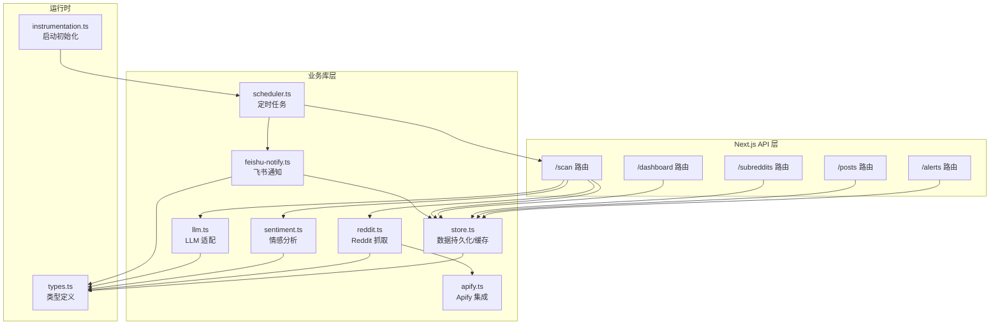
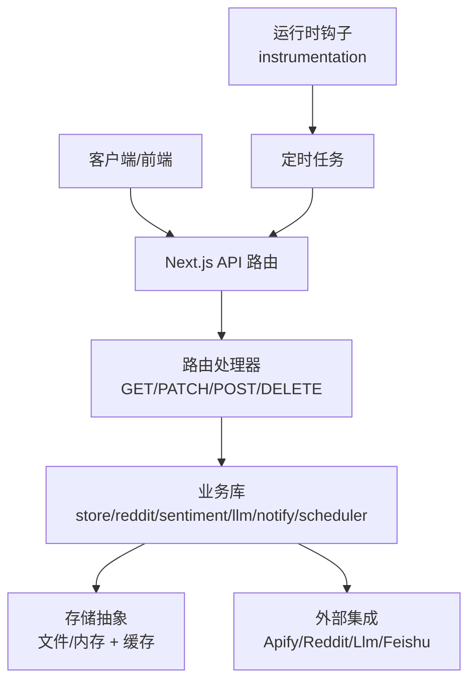
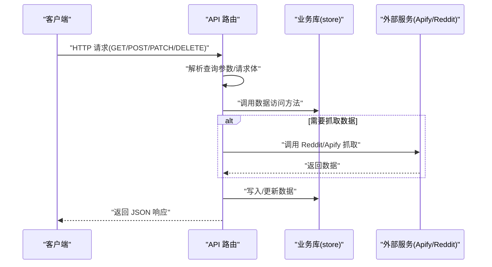
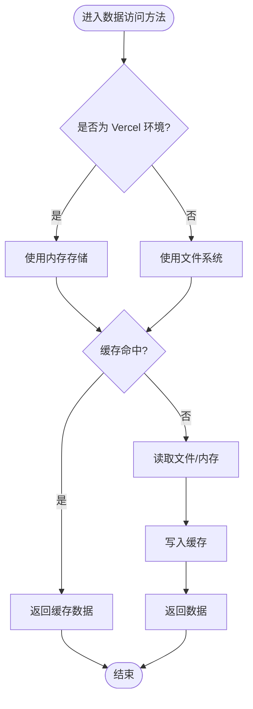
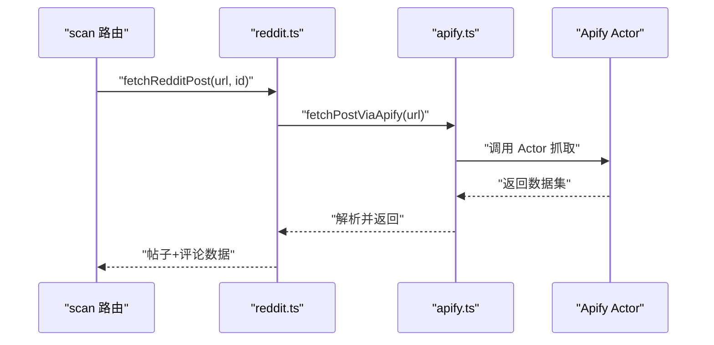
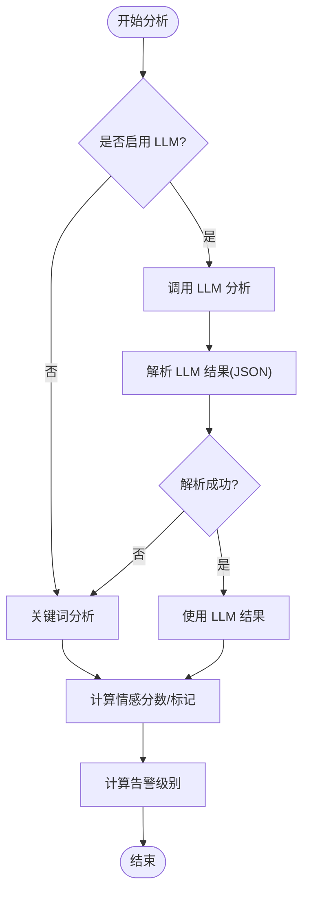
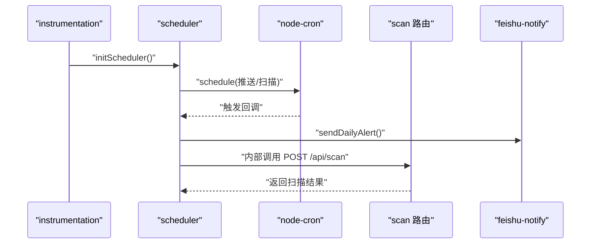
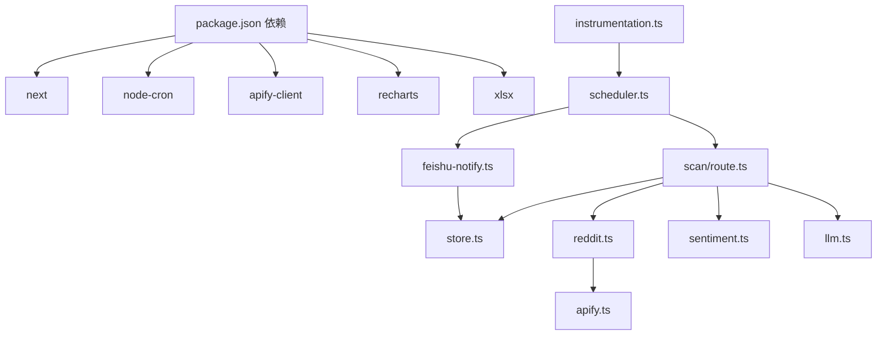

# 后端架构

<cite>
**本文引用的文件**
- [src/app/api/alerts/route.ts](file://src/app/api/alerts/route.ts)
- [src/app/api/posts/route.ts](file://src/app/api/posts/route.ts)
- [src/app/api/subreddits/route.ts](file://src/app/api/subreddits/route.ts)
- [src/app/api/dashboard/route.ts](file://src/app/api/dashboard/route.ts)
- [src/app/api/scan/route.ts](file://src/app/api/scan/route.ts)
- [src/lib/store.ts](file://src/lib/store.ts)
- [src/lib/reddit.ts](file://src/lib/reddit.ts)
- [src/lib/apify.ts](file://src/lib/apify.ts)
- [src/lib/sentiment.ts](file://src/lib/sentiment.ts)
- [src/lib/llm.ts](file://src/lib/llm.ts)
- [src/lib/feishu-notify.ts](file://src/lib/feishu-notify.ts)
- [src/lib/scheduler.ts](file://src/lib/scheduler.ts)
- [src/instrumentation.ts](file://src/instrumentation.ts)
- [src/lib/types.ts](file://src/lib/types.ts)
- [package.json](file://package.json)
</cite>

## 目录
1. [引言](#引言)
2. [项目结构](#项目结构)
3. [核心组件](#核心组件)
4. [架构总览](#架构总览)
5. [详细组件分析](#详细组件分析)
6. [依赖关系分析](#依赖关系分析)
7. [性能考虑](#性能考虑)
8. [故障排查指南](#故障排查指南)
9. [结论](#结论)
10. [附录](#附录)

## 引言
本文件面向 Reddit 监控系统的后端架构，聚焦于基于 Next.js API 路由的设计与实现，覆盖路由处理器、中间件与请求处理流程；数据访问层与存储抽象；API 设计原则与错误处理；业务逻辑层的职责分离、服务封装与依赖注入模式；安全策略、认证授权与数据验证；性能优化、缓存与并发控制；以及日志记录、监控指标与调试工具的使用。

## 项目结构
后端采用 Next.js App Router 的 API 路由组织方式，按功能域划分路由目录，结合独立的业务模块库（lib）实现清晰的分层与职责分离。核心目录与文件如下：
- API 路由：位于 src/app/api 下，按领域拆分（alerts、posts、subreddits、dashboard、scan 等）
- 业务库：位于 src/lib，包含数据存储、Reddit 抓取、情感分析、LLM 适配、飞书通知、调度器等
- 运行时钩子：src/instrumentation.ts 在服务启动时初始化定时任务
- 类型定义：src/lib/types.ts 统一定义数据模型与配置项

**图表来源**
- [src/app/api/alerts/route.ts:1-62](file://src/app/api/alerts/route.ts#L1-L62)
- [src/app/api/posts/route.ts:1-157](file://src/app/api/posts/route.ts#L1-L157)
- [src/app/api/subreddits/route.ts:1-14](file://src/app/api/subreddits/route.ts#L1-L14)
- [src/app/api/dashboard/route.ts:1-108](file://src/app/api/dashboard/route.ts#L1-L108)
- [src/app/api/scan/route.ts:1-394](file://src/app/api/scan/route.ts#L1-L394)
- [src/lib/store.ts:1-285](file://src/lib/store.ts#L1-L285)
- [src/lib/reddit.ts:1-94](file://src/lib/reddit.ts#L1-L94)
- [src/lib/apify.ts:1-280](file://src/lib/apify.ts#L1-L280)
- [src/lib/sentiment.ts:1-398](file://src/lib/sentiment.ts#L1-L398)
- [src/lib/llm.ts:1-338](file://src/lib/llm.ts#L1-L338)
- [src/lib/feishu-notify.ts:1-482](file://src/lib/feishu-notify.ts#L1-L482)
- [src/lib/scheduler.ts:1-133](file://src/lib/scheduler.ts#L1-L133)
- [src/instrumentation.ts:1-12](file://src/instrumentation.ts#L1-L12)
- [src/lib/types.ts:1-194](file://src/lib/types.ts#L1-L194)

**章节来源**
- [src/app/api/alerts/route.ts:1-62](file://src/app/api/alerts/route.ts#L1-L62)
- [src/app/api/posts/route.ts:1-157](file://src/app/api/posts/route.ts#L1-L157)
- [src/app/api/subreddits/route.ts:1-14](file://src/app/api/subreddits/route.ts#L1-L14)
- [src/app/api/dashboard/route.ts:1-108](file://src/app/api/dashboard/route.ts#L1-L108)
- [src/app/api/scan/route.ts:1-394](file://src/app/api/scan/route.ts#L1-L394)
- [src/lib/store.ts:1-285](file://src/lib/store.ts#L1-L285)
- [src/lib/reddit.ts:1-94](file://src/lib/reddit.ts#L1-L94)
- [src/lib/apify.ts:1-280](file://src/lib/apify.ts#L1-L280)
- [src/lib/sentiment.ts:1-398](file://src/lib/sentiment.ts#L1-L398)
- [src/lib/llm.ts:1-338](file://src/lib/llm.ts#L1-L338)
- [src/lib/feishu-notify.ts:1-482](file://src/lib/feishu-notify.ts#L1-L482)
- [src/lib/scheduler.ts:1-133](file://src/lib/scheduler.ts#L1-L133)
- [src/instrumentation.ts:1-12](file://src/instrumentation.ts#L1-L12)
- [src/lib/types.ts:1-194](file://src/lib/types.ts#L1-L194)

## 核心组件
- API 路由层：提供 RESTful 端点，负责请求参数解析、校验、调用业务库并返回标准化响应
- 存储抽象层：统一的数据访问接口，支持本地文件与 Vercel 内存两种后端，内置缓存与失效机制
- 数据源集成：Reddit 抓取通过 Apify Actor 实现，支持单帖与板块抓取，具备内存缓存与限流
- 业务逻辑层：情感分析与告警级别计算、LLM 情感分析适配、飞书通知构建与发送、定时任务调度
- 运行时钩子：服务启动时初始化定时任务，确保每日推送与自动扫描

**章节来源**
- [src/app/api/alerts/route.ts:1-62](file://src/app/api/alerts/route.ts#L1-L62)
- [src/app/api/posts/route.ts:1-157](file://src/app/api/posts/route.ts#L1-L157)
- [src/app/api/subreddits/route.ts:1-14](file://src/app/api/subreddits/route.ts#L1-L14)
- [src/app/api/dashboard/route.ts:1-108](file://src/app/api/dashboard/route.ts#L1-L108)
- [src/app/api/scan/route.ts:1-394](file://src/app/api/scan/route.ts#L1-L394)
- [src/lib/store.ts:1-285](file://src/lib/store.ts#L1-L285)
- [src/lib/reddit.ts:1-94](file://src/lib/reddit.ts#L1-L94)
- [src/lib/apify.ts:1-280](file://src/lib/apify.ts#L1-L280)
- [src/lib/sentiment.ts:1-398](file://src/lib/sentiment.ts#L1-L398)
- [src/lib/llm.ts:1-338](file://src/lib/llm.ts#L1-L338)
- [src/lib/feishu-notify.ts:1-482](file://src/lib/feishu-notify.ts#L1-L482)
- [src/lib/scheduler.ts:1-133](file://src/lib/scheduler.ts#L1-L133)
- [src/instrumentation.ts:1-12](file://src/instrumentation.ts#L1-L12)

## 架构总览
系统采用“API 路由 + 业务库”的分层架构，API 路由作为入口，不直接处理复杂业务，而是委托给业务库；业务库内部组合多个子模块（存储、抓取、分析、通知、调度），形成清晰的职责边界。数据持久化在本地开发与生产环境（Vercel）采用不同实现，但对外暴露一致的接口。

**图表来源**
- [src/app/api/scan/route.ts:1-394](file://src/app/api/scan/route.ts#L1-L394)
- [src/lib/store.ts:1-285](file://src/lib/store.ts#L1-L285)
- [src/lib/reddit.ts:1-94](file://src/lib/reddit.ts#L1-L94)
- [src/lib/apify.ts:1-280](file://src/lib/apify.ts#L1-L280)
- [src/lib/sentiment.ts:1-398](file://src/lib/sentiment.ts#L1-L398)
- [src/lib/llm.ts:1-338](file://src/lib/llm.ts#L1-L338)
- [src/lib/feishu-notify.ts:1-482](file://src/lib/feishu-notify.ts#L1-L482)
- [src/lib/scheduler.ts:1-133](file://src/lib/scheduler.ts#L1-L133)
- [src/instrumentation.ts:1-12](file://src/instrumentation.ts#L1-L12)

## 详细组件分析

### API 路由与请求处理流程
- 路由处理器：每个 API 文件导出一个或多个 HTTP 方法处理器，统一使用 NextResponse 返回 JSON 响应
- 请求参数：通过 URL 查询参数或请求体解析，进行基本校验与过滤
- 错误处理：捕获异常并返回标准化错误响应，HTTP 状态码语义化
- 并发控制：扫描流程中通过全局状态与停止标志实现单实例运行与中断能力

**图表来源**
- [src/app/api/alerts/route.ts:1-62](file://src/app/api/alerts/route.ts#L1-L62)
- [src/app/api/posts/route.ts:1-157](file://src/app/api/posts/route.ts#L1-L157)
- [src/app/api/scan/route.ts:1-394](file://src/app/api/scan/route.ts#L1-L394)
- [src/lib/store.ts:1-285](file://src/lib/store.ts#L1-L285)
- [src/lib/reddit.ts:1-94](file://src/lib/reddit.ts#L1-L94)
- [src/lib/apify.ts:1-280](file://src/lib/apify.ts#L1-L280)

**章节来源**
- [src/app/api/alerts/route.ts:1-62](file://src/app/api/alerts/route.ts#L1-L62)
- [src/app/api/posts/route.ts:1-157](file://src/app/api/posts/route.ts#L1-L157)
- [src/app/api/subreddits/route.ts:1-14](file://src/app/api/subreddits/route.ts#L1-L14)
- [src/app/api/dashboard/route.ts:1-108](file://src/app/api/dashboard/route.ts#L1-L108)
- [src/app/api/scan/route.ts:1-394](file://src/app/api/scan/route.ts#L1-L394)

### 数据访问层与存储抽象
- 本地开发：文件系统持久化，数据目录位于 data/ 下，包含 posts、comments、scans、config、reports 等 JSON 文件
- 生产环境（Vercel）：内存存储 + 环境变量覆盖，避免读写只读文件系统
- 缓存机制：内存缓存 + TTL，减少频繁读取大文件带来的性能损耗
- 一致性：写入后主动失效缓存，保证读取一致性

**图表来源**
- [src/lib/store.ts:1-285](file://src/lib/store.ts#L1-L285)

**章节来源**
- [src/lib/store.ts:1-285](file://src/lib/store.ts#L1-L285)

### 数据源集成与抓取流程
- 单帖抓取：通过 Apify 的 neatrat/reddit-scraper Actor，按 URL 精确抓取帖子与评论，Actor 自带住宅代理
- 板块抓取：通过 spry_wholemeal/reddit-scraper Actor，使用 RESIDENTIAL 代理，限制每页数量
- 限流与缓存：全局最小请求间隔与内存缓存，提升稳定性与性能
- 数据转换：统一映射为内部类型，提取嵌套评论树

**图表来源**
- [src/app/api/scan/route.ts:1-394](file://src/app/api/scan/route.ts#L1-L394)
- [src/lib/reddit.ts:1-94](file://src/lib/reddit.ts#L1-L94)
- [src/lib/apify.ts:1-280](file://src/lib/apify.ts#L1-L280)

**章节来源**
- [src/lib/reddit.ts:1-94](file://src/lib/reddit.ts#L1-L94)
- [src/lib/apify.ts:1-280](file://src/lib/apify.ts#L1-L280)

### 业务逻辑层：情感分析与告警规则
- 关键词驱动的情感分析：基于预置关键词类别与强度修正，结合点赞数权重，输出情感分数与标记
- 告警级别计算：综合恶意评论影响力得分与规则触发，生成三级告警（严重/中等/安全）
- LLM 情感分析：统一适配多家 LLM 提供商，支持 OpenAI、Anthropic、Google、DeepSeek、智谱、月之暗面、通义千问、豆包、Ollama、Custom
- 回退机制：LLM 失败时回退到关键词分析，保证稳定性

**图表来源**
- [src/app/api/scan/route.ts:1-394](file://src/app/api/scan/route.ts#L1-L394)
- [src/lib/sentiment.ts:1-398](file://src/lib/sentiment.ts#L1-L398)
- [src/lib/llm.ts:1-338](file://src/lib/llm.ts#L1-L338)

**章节来源**
- [src/lib/sentiment.ts:1-398](file://src/lib/sentiment.ts#L1-L398)
- [src/lib/llm.ts:1-338](file://src/lib/llm.ts#L1-L338)
- [src/app/api/scan/route.ts:1-394](file://src/app/api/scan/route.ts#L1-L394)

### 通知与调度：飞书推送与定时任务
- 飞书通知：支持 Webhook 与应用消息两种模式，构建富文本卡片，包含健康度评分、情感分布、风险类别、严重帖子清单等
- 定时任务：基于 node-cron，在服务启动时初始化，支持每日推送与午夜自动扫描
- 运行时钩子：instrumentation.ts 在 Node 运行时注册，确保仅在首个实例初始化调度器

**图表来源**
- [src/instrumentation.ts:1-12](file://src/instrumentation.ts#L1-L12)
- [src/lib/scheduler.ts:1-133](file://src/lib/scheduler.ts#L1-L133)
- [src/app/api/scan/route.ts:1-394](file://src/app/api/scan/route.ts#L1-L394)
- [src/lib/feishu-notify.ts:1-482](file://src/lib/feishu-notify.ts#L1-L482)

**章节来源**
- [src/lib/feishu-notify.ts:1-482](file://src/lib/feishu-notify.ts#L1-L482)
- [src/lib/scheduler.ts:1-133](file://src/lib/scheduler.ts#L1-L133)
- [src/instrumentation.ts:1-12](file://src/instrumentation.ts#L1-L12)

### API 设计原则与错误处理
- RESTful 端点：每个领域一个路由文件，按资源命名（posts、subreddits、dashboard、alerts、scan 等）
- 统一响应：使用 NextResponse.json 返回标准结构，错误时包含错误信息与合适的状态码
- 参数校验：在路由层进行必要校验（如 PATCH 更新告警状态时的必填字段）
- 降级策略：当存储为空时使用 mock 数据，保证前端可用性

**章节来源**
- [src/app/api/alerts/route.ts:1-62](file://src/app/api/alerts/route.ts#L1-L62)
- [src/app/api/posts/route.ts:1-157](file://src/app/api/posts/route.ts#L1-L157)
- [src/app/api/dashboard/route.ts:1-108](file://src/app/api/dashboard/route.ts#L1-L108)
- [src/app/api/scan/route.ts:1-394](file://src/app/api/scan/route.ts#L1-L394)

### 安全策略、认证授权与数据验证
- 认证授权：飞书应用消息模式通过内部 Token 接口获取 tenant_access_token，随后向 IM 发送消息；Webhook 模式通过配置的 URL 发送卡片
- 数据验证：路由层对必填字段进行校验；Apify 调用对返回数据进行健壮性检查；LLM 返回结果进行 JSON 解析与格式校验
- 环境变量：Vercel 环境下通过环境变量覆盖配置（如飞书 Webhook、LLM 凭证、隧道地址）

**章节来源**
- [src/lib/feishu-notify.ts:1-482](file://src/lib/feishu-notify.ts#L1-L482)
- [src/lib/apify.ts:1-280](file://src/lib/apify.ts#L1-L280)
- [src/lib/llm.ts:1-338](file://src/lib/llm.ts#L1-L338)
- [src/lib/store.ts:235-269](file://src/lib/store.ts#L235-L269)

## 依赖关系分析
- 运行时依赖：Next.js、node-cron、apify-client、recharts、xlsx 等
- 业务依赖：API 路由依赖业务库；业务库之间通过类型定义与配置耦合；外部依赖通过适配器模式隔离

**图表来源**
- [package.json:1-38](file://package.json#L1-L38)
- [src/app/api/scan/route.ts:1-394](file://src/app/api/scan/route.ts#L1-L394)
- [src/lib/store.ts:1-285](file://src/lib/store.ts#L1-L285)
- [src/lib/reddit.ts:1-94](file://src/lib/reddit.ts#L1-L94)
- [src/lib/apify.ts:1-280](file://src/lib/apify.ts#L1-L280)
- [src/lib/sentiment.ts:1-398](file://src/lib/sentiment.ts#L1-L398)
- [src/lib/llm.ts:1-338](file://src/lib/llm.ts#L1-L338)
- [src/lib/feishu-notify.ts:1-482](file://src/lib/feishu-notify.ts#L1-L482)
- [src/lib/scheduler.ts:1-133](file://src/lib/scheduler.ts#L1-L133)
- [src/instrumentation.ts:1-12](file://src/instrumentation.ts#L1-L12)

**章节来源**
- [package.json:1-38](file://package.json#L1-L38)

## 性能考虑
- 缓存策略：存储层引入 30 秒 TTL 内存缓存，显著降低频繁读取大文件的成本
- 抓取限流：Apify 调用设置最小请求间隔与内存缓存，避免触发外部限流
- 扫描优化：扫描流程中对老帖子与延迟扫描进行智能跳过，减少代理流量消耗
- 并发控制：扫描进度与停止标志保证单实例运行，避免重复扫描
- 前端降级：当存储为空时使用 mock 数据，保障前端体验

**章节来源**
- [src/lib/store.ts:71-87](file://src/lib/store.ts#L71-L87)
- [src/lib/apify.ts:37-50](file://src/lib/apify.ts#L37-L50)
- [src/app/api/scan/route.ts:50-102](file://src/app/api/scan/route.ts#L50-L102)

## 故障排查指南
- Apify 配置：确认 APIFY_TOKEN 是否配置，Actor 调用是否返回数据
- LLM 连接：使用测试接口验证提供商凭据与网络连通性
- 飞书通知：检查 Webhook 地址或应用凭证配置，查看返回错误信息
- 扫描中断：通过 DELETE /api/scan 触发停止标志，观察扫描进度状态
- 日志定位：关注控制台输出（如 Apify 调用、LLM 超时、缓存命中等）

**章节来源**
- [src/lib/apify.ts:54-66](file://src/lib/apify.ts#L54-L66)
- [src/lib/llm.ts:309-337](file://src/lib/llm.ts#L309-L337)
- [src/lib/feishu-notify.ts:439-481](file://src/lib/feishu-notify.ts#L439-L481)
- [src/app/api/scan/route.ts:385-393](file://src/app/api/scan/route.ts#L385-L393)

## 结论
该后端架构以 Next.js API 路由为核心入口，结合独立的业务库模块，实现了清晰的职责分离与良好的扩展性。通过统一的存储抽象、外部集成适配器与定时任务机制，系统在本地开发与生产部署（Vercel）间保持一致行为。情感分析与告警规则、飞书通知与调度器进一步完善了监控闭环。建议持续优化缓存策略与外部依赖的可观测性，增强错误恢复与重试机制。

## 附录
- 类型定义：涵盖告警级别、状态、Reddit 帖子与评论、扫描结果、每日报告、飞书配置、LLM 配置、检测规则等
- 环境变量：Vercel 环境下的配置覆盖（飞书 Webhook、LLM 凭证、隧道地址等）

**章节来源**
- [src/lib/types.ts:1-194](file://src/lib/types.ts#L1-L194)
- [src/lib/store.ts:235-269](file://src/lib/store.ts#L235-L269)