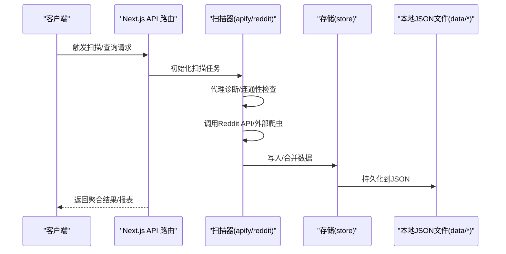
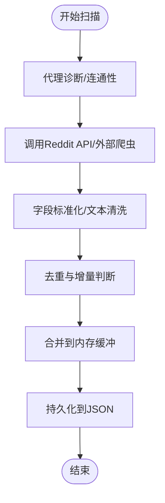
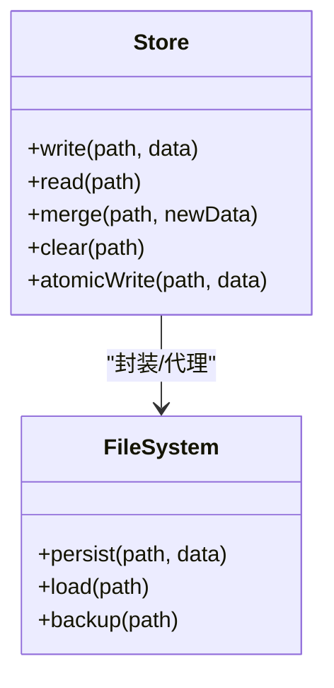
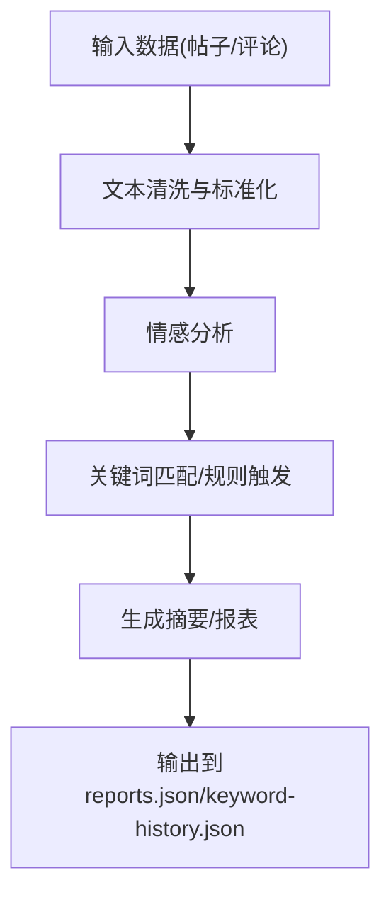
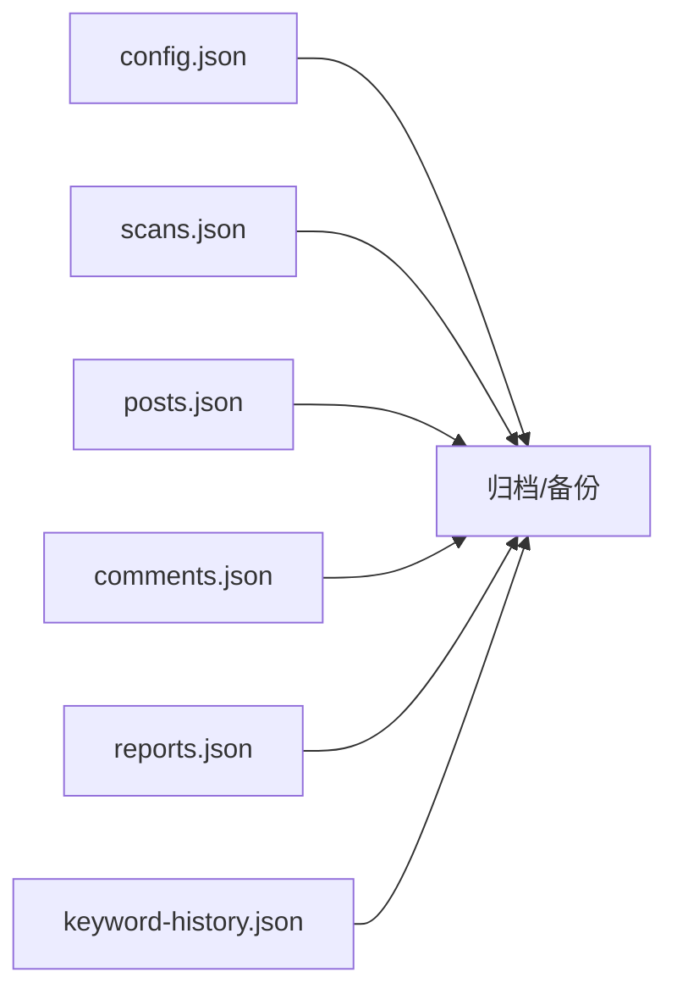
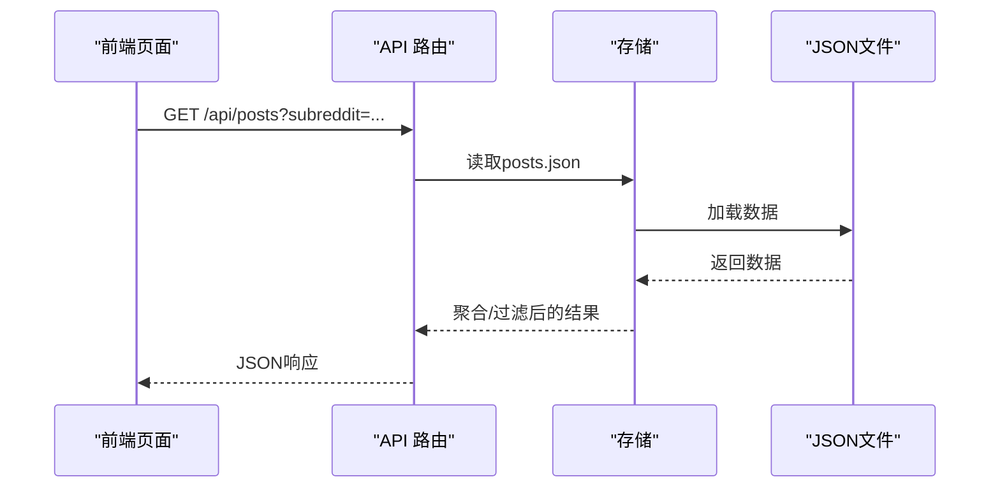
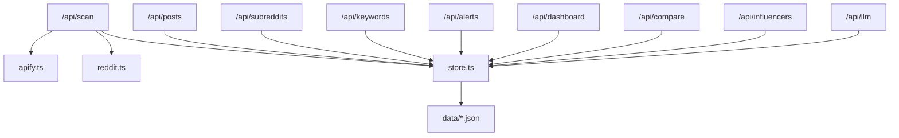

# 数据流设计

<cite>
**本文引用的文件**
- [README.md](file://README.md)
- [src/lib/apify.ts](file://src/lib/apify.ts)
- [src/lib/reddit.ts](file://src/lib/reddit.ts)
- [src/app/api/scan/route.ts](file://src/app/api/scan/route.ts)
- [src/app/api/posts/route.ts](file://src/app/api/posts/route.ts)
- [src/app/api/subreddits/route.ts](file://src/app/api/subreddits/route.ts)
- [src/app/api/keywords/route.ts](file://src/app/api/keywords/route.ts)
- [src/app/api/alerts/route.ts](file://src/app/api/alerts/route.ts)
- [src/app/api/dashboard/route.ts](file://src/app/api/dashboard/route.ts)
- [src/app/api/compare/route.ts](file://src/app/api/compare/route.ts)
- [src/app/api/influencers/route.ts](file://src/app/api/influencers/route.ts)
- [src/app/api/detection-rules/route.ts](file://src/app/api/detection-rules/route.ts)
- [src/app/api/llm/route.ts](file://src/app/api/llm/route.ts)
- [src/app/api/import/route.ts](file://src/app/api/import/route.ts)
- [src/app/api/proxy-diag/route.ts](file://src/app/api/proxy-diag/route.ts)
- [src/app/api/connectivity/route.ts](file://src/app/api/connectivity/route.ts)
- [data/config.json](file://data/config.json)
- [data/scans.json](file://data/scans.json)
- [data/posts.json](file://data/posts.json)
- [data/comments.json](file://data/comments.json)
- [data/reports.json](file://data/reports.json)
- [data/keyword-history.json](file://data/keyword-history.json)
- [src/lib/scheduler.ts](file://src/lib/scheduler.ts)
- [src/lib/store.ts](file://src/lib/store.ts)
- [src/lib/types.ts](file://src/lib/types.ts)
- [src/lib/summary.ts](file://src/lib/summary.ts)
- [src/lib/sentiment.ts](file://src/lib/sentiment.ts)
- [src/lib/mock-data.ts](file://src/lib/mock-data.ts)
- [src/app/api/feishu/route.ts](file://src/app/api/feishu/route.ts)
- [src/app/api/feishu-auth/callback/route.ts](file://src/app/api/feishu-auth/callback/route.ts)
- [src/app/api/feishu-auth/external/route.ts](file://src/app/api/feishu-auth/external/route.ts)
- [src/app/api/feishu-auth/revoke/route.ts](file://src/app/api/feishu-auth/revoke/route.ts)
- [src/app/api/feishu-auth/status/route.ts](file://src/app/api/feishu-auth/status/route.ts)
- [src/lib/feishu-auth.ts](file://src/lib/feishu-auth.ts)
- [src/lib/feishu.ts](file://src/lib/feishu.ts)
- [src/lib/feishu-notify.ts](file://src/lib/feishu-notify.ts)
- [src/app/api/notify/route.ts](file://src/app/api/notify/route.ts)
- [src/app/api/scan-schedule/route.ts](file://src/app/api/scan-schedule/route.ts)
- [src/app/api/subreddit-detail/route.ts](file://src/app/api/subreddit-detail/route.ts)
- [src/app/api/url/route.ts](file://src/app/api/url/route.ts)
</cite>

## 目录
1. [简介](#简介)
2. [项目结构](#项目结构)
3. [核心组件](#核心组件)
4. [架构总览](#架构总览)
5. [详细组件分析](#详细组件分析)
6. [依赖关系分析](#依赖关系分析)
7. [性能考虑](#性能考虑)
8. [故障排查指南](#故障排查指南)
9. [结论](#结论)
10. [附录](#附录)

## 简介
本文件面向 Reddit 监控系统的数据流设计，系统通过定时扫描与 API 调用获取 Reddit 数据，经过清洗、标准化、分析与聚合后，存储于本地 JSON 文件，并通过 Next.js API 路由对外提供查询与可视化接口。数据流覆盖爬取、处理、分析、存储与展示五个阶段；同时涵盖缓存策略、增量更新、批量处理、一致性与事务保障、错误恢复、数据迁移与归档、安全与隐私保护等主题。

## 项目结构
系统采用前后端一体化的 Next.js 应用，核心数据逻辑集中在 src/lib 下，API 路由位于 src/app/api 下，静态数据位于 data 目录。整体结构如下：

```mermaid
graph TB
subgraph "前端页面"
UI_Dashboard["仪表盘页面"]
UI_Posts["帖子页面"]
UI_Compare["对比页面"]
UI_Influencers["影响者页面"]
UI_Keywords["关键词页面"]
UI_Alerts["告警页面"]
end
subgraph "API 路由层"
API_Scan["/api/scan"]
API_Posts["/api/posts"]
API_Subreddits["/api/subreddits"]
API_Keywords["/api/keywords"]
API_Alerts["/api/alerts"]
API_Dashboard["/api/dashboard"]
API_Compare["/api/compare"]
API_Influencers["/api/influencers"]
API_LLM["/api/llm"]
API_Import["/api/import"]
API_Feishu["/api/feishu"]
API_FeishuAuth["/api/feishu-auth/*"]
API_ProxyDiag["/api/proxy-diag"]
API_Connectivity["/api/connectivity"]
API_ScanSchedule["/api/scan-schedule"]
API_SubredditDetail["/api/subreddit-detail"]
API_URL["/api/url"]
end
subgraph "业务库"
Lib_Apify["apify.ts"]
Lib_Redit["reddit.ts"]
Lib_Scheduler["scheduler.ts"]
Lib_Store["store.ts"]
Lib_Types["types.ts"]
Lib_Summary["summary.ts"]
Lib_Sentiment["sentiment.ts"]
Lib_Mock["mock-data.ts"]
Lib_FeishuAuth["feishu-auth.ts"]
Lib_Feishu["feishu.ts"]
Lib_FeishuNotify["feishu-notify.ts"]
end
subgraph "数据存储"
Data_Config["data/config.json"]
Data_Scans["data/scans.json"]
Data_Posts["data/posts.json"]
Data_Comments["data/comments.json"]
Data_Reports["data/reports.json"]
Data_History["data/keyword-history.json"]
end
UI_Dashboard --> API_Dashboard
UI_Posts --> API_Posts
UI_Compare --> API_Compare
UI_Influencers --> API_Influencers
UI_Keywords --> API_Keywords
UI_Alerts --> API_Alerts
API_Scan --> Lib_Apify
API_Scan --> Lib_Redit
API_Scan --> Lib_Scheduler
API_Scan --> Lib_Store
API_Posts --> Lib_Store
API_Subreddits --> Lib_Store
API_Keywords --> Lib_Store
API_Alerts --> Lib_Store
API_Dashboard --> Lib_Store
API_Compare --> Lib_Store
API_Influencers --> Lib_Store
API_LLM --> Lib_Store
API_Import --> Lib_Store
API_Feishu --> Lib_Feishu
API_FeishuAuth --> Lib_FeishuAuth
API_FeishuAuth --> Lib_Feishu
API_FeishuAuth --> Lib_FeishuNotify
API_ProxyDiag --> Lib_Redit
API_Connectivity --> Lib_Redit
API_ScanSchedule --> Lib_Scheduler
API_SubredditDetail --> Lib_Store
API_URL --> Lib_Store
Lib_Store --> Data_Config
Lib_Store --> Data_Scans
Lib_Store --> Data_Posts
Lib_Store --> Data_Comments
Lib_Store --> Data_Reports
Lib_Store --> Data_History
```

图表来源
- [src/app/api/scan/route.ts](file://src/app/api/scan/route.ts)
- [src/app/api/posts/route.ts](file://src/app/api/posts/route.ts)
- [src/app/api/subreddits/route.ts](file://src/app/api/subreddits/route.ts)
- [src/app/api/keywords/route.ts](file://src/app/api/keywords/route.ts)
- [src/app/api/alerts/route.ts](file://src/app/api/alerts/route.ts)
- [src/app/api/dashboard/route.ts](file://src/app/api/dashboard/route.ts)
- [src/app/api/compare/route.ts](file://src/app/api/compare/route.ts)
- [src/app/api/influencers/route.ts](file://src/app/api/influencers/route.ts)
- [src/app/api/llm/route.ts](file://src/app/api/llm/route.ts)
- [src/app/api/import/route.ts](file://src/app/api/import/route.ts)
- [src/app/api/feishu/route.ts](file://src/app/api/feishu/route.ts)
- [src/app/api/feishu-auth/callback/route.ts](file://src/app/api/feishu-auth/callback/route.ts)
- [src/app/api/feishu-auth/external/route.ts](file://src/app/api/feishu-auth/external/route.ts)
- [src/app/api/feishu-auth/revoke/route.ts](file://src/app/api/feishu-auth/revoke/route.ts)
- [src/app/api/feishu-auth/status/route.ts](file://src/app/api/feishu-auth/status/route.ts)
- [src/app/api/proxy-diag/route.ts](file://src/app/api/proxy-diag/route.ts)
- [src/app/api/connectivity/route.ts](file://src/app/api/connectivity/route.ts)
- [src/app/api/scan-schedule/route.ts](file://src/app/api/scan-schedule/route.ts)
- [src/app/api/subreddit-detail/route.ts](file://src/app/api/subreddit-detail/route.ts)
- [src/app/api/url/route.ts](file://src/app/api/url/route.ts)
- [src/lib/apify.ts](file://src/lib/apify.ts)
- [src/lib/reddit.ts](file://src/lib/reddit.ts)
- [src/lib/scheduler.ts](file://src/lib/scheduler.ts)
- [src/lib/store.ts](file://src/lib/store.ts)
- [src/lib/types.ts](file://src/lib/types.ts)
- [src/lib/summary.ts](file://src/lib/summary.ts)
- [src/lib/sentiment.ts](file://src/lib/sentiment.ts)
- [src/lib/mock-data.ts](file://src/lib/mock-data.ts)
- [src/lib/feishu-auth.ts](file://src/lib/feishu-auth.ts)
- [src/lib/feishu.ts](file://src/lib/feishu.ts)
- [src/lib/feishu-notify.ts](file://src/lib/feishu-notify.ts)
- [data/config.json](file://data/config.json)
- [data/scans.json](file://data/scans.json)
- [data/posts.json](file://data/posts.json)
- [data/comments.json](file://data/comments.json)
- [data/reports.json](file://data/reports.json)
- [data/keyword-history.json](file://data/keyword-history.json)

章节来源
- [README.md](file://README.md)
- [src/lib/apify.ts](file://src/lib/apify.ts)
- [src/lib/reddit.ts](file://src/lib/reddit.ts)
- [src/lib/store.ts](file://src/lib/store.ts)
- [data/config.json](file://data/config.json)
- [data/scans.json](file://data/scans.json)
- [data/posts.json](file://data/posts.json)
- [data/comments.json](file://data/comments.json)
- [data/reports.json](file://data/reports.json)
- [data/keyword-history.json](file://data/keyword-history.json)

## 核心组件
- 数据源与采集层
  - Apify 集成：负责调用外部爬虫或代理服务以抓取 Reddit 数据，支持代理诊断与连通性检测。
  - Reddit API 封装：封装对 Reddit 接口的调用，包含速率限制、重试与错误处理。
- 处理与分析层
  - 存储与缓存：统一管理本地 JSON 文件，提供写入、读取、合并与增量更新能力。
  - 摘要与情感分析：生成聚合报告与情感指标，供仪表盘与对比视图使用。
  - 关键词与规则：维护关键词历史与检测规则，支持增量扫描与告警触发。
- 展示与接口层
  - Next.js API 路由：按功能拆分路由，分别提供扫描、帖子、子版块、关键词、告警、仪表盘、对比、影响者、LLM、导入、飞书集成、代理诊断、连通性、扫描计划、子版块详情、URL 等接口。
  - 前端页面：与各 API 路由对接，实现数据可视化与交互。

章节来源
- [src/lib/apify.ts](file://src/lib/apify.ts)
- [src/lib/reddit.ts](file://src/lib/reddit.ts)
- [src/lib/store.ts](file://src/lib/store.ts)
- [src/lib/summary.ts](file://src/lib/summary.ts)
- [src/lib/sentiment.ts](file://src/lib/sentiment.ts)
- [src/app/api/scan/route.ts](file://src/app/api/scan/route.ts)
- [src/app/api/posts/route.ts](file://src/app/api/posts/route.ts)
- [src/app/api/subreddits/route.ts](file://src/app/api/subreddits/route.ts)
- [src/app/api/keywords/route.ts](file://src/app/api/keywords/route.ts)
- [src/app/api/alerts/route.ts](file://src/app/api/alerts/route.ts)
- [src/app/api/dashboard/route.ts](file://src/app/api/dashboard/route.ts)
- [src/app/api/compare/route.ts](file://src/app/api/compare/route.ts)
- [src/app/api/influencers/route.ts](file://src/app/api/influencers/route.ts)
- [src/app/api/llm/route.ts](file://src/app/api/llm/route.ts)
- [src/app/api/import/route.ts](file://src/app/api/import/route.ts)
- [src/app/api/proxy-diag/route.ts](file://src/app/api/proxy-diag/route.ts)
- [src/app/api/connectivity/route.ts](file://src/app/api/connectivity/route.ts)
- [src/app/api/scan-schedule/route.ts](file://src/app/api/scan-schedule/route.ts)
- [src/app/api/subreddit-detail/route.ts](file://src/app/api/subreddit-detail/route.ts)
- [src/app/api/url/route.ts](file://src/app/api/url/route.ts)

## 架构总览
下图展示了从 Reddit API 到最终展示的完整数据流，包括爬取、处理、分析与存储阶段，以及关键的缓存与增量更新策略。

图表来源
- [src/app/api/scan/route.ts](file://src/app/api/scan/route.ts)
- [src/lib/apify.ts](file://src/lib/apify.ts)
- [src/lib/reddit.ts](file://src/lib/reddit.ts)
- [src/lib/store.ts](file://src/lib/store.ts)
- [data/scans.json](file://data/scans.json)
- [data/posts.json](file://data/posts.json)
- [data/comments.json](file://data/comments.json)
- [data/reports.json](file://data/reports.json)

## 详细组件分析

### 爬取阶段（Apify 与 Reddit）
- 功能职责
  - 代理诊断与连通性检测，确保网络稳定性。
  - 调用 Reddit API 或外部爬虫，获取帖子、评论、子版块信息。
  - 支持重试与错误处理，避免单点失败导致任务中断。
- 数据转换与标准化
  - 统一字段命名与类型，如时间戳、评分、作者、内容摘要等。
  - 对文本进行清洗与编码规范化，便于后续分析。
- 增量更新
  - 依据时间窗口与 ID 去重，仅抓取新增或变更项。
- 缓存策略
  - 临时缓存近期抓取结果，减少重复请求。
- 错误恢复
  - 失败重试与降级策略，必要时回退到 Mock 数据。

图表来源
- [src/lib/apify.ts](file://src/lib/apify.ts)
- [src/lib/reddit.ts](file://src/lib/reddit.ts)
- [src/lib/store.ts](file://src/lib/store.ts)
- [data/scans.json](file://data/scans.json)

章节来源
- [src/lib/apify.ts](file://src/lib/apify.ts)
- [src/lib/reddit.ts](file://src/lib/reddit.ts)

### 处理阶段（存储与缓存）
- 统一存储接口
  - 提供写入、读取、合并、清空等操作，屏蔽底层文件系统差异。
  - 支持并发安全与原子写入，降低竞态风险。
- 增量更新与批处理
  - 批量写入减少磁盘 IO；增量更新基于时间戳与唯一标识。
- 数据一致性
  - 通过锁或顺序写入保证多实例或多线程下的数据一致。
- 错误恢复
  - 失败回滚与日志记录，便于人工干预与重放。

图表来源
- [src/lib/store.ts](file://src/lib/store.ts)
- [data/config.json](file://data/config.json)
- [data/scans.json](file://data/scans.json)
- [data/posts.json](file://data/posts.json)
- [data/comments.json](file://data/comments.json)
- [data/reports.json](file://data/reports.json)
- [data/keyword-history.json](file://data/keyword-history.json)

章节来源
- [src/lib/store.ts](file://src/lib/store.ts)

### 分析阶段（摘要、情感与规则）
- 摘要生成
  - 基于时间窗口与维度聚合，生成报表与趋势。
- 情感分析
  - 对文本进行情感打分，辅助判断舆论倾向。
- 关键词与规则
  - 维护关键词历史与检测规则，支持告警触发与对比分析。
- LLM 集成
  - 可选的高级分析能力，用于复杂场景的深度洞察。

图表来源
- [src/lib/summary.ts](file://src/lib/summary.ts)
- [src/lib/sentiment.ts](file://src/lib/sentiment.ts)
- [src/app/api/llm/route.ts](file://src/app/api/llm/route.ts)
- [data/reports.json](file://data/reports.json)
- [data/keyword-history.json](file://data/keyword-history.json)

章节来源
- [src/lib/summary.ts](file://src/lib/summary.ts)
- [src/lib/sentiment.ts](file://src/lib/sentiment.ts)
- [src/app/api/llm/route.ts](file://src/app/api/llm/route.ts)

### 存储阶段（本地 JSON 与归档）
- 文件组织
  - config.json：系统配置与参数。
  - scans.json：扫描任务与状态。
  - posts.json：帖子主数据。
  - comments.json：评论数据。
  - reports.json：分析报表。
  - keyword-history.json：关键词历史与规则命中记录。
- 归档策略
  - 周期性压缩与备份，保留历史快照。
- 版本管理
  - 通过文件名后缀或目录层级区分版本，确保可回溯。

图表来源
- [data/config.json](file://data/config.json)
- [data/scans.json](file://data/scans.json)
- [data/posts.json](file://data/posts.json)
- [data/comments.json](file://data/comments.json)
- [data/reports.json](file://data/reports.json)
- [data/keyword-history.json](file://data/keyword-history.json)

章节来源
- [data/config.json](file://data/config.json)
- [data/scans.json](file://data/scans.json)
- [data/posts.json](file://data/posts.json)
- [data/comments.json](file://data/comments.json)
- [data/reports.json](file://data/reports.json)
- [data/keyword-history.json](file://data/keyword-history.json)

### 展示阶段（API 路由与前端）
- API 路由
  - scan：触发扫描与状态查询。
  - posts/subreddits/keywords/alerts/dashboard/compare/influencers：数据查询与聚合。
  - import：导入外部数据。
  - feishu/feishu-auth：飞书通知与认证。
  - proxy-diag/connectivity：网络诊断。
  - scan-schedule/subreddit-detail/url：调度与详情查询。
- 前端页面
  - 与各 API 路由对接，实现可视化与交互。

图表来源
- [src/app/api/posts/route.ts](file://src/app/api/posts/route.ts)
- [src/lib/store.ts](file://src/lib/store.ts)
- [data/posts.json](file://data/posts.json)

章节来源
- [src/app/api/posts/route.ts](file://src/app/api/posts/route.ts)
- [src/app/api/subreddits/route.ts](file://src/app/api/subreddits/route.ts)
- [src/app/api/keywords/route.ts](file://src/app/api/keywords/route.ts)
- [src/app/api/alerts/route.ts](file://src/app/api/alerts/route.ts)
- [src/app/api/dashboard/route.ts](file://src/app/api/dashboard/route.ts)
- [src/app/api/compare/route.ts](file://src/app/api/compare/route.ts)
- [src/app/api/influencers/route.ts](file://src/app/api/influencers/route.ts)
- [src/app/api/import/route.ts](file://src/app/api/import/route.ts)
- [src/app/api/feishu/route.ts](file://src/app/api/feishu/route.ts)
- [src/app/api/feishu-auth/callback/route.ts](file://src/app/api/feishu-auth/callback/route.ts)
- [src/app/api/feishu-auth/external/route.ts](file://src/app/api/feishu-auth/external/route.ts)
- [src/app/api/feishu-auth/revoke/route.ts](file://src/app/api/feishu-auth/revoke/route.ts)
- [src/app/api/feishu-auth/status/route.ts](file://src/app/api/feishu-auth/status/route.ts)
- [src/app/api/proxy-diag/route.ts](file://src/app/api/proxy-diag/route.ts)
- [src/app/api/connectivity/route.ts](file://src/app/api/connectivity/route.ts)
- [src/app/api/scan-schedule/route.ts](file://src/app/api/scan-schedule/route.ts)
- [src/app/api/subreddit-detail/route.ts](file://src/app/api/subreddit-detail/route.ts)
- [src/app/api/url/route.ts](file://src/app/api/url/route.ts)

## 依赖关系分析
- 组件耦合
  - API 路由依赖存储模块；存储模块依赖文件系统；分析模块依赖存储模块。
- 外部依赖
  - Reddit API、代理服务、飞书 API。
- 循环依赖
  - 当前结构未见循环依赖，模块职责清晰。

图表来源
- [src/app/api/scan/route.ts](file://src/app/api/scan/route.ts)
- [src/lib/apify.ts](file://src/lib/apify.ts)
- [src/lib/reddit.ts](file://src/lib/reddit.ts)
- [src/lib/store.ts](file://src/lib/store.ts)
- [src/app/api/posts/route.ts](file://src/app/api/posts/route.ts)
- [src/app/api/subreddits/route.ts](file://src/app/api/subreddits/route.ts)
- [src/app/api/keywords/route.ts](file://src/app/api/keywords/route.ts)
- [src/app/api/alerts/route.ts](file://src/app/api/alerts/route.ts)
- [src/app/api/dashboard/route.ts](file://src/app/api/dashboard/route.ts)
- [src/app/api/compare/route.ts](file://src/app/api/compare/route.ts)
- [src/app/api/influencers/route.ts](file://src/app/api/influencers/route.ts)
- [src/app/api/llm/route.ts](file://src/app/api/llm/route.ts)
- [data/posts.json](file://data/posts.json)
- [data/scans.json](file://data/scans.json)

章节来源
- [src/app/api/scan/route.ts](file://src/app/api/scan/route.ts)
- [src/lib/store.ts](file://src/lib/store.ts)

## 性能考虑
- 批量处理
  - 优先采用批量写入与批量查询，减少 IO 次数。
- 缓存策略
  - 近期热点数据驻留内存，降低重复解析成本。
- 并发与限流
  - 控制并发度与请求频率，避免触发 Reddit 限流。
- 增量更新
  - 基于时间戳与 ID 的增量扫描，显著降低数据量。
- 压缩与归档
  - 历史数据压缩与归档，释放存储空间。

## 故障排查指南
- 代理与连通性
  - 使用代理诊断与连通性接口检查网络状况。
- 日志与回滚
  - 记录失败原因与重试次数，必要时回滚到上一个稳定版本。
- Mock 数据
  - 在开发与测试环境启用 Mock 数据，快速定位问题。
- 权限与密钥
  - 检查飞书认证与 API 密钥配置，确保通知通道可用。

章节来源
- [src/app/api/proxy-diag/route.ts](file://src/app/api/proxy-diag/route.ts)
- [src/app/api/connectivity/route.ts](file://src/app/api/connectivity/route.ts)
- [src/lib/mock-data.ts](file://src/lib/mock-data.ts)
- [src/lib/feishu-auth.ts](file://src/lib/feishu-auth.ts)
- [src/lib/feishu.ts](file://src/lib/feishu.ts)

## 结论
该系统通过清晰的分层架构实现了从 Reddit 数据采集到最终展示的完整闭环。通过统一的存储接口、增量更新与批处理策略，兼顾了实时性与性能；通过摘要与情感分析，提升了数据价值；通过飞书通知与认证，增强了协作与安全性。建议在生产环境中进一步完善事务与一致性保障、自动化归档与版本管理，以及更细粒度的监控与告警。

## 附录
- 数据模型概览
  - config.json：系统配置
  - scans.json：扫描任务与状态
  - posts.json：帖子主数据
  - comments.json：评论数据
  - reports.json：分析报表
  - keyword-history.json：关键词历史与规则命中记录
- 安全与隐私
  - 飞书认证与回调路由用于权限验证与令牌管理。
  - 敏感信息应加密存储与传输，最小化暴露面。
- 迁移与版本管理
  - 采用文件版本后缀或目录层级区分版本，定期归档旧版本。
- 性能监控与瓶颈分析
  - 建议引入指标埋点与链路追踪，识别慢查询与高负载环节。