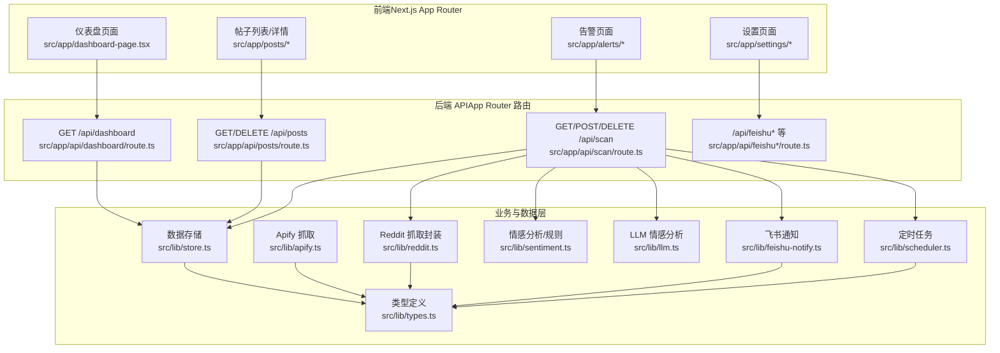
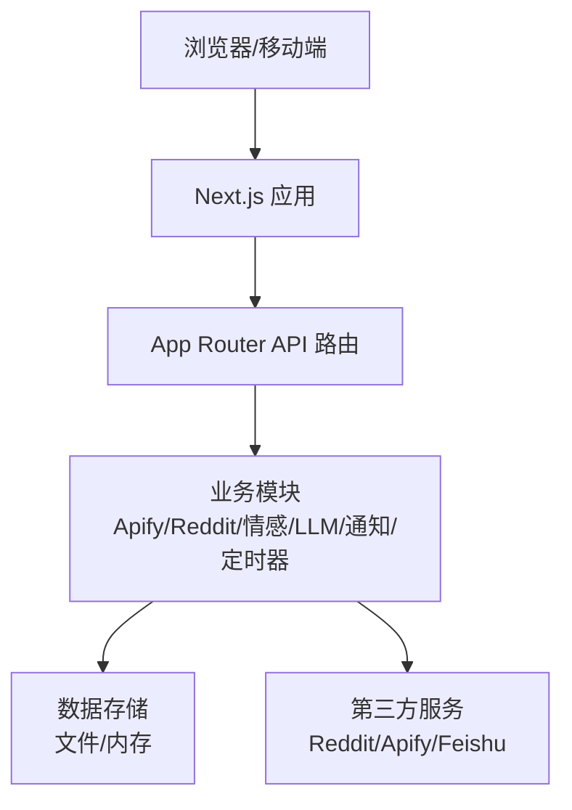
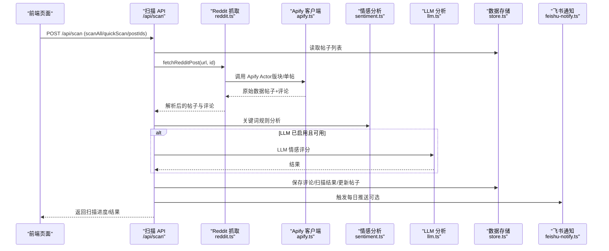
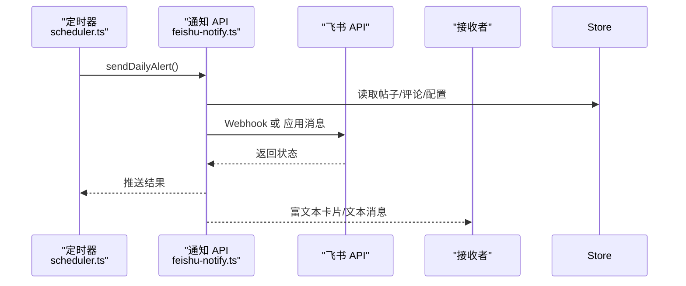
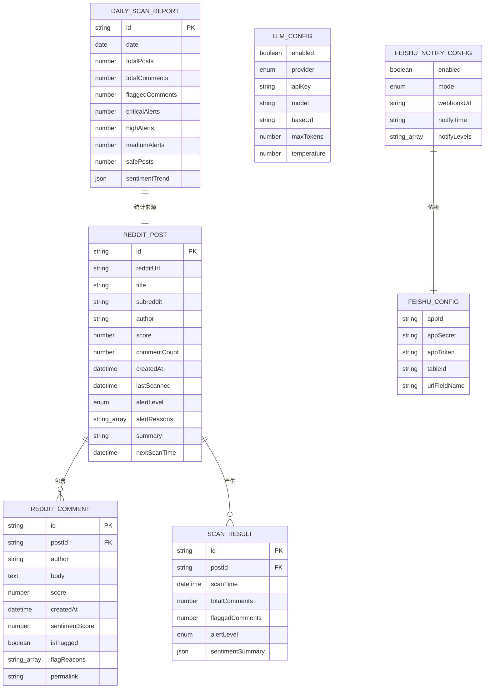
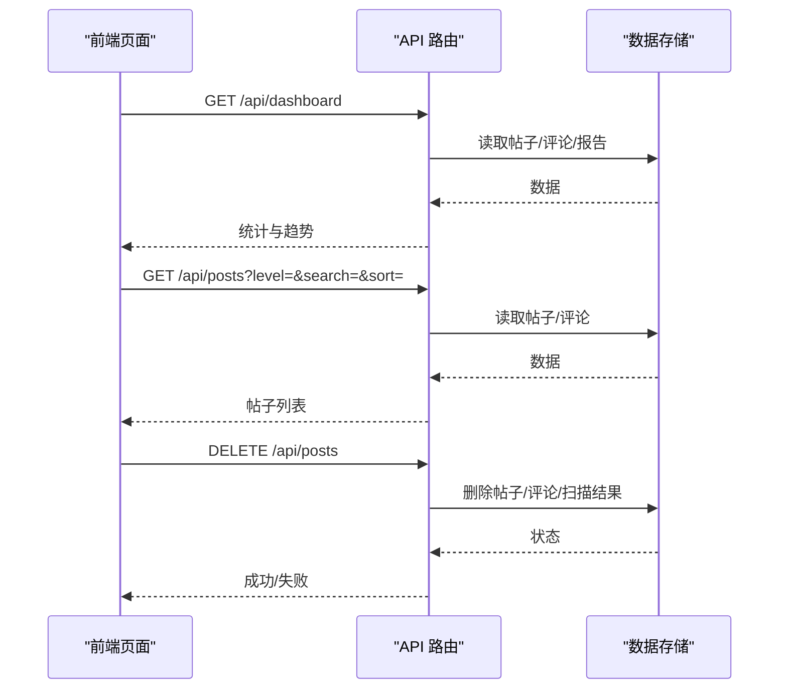
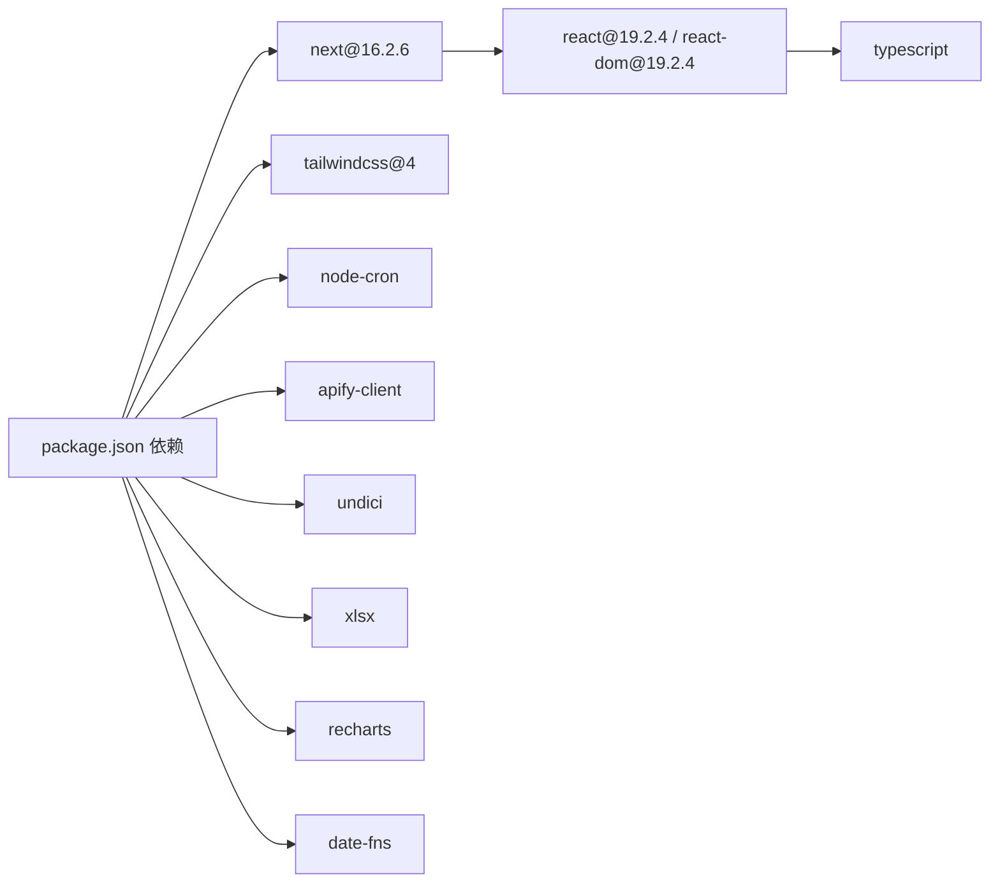

# 系统架构

<cite>
**本文引用的文件**
- [README.md](file://README.md)
- [package.json](file://package.json)
- [next.config.ts](file://next.config.ts)
- [Dockerfile](file://Dockerfile)
- [src/lib/types.ts](file://src/lib/types.ts)
- [src/lib/apify.ts](file://src/lib/apify.ts)
- [src/lib/reddit.ts](file://src/lib/reddit.ts)
- [src/lib/store.ts](file://src/lib/store.ts)
- [src/lib/feishu.ts](file://src/lib/feishu.ts)
- [src/lib/feishu-notify.ts](file://src/lib/feishu-notify.ts)
- [src/lib/scheduler.ts](file://src/lib/scheduler.ts)
- [src/lib/sentiment.ts](file://src/lib/sentiment.ts)
- [src/lib/llm.ts](file://src/lib/llm.ts)
- [src/lib/summary.ts](file://src/lib/summary.ts)
- [src/app/layout.tsx](file://src/app/layout.tsx)
- [src/app/api/posts/route.ts](file://src/app/api/posts/route.ts)
- [src/app/api/dashboard/route.ts](file://src/app/api/dashboard/route.ts)
- [src/app/api/scan/route.ts](file://src/app/api/scan/route.ts)
</cite>

## 目录
1. [简介](#简介)
2. [项目结构](#项目结构)
3. [核心组件](#核心组件)
4. [架构总览](#架构总览)
5. [组件详解](#组件详解)
6. [依赖关系分析](#依赖关系分析)
7. [性能考量](#性能考量)
8. [故障排查指南](#故障排查指南)
9. [结论](#结论)
10. [附录](#附录)

## 简介
本项目是一个基于 Next.js App Router 的 Reddit 监控与预警平台，具备以下能力：
- 从 Reddit 抓取帖子与评论（Apify 集成）
- 本地/云端数据持久化（文件/内存+环境变量）
- 关键词与情感分析（支持 LLM 与关键词规则）
- 告警分级与可视化仪表盘
- 飞书（Feishu）通知与跨租户访问
- 定时任务调度（每日推送、自动扫描）

系统采用前后端一体化的 API 路由设计，结合轻量级数据存储与第三方服务集成，满足中小规模品牌声誉监控场景。

## 项目结构
- 前端（Next.js App Router）
  - 页面路由位于 src/app 下，包含仪表盘、帖子列表、详情、设置等页面
  - 全局样式与布局在 src/app/globals.css 与 layout.tsx 中定义
- 后端 API
  - 路由位于 src/app/api/*，提供数据查询、扫描、推送、配置等接口
- 业务逻辑与工具
  - src/lib 下包含类型定义、Apify 集成、Reddit 抓取、数据存储、情感分析、LLM、通知、定时器等模块
- 部署与配置
  - Dockerfile 支持容器化部署；next.config.ts 控制构建与输出；package.json 管理依赖与脚本

图表来源
- [src/app/layout.tsx:1-23](file://src/app/layout.tsx#L1-L23)
- [src/app/api/dashboard/route.ts:1-108](file://src/app/api/dashboard/route.ts#L1-L108)
- [src/app/api/posts/route.ts:1-157](file://src/app/api/posts/route.ts#L1-L157)
- [src/app/api/scan/route.ts:1-394](file://src/app/api/scan/route.ts#L1-L394)
- [src/lib/store.ts:1-285](file://src/lib/store.ts#L1-L285)
- [src/lib/apify.ts:1-280](file://src/lib/apify.ts#L1-L280)
- [src/lib/reddit.ts:1-94](file://src/lib/reddit.ts#L1-L94)
- [src/lib/sentiment.ts](file://src/lib/sentiment.ts)
- [src/lib/llm.ts](file://src/lib/llm.ts)
- [src/lib/feishu-notify.ts:1-482](file://src/lib/feishu-notify.ts#L1-L482)
- [src/lib/scheduler.ts:1-133](file://src/lib/scheduler.ts#L1-L133)

章节来源
- [README.md:1-37](file://README.md#L1-L37)
- [package.json:1-38](file://package.json#L1-L38)
- [next.config.ts:1-28](file://next.config.ts#L1-L28)
- [Dockerfile:1-41](file://Dockerfile#L1-L41)

## 核心组件
- 类型与配置
  - 统一的数据模型与配置类型定义，覆盖帖子、评论、扫描结果、每日报告、飞书配置、LLM 配置、检测规则等
- 数据存储
  - 本地开发使用 JSON 文件持久化；在 Vercel 等平台使用内存存储与环境变量注入
- Apify 集成
  - 版块抓取与单帖抓取，内置缓存与限流，使用住宅代理降低风控
- Reddit 抓取封装
  - 对外统一接口，优先使用 Apify，保证稳定性
- 情感分析与告警
  - 支持关键词规则与 LLM 双通道；根据规则计算告警级别与趋势
- 飞书通知
  - 支持 Webhook 与应用消息两种模式；生成富文本卡片与纯文本摘要
- 定时任务
  - 基于 node-cron 的每日推送与自动扫描；支持手动触发与状态查询

章节来源
- [src/lib/types.ts:1-194](file://src/lib/types.ts#L1-L194)
- [src/lib/store.ts:1-285](file://src/lib/store.ts#L1-L285)
- [src/lib/apify.ts:1-280](file://src/lib/apify.ts#L1-L280)
- [src/lib/reddit.ts:1-94](file://src/lib/reddit.ts#L1-L94)
- [src/lib/feishu-notify.ts:1-482](file://src/lib/feishu-notify.ts#L1-L482)
- [src/lib/scheduler.ts:1-133](file://src/lib/scheduler.ts#L1-L133)

## 架构总览
系统采用“前端页面 + App Router API + 业务模块 + 第三方服务”的分层架构：
- 前端负责用户交互与可视化
- API 层负责数据聚合与业务编排
- 业务模块负责具体算法与第三方集成
- 存储层负责数据持久化与缓存

图表来源
- [src/app/layout.tsx:1-23](file://src/app/layout.tsx#L1-L23)
- [src/app/api/dashboard/route.ts:1-108](file://src/app/api/dashboard/route.ts#L1-L108)
- [src/lib/store.ts:1-285](file://src/lib/store.ts#L1-L285)
- [src/lib/apify.ts:1-280](file://src/lib/apify.ts#L1-L280)
- [src/lib/feishu.ts:1-448](file://src/lib/feishu.ts#L1-L448)

## 组件详解

### 数据流与控制流（扫描与告警）

图表来源
- [src/app/api/scan/route.ts:1-394](file://src/app/api/scan/route.ts#L1-L394)
- [src/lib/reddit.ts:1-94](file://src/lib/reddit.ts#L1-L94)
- [src/lib/apify.ts:1-280](file://src/lib/apify.ts#L1-L280)
- [src/lib/sentiment.ts](file://src/lib/sentiment.ts)
- [src/lib/llm.ts](file://src/lib/llm.ts)
- [src/lib/store.ts:1-285](file://src/lib/store.ts#L1-L285)
- [src/lib/feishu-notify.ts:1-482](file://src/lib/feishu-notify.ts#L1-L482)

章节来源
- [src/app/api/scan/route.ts:1-394](file://src/app/api/scan/route.ts#L1-L394)
- [src/lib/reddit.ts:1-94](file://src/lib/reddit.ts#L1-L94)
- [src/lib/apify.ts:1-280](file://src/lib/apify.ts#L1-L280)
- [src/lib/store.ts:1-285](file://src/lib/store.ts#L1-L285)

### 飞书通知与跨租户访问

图表来源
- [src/lib/scheduler.ts:1-133](file://src/lib/scheduler.ts#L1-L133)
- [src/lib/feishu-notify.ts:1-482](file://src/lib/feishu-notify.ts#L1-L482)
- [src/lib/feishu.ts:1-448](file://src/lib/feishu.ts#L1-L448)
- [src/lib/store.ts:1-285](file://src/lib/store.ts#L1-L285)

章节来源
- [src/lib/scheduler.ts:1-133](file://src/lib/scheduler.ts#L1-L133)
- [src/lib/feishu-notify.ts:1-482](file://src/lib/feishu-notify.ts#L1-L482)
- [src/lib/feishu.ts:1-448](file://src/lib/feishu.ts#L1-L448)

### 数据模型与关系

图表来源
- [src/lib/types.ts:1-194](file://src/lib/types.ts#L1-L194)
- [src/lib/store.ts:1-285](file://src/lib/store.ts#L1-L285)

章节来源
- [src/lib/types.ts:1-194](file://src/lib/types.ts#L1-L194)
- [src/lib/store.ts:1-285](file://src/lib/store.ts#L1-L285)

### 前端页面与 API 的交互
- 仪表盘页面调用 /api/dashboard 获取全局统计数据与趋势
- 帖子页面调用 /api/posts 查询与筛选帖子，并支持删除操作
- 扫描页面调用 /api/scan 发起扫描、查询进度、停止扫描

图表来源
- [src/app/api/dashboard/route.ts:1-108](file://src/app/api/dashboard/route.ts#L1-L108)
- [src/app/api/posts/route.ts:1-157](file://src/app/api/posts/route.ts#L1-L157)
- [src/lib/store.ts:1-285](file://src/lib/store.ts#L1-L285)

章节来源
- [src/app/api/dashboard/route.ts:1-108](file://src/app/api/dashboard/route.ts#L1-L108)
- [src/app/api/posts/route.ts:1-157](file://src/app/api/posts/route.ts#L1-L157)
- [src/lib/store.ts:1-285](file://src/lib/store.ts#L1-L285)

## 依赖关系分析
- 技术栈与版本
  - Next.js 16.2.6（App Router）、React 19.2.4、TypeScript、TailwindCSS 4、node-cron、apify-client、undici、xlsx、date-fns、recharts、lucide-react
- 外部依赖
  - Reddit 与 Apify（住宅代理）用于数据抓取
  - 飞书开放平台用于通知与跨租户访问
- 内部耦合
  - API 路由高度依赖 store.ts 与各业务模块
  - 扫描流程串联 Reddit、Apify、情感分析、LLM、存储与通知
- 潜在循环依赖
  - 当前模块间通过函数导出解耦，未见明显循环依赖

图表来源
- [package.json:1-38](file://package.json#L1-L38)

章节来源
- [package.json:1-38](file://package.json#L1-L38)

## 性能考量
- 抓取与限流
  - Apify 层实现请求间隔与缓存，避免触发限流与重复抓取
- 存储与缓存
  - store.ts 对热点文件进行内存缓存，缩短读取路径；Vercel 环境使用内存存储
- 扫描策略
  - 智能延迟：对长期无新评论的帖子延后扫描；快速扫描仅处理少量帖子
- 前端渲染
  - next.config.ts 开启 CSS 优化与输出 standalone，提升构建效率与运行时性能

章节来源
- [src/lib/apify.ts:1-280](file://src/lib/apify.ts#L1-L280)
- [src/lib/store.ts:1-285](file://src/lib/store.ts#L1-L285)
- [src/app/api/scan/route.ts:1-394](file://src/app/api/scan/route.ts#L1-L394)
- [next.config.ts:1-28](file://next.config.ts#L1-L28)

## 故障排查指南
- Apify 未配置
  - 现象：抛出未配置 Token 的错误
  - 处理：设置 APIFY_TOKEN 环境变量
- 飞书连接失败
  - 现象：获取 Token 或推送失败
  - 处理：校验 appId/appSecret/webhookUrl；使用 testFeishuNotify 测试
- Reddit 抓取失败
  - 现象：无法获取数据或被封禁
  - 处理：检查 URL 有效性；适当延长请求间隔；切换代理或 Actor
- 扫描长时间卡住
  - 现象：进度不更新
  - 处理：调用 DELETE /api/scan 停止扫描；检查网络与 LLM 配置
- Vercel 部署写入失败
  - 现象：数据未持久化
  - 处理：确认为只读文件系统；使用环境变量注入配置

章节来源
- [src/lib/apify.ts:54-66](file://src/lib/apify.ts#L54-L66)
- [src/lib/feishu-notify.ts:416-437](file://src/lib/feishu-notify.ts#L416-L437)
- [src/app/api/scan/route.ts:146-161](file://src/app/api/scan/route.ts#L146-L161)
- [src/lib/store.ts:42-50](file://src/lib/store.ts#L42-L50)

## 结论
该系统以 Next.js App Router 为核心，结合本地/云端数据存储、Apify 与 Reddit 抓取、情感分析与 LLM、飞书通知与定时任务，形成一套完整的 Reddit 监控与预警方案。其设计强调可扩展性与可维护性：模块职责清晰、API 路由集中、配置可注入、缓存与限流策略完善。建议在生产环境中进一步增强可观测性（日志与指标）、引入数据库替代文件存储、以及完善自动化测试与灰度发布流程。

## 附录
- 部署拓扑
  - 本地开发：next dev；容器化：Dockerfile 基于 node:22-alpine，构建 standalone 输出
  - 云部署：Vercel 等平台使用内存存储与环境变量注入配置
- 基础设施需求
  - Node.js 22、NPM、必要环境变量（APIFY_TOKEN、FEISHU_*、LLM_* 等）
- 安全与合规
  - 严格管理敏感配置（Token/密钥）；飞书跨租户访问需遵循 OAuth 流程
- 可扩展性
  - 建议引入数据库（PostgreSQL/MongoDB）与消息队列（Kafka/RabbitMQ）以支撑更大规模数据与并发
  - 引入 A/B 试验框架与灰度发布策略

章节来源
- [Dockerfile:1-41](file://Dockerfile#L1-L41)
- [src/lib/store.ts:235-269](file://src/lib/store.ts#L235-L269)
- [src/lib/feishu.ts:382-447](file://src/lib/feishu.ts#L382-L447)