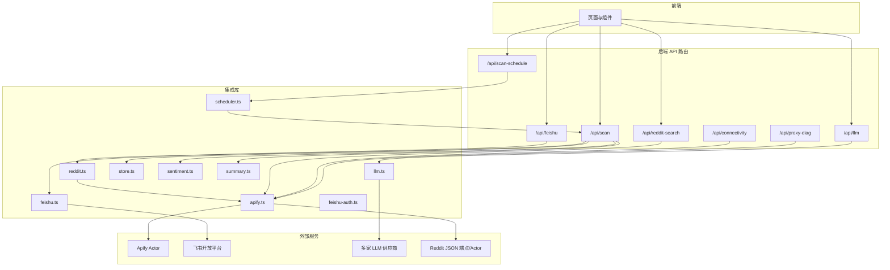
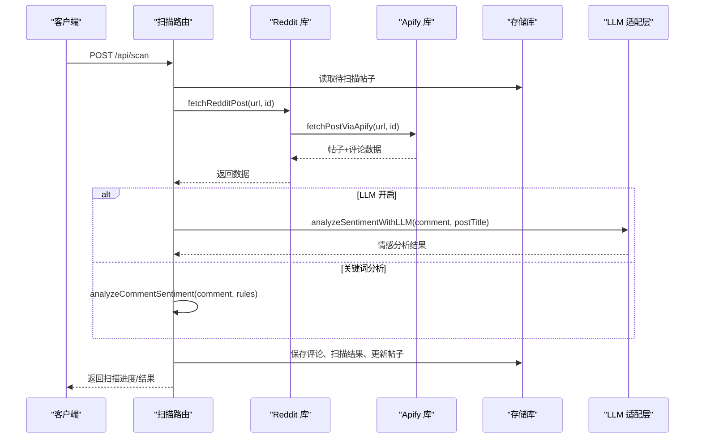
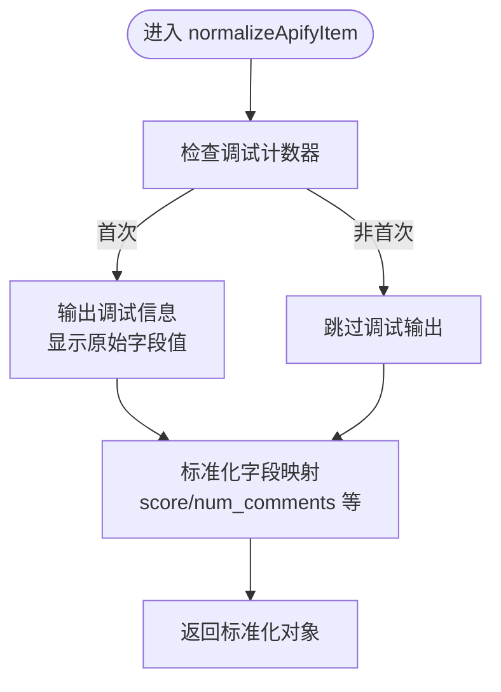
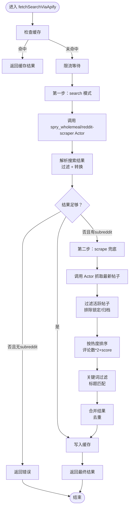
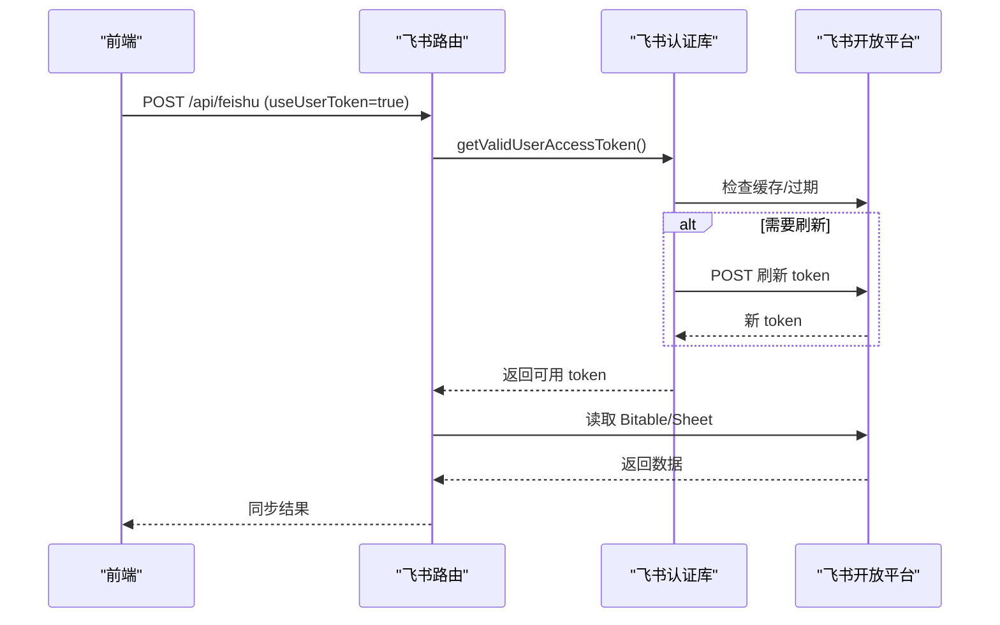
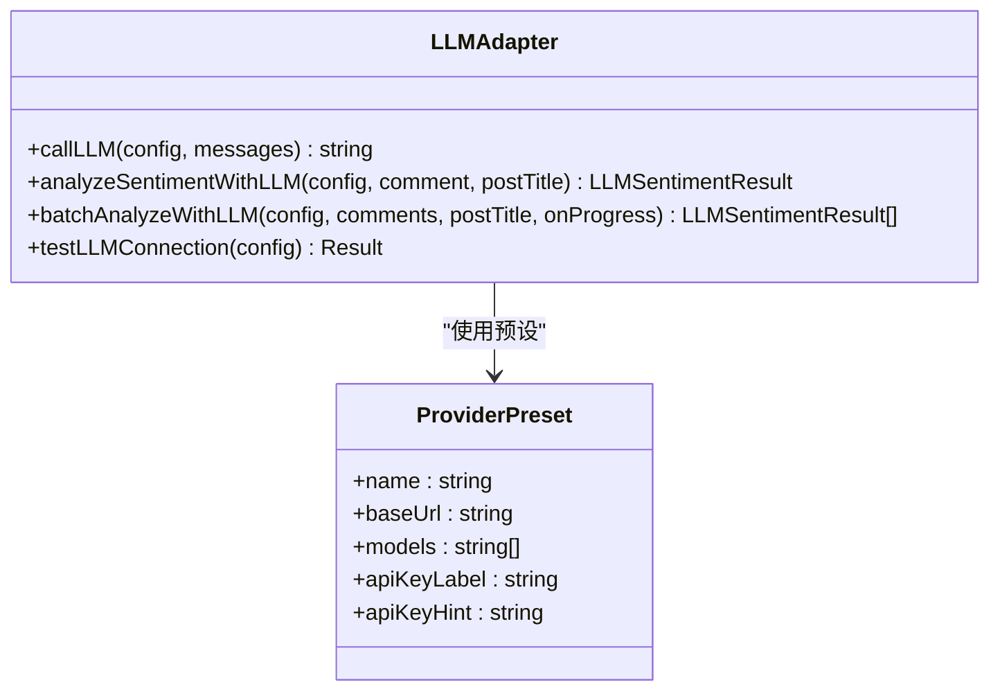
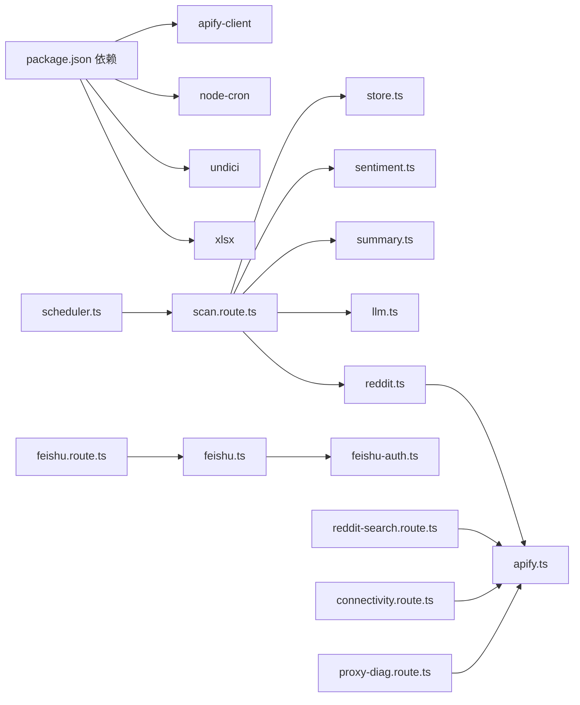

# 集成模式

<cite>
**本文引用的文件**
- [apify.ts](file://src/lib/apify.ts)
- [feishu.ts](file://src/lib/feishu.ts)
- [feishu-auth.ts](file://src/lib/feishu-auth.ts)
- [reddit.ts](file://src/lib/reddit.ts)
- [llm.ts](file://src/lib/llm.ts)
- [store.ts](file://src/lib/store.ts)
- [types.ts](file://src/lib/types.ts)
- [sentiment.ts](file://src/lib/sentiment.ts)
- [summary.ts](file://src/lib/summary.ts)
- [scheduler.ts](file://src/lib/scheduler.ts)
- [scan.route.ts](file://src/app/api/scan/route.ts)
- [scan-schedule.route.ts](file://src/app/api/scan-schedule/route.ts)
- [feishu.route.ts](file://src/app/api/feishu/route.ts)
- [llm.route.ts](file://src/app/api/llm/route.ts)
- [reddit-search.route.ts](file://src/app/api/reddit-search/route.ts)
- [connectivity.route.ts](file://src/app/api/connectivity/route.ts)
- [proxy-diag.route.ts](file://src/app/api/proxy-diag/route.ts)
- [package.json](file://package.json)
</cite>

## 更新摘要
**变更内容**
- 新增了强大的混合搜索功能，支持关键词搜索和智能回退机制
- 增强了错误处理和超时控制，提供更可靠的搜索体验
- 新增了 Reddit 搜索 API 路由，支持按关键词搜索 Reddit 帖子
- 改进了缓存策略和性能优化，针对搜索场景进行了专门优化
- **新增** Apify 集成调试增强：引入了详细的控制台调试机制，帮助开发者理解外部 API 响应差异和快速定位数据标准化问题
- **新增** Reddit JSON API 数据增强：在搜索结果中补充帖子的 score 和 commentCount 信息
- **新增** 诊断功能：新增连接性检查和代理诊断 API，提供更全面的系统健康监控

## 目录
1. [简介](#简介)
2. [项目结构](#项目结构)
3. [核心组件](#核心组件)
4. [架构总览](#架构总览)
5. [详细组件分析](#详细组件分析)
6. [依赖关系分析](#依赖关系分析)
7. [性能考量](#性能考量)
8. [故障排查指南](#故障排查指南)
9. [结论](#结论)
10. [附录](#附录)

## 简介
本文件面向 Reddit 监控系统的集成模式，系统通过统一的 API 层对接多个外部服务，包括 Apify 爬虫服务、飞书通知平台、Reddit API（通过 Apify Actor）、以及 LLM 服务（OpenAI、Anthropic、Google、DeepSeek、智谱、月之暗面、通义千问、豆包、Ollama、Custom）。系统采用事件驱动与定时调度相结合的方式，支持手动扫描、批量扫描、智能延迟与告警推送，并提供配置化的检测规则与情感分析能力。

**更新** 系统现已支持强大的混合搜索功能，通过 Apify Actor 实现关键词搜索，并具备智能回退机制来确保搜索结果的完整性和准确性。同时，新增了完善的调试机制，帮助开发者快速理解和解决外部 API 响应差异问题。**新增** Reddit JSON API 数据增强功能，为搜索结果补充更准确的评分和评论数信息。

## 项目结构
系统采用 Next.js App Router 的 API 路由组织方式，核心逻辑集中在 src/lib 下的模块化库函数，API 路由负责编排业务流程与外部服务交互。

**图表来源**
- [scan.route.ts:1-394](file://src/app/api/scan/route.ts#L1-L394)
- [feishu.route.ts:1-250](file://src/app/api/feishu/route.ts#L1-L250)
- [llm.route.ts:1-80](file://src/app/api/llm/route.ts#L1-L80)
- [scan-schedule.route.ts:1-53](file://src/app/api/scan-schedule/route.ts#L1-L53)
- [reddit-search.route.ts:1-159](file://src/app/api/reddit-search/route.ts#L1-L159)
- [connectivity.route.ts:1-25](file://src/app/api/connectivity/route.ts#L1-L25)
- [proxy-diag.route.ts:1-24](file://src/app/api/proxy-diag/route.ts#L1-L24)
- [reddit.ts:1-94](file://src/lib/reddit.ts#L1-L94)
- [apify.ts:1-503](file://src/lib/apify.ts#L1-L503)
- [feishu.ts:1-448](file://src/lib/feishu.ts#L1-L448)
- [feishu-auth.ts:1-416](file://src/lib/feishu-auth.ts#L1-L416)
- [llm.ts:1-338](file://src/lib/llm.ts#L1-L338)
- [scheduler.ts:1-133](file://src/lib/scheduler.ts#L1-L133)

**章节来源**
- [scan.route.ts:1-394](file://src/app/api/scan/route.ts#L1-L394)
- [feishu.route.ts:1-250](file://src/app/api/feishu/route.ts#L1-L250)
- [llm.route.ts:1-80](file://src/app/api/llm/route.ts#L1-L80)
- [scan-schedule.route.ts:1-53](file://src/app/api/scan-schedule/route.ts#L1-L53)
- [reddit-search.route.ts:1-159](file://src/app/api/reddit-search/route.ts#L1-L159)
- [connectivity.route.ts:1-25](file://src/app/api/connectivity/route.ts#L1-L25)
- [proxy-diag.route.ts:1-24](file://src/app/api/proxy-diag/route.ts#L1-L24)
- [apify.ts:1-503](file://src/lib/apify.ts#L1-L503)
- [feishu.ts:1-448](file://src/lib/feishu.ts#L1-L448)
- [feishu-auth.ts:1-416](file://src/lib/feishu-auth.ts#L1-L416)
- [reddit.ts:1-94](file://src/lib/reddit.ts#L1-L94)
- [llm.ts:1-338](file://src/lib/llm.ts#L1-L338)
- [scheduler.ts:1-133](file://src/lib/scheduler.ts#L1-L133)

## 核心组件
- Apify 集成：封装 Apify Client，提供按版块与按 URL 的 Reddit 数据抓取，内置内存缓存与请求限流。
- **新增** Apify 搜索集成：支持混合搜索策略，结合原生搜索和兜底抓取，提供强大的关键词搜索能力。
- **新增** Apify 调试增强：引入详细的控制台调试机制，帮助开发者理解外部 API 响应差异，快速定位数据标准化问题。调试计数器仅对前 3 个帖子输出详细信息，避免过度日志影响性能。
- 飞书集成：支持本租户与跨租户两种访问模式，提供 Bitable/Sheet 读取、OAuth 用户授权、令牌刷新与连接测试。
- Reddit API 包装：统一入口，优先使用 Apify Actor 获取数据，必要时回退至 Reddit JSON 端点。
- LLM 适配层：统一 OpenAI 兼容格式，支持多供应商，内置请求构建、响应解析与超时控制。
- 存储与配置：本地文件与 Vercel 环境下的内存存储，提供缓存与 TTL 控制，支持环境变量覆盖。
- 情感分析与摘要：关键词规则 + LLM 双通道，生成中文摘要与风险等级。
- 定时调度：基于 node-cron 的每日推送与自动扫描任务。
- **新增** Reddit JSON API 数据增强：在搜索结果中补充帖子的 score 和 commentCount 信息，提高数据准确性。
- **新增** 诊断功能：提供连接性检查和代理诊断 API，帮助快速定位配置问题。

**章节来源**
- [apify.ts:1-503](file://src/lib/apify.ts#L1-L503)
- [feishu.ts:1-448](file://src/lib/feishu.ts#L1-L448)
- [feishu-auth.ts:1-416](file://src/lib/feishu-auth.ts#L1-L416)
- [reddit.ts:1-94](file://src/lib/reddit.ts#L1-L94)
- [llm.ts:1-338](file://src/lib/llm.ts#L1-L338)
- [store.ts:1-285](file://src/lib/store.ts#L1-L285)
- [sentiment.ts:1-398](file://src/lib/sentiment.ts#L1-L398)
- [summary.ts:1-269](file://src/lib/summary.ts#L1-L269)
- [scheduler.ts:1-133](file://src/lib/scheduler.ts#L1-L133)

## 架构总览
系统通过 API 路由协调各集成库，形成"请求编排—数据抓取—分析处理—持久化—通知推送"的闭环。外部服务交互均通过统一的客户端与认证模块完成，内部通过配置中心与存储模块解耦。

**图表来源**
- [scan.route.ts:1-394](file://src/app/api/scan/route.ts#L1-L394)
- [reddit.ts:1-94](file://src/lib/reddit.ts#L1-L94)
- [apify.ts:1-503](file://src/lib/apify.ts#L1-L503)
- [llm.ts:1-338](file://src/lib/llm.ts#L1-L338)
- [sentiment.ts:1-398](file://src/lib/sentiment.ts#L1-L398)
- [store.ts:1-285](file://src/lib/store.ts#L1-L285)

## 详细组件分析

### Apify 集成（Reddit 抓取与搜索）
- 功能要点
  - 版块抓取：使用 FREE Actor，支持住宅代理，按 sort/timeframe 过滤。
  - 单贴抓取：通过 neatrat/reddit-scraper 精确抓取 URL，提取评论树。
  - **新增** 混合搜索：search 模式 + scrape 兜底，提供强大的关键词搜索能力。
  - 缓存与限流：内存 Map 缓存 + 请求间隔限流，避免触发第三方限流。
  - **增强** 错误处理：超时控制、详细错误信息、智能回退机制。
  - **新增** 调试增强：详细的控制台输出，帮助理解外部 API 响应差异。调试计数器仅对前 3 个帖子输出详细信息。
- 认证与代理
  - 通过环境变量注入 token，Actor 自带代理配置。
- 限流策略
  - 最小请求间隔 2 秒，避免 429。
- 数据转换
  - 统一字段映射，处理时间戳与 permalink 标准化。

**新增** Apify 调试增强机制：

Apify 集成包含了强大的调试机制，专门用于帮助开发者理解外部 API 响应差异和快速定位数据标准化问题。该机制通过以下方式实现：

1. **响应差异可视化**：在 `normalizeApifyItem` 函数中，系统会输出前 3 个帖子的原始响应字段，包括 `score`、`num_comments`、`upvotes`、`estimated_upvotes` 等关键字段，帮助开发者识别不同 Actor 返回的数据结构差异。

2. **数据标准化追踪**：调试输出显示原始字段值和标准化后的值，让开发者清楚地看到数据转换过程中的变化。

3. **分步调试输出**：在搜索流程的每个关键步骤都会输出详细的调试信息，包括 Actor 输入参数、原始返回数据、过滤过程和最终结果。

4. **性能优化的调试计数器**：使用 `_debugCount` 变量控制调试输出的数量，仅对前 3 个帖子输出详细信息，避免过度日志影响性能。

**图表来源**
- [apify.ts:105-137](file://src/lib/apify.ts#L105-L137)

**新增** 混合搜索策略实现：

**图表来源**
- [apify.ts:151-322](file://src/lib/apify.ts#L151-L322)

**章节来源**
- [apify.ts:1-503](file://src/lib/apify.ts#L1-L503)

### Reddit 搜索 API（新增）
- 功能概述
  - 提供 `/api/reddit-search` 路由，支持按关键词搜索 Reddit 帖子。
  - 支持全局搜索和板块内搜索，可指定时间范围和结果数量。
  - 提供搜索结果导入功能，将搜索到的帖子添加到监控列表。
  - **新增** 诊断字段：帮助定位「Actor 返回少」还是「filter 过滤多」的问题。
  - **新增** Reddit JSON API 数据增强：自动补充帖子的 score 和 commentCount 信息。
- 请求参数
  - `keywords`: 关键词数组（必填）
  - `subreddit`: 板块名称（可选）
  - `limit`: 结果数量限制（1-100，默认25）
  - `timeframe`: 时间范围（hour/day/week/month/year/all，默认month）
- 响应字段
  - `success`: 操作是否成功
  - `count`: 返回的帖子数量
  - `posts`: 搜索到的帖子列表
  - `warning`: 警告信息（如有）
  - `rawItemCount`: 原始项目数量
  - `filteredPostCount`: 过滤后的帖子数量
  - `firstItemKeys`: 首个项目的字段键名
  - `firstItemSample`: 首个项目的样本数据

**新增** Reddit JSON API 数据增强机制：

在搜索结果返回之前，系统会自动调用 Reddit JSON API 来补充帖子的评分和评论数信息。这个过程通过 `enrichPostFromReddit` 函数实现：

1. **自动数据补充**：对搜索结果中的前 10 个帖子并行调用 Reddit JSON API
2. **格式兼容**：处理 Reddit JSON API 返回的特殊格式 `[{ kind: 'Listing', data: { children: [...] } }]`
3. **错误处理**：忽略补充过程中的任何错误，保留原始值
4. **性能优化**：限制补充数量为 10 个，避免对大量结果造成性能影响

**章节来源**
- [reddit-search.route.ts:1-159](file://src/app/api/reddit-search/route.ts#L1-L159)

### 飞书集成（Bitable/Sheet 与 OAuth）
- 两种访问模式
  - 本租户：tenant_access_token，适合内部文档。
  - 跨租户：user_access_token，通过 OAuth 获取，支持外部文档。
- OAuth 流程
  - 生成授权 URL → 用户授权 → 回调换取 token → 自动刷新。
  - 支持刷新与状态查询，过期前 10 分钟刷新。
- 数据同步
  - Bitable/Sheet 读取 → URL 字段提取 → 转换为 RedditPost → 合并去重保存。
- 连接测试
  - 支持两种模式的连通性测试，返回记录数量与状态。

**图表来源**
- [feishu-auth.ts:334-359](file://src/lib/feishu-auth.ts#L334-L359)
- [feishu-auth.ts:249-326](file://src/lib/feishu-auth.ts#L249-L326)
- [feishu.ts:54-85](file://src/lib/feishu.ts#L54-L85)
- [feishu.ts:133-159](file://src/lib/feishu.ts#L133-L159)
- [feishu.route.ts:43-140](file://src/app/api/feishu/route.ts#L43-L140)

**章节来源**
- [feishu-auth.ts:1-416](file://src/lib/feishu-auth.ts#L1-L416)
- [feishu.ts:1-448](file://src/lib/feishu.ts#L1-L448)
- [feishu.route.ts:1-250](file://src/app/api/feishu/route.ts#L1-L250)

### Reddit API 包装（统一入口）
- 单贴：优先通过 Apify Actor 获取，必要时回退到 Reddit JSON 端点。
- 批量：顺序抓取，内置 2 秒限流，逐条更新进度。
- 版块：仅通过 Apify Actor 实现。

**章节来源**
- [reddit.ts:1-94](file://src/lib/reddit.ts#L1-L94)

### LLM 适配层（多供应商统一）
- 支持 OpenAI、Anthropic、Google、DeepSeek、智谱、月之暗面、通义千问、豆包、Ollama、Custom。
- 统一 OpenAI 兼容格式，特殊供应商单独处理请求体与响应解析。
- 超时控制 30 秒，失败回退关键词分析。
- 提供连接测试与预设配置。

**图表来源**
- [llm.ts:1-338](file://src/lib/llm.ts#L1-L338)

**章节来源**
- [llm.ts:1-338](file://src/lib/llm.ts#L1-L338)
- [llm.route.ts:1-80](file://src/app/api/llm/route.ts#L1-L80)

### 存储与配置（本地/Vercel）
- 本地：文件系统持久化，目录 data 下 posts/comments/scans/config/reports。
- Vercel：内存存储 + 环境变量覆盖，提供缓存与 TTL。
- 配置项：飞书、LLM、通知、检测规则、扫描计划等。

**章节来源**
- [store.ts:1-285](file://src/lib/store.ts#L1-L285)
- [types.ts:1-194](file://src/lib/types.ts#L1-L194)

### 情感分析与摘要
- 关键词规则：品牌攻击、产品差评、负面情绪、号召抵制、竞品推荐。
- 强度与否定处理：修饰词放大、否定词抑制。
- LLM 双通道：LLM 成功则用 LLM，失败回退关键词分析。
- 摘要生成：中文摘要、话题抽取、风险描述。

**章节来源**
- [sentiment.ts:1-398](file://src/lib/sentiment.ts#L1-L398)
- [summary.ts:1-269](file://src/lib/summary.ts#L1-L269)

### 定时调度与通知
- 每日推送：根据配置时间执行，调用飞书通知。
- 自动扫描：午夜执行全量扫描，更新趋势。
- 任务管理：启动/停止、状态查询、手动触发。

**章节来源**
- [scheduler.ts:1-133](file://src/lib/scheduler.ts#L1-L133)
- [scan-schedule.route.ts:1-53](file://src/app/api/scan-schedule/route.ts#L1-L53)

### 连接性检查与代理诊断（新增）
- **新增** 连接性检查：`/api/connectivity` 路由，验证 Apify 配置状态。
- **新增** 代理诊断：`/api/proxy-diag` 路由，检查环境变量和 Apify 配置状态。
- **新增** 诊断输出：提供详细的环境变量检查和配置状态信息。
- **新增** 诊断字段：在搜索结果中提供 `rawItemCount` 和 `filteredPostCount` 字段，帮助定位问题。

**章节来源**
- [connectivity.route.ts:1-25](file://src/app/api/connectivity/route.ts#L1-L25)
- [proxy-diag.route.ts:1-24](file://src/app/api/proxy-diag/route.ts#L1-L24)

## 依赖关系分析
- 外部依赖
  - apify-client：Apify Actor 调用。
  - node-cron：定时任务。
  - undici：HTTP 客户端（Next.js 内置）。
  - xlsx：电子表格处理。
- 内部耦合
  - API 路由依赖存储、情感分析、摘要、LLM、Apify、飞书等库。
  - 库之间保持低耦合，通过统一类型与配置中心交互。

**图表来源**
- [package.json:14-36](file://package.json#L14-L36)
- [scan.route.ts:1-394](file://src/app/api/scan/route.ts#L1-L394)
- [feishu.route.ts:1-250](file://src/app/api/feishu/route.ts#L1-L250)
- [scheduler.ts:1-133](file://src/lib/scheduler.ts#L1-L133)
- [store.ts:1-285](file://src/lib/store.ts#L1-L285)
- [sentiment.ts:1-398](file://src/lib/sentiment.ts#L1-L398)
- [summary.ts:1-269](file://src/lib/summary.ts#L1-L269)
- [llm.ts:1-338](file://src/lib/llm.ts#L1-L338)
- [reddit.ts:1-94](file://src/lib/reddit.ts#L1-L94)
- [apify.ts:1-503](file://src/lib/apify.ts#L1-L503)
- [feishu.ts:1-448](file://src/lib/feishu.ts#L1-L448)
- [feishu-auth.ts:1-416](file://src/lib/feishu-auth.ts#L1-L416)
- [reddit-search.route.ts:1-159](file://src/app/api/reddit-search/route.ts#L1-L159)
- [connectivity.route.ts:1-25](file://src/app/api/connectivity/route.ts#L1-L25)
- [proxy-diag.route.ts:1-24](file://src/app/api/proxy-diag/route.ts#L1-L24)

**章节来源**
- [package.json:1-38](file://package.json#L1-L38)

## 性能考量
- 限流与退避
  - Apify 请求最小间隔 2 秒；扫描间歇 3 秒；LLM 请求间隔 300ms。
  - **新增** 搜索功能包含超时控制（2分钟），防止长时间阻塞。
- 缓存策略
  - Apify 版块/帖子缓存，TTL 分别为 10 分钟与 30 分钟；存储层 30 秒缓存。
  - **新增** 搜索结果缓存，针对关键词组合进行专门缓存。
- I/O 优化
  - 顺序批处理，避免并发风暴；智能延迟：无新评论则延后扫描。
  - **新增** 混合搜索策略：先用搜索模式快速获取结果，不足时再用兜底抓取。
  - **新增** 调试性能优化：调试输出仅在前 3 个项目上启用，避免过度日志输出影响性能。
  - **新增** 数据增强性能优化：仅对前 10 个搜索结果进行 Reddit JSON API 补充。
- 资源隔离
  - LLM 失败回退关键词分析，降低对外部服务依赖。
  - **新增** 错误回退机制：搜索失败时自动尝试其他方案。
  - **新增** 诊断功能性能优化：连接性检查和代理诊断 API 提供快速状态查询。

## 故障排查指南
- Apify
  - 确认 APIFY_TOKEN；检查 Actor 输入参数与代理配置；观察缓存命中与限流日志。
  - **新增** 使用 `/api/proxy-diag` 检查环境变量和配置状态。
  - **新增** 查看调试输出，理解外部 API 响应差异和数据标准化问题。
  - **新增** 检查搜索超时问题，确认网络连接和 Actor 可用性。
  - **新增** 使用 `/api/connectivity` 验证 Apify 连接状态。
- 飞书
  - OAuth 授权是否完成；user_access_token 是否过期；外部文档 token/tableId 是否正确。
- LLM
  - API Key 是否填写；提供商 baseUrl/model 是否匹配；超时与空结果处理。
- 扫描
  - 检查帖子年龄过滤与 nextScanTime；关注失败条目与错误信息；查看每日报告统计。
- 定时任务
  - cron 表达式是否有效；推送/扫描是否成功执行；手动触发验证。
- **新增** 搜索功能
  - 检查关键词有效性；确认 subreddit 名称正确；验证搜索结果缓存状态。
  - **新增** 使用 `/api/connectivity` 验证 Apify 连接状态。
  - **新增** 分析诊断字段，确定是 Actor 返回少还是过滤过多。
  - **新增** 检查数据增强功能，确认 Reddit JSON API 调用是否正常。
- **新增** 诊断功能
  - 使用 `/api/connectivity` 检查 Apify 配置状态。
  - 使用 `/api/proxy-diag` 检查环境变量和代理配置。
  - 分析诊断字段了解搜索结果的质量和过滤效果。

**章节来源**
- [apify.ts:1-503](file://src/lib/apify.ts#L1-L503)
- [feishu-auth.ts:1-416](file://src/lib/feishu-auth.ts#L1-L416)
- [feishu.ts:1-448](file://src/lib/feishu.ts#L1-L448)
- [llm.ts:1-338](file://src/lib/llm.ts#L1-L338)
- [scan.route.ts:1-394](file://src/app/api/scan/route.ts#L1-L394)
- [scheduler.ts:1-133](file://src/lib/scheduler.ts#L1-L133)
- [reddit-search.route.ts:1-159](file://src/app/api/reddit-search/route.ts#L1-L159)
- [connectivity.route.ts:1-25](file://src/app/api/connectivity/route.ts#L1-L25)
- [proxy-diag.route.ts:1-24](file://src/app/api/proxy-diag/route.ts#L1-L24)

## 结论
该系统通过模块化的集成库与清晰的 API 路由，实现了对 Apify、飞书、Reddit 与 LLM 的统一接入。结合定时调度、智能延迟与双通道情感分析，既能保障稳定性，又能提升监控精度。

**更新** 新增的强大搜索功能进一步增强了系统的监控能力，通过混合搜索策略和智能回退机制，确保在各种情况下都能获取准确的搜索结果。新增的调试机制为开发者提供了强大的工具来理解和解决外部 API 响应差异问题。**新增** Reddit JSON API 数据增强功能提高了搜索结果的准确性，而**新增**的诊断功能则提供了更全面的系统健康监控能力。建议在生产环境中强化可观测性与告警，完善集成测试与灰度发布策略。

## 附录
- 开发与部署
  - 本地开发：npm run dev；构建与启动：npm run build/start。
  - Vercel 环境：通过环境变量覆盖配置，启用飞书 Webhook 与 LLM 参数。
- 集成测试建议
  - 使用 mock 数据与本地 LLM（如 Ollama）进行离线测试。
  - 通过单元测试覆盖关键路径（缓存、限流、错误回退）。
  - **新增** 测试搜索功能的混合策略和错误处理机制。
  - **新增** 利用调试输出验证数据标准化过程。
  - **新增** 测试 Reddit JSON API 数据增强功能。
  - **新增** 测试诊断功能的各个 API 端点。
- 版本管理与迁移
  - 类型定义集中于 types.ts，变更需向后兼容；配置项通过默认值与环境变量过渡。
  - API 路由返回结构稳定，前端按字段健壮性处理。
  - **新增** 搜索 API 的向后兼容性保证，确保现有功能不受影响。
  - **新增** 调试机制的向后兼容性，不影响现有功能。
  - **新增** 诊断功能的向后兼容性，提供新的监控能力而不破坏现有功能。