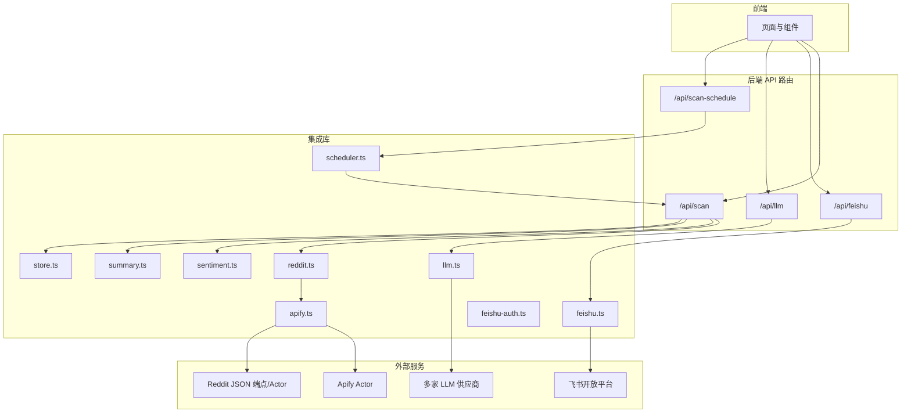
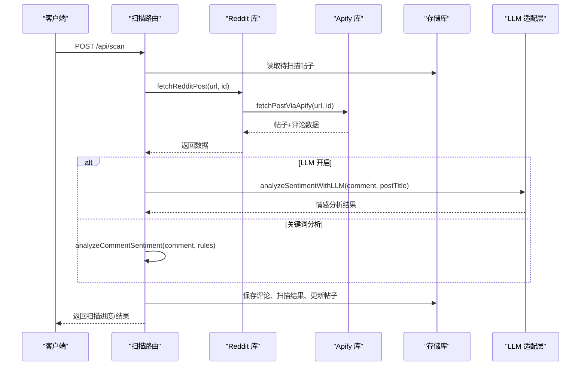
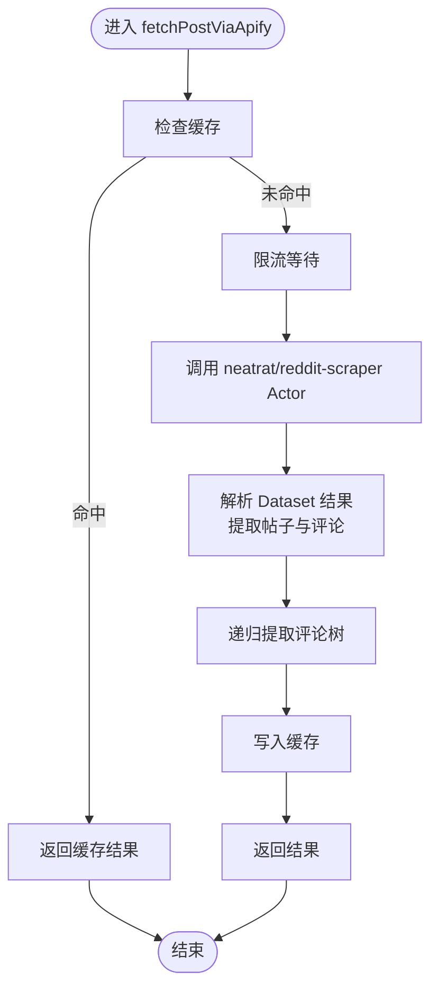
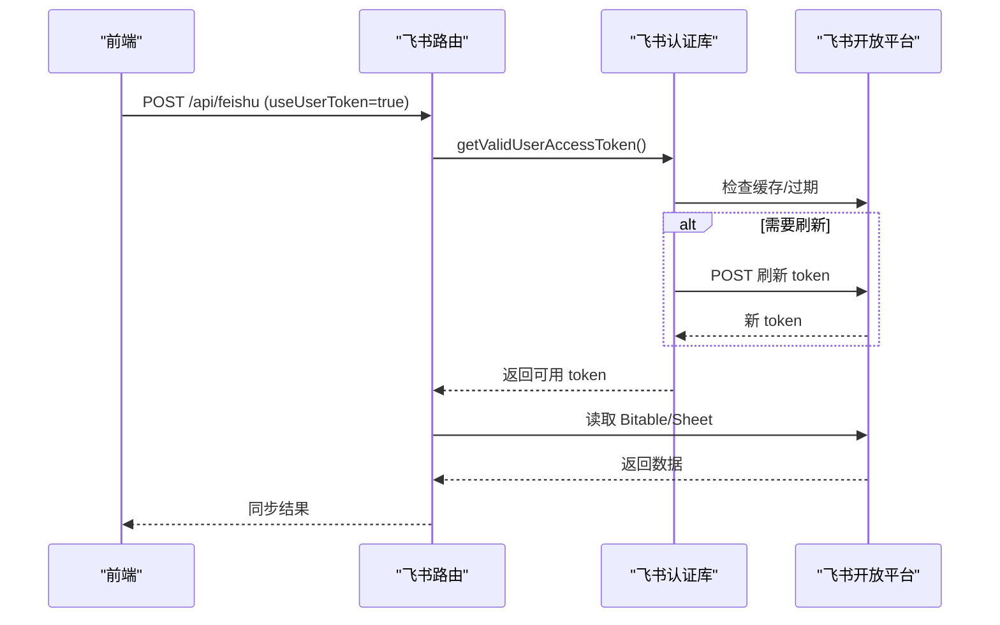
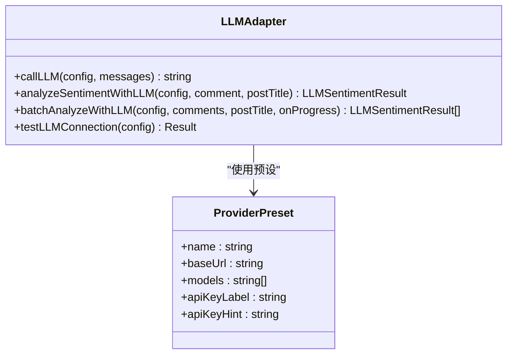
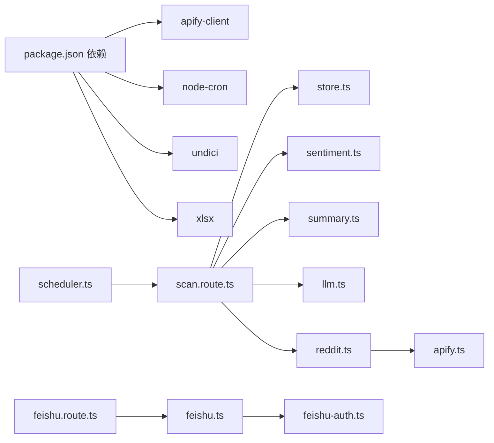

# 集成模式

<cite>
**本文引用的文件**
- [apify.ts](file://src/lib/apify.ts)
- [feishu.ts](file://src/lib/feishu.ts)
- [feishu-auth.ts](file://src/lib/feishu-auth.ts)
- [reddit.ts](file://src/lib/reddit.ts)
- [llm.ts](file://src/lib/llm.ts)
- [store.ts](file://src/lib/store.ts)
- [types.ts](file://src/lib/types.ts)
- [sentiment.ts](file://src/lib/sentiment.ts)
- [summary.ts](file://src/lib/summary.ts)
- [scheduler.ts](file://src/lib/scheduler.ts)
- [scan.route.ts](file://src/app/api/scan/route.ts)
- [scan-schedule.route.ts](file://src/app/api/scan-schedule/route.ts)
- [feishu.route.ts](file://src/app/api/feishu/route.ts)
- [llm.route.ts](file://src/app/api/llm/route.ts)
- [package.json](file://package.json)
</cite>

## 目录
1. [简介](#简介)
2. [项目结构](#项目结构)
3. [核心组件](#核心组件)
4. [架构总览](#架构总览)
5. [详细组件分析](#详细组件分析)
6. [依赖关系分析](#依赖关系分析)
7. [性能考量](#性能考量)
8. [故障排查指南](#故障排查指南)
9. [结论](#结论)
10. [附录](#附录)

## 简介
本文件面向 Reddit 监控系统的集成模式，系统通过统一的 API 层对接多个外部服务，包括 Apify 爬虫服务、飞书通知平台、Reddit API（通过 Apify Actor）、以及 LLM 服务（OpenAI、Anthropic、Google、DeepSeek、智谱、月之暗面、通义千问、豆包、Ollama、Custom）。系统采用事件驱动与定时调度相结合的方式，支持手动扫描、批量扫描、智能延迟与告警推送，并提供配置化的检测规则与情感分析能力。

## 项目结构
系统采用 Next.js App Router 的 API 路由组织方式，核心逻辑集中在 src/lib 下的模块化库函数，API 路由负责编排业务流程与外部服务交互。

图表来源
- [scan.route.ts:1-394](file://src/app/api/scan/route.ts#L1-L394)
- [feishu.route.ts:1-250](file://src/app/api/feishu/route.ts#L1-L250)
- [llm.route.ts:1-80](file://src/app/api/llm/route.ts#L1-L80)
- [scan-schedule.route.ts:1-53](file://src/app/api/scan-schedule/route.ts#L1-L53)
- [reddit.ts:1-94](file://src/lib/reddit.ts#L1-L94)
- [apify.ts:1-280](file://src/lib/apify.ts#L1-L280)
- [feishu.ts:1-448](file://src/lib/feishu.ts#L1-L448)
- [feishu-auth.ts:1-416](file://src/lib/feishu-auth.ts#L1-L416)
- [llm.ts:1-338](file://src/lib/llm.ts#L1-L338)
- [scheduler.ts:1-133](file://src/lib/scheduler.ts#L1-L133)

章节来源
- [scan.route.ts:1-394](file://src/app/api/scan/route.ts#L1-L394)
- [feishu.route.ts:1-250](file://src/app/api/feishu/route.ts#L1-L250)
- [llm.route.ts:1-80](file://src/app/api/llm/route.ts#L1-L80)
- [scan-schedule.route.ts:1-53](file://src/app/api/scan-schedule/route.ts#L1-L53)
- [apify.ts:1-280](file://src/lib/apify.ts#L1-L280)
- [feishu.ts:1-448](file://src/lib/feishu.ts#L1-L448)
- [feishu-auth.ts:1-416](file://src/lib/feishu-auth.ts#L1-L416)
- [reddit.ts:1-94](file://src/lib/reddit.ts#L1-L94)
- [llm.ts:1-338](file://src/lib/llm.ts#L1-L338)
- [scheduler.ts:1-133](file://src/lib/scheduler.ts#L1-L133)

## 核心组件
- Apify 集成：封装 Apify Client，提供按版块与按 URL 的 Reddit 数据抓取，内置内存缓存与请求限流。
- 飞书集成：支持本租户与跨租户两种访问模式，提供 Bitable/Sheet 读取、OAuth 用户授权、令牌刷新与连接测试。
- Reddit API 包装：统一入口，优先使用 Apify Actor 获取数据，必要时回退至 Reddit JSON 端点。
- LLM 适配层：统一 OpenAI 兼容格式，支持多供应商，内置请求构建、响应解析与超时控制。
- 存储与配置：本地文件与 Vercel 环境下的内存存储，提供缓存与 TTL 控制，支持环境变量覆盖。
- 情感分析与摘要：关键词规则 + LLM 双通道，生成中文摘要与风险等级。
- 定时调度：基于 node-cron 的每日推送与自动扫描任务。

章节来源
- [apify.ts:1-280](file://src/lib/apify.ts#L1-L280)
- [feishu.ts:1-448](file://src/lib/feishu.ts#L1-L448)
- [feishu-auth.ts:1-416](file://src/lib/feishu-auth.ts#L1-L416)
- [reddit.ts:1-94](file://src/lib/reddit.ts#L1-L94)
- [llm.ts:1-338](file://src/lib/llm.ts#L1-L338)
- [store.ts:1-285](file://src/lib/store.ts#L1-L285)
- [sentiment.ts:1-398](file://src/lib/sentiment.ts#L1-L398)
- [summary.ts:1-269](file://src/lib/summary.ts#L1-L269)
- [scheduler.ts:1-133](file://src/lib/scheduler.ts#L1-L133)

## 架构总览
系统通过 API 路由协调各集成库，形成“请求编排—数据抓取—分析处理—持久化—通知推送”的闭环。外部服务交互均通过统一的客户端与认证模块完成，内部通过配置中心与存储模块解耦。

图表来源
- [scan.route.ts:1-394](file://src/app/api/scan/route.ts#L1-L394)
- [reddit.ts:1-94](file://src/lib/reddit.ts#L1-L94)
- [apify.ts:1-280](file://src/lib/apify.ts#L1-L280)
- [llm.ts:1-338](file://src/lib/llm.ts#L1-L338)
- [sentiment.ts:1-398](file://src/lib/sentiment.ts#L1-L398)
- [store.ts:1-285](file://src/lib/store.ts#L1-L285)

## 详细组件分析

### Apify 集成（Reddit 抓取）
- 功能要点
  - 版块抓取：使用 FREE Actor，支持住宅代理，按 sort/timeframe 过滤。
  - 单贴抓取：通过 neatrat/reddit-scraper 精确抓取 URL，提取评论树。
  - 缓存与限流：内存 Map 缓存 + 请求间隔限流，避免触发第三方限流。
  - 错误处理：捕获异常并返回空结果，便于上层容错。
- 认证与代理
  - 通过环境变量注入 token，Actor 自带代理配置。
- 限流策略
  - 最小请求间隔 2 秒，避免 429。
- 数据转换
  - 统一字段映射，处理时间戳与 permalink 标准化。

图表来源
- [apify.ts:178-280](file://src/lib/apify.ts#L178-L280)

章节来源
- [apify.ts:1-280](file://src/lib/apify.ts#L1-L280)

### 飞书集成（Bitable/Sheet 与 OAuth）
- 两种访问模式
  - 本租户：tenant_access_token，适合内部文档。
  - 跨租户：user_access_token，通过 OAuth 获取，支持外部文档。
- OAuth 流程
  - 生成授权 URL → 用户授权 → 回调换取 token → 自动刷新。
  - 支持刷新与状态查询，过期前 10 分钟刷新。
- 数据同步
  - Bitable/Sheet 读取 → URL 字段提取 → 转换为 RedditPost → 合并去重保存。
- 连接测试
  - 支持两种模式的连通性测试，返回记录数量与状态。

图表来源
- [feishu-auth.ts:334-359](file://src/lib/feishu-auth.ts#L334-L359)
- [feishu-auth.ts:249-326](file://src/lib/feishu-auth.ts#L249-L326)
- [feishu.ts:54-85](file://src/lib/feishu.ts#L54-L85)
- [feishu.ts:133-159](file://src/lib/feishu.ts#L133-L159)
- [feishu.route.ts:43-140](file://src/app/api/feishu/route.ts#L43-L140)

章节来源
- [feishu-auth.ts:1-416](file://src/lib/feishu-auth.ts#L1-L416)
- [feishu.ts:1-448](file://src/lib/feishu.ts#L1-L448)
- [feishu.route.ts:1-250](file://src/app/api/feishu/route.ts#L1-L250)

### Reddit API 包装（统一入口）
- 单贴：优先通过 Apify Actor 获取，必要时回退到 Reddit JSON 端点。
- 批量：顺序抓取，内置 2 秒限流，逐条更新进度。
- 版块：仅通过 Apify Actor 实现。

章节来源
- [reddit.ts:1-94](file://src/lib/reddit.ts#L1-L94)

### LLM 适配层（多供应商统一）
- 支持 OpenAI、Anthropic、Google、DeepSeek、智谱、月之暗面、通义千问、豆包、Ollama、Custom。
- 统一 OpenAI 兼容格式，特殊供应商单独处理请求体与响应解析。
- 超时控制 30 秒，失败回退关键词分析。
- 提供连接测试与预设配置。

图表来源
- [llm.ts:1-338](file://src/lib/llm.ts#L1-L338)

章节来源
- [llm.ts:1-338](file://src/lib/llm.ts#L1-L338)
- [llm.route.ts:1-80](file://src/app/api/llm/route.ts#L1-L80)

### 存储与配置（本地/Vercel）
- 本地：文件系统持久化，目录 data 下 posts/comments/scans/config/reports。
- Vercel：内存存储 + 环境变量覆盖，提供缓存与 TTL。
- 配置项：飞书、LLM、通知、检测规则、扫描计划等。

章节来源
- [store.ts:1-285](file://src/lib/store.ts#L1-L285)
- [types.ts:1-194](file://src/lib/types.ts#L1-L194)

### 情感分析与摘要
- 关键词规则：品牌攻击、产品差评、负面情绪、号召抵制、竞品推荐。
- 强度与否定处理：修饰词放大、否定词抑制。
- LLM 双通道：LLM 成功则用 LLM，失败回退关键词分析。
- 摘要生成：中文摘要、话题抽取、风险描述。

章节来源
- [sentiment.ts:1-398](file://src/lib/sentiment.ts#L1-L398)
- [summary.ts:1-269](file://src/lib/summary.ts#L1-L269)

### 定时调度与通知
- 每日推送：根据配置时间执行，调用飞书通知。
- 自动扫描：午夜执行全量扫描，更新趋势。
- 任务管理：启动/停止、状态查询、手动触发。

章节来源
- [scheduler.ts:1-133](file://src/lib/scheduler.ts#L1-L133)
- [scan-schedule.route.ts:1-53](file://src/app/api/scan-schedule/route.ts#L1-L53)

## 依赖关系分析
- 外部依赖
  - apify-client：Apify Actor 调用。
  - node-cron：定时任务。
  - undici：HTTP 客户端（Next.js 内置）。
  - xlsx：电子表格处理。
- 内部耦合
  - API 路由依赖存储、情感分析、摘要、LLM、Apify、飞书等库。
  - 库之间保持低耦合，通过统一类型与配置中心交互。

图表来源
- [package.json:14-36](file://package.json#L14-L36)
- [scan.route.ts:1-394](file://src/app/api/scan/route.ts#L1-L394)
- [feishu.route.ts:1-250](file://src/app/api/feishu/route.ts#L1-L250)
- [scheduler.ts:1-133](file://src/lib/scheduler.ts#L1-L133)
- [store.ts:1-285](file://src/lib/store.ts#L1-L285)
- [sentiment.ts:1-398](file://src/lib/sentiment.ts#L1-L398)
- [summary.ts:1-269](file://src/lib/summary.ts#L1-L269)
- [llm.ts:1-338](file://src/lib/llm.ts#L1-L338)
- [reddit.ts:1-94](file://src/lib/reddit.ts#L1-L94)
- [apify.ts:1-280](file://src/lib/apify.ts#L1-L280)
- [feishu.ts:1-448](file://src/lib/feishu.ts#L1-L448)
- [feishu-auth.ts:1-416](file://src/lib/feishu-auth.ts#L1-L416)

章节来源
- [package.json:1-38](file://package.json#L1-L38)

## 性能考量
- 限流与退避
  - Apify 请求最小间隔 2 秒；扫描间歇 3 秒；LLM 请求间隔 300ms。
- 缓存策略
  - Apify 版块/帖子缓存，TTL 分别为 10 分钟与 30 分钟；存储层 30 秒缓存。
- I/O 优化
  - 顺序批处理，避免并发风暴；智能延迟：无新评论则延后扫描。
- 资源隔离
  - LLM 失败回退关键词分析，降低对外部服务依赖。

## 故障排查指南
- Apify
  - 确认 APIFY_TOKEN；检查 Actor 输入参数与代理配置；观察缓存命中与限流日志。
- 飞书
  - OAuth 授权是否完成；user_access_token 是否过期；外部文档 token/tableId 是否正确。
- LLM
  - API Key 是否填写；提供商 baseUrl/model 是否匹配；超时与空结果处理。
- 扫描
  - 检查帖子年龄过滤与 nextScanTime；关注失败条目与错误信息；查看每日报告统计。
- 定时任务
  - cron 表达式是否有效；推送/扫描是否成功执行；手动触发验证。

章节来源
- [apify.ts:1-280](file://src/lib/apify.ts#L1-L280)
- [feishu-auth.ts:1-416](file://src/lib/feishu-auth.ts#L1-L416)
- [feishu.ts:1-448](file://src/lib/feishu.ts#L1-L448)
- [llm.ts:1-338](file://src/lib/llm.ts#L1-L338)
- [scan.route.ts:1-394](file://src/app/api/scan/route.ts#L1-L394)
- [scheduler.ts:1-133](file://src/lib/scheduler.ts#L1-L133)

## 结论
该系统通过模块化的集成库与清晰的 API 路由，实现了对 Apify、飞书、Reddit 与 LLM 的统一接入。结合定时调度、智能延迟与双通道情感分析，既能保障稳定性，又能提升监控精度。建议在生产环境中强化可观测性与告警，完善集成测试与灰度发布策略。

## 附录
- 开发与部署
  - 本地开发：npm run dev；构建与启动：npm run build/start。
  - Vercel 环境：通过环境变量覆盖配置，启用飞书 Webhook 与 LLM 参数。
- 集成测试建议
  - 使用 mock 数据与本地 LLM（如 Ollama）进行离线测试。
  - 通过单元测试覆盖关键路径（缓存、限流、错误回退）。
- 版本管理与迁移
  - 类型定义集中于 types.ts，变更需向后兼容；配置项通过默认值与环境变量过渡。
  - API 路由返回结构稳定，前端按字段健壮性处理。