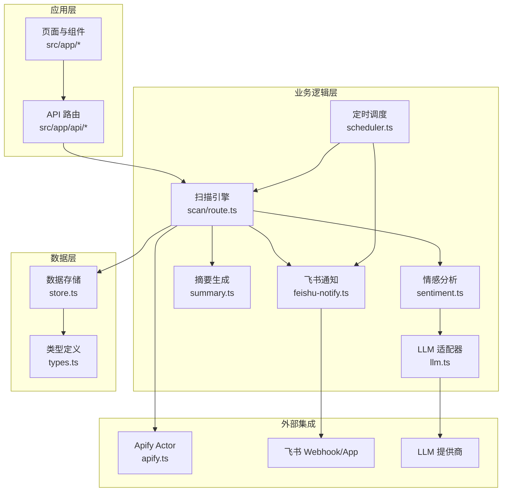
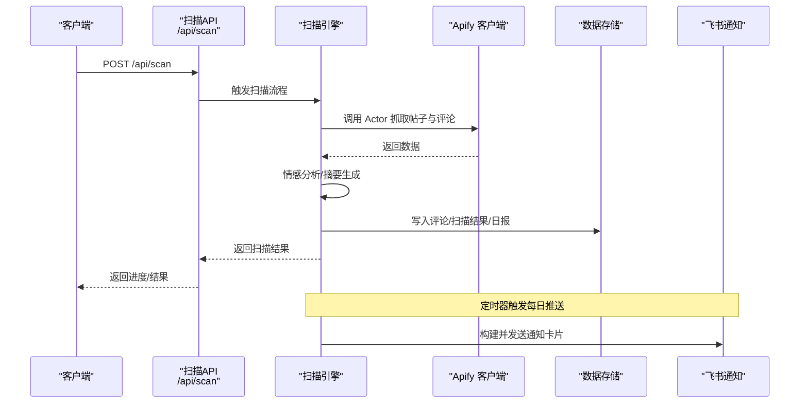
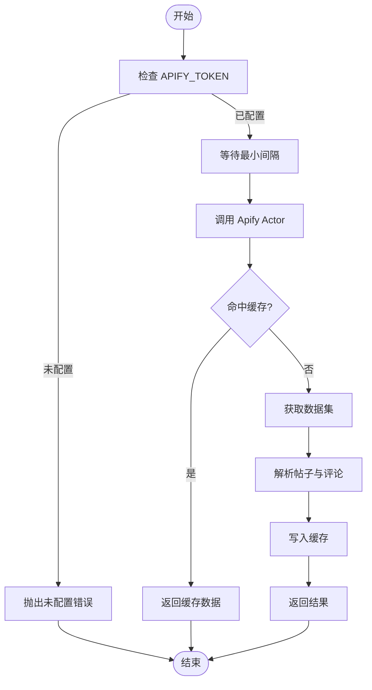
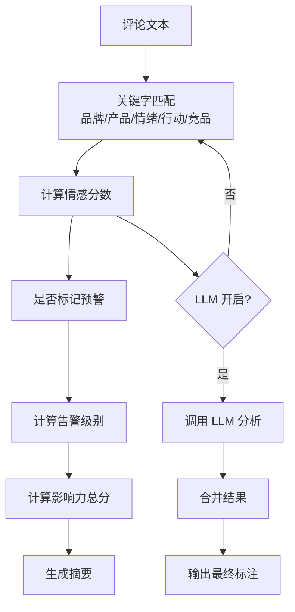
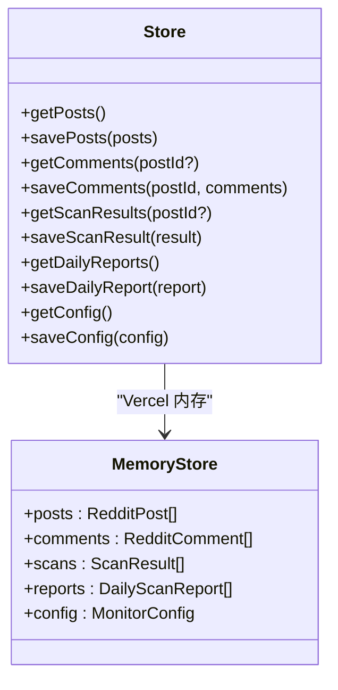
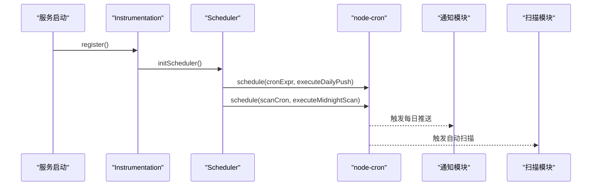
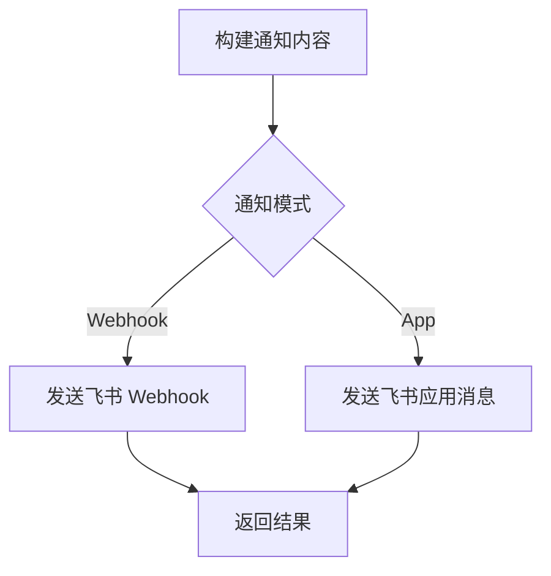
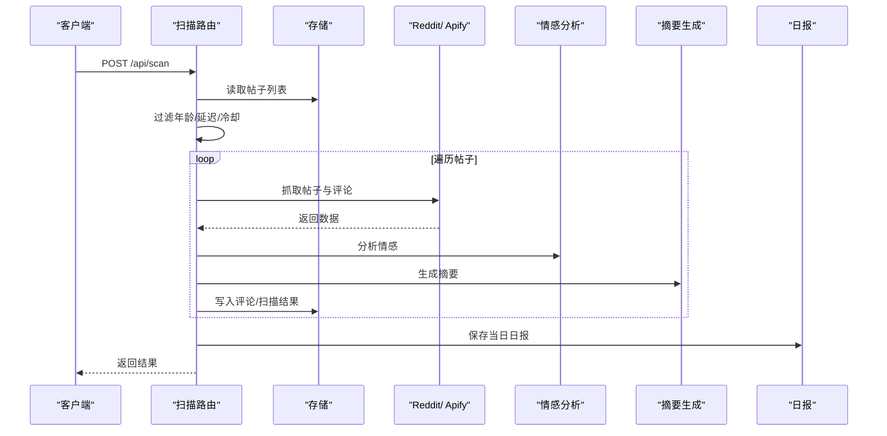
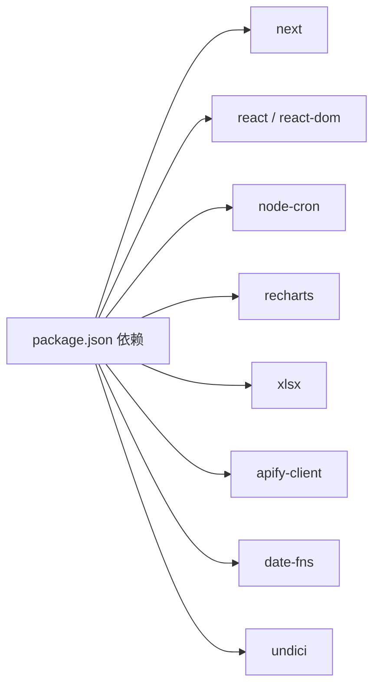

# 维护与监控

<cite>
**本文引用的文件**
- [README.md](file://README.md)
- [package.json](file://package.json)
- [cleanup-data.js](file://cleanup-data.js)
- [compress-comments.js](file://compress-comments.js)
- [src/lib/types.ts](file://src/lib/types.ts)
- [src/lib/reddit.ts](file://src/lib/reddit.ts)
- [src/lib/apify.ts](file://src/lib/apify.ts)
- [src/lib/scheduler.ts](file://src/lib/scheduler.ts)
- [src/lib/store.ts](file://src/lib/store.ts)
- [src/instrumentation.ts](file://src/instrumentation.ts)
- [src/app/api/scan/route.ts](file://src/app/api/scan/route.ts)
- [src/lib/feishu-notify.ts](file://src/lib/feishu-notify.ts)
- [src/lib/llm.ts](file://src/lib/llm.ts)
- [src/lib/sentiment.ts](file://src/lib/sentiment.ts)
- [src/lib/summary.ts](file://src/lib/summary.ts)
</cite>

## 目录
1. [简介](#简介)
2. [项目结构](#项目结构)
3. [核心组件](#核心组件)
4. [架构总览](#架构总览)
5. [组件详解](#组件详解)
6. [依赖关系分析](#依赖关系分析)
7. [性能与容量规划](#性能与容量规划)
8. [故障排查指南](#故障排查指南)
9. [结论](#结论)
10. [附录](#附录)

## 简介
本维护与监控手册面向运维与开发人员，覆盖 Reddit 监控系统的日志管理、性能监控、故障排除、数据清理与归档、健康检查与指标监控、告警机制与通知配置、以及最佳实践与定期维护任务。系统基于 Next.js 构建，采用本地文件存储与内存缓存结合的方式，并通过 Apify 抓取 Reddit 数据，支持基于规则的关键字分析与可选 LLM 情感分析，每日定时推送飞书通知。

## 项目结构
- 应用层：Next.js 页面与 API 路由，负责 UI 展示与后端接口
- 业务逻辑层：扫描、情感分析、摘要生成、通知、调度
- 数据层：本地 JSON 文件持久化（data 目录），Vercel 环境下使用内存存储
- 外部集成：Apify Actor、飞书 Webhook/App、可选 LLM 服务

图表来源
- [src/app/api/scan/route.ts](file://src/app/api/scan/route.ts)
- [src/lib/sentiment.ts](file://src/lib/sentiment.ts)
- [src/lib/llm.ts](file://src/lib/llm.ts)
- [src/lib/summary.ts](file://src/lib/summary.ts)
- [src/lib/feishu-notify.ts](file://src/lib/feishu-notify.ts)
- [src/lib/scheduler.ts](file://src/lib/scheduler.ts)
- [src/lib/store.ts](file://src/lib/store.ts)
- [src/lib/apify.ts](file://src/lib/apify.ts)
- [src/lib/types.ts](file://src/lib/types.ts)

章节来源
- [README.md:1-37](file://README.md#L1-L37)
- [package.json:1-38](file://package.json#L1-L38)

## 核心组件
- 扫描与抓取：从 Reddit 获取帖子与评论，Apify 缓存与限流，速率控制
- 情感分析：关键字规则与 LLM 双通道，支持多提供商
- 存储与缓存：本地 JSON 文件与内存缓存，Vercel 环境下内存存储
- 通知与调度：每日定时推送飞书通知，自动扫描
- 类型与配置：统一的数据结构与监控配置模型

章节来源
- [src/lib/reddit.ts:1-94](file://src/lib/reddit.ts#L1-L94)
- [src/lib/apify.ts:1-280](file://src/lib/apify.ts#L1-L280)
- [src/lib/sentiment.ts:1-398](file://src/lib/sentiment.ts#L1-L398)
- [src/lib/llm.ts:1-338](file://src/lib/llm.ts#L1-L338)
- [src/lib/store.ts:1-285](file://src/lib/store.ts#L1-L285)
- [src/lib/scheduler.ts:1-133](file://src/lib/scheduler.ts#L1-L133)
- [src/lib/feishu-notify.ts:1-482](file://src/lib/feishu-notify.ts#L1-L482)
- [src/lib/types.ts:1-194](file://src/lib/types.ts#L1-L194)

## 架构总览
系统通过 API 路由触发扫描，调用 Apify 获取数据，进行情感分析与摘要生成，更新存储并生成每日报告。定时器在服务启动时初始化，按配置执行每日推送与自动扫描。通知模块根据配置选择 Webhook 或应用消息模式。

图表来源
- [src/app/api/scan/route.ts](file://src/app/api/scan/route.ts)
- [src/lib/apify.ts](file://src/lib/apify.ts)
- [src/lib/store.ts](file://src/lib/store.ts)
- [src/lib/feishu-notify.ts](file://src/lib/feishu-notify.ts)
- [src/lib/scheduler.ts](file://src/lib/scheduler.ts)

## 组件详解

### 扫描与抓取（Apify）
- 功能要点
  - 单帖抓取：通过 neatrat/reddit-scraper，自动代理，限流 2 秒/次
  - 版块抓取：通过 spry_wholemeal/reddit-scraper，住宅代理，限流 2 秒/次
  - 缓存：版块列表 10 分钟 TTL，帖子详情 30 分钟 TTL
  - 错误处理：捕获异常并返回空结果，避免中断
- 性能与稳定性
  - 严格的最小请求间隔与缓存降低 API 压力
  - 限流与重试策略减少 429/超时风险

图表来源
- [src/lib/apify.ts:1-280](file://src/lib/apify.ts#L1-L280)

章节来源
- [src/lib/apify.ts:1-280](file://src/lib/apify.ts#L1-L280)
- [src/lib/reddit.ts:1-94](file://src/lib/reddit.ts#L1-L94)

### 情感分析与告警
- 关键字规则：品牌攻击、产品差评、负面情绪、号召抵制、竞品推荐
- LLM 分析：统一适配 OpenAI、Anthropic、Google、DeepSeek、智谱、Kimi、通义、豆包、Ollama、Custom
- 告警级别：严重、中等、安全（兼容 high→critical，low→safe）
- 影响力评分：基于点赞数与情感强度，仅对负面评论有效

图表来源
- [src/lib/sentiment.ts:1-398](file://src/lib/sentiment.ts#L1-L398)
- [src/lib/llm.ts:1-338](file://src/lib/llm.ts#L1-L338)
- [src/lib/types.ts:1-194](file://src/lib/types.ts#L1-L194)

章节来源
- [src/lib/sentiment.ts:1-398](file://src/lib/sentiment.ts#L1-L398)
- [src/lib/llm.ts:1-338](file://src/lib/llm.ts#L1-L338)
- [src/lib/types.ts:1-194](file://src/lib/types.ts#L1-L194)

### 数据存储与缓存
- 本地存储：data 目录下的 posts.json、comments.json、scans.json、reports.json、config.json
- Vercel 环境：内存存储 + 环境变量覆盖
- 缓存：30 秒 TTL，减少频繁读取大文件
- 文件写入：只在非 Vercel 环境写入，避免只读文件系统

图表来源
- [src/lib/store.ts:1-285](file://src/lib/store.ts#L1-L285)

章节来源
- [src/lib/store.ts:1-285](file://src/lib/store.ts#L1-L285)

### 定时调度与健康检查
- 启动初始化：服务启动时注册定时任务
- 日常推送：按配置时间（HH:MM）转为 Cron 表达式，每日定时发送飞书通知
- 自动扫描：午夜按配置时间触发扫描 API，更新趋势
- 状态查询：提供调度器状态查询接口

图表来源
- [src/instrumentation.ts:1-12](file://src/instrumentation.ts#L1-L12)
- [src/lib/scheduler.ts:1-133](file://src/lib/scheduler.ts#L1-L133)

章节来源
- [src/instrumentation.ts:1-12](file://src/instrumentation.ts#L1-L12)
- [src/lib/scheduler.ts:1-133](file://src/lib/scheduler.ts#L1-L133)

### 通知与告警
- 通知模式：Webhook（群机器人）或 App（应用消息）
- 通知级别：可配置推送的告警级别集合
- 通知内容：健康度评分、情感分布、风险类别、严重帖子清单、系统链接
- 测试能力：支持 Webhook 与 App Token 获取测试

图表来源
- [src/lib/feishu-notify.ts:1-482](file://src/lib/feishu-notify.ts#L1-L482)

章节来源
- [src/lib/feishu-notify.ts:1-482](file://src/lib/feishu-notify.ts#L1-L482)

### API 扫描流程
- 请求参数：postIds、scanAll、quickScan、skipRecentHours
- 年龄过滤：全量扫描时仅扫描最近 3 个月内的帖子
- 智能延迟：根据 nextScanTime 控制扫描频率
- 速率控制：3 秒/次请求，避免 429
- 失败处理：即使失败也更新 lastScanned，避免重复提示
- 日报生成：按天统计并保存

图表来源
- [src/app/api/scan/route.ts](file://src/app/api/scan/route.ts)

章节来源
- [src/app/api/scan/route.ts](file://src/app/api/scan/route.ts)

## 依赖关系分析
- 外部依赖：apify-client、node-cron、recharts、xlsx、date-fns、undici
- 运行时环境：Next.js 16、React 19、TailwindCSS 4
- Vercel 环境变量：FEISHU_WEBHOOK_URL、FEISHU_NOTIFY_TIME、FEISHU_NOTIFY_LEVELS、LLM_*、TUNNEL_URL

图表来源
- [package.json:1-38](file://package.json#L1-L38)

章节来源
- [package.json:1-38](file://package.json#L1-L38)

## 性能与容量规划
- 数据规模控制
  - comments.json：保留最近 5000 条
  - scans.json：保留最近 100 次
  - posts.json：保留最近 500 个帖子
  - competitor-history.json：保留最近 200 条
- 数据压缩
  - 移除 comments.json 中冗余字段，显著降低体积
- 缓存与限流
  - Apify 缓存 10/30 分钟 TTL
  - 请求最小间隔 2 秒，扫描间隔 3 秒
- 存储策略
  - Vercel 环境使用内存存储，避免文件写入
  - 非 Vercel 环境使用本地 JSON 文件，带缓存

章节来源
- [cleanup-data.js:1-94](file://cleanup-data.js#L1-L94)
- [compress-comments.js:1-36](file://compress-comments.js#L1-L36)
- [src/lib/apify.ts:1-280](file://src/lib/apify.ts#L1-L280)
- [src/lib/store.ts:1-285](file://src/lib/store.ts#L1-L285)

## 故障排查指南
- 扫描失败
  - 检查 Reddit 链接有效性与网络连通性
  - 查看扫描 API 返回的错误信息与 lastScanned 更新
  - 减少并发与速率，确认代理可用性
- Apify 未配置
  - 确认 APIFY_TOKEN 环境变量已设置
  - 检查 Actor 权限与配额
- 飞书通知失败
  - Webhook：检查 webhook 地址与权限
  - App：检查 App ID/Secret 与 Token 获取
  - 使用测试接口验证连接
- LLM 分析异常
  - 检查 LLM Provider 配置与 API Key
  - 降低请求频率，避免超时
- 性能问题
  - 运行数据清理脚本，限制历史数据规模
  - 压缩 comments.json，移除冗余字段
  - 检查是否存在多个 Node 进程占用资源

章节来源
- [src/app/api/scan/route.ts](file://src/app/api/scan/route.ts)
- [src/lib/apify.ts:1-280](file://src/lib/apify.ts#L1-L280)
- [src/lib/feishu-notify.ts:1-482](file://src/lib/feishu-notify.ts#L1-L482)
- [src/lib/llm.ts:1-338](file://src/lib/llm.ts#L1-L338)
- [cleanup-data.js:1-94](file://cleanup-data.js#L1-L94)
- [compress-comments.js:1-36](file://compress-comments.js#L1-L36)

## 结论
该系统通过本地/内存存储、Apify 抓取、规则与 LLM 双通道情感分析、定时推送与自动扫描，实现了对 Reddit 的高效监控。运维侧可通过数据清理与压缩、缓存与限流策略、通知与调度配置，保障系统稳定与性能。建议定期执行数据清理、监控通知连通性与 LLM 服务可用性，并根据业务需求调整检测规则与推送策略。

## 附录

### 数据清理与归档
- 运行清理脚本
  - 作用：限制历史数据规模，缓解性能问题
  - 文件：cleanup-data.js
  - 建议：定期执行，重启服务后生效
- 压缩评论数据
  - 作用：移除冗余字段，降低 comments.json 体积
  - 文件：compress-comments.js
  - 建议：在清理后执行，重启服务观察性能变化

章节来源
- [cleanup-data.js:1-94](file://cleanup-data.js#L1-L94)
- [compress-comments.js:1-36](file://compress-comments.js#L1-L36)

### 健康检查与指标监控
- 健康检查
  - 扫描 API：GET /api/scan 查询当前扫描进度
  - 通知测试：调用通知模块测试接口
  - LLM 连通性：调用 LLM 测试接口
- 指标建议
  - 每日严重/中等/安全帖子数量
  - 恶意评论占比与情感分布
  - 扫描耗时与成功率
  - Apify 调用次数与错误率

章节来源
- [src/app/api/scan/route.ts](file://src/app/api/scan/route.ts)
- [src/lib/feishu-notify.ts:1-482](file://src/lib/feishu-notify.ts#L1-L482)
- [src/lib/llm.ts:1-338](file://src/lib/llm.ts#L1-L338)

### 告警机制与通知配置
- 配置项
  - 飞书通知开关、模式、Webhook 地址、推送时间、推送级别
  - LLM 开关、提供商、API Key、模型、基础 URL、温度、最大 Token
  - 扫描计划、自动扫描开关、扫描时间、关键词、情感阈值
- 配置注入
  - Vercel 环境变量覆盖：FEISHU_WEBHOOK_URL、FEISHU_NOTIFY_TIME、FEISHU_NOTIFY_LEVELS、LLM_*、TUNNEL_URL

章节来源
- [src/lib/types.ts:1-194](file://src/lib/types.ts#L1-L194)
- [src/lib/store.ts:1-285](file://src/lib/store.ts#L1-L285)

### 最佳实践与定期维护
- 日常
  - 检查扫描进度与错误日志
  - 验证飞书通知连通性
  - 监控数据文件大小与增长趋势
- 周期性
  - 执行数据清理与压缩
  - 校验 LLM 连通性与费用预算
  - 回顾检测规则与推送级别
- 故障恢复
  - 清理多余 Node 进程
  - 重建缓存与临时文件
  - 回滚配置变更

章节来源
- [cleanup-data.js:1-94](file://cleanup-data.js#L1-L94)
- [compress-comments.js:1-36](file://compress-comments.js#L1-L36)
- [src/lib/store.ts:1-285](file://src/lib/store.ts#L1-L285)