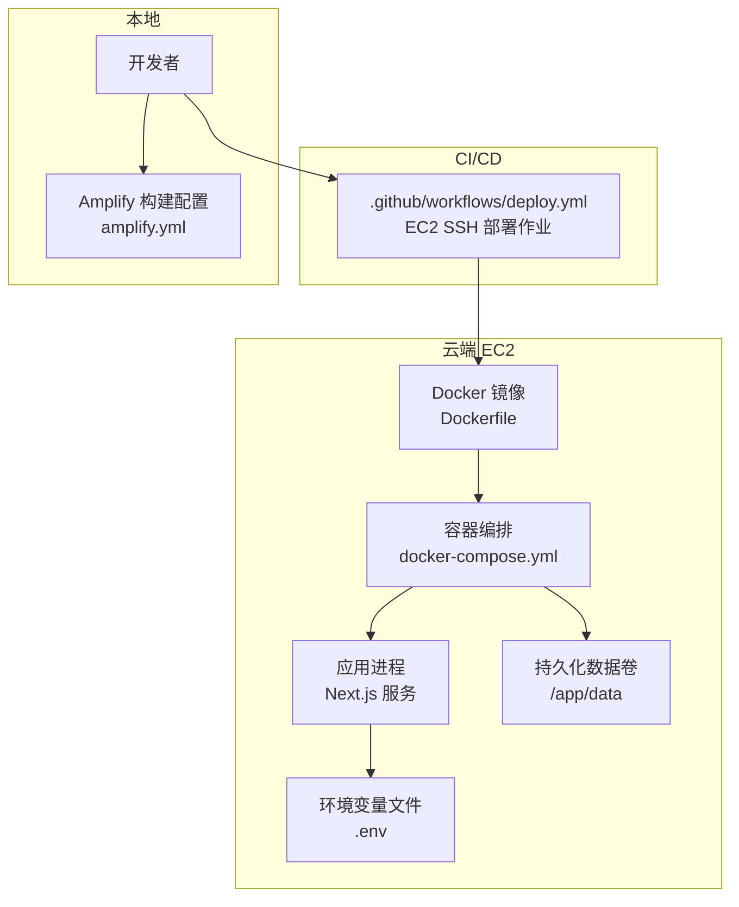
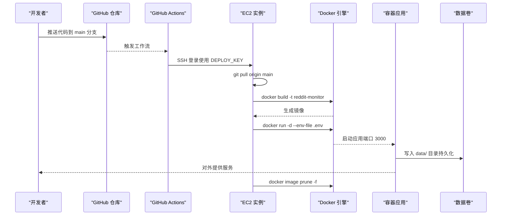
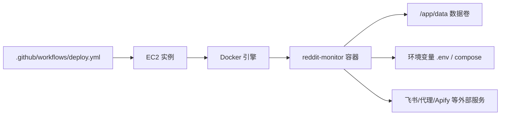
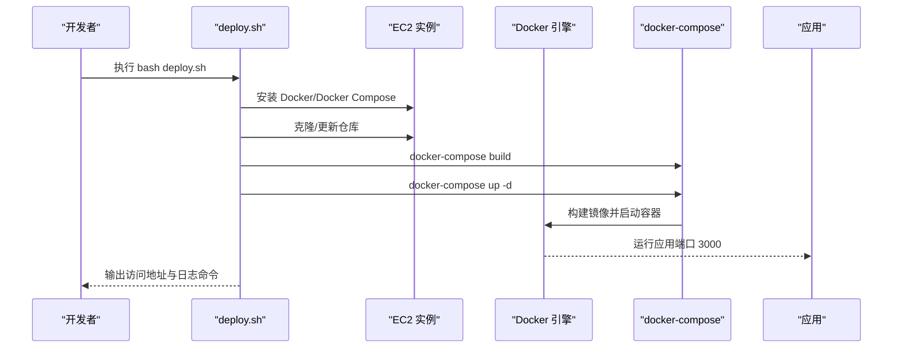
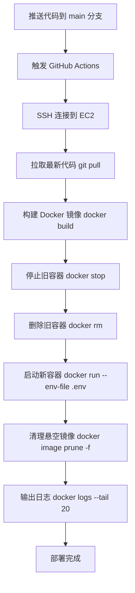

# 云平台部署

<cite>
**本文引用的文件**
- [amplify.yml](file://amplify.yml)
- [.github/workflows/deploy.yml](file://.github/workflows/deploy.yml)
- [deploy.sh](file://deploy.sh)
- [scripts/sync-aws-to-git.sh](file://scripts/sync-aws-to-git.sh)
- [Dockerfile](file://Dockerfile)
- [docker-compose.yml](file://docker-compose.yml)
- [package.json](file://package.json)
- [next.config.ts](file://next.config.ts)
- [src/lib/store.ts](file://src/lib/store.ts)
- [src/lib/types.ts](file://src/lib/types.ts)
- [src/app/layout.tsx](file://src/app/layout.tsx)
- [diagnose-deploy.js](file://diagnose-deploy.js)
</cite>

## 更新摘要
**变更内容**
- 更新 GitHub Actions 部署工作流配置，重命名部署步骤为 "Deploy to EC2 via SSH"
- 新增环境变量文件机制，通过 `--env-file` 参数管理环境变量
- 新增自动清理悬空 Docker 镜像功能
- 改进日志输出和错误处理机制
- 更新部署流程图和相关配置说明

## 目录
1. [简介](#简介)
2. [项目结构](#项目结构)
3. [核心组件](#核心组件)
4. [架构总览](#架构总览)
5. [详细组件分析](#详细组件分析)
6. [依赖关系分析](#依赖关系分析)
7. [性能考虑](#性能考虑)
8. [故障排查指南](#故障排查指南)
9. [结论](#结论)
10. [附录](#附录)

## 简介
本指南面向在云平台上部署 Reddit 监控系统的需求，重点覆盖以下方面：
- AWS Amplify 前端静态构建与缓存策略
- GitHub Actions 自动化部署到 EC2 的完整流程
- 部署脚本的使用方法与关键配置参数
- 环境变量管理与敏感信息注入
- 域名与 SSL 证书的对接建议
- 云资源监控、日志分析与性能优化运维实践

## 项目结构
该仓库采用前端单页应用（Next.js）+ Docker 化服务的组合方式，配合 GitHub Actions 实现自动化部署。关键文件分布如下：
- 前端构建与缓存：amplify.yml
- CI/CD 自动化：.github/workflows/deploy.yml
- 本地/远程一键部署脚本：deploy.sh
- AWS 侧数据回推脚本：scripts/sync-aws-to-git.sh
- 容器化打包：Dockerfile、docker-compose.yml
- 构建与运行配置：package.json、next.config.ts
- 配置加载与环境变量合并：src/lib/store.ts
- 类型与配置模型：src/lib/types.ts
- 页面元数据：src/app/layout.tsx
- 部署诊断工具：diagnose-deploy.js

**图表来源**
- [.github/workflows/deploy.yml:12-48](file://.github/workflows/deploy.yml#L12-L48)
- [Dockerfile:1-41](file://Dockerfile#L1-L41)
- [docker-compose.yml:1-38](file://docker-compose.yml#L1-L38)
- [amplify.yml:1-19](file://amplify.yml#L1-L19)

**章节来源**
- [amplify.yml:1-19](file://amplify.yml#L1-L19)
- [.github/workflows/deploy.yml:1-49](file://.github/workflows/deploy.yml#L1-L49)
- [deploy.sh:1-66](file://deploy.sh#L1-L66)
- [scripts/sync-aws-to-git.sh:1-53](file://scripts/sync-aws-to-git.sh#L1-L53)
- [Dockerfile:1-41](file://Dockerfile#L1-L41)
- [docker-compose.yml:1-38](file://docker-compose.yml#L1-L38)
- [package.json:1-38](file://package.json#L1-L38)
- [next.config.ts:1-28](file://next.config.ts#L1-L28)
- [src/lib/store.ts:235-284](file://src/lib/store.ts#L235-L284)
- [src/lib/types.ts:146-159](file://src/lib/types.ts#L146-L159)
- [src/app/layout.tsx:1-23](file://src/app/layout.tsx#L1-L23)

## 核心组件
- **Amplify 前端构建与缓存**
  - 使用 npm ci 安装依赖，执行 next build，产物输出至 .next 目录，并缓存 node_modules 与 .next/cache。
- **GitHub Actions 自动化部署**
  - 在 ubuntu-latest 机器上通过 SSH 连接 EC2，执行 git pull、docker build、容器运行与清理，**新增环境变量文件机制和悬空镜像清理**。
- **Docker 化运行**
  - 多阶段构建，生产镜像暴露 3000 端口，CMD 启动 node server.js；docker-compose 提供环境变量与数据卷挂载。
- **配置与环境变量**
  - 支持通过 .env 注入敏感信息，也支持在容器启动时通过 --env-file 或环境变量覆盖。
- **数据同步**
  - AWS 侧扫描完成后，将 data/ 下的数据文件推送到 GitHub 主分支，便于本地拉取。

**章节来源**
- [amplify.yml:1-19](file://amplify.yml#L1-L19)
- [.github/workflows/deploy.yml:1-49](file://.github/workflows/deploy.yml#L1-L49)
- [Dockerfile:1-41](file://Dockerfile#L1-L41)
- [docker-compose.yml:1-38](file://docker-compose.yml#L1-L38)
- [src/lib/store.ts:235-284](file://src/lib/store.ts#L235-L284)
- [scripts/sync-aws-to-git.sh:16-34](file://scripts/sync-aws-to-git.sh#L16-L34)

## 架构总览
下图展示了从代码提交到应用上线的关键路径，以及数据持久化与外部服务集成点。

**图表来源**
- [.github/workflows/deploy.yml:12-48](file://.github/workflows/deploy.yml#L12-L48)
- [Dockerfile:22-41](file://Dockerfile#L22-L41)
- [docker-compose.yml:10-28](file://docker-compose.yml#L10-L28)

## 详细组件分析

### AWS Amplify 部署配置
- **构建阶段**
  - preBuild: npm ci 安装依赖
  - build: npm run build 执行 Next.js 构建
- **产物与缓存**
  - artifacts.baseDirectory 指向 .next
  - artifacts.files 包含所有产物
  - cache.paths 缓存 node_modules 与 .next/cache
- **适用场景**
  - 适合将前端静态产物托管于 Amplify，结合后端 API 由独立服务提供。

**章节来源**
- [amplify.yml:1-19](file://amplify.yml#L1-L19)
- [package.json:5-12](file://package.json#L5-L12)

### GitHub Actions 自动化部署流程
- **触发条件**
  - 推送至 main 分支
- **关键步骤**
  - SSH 连接 EC2（主机、用户名、私钥来自 secrets）
  - 拉取最新代码、构建镜像、停止并删除旧容器、以新镜像启动容器、**清理悬空镜像**
  - **新增环境变量文件机制**：通过 --env-file 参数管理环境变量
  - 输出容器状态与最近日志
- **安全要点**
  - DEPLOY_KEY 存储在 GitHub Secrets 中
  - 通过受控的 SSH 访问控制（建议限制来源或使用 bastion）

**更新** 重命名部署步骤为 "Deploy to EC2 via SSH"，新增环境变量文件管理和悬空镜像清理功能

**章节来源**
- [.github/workflows/deploy.yml:1-49](file://.github/workflows/deploy.yml#L1-L49)

### 部署脚本使用方法与参数
- **deploy.sh**
  - 功能：在 EC2 上安装 Docker/Docker Compose，克隆/更新仓库，构建并启动容器，输出访问地址与日志查看方式
  - 参数：无命令行参数，依赖 .env 与 docker-compose.yml 中的环境变量
  - 关键行为：若 .env 不存在则复制示例并提示编辑；通过 docker-compose 控制服务生命周期
- **同步脚本 sync-aws-to-git.sh**
  - 功能：检测 data/ 下数据变更，自动 add/commit/push 到 GitHub 主分支
  - 适用：AWS 扫描完成后回推数据，供本地或其他环境拉取

**章节来源**
- [deploy.sh:1-66](file://deploy.sh#L1-L66)
- [scripts/sync-aws-to-git.sh:16-34](file://scripts/sync-aws-to-git.sh#L16-L34)

### 环境变量管理
- **容器内环境变量**
  - docker-compose.yml 中声明了 FEISHU_WEBHOOK_URL、HTTP_PROXY、HTTPS_PROXY、APIFY_TOKEN、NODE_ENV、DATA_DIR 等
  - **新增**：通过 --env-file /home/ec2-user/reddit/.env 注入（GitHub Actions 已实现）
- **配置合并逻辑**
  - src/lib/store.ts 提供 applyEnvOverrides，在 Vercel 环境下可将环境变量合并进 MonitorConfig
  - 支持 FEISHU_WEBHOOK_URL、LLM_*、TUNNEL_URL 等环境变量覆盖
- **类型与配置模型**
  - src/lib/types.ts 定义了 MonitorConfig、FeishuConfig、LLMConfig、FeishuNotifyConfig 等核心类型

**更新** 新增环境变量文件机制，通过 --env-file 参数管理环境变量

**章节来源**
- [docker-compose.yml:10-25](file://docker-compose.yml#L10-L25)
- [.github/workflows/deploy.yml:37-39](file://.github/workflows/deploy.yml#L37-L39)
- [src/lib/store.ts:235-284](file://src/lib/store.ts#L235-L284)
- [src/lib/types.ts:77-159](file://src/lib/types.ts#L77-L159)

### 域名与 SSL 证书设置
- **域名接入建议**
  - 将自定义域名指向负载均衡器或反向代理（如 Nginx/Traefik），再将请求转发至容器 3000 端口
- **SSL 证书**
  - 通过 ACM（Amazon Certificate Manager）申请免费证书，绑定到 ALB/CloudFront/Nginx
  - 若使用反向代理，可在其层面对证书进行统一管理与续期
- **注意事项**
  - 确保安全组放行 80/443 端口
  - 如需强制 HTTPS，可在反向代理或应用层配置重定向规则

（本节为通用运维建议，不直接对应具体源码文件）

### 容器化与运行时配置
- **Dockerfile**
  - 多阶段构建：builder 安装依赖并构建，runner 仅复制运行所需文件
  - EXPOSE 3000，ENV 设置 HOSTNAME 与 PORT
  - CMD 启动 node server.js
- **docker-compose.yml**
  - 暴露 3000:3000，挂载数据卷与可选 node_modules 卷
  - 通过环境变量注入飞书、代理、Apify 等配置

**章节来源**
- [Dockerfile:1-41](file://Dockerfile#L1-L41)
- [docker-compose.yml:1-38](file://docker-compose.yml#L1-L38)

### 构建与优化配置
- **next.config.ts**
  - output: 'standalone' 适配独立运行
  - allowedDevOrigins 限定开发源
  - webpack 与 experimental 优化项提升开发体验与内存使用
- **package.json**
  - 提供 dev/build/start/lint/clean 等常用脚本

**章节来源**
- [next.config.ts:1-28](file://next.config.ts#L1-L28)
- [package.json:5-12](file://package.json#L5-L12)

### 配置加载与类型模型
- **src/lib/store.ts**
  - 在非 Vercel 环境读取本地 JSON 配置文件；在 Vercel 环境下将环境变量合并进配置
- **src/lib/types.ts**
  - 定义了监控配置、飞书配置、通知配置、检测规则、LLM 配置等类型

**章节来源**
- [src/lib/store.ts:235-284](file://src/lib/store.ts#L235-L284)
- [src/lib/types.ts:146-159](file://src/lib/types.ts#L146-L159)

## 依赖关系分析
- **组件耦合**
  - GitHub Actions 依赖 EC2 的 SSH 权限与 Docker 环境
  - 容器运行依赖 .env 与 docker-compose.yml 中的环境变量
  - 应用配置可由环境变量覆盖，体现松耦合设计
- **外部依赖**
  - 飞书 Webhook/应用消息、Apify Token、代理服务（可选）
- **潜在风险**
  - SSH 私钥泄露、安全组放行范围过大、容器日志未集中采集

**图表来源**
- [.github/workflows/deploy.yml:12-48](file://.github/workflows/deploy.yml#L12-L48)
- [docker-compose.yml:10-28](file://docker-compose.yml#L10-L28)
- [Dockerfile:22-41](file://Dockerfile#L22-L41)

**章节来源**
- [.github/workflows/deploy.yml:1-49](file://.github/workflows/deploy.yml#L1-L49)
- [docker-compose.yml:1-38](file://docker-compose.yml#L1-L38)
- [Dockerfile:1-41](file://Dockerfile#L1-L41)

## 性能考虑
- **构建性能**
  - 使用 Amplify 的缓存策略减少重复安装依赖与重建 .next 缓存
  - 在 CI 中复用缓存，避免每次全量安装
- **运行性能**
  - 使用 standalone 输出，减少运行时体积
  - 控制并发与内存使用，避免开发模式下的过度优化导致资源占用过高
- **网络与代理**
  - 如需访问受限网络，配置 HTTP_PROXY/HTTPS_PROXY
  - 合理选择代理节点，降低请求延迟
- **镜像管理**
  - **新增**：定期清理悬空镜像，释放磁盘空间，提高系统性能

**更新** 新增镜像管理性能考虑

**章节来源**
- [amplify.yml:15-18](file://amplify.yml#L15-L18)
- [next.config.ts:7-21](file://next.config.ts#L7-L21)
- [docker-compose.yml:14-16](file://docker-compose.yml#L14-L16)

## 故障排查指南
- **常见问题定位**
  - Actions 失败：检查 DEPLOY_KEY 是否正确、EC2 安全组是否放行 22 端口、EC2 是否安装 Git/Docker
  - 容器启动失败：查看 docker logs reddit-monitor --tail 20，确认 .env 与环境变量是否正确
  - 数据未持久化：确认 /app/data 卷是否挂载成功
  - **新增**：镜像空间不足：执行 docker image prune -f 清理悬空镜像
- **诊断工具**
  - diagnose-deploy.js 提供 Actions 触发条件、部署流程检查与常见问题建议
- **数据同步**
  - AWS 侧执行 scripts/sync-aws-to-git.sh，确保 data/ 下数据变更被推送到 GitHub

**更新** 新增镜像清理和环境变量文件相关故障排查

**章节来源**
- [.github/workflows/deploy.yml:47-48](file://.github/workflows/deploy.yml#L47-L48)
- [diagnose-deploy.js:50-70](file://diagnose-deploy.js#L50-L70)
- [scripts/sync-aws-to-git.sh:16-34](file://scripts/sync-aws-to-git.sh#L16-L34)

## 结论
本指南提供了基于 Amplify 与 GitHub Actions 的云平台部署方案，涵盖前端构建、CI/CD 自动化、容器化运行、环境变量管理与数据同步。结合本文提供的监控、日志与性能优化建议，可帮助团队稳定地交付与维护 Reddit 监控系统。**新增的环境变量文件机制和悬空镜像清理功能进一步提升了部署的安全性和系统维护效率**。

## 附录

### 部署脚本调用序列

**图表来源**
- [deploy.sh:10-46](file://deploy.sh#L10-L46)
- [docker-compose.yml:4-31](file://docker-compose.yml#L4-L31)

### GitHub Actions 部署流程图

**更新** 新增环境变量文件和镜像清理步骤

**图表来源**
- [.github/workflows/deploy.yml:12-48](file://.github/workflows/deploy.yml#L12-L48)