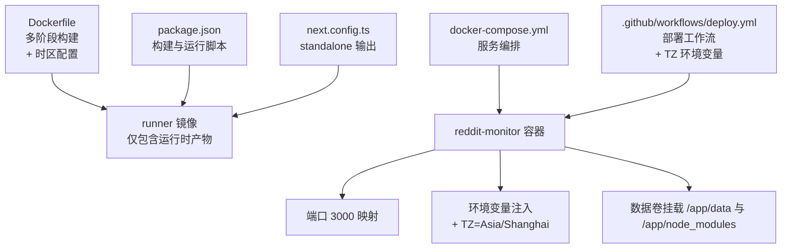
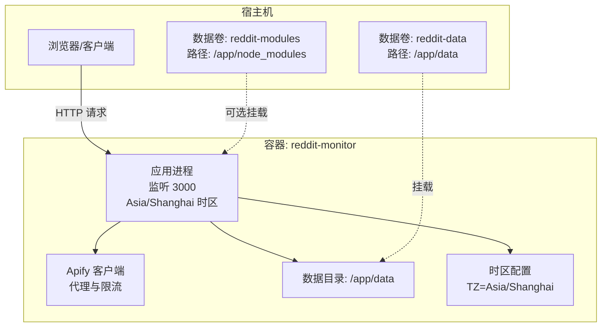
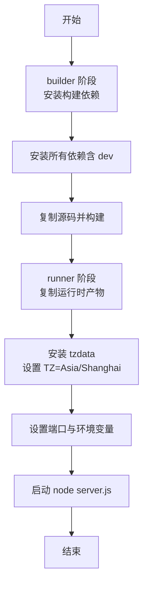
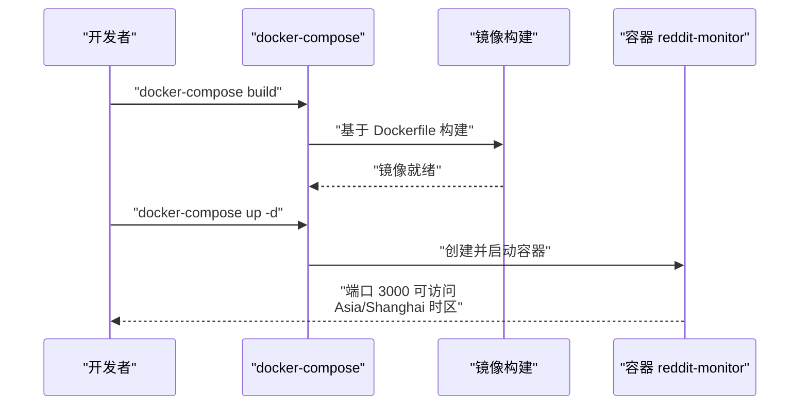
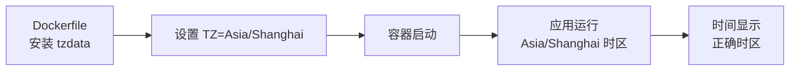
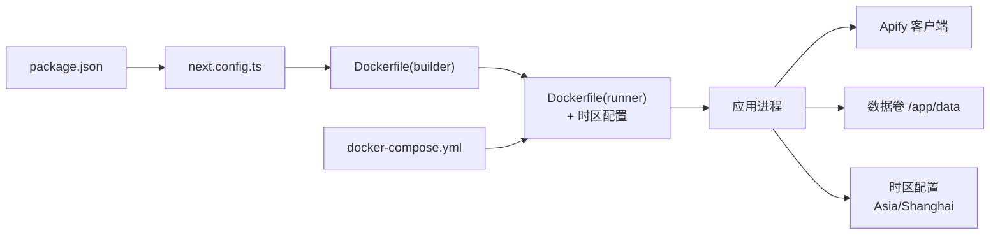

# 容器化部署

<cite>
**本文引用的文件**
- [Dockerfile](file://Dockerfile)
- [docker-compose.yml](file://docker-compose.yml)
- [.github/workflows/deploy.yml](file://.github/workflows/deploy.yml)
- [package.json](file://package.json)
- [next.config.ts](file://next.config.ts)
- [deploy.sh](file://deploy.sh)
- [cleanup-data.js](file://cleanup-data.js)
- [test-scan.js](file://test-scan.js)
- [src/lib/apify.ts](file://src/lib/apify.ts)
- [src/lib/reddit.ts](file://src/lib/reddit.ts)
</cite>

## 更新摘要
**所做更改**
- 新增时区配置支持章节，涵盖 Dockerfile 中的 tzdata 安装和 TZ 环境变量设置
- 更新 Docker 镜像构建部分，反映时区配置的实施细节
- 更新 GitHub Actions 部署工作流配置，包含 TZ 环境变量的设置
- 增强环境变量传递与应用集成章节，说明时区配置对应用的影响

## 目录
1. [简介](#简介)
2. [项目结构](#项目结构)
3. [核心组件](#核心组件)
4. [架构总览](#架构总览)
5. [详细组件分析](#详细组件分析)
6. [时区配置支持](#时区配置支持)
7. [依赖关系分析](#依赖关系分析)
8. [性能考量](#性能考量)
9. [故障排查指南](#故障排查指南)
10. [结论](#结论)
11. [附录](#附录)

## 简介
本指南面向 Reddit 监控系统的容器化部署与运维，覆盖 Docker 镜像构建（含多阶段构建）、环境变量传递、docker-compose 编排、容器启动与日志查看、数据卷挂载、以及高级配置如健康检查与自动重启策略。文档同时结合项目实际代码与脚本，给出可执行的操作步骤与最佳实践。**新增**时区配置支持，确保容器化部署的一致时区行为。

## 项目结构
该仓库采用 Next.js 应用，配合 Apify 服务进行 Reddit 数据抓取，并通过 Docker 与 docker-compose 实现一键编排与部署。关键文件与职责如下：
- Dockerfile：定义多阶段构建流程，先在 builder 阶段安装依赖并构建前端产物，再在 runner 阶段仅拷贝运行所需文件，最终以 node server.js 启动。**新增**时区配置支持。
- docker-compose.yml：定义服务、端口映射、环境变量、数据卷与重启策略；默认暴露 3000 端口，挂载 /app/data 与 /app/node_modules。
- .github/workflows/deploy.yml：GitHub Actions 部署工作流，包含时区环境变量设置。
- package.json：声明构建脚本与运行脚本，生产环境使用 next start。
- next.config.ts：启用 standalone 输出模式，适配多阶段构建与独立运行。
- deploy.sh：自动化部署脚本，包含安装 Docker/Docker Compose、克隆仓库、构建与启动容器、查看状态与日志等。
- src/lib/apify.ts 与 src/lib/reddit.ts：封装 Apify 客户端调用、代理与限流逻辑，供应用 API 层使用。

**图表来源**
- [Dockerfile:1-45](file://Dockerfile#L1-L45)
- [docker-compose.yml:1-38](file://docker-compose.yml#L1-L38)
- [.github/workflows/deploy.yml:1-50](file://.github/workflows/deploy.yml#L1-L50)
- [package.json:1-38](file://package.json#L1-L38)
- [next.config.ts:1-28](file://next.config.ts#L1-L28)

**章节来源**
- [Dockerfile:1-45](file://Dockerfile#L1-L45)
- [docker-compose.yml:1-38](file://docker-compose.yml#L1-L38)
- [.github/workflows/deploy.yml:1-50](file://.github/workflows/deploy.yml#L1-L50)
- [package.json:1-38](file://package.json#L1-L38)
- [next.config.ts:1-28](file://next.config.ts#L1-L28)

## 核心组件
- 多阶段 Dockerfile
  - builder 阶段：安装 Python3/make/g++ 等构建依赖，安装所有依赖（含 devDependencies），复制源码并执行 next build --webpack，生成 standalone 产物。
  - runner 阶段：仅复制 public、.next/standalone、.next/static、data 目录，设置工作目录与端口，设置默认环境变量 PORT=3000、HOSTNAME=0.0.0.0，**新增**安装 tzdata 并设置 TZ=Asia/Shanghai 环境变量，CMD 启动 node server.js。
- docker-compose 编排
  - 服务名：reddit-monitor；容器名：reddit-monitor；端口映射：3000:3000；重启策略：unless-stopped。
  - 环境变量：飞书 Webhook、HTTP_PROXY/HTTPS_PROXY、APIFY_TOKEN、NODE_ENV=production、DATA_DIR=/app/data。
  - 数据卷：reddit-data（持久化 data 目录）、reddit-modules（可选持久化 node_modules）。
- 运行时配置
  - next.config.ts 启用 output: 'standalone'，确保 .next/standalone 可直接运行。
  - package.json 提供 build/start 脚本，生产环境由 Docker CMD 启动 server.js。

**章节来源**
- [Dockerfile:1-45](file://Dockerfile#L1-L45)
- [docker-compose.yml:1-38](file://docker-compose.yml#L1-L38)
- [next.config.ts:1-28](file://next.config.ts#L1-L28)
- [package.json:1-38](file://package.json#L1-L38)

## 架构总览
下图展示容器化部署的整体交互：客户端访问宿主机 3000 端口，容器内应用监听 3000 端口并通过 Apify 抓取 Reddit 数据，数据持久化至宿主机卷。**新增**时区配置确保应用在 Asia/Shanghai 时区下运行。

**图表来源**
- [docker-compose.yml:1-38](file://docker-compose.yml#L1-L38)
- [Dockerfile:22-45](file://Dockerfile#L22-L45)
- [src/lib/apify.ts:1-280](file://src/lib/apify.ts#L1-L280)

## 详细组件分析

### Docker 镜像构建与多阶段配置
- 构建阶段（builder）
  - 基础镜像：node:22-alpine
  - 工作目录：/app
  - 安装构建依赖：python3/make/g++
  - 安装依赖：npm ci（包含 devDependencies）
  - 构建命令：npx next build --webpack
- 运行阶段（runner）
  - 基础镜像：node:22-alpine
  - 工作目录：/app
  - **新增**时区配置：安装 tzdata 包并设置 ENV TZ=Asia/Shanghai
  - 仅复制：public、.next/standalone、.next/static、data
  - 端口与环境：EXPOSE 3000；ENV PORT=3000；ENV HOSTNAME=0.0.0.0
  - 启动命令：CMD ["node", "server.js"]

**图表来源**
- [Dockerfile:1-45](file://Dockerfile#L1-L45)

**章节来源**
- [Dockerfile:1-45](file://Dockerfile#L1-L45)

### docker-compose.yml 参数详解与容器编排
- 服务定义
  - build: . 表示在当前目录构建镜像
  - container_name: 容器名为 reddit-monitor
  - restart: unless-stopped，异常退出时自动重启
  - ports: 将宿主机 3000 映射到容器 3000
- environment：环境变量注入
  - FEISHU_WEBHOOK_URL：飞书通知 webhook 地址
  - HTTP_PROXY/HTTPS_PROXY：代理配置（Decodo 住宅代理）
  - APIFY_TOKEN：Apify 访问令牌
  - NODE_ENV=production：生产环境
  - DATA_DIR=/app/data：数据目录路径
- volumes：数据卷挂载
  - reddit-data：持久化 /app/data（评论、帖子、配置等）
  - reddit-modules：可选持久化 /app/node_modules（加速二次构建）

**图表来源**
- [docker-compose.yml:1-38](file://docker-compose.yml#L1-L38)
- [Dockerfile:1-45](file://Dockerfile#L1-L45)

**章节来源**
- [docker-compose.yml:1-38](file://docker-compose.yml#L1-L38)

### 环境变量传递与应用集成
- 飞书通知：FEISHU_WEBHOOK_URL 用于外部通知集成
- 代理：HTTP_PROXY/HTTPS_PROXY 用于网络访问控制
- Apify：APIFY_TOKEN 用于调用 Apify Actor 抓取 Reddit 数据
- 应用：NODE_ENV=production 控制运行模式；DATA_DIR=/app/data 指定数据存储位置
- 运行时：PORT=3000、HOSTNAME=0.0.0.0 由 Dockerfile 设置，确保容器内监听 0.0.0.0 并暴露 3000
- **新增**时区：TZ=Asia/Shanghai 确保应用在东八区时间下运行，适用于中国用户的时间显示需求

**章节来源**
- [docker-compose.yml:10-26](file://docker-compose.yml#L10-L26)
- [Dockerfile:27-29](file://Dockerfile#L27-L29)

### 数据卷挂载与持久化
- /app/data：持久化评论、帖子、扫描记录、配置等数据
- /app/node_modules（可选）：持久化依赖以提升二次构建速度
- 建议：在生产环境中为 reddit-data 卷配置稳定的本地驱动或云盘，避免容器重建导致数据丢失

**章节来源**
- [docker-compose.yml:26-31](file://docker-compose.yml#L26-L31)

### 容器启动、日志查看与停止
- 启动：docker-compose up -d
- 查看状态：docker-compose ps
- 查看日志：docker-compose logs -f
- 重启：docker-compose restart
- 停止：docker-compose down

**章节来源**
- [deploy.sh:41-66](file://deploy.sh#L41-L66)

### 高级配置建议
- 健康检查：可在 docker-compose 中添加 healthcheck，探测 /api/health 或 /api/connectivity 接口，失败则触发重启
- 自动重启：restart: unless-stopped 已满足大多数场景
- 资源限制：可添加 deploy.resources.limits.cpus/memory 限制资源占用
- 网络隔离：如需与宿主机其他服务隔离，可自定义 networks 并将服务加入同一网络
- **新增**时区一致性：确保所有部署环境（本地开发、CI/CD、生产环境）使用相同的时区配置，避免时间显示不一致的问题

说明：以上为通用最佳实践建议，未在现有配置中直接体现，可根据需要扩展 docker-compose.yml。

## 时区配置支持

### Dockerfile 中的时区配置
在 Dockerfile 的 runner 阶段，新增了完整的时区配置支持：

- **时区数据安装**：通过 `apk add --no-cache tzdata` 安装时区数据库
- **时区环境变量**：设置 `ENV TZ=Asia/Shanghai` 确保应用在东八区时间下运行
- **时区生效机制**：tzdata 包含完整的时区数据库，TZ 环境变量指示系统使用指定时区

### GitHub Actions 部署工作流中的时区配置
在 .github/workflows/deploy.yml 中，部署工作流也包含了时区配置：

- **容器启动时设置**：在 `sudo docker run` 命令中添加 `-e TZ=Asia/Shanghai` 参数
- **环境变量传递**：通过 `--env-file` 和 `-e` 参数确保时区配置在部署过程中生效
- **一致性保证**：CI/CD 环境与生产环境使用相同的时区配置

### 时区配置的应用影响
- **时间显示一致性**：确保应用中的时间戳、日志记录、调度任务等都使用 Asia/Shanghai 时区
- **用户体验优化**：对于中国用户，应用显示的时间更符合本地用户的预期
- **数据处理准确性**：定时任务、数据归档等操作基于正确的时区进行

**图表来源**
- [Dockerfile:27-29](file://Dockerfile#L27-L29)
- [.github/workflows/deploy.yml:39](file://.github/workflows/deploy.yml#L39)

**章节来源**
- [Dockerfile:27-29](file://Dockerfile#L27-L29)
- [.github/workflows/deploy.yml:39](file://.github/workflows/deploy.yml#L39)

## 依赖关系分析
- 构建链路
  - package.json -> next.config.ts -> Dockerfile(builder) -> runner
- 运行链路
  - docker-compose.yml -> Dockerfile(runner) -> 应用进程 -> Apify 客户端
- 数据流
  - 容器内应用写入 /app/data，宿主机卷持久化
- **新增**时区链路
  - Dockerfile(runner) -> tzdata 包 -> TZ 环境变量 -> 应用时区设置

**图表来源**
- [package.json:1-38](file://package.json#L1-L38)
- [next.config.ts:1-28](file://next.config.ts#L1-L28)
- [Dockerfile:1-45](file://Dockerfile#L1-L45)
- [docker-compose.yml:1-38](file://docker-compose.yml#L1-L38)

**章节来源**
- [package.json:1-38](file://package.json#L1-L38)
- [next.config.ts:1-28](file://next.config.ts#L1-L28)
- [Dockerfile:1-45](file://Dockerfile#L1-L45)
- [docker-compose.yml:1-38](file://docker-compose.yml#L1-L38)

## 性能考量
- 多阶段构建：仅复制运行时必需文件，减小镜像体积，提升启动速度
- standalone 输出：配合 .next/standalone，减少运行时依赖
- 代理与限流：Apify 层面已实现限流与代理配置，避免触发速率限制
- 数据清理：提供数据清理脚本，建议定期清理历史数据，保持数据规模可控
- **新增**时区性能：tzdata 包体积较小，对整体镜像大小影响微乎其微，但确保了时区功能的完整性和准确性

**章节来源**
- [Dockerfile:22-45](file://Dockerfile#L22-L45)
- [next.config.ts:5](file://next.config.ts#L5)
- [src/lib/apify.ts:37-50](file://src/lib/apify.ts#L37-L50)
- [cleanup-data.js:1-94](file://cleanup-data.js#L1-L94)

## 故障排查指南
- 容器无法启动
  - 检查端口占用：宿主机 3000 是否被占用
  - 查看日志：docker-compose logs -f
  - 重启容器：docker-compose restart
- 环境变量未生效
  - 确认 docker-compose.yml 中 environment 字段已正确设置
  - 确认 DATA_DIR=/app/data 已挂载到 reddit-data 卷
  - **新增**检查时区配置：确认 TZ 环境变量已正确设置为 Asia/Shanghai
- Apify 抓取失败
  - 检查 APIFY_TOKEN 是否配置
  - 检查代理配置（HTTP_PROXY/HTTPS_PROXY）是否正确
  - 观察应用日志中的错误信息
- 数据量过大导致性能问题
  - 使用数据清理脚本定期清理历史数据
  - 调整保留条目数量以适应业务需求
- **新增**时区相关问题
  - 检查容器内时区：进入容器执行 `date` 命令确认当前时区
  - 验证时区包安装：确认 `/usr/share/zoneinfo/Asia/Shanghai` 文件存在
  - 检查环境变量：确认 `echo $TZ` 输出为 Asia/Shanghai

**章节来源**
- [docker-compose.yml:10-26](file://docker-compose.yml#L10-L26)
- [src/lib/apify.ts:9-66](file://src/lib/apify.ts#L9-L66)
- [cleanup-data.js:1-94](file://cleanup-data.js#L1-L94)

## 结论
通过多阶段 Dockerfile 与 docker-compose 编排，Reddit 监控系统实现了简洁、可复用且易于维护的容器化部署。**新增**的时区配置支持确保了应用在 Asia/Shanghai 时区下的准确运行，提升了用户体验和数据处理的准确性。结合环境变量注入、数据卷持久化与自动重启策略，可在生产环境中稳定运行。建议进一步引入健康检查与资源限制，以增强可观测性与稳定性。

## 附录

### 常用操作清单
- 构建镜像：docker-compose build
- 启动服务：docker-compose up -d
- 查看状态：docker-compose ps
- 查看日志：docker-compose logs -f
- 重启服务：docker-compose restart
- 停止服务：docker-compose down

**章节来源**
- [deploy.sh:41-66](file://deploy.sh#L41-L66)

### API 调试参考
- 可使用 test-scan.js 对本地 API 进行简单调试，验证扫描接口可用性与响应格式

**章节来源**
- [test-scan.js:1-39](file://test-scan.js#L1-L39)

### 时区配置验证方法
- **容器内验证**：进入容器执行 `date` 命令，确认输出显示 Asia/Shanghai 时区
- **环境变量检查**：执行 `echo $TZ` 确认时区环境变量设置正确
- **时区文件验证**：检查 `/usr/share/zoneinfo/Asia/Shanghai` 文件是否存在
- **应用层面验证**：查看应用日志中的时间戳格式是否符合预期

**章节来源**
- [Dockerfile:27-29](file://Dockerfile#L27-L29)
- [.github/workflows/deploy.yml:39](file://.github/workflows/deploy.yml#L39)