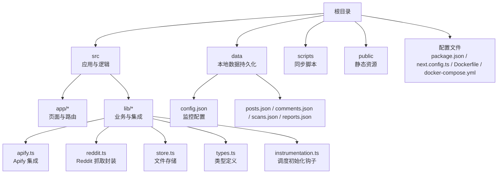
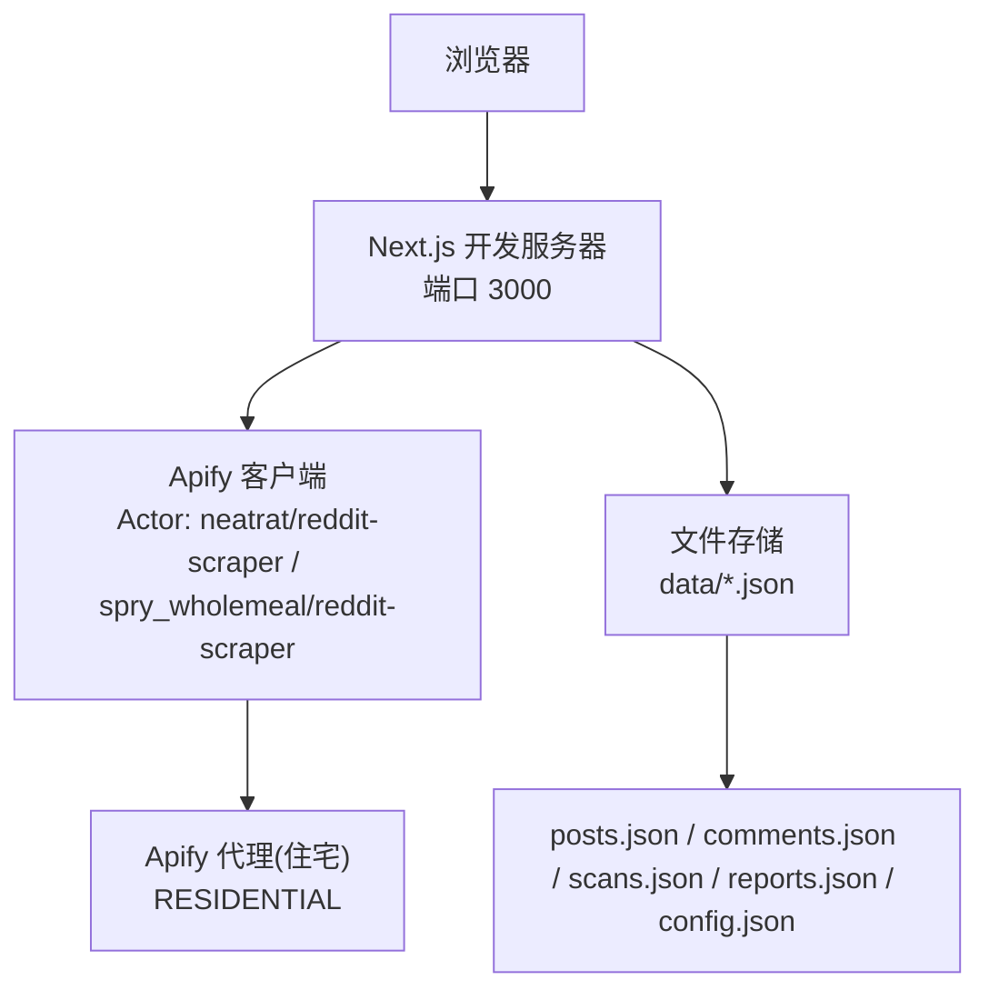
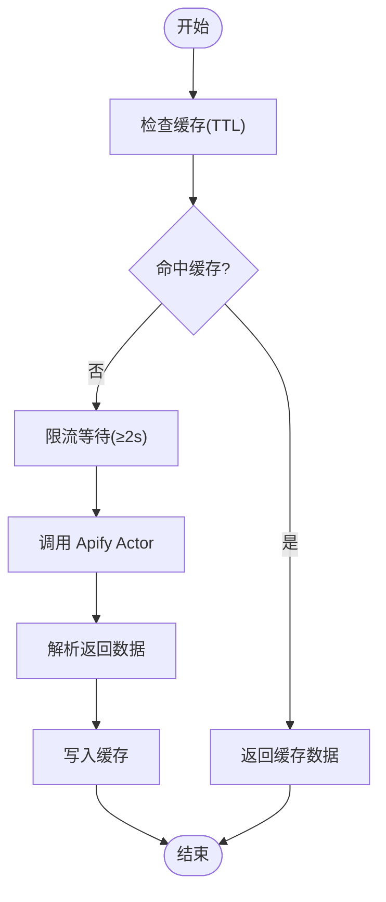
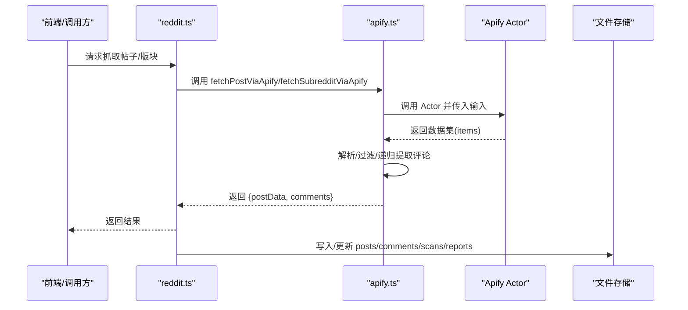
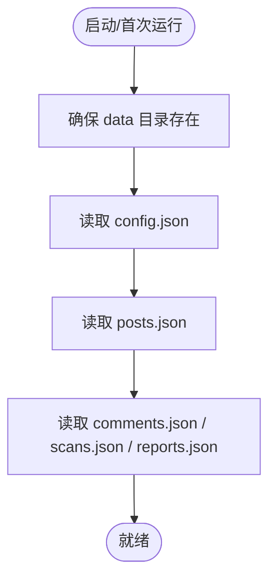
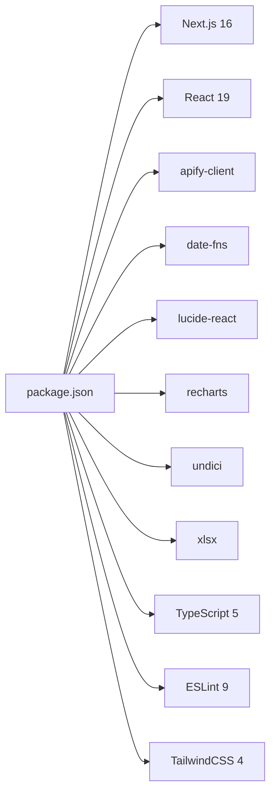

# 本地部署

<cite>
**本文引用的文件**   
- [package.json](file://package.json)
- [README.md](file://README.md)
- [next.config.ts](file://next.config.ts)
- [Dockerfile](file://Dockerfile)
- [docker-compose.yml](file://docker-compose.yml)
- [start-dev.ps1](file://start-dev.ps1)
- [start-dev.bat](file://start-dev.bat)
- [start.ps1](file://start.ps1)
- [src/lib/apify.ts](file://src/lib/apify.ts)
- [src/lib/reddit.ts](file://src/lib/reddit.ts)
- [src/lib/store.ts](file://src/lib/store.ts)
- [src/lib/types.ts](file://src/lib/types.ts)
- [src/instrumentation.ts](file://src/instrumentation.ts)
- [data/config.json](file://data/config.json)
- [data/posts.json](file://data/posts.json)
</cite>

## 目录
1. [简介](#简介)
2. [项目结构](#项目结构)
3. [核心组件](#核心组件)
4. [架构总览](#架构总览)
5. [详细组件分析](#详细组件分析)
6. [依赖关系分析](#依赖关系分析)
7. [性能考虑](#性能考虑)
8. [故障排查指南](#故障排查指南)
9. [结论](#结论)
10. [附录](#附录)

## 简介
本指南面向希望在本地部署 Reddit 监控系统的开发者，覆盖从环境准备、依赖安装、环境变量配置，到开发服务器启动、调试技巧、数据初始化、数据库（文件存储）连接、代理设置，以及常见问题与性能优化建议。系统基于 Next.js 16，采用文件型数据持久化（data 目录），并通过 Apify Actor 实现 Reddit 数据抓取。

## 项目结构
- 根目录包含前端应用、API 路由、工具脚本与容器化配置。
- 关键运行时配置位于 next.config.ts；Dockerfile 与 docker-compose.yml 支持容器化部署。
- 开发启动脚本提供 Windows 环境下的便捷启动与端口/进程清理能力。
- 数据层通过 src/lib/store.ts 以文件方式持久化至 data 目录，支持 Vercel 环境下的内存存储。

**图表来源**
- [next.config.ts:1-28](file://next.config.ts#L1-L28)
- [Dockerfile:1-41](file://Dockerfile#L1-L41)
- [docker-compose.yml:1-38](file://docker-compose.yml#L1-L38)
- [src/lib/store.ts:1-285](file://src/lib/store.ts#L1-L285)
- [data/config.json:1-57](file://data/config.json#L1-L57)
- [data/posts.json:1-816](file://data/posts.json#L1-L816)

**章节来源**
- [next.config.ts:1-28](file://next.config.ts#L1-L28)
- [Dockerfile:1-41](file://Dockerfile#L1-L41)
- [docker-compose.yml:1-38](file://docker-compose.yml#L1-L38)

## 核心组件
- Apify 集成：负责调用 Apify Actor 抓取 Reddit 帖子与评论，并内置缓存与限流策略。
- Reddit 抓取封装：统一对外暴露抓取接口，支持单贴与版块抓取。
- 文件存储：在本地以 JSON 文件形式持久化帖子、评论、扫描结果与报表；在 Vercel 环境下使用内存存储。
- 类型系统：定义了告警等级、评论、扫描结果、每日报告、飞书配置、LLM 配置等核心类型。
- 调度初始化：通过 Next.js instrumentation 在服务启动时初始化定时任务。

**章节来源**
- [src/lib/apify.ts:1-280](file://src/lib/apify.ts#L1-L280)
- [src/lib/reddit.ts:1-94](file://src/lib/reddit.ts#L1-L94)
- [src/lib/store.ts:1-285](file://src/lib/store.ts#L1-L285)
- [src/lib/types.ts:1-194](file://src/lib/types.ts#L1-L194)
- [src/instrumentation.ts:1-12](file://src/instrumentation.ts#L1-L12)

## 架构总览
本地开发采用“浏览器 → Next.js 开发服务器 → Apify Actor → 本地文件存储”的链路。Apify 请求通过 Actor 自带代理（住宅代理）进行抓取，抓取结果经解析后写入 data 目录中的 JSON 文件。

**图表来源**
- [src/lib/apify.ts:95-98](file://src/lib/apify.ts#L95-L98)
- [src/lib/apify.ts:106-176](file://src/lib/apify.ts#L106-L176)
- [src/lib/apify.ts:184-279](file://src/lib/apify.ts#L184-L279)
- [src/lib/store.ts:12-17](file://src/lib/store.ts#L12-L17)

## 详细组件分析

### Apify 集成与限流缓存
- 缓存策略：对版块列表与帖子详情分别设置 TTL，命中缓存时直接返回，降低请求频率。
- 限流策略：请求间隔最小 2 秒，避免触发 Apify 或 Reddit 的速率限制。
- 代理配置：版块抓取使用 Apify 住宅代理组，确保稳定性与匿名性。
- 错误处理：捕获异常并记录日志，保证抓取流程健壮性。

**图表来源**
- [src/lib/apify.ts:23-35](file://src/lib/apify.ts#L23-L35)
- [src/lib/apify.ts:41-50](file://src/lib/apify.ts#L41-L50)
- [src/lib/apify.ts:106-176](file://src/lib/apify.ts#L106-L176)
- [src/lib/apify.ts:184-279](file://src/lib/apify.ts#L184-L279)

**章节来源**
- [src/lib/apify.ts:1-280](file://src/lib/apify.ts#L1-L280)

### Reddit 抓取封装
- 单贴抓取：通过 neatrat/reddit-scraper 精确抓取指定 URL 的帖子与评论。
- 版块抓取：通过 spry_wholemeal/reddit-scraper 获取版块热门/新帖/周榜等列表。
- 速率控制：序列化抓取，避免并发过高导致限流。
- 失败降级：当 Apify 未配置或返回空时，返回空结果并记录警告。

**图表来源**
- [src/lib/reddit.ts:10-85](file://src/lib/reddit.ts#L10-L85)
- [src/lib/apify.ts:106-176](file://src/lib/apify.ts#L106-L176)
- [src/lib/apify.ts:184-279](file://src/lib/apify.ts#L184-L279)
- [src/lib/store.ts:99-173](file://src/lib/store.ts#L99-L173)

**章节来源**
- [src/lib/reddit.ts:1-94](file://src/lib/reddit.ts#L1-L94)

### 文件存储与数据初始化
- 存储位置：data 目录（本地）；Vercel 环境下使用内存存储。
- 缓存机制：30 秒缓存，减少频繁读取大文件。
- 初始化数据：系统自带 posts.json 示例数据，可直接用于本地验证。
- 配置文件：config.json 包含飞书通知、检测规则、关键词、LLM 等配置项。

**图表来源**
- [src/lib/store.ts:19-50](file://src/lib/store.ts#L19-L50)
- [src/lib/store.ts:29-50](file://src/lib/store.ts#L29-L50)
- [data/config.json:1-57](file://data/config.json#L1-L57)
- [data/posts.json:1-816](file://data/posts.json#L1-L816)

**章节来源**
- [src/lib/store.ts:1-285](file://src/lib/store.ts#L1-L285)
- [data/config.json:1-57](file://data/config.json#L1-L57)
- [data/posts.json:1-816](file://data/posts.json#L1-L816)

### Next.js 开发服务器与调试
- 启动方式：支持 npm/yarn/pnpm/bun 的 dev 脚本，Windows 提供 PowerShell 与批处理脚本。
- 端口与主机：默认监听 localhost:3000；可通过启动脚本或命令行参数调整。
- 调试技巧：
  - 使用 NODE_OPTIONS 增加最大堆内存（例如 4GB）。
  - Turbopack 模式更快、内存占用更低。
  - Cloudflare Tunnel：自动获取公网可访问 URL 并动态更新 allowedDevOrigins。

**章节来源**
- [README.md:5-17](file://README.md#L5-L17)
- [start-dev.ps1:125-137](file://start-dev.ps1#L125-L137)
- [start-dev.bat:8-12](file://start-dev.bat#L8-L12)
- [start.ps1:46-54](file://start.ps1#L46-L54)
- [next.config.ts:4-22](file://next.config.ts#L4-L22)

### 容器化与代理设置
- Dockerfile：基于 Node.js 22 Alpine，构建阶段安装 Python3/make/g++，生产阶段仅复制必要文件。
- docker-compose.yml：映射 3000:3000，支持环境变量注入（飞书 Webhook、HTTP(S)_PROXY、APIFY_TOKEN、DATA_DIR 等）。
- 代理：系统通过 Apify Actor 的住宅代理组实现稳定抓取；也可通过 HTTP_PROXY/HTTPS_PROXY 环境变量配置系统代理（适用于其他网络场景）。

**章节来源**
- [Dockerfile:1-41](file://Dockerfile#L1-L41)
- [docker-compose.yml:1-38](file://docker-compose.yml#L1-L38)
- [src/lib/apify.ts:95-98](file://src/lib/apify.ts#L95-L98)

## 依赖关系分析
- 应用依赖：Next.js 16、React 19、apify-client、date-fns、lucide-react、recharts、undici、xlsx 等。
- 开发依赖：TailwindCSS 4、ESLint 9、TypeScript 5 等。
- 运行时：NODE_ENV=development 或 production；容器内默认 HOSTNAME=0.0.0.0，PORT=3000。

**图表来源**
- [package.json:14-36](file://package.json#L14-L36)

**章节来源**
- [package.json:1-38](file://package.json#L1-L38)

## 性能考虑
- 开发服务器优化：禁用生产级压缩与最小化，提升编译速度；启用 optimizeCss 减少内存占用。
- 抓取性能：Apify 限流与缓存显著降低请求次数；版本列表缓存 10 分钟，帖子详情缓存 30 分钟。
- 文件读写：30 秒缓存减少频繁 IO；Vercel 环境下使用内存存储避免写盘。
- 内存：通过 NODE_OPTIONS 增加最大堆内存，缓解大型数据处理压力。

**章节来源**
- [next.config.ts:6-22](file://next.config.ts#L6-L22)
- [src/lib/apify.ts:17-35](file://src/lib/apify.ts#L17-L35)
- [src/lib/store.ts:71-87](file://src/lib/store.ts#L71-L87)
- [start-dev.ps1:126-126](file://start-dev.ps1#L126-L126)

## 故障排查指南
- 端口占用
  - 症状：端口 3000 被占用，无法启动。
  - 处理：使用提供的 PowerShell 脚本自动检测并清理相关进程，或手动执行 netstat -ano | findstr :3000 查找占用进程并结束。
- Apify 未配置
  - 症状：提示未配置 APIFY_TOKEN，版块抓取失败。
  - 处理：设置环境变量 APIFY_TOKEN，并确认 Token 有效。
- 代理问题
  - 症状：抓取失败或 IP 被封。
  - 处理：确认 HTTP_PROXY/HTTPS_PROXY 环境变量正确；Apify 已使用住宅代理，必要时切换网络或更换代理。
- 数据持久化
  - 症状：Vercel 环境下无法写入 data 目录。
  - 处理：Vercel 使用内存存储；本地开发请检查 data 目录权限与磁盘空间。
- 调度未生效
  - 症状：定时任务未执行。
  - 处理：确认 instrumentation 初始化成功，且 NEXT_RUNTIME=nodejs 条件满足。

**章节来源**
- [start-dev.ps1:92-104](file://start-dev.ps1#L92-L104)
- [src/lib/apify.ts:56-66](file://src/lib/apify.ts#L56-L66)
- [src/lib/store.ts:6-49](file://src/lib/store.ts#L6-L49)
- [src/instrumentation.ts:4-11](file://src/instrumentation.ts#L4-L11)

## 结论
本地部署 Reddit 监控系统的关键在于：正确配置 Apify 与代理、合理设置环境变量、利用缓存与限流优化抓取性能、通过文件存储完成数据持久化。借助提供的启动脚本与容器化配置，可在 Windows 与 Linux 环境中快速完成开发与调试。

## 附录

### 环境变量清单
- APIFY_TOKEN：Apify 访问令牌（必填）
- HTTP_PROXY / HTTPS_PROXY：系统代理（可选）
- FEISHU_WEBHOOK_URL：飞书 Webhook 地址（可选）
- NODE_ENV：开发/生产环境（默认 development）
- DATA_DIR：数据目录路径（默认 /app/data）

**章节来源**
- [docker-compose.yml:10-26](file://docker-compose.yml#L10-L26)
- [src/lib/store.ts:12-17](file://src/lib/store.ts#L12-L17)

### 开发服务器启动步骤（Windows）
- PowerShell 启动（推荐）
  - 运行 start-dev.ps1，自动清理旧进程、检查端口、设置内存上限并启动开发服务器。
- 批处理启动
  - 运行 start-dev.bat，设置 NODE_OPTIONS 并启动开发服务器。
- 手动启动
  - 设置环境变量后，执行 npm run dev 或对应包管理器的 dev 命令。

**章节来源**
- [start-dev.ps1:1-138](file://start-dev.ps1#L1-L138)
- [start-dev.bat:1-15](file://start-dev.bat#L1-L15)
- [README.md:5-17](file://README.md#L5-L17)

### 数据初始化与验证
- 使用仓库自带的 posts.json 作为初始数据，验证页面与抓取功能。
- 修改 data/config.json 配置飞书通知、检测规则与关键词，保存后重启开发服务器使变更生效。

**章节来源**
- [data/posts.json:1-816](file://data/posts.json#L1-L816)
- [data/config.json:1-57](file://data/config.json#L1-L57)
- [src/lib/store.ts:271-284](file://src/lib/store.ts#L271-L284)