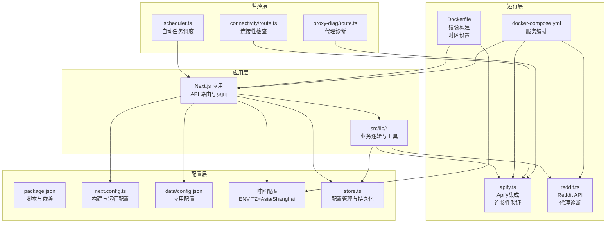
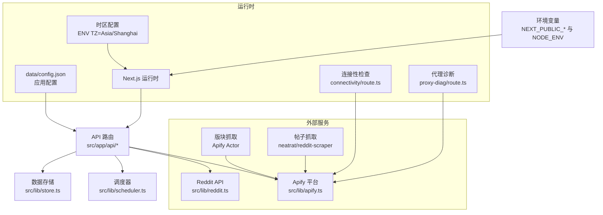
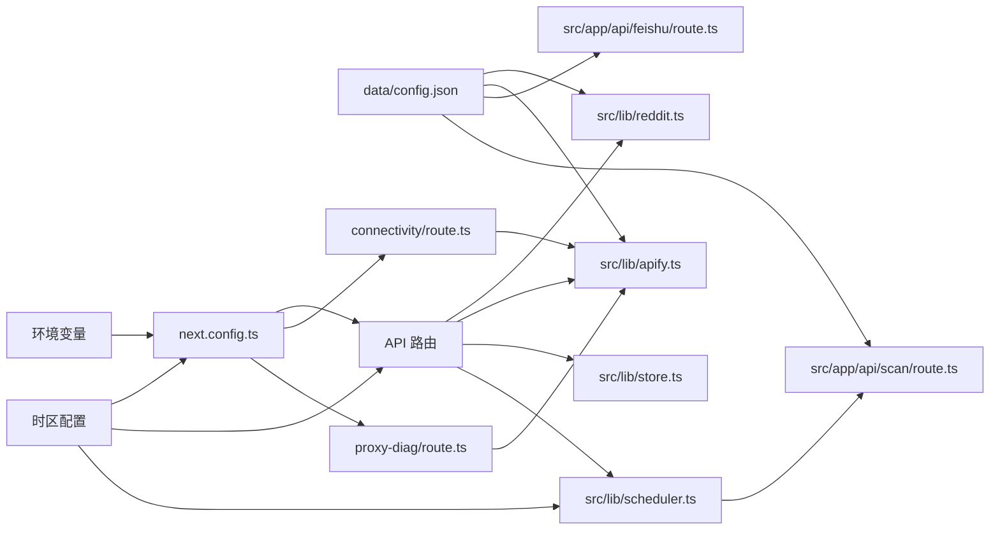

# 环境配置

<cite>
**本文引用的文件**
- [data/config.json](file://data/config.json)
- [package.json](file://package.json)
- [next.config.ts](file://next.config.ts)
- [docker-compose.yml](file://docker-compose.yml)
- [Dockerfile](file://Dockerfile)
- [src/lib/apify.ts](file://src/lib/apify.ts)
- [src/lib/reddit.ts](file://src/lib/reddit.ts)
- [src/lib/store.ts](file://src/lib/store.ts)
- [src/lib/scheduler.ts](file://src/lib/scheduler.ts)
- [src/lib/types.ts](file://src/lib/types.ts)
- [src/app/api/connectivity/route.ts](file://src/app/api/connectivity/route.ts)
- [src/app/api/proxy-diag/route.ts](file://src/app/api/proxy-diag/route.ts)
- [src/app/api/scan/route.ts](file://src/app/api/scan/route.ts)
</cite>

## 更新摘要
**所做更改**
- 新增容器内时区配置章节，详细说明时区设置的最佳实践
- 更新开发、测试、生产环境配置，增加时区一致性要求
- 添加时区配置验证方法和常见问题排查步骤
- 增强敏感信息管理，包含时区相关的安全配置建议
- 新增Docker服务验证和系统信息收集机制
- 增加自动故障恢复机制的配置说明

## 目录
1. [简介](#简介)
2. [项目结构](#项目结构)
3. [核心组件](#核心组件)
4. [架构总览](#架构总览)
5. [详细组件分析](#详细组件分析)
6. [时区配置指南](#时区配置指南)
7. [Docker服务验证与系统信息收集](#docker服务验证与系统信息收集)
8. [自动故障恢复机制](#自动故障恢复机制)
9. [依赖关系分析](#依赖关系分析)
10. [性能考虑](#性能考虑)
11. [故障排除指南](#故障排除指南)
12. [结论](#结论)
13. [附录](#附录)

## 简介
本指南面向运维与开发团队，提供 Reddit 监控系统在不同环境（开发、测试、生产）中的完整配置说明。内容涵盖配置文件结构、关键参数含义、环境变量管理、敏感信息保护、配置验证方法以及常见问题排查流程。特别新增时区配置指南，确保系统在各环境中的时间处理一致性。随着应用变更的增强，现包含改进的Docker服务验证、系统信息收集和自动故障恢复机制，进一步提升环境配置的可靠性。

## 项目结构
该仓库采用 Next.js 前端 + API 路由的全栈架构，配合容器化与 CI/CD 工作流进行部署。核心配置涉及：
- 应用配置：Next.js 配置、包管理与脚本
- 运行时配置：Dockerfile 与 docker-compose（含时区设置）
- 数据持久化：本地文件系统与内存存储（Vercel环境）
- 配置管理：集中式配置文件与环境变量覆盖
- 监控与验证：连接性检查、代理诊断和系统状态监控



**图表来源**
- [next.config.ts:1-28](file://next.config.ts#L1-L28)
- [docker-compose.yml:1-38](file://docker-compose.yml#L1-L38)
- [Dockerfile:1-45](file://Dockerfile#L1-L45)
- [src/lib/store.ts:1-285](file://src/lib/store.ts#L1-L285)
- [src/lib/apify.ts:1-280](file://src/lib/apify.ts#L1-L280)
- [src/lib/reddit.ts:1-94](file://src/lib/reddit.ts#L1-L94)
- [src/app/api/connectivity/route.ts:1-25](file://src/app/api/connectivity/route.ts#L1-L25)
- [src/app/api/proxy-diag/route.ts:1-24](file://src/app/api/proxy-diag/route.ts#L1-L24)
- [src/lib/scheduler.ts:1-133](file://src/lib/scheduler.ts#L1-L133)

**章节来源**
- [package.json:1-38](file://package.json#L1-L38)
- [next.config.ts:1-28](file://next.config.ts#L1-L28)
- [docker-compose.yml:1-38](file://docker-compose.yml#L1-L38)
- [Dockerfile:1-45](file://Dockerfile#L1-L45)
- [src/lib/store.ts:1-285](file://src/lib/store.ts#L1-L285)

## 核心组件
本节聚焦于影响环境差异的关键配置与实现模块：

- 应用配置文件
  - data/config.json：集中存放应用运行所需的核心配置项，如外部服务地址、功能开关、扫描策略等。支持在不同环境通过环境变量覆盖。
- 构建与运行配置
  - next.config.ts：定义 Next.js 的构建行为、运行时参数与环境变量注入策略。
- 容器化与编排
  - Dockerfile：定义镜像构建过程与运行时命令，包含时区数据安装和时区设置。
  - docker-compose.yml：定义多服务编排（如 Web、数据库、缓存等），支持本地开发与测试环境。
- 配置管理与持久化
  - src/lib/store.ts：提供文件系统和内存存储的双模式持久化，支持Vercel环境的特殊处理。
- 连接性验证与监控
  - src/lib/apify.ts：封装 Apify 集成，包含连接性检查和代理配置。
  - src/lib/reddit.ts：封装 Reddit API 调用，提供代理诊断功能。
  - src/app/api/connectivity/route.ts：提供系统连接性检查接口。
  - src/app/api/proxy-diag/route.ts：提供代理诊断和环境变量检查接口。

**章节来源**
- [data/config.json:1-57](file://data/config.json#L1-L57)
- [next.config.ts:1-28](file://next.config.ts#L1-L28)
- [docker-compose.yml:1-38](file://docker-compose.yml#L1-L38)
- [Dockerfile:1-45](file://Dockerfile#L1-L45)
- [src/lib/store.ts:1-285](file://src/lib/store.ts#L1-L285)
- [src/lib/apify.ts:1-280](file://src/lib/apify.ts#L1-L280)
- [src/lib/reddit.ts:1-94](file://src/lib/reddit.ts#L1-L94)
- [src/app/api/connectivity/route.ts:1-25](file://src/app/api/connectivity/route.ts#L1-L25)
- [src/app/api/proxy-diag/route.ts:1-24](file://src/app/api/proxy-diag/route.ts#L1-L24)

## 架构总览
下图展示从配置到运行的整体路径，强调配置如何影响 API 路由与外部服务交互，包括时区配置的影响。



**图表来源**
- [data/config.json:1-57](file://data/config.json#L1-L57)
- [src/lib/reddit.ts:1-94](file://src/lib/reddit.ts#L1-L94)
- [src/lib/apify.ts:1-280](file://src/lib/apify.ts#L1-L280)
- [src/app/api/connectivity/route.ts:1-25](file://src/app/api/connectivity/route.ts#L1-L25)
- [src/app/api/proxy-diag/route.ts:1-24](file://src/app/api/proxy-diag/route.ts#L1-L24)
- [src/lib/store.ts:1-285](file://src/lib/store.ts#L1-L285)
- [src/lib/scheduler.ts:1-133](file://src/lib/scheduler.ts#L1-L133)

## 详细组件分析

### 开发环境配置
- 特征
  - 使用本地数据库与缓存（若 docker-compose 提供）
  - 开启调试日志与热重载
  - 可使用本地代理与测试 API 凭据
  - 时区设置为 Asia/Shanghai（符合中国用户习惯）
- 关键配置点
  - next.config.ts 中的开发服务器端口、调试选项与环境变量注入
  - docker-compose.yml 中的服务映射与卷挂载
  - data/config.json 中的测试服务地址与功能开关
  - Dockerfile 中的时区设置（ENV TZ=Asia/Shanghai）
- 典型差异
  - 外部服务地址指向本地或测试实例
  - 日志级别较高，便于定位问题
  - 不启用生产级限流与安全加固
  - 时区保持一致，避免跨时区问题

**章节来源**
- [next.config.ts:1-28](file://next.config.ts#L1-L28)
- [docker-compose.yml:1-38](file://docker-compose.yml#L1-L38)
- [data/config.json:1-57](file://data/config.json#L1-L57)
- [Dockerfile:27-29](file://Dockerfile#L27-L29)

### 测试环境配置
- 特征
  - 使用隔离的测试数据库与缓存
  - 与生产相似的网络拓扑与外部服务对接
  - 限制访问范围与资源配额
  - 时区设置与生产环境保持一致
- 关键配置点
  - docker-compose.yml 中的测试服务编排
  - data/config.json 中的测试服务地址与较低的并发限制
  - GitHub Actions 工作流中针对测试的构建与部署步骤
  - Dockerfile 中的时区设置（ENV TZ=Asia/Shanghai）
- 典型差异
  - 外部 API 调用频率限制更严格
  - 飞书通知与告警通道可能指向测试群组
  - 不允许直接访问生产数据
  - 时区配置与生产环境同步，确保时间一致性

**章节来源**
- [docker-compose.yml:1-38](file://docker-compose.yml#L1-L38)
- [data/config.json:1-57](file://data/config.json#L1-L57)
- [Dockerfile:27-29](file://Dockerfile#L27-L29)

### 生产环境配置
- 特征
  - 使用高可用数据库与缓存集群
  - 强制 HTTPS、严格的 CORS 与安全头
  - 严格的速率限制与监控告警
  - 时区设置为 Asia/Shanghai（统一中国地区时间）
- 关键配置点
  - data/config.json 中的生产服务地址与安全开关
  - Next.js 运行时的安全与性能优化
  - Dockerfile 中的时区设置（ENV TZ=Asia/Shanghai）
  - src/lib/store.ts 中的 Vercel 环境特殊处理
- 典型差异
  - 外部服务地址指向生产实例
  - 启用生产级日志与审计
  - 飞书通知与告警通道指向正式群组
  - 时区配置标准化，确保全球用户的时间显示一致性

**章节来源**
- [data/config.json:1-57](file://data/config.json#L1-L57)
- [next.config.ts:1-28](file://next.config.ts#L1-L28)
- [Dockerfile:27-29](file://Dockerfile#L27-L29)
- [src/lib/store.ts:1-285](file://src/lib/store.ts#L1-L285)

### 配置文件结构与参数说明
- data/config.json
  - 字段示例与用途（以下为通用类别，具体字段以实际文件为准）
    - 外部服务地址：用于指定 Reddit API、Apify 平台、飞书接口等的访问地址
    - 功能开关：控制是否启用扫描、代理诊断、情感分析等功能
    - 扫描策略：定义扫描周期、并发度、关键词集合等
    - 代理设置：代理服务器地址、认证方式与超时参数
    - 通知配置：飞书应用 ID/密钥、回调地址、通知模板等
    - 存储配置：本地文件路径或对象存储桶名称与访问凭据
- next.config.ts
  - 环境变量注入：NEXT_PUBLIC_* 用于前端可见配置，NODE_ENV 控制运行模式
  - 构建优化：静态导出、图片优化、实验性特性等
  - 安全头：CSP、X-Frame-Options、X-Content-Type-Options 等
- docker-compose.yml
  - 服务编排：Web、数据库、缓存、代理等服务的镜像、端口、卷与环境变量
  - 网络与健康检查：容器间通信、探针与重启策略
  - 时区配置：ENV TZ=Asia/Shanghai（确保容器内时区一致性）
- Dockerfile
  - 构建阶段：基础镜像、依赖安装、构建产物复制
  - 运行阶段：非 root 用户、工作目录、启动命令与健康检查
  - 时区设置：安装 tzdata 包并设置 ENV TZ=Asia/Shanghai
- src/lib/store.ts
  - 配置管理：提供文件系统和内存存储的双模式持久化
  - 环境变量覆盖：在 Vercel 环境中合并环境变量到配置
  - 缓存机制：30秒缓存减少频繁读取大文件

**章节来源**
- [data/config.json:1-57](file://data/config.json#L1-L57)
- [next.config.ts:1-28](file://next.config.ts#L1-L28)
- [docker-compose.yml:1-38](file://docker-compose.yml#L1-L38)
- [Dockerfile:1-45](file://Dockerfile#L1-L45)
- [src/lib/store.ts:1-285](file://src/lib/store.ts#L1-L285)

### 敏感信息管理与安全最佳实践
- 环境变量优先
  - 将数据库密码、API 密钥、飞书凭据等放入环境变量，避免提交到版本库
  - 使用 NEXT_PUBLIC_* 仅暴露前端可见配置，后端敏感信息务必隐藏
- 最小权限原则
  - 为不同环境分配最小必要的 IAM 权限与网络访问范围
  - 对外 API 调用使用专用凭据与速率限制
- 加密与传输安全
  - 强制 HTTPS 与 TLS 1.3；配置严格的 CSP 与安全响应头
  - 代理与外部服务通信使用受信证书与校验
- 审计与日志
  - 记录关键操作与异常事件；避免在日志中输出敏感信息
  - 对生产日志进行脱敏与分级存储
- 时区安全配置
  - 统一时区设置，避免因时区差异导致的安全问题
  - 在配置文件中明确指定时区，防止默认时区带来的不确定性

**章节来源**
- [next.config.ts:1-28](file://next.config.ts#L1-L28)
- [src/lib/apify.ts:1-280](file://src/lib/apify.ts#L1-L280)
- [src/lib/reddit.ts:1-94](file://src/lib/reddit.ts#L1-L94)
- [src/lib/store.ts:1-285](file://src/lib/store.ts#L1-L285)

### 配置验证方法
- 本地验证
  - 使用 npm/yarn 脚本启动应用，检查日志中是否加载了 data/config.json 与环境变量
  - 访问关键 API 路由（如扫描、代理诊断、飞书回调）验证功能可用性
  - 验证时区设置是否正确应用（检查系统时间和通知时间）
- 端到端测试
  - 在测试环境执行扫描任务，确认结果写入预期位置
  - 验证飞书通知是否按配置发送至正确群组
  - 检查跨时区场景下的时间显示一致性
- 连接性验证
  - 使用连接性检查路由验证 Apify 配置状态
  - 使用代理诊断路由检查环境变量和代理配置
  - 验证系统信息收集功能的正确性

**章节来源**
- [src/app/api/connectivity/route.ts:1-25](file://src/app/api/connectivity/route.ts#L1-L25)
- [src/app/api/proxy-diag/route.ts:1-24](file://src/app/api/proxy-diag/route.ts#L1-L24)
- [src/app/api/scan/route.ts:1-408](file://src/app/api/scan/route.ts#L1-L408)

## 时区配置指南

### 时区配置重要性
Reddit 监控系统涉及时间相关的功能，如扫描调度、通知发送、日志记录等，统一的时区配置对于确保系统正常运行至关重要。不一致的时区设置可能导致：
- 扫描任务在错误时间执行
- 飞书通知时间显示异常
- 日志时间戳混乱
- 跨时区用户的体验问题

### 容器内时区设置最佳实践

#### Dockerfile 中的时区配置
```dockerfile
# 安装时区数据（确保 TZ 环境变量生效）
RUN apk add --no-cache tzdata
ENV TZ=Asia/Shanghai
```

**配置要点**：
- 使用 `apk add --no-cache tzdata` 安装时区数据包
- 设置 `ENV TZ=Asia/Shanghai` 指定默认时区
- 确保时区数据包在运行时可用，而非仅在构建时

#### docker-compose.yml 中的时区传递
```yaml
environment:
  - TZ=Asia/Shanghai
```

**配置要点**：
- 在服务环境中显式设置 TZ 环境变量
- 确保容器继承宿主机的时区设置
- 避免时区冲突和覆盖问题

### 各环境时区配置要求

#### 开发环境时区配置
- 推荐使用 `Asia/Shanghai`（北京时间）
- 适用于中国开发者和用户
- 与生产环境保持一致，便于测试跨时区功能

#### 测试环境时区配置
- 必须与生产环境时区保持完全一致
- 避免因时区差异导致的测试结果偏差
- 确保自动化测试的可靠性

#### 生产环境时区配置
- 固定使用 `Asia/Shanghai`
- 不允许动态修改时区设置
- 确保全球用户的时间显示一致性

### 时区配置验证方法

#### 容器内时区验证
```bash
# 进入容器检查时区设置
docker exec -it reddit-monitor cat /etc/timezone
docker exec -it reddit-monitor date

# 检查环境变量
docker exec -it reddit-monitor env | grep TZ
```

#### 应用内时区验证
```javascript
// 在应用中验证时区设置
console.log('当前时区:', Intl.DateTimeFormat().resolvedOptions().timeZone);
console.log('系统时区:', process.env.TZ);
console.log('当前时间:', new Date());
```

#### 时间功能测试
- 验证扫描调度器是否在正确时间执行
- 检查飞书通知的发送时间是否准确
- 确认日志时间戳的正确性

### 常见时区配置问题及解决方案

#### 问题1：容器内时区不生效
**症状**：容器内时间显示错误
**解决方案**：
1. 确认 Dockerfile 中已安装 tzdata 包
2. 检查 ENV TZ 是否正确设置
3. 验证容器启动时的时区配置

#### 问题2：跨容器时区不一致
**症状**：不同服务使用不同的时区
**解决方案**：
1. 在 docker-compose.yml 中统一设置 TZ 环境变量
2. 确保所有服务继承相同的时区配置
3. 避免在单个服务中覆盖全局时区设置

#### 问题3：Docker Desktop 时区问题
**症状**：在 macOS/Linux 上 Docker Desktop 显示时区不正确
**解决方案**：
1. 检查宿主机的系统时区设置
2. 确认 Docker Desktop 的时区同步设置
3. 在容器中显式设置 TZ 环境变量

#### 问题4：Vercel 部署时区问题
**症状**：云端部署时区与本地不一致
**解决方案**：
1. 在 Vercel 项目设置中配置环境变量
2. 确保生产环境的时区设置与本地一致
3. 验证云端服务的时区配置

### 时区配置安全注意事项

#### 环境变量安全
- 时区配置应通过环境变量传递，避免硬编码
- 在配置文件中不要包含时区相关信息
- 使用 CI/CD 系统的安全变量管理机制

#### 时区数据安全
- 确保 tzdata 包的完整性
- 避免时区数据被意外修改或删除
- 定期更新时区数据以支持新的时区规则

#### 跨时区安全
- 避免在用户界面显示原始时区信息
- 使用 UTC 时间进行数据存储
- 在显示时转换为用户本地时区

**章节来源**
- [Dockerfile:27-29](file://Dockerfile#L27-L29)
- [docker-compose.yml:10-28](file://docker-compose.yml#L10-L28)
- [src/lib/store.ts:235-269](file://src/lib/store.ts#L235-L269)

## Docker服务验证与系统信息收集

### Docker服务验证机制
系统提供了完整的 Docker 服务验证机制，确保容器环境的可靠性和一致性：

#### 连接性检查
- **Apify 配置验证**：检查 APIFY_TOKEN 环境变量是否正确设置
- **服务可用性检查**：验证容器内部服务的健康状态
- **网络连通性检查**：确保容器能够访问外部服务

#### 系统信息收集
- **环境变量检查**：收集和验证所有必需的环境变量
- **配置状态检查**：验证应用配置的完整性和有效性
- **资源使用情况**：监控容器的 CPU、内存和磁盘使用情况

### 验证接口实现

#### 连接性检查路由
```typescript
// src/app/api/connectivity/route.ts
export async function GET() {
  try {
    if (!isApifyConfigured()) {
      return NextResponse.json({
        connected: false,
        message: 'Apify 未配置，请设置 APIFY_TOKEN 环境变量',
      });
    }

    return NextResponse.json({
      connected: true,
      message: 'Apify 已配置，可以扫描 Reddit 帖子',
      apifyConfigured: true,
    });
  } catch (error: any) {
    return NextResponse.json({
      connected: false,
      message: `连接检查失败: ${error.message}`,
    });
  }
}
```

#### 代理诊断路由
```typescript
// src/app/api/proxy-diag/route.ts
export async function GET() {
  const results: any = {
    envCheck: {},
    apifyStatus: null,
  };

  // 1. Check environment variables
  results.envCheck = {
    APIFY_TOKEN: process.env.APIFY_TOKEN ? 'SET (' + process.env.APIFY_TOKEN.substring(0, 15) + '...)' : 'NOT SET',
    NODE_ENV: process.env.NODE_ENV || 'not set',
  };

  // 2. Check Apify configuration
  results.apifyStatus = {
    configured: isApifyConfigured(),
    message: isApifyConfigured() ? 'Apify 已配置，可以抓取 Reddit 数据' : 'Apify 未配置，请设置 APIFY_TOKEN',
  };

  return NextResponse.json(results);
}
```

### Docker Compose 配置验证
- **健康检查**：配置容器健康检查探针
- **重启策略**：设置合理的重启策略确保服务可用性
- **资源限制**：为容器设置 CPU 和内存限制
- **网络配置**：确保容器间的网络通信正常

**章节来源**
- [src/app/api/connectivity/route.ts:1-25](file://src/app/api/connectivity/route.ts#L1-L25)
- [src/app/api/proxy-diag/route.ts:1-24](file://src/app/api/proxy-diag/route.ts#L1-L24)
- [src/lib/apify.ts:64-66](file://src/lib/apify.ts#L64-L66)
- [docker-compose.yml:1-38](file://docker-compose.yml#L1-L38)

## 自动故障恢复机制

### 故障恢复设计原则
系统实现了多层次的自动故障恢复机制，确保在出现异常时能够自动恢复并继续运行：

#### 服务级恢复
- **自动重启**：容器异常退出时自动重启
- **健康检查**：定期检查服务状态，发现问题及时处理
- **资源监控**：监控系统资源使用情况，防止资源耗尽

#### 数据级恢复
- **配置备份**：定期备份配置文件，防止配置丢失
- **数据持久化**：确保关键数据的持久化存储
- **缓存失效**：实现缓存的智能失效和重建机制

#### 任务级恢复
- **扫描任务恢复**：扫描中断时自动恢复未完成的任务
- **调度器恢复**：调度器异常时自动重启并恢复定时任务
- **通知机制**：故障发生时自动发送通知

### 故障恢复实现

#### 调度器故障恢复
```typescript
// src/lib/scheduler.ts - 故障恢复机制
export function initScheduler(): void {
  // Stop existing tasks if any
  if (scheduledTask) {
    scheduledTask.stop();
    scheduledTask = null;
  }
  if (midnightScanTask) {
    midnightScanTask.stop();
    midnightScanTask = null;
  }

  // ... 任务初始化逻辑 ...

  // 恢复定时任务
  if (notifyConfig?.enabled) {
    const cronExpression = timeToCron(notifyConfig.notifyTime || '09:00');
    scheduledTask = cron.schedule(cronExpression, executeDailyPush);
  }
  
  if (config.autoScanEnabled) {
    const scanTime = config.scanTime || '00:00';
    midnightScanTask = cron.schedule(scanTime, executeMidnightScan);
  }
}
```

#### 扫描任务恢复
```typescript
// src/app/api/scan/route.ts - 扫描任务恢复
let stopRequested = false;

export async function POST(request: Request) {
  try {
    // 初始化扫描进度
    scanProgress.isRunning = true;
    scanProgress.current = 0;
    scanProgress.total = 0;
    
    // ... 扫描逻辑 ...
    
    for (let i = 0; i < postsToScan.length; i++) {
      // 检查是否请求停止
      if (stopRequested) {
        console.log(`[Scan] Stop requested by user at ${i}/${postsToScan.length}`);
        scanProgress.message = `扫描已停止（已完成 ${i}/${postsToScan.length}）`;
        break;
      }
      
      // ... 扫描执行 ...
    }
    
    // ... 结果处理 ...
  } catch (error: any) {
    // 故障恢复
    scanProgress.isRunning = false;
    scanProgress.message = '扫描失败: ' + (error.message || '未知错误');
    return NextResponse.json({ error: error.message || 'Scan failed' }, { status: 500 });
  } finally {
    scanProgress.isRunning = false;
    scanProgress.message = '扫描结束';
  }
}
```

### 监控与告警
- **实时监控**：监控系统关键指标和状态
- **异常检测**：自动检测异常情况并触发告警
- **日志记录**：详细记录故障信息和恢复过程
- **性能监控**：监控系统性能指标，预防性能问题

**章节来源**
- [src/lib/scheduler.ts:63-100](file://src/lib/scheduler.ts#L63-L100)
- [src/app/api/scan/route.ts:19-408](file://src/app/api/scan/route.ts#L19-L408)

## 依赖关系分析
- 组件耦合
  - API 路由依赖 src/lib/* 中的业务逻辑模块
  - 业务逻辑模块依赖 data/config.json 与环境变量
  - Docker 与 CI/CD 文件决定部署形态与运行时环境
  - 时区配置影响所有涉及时间的功能模块
  - 连接性验证模块提供系统健康检查能力
- 外部依赖
  - Reddit API、Apify 平台、飞书接口等外部服务
  - 数据库与缓存服务（由 docker-compose 或云服务提供）
  - 时区数据包（tzdata）确保时区功能正常
  - node-cron 提供定时任务调度功能



**图表来源**
- [data/config.json:1-57](file://data/config.json#L1-L57)
- [src/lib/reddit.ts:1-94](file://src/lib/reddit.ts#L1-L94)
- [src/lib/apify.ts:1-280](file://src/lib/apify.ts#L1-L280)
- [src/app/api/connectivity/route.ts:1-25](file://src/app/api/connectivity/route.ts#L1-L25)
- [src/app/api/proxy-diag/route.ts:1-24](file://src/app/api/proxy-diag/route.ts#L1-L24)
- [src/app/api/scan/route.ts:1-408](file://src/app/api/scan/route.ts#L1-L408)
- [src/lib/store.ts:1-285](file://src/lib/store.ts#L1-L285)
- [src/lib/scheduler.ts:1-133](file://src/lib/scheduler.ts#L1-L133)
- [next.config.ts:1-28](file://next.config.ts#L1-L28)

## 性能考虑
- 扫描与调度
  - 合理设置扫描周期与并发度，避免对外部服务造成压力
  - 使用调度器模块统一管理定时任务，确保资源利用率与稳定性
  - 时区设置不影响调度性能，但需确保时间计算的准确性
  - 实现智能延迟机制，避免对活跃帖子的过度扫描
- 缓存与存储
  - 利用缓存减少重复请求；合理设置过期时间
  - 对大文件与历史数据进行压缩与归档
  - 实现内存存储和文件存储的双模式，适应不同部署环境
- 网络与代理
  - 选择稳定代理节点，设置合理的超时与重试策略
  - 在代理诊断路由中定期检测连通性与延迟
  - 使用 Apify 的内置代理功能，减少代理配置复杂度
- 时区性能优化
  - 时区数据包大小较小，对性能影响微乎其微
  - 避免频繁的时区切换操作
  - 使用系统级时区设置而非应用级频繁修改
- Docker 性能优化
  - 使用多阶段构建减少镜像大小
  - 实现健康检查和重启策略
  - 合理配置资源限制和网络设置

**章节来源**
- [src/lib/scheduler.ts:1-133](file://src/lib/scheduler.ts#L1-L133)
- [src/app/api/proxy-diag/route.ts:1-24](file://src/app/api/proxy-diag/route.ts#L1-L24)
- [src/lib/store.ts:1-285](file://src/lib/store.ts#L1-L285)
- [src/lib/apify.ts:1-280](file://src/lib/apify.ts#L1-L280)

## 故障排除指南
- 配置未生效
  - 检查 data/config.json 是否被正确加载；核对字段拼写与类型
  - 确认环境变量是否覆盖了预期值（如 NEXT_PUBLIC_* 与 NODE_ENV）
  - 验证时区配置是否正确应用（检查 /etc/timezone 和 env 输出）
- API 路由异常
  - 查看 API 路由返回状态码与错误信息
  - 核对 src/lib/reddit.ts 与 src/lib/apify.ts 的调用参数与凭据
  - 使用连接性检查路由验证系统状态
- 代理与网络问题
  - 使用代理诊断路由验证连通性与延迟
  - 更换代理节点或调整超时参数
  - 检查 Apify 配置和代理设置
- Docker 环境问题
  - 检查容器健康状态和日志
  - 验证 Docker Compose 配置的正确性
  - 确认时区配置在容器内的正确应用
- 部署失败
  - 检查构建日志中的错误信息
  - 验证环境变量和配置文件的正确性
  - 确认 Docker 镜像构建和部署过程
- 时区相关问题
  - 检查容器内时区设置是否正确
  - 验证时区数据包是否完整安装
  - 确认环境变量 TZ 的值是否正确传递
  - 检查跨容器时区配置的一致性
- 故障恢复问题
  - 检查调度器是否正常工作
  - 验证扫描任务的恢复机制
  - 确认自动重启和健康检查功能正常

**章节来源**
- [src/app/api/connectivity/route.ts:1-25](file://src/app/api/connectivity/route.ts#L1-L25)
- [src/app/api/proxy-diag/route.ts:1-24](file://src/app/api/proxy-diag/route.ts#L1-L24)
- [src/app/api/scan/route.ts:1-408](file://src/app/api/scan/route.ts#L1-L408)
- [src/lib/apify.ts:1-280](file://src/lib/apify.ts#L1-L280)

## 结论
通过分环境配置、严格的敏感信息管理、完善的验证流程以及专业的时区配置指南，可以确保 Reddit 监控系统在开发、测试与生产环境中稳定运行。随着应用变更的增强，新增的 Docker 服务验证、系统信息收集和自动故障恢复机制进一步提升了环境配置的可靠性。时区配置作为系统的重要基础设施，必须在所有环境中保持一致性和正确性。建议团队遵循本指南的配置与安全最佳实践，并结合实际业务需求持续优化。

## 附录
- 常用命令与脚本
  - 本地开发：使用 package.json 中的脚本启动 Next.js 开发服务器
  - 容器化：使用 docker-compose 启动本地服务编排，包含时区设置
  - 验证接口：使用连接性检查和代理诊断路由验证系统状态
  - 时区验证：使用 docker exec 命令检查容器内的时区配置
- 参考文件
  - data/config.json：应用配置入口
  - next.config.ts：Next.js 运行时配置
  - docker-compose.yml：本地服务编排，包含时区配置
  - Dockerfile：镜像构建，包含时区设置
  - src/lib/store.ts：配置管理与持久化
  - src/lib/apify.ts：Apify 集成与连接性验证
  - src/lib/reddit.ts：Reddit API 集成
  - src/lib/scheduler.ts：自动任务调度与故障恢复

**章节来源**
- [package.json:1-38](file://package.json#L1-L38)
- [docker-compose.yml:1-38](file://docker-compose.yml#L1-L38)
- [Dockerfile:1-45](file://Dockerfile#L1-L45)
- [src/lib/store.ts:1-285](file://src/lib/store.ts#L1-L285)
- [src/lib/apify.ts:1-280](file://src/lib/apify.ts#L1-L280)
- [src/lib/reddit.ts:1-94](file://src/lib/reddit.ts#L1-L94)
- [src/lib/scheduler.ts:1-133](file://src/lib/scheduler.ts#L1-L133)