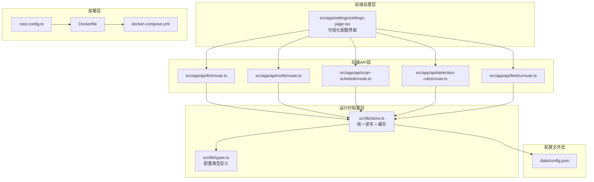
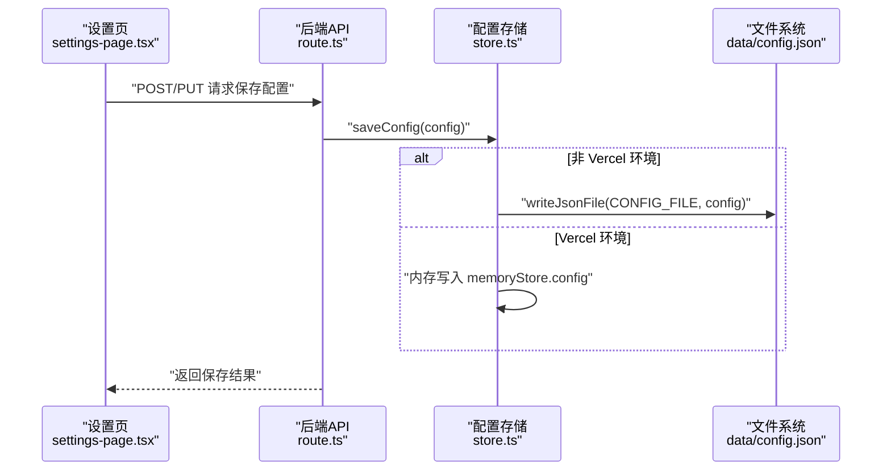
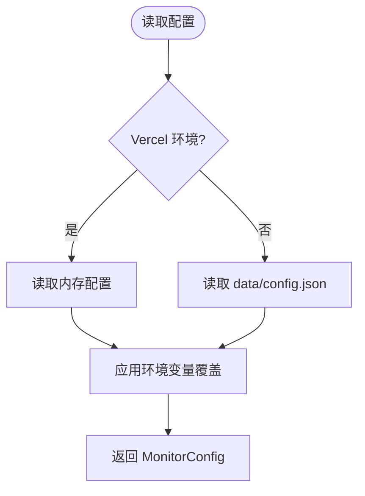
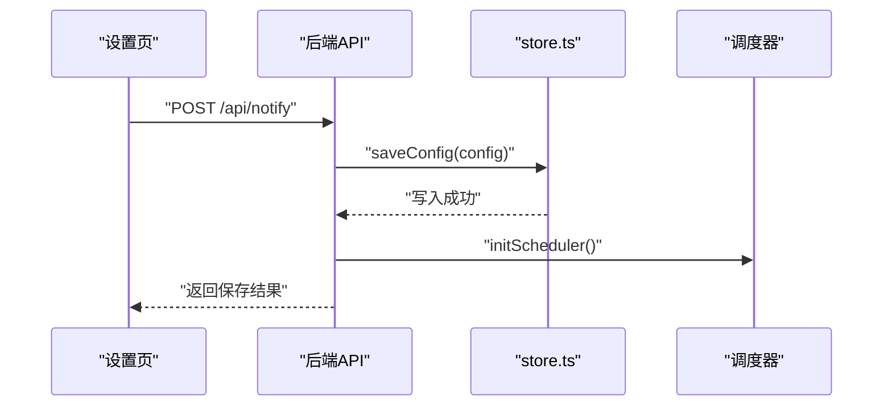
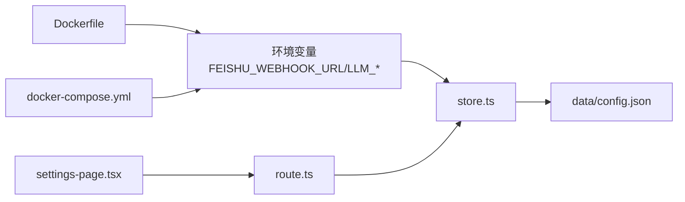

# 配置管理

<cite>
**本文引用的文件**
- [config.json](file://data/config.json)
- [store.ts](file://src/lib/store.ts)
- [types.ts](file://src/lib/types.ts)
- [settings-page.tsx](file://src/app/settings/settings-page.tsx)
- [llm/route.ts](file://src/app/api/llm/route.ts)
- [notify/route.ts](file://src/app/api/notify/route.ts)
- [scan-schedule/route.ts](file://src/app/api/scan-schedule/route.ts)
- [detection-rules/route.ts](file://src/app/api/detection-rules/route.ts)
- [feishu/route.ts](file://src/app/api/feishu/route.ts)
- [Dockerfile](file://Dockerfile)
- [docker-compose.yml](file://docker-compose.yml)
- [next.config.ts](file://next.config.ts)
- [package.json](file://package.json)
- [deploy.sh](file://deploy.sh)
- [deploy-frankfurt.md](file://deploy-frankfurt.md)
</cite>

## 更新摘要
**所做更改**
- 更新了 tunnelUrl 配置说明，反映从 Cloudflare 隧道地址更改为直接 EC2 实例地址的变更
- 新增了 Feishu 集成连接稳定性的说明
- 更新了配置文件结构说明和环境变量覆盖机制
- 增强了生产环境配置要点和安全注意事项

## 目录
1. [简介](#简介)
2. [项目结构](#项目结构)
3. [核心组件](#核心组件)
4. [架构总览](#架构总览)
5. [详细组件分析](#详细组件分析)
6. [依赖关系分析](#依赖关系分析)
7. [性能考量](#性能考量)
8. [故障排查指南](#故障排查指南)
9. [结论](#结论)
10. [附录](#附录)

## 简介
本文件系统性梳理 Reddit 监控系统的配置管理，覆盖配置文件结构、运行时环境变量、安全配置、配置变更影响范围与生效方式，并提供默认配置建议、最佳实践、生产环境要点与安全注意事项。同时解释配置与数据存储的关系，以及不同部署环境的配置模板与示例。

**更新** 本次更新反映了 tunnelUrl 配置的重要变更：从 Cloudflare 隧道地址迁移到直接 EC2 实例地址，这一变更显著提升了 Feishu 集成的连接稳定性。

## 项目结构
- 配置文件位于 data/config.json，采用 JSON 结构存储监控系统的核心配置。
- 运行时配置由 src/lib/store.ts 提供统一读写入口；在 Vercel 等无写盘环境通过内存存储与环境变量覆盖实现。
- 配置项通过前端设置页 src/app/settings/settings-page.tsx 提供可视化界面，后端 API 路由负责持久化与调度器初始化。
- 部署层通过 Dockerfile 与 docker-compose.yml 提供容器化与环境变量注入能力。

**图表来源**
- [store.ts:194-284](file://src/lib/store.ts#L194-L284)
- [types.ts:146-159](file://src/lib/types.ts#L146-L159)
- [settings-page.tsx:1-800](file://src/app/settings/settings-page.tsx#L1-L800)
- [llm/route.ts:1-80](file://src/app/api/llm/route.ts#L1-L80)
- [notify/route.ts:1-119](file://src/app/api/notify/route.ts#L1-L119)
- [scan-schedule/route.ts:1-53](file://src/app/api/scan-schedule/route.ts#L1-L53)
- [detection-rules/route.ts:1-49](file://src/app/api/detection-rules/route.ts#L1-L49)
- [feishu/route.ts:1-249](file://src/app/api/feishu/route.ts#L1-L249)
- [Dockerfile:1-41](file://Dockerfile#L1-L41)
- [docker-compose.yml:1-38](file://docker-compose.yml#L1-L38)
- [next.config.ts:1-28](file://next.config.ts#L1-L28)

**章节来源**
- [store.ts:1-285](file://src/lib/store.ts#L1-L285)
- [types.ts:1-194](file://src/lib/types.ts#L1-L194)
- [settings-page.tsx:1-800](file://src/app/settings/settings-page.tsx#L1-L800)
- [Dockerfile:1-41](file://Dockerfile#L1-L41)
- [docker-compose.yml:1-38](file://docker-compose.yml#L1-L38)
- [next.config.ts:1-28](file://next.config.ts#L1-L28)

## 核心组件
- 配置文件 data/config.json：系统默认配置与持久化存储的根。
- 运行时配置 store.ts：封装文件读写、内存缓存、Vercel 环境变量覆盖逻辑。
- 类型定义 types.ts：MonitorConfig 及其子配置的完整结构与约束。
- 设置页 settings-page.tsx：可视化配置界面，驱动后端 API 完成保存与测试。
- API 路由：LLM、通知、扫描计划、检测规则、飞书集成的读取、保存与测试。
- 部署配置：Dockerfile、docker-compose.yml、next.config.ts 提供容器化与环境注入。

**更新** 新增了飞书集成相关的 API 路由支持，增强了配置管理的完整性。

**章节来源**
- [config.json:1-57](file://data/config.json#L1-L57)
- [store.ts:194-284](file://src/lib/store.ts#L194-L284)
- [types.ts:146-159](file://src/lib/types.ts#L146-L159)
- [settings-page.tsx:1-800](file://src/app/settings/settings-page.tsx#L1-L800)
- [llm/route.ts:1-80](file://src/app/api/llm/route.ts#L1-L80)
- [notify/route.ts:1-119](file://src/app/api/notify/route.ts#L1-L119)
- [scan-schedule/route.ts:1-53](file://src/app/api/scan-schedule/route.ts#L1-L53)
- [detection-rules/route.ts:1-49](file://src/app/api/detection-rules/route.ts#L1-L49)
- [feishu/route.ts:1-249](file://src/app/api/feishu/route.ts#L1-L249)
- [Dockerfile:1-41](file://Dockerfile#L1-L41)
- [docker-compose.yml:1-38](file://docker-compose.yml#L1-L38)
- [next.config.ts:1-28](file://next.config.ts#L1-L28)

## 架构总览
配置在运行时的流转路径如下：
- 首次读取：store.ts 从 data/config.json 读取 MonitorConfig；若为 Vercel 环境，则合并环境变量覆盖。
- 可视化修改：settings-page.tsx 通过 API 路由保存配置，触发 store.ts 写入 data/config.json（非 Vercel）。
- 生效机制：部分配置（如通知、扫描计划）会触发调度器重新初始化，确保新配置立即生效。
- 缓存策略：store.ts 对大文件读取进行缓存，降低 I/O 压力。

**图表来源**
- [settings-page.tsx:1-800](file://src/app/settings/settings-page.tsx#L1-L800)
- [llm/route.ts:15-47](file://src/app/api/llm/route.ts#L15-L47)
- [notify/route.ts:48-82](file://src/app/api/notify/route.ts#L48-L82)
- [scan-schedule/route.ts:16-52](file://src/app/api/scan-schedule/route.ts#L16-L52)
- [detection-rules/route.ts:25-48](file://src/app/api/detection-rules/route.ts#L25-L48)
- [feishu/route.ts:19-38](file://src/app/api/feishu/route.ts#L19-L38)
- [store.ts:281-284](file://src/lib/store.ts#L281-L284)

## 详细组件分析

### 配置文件 data/config.json
- 作用：系统默认配置与持久化存储根，包含飞书集成、扫描计划、关键词、情感阈值、LLM、通知、检测规则、观察词等。
- 关键字段说明（节选）：
  - feishu：飞书应用凭据、多维表格 App Token、Table ID、URL 字段名。
  - feishuUserAuth：飞书用户授权信息（跨租户访问外部文档）。
  - scanSchedule：cron 表达式，控制自动扫描频率。
  - autoScanEnabled：是否启用自动扫描。
  - scanTime：每日自动扫描时间点。
  - keywords/watchedKeywords：关键词列表与观察词列表。
  - sentimentThreshold：情感阈值，决定评论是否标记为负面。
  - openaiApiKey/openaiModel：OpenAI 兼容配置（保留字段）。
  - llm：通用 LLM 配置（启用开关、提供商、API Key、模型、基础 URL、最大 Token、温度）。
  - **tunnelUrl**：**更新** 内网穿透 URL，现为直接 EC2 实例地址（如 http://63.178.68.46:3000），相比 Cloudflare 隧道提供更稳定的连接。
  - feishuNotify：飞书通知配置（启用、模式、Webhook 地址、推送时间、推送级别、接收人/群）。
  - detectionRules：检测规则集合（品牌攻击、产品仇恨、负面情绪、号召行动负面、竞争对手推动）。

**更新** tunnelUrl 字段已从 Cloudflare 隧道地址更新为直接 EC2 实例地址，这一变更显著提升了飞书集成的连接稳定性，减少了中间层转发可能带来的网络延迟和连接中断问题。

**章节来源**
- [config.json:1-57](file://data/config.json#L1-L57)

### 运行时配置 store.ts
- 功能：
  - 文件读写：在非 Vercel 环境下，读取/写入 data/config.json。
  - 内存存储：在 Vercel 等只读文件系统环境下，使用内存存储配置。
  - 缓存：对 posts/comments/scans/reports/config 进行缓存，提升读取性能。
  - 环境变量覆盖：在 Vercel 下，优先使用环境变量覆盖通知、LLM、隧道 URL 等配置。
- 默认配置：DEFAULT_CONFIG 定义了 MonitorConfig 的默认值，确保首次加载与缺失字段的兜底。
- 生效方式：保存配置后，调用 saveConfig 触发写入；对于通知与扫描计划，API 层会重新初始化调度器。

**图表来源**
- [store.ts:271-284](file://src/lib/store.ts#L271-L284)
- [store.ts:235-269](file://src/lib/store.ts#L235-L269)
- [store.ts:194-233](file://src/lib/store.ts#L194-L233)

**章节来源**
- [store.ts:19-87](file://src/lib/store.ts#L19-L87)
- [store.ts:194-284](file://src/lib/store.ts#L194-L284)

### 类型定义 types.ts
- MonitorConfig：顶层配置对象，包含 feishu、feishuUserAuth、scanSchedule、autoScanEnabled、scanTime、keywords、sentimentThreshold、openaiApiKey/openaiModel、llm、feishuNotify、detectionRules。
- FeishuConfig/FeishuUserAuth：飞书集成与用户授权相关字段。
- LLMConfig：通用 LLM 配置，支持多种提供商与自定义基础 URL。
- FeishuNotifyConfig：飞书通知配置，支持 Webhook 与应用消息两种模式。
- DetectionRules：检测规则集合，布尔开关控制。

**章节来源**
- [types.ts:77-159](file://src/lib/types.ts#L77-L159)

### 设置页 settings-page.tsx
- 功能：提供飞书数据源、扫描策略、LLM、通知、检测规则、外部文档授权等配置的可视化界面。
- 行为：通过 /api/* 路由与后端交互，保存配置并触发测试或同步。
- 注意：部分配置（如外部文档授权）涉及 OAuth 流程与回调处理。

**章节来源**
- [settings-page.tsx:1-800](file://src/app/settings/settings-page.tsx#L1-L800)

### API 路由与配置持久化
- LLM 配置
  - GET：返回当前 LLM 配置与提供商预设。
  - POST：保存 LLM 配置，并根据启用状态决定后续行为。
  - PUT：测试 LLM 连通性。
- 通知配置
  - GET：返回通知配置与推送预览，同时返回调度器状态。
  - POST：保存通知配置并重新初始化调度器。
  - PUT：测试通知发送。
  - PATCH：手动触发一次推送。
- 扫描计划
  - GET：返回自动扫描开关、时间、计划表达式与情感阈值。
  - POST：保存扫描计划并重新初始化调度器。
- 检测规则
  - GET：返回检测规则集合。
  - POST：保存检测规则集合。
- **飞书集成**
  - POST：从飞书多维表格或电子表格同步数据，支持用户令牌和租户令牌两种模式。
  - PUT：测试飞书连接，验证配置的有效性。

**图表来源**
- [notify/route.ts:48-82](file://src/app/api/notify/route.ts#L48-L82)
- [store.ts:281-284](file://src/lib/store.ts#L281-L284)

**章节来源**
- [llm/route.ts:1-80](file://src/app/api/llm/route.ts#L1-L80)
- [notify/route.ts:1-119](file://src/app/api/notify/route.ts#L1-L119)
- [scan-schedule/route.ts:1-53](file://src/app/api/scan-schedule/route.ts#L1-L53)
- [detection-rules/route.ts:1-49](file://src/app/api/detection-rules/route.ts#L1-L49)
- [feishu/route.ts:1-249](file://src/app/api/feishu/route.ts#L1-L249)

## 依赖关系分析
- 配置依赖链：settings-page.tsx -> route.ts -> store.ts -> data/config.json。
- 环境变量覆盖：store.ts 在 Vercel 环境下优先使用 FEISHU_WEBHOOK_URL、LLM_*、TUNNEL_URL 等环境变量。
- 容器化部署：Dockerfile 与 docker-compose.yml 注入环境变量并挂载数据卷，保证配置持久化与运行时覆盖。

**图表来源**
- [store.ts:235-269](file://src/lib/store.ts#L235-L269)
- [Dockerfile:36-37](file://Dockerfile#L36-L37)
- [docker-compose.yml:10-25](file://docker-compose.yml#L10-L25)

**章节来源**
- [store.ts:235-269](file://src/lib/store.ts#L235-L269)
- [Dockerfile:36-37](file://Dockerfile#L36-L37)
- [docker-compose.yml:10-25](file://docker-compose.yml#L10-L25)

## 性能考量
- 缓存策略：store.ts 对大文件读取进行缓存（默认 TTL 30 秒），减少频繁 I/O。
- 写入策略：仅在 Vercel 环境禁用文件写入，其余环境写入 data/config.json。
- 调度器懒加载：通知 API 首次调用时初始化调度器，避免不必要的启动成本。

**更新** 隧道连接稳定性提升带来的性能改善：直接 EC2 实例地址减少了网络跳转，降低了连接超时和重试次数，提升了整体响应速度。

**章节来源**
- [store.ts:71-87](file://src/lib/store.ts#L71-L87)
- [notify/route.ts:7-14](file://src/app/api/notify/route.ts#L7-L14)

## 故障排查指南
- 配置未生效
  - 检查是否为 Vercel 环境，确认环境变量是否正确注入。
  - 确认 API 是否调用 initScheduler 重新初始化（通知与扫描计划）。
- 文件写入失败
  - Vercel 等只读文件系统不会写入 data/config.json，需通过环境变量覆盖。
- 通知/LLM 测试失败
  - 确认 API Key、基础 URL、模型等参数正确。
  - 使用对应 PUT 接口进行连通性测试。
- **飞书集成问题**
  - **更新** 检查 tunnelUrl 配置是否为有效的 EC2 实例地址格式。
  - 验证飞书应用凭证和表格权限设置。
  - 使用 /api/feishu 测试接口验证连接稳定性。
- 部署相关
  - 检查 docker-compose.yml 的环境变量注入与数据卷挂载。
  - 参考部署脚本与指南，确保 Docker、Docker Compose、Git 已正确安装与启动。

**更新** 新增了飞书集成故障排查指南，重点关注 tunnelUrl 配置和连接稳定性问题。

**章节来源**
- [store.ts:42-49](file://src/lib/store.ts#L42-L49)
- [notify/route.ts:84-105](file://src/app/api/notify/route.ts#L84-L105)
- [llm/route.ts:49-79](file://src/app/api/llm/route.ts#L49-L79)
- [feishu/route.ts:224-249](file://src/app/api/feishu/route.ts#L224-L249)
- [docker-compose.yml:10-25](file://docker-compose.yml#L10-L25)
- [deploy.sh:1-65](file://deploy.sh#L1-L65)
- [deploy-frankfurt.md:1-78](file://deploy-frankfurt.md#L1-L78)

## 结论
本系统通过 data/config.json 与 store.ts 的组合实现了"文件持久化 + 运行时覆盖"的双轨配置管理，既满足本地开发与容器化部署，又能在 Vercel 等平台通过环境变量实现灵活配置。API 路由提供了完善的读取、保存与测试能力，并在关键配置上通过调度器即时生效。

**更新** 最重要的改进是 tunnelUrl 配置从 Cloudflare 隧道迁移到直接 EC2 实例地址，这一变更显著提升了飞书集成的连接稳定性，减少了网络中间层可能带来的问题。建议在生产环境中严格管理敏感配置（API Key、Token），并通过环境变量注入与最小权限原则保障安全。

## 附录

### 配置项详解与建议
- 飞书集成（feishu）
  - appId/appSecret：飞书应用凭据，用于获取访问令牌。
  - appToken/tableId/urlFieldName：多维表格的 App Token、Table ID 与 Reddit URL 字段名。
  - 建议：在生产环境使用专用应用与只读权限的表格，定期轮换密钥。
- 扫描计划（scanSchedule/autoScanEnabled/scanTime）
  - 建议：结合业务高峰时段设置扫描时间，避免与高负载时段冲突。
- 情感阈值（sentimentThreshold）
  - 建议：从 -0.3 起步，结合实际数据分布逐步调整。
- LLM 配置（llm）
  - 建议：优先使用官方推荐模型与基础 URL；在受限网络环境可配置代理。
- **通知配置（feishuNotify）**
  - **更新** 建议启用 Webhook 模式并设置合理的推送级别与时间，配合稳定的 EC2 实例连接。
- 检测规则（detectionRules）
  - 建议：根据品牌与产品特性启用相应规则，定期评估误报率并调整。
- **隧道配置（tunnelUrl）**
  - **更新** 建议使用直接 EC2 实例地址格式（如 http://63.178.68.46:3000），避免使用 Cloudflare 隧道以获得更好的连接稳定性。

**更新** 新增了隧道配置的最佳实践建议，强调直接 EC2 实例地址的优势。

**章节来源**
- [config.json:2-57](file://data/config.json#L2-L57)
- [types.ts:77-159](file://src/lib/types.ts#L77-L159)

### 环境变量清单
- FEISHU_WEBHOOK_URL：飞书 Webhook 地址（通知推送）。
- FEISHU_NOTIFY_TIME：每日推送时间（默认 09:00）。
- FEISHU_NOTIFY_LEVELS：推送级别列表（默认 critical,high）。
- LLM_ENABLED/LLM_PROVIDER/LLM_API_KEY/LLM_MODEL/LLM_BASE_URL/LLM_MAX_TOKENS/LLM_TEMPERATURE：LLM 配置覆盖。
- **TUNNEL_URL**：**更新** 内网穿透 URL，现为直接 EC2 实例地址。
- HTTP_PROXY/HTTPS_PROXY：代理配置（Decodo 住宅代理）。
- APIFY_TOKEN：Apify 爬虫令牌。
- NODE_ENV：运行环境（建议 production）。
- DATA_DIR：数据目录（容器内默认 /app/data）。

**更新** 明确了 TUNNEL_URL 环境变量的用途，强调应配置为直接 EC2 实例地址。

**章节来源**
- [store.ts:235-269](file://src/lib/store.ts#L235-L269)
- [docker-compose.yml:10-25](file://docker-compose.yml#L10-L25)
- [Dockerfile:36-37](file://Dockerfile#L36-L37)

### 生产环境配置要点与安全注意事项
- 最小权限：飞书应用与表格权限尽量只读，避免泄露或滥用。
- 密钥轮换：定期更换 appId/appSecret、API Key，限制暴露面。
- 网络隔离：在受控网络内运行，必要时配置代理与防火墙。
- 日志审计：记录配置变更与 API 调用，便于追溯。
- 数据备份：定期备份 data/config.json 与扫描历史数据。
- **连接稳定性**：**更新** 确保 tunnelUrl 指向稳定的 EC2 实例，避免使用可能不稳定的第三方隧道服务。

**更新** 新增了连接稳定性相关的安全注意事项，强调生产环境应使用可靠的直接实例连接。

**章节来源**
- [config.json:1-57](file://data/config.json#L1-L57)
- [store.ts:19-27](file://src/lib/store.ts#L19-L27)

### 不同部署环境配置模板与示例
- 本地开发
  - 使用 data/config.json 存储配置，无需环境变量覆盖。
  - next.config.ts 中 allowedDevOrigins 包含本地与 Cloudflare 隧道域名。
- 容器化（docker-compose）
  - 通过 environment 注入 FEISHU_WEBHOOK_URL、HTTP_PROXY/HTTPS_PROXY、APIFY_TOKEN、NODE_ENV、DATA_DIR。
  - 通过 volumes 持久化 /app/data 与 node_modules。
- **Vercel**
  - **更新** 通过平台环境变量注入 FEISHU_WEBHOOK_URL、LLM_*、TUNNEL_URL。
  - store.ts 会在 Vercel 环境下自动应用覆盖，确保使用稳定的 EC2 实例地址。
- **EC2 实例部署**
  - **更新** 直接使用 config.json 中的 EC2 实例地址作为 tunnelUrl，无需额外的隧道配置。
  - 确保安全组开放必要的端口访问。

**更新** 新增了 Vercel 和 EC2 实例部署的具体配置建议，特别强调了 TUNNEL_URL 的正确配置方式。

**章节来源**
- [next.config.ts:4-22](file://next.config.ts#L4-L22)
- [docker-compose.yml:10-25](file://docker-compose.yml#L10-L25)
- [Dockerfile:36-37](file://Dockerfile#L36-L37)
- [store.ts:6-49](file://src/lib/store.ts#L6-L49)
- [config.json:38](file://data/config.json#L38)