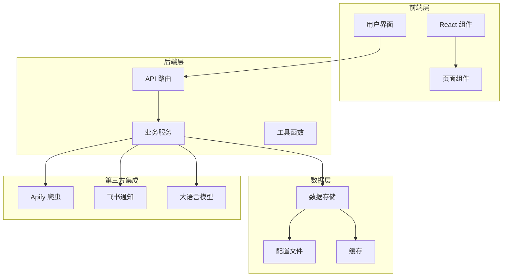
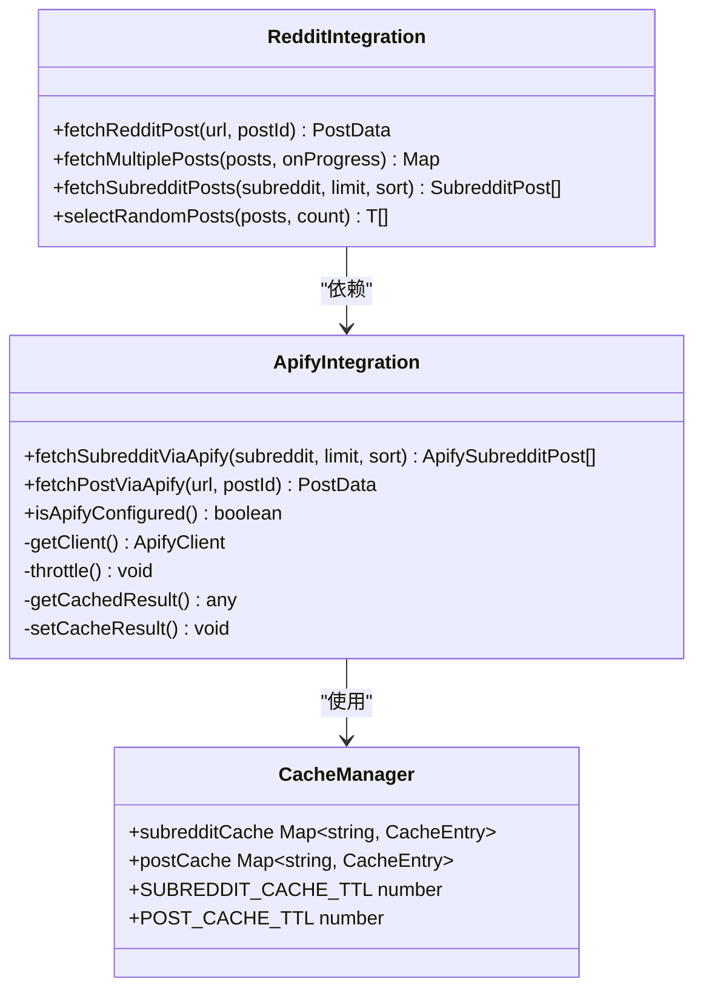
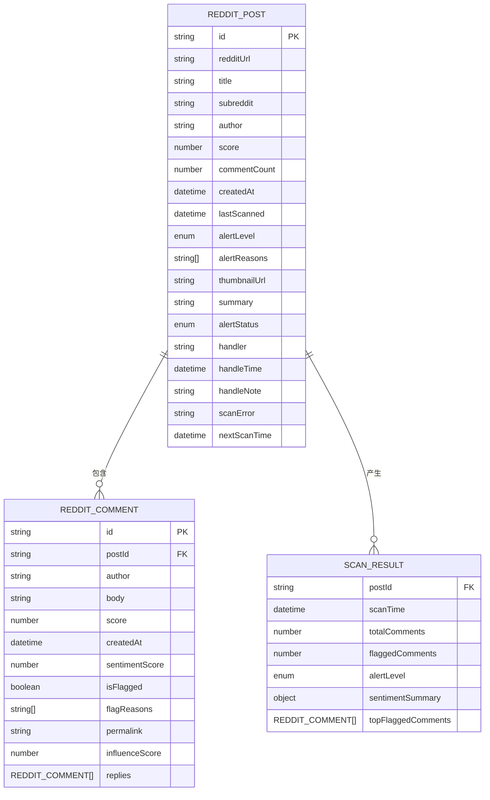
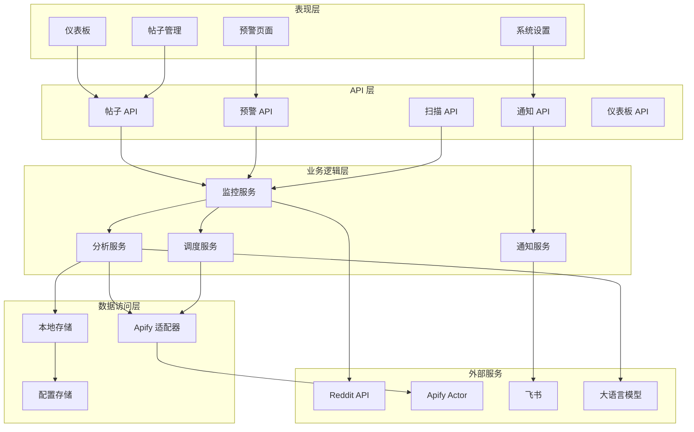
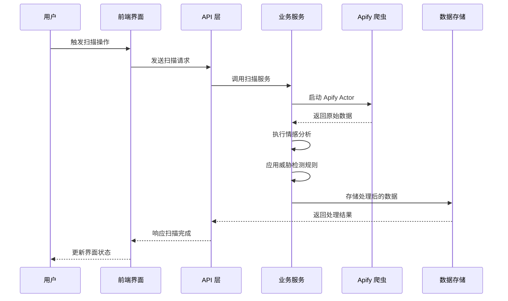
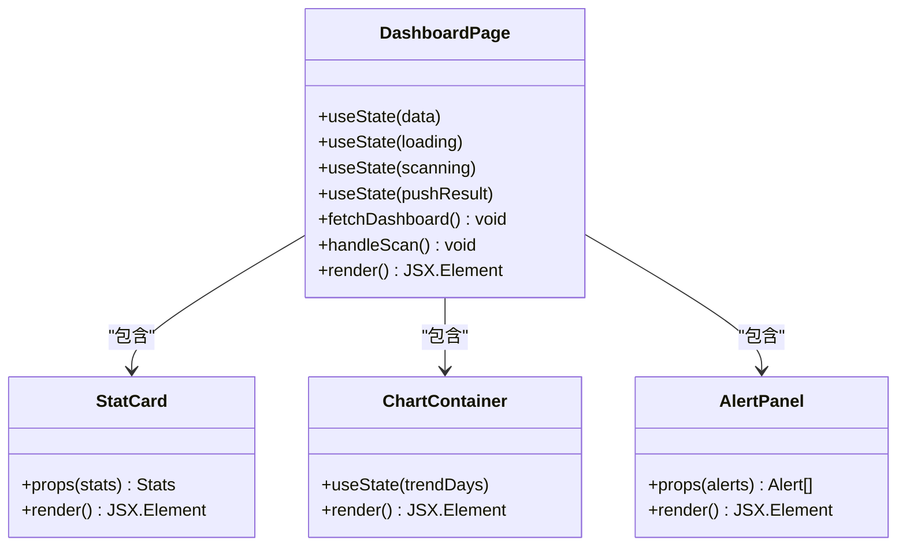
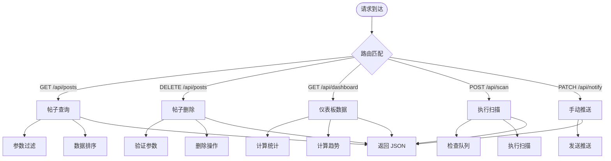
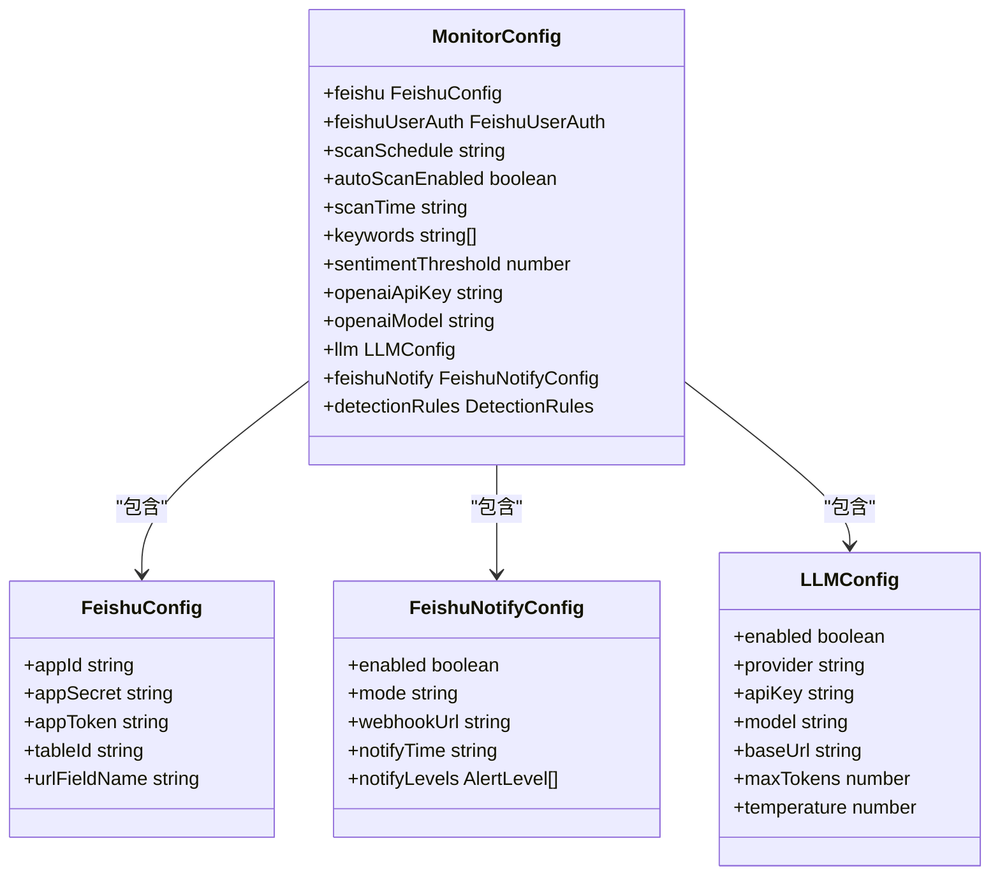
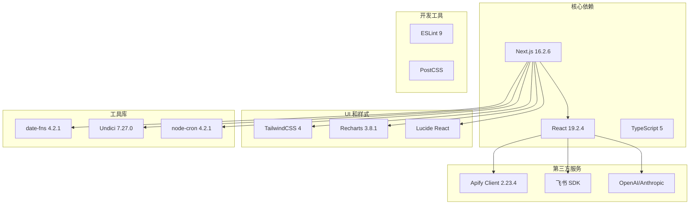
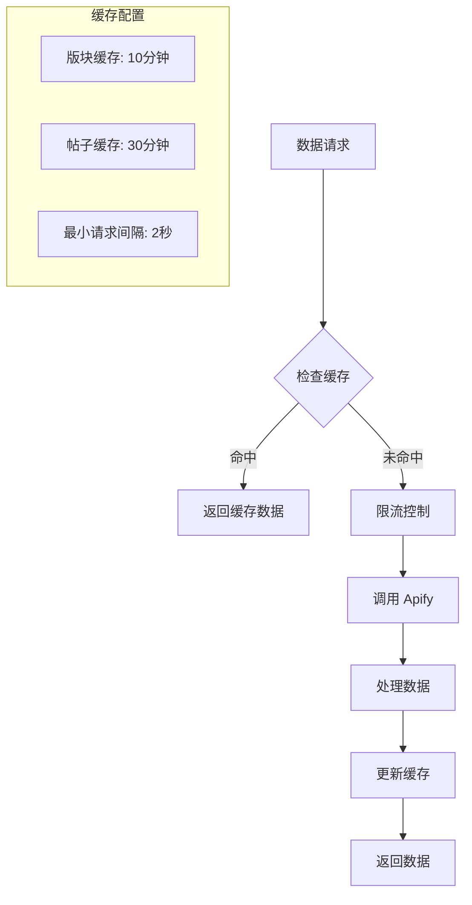

# 项目概述

<cite>
**本文档引用的文件**
- [README.md](file://README.md)
- [package.json](file://package.json)
- [src/lib/apify.ts](file://src/lib/apify.ts)
- [src/lib/reddit.ts](file://src/lib/reddit.ts)
- [src/lib/types.ts](file://src/lib/types.ts)
- [src/lib/scheduler.ts](file://src/lib/scheduler.ts)
- [src/lib/store.ts](file://src/lib/store.ts)
- [src/lib/sentiment.ts](file://src/lib/sentiment.ts)
- [src/lib/feishu-notify.ts](file://src/lib/feishu-notify.ts)
- [src/app/layout.tsx](file://src/app/layout.tsx)
- [src/app/page.tsx](file://src/app/page.tsx)
- [src/components/sidebar.tsx](file://src/components/sidebar.tsx)
- [src/app/dashboard-page.tsx](file://src/app/dashboard-page.tsx)
- [src/app/api/posts/route.ts](file://src/app/api/posts/route.ts)
- [src/app/api/dashboard/route.ts](file://src/app/api/dashboard/route.ts)
- [src/app/api/scan/route.ts](file://src/app/api/scan/route.ts)
- [src/app/api/notify/route.ts](file://src/app/api/notify/route.ts)
- [next.config.ts](file://next.config.ts)
- [data/config.json](file://data/config.json)
- [AGENTS.md](file://AGENTS.md)
</cite>

## 目录
1. [简介](#简介)
2. [项目结构](#项目结构)
3. [核心组件](#核心组件)
4. [架构总览](#架构总览)
5. [详细组件分析](#详细组件分析)
6. [依赖关系分析](#依赖关系分析)
7. [性能考虑](#性能考虑)
8. [故障排除指南](#故障排除指南)
9. [结论](#结论)

## 简介

Reddit 监控项目是一个基于 Next.js 的全栈应用，专门用于监控和分析 Reddit 社交媒体平台上的品牌声誉和恶意评论。该项目通过 Apify 爬虫自动化抓取 Reddit 数据，结合情感分析和威胁检测算法，为企业提供实时的品牌监控和预警服务。

### 核心目标
- **品牌声誉监控**：实时跟踪目标品牌的在线讨论情况
- **恶意评论预警**：自动识别和标记潜在的恶意评论
- **社交媒体分析**：提供情感趋势和关键词热度分析
- **自动化运维**：支持定时扫描和飞书通知推送

### 主要功能特性
- **Apify 集成**：通过 Apify Actor 自动化抓取 Reddit 数据
- **情感分析**：基于机器学习的评论情感评分系统
- **威胁检测**：多维度的恶意评论识别规则
- **可视化仪表板**：直观的数据展示和趋势分析
- **飞书集成**：自动化的预警通知推送
- **智能调度**：基于 cron 的定时任务管理

### 应用场景
- **企业品牌保护**：监控竞争对手和潜在威胁
- **危机公关**：快速响应负面舆情事件
- **市场研究**：收集消费者对产品和服务的反馈
- **合规监控**：确保社交媒体内容符合法规要求

### 核心价值主张
- **实时性**：基于 Apify 的自动化数据采集确保数据新鲜度
- **准确性**：多层检测机制提高预警准确率
- **可扩展性**：模块化设计支持功能扩展
- **易用性**：直观的可视化界面降低使用门槛

## 项目结构

该项目采用现代化的 Next.js 应用架构，遵循 App Router 文件系统约定，实现了清晰的前后端分离和功能模块化。

**图表来源**
- [src/app/layout.tsx:1-23](file://src/app/layout.tsx#L1-L23)
- [src/app/page.tsx:1-14](file://src/app/page.tsx#L1-L14)
- [src/components/sidebar.tsx:1-96](file://src/components/sidebar.tsx#L1-L96)

### 技术栈选择

项目采用了经过验证的现代技术栈，确保了开发效率和运行性能：

- **前端框架**：Next.js 16.2.6，提供 SSR、静态生成和现代化开发体验
- **UI 库**：React 19.2.4 + TailwindCSS 4，构建响应式用户界面
- **状态管理**：React Hooks + 内置状态管理
- **图表库**：Recharts 3.8.1，提供丰富的数据可视化能力
- **类型系统**：TypeScript 5，增强代码质量和开发体验

**章节来源**
- [package.json:14-36](file://package.json#L14-L36)
- [next.config.ts:1-28](file://next.config.ts#L1-L28)

## 核心组件

### Apify 集成层

Apify 集成是整个系统的核心，负责从 Reddit 获取原始数据。项目配置了两个专用的 Apify Actor：

- **spry_wholemeal/reddit-scraper**：用于抓取 Reddit 版块帖子列表
- **neatrat/reddit-scraper**：用于精确抓取单个帖子及其评论

**图表来源**
- [src/lib/apify.ts:1-280](file://src/lib/apify.ts#L1-L280)
- [src/lib/reddit.ts:1-94](file://src/lib/reddit.ts#L1-L94)

### 数据模型层

系统定义了完整的数据模型来描述 Reddit 帖子、评论和监控结果：

**图表来源**
- [src/lib/types.ts:9-58](file://src/lib/types.ts#L9-L58)

**章节来源**
- [src/lib/types.ts:1-194](file://src/lib/types.ts#L1-L194)

### 业务逻辑层

业务逻辑层包含了监控、分析和通知的核心功能：

- **监控调度器**：基于 node-cron 的定时任务管理
- **情感分析器**：计算评论影响力得分和情感分数
- **威胁检测器**：识别恶意评论和违规内容
- **数据存储器**：管理本地数据持久化

**章节来源**
- [src/lib/scheduler.ts:1-133](file://src/lib/scheduler.ts#L1-L133)
- [src/lib/sentiment.ts](file://src/lib/sentiment.ts)
- [src/lib/store.ts](file://src/lib/store.ts)

## 架构总览

系统采用分层架构设计，实现了清晰的关注点分离和职责划分。

**图表来源**
- [src/app/api/posts/route.ts:1-157](file://src/app/api/posts/route.ts#L1-L157)
- [src/app/api/alerts/route.ts](file://src/app/api/alerts/route.ts)
- [src/lib/scheduler.ts:63-100](file://src/lib/scheduler.ts#L63-L100)

### 数据流架构

系统的核心数据流包括数据采集、处理、存储和展示四个阶段：

**图表来源**
- [src/lib/apify.ts:106-176](file://src/lib/apify.ts#L106-L176)
- [src/lib/reddit.ts:12-56](file://src/lib/reddit.ts#L12-L56)

## 详细组件分析

### 仪表板组件

仪表板是用户交互的核心界面，提供了完整的监控和分析功能。

**图表来源**
- [src/app/dashboard-page.tsx:49-535](file://src/app/dashboard-page.tsx#L49-L535)

仪表板的主要功能包括：
- **实时统计**：显示监控帖子数量、预警级别分布、恶意评论率等关键指标
- **情感趋势**：通过面积图展示评论情感变化趋势
- **恶意类型分析**：使用柱状图展示不同类型恶意评论的数量分布
- **高风险帖子**：列表展示需要重点关注的帖子
- **最新恶意评论**：滚动展示最新的恶意评论内容

**章节来源**
- [src/app/dashboard-page.tsx:1-535](file://src/app/dashboard-page.tsx#L1-L535)

### API 路由层

系统采用 Next.js App Router 的 API 路由模式，实现了 RESTful 的后端接口。

**图表来源**
- [src/app/api/posts/route.ts:13-127](file://src/app/api/posts/route.ts#L13-L127)
- [src/app/api/dashboard/route.ts](file://src/app/api/dashboard/route.ts)
- [src/app/api/scan/route.ts](file://src/app/api/scan/route.ts)
- [src/app/api/notify/route.ts](file://src/app/api/notify/route.ts)

每个 API 路由都实现了相应的业务逻辑：
- **帖子管理 API**：支持查询、筛选、排序和删除操作
- **仪表板 API**：聚合计算各种统计数据和趋势数据
- **扫描 API**：触发数据采集和分析流程
- **通知 API**：手动触发飞书推送

**章节来源**
- [src/app/api/posts/route.ts:1-157](file://src/app/api/posts/route.ts#L1-L157)

### 配置管理系统

系统使用 JSON 配置文件来管理各种设置选项。

**图表来源**
- [src/lib/types.ts:146-159](file://src/lib/types.ts#L146-L159)
- [data/config.json:1-57](file://data/config.json#L1-L57)

**章节来源**
- [data/config.json:1-57](file://data/config.json#L1-L57)
- [src/lib/types.ts:77-159](file://src/lib/types.ts#L77-L159)

## 依赖关系分析

项目依赖关系体现了清晰的模块化设计和层次化架构。

**图表来源**
- [package.json:14-36](file://package.json#L14-L36)

### 关键依赖说明

- **Apify Client**：提供与 Apify 平台的集成能力，支持 Actor 调用和数据集管理
- **node-cron**：实现基于 Cron 表达式的定时任务调度
- **date-fns**：提供现代化的日期处理功能
- **recharts**：基于 Recharts 的数据可视化解决方案
- **lucide-react**：提供简洁美观的图标组件

**章节来源**
- [package.json:14-36](file://package.json#L14-L36)

## 性能考虑

系统在多个层面进行了性能优化，确保在大数据量下的稳定运行。

### 缓存策略

项目实现了多层次的缓存机制来提升性能：

**图表来源**
- [src/lib/apify.ts:11-50](file://src/lib/apify.ts#L11-L50)

### 限流机制

为了遵守 Reddit 和 Apify 的使用限制，系统实现了严格的限流控制：

- **请求间隔**：至少 2 秒的最小请求间隔
- **缓存 TTL**：不同数据类型的缓存过期时间
- **批量处理**：支持批量数据处理以减少 API 调用次数

### 内存优化

- **增量加载**：支持分页和增量数据加载
- **数据压缩**：对历史数据进行压缩存储
- **垃圾回收**：定期清理无用数据和缓存

## 故障排除指南

### 常见问题诊断

#### Apify 集成问题

**症状**：无法获取 Reddit 数据或出现 API 错误
**排查步骤**：
1. 检查 APIFY_TOKEN 环境变量是否正确配置
2. 验证网络连接和代理设置
3. 查看 Apify Actor 的运行状态
4. 检查请求频率是否超过限制

**解决方法**：
- 确保 APIFY_TOKEN 已正确设置
- 检查防火墙和代理配置
- 实施适当的重试机制
- 监控 API 使用配额

#### 飞书通知问题

**症状**：预警消息无法正常推送
**排查步骤**：
1. 验证飞书应用配置信息
2. 检查 webhook URL 的有效性
3. 确认用户授权状态
4. 查看推送日志和错误信息

**解决方法**：
- 重新配置飞书应用和权限
- 更新过期的访问令牌
- 检查网络连接和防火墙设置
- 实施错误重试和降级策略

#### 数据一致性问题

**症状**：界面显示的数据与预期不符
**排查步骤**：
1. 检查数据存储状态
2. 验证缓存一致性
3. 确认数据处理流程
4. 查看错误日志

**解决方法**：
- 清理缓存并重新加载数据
- 执行数据完整性检查
- 实施数据版本控制
- 建立数据备份和恢复机制

**章节来源**
- [src/lib/apify.ts:54-66](file://src/lib/apify.ts#L54-L66)
- [src/lib/scheduler.ts:24-36](file://src/lib/scheduler.ts#L24-L36)

## 结论

Reddit 监控项目是一个功能完善、架构清晰的全栈应用，成功地将 Apify 爬虫技术与现代前端框架相结合，为企业提供了强大的社交媒体监控解决方案。

### 项目优势

- **技术先进性**：采用最新的 Next.js 16 和 React 19 技术栈
- **功能完整性**：覆盖从数据采集到可视化的完整监控流程
- **可扩展性**：模块化设计支持功能扩展和定制化需求
- **用户体验**：直观的界面设计和丰富的数据可视化

### 技术亮点

- **自动化程度高**：通过 Apify Actor 实现完全自动化的数据采集
- **智能化分析**：结合情感分析和威胁检测算法
- **实时性保障**：基于定时任务的周期性扫描机制
- **多渠道通知**：支持飞书等多种通知方式

### 发展建议

- **性能优化**：进一步优化大数据量下的查询性能
- **功能扩展**：增加更多社交媒体平台的支持
- **AI 集成**：引入更先进的自然语言处理技术
- **监控增强**：添加系统健康监控和告警机制

该项目为类似的企业级监控应用提供了优秀的参考模板，展示了如何将现代 Web 技术与第三方服务集成，构建高效可靠的应用程序。